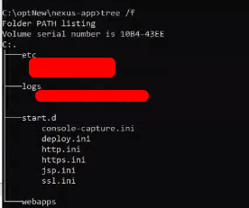
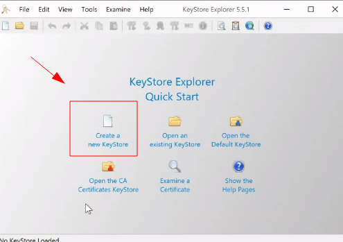
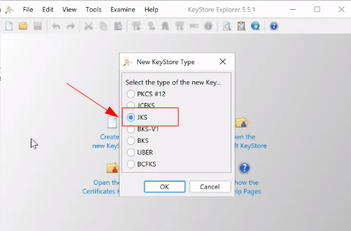
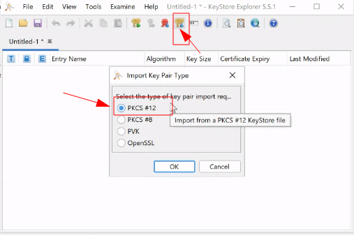
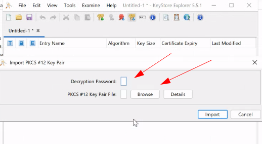
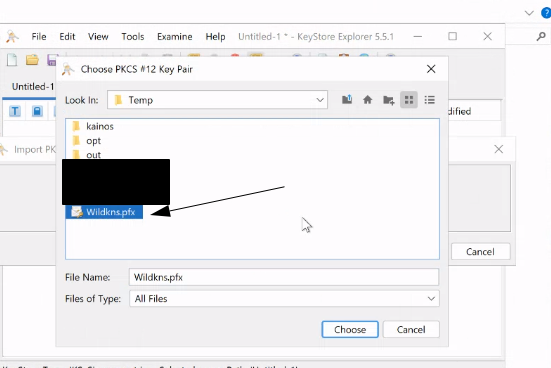
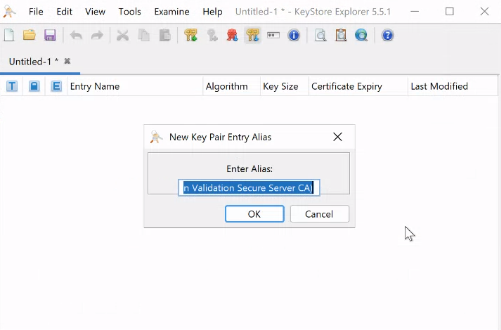
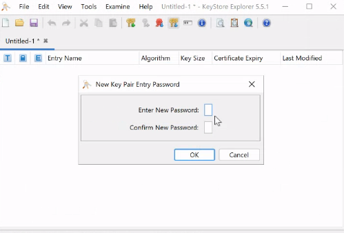
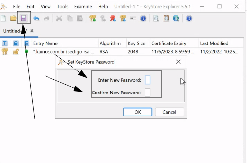
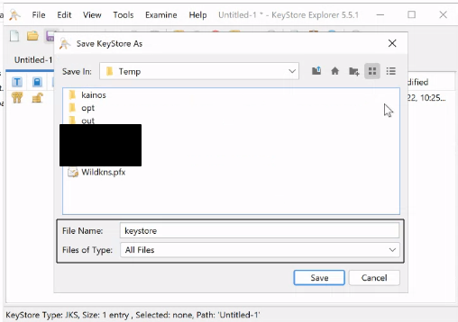

---

### Passo 1: Diretórios Jetty

- **Criando os diretórios padrão**

> Caso no windows crie via interface.

```
mkdir -p C:\opt\jetty
mkdir -p C:\opt\nexus-app
mkdir -p C:\opt\temp
```

**Descrição**

Os propósitos do diretório são os seguintes:

- C:\opt\jetty - Onde a distribuição do cais será descompactada

- C:\opt\nexus-app - Onde seu conjunto específico de aplicativos da web estará localizado, incluindo toda a configuração necessária do servidor para torná-los operacionais.

- C:\opt\temp - Este é o diretório temporário designado a Java pela Camada de Serviço (é o que Java vê como java.io.tmpdir Propriedade do Sistema).

*Isso é intencionalmente mantido separado do diretório temporário padrão de /tmp, pois esse local também funciona como o diretório de trabalho Servlet Spec. É nossa experiência que o diretório temporário padrão é frequentemente gerenciado por vários scripts de limpeza que causam estragos em um servidor Jetty de longa execução.*

---

### Passo 2: Baixe o jetty

- Faça o download do jetty em https://www.eclipse.org/jetty/download.html - (versão: 9.4...)
- descompacte dentro de c:\opt\jetty

---

### Passo 3: Configurar o ambiente

- Crie as variáveis de ambiente

```shell
JETTY_HOME=C:\opt\jetty
JETTY_BASE=C:\opt\nexus-app
TMPDIR=C:\opt\temp
```

- Restrição de diretórios no jetty

> Edite o arquivo `%JETTY_HOME%\etc\webdefault.xml`, procure por `dirAllowed` e mudar para `false`
> 
> ```xml
> <init-param>
>   <param-name>dirAllowed</param-name>
>   <param-value>false</param-value>
> </init-param>
> ```

---

### Passo 4: Configure o diretório base da aplicação

> Após configurar as variáveis de ambiente, use os comandos abaixo para criar o base dir:

```shell
cd %JETTY_BASE%
java -jar %JETTY_HOME%\start.jar --create-startd
java -jar %JETTY_HOME%\start.jar  --add-to-start=http,deploy,jsp,console-capture  # Caso sem https
java -jar %JETTY_HOME%\start.jar  --add-to-start=https,ssl,deploy,jsp,console-capture # Caso https - Item https
```



Descrição dos arquivos criados

> **console-capture.ini** - Onde fica as configurações de log.
> **deploy.ini** - Configurações dos path e arquivos do deploys.
> **http.ini** - Configuração do http (porta, host ...)
> 
> **https.ini** - Configuração do http (porta, host ...)
> 
> **ssl.ini** - Configuração de certificados

---

### Passo 5: Configurações personalizadas do jetty

- **Start.ini** - Configuração personalizadas de inicialização do jetty

>  Crie um arquivo start.ini (caso não exista), para adicionar configurações personalizadas na inicialização do jetty, como debug, plugin do apm-server ....

```shell
touch %JETTY_BASE%\start.d\start.ini # touch serve pra criar arquivo, você pode criar na mão
```

- **Timezone Banco**

>  Causa problema no banco, porque a maquina está em uma timezone diferente.

>  Edite o arquivo %JETTY_BASE%\start.ini e adicione:

```shell
Abra no editor de texto o arquivo
%JETTY_BASE%\start.ini

# Adiciona e as configurações ao final do arquivo
--exec
-Doracle.jdbc.timezoneAsRegion=false  # Serve para descosiderar
```

- **Logs**

Edite o arquivo %JETTY_BASE%\start.d\console-capture.ini e deixe:

```shell
## Para que cada novo log anexe ao arquivo existente
jetty.console-capture.append=true

## Quantos dias para reter arquivos de log antigos
jetty.console-capture.retainDays=30
```

- **HTTP** (Porta)

Edite o arquivo %JETTY_BASE%\start.d\http.ini e defina em qual porta o jetty vai rodar.

```shell
jetty.http.port=8080
```

---

### Passo 6: Configurando HTTPS - Certificados

1. **Adicionando ssl e https, no jetty**

>  Caso não tenha executado o item de https no passo 4: Use o comando abaixo para adicionar o modulo ssl e https no jetty:

```shell
java -jar %JETTY_HOME%\start.jar  --add-to-start=https,ssl,deploy,jsp,console-capture
```

2. **Crie uma senha ofuscada:**

> Necessário pra segurança.
> 
> A senha deve ser a senha do certificado e do keystore. (veremos isso mais pra frente)

```shell
cd %JETTY_HOME%\lib
java -cp jetty-util-<versao>.jar org.eclipse.jetty.util.security.Password suaSenhaSuperSecreta
```

- saida de ver algo do tipo

```
OBF:20ld1i9a1ysy1ri71x8c1bim1bhs1x8i1ri71yto1i6o20l9
MD5:f6440512900830666d40fbe12b88adaf
```

Esta é a nossa senha de exemplo: **suaSenhaSuperSecreta**. Sua representação ofuscada é OBF:20ld1i9a1ysy1ri71x8c1bim1bhs1x8i1ri71yto1i6o20l9.

3. **Montagem do keystore**

> Esse procedimento considera que você já tenha um certificado, do tipo **pfx**, caso seja diferente busque como criar um keystore do tipo **JKS** com o tipo do seu certificado.

Caso use linux use o comando abaixo:

```shell
keytool -importkeystore -srckeystore Wildkns.pfx -srcstoretype pkcs12 -destkeystore keystore -deststoretype JKS
```

Caso use windows us os passos abaixo:

- Use o aplicativo [key explore](https://keystore-explorer.org/)

- Abra ele como administrador, e crie um certificado vazio.



- Selecione o tipo com **JKS**



- Importe o certificado do tipo **PFX**



- Digite a senha do certificado e o procure no **browser** o local onde o certificado esta salvo.





- Confirme o nome do alias



- Coloque a senha do keystore (por facilidade, coloque a mesma senha do certificado)



- Salve o keystore (por facilidade, coloque a mesma senha do certificado)



- Salve com o nome de keystore



- Mova o arquivo key store para a pasta do jetty

```shell
# Entre na pasta onde salvou o keystore
cp  keystore %JETTY_BASE%\etc
```

- Configure as chaves e o caminho do certificado

> Adicione as linhas abaixo no arquivo `%JETTY_BASE%\start.d\ssl.ini`

```shell
## Porta da https
jetty.ssl.port=8443

## Keystore password
jetty.sslContext.keyStorePassword=OBF:20ld1i9a1ysy1ri71x8c1bim1bhs1x8i1ri71yto1i6o20l9 # senha gerada anteriormente - passo 6.2

## KeyManager password
jetty.sslContext.keyManagerPassword=OBF:20ld1i9a1ysy1ri71x8c1bim1bhs1x8i1ri71yto1i6o20l9 # senha gerada anteriormente - passo 6.2

## Truststore password
jetty.sslContext.trustStorePassword=OBF:20ld1i9a1ysy1ri71x8c1bim1bhs1x8i1ri71yto1i6o20l9 # senha gerada anteriormente - passo 6.2
```

- Acesse pela porta

```shell
https://localhost:8443 # vai falar que esta inseguro
https://<url do dominio>:8443 # vai falar que esta seguro
```

---

### Passo 7: Deploys do war e jars

- Movas os war e o front para %JETTY_BASE%\webapps

---

### Passo 8: Configuração do jetty como serviços

- Leia o tutorial de serviço

---

### Passo 9: Vendo logs

> Para ver os logs da aplicação

```shell
# abra a powershell
# entre na pasta %JETTY_BASE%\webapps
# digite o comando:

Get-Content nome_arquivo_log -Wait -Tail 100

# ou digite o comando com o caminho
# ex: 
Get-Content c:\opt\nexus-app\logs\2020-11-02.log -Wait -Tail 100
```

> Para ver os logs do serviço do Windows

```shell
# abra a powershell
# entre na pasta c:/opt/logs
# digite o comando:

Get-Content nome_arquivo_log -Wait -Tail 100

# ou digite o comando com o caminho
# ex: 
Get-Content c:\opt\logs\2020-11-02.log -Wait -Tail 100
```

---

## Configurações extra s

### XML de redirecionamento

> Caso queria redirecionar o que recebe em uma url crie um arquivo  xml junto as aplicações


```xml
<?xml version="1.0" encoding="UTF-8"?>
<!DOCTYPE Configure PUBLIC "-//Jetty//Configure//EN" "http://www.eclipse.org/jetty/configure_9_0.dtd">

<Configure class="org.eclipse.jetty.webapp.WebAppContext">
        <Set name="contextPath">/</Set>
        <Set name="war">/opt/jetty/webapps/<app>.war</Set>
</Configure>
```


