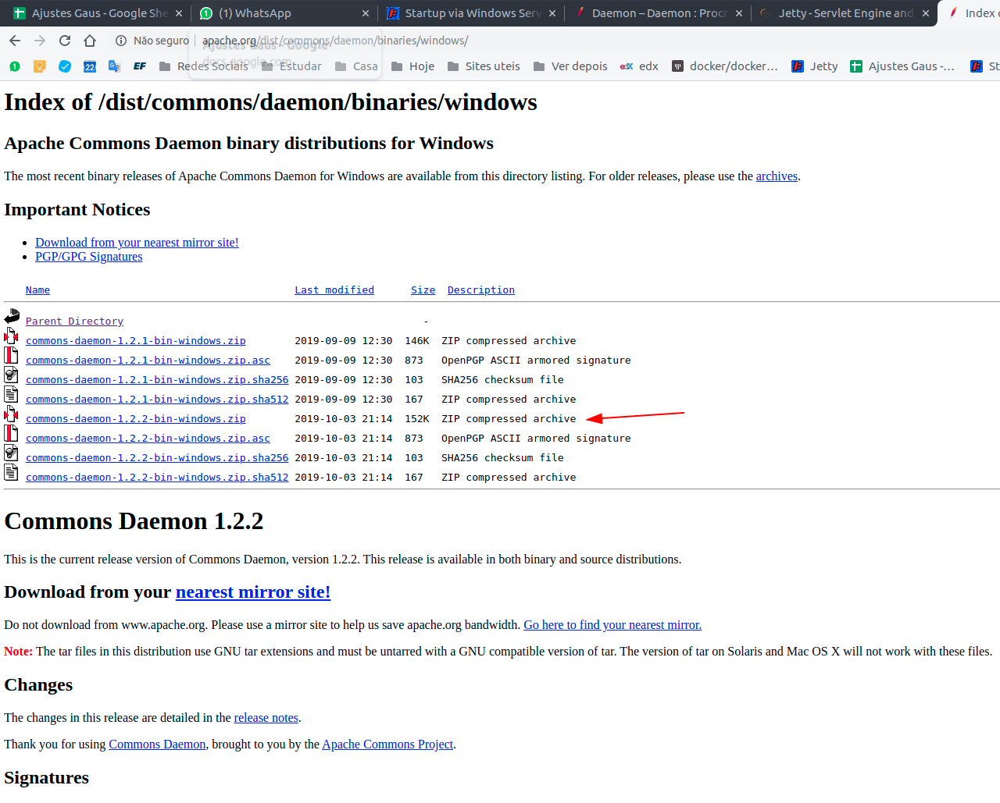
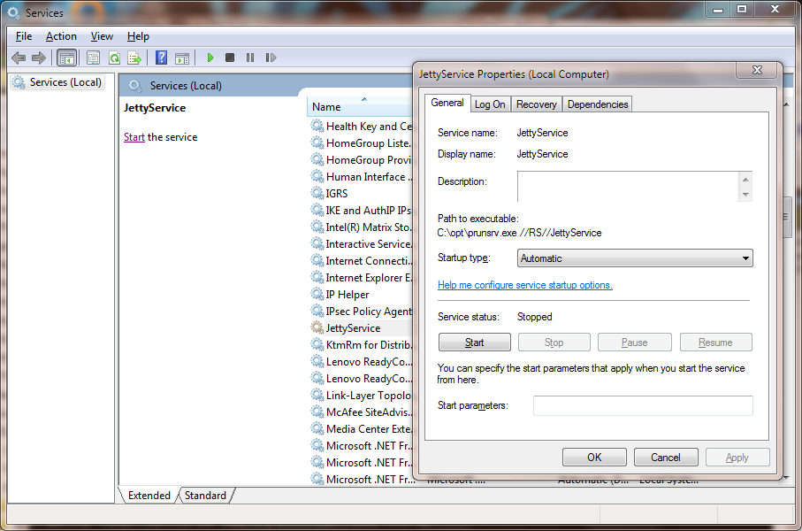

### Passo 1: Baixar e instalar o  Apache ProcRun.

- Faça o download de uma cópia dos binários nativos do Apache ProcRun [aqui](http://www.apache.org/dist/commons/daemon/binaries/).



- Descompacte e mova os arquivos **prunmgr.exe** e **prunsrv.exe** para C:\opt

---

### Passo2: Criar um serviço para o jetty

- dentro de **C:\opt** crie um arquivo com o nome **install-jetty-service.bat** com os valores:

```bat
@echo off
set SERVICE_NAME=JettyService
set JETTY_HOME=C:\opt\jetty
set JETTY_BASE=C:\opt\nexus-app
set STOPKEY=secret
set STOPPORT=50001

set PR_INSTALL=C:\opt\prunsrv.exe

@REM Service Log Configuration
set PR_LOGPREFIX=%SERVICE_NAME%
set PR_LOGPATH=C:\opt\logs
set PR_STDOUTPUT=auto
set PR_STDERROR=auto
set PR_LOGLEVEL=Debug

@REM Path to Java Installation
set JAVA_HOME=C:\Program Files\Java\jdk1.7.0_45
set PR_JVM=%JAVA_HOME%\jre\bin\server\jvm.dll
set PR_CLASSPATH=%JETTY_HOME%\start.jar;%JAVA_HOME%\lib\tools.jar

@REM JVM Configuration
set PR_JVMMS=128
set PR_JVMMX=512
set PR_JVMSS=4000
set PR_JVMOPTIONS=-Duser.dir="%JETTY_BASE%";-Djava.io.tmpdir="C:\opt\temp";-Djetty.home="%JETTY_HOME%";-Djetty.base="%JETTY_BASE%"
@REM Startup Configuration
set JETTY_START_CLASS=org.eclipse.jetty.start.Main

set PR_STARTUP=auto
set PR_STARTMODE=java
set PR_STARTCLASS=%JETTY_START_CLASS%
set PR_STARTPARAMS=STOP.KEY="%STOPKEY%";STOP.PORT=%STOPPORT%

@REM Shutdown Configuration
set PR_STOPMODE=java
set PR_STOPCLASS=%JETTY_START_CLASS%
set PR_STOPPARAMS=--stop;STOP.KEY="%STOPKEY%";STOP.PORT=%STOPPORT%;STOP.WAIT=10

"%PR_INSTALL%" //IS/%SERVICE_NAME% ^
  --DisplayName="%SERVICE_NAME%" ^
  --Install="%PR_INSTALL%" ^
  --Startup="%PR_STARTUP%" ^
  --LogPath="%PR_LOGPATH%" ^
  --LogPrefix="%PR_LOGPREFIX%" ^
  --LogLevel="%PR_LOGLEVEL%" ^
  --StdOutput="%PR_STDOUTPUT%" ^
  --StdError="%PR_STDERROR%" ^
  --JavaHome="%JAVA_HOME%" ^
  --Jvm="%PR_JVM%" ^
  --JvmMs="%PR_JVMMS%" ^
  --JvmMx="%PR_JVMMX%" ^
  --JvmSs="%PR_JVMSS%" ^
  --JvmOptions=%PR_JVMOPTIONS% ^
  --Classpath="%PR_CLASSPATH%" ^
  --StartMode="%PR_STARTMODE%" ^
  --StartClass="%JETTY_START_CLASS%" ^
  --StartParams="%PR_STARTPARAMS%" ^
  --StopMode="%PR_STOPMODE%" ^
  --StopClass="%PR_STOPCLASS%" ^
  --StopParams="%PR_STOPPARAMS%"

if not errorlevel 1 goto installed
echo Failed to install "%SERVICE_NAME%" service.  Refer to log in %PR_LOGPATH%
goto end

:installed
echo The Service "%SERVICE_NAME%" has been installed

:end
```

### Passo 3: Execute

> - Depois execute o arquivo, clicando duas vezes no **install-jetty-service.bat**.
> - Abra o Service Local e inicie o serviço.


