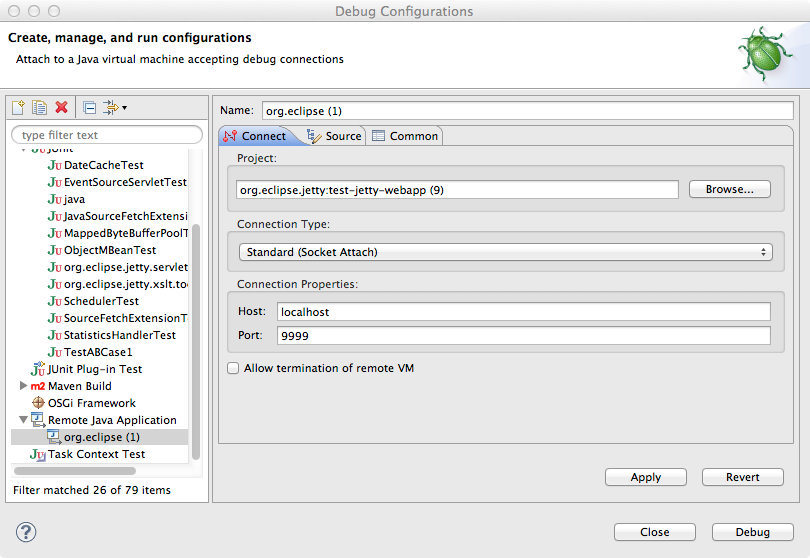
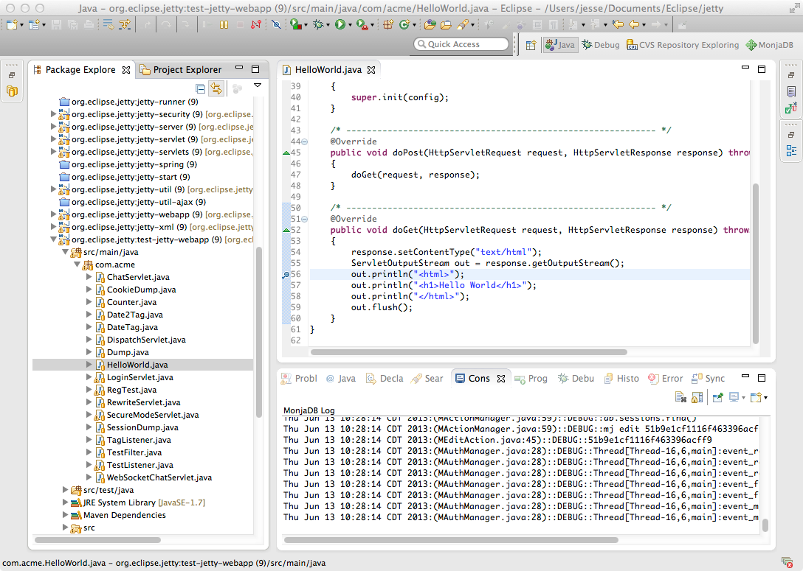
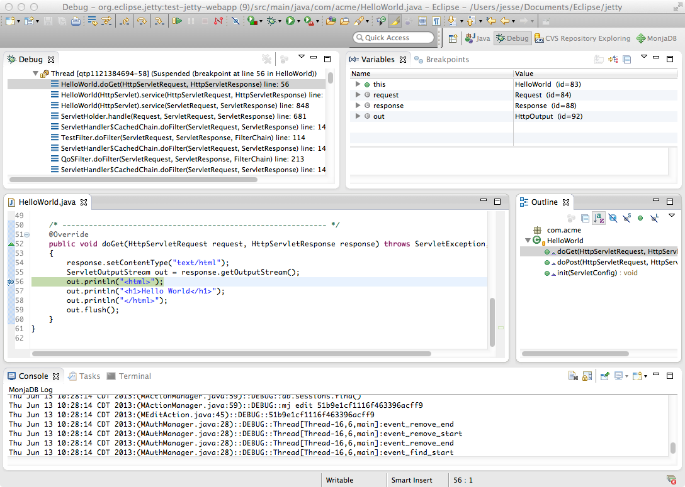

Supondo que você tenha seu aplicativo da web implantado no jetty, há duas maneiras diferentes de abordar isso:

### Via linha de comando

```shell
java -Xdebug -agentlib:jdwp=transport=dt_socket,address=9999,server=y,suspend=n -jar start.jar
```

### Através da start.ini

```shell
#===========================================================
# Configure JVM arguments.
# If JVM args are include in an ini file then --exec is needed
# to start a new JVM from start.jar with the extra args.
# If you wish to avoid an extra JVM running, place JVM args
# on the normal command line and do not use --exec
#-----------------------------------------------------------
--exec
-Xdebug
-agentlib:jdwp=transport=dt_socket,address=9999,server=y,suspend=n
# -Xmx2000m
# -Xmn512m
# -XX:+UseConcMarkSweepGC
# -XX:ParallelCMSThreads=2
# -XX:+CMSClassUnloadingEnabled
# -XX:+UseCMSCompactAtFullCollection
# -XX:CMSInitiatingOccupancyFraction=80
# -verbose:gc
# -XX:+PrintGCDateStamps
# -XX:+PrintGCTimeStamps
# -XX:+PrintGCDetails
# -XX:+PrintTenuringDistribution
# -XX:+PrintCommandLineFlags
# -XX:+DisableExplicitGC
```

---

## Depurando com Eclipse

### Vinculando com o Eclipse

- 1: No Eclipse, clique com o botão direito do mouse no projeto que contém o aplicativo da web implementado no jetty e selecione **Depurar → Configurações de Depuração** e crie uma nova configuração do **Aplicativo Java Remoto** . Verifique se a porta que você escolheu é a mesma que você adicionou em Habilitar depuração remota .



- 2: Em seguida, no seu aplicativo da web, você pode definir um ponto de interrupção em um servlet que, quando disparado, interromperá o encadeamento de processamento da jvm remota para aguardar comandos de depuração da instância do Eclipse.



- 4: O acesso a esse servlet no navegador, apontado para a distribuição de cais configurada por depuração remota, deve fazer a transição da instância do Eclipse para a visualização Debug padrão.


