---

### Prova de certificação

- Dominios

| Dominío                                                | percentual |
| ------------------------------------------------------ | ---------- |
| Domínio 1: Design de arquiteturas resilientes          | 30%        |
| Domínio 2: Design de arquiteturas de alta performance  | 28%        |
| Domínio 3: Design de aplicações e arquiteturas seguras | 24%        |
| Domínio 4: Design de arquiteturas econômicas           | 18%        |

- Tecnologias aws que podem vão cair na prova
  - Computação
  - Gerenciamento de custos
  - Banco de dados
  - Recuperação de desastres
  - Alta disponibilidade
  - Gerenciamento e governança
  - Microsserviços e desacoplamento de componentes
  - Migração e transferência de dados
  - Redes, conectividade e entrega de conteúdo
  - Segurança
  - Princípios de design sem servidor
  - Armazenamento

- Serviços abordados

> {}
- Análises:
  - Amazon Athena
  - Amazon Elasticsearch Service (Amazon ES)
  - Amazon EMR
  - AWS Glue
  - Amazon Kinesis
  - Amazon QuickSight
- Gerenciamento de Faturamento e Custos da AWS
  - AWS Budgets
  - Cost Explorer
- Integração de aplicações:
  - Amazon Simple Notification Service (Amazon SNS)
  - Amazon Simple Queue Service (Amazon SQS)
- Computação:
  - Amazon EC2
  - AWS Elastic Beanstalk
  - Amazon Elastic Container Service (Amazon ECS)
  - Amazon Elastic Kubernetes Service (Amazon EKS)
  - Elastic Load Balancing
  - AWS Fargate
  - AWS Lambda
- Banco de dados:
  - Amazon Aurora
  - Amazon DynamoDB
  - Amazon ElastiCache
  - Amazon RDS
  - Amazon Redshift
- Gerenciamento e governança:
  - AWS Backup
  - AWS CloudFormation
  - AWS CloudTrail
  - Amazon CloudWatch
  - AWS Config
  - Amazon EventBridge (Amazon CloudWatch Events)
  - AWS Organizations
  - AWS Resource Access Manager
  - AWS Systems Manager
  - AWS Trusted Advisor
- Migração e transferência:
  - AWS Database Migration Service (AWS DMS)
  - AWS DataSync
  - AWS Migration Hub
  - AWS Server Migration Service (AWS SMS)
  - AWS Snowball
  - AWS Transfer Family
- Redes e entrega de conteúdo:
  - Amazon API Gateway
  - Amazon CloudFront
  - AWS Direct Connect
  - AWS Global Accelerator
  - Amazon Route 53
  - AWS Transit Gateway
  - Amazon VPC (e recursos associados)
- Segurança, identidade e conformidade:
  - AWS Certificate Manager (ACM)
  - AWS Directory Service
  - Amazon GuardDuty
  - AWS Identity and Access Management (IAM)
  - Amazon Inspector
  - AWS Key Management Service (AWS KMS)
  - Amazon Macie
  - AWS Secrets Manager
  - AWS Shield
  - AWS Single Sign-On
  - AWS WAF
- Armazenamento:
  - Amazon Elastic Block Store (Amazon EBS)
  - Amazon Elastic File System (Amazon EFS)
  - Amazon FSx
  - Amazon S3
  - Amazon S3 Glacier
  - AWS Storage Gateway
    1 - Architecting for the cloud: Best practices
    2 - AWS well-architected framewo

{}

---

## 1 - Conceitos

---

### Escalabilidade

---

### Alta disponibilidade

No caso do AWS, refere-se as multi AZs, que dão a segurança de que caso uma fique de fora, a outras ainda estarão disponível.

---

### Serverless

- A computação **serverless**, ou sem servidor, consiste em plataforma que permite aos usuários desenvolver, rodar e gerenciar aplicativos sem ter a preocupação de construir, provisionar e manter a infraestrutura necessária para o projeto.
- SAM - **Serveless aplication model**
  - Framework para desenvolvimento e deploy de aplicações serveless.
  - Configurações são escritas em YAML.
- Serviços que são **Serveles** na AWS
  - SQS, SNS, Lambdas, Kinesis, DynamoDB, Cognito, S3, Aurora, Fargate ..

---

### Disaster Recovery in AWS

- DR é um modelo de arquitetura que visa prevenir desastres que possam afetar sua operação.
- A ideia e "ter uma copia de sua solução" em uma região afastada, que seria "acionada" quando sua região principal ficasse fora.
- Na **AWS** a ideia e semelhante, mas propõe que seus serviços e recurso sejam distribuído / replicados em mais de uma região.
- **Tipos**
  - **on-primeses -> on-primeses** -> tem um datacenter em SP e outro em Fortaleza. -> Solução bem cara de manter.
  - **on-primeses -> AWS** - uma estrutura Híbrida.
  - **AWS Região A -> AWS Região B** - Replica ou distribui os serviços e recurso em mais de uma região
- **Termos importante**
  - RPO - Recover point objective - está relacionado com a frequência de backup.
  - RTO - Recover point objective - está relacionado a tempo de recuperação de desastre.
    

#### Estratégias de DR

- **Backup e Restore**
  ​ 
  - A ideia aqui e realizar backups com uma certa frequência (RPO) e quando dá um problema se recuperar os dados do backup (RTO).
  - Tem uma alta tempo de recuperação (alto RTO).
  - Muito barato comparado as outras.
- **Pilot Light**
  ​ 
  - A ideia aqui é usar versões pequenas das aplicação (apenas para Apps Core) em outra regiões, e continuamente, sincronizar os dados entre elas. Caso ocorra um desastre seria só redirecionar os trafico para nova região e escalar a aplicação.
- **Warm standby**
  ​ 
  - A ideia aqui seria ter toda a infraestrutura replicada só que em escala menor, caso haja um desastre, se redirecionaria o trafico e escalava as aplicações.
- **hot site / multi site approach**
  
  
  - A ideia aqui e se ter as aplicações e recurso distribuídos entres as regiões, e os dados sincronizados assim se ocorrer um desastre o trafico seria redirecionado quase que instantaneamente.
  - Tem o menor tempo de recuperação (RTO), porém é uma solução mas cara.

#### Dicas

---

---

## 2 - Análises:

---

### AWS Athena

- Serviço **Serverless**, que permite realizar analises em arquivos no S3.
- Usa **SQL** para fazer queries nos arquivos.
- Tem conetores **JDBC** e **ODBC** para conectar aplicativos de BI.
- Suportar CVS, JSON, ORC, Avro ...
- Cobrado por uso, queries executadas e mede de dados escaneados.
- Pode ser usado em BI, Analitics, relatórios e analises de VPC Flow Logs, ELB Log ..
- Ideal para queries rápidas ad hoc e se integrar com o AWS **QuickSight** para facilidade de visualização, ele também consegue lidar com análise complexa, inclusive grandes junções, funções de janela e arrays.
- Usa o [Presto](https://aws.amazon.com/pt/big-data/what-is-presto/) com suporte completo a SQL padrão.
- **well architected**
  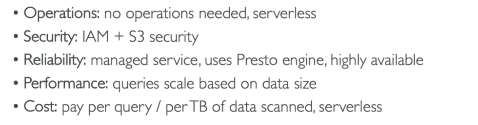

---

### AWS Elasticsearch

- Usado para buscas de qualquer campo, muito usado em conjunto com aplicações big data.
- Pode se disponibilizar um cluster com varias instâncias.
- Tem integrações com **Kinesis Data FireHose**, AWS IoT, **Cloud Watch Logs**.
- Seria o ELK stack da AWS.
- Foi subsistido pelo **OpenSearch Service**
- **well architected**
  

---

### AWS Glue

- Serviço gerenciado de **ETL** (extract, tranform, and Load).
- Serviço **Serverless**, possui 3 serviços:
  - **AWS Crawler** - Os rastreadores (Crawler) e classificadores examinam dados de fontes diferentes, classificam dados, detectam informações de esquema e armazenam meta-dados automaticamente no AWS Glue Data Catalog.
  - **AWS ETL ** - O núcleo do programa ETL fornece geração de código Python ou Scala para limpeza, enriquecimento, remoção de duplicatas e outras tarefas complexas de transformação de dados.
  - **AWS Glue Data Catalog** - fornece armazenamento centralizado e uniforme de meta-dados para rastreamento, consulta e transformação de dados usando meta-dados salvos.
- Permite extrair dados do **S3** ou **RBDMS** e transformar e enviar para o **RedShift**.
  
- Pode ser usado com **Athena**, **Redshift**, **EMR** para se criar um catalogo de dados
  (dataSet) reutilizável (GLUE Data catalog).
  

---

### AWS Kinesis

- Facilita coletar e processar e analisar fluxos (**steams**) de dados em tempo real.
- Opção ao **kafka** da AWS.
- Tem se um produtor > enviar um **record** > **kinesis data stream** > repassa o **record** > ao consumidores.
- O ordenação dos dados pode ser feita passando a mesma chave de partição, pois assim os dados serão enviado para o mesmo **shard**.
  
- Tipo de aplicação
  - **Kinesis Data streams** - Captura, processa e armazena fluxos de dados.
  - **Kinesis Data Firehose** - Carrega dados para armazenamentos no AWS.
  - **Kiness Data Analytics** - Analisa fluxos de dados com SQL e Apache Flink.
  - **Kinesis vídeo streams** - Capture, processa e guardar fluxo de dados de vídeos.

#### Kinesis Data streams

- Captura, processa e armazena fluxos de dados.
- É cobrado por **shard** provisionados.
- Cada fragmento (**shard**) permite entrada de 1 MB/s e saída de dados de 2 MB/s.
- Tem um período de retenção de 1 (padrão) a **365** dia.
- Os dados não podem ser deletados (são imutáveis).
- **Consumers** - Kinesis client library (KCL) ou AWS SDK.
- **Producer** - Lambda, Kinesis data firehose, kinesis data analytics.
- Pode ser usado como Streaming ETL que permitem que você limpe, aprimore, organize e transforme dados brutos antes de carregar seu data lake ou data warehouse em tempo real.

#### **Kinesis Data Firehose**

- Carrega dados para armazenamentos no AWS.
  
- Serviço totalmente gerenciado pela AWS (Auto Scale, Serveless).
- Pague apenas pelos dados processados.
- Serviço próximo do **tempo real.**

#### **Kinesis Data Analytics**

- Analisa fluxos de dados com SQL e Apache Flink.
  
- Executa os processos em tempo real.
- Totalmente gerenciado pela AWS.
- Pagos por **volume** de dados consumidos.
- Permite criar fluxo consulta em tempo real.
- Uso:
  - Analise de período de tempo.
  - Dashboard em tempo real.
  - Métricas em tempo real.

---

### AWS QuickSight

- Serviço de inteligência comercial (BI) promovido por machine learning, escalável, sem servidor, incorporável, construído para a nuvem.
- Permite que você crie e publique facilmente painéis interativos que incluem o Insights de Machine Learning.
- é baseado no “SPICE”, um mecanismo de cálculo super-rápido e paralelo na memória

---

---

## 3 - Gerenciamento de Faturamento e Custos da AWS

---

### AWS Budget

- Pode definir um orçamento que o alerte quando você exceder (ou estiver previsto para exceder) seu custo orçado ou valor de uso.
- Usado para gerenciamento de custo antes de uma demanda, ou seja definir orçamento para determinada demanda.
- Pode ser usado para saber quanto se usou daquele planejamento inicial.
- Através das tags permite ver onde se está gastando seu dinheiro.
- Pode gerar alarmes de gastos, enviar email, postar em tópicos **SNS** e configurar ações (Lambdas).
- Pode criar até 20.000 orçamentos. (soft Limit)

---

### AWS Cost explorer

- Serviço usado para ver, entender e gerenciar os gastos (com varias granularidade mês, ano , dia).
- Permite que você explore seus custos e uso da AWS em um nível alto e detalhado de análise, e permite que você mergulhe mais fundo usando uma série de dimensões de filtragem (por exemplo, serviço da AWS, região, conta de membro, etc.)
- Contem vários relatórios para analisar os gastos, e permite criar outros customizado.
- **Quando devo usar o AWS Compute Optimizer e quando devo usar o AWS Cost Explorer**?
  - **AWS Cost Explorer** se quiser identificar instâncias do EC2 subutilizadas e quiser entender o impacto potencial em sua fatura.
  - **AWS Compute Optimizer** se quiser ver as recomendações de tipo de instância além do downsizing. Faz o uso de aprendizado de máquina para identificar tipos de carga de trabalho e escolher automaticamente a metodologia de recomendação específica de carga de trabalho para eles.

---

---

## 4 - Integração de aplicações

---

### Amazon Amazon SNS

- Simple Notification Service.
- Tem escopo regional. Gerenciado pela AWS.
- Produtor -> **envia** > topico -> **envia** > assinante (pub/sub pattern).
- O tópico da **push** na mensagem para os assinantes.
- Usado quando se precisa notificar varios sistemas.
- Cada tópico pode ter 10 milhões de assinantes.
- Limite de 100000 tópicos. (soft Limit)
- Não retem mensagems, após notificar o assinante é descartada.
- Assinantes (http, email, lambda, mobile).
- **Politica de acesso**.
  - Permite definir uma política de quem pode enviar mensagens para o tópico.
- **Encriptação**
  - Em transito vem habilitado por padrão (HTTPS).
  - A do lado do servidor, vem desabilitada, e caso habilite pode selecionar um CMK (_Chave mestra do cliente_).
- **SNS + SQS - Fan Out pattern**
  - A ideia é usar um tópico SNS na frente de **N** fila para garantir que aquela mensagem possa se processado por **N** sistema, seja para evitar perda de dados ou por causas de serviços que só permitem notificar um único tópico (ex: **S3 events**).
    
  - **Message Filtering** - permite filtrar as mensagem e notificar os assinantes de acordo com os filtros.
    

---

### Amazon SQS

- Amazon Simple Queue Service.
- Tem escopo regional. Gerenciado pela AWS.
- Produtor -> **envia** > fila < **recupera** <- consumidor.
- O consumidor da um **pull** na fila para recupera a mensagem.
- Auto escalável vai de 1 mensagem por segundo a 10000 por segundo.
- Retém as mensagem de 1 a 14 dias.
- Não há limites de quantidade de mensagens na fila.
- O consumidor deve deletar a mensagem, pois não há um delete após a leitura.
- Mensagem de ate 254Kb de tamanho, é possível usar o S3 para guardar mensagem maiores.
- Possível usar métrica da **SQS** para dispara o **Auto Scaling Group** via CloudWatch metrics (**approximateNumerofMensages**).
- **Política de acesso**.
  - Permite definir uma politica de quem pode enviar mensagens e consumir da fila.
- **Encriptação**
  - Em transito vem habilitado por padrão (HTTPS).
  - A do lado do servidor, vem desabilitada, e caso habilite pode selecionar um CMK (_Chave mestra do cliente_)..
- **Message visibility timeout**
  - Quando uma mensagem é recuperado por um consumidor, ela fica invisível para os outros, esse tempo que invisibilidade é definido por esse campo.
  - Caso seja necessário é possível mudar essa visibilidade via API do SDK.
- **Delay Queues** - Permite definir uma atraso na **disponibilização** da mensagem para **leitura**.
- **Dead letter queue**
  - Fila onde pode ser enviada mensagens não processada, ou processadas com erro por varias vezes. Exemplo a mensagem foi processada 5 vezes sem sucesso, mova ela para **DLQ** para debbug futuro.
- **Request-Response System**
  - Ao postar na fila, é informado um correlationID e a fila de retorno da reposta. Assim que for processar a mensagem devolver o resultado na fila de retorno.
  - 

### SQS x SNS x Kinesis

- Apesar se serem serviços de mensageira, há diferencia sobre o funcionamento deles.
  

---

---

## 5 - Computação

---

### EC2

- Elastic Compute cloud.
- Maquinas nas nuvem que são possível usar sob demanda.
- O Armazenamento e feito com:
  - **Network-attached:**
    - EBS (Elastic block storage)
  - **hardware** (EC2 Instance Store)
- Tem que ter uma rede conectada.
- Tem que um firewall (**Security group**).
- Quando parado os dados de memorias são perdidos e os dados no volume **EBS** e mantido ate a próxima inicialização
- Caso queira manter os dados de memoria salvo quando para use a opção de **Hibernate** (hibernar), que mantém em memoria os dados.
- Quando destruído a instância os dados de memoria e do **EBS** principal são destruídos, mas é possível adicionar um segundo EBS ou marcar para preservar o default.
- **EC2 Nitro** - nova tecnologia de virtualização adotada pela AWS,
  - Melhora o uso da rede.
  - Melhora o **IOPS** (Input/output operations per second) dos armazenamento **EBS**.
- **EC2 vCPU**
  - Uma CPU, seria um core de um processador, pode conter varias threads.
  - Uma vCPU seria cada uma dessas threads.
  - É possível especificar qual a configuração de vCPU você precisa, por exemplo para uma aplicação node que é single thead pode se definir 1 vCPU.
- **Placement Groups** - Grupos de Posicionamento
  - Permite decide a estratégia posicionamento das instâncias EC2. ou seja onde vai ficar as instâncias de vai ser:
    - **Cluster** - Todas ais instâncias ficam juntas, tem baixa latência, mas ficam numa única AZ. (alta performance, mas tem um alto risco).
    - **Spread** - (espalhadas) As instâncias ficar espalhadas em servidores em diferentes AZ, com uma máximo de 7 por grupo por AZ. Usados em aplicações criticas.
    - **Partition** - Similar ao **Spread**, mas as instâncias ficam espalhadas em diferentes partições (conjunto de Racks) numa AZ. Pode escalar para centenas de instâncias por grupo, usadas com o Hadoop, Kafka, Cassandra.
      

---

#### Tipos de instâncias

- https://aws.amazon.com/pt/ec2/instance-types/
  

---

#### Precificação

- Todas são pagas por **horas** ativas.

- ##### **on-demand**

  - Não necessário contrato, só rodar quando necessário.
  - Recomendado para cargas de trabalho curtas, (dura 3 meses, ou 1 mês).

- ##### **reserved Instances**

  - Se faz um contrato de **1 a 3 anos,** se reduz o custo em ate **75%.**
  - Recomendado para **longas cargas de trabalho**, exemplo banco de dados
  - **Tipos de reservas**
    - **reserved Instances** - onde se reserva um instância de um determinado tipo.
    - **convertible reserved instance** - onde se reserva um instância e é possível alterar o tipo depois pode ter ate **54% de desconto**.
    - **scheduled reserved instance** - exemplo - toda terça entre 20 a 22 horas
  - **Tipos de pagamento**
    - **NURI** - no upfront payments - Nenhum pagamento adiantado - redução em ate **32%.**
    - **PURI** - partial up-front - Adiantado parcial - redução em ate **42% .**
    - **AURI** - All up-front - Tudo adiantado - redução em ate **43%.**

- ##### **spot instances**
  - Usado para aplicação **Serveless**, que podem ser **paradas a qualquer momento**, são maquinas que **estão paradas na AWS**, poder chegar ate 90% mais baratas. a desvantagens e que ela pode para a qualquer momento, quando quiser.
  - Não são recomendadas para aplicações que precisam de disponibilidades.
  - AWS pode interromper com uma notificação de 2 minutos.
    - **spot fleets**
      - Conjuntos de **spot instance** (pool de tipo da maquina e em diferentes regiões), a fim de ter maior economia para executar as carga de trabalho. São configuradas para _manter_ a capacidade alvo, iniciando instâncias de substituição após as Instâncias Spot na frota serem encerradas
      - Usados para aproveitar **spot instances com baixo custo**, pois o spot **fleets** pode automaticamente selecionar o conjunto mais barato para executar sua carga de trabalho.
- **dedicate host**
  - Aluga-se um servidor físico, para demandas de compliance principalmente.
  - Aluga-se por ate 3 anos.
  - Mas caro tipo de instância.
- **Saving plan**
  - Modelo de economia baseado no compromisso de uma quantidade de uso medido em horas num período de 1 ou 3 anos.
  - Economia de ate 66%, é flexível e não precisa se preocupar em gerenciar o custo por instância, apenas com a quantidade de horas usados nas cargas de trabalho
- **Capacity Reservation**
  - Permite reserva instâncias por um período "**curto de tempo**", sem precisar se comprometer com um plano de 1 ou 3 anos.
  - Usando por exemplo para reservar maquinas para a **black friday.**
  - Pode ser combinado com o **Salving plan.**

---

#### VPC (Virtual Private Cloud)

- Uma rede virtual dedicada à sua conta da AWS.
- Não há custo adicional por usar a **VPC**. Há cobranças para alguns componentes da VPC, como NAT Gateways.
  
  

##### ENI - interface de rede elástica

- É um componente lógico de redes em uma **VPC** que representa uma placa de **rede virtual**.
- É atachado como interface de rede no EC2.
- Pode ser criado separado e depois se atachado a uma instância (exemplo de IP Estático para coletar métricas).
- Tem escopo regional.
  
  

##### Secure Group

- Firewall virtual para sua instância para **controlar o tráfego** de entrada e saída.
- Fica restrito a uma **VPC**.
- (Regras de acessos) por padrão vem negando tudo na entrada (inbound) e permitindo tudo na saída (outbound).
- Realiza o controle de acesso em nível de **instância**, e não ao nível de sub rede.
  
- [Amazon VPC - Security Groups](https://docs.aws.amazon.com/vpc/latest/userguide/VPC_SecurityGroups.html)

##### Subnet - sub-redes

- Bloco de rede dentro de uma **VPC**.
- Quando se criar ele é privado por padrão.
- Para se fazer ela publica, deve se atachar um **Internet Gateway** e adicionar uma **tabela de rota** para que tenha acesso ao internet.

##### Gateway da Internet

- É um **Gateway** que você anexa à **VPC** para permitir a comunicação entre recursos na VPC e a Internet.

##### Route table

- É usada para direcionar o tráfego de entrada / saída de uma sub-rede.
- Ele contém vários CIDRs (intervalos de endereços IP) e para onde direcionar o tráfego apropriado.

##### NACL

- Network access control list.
- Camada de segurança opcional para sua **VPC** que funciona como firewall para controlar o tráfego de entrada e saída de uma ou mais sub-redes.
- É usada junto as **subnets**, por padrão já vem uma que libera todos os tráfegos de IPv4 / IPv6 de entrada e saída.
- O comportamento padrão de uma **ACL** e negar tudo tanto na entrada quanto na saída.

##### Virtual Private Gateway (VGW)

- É um **Gateway** lógico criado dentro da AWS, e pode ser usado tanto para sua conexão via VPN ou DX (Direct Conect).

##### AWS Direct Connect

- Conexão dedicada, fibra que vai do seu datacenter ate a AWS.
- o **Direct Connect (DX)** é um recurso que permite a conexão dedicada e direta com a AWS, fora da infraestrutura da Internet.

##### Elastic IP

- Permite solicitar um IPv4 publico.
- Permite alocar um IP publico a uma instância ou sub-rede.
- Tem um limite de 5 por região, porque IPv4 são limitados, e AWS coloca barreira obrigando a usar outras soluções.
- Não será cobrado se você usar a maquina, porém se ela estiver parado você será cobrado.

#### EC2 - Metadados

Acessando a API de meta-dados de EC2 e possível acessar informações sobre diversos dados usados pela instância apenas dando um **curl 169.254.169.254/latest/meta-data**.

- Possível recuperar informações de ID, hostaname e segurança da instância.
- **Só é acessível de dentro da instância EC2**, de dentro da **AWS**.

---

#### Elastic Load Balancing

- Distribui o trafico entre as instâncias de EC2.
- Usa o healh check para verificar o status da instâncias.
- Cria um endpoint, para ser a única entrada de requisições.
- Não gerencia sessões por padrão, existe uma **feature** chamada **Stick session,** que realiza isso, porém não é recomendado o uso, pois que controla o dados da sessão é a aplicação.
- Serviço gerenciado pela AWS.
- Pode ser configurado com **privado** ou **publico**.
- Envia métricas para o CloudWatch.
- Há 4 tipos de **ELB**:
  - **classic load balancer** CLB -(v1 - old generation - 2009)
    - http, https e tcp.
    - Checa a saúde via endpoint da aplicação.
    - Necessário adicionar instâncias manualmente.
  - **Application load balancer** ALB (v2 - new generation - 2016)
    - http, htttps e webSocket. - Usa target group para agrupara as instâncias EC2.
    - Tem suporte a **routinhg** baseado em (**listeners**) sendo:
      - **Path** ex:(uni.com/post & uni.com/users).
      - **hostmane url** (curriculo.uni.com e fotos.uni.com).
      - **query string** (uni.com?id=123&order=123).
    - Usados bastante numa arquitetura de microserviços
      
  - **Gateway load balance** GWLB - (v2 - 2020)
  - **Network load balancer** NLB -(v2 - new generation - 2017)
    - tcp, tls (secure tcp) e udp.
    - Tem uma latência menor que o ALB ~ 100ms vs (400 ms do ALB).
    - Tem um IP estatico por AZ, é possível usar um Elastic IP.
      

##### Target groups

- Agrupa as "maquinas" para onde o trafico será redirecionado.
- Essas "Maquinas" podem ser instâncias EC2, servidores on-premisses linkados via IP e lambdas.
- É responsável por checar a saúde das instâncias.

##### Stick session

- Permite que as requisições enviada as instâncias que já atenderam aquele cliente a fim de não perder os dados de sessão.
- Tipos cookies que podem ser usados
  - **aplication-based cookies**
    - **Custom cookie**
      - Gerado pelo target.
      - Pode incluir diversos atributos.
      - Pode ter um nome individual por target group.
      - Não use os nomes AWSALB, AWSALBAPP, AWSALBBTG, pois são reservados.
    - **application cookie**
      - Gerados pelo load balancer.
      - Cookie name AWSALBAPP.
  - **duration-based cookies**
    - Cookie gerados pelo load balance.
    - Tem uma duração especificada.
    - Tem os nomes AWSALB para ALB, AWSALBBTG para CLB.

##### Cross-Zone load balance

- Essa funcionalidade distribui o acesso igualmente pela quantidade de instâncias, independente de que zona ela esta, caso não habilitada será distribuído o trafico igualmente pela zonas de disponibilidade, e cada instância pode receber quantidade de trafico diferente.
  
- Configurações de disponibilidade
  

##### SSL Certificates

- Permite criptografar trafico entre cliente o **load balance** (in-flight encryption).
- Hoje temos o SSL e o TLS (este é mais seguro que o SSL).
- **CLB** - apenas uma aplicação e apenas um certificado.
- **ALB** - suporta múltiplos **listeners** (entenda como app diferente) e múltiplos certificados e usa **SNI** (server name indication) para isso.
- **NLB** - suporta múltiplos **listeners** (entenda como app diferente) e múltiplos certificados usa **SNI** para isso.
  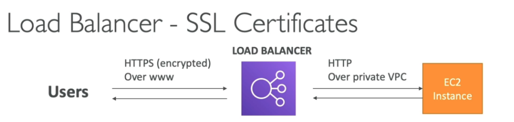
  

##### Auto Scaling group ALG

- Permite aumentar a quantidade de **EC2** de acordo com a demanda, ou alarmes gerados pelo **CloudWatch** com base nas métricas ou eventos.
- Não a cobrança, você só e cobrando pelas recursos (ec2, ebs ..) que são usados.
  - **Escabilidade** - habilidade de escalar vertical e/ou horizontal.
  - **Elaticidades** - Capacidade de escalar dinamicamente, através de alarmes ou métricas, ou reduzir as instâncias com a diminuição do volume de acesso, ou uso.
  - **Agilidade** - Velocidade de se ter infraestrutura a toque de caixa.
    
- **Composto pelo atributos**
  - Uma **configuração** \ **templates** de lançamento (define o tipo de maquina/ armazenamento / Security Group / SSH key pair / User Data que será usada nas instância que seram criadas) .
  - Seta as capacidade mínimas e máximas (quantidade de instâncias).
  - Rede onde ira criar as instâncias.
  - Informações sobre o **Load balance** onde esta linkado.
  - Política de escalabilidade, que define quando ira escalar para cima ou para baixo.
- **Scaling polices**
  - Política de escalabilidade, que define quando ira escalar para cima ou para baixo.
    - **Dynamic scaling police**
      - É possível usar métricas geradas pelo **CloudWatch** para definir as políticas (como media de consume de CPU, ou quantidade de requisição).
    - **Sheduled scaling police**
      - É possível agendar para uma determinado período.
    - **Preditive scaling police**
      - É possível usa **marchine learning** (analise do uso anteriores) para criar uma previsão de escalabilidade.
- **Scaling cooldowns** - tempo que deve ser esperado após ser lançada uma instância para validar se as métricas delas estão valida, ou se é preciso escalar.

##### Para a prova

- Existe uma política de encerramento no **auto scaling group:**
  - 1. Encontra a AZ com maior numero de instâncias.
  - 2 . Termina a que tiver o configuração de inicialização mais antiga.
- Ciclo de vida de uma instancia com o ASG
  
- Diferença entre Configuração de lançamento (Launch configuration) e templates de lançamento (Launch tempalte)
  - **Launch configuration** é legado, devem ser **recriado** toda vez que se alterar algum atributo
  - **Launch tempalte** é nova e:
    - Tem versionamento, que resolve o problema anterior.
    - Pode se cria subconjuntos de configurações que podem ser herdados por outros templates
    - Permite provisionar instâncias on-demand / spot instances ou um mix de ambos.

---

### AWS Elastic Beanstalk

- Feito para o desenvolvedor, permite ter uma visão centralizada do ambiente de deployado.
- Usados para aplicações web, ex: cria toa infraestrutura e só precisa passar o pacote que será usando. ex. (war para o tomcat).
- Usa todos os componentes do AWS (ec2, S3 ..).
- Seria uma PAAS.
- O serviço do Beanstalk é gratis, o uso dele não é cobrado, apenas os **componentes usados serão cobrados.**
- É totalmente gerenciado pela AWS.
- Usa como base o CouldFormation para criar os recursos.
- **Componetes**
  - **Aplicação** - Aplicação em si.
  - **Versão da aplicação** - define a versão da aplicação.
  - **Ambiente** - Ambiente onde a aplicação pode ser disponibiliza. - Web tier - usa uma balanciador de cargas. - Worker tier - usa filas.
    
    

---

### Amazon ECS

- Elastic Container Service - **Serviço de container proprietário da AWS.**
- Você deve prover e manter a infraestrutura (instâncias EC2). Ou usa o **Fargate** que abstrai esse gerenciamento.
- Não te tem custo, só paga as maquinas usadas (EC2, EBS ...).
- Para se subir container, primeiro é necessário configurar uma **ECS Task**, ele descreve com será construido o container, seria algo semelhante como um arquivo **docker-compose**. E na Task que se define as políticas de acesso a recursos que a aplicação vai usar alem de rede e grupo de segurança.
- As Task podem ser disparadas pelo **Event Brigde**, isso dispara a execução do ECS.
  
  
  

#### EC2 x Fargate

---

### Amazon EKS

- Amazon Elastic Kubernetes Service.
- Serviço de **kubernetes** totalmente gerenciado pela AWS.
- Custo de **$0,1** por hora por cluster kubernete ($75$ por mês) mais os recurso (EC2, EBS).
- Deploy complexo, requer uma pessoa que manja.
- É Open source assim caso migre de nuvem terá mais facilidade no processo.
- Usa o **ECR** para armazenar as imagens.
  

---

### AWS Lambda

- Trabalha com eventos.
- Tem de **128 MB** ate **10 GB** de memoria que pode ser usado.
- Tem escopo regional.
- Pague por **milissegundo** usado para executar o código.
- **Serveless** (não tem servidor para se preocupar).
- Se preocupe apenas com a aplicação não com a infraestrutura.
- Necessário monitorar bem, pois toda a infraestrutura e liberada após o uso.
- Provisiona servidores de acordo com as chamadas.
- Altamente disponível e totalmente tolerante a falha.
- Tempo de execução de ate **15 minutos.**
- Cobrado de 100 em 100 milissegundos de uso.
- Faz escalonamento horizontal e pode ter **ate 999 execução simultâneas.**
- Limitações
  - **Execução**
    - Alocação de memoria - 128MB - 10GB.
    - Tempo de execução - ate 15 minutos.
    - Variáveis de ambiente - ate 4KB.
    - Espaço em disco (no container do Lambda) - 512 MB.
    - Execuções simultâneas da mesma lambda - 1000 (Pode ser alterado com solicitação).
  - **Deploy**
    - Tamanho do pacote zippado com a função lambda - 50MB.
    - Tamanho do pacote com a função lambda - 250MB.
- Lambdas@Edge
  - É possível executar Lambdas em ponto de presenças, para auxiliar itens relacionados ao CDN , Route 53 ....
    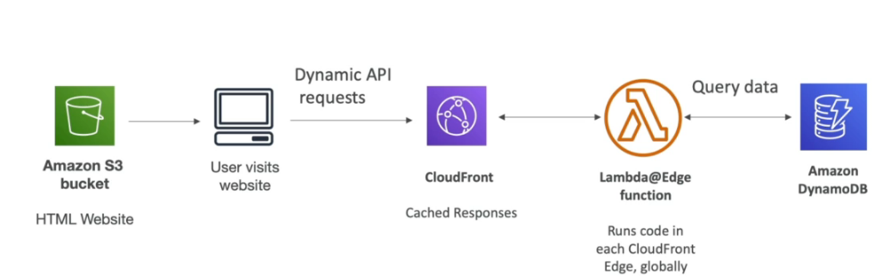

---

### AWS Step Functions

- Permite criar uma **workflow** para orquestrar **Lambdas functions**.
- O Fluxo (flow) é representado o com **maquina de estado Json.**
- Pode configurar para executar lambda sequencialmente, paralelas, com condições, e timeouts ..
- O workflow pode ser executado por no máximo 1 ano, após isso é necessário aprovar por mais 1 ano.

---

### AWS SWF - Simples Workflow Service

- Maneira antiga de orquestrar um grande fluxo de trabalho.
- Semelhante a Step Function, porém roda em EC2.
- Recomendado apenas para quando se precisar de:
  - Sinais externos para interferir no processo.
  - Quando um processo filho precisar retornar valor ao processo pai.

---

---

## 6 - Banco de dados

---

### RDS

Serviço de banco de dados relacional da AWS.

- Escala automaticamente em minutos.
- Serviço totalmente gerenciado pela AWS.
  - Provisiona SO, faz os bkpd e restores, monitora desempenho, faz manutenção.
  - Usa armazenamento do tipo EBS (gp2 ou io1).
  - Não temos acesso ao **SSH** da maquina onde esta o banco.
- Permite criptografia.
- Replica em mais de uma AZ, para segurança.
- Permite replicas de leitura (**read replicas**) para melhorar a performance.
- **Tipos**
  - **Postgres**
  - **Mysql**
  - **MariaDB**
  - **Oracle**
  - **Aurora**
- **Pilares da well architecture**
  

#### Aurora

- DB proprietário da AWS.
- 5 vezes mais performatico que o **mysql.**
- 3 vezes mais performatico que o **postgres**.
- Serviço de escopo regional, porém é possível usar em multi regiões podendo criar uma instalação o global, mas o que será uma **master** numa região e replicas de leituras nas outras.
- Faz replicação (6 copias) em 3 AZ.
- Pode se adicionar ate 15 replica de leituras, para melhorar o uso.
- Tem a opção serveless, não se preocupando com gerenciamento.
- Cresce de 10GB em 10GB podendo chegar ate 64TB de dados.
- 20% mais barato que o RDS comum.
- 
- 

##### Auroral - well architected

##### Conceitos avançados aurora

###### Aurora Replica - auto scaling

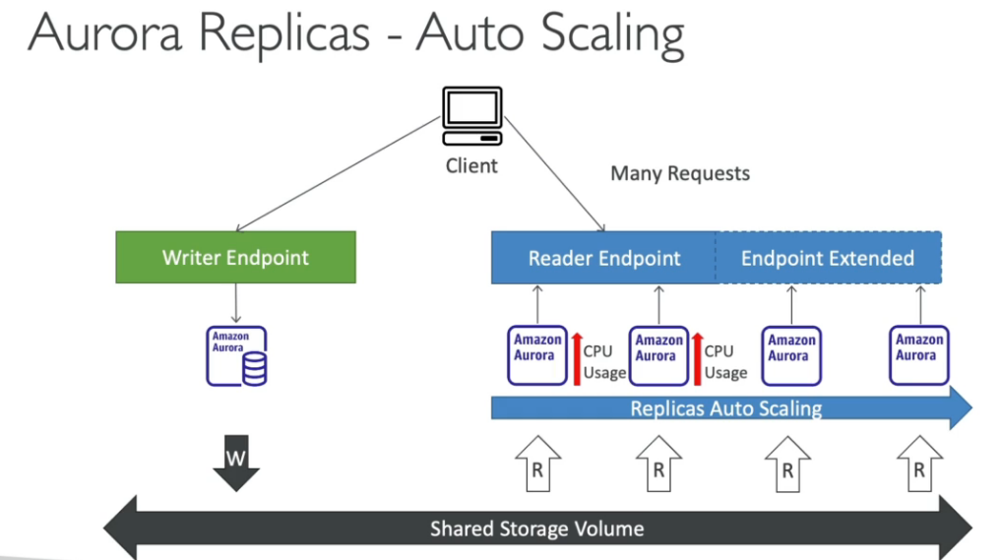

###### Custom endpoints

###### Serveless

- Scala automaticamente o banco de acordo com o uso.
- Bom para carga de trabalho que não são muito frequente.
- Não e necessário planejar, pois ele auto escala para atender a demanda.
- Pago por segundo de uso.

###### Multi Master

- Caso queira alta disponibilidade, nesse caso caso haja falha, todos os nós de leitura passa a escrever também.
- 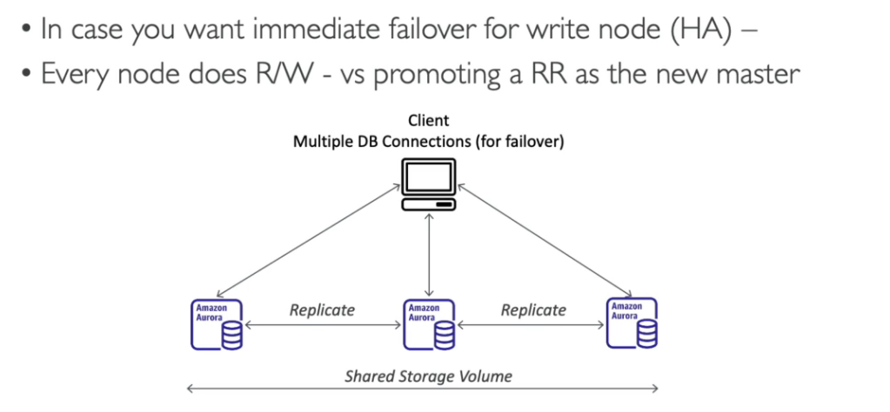

###### Global aurora

- **Cross region read** replica - útil para desastre **recover** .
- Global database
  - Se tem 1 região primaria (read/write) e 5 outras regioões segundarias, com replicação de menor que 1 segundo.
  - há 16 replicas de leitura por região segundaria.
  - Caso de desastre, promove-se outra região como primaria em menos de 1 minuto.
  - 

###### Marchine Learning

- Aurora permite usar **marchine learning** nos dados através de interação com os serviços **Amazon SageMaker** e **Amazon comprehand**.
- Não há necessidade de ter experiência em **marchine learning** para usar essa funcionalidade.
- Caso de uso:
  - Deteção de fraude, propaganda localizada, recomendação de produtos.
    

#### Backups

- São habilitado automaticamente no RDS.
- São realizados automaticamente.
  - Backup diário.
  - Logs de transações são feito backup a cada 5 minutos, o que permite que seja restaurado a qualquer ponto de 5 em 5 minutos.
- Tem uma retenção default de **7** dias, que pode ser estendido para **35** dias.
- Também é possível realizar snapshot do banco **(db snapshot)**.
  - Isso permite uma maior tempo de retenção.

#### Storage auto scale

Quando se cria um bando no RDS se passa quando ele deve ter, com essa funcionalidade ele aumenta o tamanho da banco ao se aproximar de limite de uso do espaço.

- Ajuda a aumentar o armazenamento dinamicamente. Quando detetado que esta próximo do limite.
- Necessário setar um _threshold_ de limite máximo de alocação de armazenamento.
- Automaticamente modifica o armazenamento se:
  - Tiver menos que **10%** de armazenamento alocado.

#### Read replicas

- Ajusta a escalar na leitura dos dados do banco.
- Podem ser criada em:
  - Na mesma **AZ** onde esta o banco..
  - Em outra **AZ**.
  - Em outra **Região**.
- Após criado, é realizado replicação dos dados de forma assíncrona **( por isso a consistência eventual)**

##### Caso de uso

- Imagine que se tenha uma aplicação em produção que armazena informação num banco, ai surgi outra aplicação que gera relatório, e que ler varia tabelas, nesse cenário se cria uma replica só de leitura para essa nova aplicação
  

##### Precificação

- Custo de rede (replicação).
  - Não há se a replica estiver na mesma região.
  - Caso seja em regiões diferentes há um custo adicional de transferência
    

#### Multi AZ (disastre recover)

- E criado uma replica do banco de dados em outra **AZ**, e os dados são sincronizados.
- E gerado um único **DNS name** para apontar para o banco tido com "master".
- Caso falha ele auto eleva o outro para "**master**" e não e necessário intervenção manual.
- Não é usado para escalar, apenas como medida de **disastre recover.**
- Caso já tenha um banco que seja **Single AZ** e queira converte-lo para **multi AZ**, será criado por debaixo dos panos um snapshot do banco, que será restaurado no novo banco em outra AZ, e então iniciara o processo de sincronização entre os bancos.
  

#### Encryption

- Para encriptação em repouso.
  - Tanto do **master** quanto das replicas de leitura com **AWS KMS - AES-256**.
  - Define a encriptação durante a criação, se o **master** não for encriptado as **replicas de leitura** não poderão ser.
  - Para Oracle e SQL Server há o **TDE** (Trasparent Data Encryption) que é outra maneira de fazer a encriptação do banco.
- Para encriptação de a bordo (in-flight / durante as transferência).
  - Pode se usar certificados SSL para realizar a encriptação.

#### Autenticação

- Pode ser feita usando usurário e senha.
- Para os bancos postgres, aurora e mysql, ha a opção de **IAM Autetication** que gera um token para se acessar o banco.
  - Centraliza os usuários, controla acesso via roles.
  - Todo o trafico seria feito usando SSL.
    

---

### ElastiCache

- Banco de dados em memoria, Redis o MemCached.
- Serviço gerenciado pela AWS.
- Caso de uso:
  - Pode ser usado como cache do banco de dado, para aliviar o acesso ao RDS.
  - Pode ser usado para guarda dados de sessão do usuário, permitindo assim criar aplicações sem estado (aplication **stateless**)
- **well architected**
  

#### Redis

- Deploy em multi AZ.
- Tem replicas de leitura para escalar a leitura, tem alta disponibilidade.
- Persiste os dados, o que permite realizar **restores features**.
- Permite encriptar os dados em:
  - Repouso com KMS.
  - Em transito com Redis AUTH.
    

#### MenCached

- Multi node para partição dos dados (compartimento - Sharding)
- Não tem alta disponibilidade (replicação).
- Não persiste dados e não tem backups.
- Usa arquitetura de multi-thead.
  

#### Comparação

#### Para Prova

- Caches no **ElastiCach**:
  - Não suportam autenticação com IAM.
  - As políticas criada usando IAM, só são usadas em nível de API AWS, não do banco em si.
- Autenticação:
  - **Redis**
    - Usa se o Redis Auth, onde se cria uma token de acesso quando se cria o cluster.
    - Isso e algo a mais, pois a segurança mesmo deve ser feita usando **Security Groups.**
    - Permite usar **SSL** para os dados em transito.
      
  - **MemCached**
    - Suporta autenticação baseada em SASL.
    - Lazy load feature
      

---

### DynamoDB

- NoSql do tipo chave e valor.
- Alto volume de dados.
- Escala horizontalmente automaticamente de acordo com numero de requisição.
- Permite usar o DAX (DynamoDB Accelarator) para melhorar o IO para milissegundos.
  - Cachea registo muito acessado, por 5 minutos (TTL)
- Replica em 3 AZ (Zona de disponibilidade).
- Tem um scopo regional.
- Responde em milissegundos.
- Permite criar tabela global, que replica os dados em diferentes regiões (Brasil,
  EUA, Europa por exemplo) para isso é necessário ativar o DynamoDB Streams.
- É schemaless (não tem schema forte).
- Dispara eventos para o **Event Bridge** via **DynamoDB Streams.**
- Consistências
  - **eventual (eventually)** -> Pega de qualquer a informação uma das replicas é 5
    vezes mais rápido, pois não valida se a informação é a mais recente.
  - **forte (strong)** -> valida se a informação é mais recente e para isso antes de
    retorna-la, valida em todas as replicas.
- Quando criado pode se escolher entre provisionado e on-demand caso provisionado é preciso definir a:
  - Unidade de capacidade de leitura (**RCU** - Read Capacity Units), sendo cobrado ($0.00013) por RCU.
    - 1 RCU - 1 leitura consistente (**strong**) lendo ate 4KB por segundo.
    - 1 RCU - 2 Leitura Eventual (eventually) lendo ate 4KB por segundo.
  - Unidade de capacidade de escrita (**WCU** - Write Capacity Units), sendo cobrado ($0.00065) por WCU.
    - 1 WCU - 1 escrita de ate 1KB
- **well architected**
  

---

### Redshift

- Banco para Data warehouse.
- Baseado no **Postgres**, mas não e usado para OLTP (online transation processing) e sim para OLAP (online analytical processing).
- Envia-se os dados em escala (de hora em hora) para data **warehouse**.
- **10x** melhor que outros **OLAP**, e escala para PBs (Penta bytes) de dados.
- Baseado em colunas e permite execução massiva de consultas (MPP).
- Pague pelo que usa, baseado em instâncias provisionadas.
- Tem uma interface SQL pra escrita de querys.
- Pode se integra com o **AWS Quicksight** or **Tableau** para tarefas de BI.
- Os dados podem ser carregados do S3, Do **DynamoDB** ou de qualquer branco via **DMS** (data migration service) ou via **Kinesis firehose**.
  
- Pode escalar de **1 nó ate 128** nós com cada nó tendo ate **160 GB** de espaço.
- Há dois tipos de nós:
  - **Nó líder** - usado para o planejamento da queries e agregação dos resultados.
  - **Nó de computação** - Responsável por executar as queries e enviar o resultado ao líder.
- Tem uma funcionado chamada **Sprectrum** que permite executar a queries direto no **S3**, sem precisar carregar os dados para o **RedShift**.
  
- **Redshift Enhanced VPC Routing** - permite copiar e carregar dados através de uma VPC sem passar pela internet.
- Não é multi **AZ**, cada nó fica numa **AZ**, por isso para ter recuperação de desastres é feito **Snapshots** incrementais que são internamente armazenados no S3.
- Os Snapshots são feitos automaticamente de a cada **8 horas** ou a cada **5GB** ou podem ser agendados.
  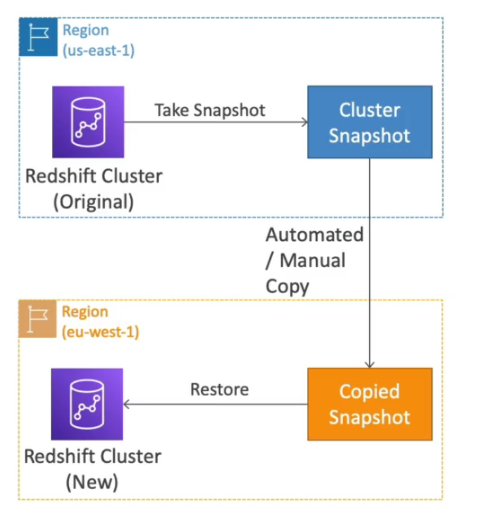

#### Well architected

---

### Neptune

- Banco gerenciado pela AWS usado para grafos.
- Tem esquemas flexível.
- Usado por exemplo:
  - Para relacionamentos de Redes Sociais ou para situações que tem muitos relacionamentos.
  - Para os artigos do Wikipédia.
- Replicado em 3 AZ, pode ter ate **15 replicas de leituras.**
- Visão **well architected.**
  

---

### EMR

- Ajuda a criar clusters Hadoop (Big data).
- Pode ser construido em cima de centenas de instâncias EC2.
- Suporta Apache Spark, HBase, Presto, Flink.
- Usa **Spot Instances** para **Auto Scale** (que reduz os custos).
- Uso: Big Data, Marchine Learning e Web Indexing.

---

### Como escolher o melhor BD

Para escolher o melhor banco de dados para lhe atender algumas perguntas são importantes a se fazer.

- A carga de trabalho pesada e de leitura ou escrita?
- Qual o thoughput (taxa em que os dados são transmitidos) se precisa?
- Os itens anteriores são contínuos ou são variam de tempos em tempos, ou seja há picos de acessos?
- Qual a quantidade de dados se deseja armazenar e por quanto tempo e qual seria o tamanho dos dados?
- Como serão acessado (segurança)?
- Qual e o modelo de dado? estruturados ou não? vai precisar fazer joins?
  - Schema forte, ou flexível.
  - NoSql ou RBDMS.
- Qual seria a latência, haverá concorrência?
- Qual o custo de licença?

#### Tipos de Bancos e 5 pillares

- **RBDMS** (SQL | OLTP)
  > - _RDS_ - Postgres, MySql, SqlServer, Oracle
  > - _Aurora_ - Bons para Joins e Dados normalizados.
- **NoSql**
  > - _DynamoDB_ (~Json)
  > - _ElastiCache_ (key-pairs)
  > - _Neptune_ (Graphs) - Sem Joins
- **Object Store **(não é bem um banco, mas serve para armazenar, e deve ser considerado na hora).
  > - _S3_ (Objetos grandes)
  > - _S3 Glacier_ - (backups | Arquivamento)
- **Data WareHouse** (SQL analytics | BI)
  > - _RedShift_ (OLAP)
  > - _Athena_ (S3 Querys)
- **Search** (Buscas)
  > - _ElasticSearch_ (json) - Busca por texto livre, ou estruturas pré definidas.
- **Graphs**
  > - _Neptune_ - Mostra relacionamento entre objetos

---

---

## 7 - Migração e transferência:

| **PRODUTO**                                                                                    | **DESCRIÇÃO**                                                                                                                   |
| ---------------------------------------------------------------------------------------------- | ------------------------------------------------------------------------------------------------------------------------------- |
| **[AWS Migration Hub](https://aws.amazon.com/migration-hub/)**                                 | Um local único para rastrear o andamento das migrações de aplicações                                                            |
| **[AWS Application Discovery Service](https://aws.amazon.com/application-discovery/)**         | Coleta informações de especificação, dados de performance e detalhes de processos em execução e conexões de rede dos servidores |
| **[AWS Server Migration Service](https://aws.amazon.com/server-migration-service/)**           | Serviço sem agente para migrar workloads apenas virtuais da infraestrutura on-premises ou do Microsoft Azure para a AWS         |
| **[AWS Service Catalog](https://aws.amazon.com/servicecatalog/)**                              | Crie e gerencie catálogos de serviços de TI aprovados para uso na AWS.                                                          |
| **[AWS Database Migration Service](https://aws.amazon.com/dms/)**                              | O AWS Database Migration Service ajuda você a migrar bancos de dados para a AWS de modo rápido e seguro.                        |
| **[AWS Application Migration Service](https://aws.amazon.com/application-migration-service/)** | Simplifique e agilize migrações enquanto reduz custos                                                                           |

---

### AWS DMS

- Serviço de migração de dados para a AWS.
- Permite migrar dados para o RDS (a nuvem) de um banco relacional on-primeses.
- Permite que o banco fique ativo durante a migração, pois usa os logs para a migração.
- Roda numa instância EC2.
- Permite migrações:
  - **homogéneas** - de um de um tipo (oracle) para um bando do mesmo tipo (oracle) na nuvem.
  - **heterogéneas** - de um banco de um tipo (oracle) para outro de outro tipo (mysql)
    - Usa o SCT (Schema conversion tool) para migrar DB diferentes
- Origem e destino
  

---

### AWS SMS

- Server Migration Service, serviço de migração de servidores.
- Pode migrar suas aplicações da infraestrutura física, do **VMware vSphere**, do **Microsoft Hyper-V**, do EC2, da VPC e de outras nuvens para a AWS.

---

### AWS DataSync

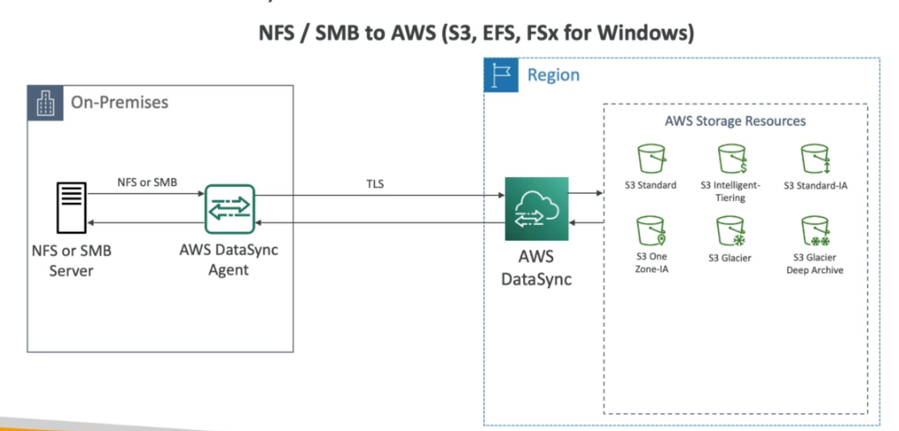

- Usado para mover grades quantidade de dados do on-primises para AWS.
- Permite sincronizar dados com S3 , FSx, EFS. A cada hora / dia/ semana
- Usa os protocores **SMS** ou **NFS** para mover os dados do **NAS** (network attached storage) para AWS.

---

### AWS Snow Family

- Dispositivo offline que permite realizar migração de grande quantidade de dados. Muito usado para levar dados para AWS sem usar a rede.
- Podem rodar instâncias EC2 ou lambdas, para processamentos de dados em áreas remotas, onde não se tem acesso ao recursos da AWS.
- Há um software chamado **OpsHub** que fornece uma interface gráfica para os dispositivos.
- Há 3 tipos:
  - **Snowball edge** - Usado para transportar TBs e PBs de dados, semelhante a uma maleta.
    - Storage otimized
      - (40vCpu 80Gb Memória) - com 80 TBs compatível com S3.
    - Compute otimized
      - (52vCpu 208Gb Memória) com 42 TBs compatível com S3.
      - Caso necessário pode vir com placa de vídeo.
  - **SnowCone** - Dispositivo menor com 8TBs de espaço, pesa cerca de 2,1 kg.
    - 2 vCPUS, 4 Gb de memoria, USB tipo c.
  - **SnowMobile** - Caminhão, usado para transporta dados acima de 10 PBs para AWS.
    
- Não é possível importar os dado do **Snowball** diretamente para o **Glacier**, primeiro se importaria para o S3 e com uma política de ciclo de vida se moveria para o **Glacier**.

---

## 8 - Gerenciamento e governança:

---

### AWS Backup

- Serviço de backup gerenciado pela AWS.
- Permite centralizar as configurações de backups.
- Suporta Cross-regions e cross-accounts backups.
- Pode ter backups agendados ou sob demanda.
- Permite aplicar uma política de tagueamento do backups.
- Permite criar uma política de backup (período) e tempo de retenção de um backup.

---

### AWS CloudFormation

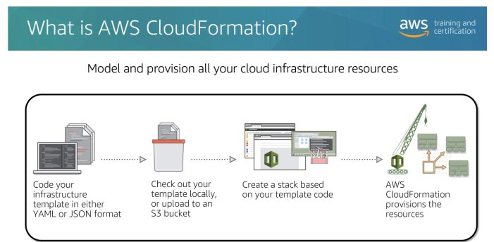

- Permite criar qualquer recurso da AWS via código (95%).
- Usado para criar infraestrutura como código.
- Usa Yaml ou json para declarar os recursos.
- Ele mesmo se resolve sob a ordem de criação dos recursos.
- Taggea de forma uniforme os recursos criados.
- Usando é possível ter uma estimativa de custo da estrutura que se vai criar.
- Habilidade de se criar infraestrutura em muitos contas, regiões, ambientes com o arquivos do template (StackSets). Permite criar infraestrutura globalmente.

---

### AWS CloudTrail

- Provem governança, **compliance** e **auditoria**, é o dedo duro da galera que fez merda.
- Habilitado por default, tem custo zero.
- Recebe informações do **SDK / console / cli / IAM User e IAM roles.**
- Permite ver tudo que foi feito na conta (inclusão, criação ou exclusão de recurso).
- Monitora todas as chamadas de **API** da conta.
- Guarda os logs por 90 dias no **cloud trail**, caso queira guardar mais tempo e possível configurar
  no S3 (não vem habilitado por default).
- Vem aplicado em todas as regiões por padrão.
- Tipo de eventos analisados:
  - **Eventos gerenciados.**
    - **Operações usados** em recursos:
      - Criar rules, criar S3 / EC2, alteração de recurso.
      - Separa os eventos de leitura e escrita.
      - **Analise manual do problemas**
  - **Eventos de dados**
    - Não são logados por padrão, e necessário habilitado e é **pago.**
    - Está em **nível do objeto,** para os serviços de Lambda, S3 e DymamoDB.
    - Separados por eventos de leitura e escrita.
    - **Analise manual do problemas.**
  - **Cloud trail insights**
    - Usado para avaliar ações e **detectar anomalias na conta.**
    - **Analise automática** dos problemas (anomalias). via **inteligência artificial**.
      - Tipo recurso em excesso.
      - Limites de recursos (**soft** and **hard**).
      - Permite conectar ao **eventBridge** para notificação das anomalias.
    - 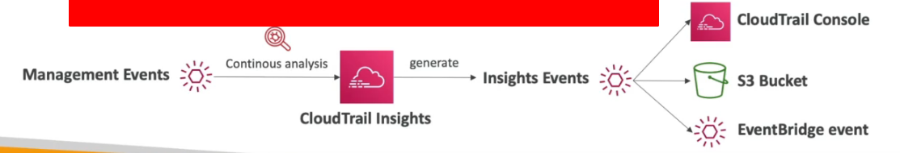

---

### AWS CloudWatch

#### Logs

- Coleta métricas e **logs** de tudo no AWS. Também é possível enviar logs através do SDK.
- Pode ser **exportado** para o S3 ou feito um stream para o **ElasticSearch** para analises futuras.
- **LogGroup** - Agrupamento de logs, pode ser por exemplo, todos os logs de uma aplicação.
- **LogStream** - Fluxo de logs de um recurso.
- Pode ser definido um período de retenção de logs, e configurado um batch de exportação para o S3.
- Pode-se ter um **tail** dos logs do **Cloud Watch** via CLI.
- A maioria dos problema que se da aqui e por causa de permissões configuradas errado.
- Permite aplicar filtros através de expressões regulares ou métricas ou IPs. E com isso dispara alarmes.
- Por padrão nenhum log e enviado das instâncias EC2, caso queira ter os logs é necessária habilitar o **CloudWatch Agent** e isso fará que o **CloudWatch unified Agent** nas instâncias envie os logs.
  

#### Metricas

- São coletadas de todos os serviços da AWS, São úteis para automatizar ações de acordo com status da métrica.
  - **Métricas** ->> thresholds ->> actions.
- Criar alarmes de acordo com as métricas.
- E com esses alarmes criar ações (posta numa fila do **SNS** ou acionar o **Auto Scale**)
- Existem métricas default com tempos pré definidos (a cada 5 minutos), mas se necessário e por um custo adicional é possível adicionar novas métricas detalhadas e alterar o tempo de coleta.
- o Free Tier disponibiliza ate 10 métricas detalhadas.
  
- Para criar uma métrica customizada, e só usar a API **putMetricaData** no sdk/cli.
  - Também é possível definir a resolução da métrica ( "tempo de coleta") sendo:
    - **Standard** - 1 minuto.
    - **High Resolution** - 1|5|10|30 segundos - mas tem um alto custo.
  - Permite enviar métrica antigas (ate duas semanas) e métricas futuras ate 2 horas sem que o **Cloud Watch** reclame.

#### Alarmes

- Permite definir alarmes para qualquer métrica.
- tem 3 status:
  - OK , INSUFICIENTE_DATA, ALARM.
- Os alarmes podem ser disparados através de métricas e filtros.

#### Dashboards

- Com as métricas é possível criar Dashboards, para facilitar a visualização.
- Os Dashboards são **globais**.
- Neles é possível incluir gráficos de diferentes **contas AWS e regiões.**
- É possível compartilhar um Dashboard com um terceiro via **cognito**.
- Ate 3 Dashboards são de graça, e demais se paga $3 dólares por mês por Dashboard.

#### Eventos

Permite criar eventos, ous seja ações predefinidas ou agendadas que podem disparar alguns serviços AWS (regras que define ações).

- Padrão de evento - intercepta eventos dos serviços AWS, tipo quando o status estiver pendente.
  - EC2 start, codeBuild Failure, S3
- Permite criar crons e eventos agendados.
- Gera json de evento, que pode ser enviado para um target **SNS**, **SQS** ...

#### **EventBridge** - (ponte de eventos)

- Permite criar uma canal que vai receber eventos (**event bus**) e criar regras para tratar esse eventos postados nesse canal.
- É possivel definir uma **estrutura para o evento** (schema , tipo avro), ou usar algum que já existe, com ele é possivel definir o formato do evento que vai ser diparado por um SDK.
- A mesma coisa que o **Eventos** com adicional de que :
  - Permite que algums **SAAS** envie eventos a **AWS**.
- Vai substituir os eventos.

---

#### AWS Config

- Ajuda a verificar o compliance da nossa conta de acordo com a linha do tempo.
- Mostra quais são as modificações que foram feitas.
- Pode usar tópicos para notificação.
- Pode se agregar as analises realizadas nas contas da organização em uma única conta (Uma
  conta de auditoria).
- É cobrado, pois fica escaneando os serviços habilitados.
- Faz monitoramento continuo.
- Serviço regional, mas nas analise é possível adicionar serviços globais.
- Contem varias regras (mais de 75), que servem para validar se um serviço esteja compliance, possivel criar próprias regras.
  Serviço pago $0.003 por regra habilitada
- Permite ver as alterações feitas que não estão compliance, e quem fez a alteração.
- Uso, pode adicionado uma regra que valida se há acesso **ssh** ao um **security group** e caso detecte é possível disparar uma ação ou uma notificação.
  

---

### AWS Organizations

- Consolide múltiplas contas em uma única conta.
- Permite consolidar a fatura de pagamento e custos.
- Unificar a parte de auditoria, monitoração e segurança numa única conta.
- Há um limite de 20 contas por organização.
- Com **organization** é possível definir políticas de acesso a recursos (SCPs) que podem ser aplicadas a uma conta. Exemplo, posso querer que a conta de dev não tenha acesso ao Athena, para isso crio uma política e aplico na conta de dev.
- Na AWS quando falamos em permissões o **DENY** tem sempre maior precedência do que o **ALLOW.** por isso se tiver um item negado na **OU Prod** esse recurso estará negado na **OU HR** mesmo que tenha uma política que da acesso.
- É possível organizar as organizações por:
  - BU (Business Unit) - unidades de negocio (departamento de vendas, financeiro, cobrança ..).
  - Ambientes (produção, desenvolvimento, homologação)
  - Projetos (Ultron, MArk 1 , SpaceX)

---

### AWS Resource Access Manager (RAM)

- Permite compartilhar e recursos entre contas duma mesma **AWS Organizations**.
- Somente o dono do recurso compartilhado pode exclui-ló.
- Recursos que podem ser compartilhados:
  - AWS App Mesh
  - **Amazon Aurora**
  - **AWS Certificate Manager Private Certificate Authority**
  - AWS CodeBuild
  - **Amazon EC2**
  - EC2 Image Builder
  - AWS Glue
  - **AWS License Manager**
  - **AWS Network Firewall**
  - Aqui estamos chamando o método `addFilterBefore` para adicionar o nosso filtro `Jwt
  - Amazon S3 on Outposts
  - AWS Resource Groups
  - **Amazon Route 53**
  - AWS Systems Manager Incident Manager
  - **Amazon VPC**

---

### AWS Systems Manager

- Permite criar grupos de recursos para facilitar a visualização de dados operacionais.

---

### AWS SSM Parameter Store

- Permite armazena configurações e segredos como parâmetros.
- Tem criptografia opcional usando o **KMS**.
- É Serverless, e fácil de usar com SDKs.
- Permite disparar eventos via **Cloud watch Events.**
- São declarados em forma de caminhos (**Paths**).
  
- Tem integração com o **CloudFormation**.
- Ate 10000 parâmetros com valor de ate 4KB é de graça por conta e região.
- Ate 100000 parâmetros com valor de ate 8KB é cobrado $0.05 por parâmetro.
  
- É possível definir TTL para parâmetros (**advanced tier**), para força a atualização ou deleta. um caso de uso muito bom seria armazenar o token de acesso no **parameter store** e definir um TTL de 25 minutos, quando ele expirar dispara uma notificação via **CloudWatch Events** que gera um novo token e atualiza ao parâmetro.
  

---

### OpsWork

- Permite trabalhar na AWS com Chef e puppet.
- É um serviço Híbrido (AWS / on-primeses).
- É uma alternativa ao SSM.
- Como migrar minhas receitas (hef e puppet) para a AWS -> com opsWork.
- Com ele não é possível usar o auto-scale da AWS, pois quem vai cuidar disso é o OpsWork.

---

### AWS Trusted Advisor

- Traz uma análise em tempo real dos serviços baseados nas boas práticas AWS.
- Fornece orientação que ajuda a reduzir custos e aumentar o desempenho e melhorar a
  segurança.
- Analisa e gera recomendações sobre:
  - Custo.
  - Performance.
  - Segurança.
  - Tolerança a falha.
  - Limites de serviços.
- Há dois tipos de planos
  - Comum - Faz checagem e recomendações comuns
  - Completo - Disponivel para planos de suportes Bussiness & Enterprise.
    - Da acesso programático via APIs

---

---

## 9 - Redes e entrega de conteúdo

---

### Amazon API Gateway

- Serveless, usado para criar APIs Rest.
- Possível conectar a serviços de login para validar token ou coisa do tipo.
- Tipos de API
  - APIs RESTful - Para servidores Http ou Lambdas.
  - APIs WEBSOCKET - Para aplicações bidirecionais com webSocket.
- Tipos de endpoints
  - **Edge-Optimized (default)** - Para clientes Globais (melhora a latencia).
  - **Regional** - Para apenas uma região
  - **Private** - Acesso apenas pela maquinas dentro de uma VPC.
- **IAM Permissions**
  - O API Gateway usa uma política para verificar quem tem acesso as APIs para "usuarios" da sua organização AWS, as credencias são enviadas no Header com **Sig 4**.
    
- **Lamdba Authorizer**
  - Conhecido como autorizador customizado, Se cria uma **lambda** para validar um Token e essa validação e cacheada por uma hora.
  - Paga pelo quantidade de lambda infocado.
  - Pode se usar OAuth / SAML ... para autorizar.
    
- **Cognito user pools**
  - Solução AWS, para cadastro de usuário, através dele é possível da a um usuário qualquer acesso a recurso da AWS.
  - Ajuda apenas na autenticação não na autorização.
  - Fornece um padrão de autenticação.
  - Permite usar autenticação externas (de terceiros , Google, Facebook).
    
    

---

---

### Amazon CloudFront

- Serviço de **CDN** (content delivery network).
- Cachea um conteúdo estático de uma aplicação em um edge location (ponto de presença).
- Diminui a latência de entrega de um conteúdo.
- Tem mais de 216 pontos de presença.
- Projete contra ataque DDOS.
- Possível bloquear um pais de acessar via **Geo Restriction**.
- Preço varia de região para região, é cobrado por quantidade de dados trafegados quanto mais mais barato será.
- **CloudFront Signed URL** - são comummente usados para distribuir conteúdo privado por meio da geração dinâmica de **CloudFront Signed URL** (uma para cada conteúdo).
- **CloudFront Signed cookies** - são comummente usados para distribuir vários conteúdo privados com uma única URL.
- É possível usar múltiplas origens no CDN, baseando em padrão da URL.
  
- uso:
  - **S3**
    - Para distribuição de arquivos.
    - Facilita o upload de arquivos
    - Protege com ataque de negação de serviço.
    - Pode se usar o **Origin Access Identity (OAI)** para que apenas CDN acesse o bucket e não redirecione para o bucket. Nesse caso o **bucket** pode continuar privado e acessando pelo CDN vai aparecer os arquivos, pois eles são acessado por um "usuário cdn" liberado.
      
  - **Origem customizada**
    - Como aplicação customizada / site estático
    - Servidor http num EC2
- Beneficio de usar um **cloudFront** em vez de **S3 Cross Region replication**.
  - CloudFront
    - Rede de pontos de presença.
    - Arquivos cacheado com tempo de vida de um dia.
    - Recomendado para arquivos estáticos.
    - Mais barato as requisições.
  - S3 Cross Region replication
    - É necessário configurar em o **bucket** em todas as regiões.
    - Recomendado para arquivos dinâmicos.
    - É possível escrever no bucket original, os outro são apenas de leitura.

#### **Origin Groups**

#### Field level Encryption

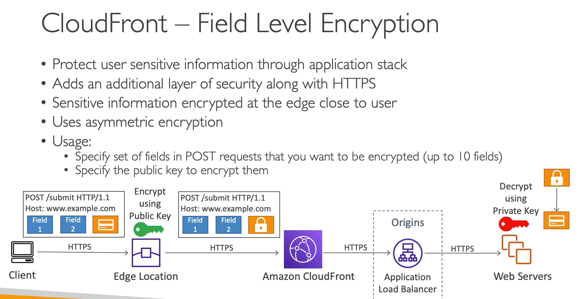

---

### AWS Global Accelerator

Serviço que melhora a disponibilidade de um serviço usando os ponto de presença, melhora a disponibilidade
em cerca de 60%.

- 2 Anycast IP são criado para redirecionar o trafico para os pontos de presença.
- É usado como proxy para as aplicações do AWS.
- Recomendado para servidores http, com conteúdo não estático.
  

---

### Amazon Route 53

- Serviço gerenciado de DNS.
- Serviço pago, $0.50 por zona configurada.
- Gerencia Roteamento da aplicação para regiões de acordo com alguns critérios muito usado como recuperação de desastre, pois identifica falhas e redireciona o trafico para outros lugares .
- Dentro do serviço também é possível comprar domínios com no **registro.br** .
  

#### Common Records

- A Record (IPV4) -> www.google.com -> 12.34.56.78
- AAAA Record (IPV6) -> www.google.com -> 2001::od:b8::7337
- CNAME -> hostname to hostname -> www.search.google.com -> www.google.com
  - É pago
  - Não funciona para registro to tipoo root ex: -> www.google.com -> www.search.google.com
- ALIAS -> hostname to aws resource -> www.exemplo.com -> (S3, RDS, ELB, CloudFront ...)
  - Na AWS é grátis.
  - Checa a saúde do recurso.
  - Funciona para registo to tipo root ex: -> www.google.com -> www.search.google.com

#### Routing police

São políticas de redirecionamento que é possível configurar no **route 53.**

- **Simple routing police** (política de roteamento simples).
  - A se chamar um domínio ele devolve o IP do servidor.
  - Não tem health checks.
  - Se cria um recorde e pode se retornar vários valores e o **browser** decide qual é o melhor para ele.
- **Weighted routing police** (política de roteamento com pesos).
  - É dado um peso para cada servidor, que define a percentagem de requisição que será
    redirecionado de acordo com o peso.
  - Se cria vários **record** com o mesmo nome, com retornos diferentes e pesos diferente.
- **Latency routing police** (política de roteamento baseado na latência)
  - Redireciona para o servidor de acordo com a menor latência.
  - Se cria vários **record** com o mesmo nome, com retornos diferentes para cada região.
- **Failover routing police** (política de roteamento de falhas)
  - Se defini servidores primários e de **failover**, caso o primário de algum problema será
    redirecionado o trafico automaticamente. Usa health checks.
  - Se cria vários **record** com o mesmo nome, com retornos diferentes cada um com seu **health check** e se define quem vai ser o primário e o segundario.
- **Geolocation routing police** (política baseada em Geo localização)
  - Redireciona a requisição de acordo com a localização do usuário.
  - Bom para direcionar tráficos para aplicações especificas para países.
- **Geoproximity routing police** (política de roteamento por proximidade)
  - Redireciona o usuário para o recurso mais próximo da localização do mesmo.
  - Diferencia se do anterior, pois ele é usado para países enquanto esse seria para locais dentro do pais.
- **Multi Value routing police** (Política de rateamento de multi valores)
  - Usado para devolver vários retorno e se um dele falhar, se terá outras para redirecionar, se a necessidade de consultar o **DNS** novamente.
  - Se cria vários **record** com o mesmo nome, com retornos diferentes cada um. Quanto o browser consulta é devolvido todos os retornos e o **browser** escolhe o que melhor lhe atende.

#### Health check

Pode se configurar health checks para monitora a disponibilidade e a saúde da aplicação.

- São pagos $ 0.50 para endpoints AWS - $ 0.70 para outros endpoints.
- Há custos adicionais de outras features (String matching, https, latency measurament).
- Pode se usar http, https, tcp para se configurar como será a verificação.
- Disponibiliza 15 diferentes hosts para checagem (em varias regiões)

---

### AWS VPC

- Virtual private cloud (rede privada na nuvem).
- Tem escopo regional.
- Toda região tem um VPC default, configurada com **subnets** publicas, ou seja tem acesso via Internet.
- Pode haver ate 5 VPCs por região (soft Limit).
- Cada VPC pode ter ate 5 CIDRs sendo:
  - No mínimo /28 com 16 IPs.
  - No máximo /16 com 65536 IPS.
- Como VPC é privado só são permitidos os ranges:
  - 10.0.0.0/8
  - 172.16.0.0/12
  - 192.168.0.0/16
- Resolução de DNS, há duas configurações possíveis
  - **enableDnsSuport** (configuração de resolução de DNS)
    - O padrão para VPC é **true**, serve para habilitar o suporte a resolução de DNS na VPC .
    - Private Dns
  - **enableDnsHostname**
    - true na VPC default mas **false** para novas VPCs.
    - Habilita o DNS para instâncias e a criação de **hostname** para instâncias.
    - Public Dns
      

#### CIDR

- Classless inter-Domain Routing (Roteamento entre domínios sem classe).
- Usado para repartir os endereços IPs e definir ranges de ips.
  - x.x.x.x/32 -> tem 1 IP
  - 0.0.0.0/0 -> todos os IPs
    

#### Subnets

- Bloco de rede dentro de uma VPC.
- Tem escopo de AZ.
- Quando se criar ele é privado por padrão.
- Para se fazer ela publica, deve se atachar um **Internet Gateway**.
- E adicionar uma tabela de rota de comunicação com o **Gateway**.
- AWS reserva 5 IPs (os 4 primeiros e o ultimo) em cada **subnet** ex: o bloco CIDR 10.0.0.0/24:
  - 10.0.0.0 - Endereço de rede.
  - 10.0.0.1 - Reservado para o VPC Router.
  - 10.0.0.2 - Reservado para mapear DNS.
  - 10.0.0.3 - Reservado para uso futuro.
  - 10.0.0.255 - Endereço de broadcast.

#### Internet Gateway

- Permite que uma **VPC** tenha acesso ao Internet.
- Escala horizontalmente e tem alta disponibilidade.
- Deve haver um **Internet Gateway** para uma **VPC**.
- Também fazem **NAT** para instâncias EC2 que tem IP publico.
- Lembrando que quem permite acesso ou não a Internet e a **tabela de Rotas.**

#### Route table

- Serve para direcionar o trafico de rede para as **subnets**, permitindo assim que se tenha acesso a Internet ou não.
- É boa pratica criar no mínimo duas tabelas de rotas por VPC:
  - Uma tabela de rotas publica que ter as **subnets** publicas, esta se liberar o trafico de qualquer lugar colocando como target o **Internet Gateway.**
  - Uma privada onde vai estar as **subnetes** privadas.

#### NAT Gateway

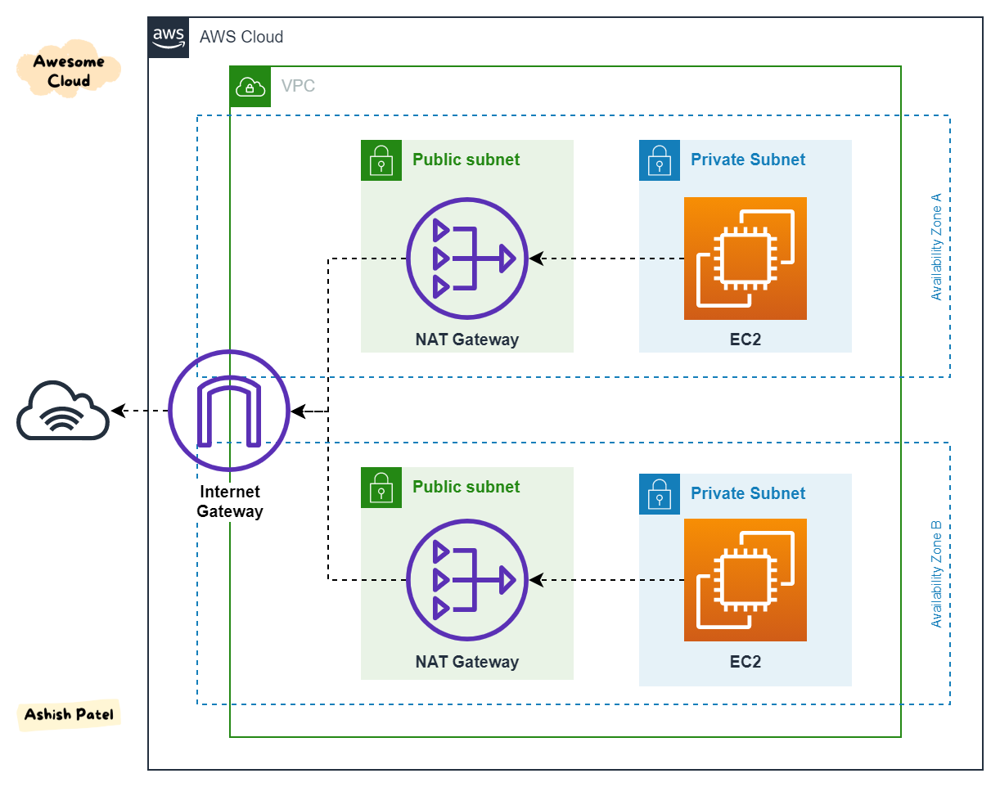

- As instâncias das **subnets** privadas precisam acesso a Internet para atualizações, é com usa de NAT que fazemos isso.
- Totalmente gerenciado pela AWS.
- Pague por hora e banda usada.
- São criado em uma **AZ** especifica e Usam Elastic IP. caso queira alta disponibilidade é recomendado criar e mais de uma **AZ**.
- Não pode ser usado por instâncias da mesma sub-rede, apenas por outras.
- Se criar um **NAT Gateway** numa **subnet** publica e apronta o trafico das subnets privadas para o NAT, que por sua vez via **route table** repassa ao **Internet Gateway**, como nas **subnets** privadas só que pode acessar e que esta na mesma **VPC** se mantém a segurança.

#### Secure Group

- (Regras de acessos) por padrão vem negando tudo.
- Só permite acesso, não preciso negar.
- É a primeira camada de segurança
- Esta no nível de instâncias. Pode ser entendido como firewall das instâncias EC2.
- Eles têm estado, o que significa que todas as alterações aplicadas a uma regra de entrada são automaticamente aplicadas a uma regra de saída.

#### NACL

- Network access control list, deve haver uma por **subnet**.
- Deve dizer o que é permitido e o que é negado. Seguindo a ideia de procedência indo de 1 - 32766, sendo quanto menor no numero maior a procedência.
- É a segunda camada de segurança.
- Esta no nível de Subnets. Pode ser entendido como firewall de **subnet**.
- Eles não têm estado, o que significa que qualquer alteração aplicada a uma regra de entrada não é aplicada automaticamente a uma regra de saída.

#### VPC Peering

- Permite conectar 2 VPCs, mas para isso não pode haver sob posição de **CIDRs**.
- Não são transitivas, ou seja no exemplo abaixo a VPC A não esta conectada a VPC C.
  
- Caso precise que elas se "vejam" e necessário criar um **VPC Peering** com as duas.
  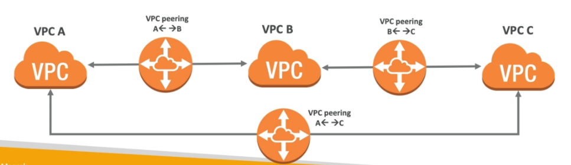
- Para cada conjunto (A - B , B - C, A - C) é necessário atualizar as tabelas de rotas, para que as instâncias possam se ver.
- Serviço **cross account** e **inter-regions**, ou seja é possível conectar VPCs de contas diferentes e em regiões diferentes.
- Possível configurar **Security Groups** que considerem VPCs pareadas.

#### VPC Endpoints

- Permite criar endpoints para acesso de serviços internos da AWS.
- Usado quando queremos que uma rede privada tenha acesso a recursos AWS, mas sem que esse trafico saia para a internet.
- Ele remove a necessidade de se ter uma **NAT Gateway** para acessar serviços da AWS.
- Tipos:
  - **Interface** - cria uma interface de rede (**ENI**) que fornece um IP para os serviços devem ser configurado o acesso na Security Group.
  - **Gateway** - usa um Gateway para provisionar um destino e deve ser configurado na tabela de rotas (**Route Table**)
- Caso use **VPC Endpoints** deve se atentar a usar as configurações de DNS, Outra coisa que pode gerar confusão e que a partir da hora que se usa o **VPC Endpoints** e necessário informar as região ao usar comandos do CLI, pois o **VPC Endpoints** tem escopo regional.

#### VPC Flow Logs

- Permite capturar o trafico IP dentro de uma VPC.
- Tipos:
  - **VPC Flow Logs** - se aplica a tudo dentro da VPC.
  - **Subnet Flow Logs** - se aplica as subnets dentro de uma VPC.
  - **ENI Flow Log** - Se aplica a uma interface de rede.
- Podem ajudar a monitorar traficos de rede dentro da VPC, ajuda na troubleshooting.
- Pode se usar o **Athena** ou **Cloud Watch Insights** para identificar anomalias.

#### Bastion Hosts

- Maquina numa rede publica da onde é possível conectar a instâncias em uma rede privada via SSH.
- Se conectar ao **Bastion Hosts** via SSH e a partir dele se conecta as instâncias na rede privada.

#### Virtual Private Gateway

- Permite ligar uma rede on-primise a AWS via VPN, para isso é necessario configurar um Virtual **Customer Gateway** do lado do on-primese e do lado da AWS cria se uma **Virtual Private Gateway**.

#### AWS Direct Connect

- Conexão dedicada, fibra que vai do seu **datacenter** ate a AWS.
- Demora cerca de 1 Mês para ser implementado toda a infraestrutura.
- O Direct Connect (DX) é um recurso que permite a conexão dedicada (vai de fibra ate o datacenter) e direta com a AWS, fora da
  infraestrutura da Internet.
- Exemplo de uso, o Itaú deseja ter a melhor conexão possível entre seus datacenter e a AWS, ele contrata um DX que vai ligar uma fibra do datacenter do Itaú até a AWS (Um parceiro).
- Caso se queira conectar mais de uma região deve se usar um **Direct Conect Gateway**
  
- Alta disponibilidade
  

#### Egress Only Internet Gateway

- Um **gateway** da Internet somente de saída é um componente da VPC horizontalmente escalado, redundante e altamente disponível que permite a comunicação de saída pela **IPv6** das instâncias na VPC para a Internet e impede a Internet de iniciar uma conexão **IPv6** com suas instâncias.

#### AWS PrivateLink - VPC Endpoint Services

- Permite compartilhar um serviço de uma VPC com outra VPC sem precisar que aquele serviço publico, ou sem precisar ligar as VPC com **VPC Peering.**

#### Transit Gateway

- **O AWS Transit Gateway** conecta VPCs e suas redes locais por meio de um hub central. Isso simplifica a rede e elimina os complexos relacionamentos de emparelhamento. Ele atua como um roteador de nuvem e cada nova conexão só é feita uma vez.
- Transit Gateway é um recurso regional e pode conectar milhares de VPCs na mesma região da AWS.
- Pode ser compartilhado com outras contas da AWS usando **RAM**.
- **Casos de Uso**
  - Para implementar a topologia Hub e Spoke.
  - Para conectar vários Amazon VPCs entre regiões.
  - Forneça aplicativos em todo o mundo - **o Transit Gateway** ajuda a criar aplicativos que abrangem milhares de Amazon VPCs. Tudo é mais fácil de implantar, gerenciar e solucionar problemas.
- **Limitações**
  - O **peering do Transit Gateway** só é possível entre regiões, não dentro da região.
  - Você pode se conectar a no máximo três **Transit Gateways** em uma única Conexão **Direct Connect** para conectividade híbrida.
  - **O Transit Gateway** não oferece suporte ao roteamento entre VPCs com CIDRs sobrepostos.

#### Custo de rede

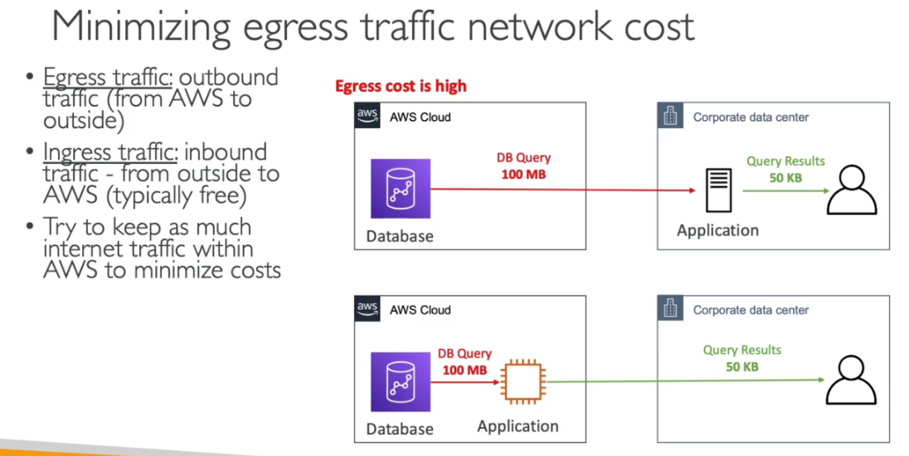

---

---

## 10 - Segurança, identidade e conformidade

---

### Modelo de responsabilidade compartilhada

---

### AWS Certificate Manager

- Serviço que permite provisionar, gerenciar e implantar facilmente certificados **SSL/TLS** para uso com os serviços da AWS e os recursos internos conectado.
- Permite solicitar certificados e implanta-los em **Elastic Load Balancers,** distribuições do **Amazon CloudFront** e APIs no **Amazon API Gateway.**
- Permite criar certificados privados para recursos internos e centralizar o gerenciamento do ciclo de vida dos certificados

---

### IAM

- Escopo global, controle de acessos.
- Tem como base o mínimo privilegio possível.
- Criação de usuário e grupos de usuários, grupos não podem conter outros grupos.
- Se atribui políticas de acesso (IAM Police) ao grupo, que vão dar acesso a todos os usuário daquele grupo.
- Políticas de acesso (permissões).
  - Escrita em json.
  - Seguir regra de menor privilegio.
  - A validação de acesso e feito a cada acesso, de forma automática.
  - Podem ser do tipo:
    - i**dentity-based** - Política que são destinados a usuário / grupos e rules
    - **resource-based** - Políticas que são atribuídas a recursos, para da acesso a outro recursos.
- Access keys - usadas para dar acesso ao AWS CLI e ao AWS SDK.
  - É possível usar um serviço de shell na nuvem (**cloud shell**) que gera um CLI sem a necessidade de configurar access key.
- Roles (funções)
  - Usadas para dar acessos de recursos a recurso (acesso ao S3 por um EC2)
  - Criação de roles de dão acesso a recurso sem ser necessário atribuir ao um usuário ou grupo
  - Podem ser assumidas por recursos ou usuários federados ou usuário de outras contas AWS.
- Dentro do **IAM** temos:
  - **iam user** - Usuário comum.
  - **federated user** - usuário de fora da organização, usuário do **Facebook** por exemplo.
  - **iam role** - permissões que são dadas a recurso, tipo EC2 para acessa um S3.
  - **identity provider (idp)** - Permite customizado acesso provider de terceiros e liberara acesso via token de acesso do STS.
- **IAM Conditions**
  - Permite adicionar condições nas políticas de acessos AWS.
    
- **IAM Permission Boundaries** (limite de permissões)
  - Quando se criar usuário ou **Roles** e possível dar **permissão genéricas,** tipo de administrador , e setar um **limite** para essas permissões, exemplo o cara é administrado apenas nos recursos do S3.
  - SCP (Service control policies ).
    
- **Lógica da avaliação de política**
  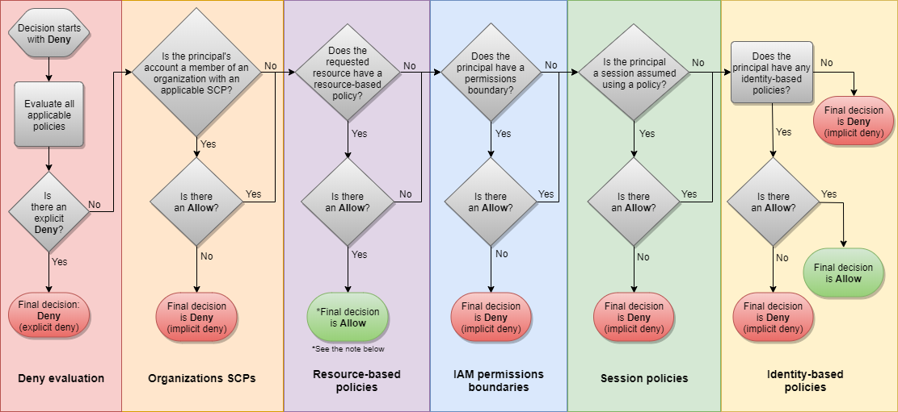

#### MFA (multi factory atutenticator)

    - Há dois via sofware (dispositivo MFA virtual, Chave de chegurança U2F (ex: YUbiKey))
    - Há uma opção de Hardware (ex: token Gemalto)Basic recomendations

#### IAM Security Tools

- **IAM Credencial Report (Account level)** -> Lista todas as contas de usuário e o status de cada uma.
- **IAM Access Advisor** -> Mostras os serviços que o usuário tem acesso e a ultima vez que o mesmo acessou.

##### Basic recomendations

---

### AWS Cognito

- Permite que usuário tem uma identidade para que possam interagir com as aplicações AWS.
- **Congnito User Pools - (CUP)**
  - Funcionalidade que permite cadastro de usuário para aplicações (mobilie, ...), pode usar Google, Facebook com provedor de login (**Federated identity**).
  - Banco de dados de usuários de aplicações mobile.
  - Pode usar usuário (ou e-mail) / password (simple login) or JWT (json web token).
  - É integrado com o **API Gateway.**
- **Cognito identity Pools (FIP - Federate Identity)**
  - Provem usuários para acessar recursos da **AWS diretamente.** Usuários que não são da sua organização mas que precisam acessar por algum motivo.
  - Tem integração com o **Congnito User Pools** onde são "armazenados" os usuários.
  - Ao fazer login dessa forma é gerado credenciais AWS como o **STS** com políticas previamente definidas para que usuário acesso ao recurso AWS.
- **Congnito Sync**
  - Sincronizar dados dos dispositivos com o Cognito.
  - Guarda preferências dos usuários.
  - Talvez caia em desuso e seja substituído pelo **AppSync** (Serve para sincronizar dados de aplicativos mobile e web app, Usa GraphQL).

---

### AWS Directory Service

- Forma de se usar o ADSF (active directory na **AWS**)
  

---

### AWS Identity Provider

- Permite que usuários de fora da AWS, tenham acesso temporário aso recursos.
- Há varias maneiras de criar um IdP.
  - **Sigle Sign On**
  - **SAML 2.0**
    - Permite integrar o Active Directory (ADFS) com AWS.
    - Da Acesso ao AWS Console e CLI (temporário).
    - Não precisa criar um usuário IAM.
    - Forma antiga de conectar, hoje usa-se o **Sigle Sign On**
      
  - **Custom Identity Broken.**
    - Usado para provider não compatíveis com SAML 2.0.
    - **Identity Broken** chama o STS para gerar o Token de acesso.
      
  - **Web Identity Federation com Cognito**
    - Permite dar acesso a um recurso usando provider como Facebook.
      

---

### AWS Single Sign On

- Permite centralizar o login, para as contas **AWS**, ou outros aplicativos como Office365, Slack.
- É usado quando se tem uma Organização com muitas contas, ai ser configura para que quando o usuário faça o login apareça as contas que ele pode logar na AWS, sem ser necessário criar um usuário em cada conta toda vez. O acesso fica centralizado.
  

---

### AWS STS - Security Token Service

- Permite dar **acessos a recursos AWS** de forma **limitada e temporária.**
- Em geral o **token** da acesso por de **15 minutos** a **1 hora.**
- Tipos de APIs:
  - **AssumeRole**
    - Permite da acesso a ação a **sua própria conta** ou **outras contas** a realizar ações em sua conta.
      
    - Diagrama de acesso a outras contas
      
  - **AssumeRoleWithSAML** - a mesma coisa só que para usuários logados com **SAML**.
  - **AssumeRoleWithWebIdentity** - a mesma coisa só que para usuários logados com **IdP (identity provider)** - Facebook login, Google Login .... Não é recomendado usar, recomenda-se usar o **cognito** para isso.
  - **GetSessionToken** - Para MFA, para usuário **root** de uma conta AWS.

---

### AWS Secrets Manager

- Usados para guardar segredos (principalmente de banco de dados).
- Permite realizar a rotatividade dos segredos automaticamente.
- Pode ser usado para guarda senhas em produção.
- É muito usado junto com banco de dados.
- Os segredos ficam criptografados.

---

### AWS KMS

- Serviço de encriptação da AWS - Key Managemente Service.
- Não é possível baixar as chaves.
- Gerencia chaves de criptografia.
- Serviços com **a opção de se encriptar** dados:
  - EBS, S3, RedShift, RDS, EFS ....
- Serviços com **criptografia default:**
  - CloaudTrail Logs, S3 Glacier, Storage Gateway ....

#### Cloud HSM - Hardware Security Module

- Aws provem um hardware dedicado para que nós possamos gerenciar nossas chaves.
- O hardware é resistente a alteração e é homologado (FIPS 140-2 Level 3 Compliance)

#### Tipos de chaves

- **CMK** - Customer Master Keys.
- **Gerenciadas pelo usuario - CMK**
  - Criado pelo usuário dentro do **KMS** ou **HSM **(**hardware security module** ), pode ser deletada ou alterada.
  - Pode se habilitar a rotação de chave a cada 1 ano.
  - Também e possível rotacional manualmente, mas é recomendado para chaves **Assimétricas**.
  - Tem um custo de $1 por mês, e a cada chamada paga-se $0.003.
  - Pode ser dos tipos
    - **Simétricas** (AES-256)
    - **Assimétricas** (RSA & ECC Key Pairs)
- **Gerenciadas pela AWS - CMK**
  - Chaves criadas e gerenciada pela AWS, não temos acesso.
  - Não tem custo
    - São as usadas nos serviços.
      - EBS, S3, RedShift, RDS, EFS.
- **Chaves do HSM**
  - Chaves criada usando o HSM (**hardware security module** )
  - Replicado em mais de uma AZ
    
    

---

### AWS Shield

- Protege contra ataques DDOS | SYN/UDP (floods an reflecion atack).
- Trabalha na camada 6 e 4 (rede e transporte).
- Versão **standard** é de graça para todos os clientes.
- Tem versão **advanced** (analisa a camada 7 aplicação).
- Fica nos prontos de presença.
- Tem a versão aws shild **advanced** 24/7 premium com DRP (DDos response team) que:
  - Tem custo adicional $ **3000** por organização.
  - Pode ser usado em Route 53 / Cloud Front | Global Acelerator | Load Balance

---

### AWS WAF

- web application firewall.
- Permite bloquear acesso através de uma lista de regras.
- Fica nos prontos de presença.
- Protege as aplicações ataques (Layer 7 - aplication).
- Pode ser usado em:
  - Load balance (http).
  - API Gateway.
  - CloudFront.
- Permite criar web ACL (web acess control list) que permite:
  - Bloquear ranges de ips, headers ...
  - Protege contra Sql Injection, Cross-site Spriting (Xss).
  - Bloqueio por pais ou região (gro-match).
  - Bloqueio por quantidade de requisição.
  - Tem um custo de $5 por mês por ACL.
- **AWS Firewal manager**
  - Permite gerenciar regras de todas as contas AWS de forma centralizada.
  - Tem regras comuns de segurança.

---

### AWS Guard Duty

- Serviço de inteligência artificial para detectar anomalias na sua conta.
- Tem free trial , após isso é gerado cobrança.
- é um serviço regional.
- Recebe dados do:
  - **Cloud Trail** - detecta chamadas incomuns e não autorizadas.
  - **VPC Flow** - detecta trafico incomum e IPs incomuns.
  - **DNS Logs** - detecta instâncias dados comprometedores enviando dados de DNS.
- Ler todos e através de algoritmos ele detecta coisas erradas.
- É possível conectar ao **event Brigde** do **Cloud Watch** para notificar.

---

### AWS Inspector

- Permite que você analise o comportamento de seus recursos da AWS e ajuda a identificar possíveis problemas de segurança.
- **AWS Inspector** inspeciona instâncias EC2 contra ameaças comuns.
- Tem um agente que pode ser instalado nas EC2.
- Analisa apenas instâncias em execução e procura risco na aplicação.
- Possível configurar a periodicidade de execução.
- Tem um alto custo sendo:
  - 60$ - para analises de rede (Acesso indevido e capacidade).
  - 120$ - para analise da maquina (checa por vulnerabilidade comuns).

---

### AWS macie

- Usa **machine learning,** para detectar dados sensíveis (PII - Personally identifiable information).
- Totalmente serveless.
- Analisa os dados e notifica o **CloudWatch EventBridge** que notica via **SQS**, **SNS** ou
  **Lambda**.

---

### AWS Security HUB

- Centraliza a gestão de segurança de múltiplas contas.
- Agrega alertas de outros serviços visto anteriormente.
- Usa o **AWS config** .
- Dá para automatizar com funções para resolver problemas conhecido (tipos porta **ssh** liberada ..)

---

## 11 - Armazenamento

---

### EBS - Elastic block storage

- Serviço de armazenamento de instâncias EC2.
- Nativamente replicado dentro da Zona de disponibilidade.
- Backup e feito usando snapshot.
- E possível criar uma novo volume com o snapshot criado.
- Possível encriptar, dados em repouso em transporte e snapshots.
- O processo de encriptação e transparente ao usuário.
- Para se encriptar um volume já criado sem encriptação e necessário criar um snapshot e depois criar uma copia desse snapshot e marcar a opção de encriptação e depois criar um volume a partir desse novo snapshot e conecta-lo na instância.
- É possível usar o **EBS** com RAID (apenas o Raid 0 e o Raid 1) sendo:
  - RAID 0 - os dados são dividos entre os discos (melhora o desempenho).
  - RAID 1 - os dados são espelhados entre os discos (tolerante a falha).
  - Precisa ser feito dentro do SO, não há ferramentas dentro do console para isso
- Tipos
  
  
  os tipos io1 / io2 permitem conectar o mesmo em mais de uma instância, isso é usado em aplicação de alta disponibilidade, ex Cassandra ...

##### Uso

---

### EFS - Elastic file system

- NFS (network file system) que pode ser montado num EC2.
- Diferente do EBS que só pode sem usado em apenas uma **AZ**, o **EFS** pode ser montado e AZs diferentes
- Pague por uso.
- Usa um **security group** para se linkar as instâncias.
- Usados quando se quer compartilhar arquivos com varias instâncias ex. arquivos **wordpress**.
- Usados apenas com **Linux** (ami), não compatível com Windows.
- Pode ser encriptado usando KMS.
- Suporta milhares de clientes, e pode ter ate 10gb+ de thoughput .
- O tipo de performance pode ser definido na criação podendo ser:
  - **General purpose (default)** - (web server - cms, etc...)
  - **Max IO** - Big data, processamento de vídeo.
- **Throughput mode**
  - **Bursting** - Cresce de acordo com o tamanho do **filesystem**.
  - **Provisined** - Possível definir um nível.
- **Storages Ties** (lifecycle management feature - Move os arquivos após 30 dias)
  - **Standard** - para arquivos acessados frequentemente
  - **infreaquet access (EFS-IA)** - Arquivos que não são acessado com muita frequência, tem preço menor, porem e cobrado por recuperação de arquivo.
    

##### Uso

---

### Amazon FSx

- Semelhante ao **EFS** (usado para Linux) só para Windows.
- Tem suporte para os protocolos **SMB e NTFS.**
- Tem suporte para o Active Directory da Microsoft.
- **Amazon FSx for Lustre**
  - Lustre (linux + cluster) é um sistema de arquivo distribuído e paralelo para computação em escala.
  - Usado em marchine learning e Computação de alta performace (HPC)

---

### Amazon S3

- Serviço **regional** com visibilidade **global**.
- E totalmente gerenciado pela AWS.
- Tem que ter o nome único em todo mundo para o nome do bucket. Pois será usado na URL do arquivo armazenado. De 3 a 63 letras, sem caracteres especiais.
- Repica os dado em 3 AZ.
- Tem uma durabilidade de 99,999... (11 noves).
- E possível definir as permissões de acesso.
- É possível subir qualquer arquivo de ate 0 bytes ate 5 terasbytes de tamanho.
- **Multi Part** é o processo de subir um arquivo em vários pedaços menores paralelamente.
- **O upload de Multi Part** também é recomendado assim que o arquivo tiver mais de 100 MB
- É armazenado como **Object level storage.**
- As ações dentro do S3 geram eventos.
- Como segurança tem **ACL (acess control list)**, referece a regras de acesso ao bucket, para dar acesso aos arquivo e preciso torna-lo publico
- Como segurança tem o **Bucket police,** onde é possível definir as regras de acesso
- Caso de uso mais comuns
  - Backup and storage.
  - Application hosting (site estático).
  - Media Hosting.
  - software delivery.
- **Glacier Vault Lock -** Permite configurar para que arquivos nunca seja deletados, usado em complience.
- **S3 Object Lock** - Semelhante ao anterior, mas permite configurar a retenção do objeto, por exemplo o arquivo não pode ser modificado por 30 dias, o a nota ficsal não pode ser apagada por 5 anos

#### Precificação

- GBs por mês.
- Transferência para fora da região do **bucket**.
- Requisições via api (put, get, copy,list, post).

#### Classes de S3

- **Padrão:** o Standard S3 é uma plataforma de armazenamento de objetos de uso geral projetada para dados de aplicativos que devem estar disponíveis instantânea e constantemente.
- **Intelligent-Tiering:** Muitos aplicativos têm grandes conjuntos de dados com uma variedade de padrões de acesso. Esses padrões dependem de fatores como o tipo de dados, mudanças sazonais e necessidades internas de negócios. O Intelligent-Tiering identifica e move automaticamente os dados acessados com pouca frequência - dados que não foram acessados por 30 dias - para uma infraestrutura de baixo custo. Quando um objeto na camada não frequente é acessado, ele é automaticamente movido de volta para a camada de alto desempenho e o relógio de 30 dias é reiniciado.
- **Acesso não frequente padrão (IA):** alguns dados raramente são acessados, mas exigem desempenho rápido quando os usuários precisam. A camada Standard-IA visa esse cenário e oferece desempenho semelhante ao S3 padrão, mas com menos disponibilidade.
- **One Zone-IA:** Ao contrário do Standard-IA, esta camada não distribui dados automaticamente em pelo menos três AZs. No entanto, os dois níveis de IA fornecem a mesma latência de milissegundos para os dados que o S3 padrão.
- **Glacier:** embora use armazenamento de objetos, o Glacier é um animal diferente das outras versões do S3, pois é totalmente projetado para arquivamento de dados. A AWS nunca revelou a tecnologia subjacente do Glacier. Independentemente de o Glacier usar unidades de disco rígido de baixo desempenho, fita, óptica ou qualquer outra coisa, seus parâmetros de desempenho e disponibilidade são semelhantes aos das bibliotecas de fitas corporativas. No entanto, ao contrário de uma biblioteca de fitas, os usuários do Glacier podem especificar um tempo máximo para recuperação de dados que pode variar de alguns minutos a horas.
  - Aqui cada arquivo é chamado de **Archive** e são armazenados em **vaults** que é a mesma coisa que buckets.
  - Formas de recuperar os arquivos
    - **Expedited** - (1 a 5 minutos) - custa $10
    - **Standard** - (3 a 5 horas) - custa $0.05
    - **Bulk** - (5 a 12 horas) - custa $ 0.025
  - A duração minima de armazenamento é de 90 dias.
- **Glacier Deep Archive:** Deep Archive é projetado para arquivamento de longo prazo - pense em anos - com acesso raro e lento aos dados em 12 horas.
  - Formas de recuperar os arquivos
    - **Standard** - (12 horas) - custa $0.10
    - **Bulk** - (48 horas) - custa $ 0.025
  - A duração minima de armazenamento é de 180 dias.
    E possivel usar o S3 - Intelligent - Tiering , mover os dados para os outro niveis de classe do s3
    
    Recomendação de leitura: [Analise as classes de armazenamento do Amazon S3, do padrão ao Glacier](https://searchaws.techtarget.com/tip/Analyze-Amazon-S3-storage-classes-from-Standard-to-Glacier)

#### S3 - Encryption

- É possivel criar uma bucket police para validar se um objeto foi encriptdado.
- Caso o bucket tenha uma encriptação habilitado por default, e se criptografe o arquivo durante o upload, esse arquivo não será encriptado de novo pelo encriptação default.

#### S3 - Data consistency

#### S3 - Replication

- O **S3 - Versioning** deve esta habilitado em ambos os buckets.
- Pode ser feito usando contas diferentes.
- Há dois tipos
  - **SRR** - Same region replication
    - Usado para agrupamento de logs, replicação de dados entre ambientes (dev e hml).
  - **CRR** - Cross region replication - Usado para compliance, baixar a latência de acesso, replicação em diferentes contas.
    
- Após habilitado só ira replicar novos objetos, os antigos não serão replicados.
- Para deletar, se deleta da origem e é replicado a deleção, mais isso é opcional, se não for habilitado não será replicado o marcador de delete para o outro bucket.

#### S3 - Versioning

#### S3 - MFA - delete

- Impede que o usuário deleta permanentemente um objeto versionado no S3.
- Deve ser habilitado pelo dono do bucket (root account).
- Só pode ser habilitado via CLI com o profile de root account.
- Para usar essa funcionalidade é necessário ter o S3 - Versioning habilitado.
- Será usado quando:
  - For deletar um arquivo permanentemente.
  - For desabilitar o versionamento.
- Não precisa usar quando:
  - For deletar uma versão qualquer.
  - For habilitar o versionamento.

#### S3 - lifecycle management

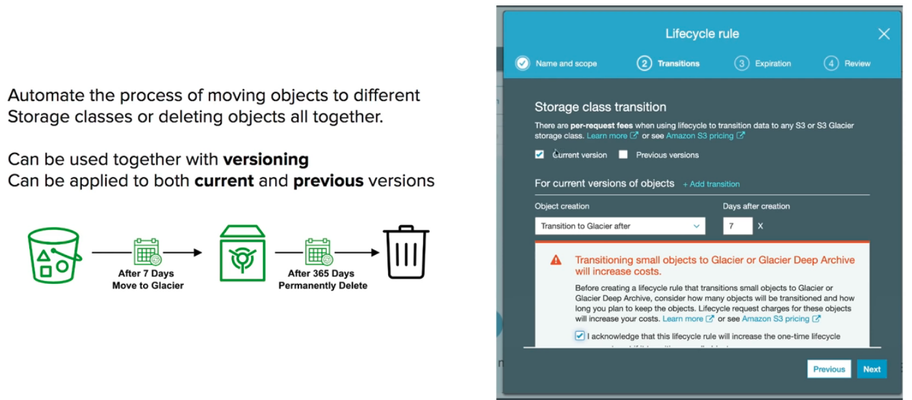

- **Ações de transição** - Permite definir quando o objeto sera movido
- **Ações de expiração** - Permite definir tempo de expiração dos objetos e regras para deletar
- Também é possível definir regras por **prefixos** ou **tag** , para, por exemplo, mover apenas objetos de uma pasta X.

#### S3 - Transfer acceleration

#### S3 - Presigned urls

- Gera uma url da acesso temporário a um recurso no S3.
- Pode se usar o CLI ou o SDK para gerar urls.
  - Para Download (fácil, use CLI)
  - Para Upload (complidado, use SDK)
- Tem um tempo de expiração padrão de 3600 segundos, mas e possível alterar.
  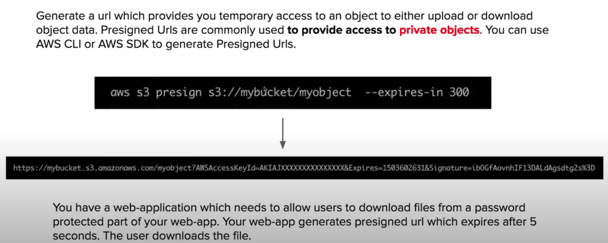

#### S3 - Security

1. Forma de acesso ao bucket e aos objetos contido nele.

- **Baseada em usuários** (user based) - diz-se que para ter acesso processar ter permissão via IAM Console
- **Baseada em recurso** (Resource based)
  - **Bucket Polices**
    - Regras de acesso ao bucket, permite outros recurso e outras contas a ter acesso.
    - Escrita em json.
  - **Object Access Control List (ACL)** - Define a lista de acesso de cada objeto armazenado (nível mais baixo).
  - **Bubcket Access Control List (ACL)** - Define a lista de acesso de cada **bucket** (menos comum de ser usado);
    De forma geral se deve ter acesso concedido via IAM **OU** via Resouce police para ter acesso, senão tudo será negado.
    

2. Para segurança e auditoria o **S3** disponibiliza:

- S3 Access Logs, que pode ser armazenado em outro S3.
- API que pode loggar essa informações no AWS CloudTrail.
- Também é possível implementar o MFA para deletar de objetos específicos.

#### S3 - Access logs

- É possível usar um bucket de logs para guardar os **server access logs** de um bucket S3.
- É usado para auditoria, ou para analise com o **Athena**.
- Os logs devem ser armazenados em um **bucket** diferente (senão geraria um loop).

#### S3 Select e Glacier Select

- Permite usar SQL para melhorar a recuperação de dados por meio de filtros
- É possível realizar filtros por linhas e colunas (consultas simples de SQL)
- Usa menos banda de rede pois as queries seram executado do lado do S3 e só retornará o resultado.
  

#### S3 Well Architected

---

### Instance store

- O Instance Store são os volumes em bloco armazenados diretamente no **host físico**, dentro do servidor físico na AWS onde está rodando sua instância EC2.
- Diferente do EBS, que fica fora do servidor, mas ainda assim dentro do Datacenter.
- Algumas instâncias EC2 podem ter discos diretamente conectado ao servidor onde são virtualizadas.
- Armazenamento com melhor I/O.
- Dados guardo dentro da instância, e perdido ao se parar a instância
- Excelente para guardar cache / dados temporários.
- Existe um recurso de hibernação que preserva os dados.

---

### AWS Storage Gateway

- Usado e cloud híbrida. Permite fazer uma ponte entre os dados da nuvem e o ambiente local (on-primeses).
- Conecta um dispositivo de software local a um armazenamento em nuvem para oferecer uma
  integração perfeita e segura entre um ambiente de TI local e a infraestrutura de armazenamento da AWS.
- Você pode usar esse serviço para armazenar dados no AWS para
  armazenamento escalável e econômico que ajuda a manter a segurança dos dados.
- Oferece **Gateways** de arquivo baseados em arquivo (S3, FSx ), volumes
  (armazenados em cache e armazenados) e soluções de armazenamento em fita.
- Tipos de armazenamento que é possivel configurar:
  - **Files (S3 / FSx)** - Usado para armazenar arquivos.
    
  - **Volumes (EBS)** - Usados para armazenar dados de backups, ou volumes.
    
  - **Fitas (S3 Glacier) -** Usado onde há processos semelhantes fitas.
    
- Pode se usar autenticação integrada com o Active directory.
- AWS, também oferecer hardware para disponibilizar essas funcionalidade. Onde não há própria estrutura de virtualização para implementar o **AWS Gateway Storage.**

---

## 12 - Well Architected Framework

- Pare de tentar adivinhar sua capacidade.
- Testar em escala de produção.
- Automatize para tornar sua infraestrutura facil.
- Evolua constantemente sua arquitetura.
- Usar a coleta os dados para melhor sua aplicação.
- Se programar para dias específicos.

#### Pilares

- **Operational excelence** - Excelência operacional
  > - Inclui a capacidade de apoiar o desenvolvimento e executar cargas de trabalho de forma eficaz, obter uma visão sobre sua operação e melhorar continuamente os processos e procedimentos de suporte para entregar valor de negocio.
  >
  > - **Design Principles**
  >
  >   - Executar operações como código, infraestrutura as code.
  >   - Documente os processos.
  >   - Faça alterações frequentes, pequenas e reversíveis.
  >   - Refine os procedimentos de operações com frequência.
  >   - Antecipar o fracasso
  >   - Aprenda com todas as falhas operacionais.
  >
  >   
- **Security** - Segurança
  > - Capacidade de proteger dados, sistemas e ativos para aproveitar as vantagens das tecnologias de nuvem para melhorar sua segurança.
  >
  > - **Design Principles**
  >
  >   - Implemente uma base de identidade forte - Mínimo privilegio possível.
  >   - Ative a rastreabilidade. Habilitar tracing integrado.
  >   - Aplique segurança em todas as camadas.
  >   - Automatize as melhores práticas de segurança.
  >   - Proteja os dados em trânsito e em repouso.
  >   - Mantenha as pessoas longe dos dados.
  >   - Prepare-se para eventos de segurança.
  >
  > 
- **Realibility** - Confiabialiade
  > - Engloba a capacidade de uma carga de trabalho de desempenhar sua função pretendida de forma correta e consistente quando é esperado. Isso inclui a capacidade de operar e testar a carga de trabalho em todo o seu ciclo de vida.
  > - **Design Principles**
  >   - Recuperar automaticamente da falha ( recuperação de desastre).
  >   - Procedimentos de recuperação de teste.
  >   - Escale horizontalmente para aumentar a disponibilidade de carga de trabalho agregada.
  >   - Pare de adivinhar a capacidade.
  >   - Gerenciar mudanças com automações
  >
  > 
- **Perfome efficiente** - Perfome eficiente
  > - Inclui a capacidade de usar recursos de computação de forma eficiente para atender aos requisitos do sistema e manter essa eficiência conforme a demanda muda e as tecnologias evoluem.
  > - **Design Principles**
  >   - Democratizar tecnologias avançadas.
  >   - Torne-se global em minutos.
  >   - Use arquiteturas sem servidor (serverless).
  >   - Experimente com mais frequência.
  >   - Considere simpatia mecânica (Conheças os serviços específicos da AWS, para cargas de trabalho especificas)
  >
  > 
- **Cost optimization** - Otimização de custos
  > - Inclui a capacidade de executar sistemas para agregar valor ao negócio com o menor preço.
  > - **Design Principles**
  >   - Implementar gerenciamento financeiro em nuvem (pague pelo que usa).
  >   - Adote um modelo de consumo.
  >   - Meça a eficiência geral.
  >   - Analisar e atribuir despesas.
  >   - Use serviços gerenciado pela AWS para reduzir custo.
  >
  > 

#### Well Architected Tool

- Ferramenta para validar se sua organização esta seguindo os pilares da well architected.
- Gera relatório de acordo com algumas validações e com perguntas a serem feitas nas aplicações e
  estrutura.

---

## 13 - Cases

Abaixo alguns case de como usar os recurso AWS no dia a dia.

### Soluções Serverless

#### 1. App TodoList

- Usuário pode criar lista de tarefas e armazenar dados no S3, tem que ter autenticação.
  - **Solução visão nivel api**
    > Se cria uma API com API Gateway, que verifica as credenciais e dispara uma lambda que acessa o banco de dados.
    > 
  - **Solução visão acesso ao S3**
    > O Cognito via STS gera um token temporario para acessar o S3
    >  > **Sulução visão cache**
  - **Cache para muitas leituras na DynamoDB**
    > Quando temos muito acesso de leitura a arquivos staticos no DynamoDB, podemos adicionar o DAX, que vai realizar o cache dos dados mais acessados do banco, melhorando assim a leitura.
    > 
- **Cache de responses**

  > Também seria possivel habilitar o caching no gateway, para cachear os requestes.
  > 

  ***

#### 2. Blog

- Blog disponível globalmente, com milhares de acessos (read) por hora .
- A maiorias dos dados são estáticos. .
- Terá um e-mail de boas vindas para os subscritos.
- As fotos adicionadas ao blog devem passar por uma tratamento, para reduzir o tamanho.
- **Solução arquivos staticos (site)**
  > Coloca os arquivos num **bucket**, e usa o **CDN** para distribuir globalmente, e habilita **OIA** que só permitir o CDN acessar o Bucket incrementado a segurança.
  > 
- **Solução para Ações dentro do site**
  > Imagine que precise adicionar ações que recupere dados de um banco de dados, para fazer isso se cria um API com API Gateway que acessa uma lambda que acessa o banco conforme visto no case anterior.
  > 
- **Solução para e-mail de boas vindas**
  > Quando um novo cadastro, o **DynamoDB** via **DynamoDB Stream** dispara uma **Lambda** que tem uma **Role** que permite acionar o SES (Amazon simple e-mail service) para enviar o e-mail.
  > 
- **Solução para tratamento de imagens**
  > o Usuário vai subir os dados no **bucket** ou via **cloud Front (CDN)** que vai enviar via **transfrer accelarion** para o bucket use isso caso queira evitar acesso direto ao **bucket**, ao colocar a imagem no bucket isso vai dispara um **lamdba** para processar a imagem que depois pode ser armazenada em outro **bucket**, alem disso é possível notificar o cliente via **SNS** ou executar outro processamento postando numa fila **SQS**.
  > 

---

#### 3. Micro-serviços

- Exemplo de arquitetura de micro-serviço que usa API Rest.
- Que se escala automaticamente e que tenta ser o mais serverless possível.
- **Usando ECS ou EKS**
  > Tem se um conjunto de container no **ECS **ou **EKS** que acessam um banco e estão atrás de uma **ELB** e pode se usar o **Route 53** par se dar um **DNS Name** tipo **service1.example.com**.
  > 
- **Usando Lambda**
  > Tem se uma lambda que é disparada por requests a um **API Gateway** que pode consultar um **banco de cache** ou um **banco qualquer **e pode se usar o **Route 53** par se dar um **DNS Name** tipo **service2.example.com**.
  > 

---

#### 4. Distribuição de conteúdo pago

- Bora imaginar que precisamos disponibilizar vídeos online, numa plataforma onde só acessar quem compra o vídeo, um **onlyFans **( ͡° ͜ʖ ͡°).
- Cada vídeo pode ser comprado por vários usuários.
- Termos armazenados quem pagou pelos vídeos e ao comprar o vídeo será disponibilizado um link para terá acesso ao(s) vídeo(s).
- Aplicação deve ser global.
- **Visão verificação de acesso ao vídeos**
  > O usuário faz login usando o **Cognito**, e ao acessar ele bate num **API Gateway** que aciona um **lambda** que ira validar quais vídeos ele tem acesso base de dados.
  >  > **Visão geração de acesso ao video**
  > Para acessar o vídeo é preciso gerar uma **Signed URL**, para isso faz se uma chamada ao **API Gateway** que invoca uma **lambda** que verifica se o usuário e pagante na base de dados e se for gera uma url assinada para que ele possa acessar via **CDN**.
  > 

---

#### 5. Pipeline de ingestão de dados (Big Data)

- Nossa esteira deve receber dados de vários dispositivos em tempo real.
- Deve transformar esses dados e salvar no S3 para geração de relatórios.
- Deve gerar relatórios que devem ser disponibilizados em Dashboard para analise.
- **Solução**
  > Utilizamos o **Kinesis data stream** para receber os dados em tempo real dos dispositivos, podemos acionar uma **lambda** para transformar esses dado e salvar num **Bucket**, podemos usar um **topico SNS** ou os próprios eventos do **bucket** para acionar uma outra **lambda** que acionaria o **Athena** para realizar queries nos dados coletados e salvando em outro **bucket** ou enviar para o **Amazon QuickSight** para geração de relatórios ou ate mesmo para o **RedShilt** para data warehouse.
  > 

---

---

### Processamentos de eventos

#### Lambda e SNS e SQS

- Devemos usar **DLQ** sempre para garantir preservação da mensagem em caso de erro no processamento.
- No caso de **Filas SQS -> Lambdas**, é sempre bom definir a quantidade de **poll** ate 5 (5 tentativas) antes de mover as mensagens para a DLQ, pois assim se evita loops infinitos.
- No caso do **SNS -> Lambda**, a lambda vai tentar processar a mensagem 3 vezes e depois caso não tenha sucesso enviara para a DLQ ou será descartada se não tiver uma DLQ.
  

---

#### Fan Out Pattern

- Usado quanto se tem múltiplos destinos (filas SQS) para uma mensagem.
  

---

#### S3 Events

- Envia para SNS, SQS e Lambda
  

---

---

### Estratégia de caches

- Podemos usar cache no CloudFront e no API Gateway alem do cache do lado da aplicação.
- O importante aqui e sempre lembrar de definir bem o TTL dos dados cacheados para evitar dados desatualizados.
  

---

---

### Bloqueandos IPs

- As vezes desejamos bloquear **IPs** por segurança.
- O bloqueio deve ser feito no **NACL**, pois ele permite criar regras de Negação (**DENY**).
- No caso do **Security Group** é mais complicado de fazer, pois ele parte da ideia de regras de deliberação de acesso (**ALLOW**). caso precisa-se teria que criar um grupo de IPs que podem acessar e permitia o acesso **SG** assim o resto seria bloqueado, mas como seriam muitos torna-se quase inviável.
- Também é possível configurar um firewall num **EC2** para fazer esse bloqueio.
  
  - Caso na sua estrutura esteja usando um **application load balance **(ALB), e possível bloquear usando a **NACL** e configurar o **Security Group** das instâncias EC2 para aceitar o trafico apenas do **application Load balance**.
    
  - Ou pode se instalar o **WAF** no **ALB**, onde se poderia criar regras de filtros de acesso.
    
  - Caso esteja usando um Network load balance, a unica forma de bloquear um ip seria usando o **NACL**. Pois o NLB não possui Security Group.
    
- Caso esteja usando **CDN**, e possível usar o **WAF** na para bloquear o acesso. Antes mesmo dele chegar na **VPC**, não sendo necessário usar as **NACL**
  

---

---

### Alta performance computacional HPC

- Serviços que ajudam ter alta performance na AWS:
  - **Transferência de dados**
    - **AWS Direct Conect** - Permite mover GBs de dados para a cloud.
    - **SnowBall e SnowMobile** - Pemite mover PB de dados para a cloud.
    - **AWS DataSync** - Permite mover grandes quantidade de dados do on-primeses para cloud .(usando S3, EFx)
  - **Computação**
    - **Instâncias EC2**
      - Com CPU otimizada ou GPU otimizada.
      - spot instances / Spot Fleets para economia + auto escale.
    - **EC2 Placentament Groups** - Permite usar um conjunto de maquinas (cluster) num mesmo **rack** ou região o que diminui a latência..
      - **EC2 Enhanced Networking SR-IOV** (Rede aprimorada para EC2)
        - Interface de rede para HPC.
        - Alta banda, Alto PPS (pacotes por segundos), baixa latência.
        - Opção 1: **Elastic Network Adapter** (ENA) aumenta a capacidade para 100Gbps.
        - Opção 2: Intel 82599 VF para 10 GBs - Antiga não usado mais
      - **Elastic Fabric Adapter** (EFA)
        - Interface de rede usada para HPC no Linux com foco.
        - Melhora a ENA para Alta HPC, apenas para linux.
  - **Armazenamento**
    - **Ligado na instância**
      - **EBS** - Escala ate 64000 IOP.
      - **Instance store** - escala para milhões de IOPS, mas é perdido quando a instância desliga.
    - Na rede
      - **S3** - Armazenamento de objetos.
      - **EFS** - Escala IOPS baseado no tamanho total, ou IOPS provisionado .
      - **FSx for lustre** - FileSystem otimizado para HPC usando linux.
  - **Automação e Orquestração**
    - **AWS Batch** - para trabalhar com jobs e agendamentos.
    - **AWS ParallelCLuster**
      - Ferramenta Open Source para deploy e gerenciamento de cluster HPC.

---

---

## 14 - Whitepapers

- [Architecting for the cloud](https://d1.awsstatic.com/whitepapers/AWS_Cloud_Best_Practices.pdf)
- [well-architected framework](https://aws.amazon.com/blogs/aws/aws-well-architected-framework-updated-white-papers-tools-and-best-practices)
- [Disaster recovery whitepaper](https://d1.awsstatic.com/whitepapers/aws-disaster-recovery.pdf)
- [well-architected framework](https://d1.awsstatic.com/whitepapers/architecture/AWS_Well-Architected_Framework.pdf)
