---
title: "Develop Associate"
weight: 4

---

---

{}
Leia sobre a [AWS Certified Developer - Associate. (DVA-C02)](https://aws.amazon.com/pt/certification/certified-developer-associate)
{}

---

| Dominio | % do exame |
| ------- | ---------- |  
|Domínio 1: Desenvolvimento com os serviços da AWS |32%|
|Domínio 2: Segurança |26%|
|Domínio 3: Implantação |24%|
|Domínio 4: Solução de problemas e otimização |18%|


Recursos e produtos da AWS no escopo
{}
Análise:
- [ ] Amazon Athena
- [ ] Amazon Kinesis
- [ ] Amazon OpenSearch Service

Integração de aplicativos:
- [ ] AWS AppSync
- [ ] Amazon EventBridge (Amazon CloudWatch Events)
- [ ] Amazon Simple Notification Service (Amazon SNS)
- [ ] Amazon Simple Queue Service (Amazon SQS)
- [ ] AWS Step Functions

Computação:
- [x] Amazon EC2
- [ ] AWS Elastic Beanstalk
- [ ] AWS Lambda
- [ ] AWS Serverless Application Model (AWS SAM)

Contêineres:
- [ ] AWS Copilot
- [ ] Amazon Elastic Container Registry (Amazon ECR)
- [ ] Amazon Elastic Container Service (Amazon ECS)
- [ ] Amazon Elastic Kubernetes Services (Amazon EKS)

Banco de dados:
- [x] Amazon Aurora
- [x] Amazon DynamoDB
- [x] Amazon ElastiCache
- [x] Amazon MemoryDB para Redis
- [x] Amazon RDS

Ferramentas do desenvolvedor:
- [ ] AWS Amplify
- [ ] AWS Cloud9
- [ ] AWS CloudShell
- [ ] AWS CodeArtifact
- [ ] AWS CodeBuild
- [ ] AWS CodeCommit
- [ ] AWS CodeDeploy
- [ ] Amazon CodeGuru
- [ ] AWS CodePipeline
- [ ] AWS CodeStar
- [ ] AWS X-Ray

Gerenciamento e governança:
- [ ] AWS AppConfig
- [ ] AWS Cloud Development Kit (AWS CDK)
- [ ] AWS CloudFormation
- [ ] AWS CloudTrail
- [ ] Amazon CloudWatch
- [ ] Amazon CloudWatch Logs
- [x] AWS Command Line Interface (AWS CLI)
- [ ] AWS Systems Manager

Redes e entrega de conteúdo:
- [ ] Amazon API Gateway
- [ ] Amazon CloudFront
- [ ] Elastic Load Balancing
- [x] Amazon Route 53
- [ ] Amazon VPC

Segurança, identidade e conformidade:
- [ ] AWS Certificate Manager (ACM)
- [ ] AWS Certificate Manager Private Certificate Authority
- [ ] Amazon Cognito
- [x] AWS Identity and Access Management (IAM)
- [ ] AWS Key Management Service (AWS KMS)
- [ ] AWS Secrets Manager
- [ ] AWS Security Token Service (AWS STS)
- [ ] AWS WAF

Armazenamento:
- [ ] Amazon Elastic Block Store (Amazon EBS)
- [ ] Amazon Elastic File System (Amazon EFS)
- [ ] Amazon S3
- [ ] Amazon S3 Glacier
{}

---

## Computação:


----

### AWS Budget

> {}
Veja aqui tudo que vc precisa saber sobre [Budgets](https://docs.uniii.com.br/02-cloud-notes/01-aws/03-aws-cloud-architect-professional/02-conteudo.html#aws-budget)
{}


---

### EC2

> {}
Contextualização:
 - O que é [EC2](https://docs.uniii.com.br/02-cloud-notes/01-aws/03-aws-cloud-architect-professional/02-conteudo.html#ec2)
 - O que é [Security Group](https://docs.uniii.com.br/02-cloud-notes/01-aws/03-aws-cloud-architect-professional/02-conteudo.html#security-group)
 {}

 - Key pair
> {}
Ao gerar o key pair atente-se ao:
- Tipo da chave:
  -	RSA:  Usado em linux e Windows.
  -	ED25519: Não suportado pelo Windows.
- Formato
  - .pem - formato aberto usado pelo openssh.
  - .ppk - formato do putty (windows 7 e 8).
  {}

- Security Group


#### Use data

Usado para pre configurar um instancia Ec2. O exemplo abaixo instala o apache na instância.

```shell
## Considerando que AMI seja RedHat Based.

#!/bin/bash
yum update -y
yum install httpd -y
systemctl start httpd
systemctl enable httpd
echo “Hello World from $(hostname -f)” > /var/www/html/index.html
```

#### IMDS - EC2 instance metadata

- Informações sobre a instância.
- Permite que instancias vejam informações sobre elas mesmas, sem a necessidade de ter um IAM Role.
- Pode ser acessado via **URL**: http://169.254.169.254/latest/meta-data.
  - Permite acessar tanto o user data (script de inicialização) quanto o meta data.
- Ha duas versões
  - **IMDSv1** 
    - Acessa diretamente a **URL**: http://169.254.169.254/latest/meta-data.
  - **IMDSv2** -
    - Mais seguro pois agora o acesso é feito em dois passos
    - Recuperar o token de sessão.
    - ```shell
      TOKEN=`curl -X PUT "http://169.254.169.154/latest/api/token" -H "X-aws-ec2-metadata-token-ttl-secondas:21060"`
      ```
    - Recuperar os dados passando o token via heardes:
    - ```shell
      curl http://169.254.169.254/latest/metadata -H "X-aws-ec2-metadata-token: $TOKEN" 
      ```
- Quando se configura credencias para a instancia ela usa o **IMDS** para recuperar-las usando a chamada
```shell
  curl  -H "X-aws-ec2-metadata-token: $TOKEN" http://169.254.169.254/latest/metadata/identity-credentials/ec2/security-credentials/ec2-instance
```

  


---

### ELB / ASG

> {}
Contextualização:
 - O que é [ELB](https://docs.uniii.com.br/02-cloud-notes/01-aws/03-aws-cloud-architect-professional/02-conteudo.html#elastic-load-balancing)
 - O que é um [ALG](https://docs.uniii.com.br/02-cloud-notes/01-aws/03-aws-cloud-architect-professional/02-conteudo.html#auto-scaling-group-alg)
 {}


---

## Banco de dados:

### RDS

> {}
Contextualização:
 - O que é [RDS](http://localhost:1313/02-cloud-notes/01-aws/03-aws-cloud-architect-professional/02-conteudo.html#rds)

- Veja também:
  - [Backups](http://localhost:1313/02-cloud-notes/01-aws/03-aws-cloud-architect-professional/02-conteudo.html#backups)
  - [Replicas de leituras](http://localhost:1313/02-cloud-notes/01-aws/03-aws-cloud-architect-professional/02-conteudo.html#read-replicas)
   - [Multi AZ disastre recover](http://localhost:1313/02-cloud-notes/01-aws/03-aws-cloud-architect-professional/02-conteudo.html#multi-az-disastre-recover)
   {}

- Para converte um instancia do **RDS** de Sigle AZ para **Multi AZ**, só é necessario alterar o banco e mudar nas configuraçõa. E isso não gera disponibilidade.

---

### Aurora

> {}
Contextualização:
 - O que é [Aurora](http://localhost:1313/02-cloud-notes/01-aws/03-aws-cloud-architect-professional/02-conteudo.html#aurora)
 {}

---

### ElastiCache

> {}
Contextualização:
 - O que é [ElastiCache](http://localhost:1313/02-cloud-notes/01-aws/03-aws-cloud-architect-professional/02-conteudo.html#elasticache)
 {}

 - Estrategias de cache
   - **Lazy loading / Cache aside / Lazy population**
     - Tenta recuperar do cache, se não encontrar consulta no banco e salva no cache.
     - Vantagens:
       - Os dados em cache serão apenas os usados o que reduz aramazenamento em cache.
     - Desvantagens
       - Os dados em cache pode esta desatualizados, pois só serão consultados com não estiverem mais em cache.
       - Demora mais para responder pois precisa buscar no banco (Read Penalty).
   - **Write Through**
     - Adiciona ou  atualiza o cache ao se atualizar o banco de dados.
     - Vantagens:
       - Os dados em cache estaram sempre atualizados.
       - Não há demora na busca do cache pois todo dados sera adicionado ao cache (write Penalty).
     - Desvantagens
       - Caso os dados do cache seja perdido, perde as vantagem disso, sendo necessario implementar o **lazy load**.
       - Todos os itens estaram em cache, sendo que talvez não seja necessário.
   - **TTL**
     - Termite setar um tempo de expiração do dado em cache.
     - Util para limpar dados antigos não usado, ou para força o **lazy load**.

---

### MemoryDB

- Serviço de banco de dados em memória.
- Compativel com o REDIS.
- Ultra performatico com mais de 160 milhões de request por segundo.
- Tem dados gravados via logs de transação em Multi AZ.
- Pode escalar de 10 GBs ate 100 TBs de armazenamento.
- Usado em Web e mobile apps, gamming online e streaming de midia.


---

## Gerenciamento e governança:

### SDK

- O AWS CLI usa a SDK do Python (boto3).
- Caso não sete uma região de default é a us-east-1.


### AWS CLI

{}
Pré requisitos:
- Instalar o [AWS CLI install](https://docs.aws.amazon.com/cli/latest/userguide/getting-started-install.html).
- Criar um **Access keys** para o usuário em IAM\Users\NOME_USER.
  - vá até a aba security credentials e depois **Access keys**.
  {}
- Para configurar o **awscli** use o comando:
```shell
aws configure
# preencha os itens com os dados do access key.

# serve para configurar novos profiles (outra conta)
aws configure --profile <nome_novo_profile>

```
- Após isso o **awscli** já estará configurado.
```shell
# use o comando para testa e listar o usuários
aws iam list-user

# use o comando para testa e listar o usuários pra um profile e
aws iam list-user --profile <nome_profile>
```


#### MFA com CLI

- Primeiro é necessário ter o um dispositivo configurado no usuário que se deseja usar.
- Para usar MFA é necessário criar uma sessão temporária, usando a API **STS GetSessionToken**.
```shell
aws sts get-session-token --serial-number <arn-do-dispositivo-mfa> --token-code <codigo-mfa> --duration-seconds 3600
```
- Isso vai retornar credenciais temporárias.
- Após isso é necessário configurar um profile com esses dados.
  - Necessário adicionar o token de sessão manualmente no arquivo de configuração.
  - Recomendo criar um script que recebe o token e atualiza o profile.

---

### AWS Limits (Quotas)

- **API Rate Limits**
  - Descreve quantas chamadas se pode fazer nas APIs.
  - exemplos: 
    - a API describeInstances do ec2 é de 100 chamadas por segundo. 
    - a API getObjects do s3  é de 55000 por segundo por prefix.
  - Para erros intermitentes é recomendado implementar o **exponential backoff**.
  - Para erros consistente (limite ultrapassado sempre) recomenda-se solicitar um aumento no limite no **throttling**.

- **Service Quotas** - Limites de serviços
  - Descreve os limites dos serviços.
  - Pode se usar a API de contas para aumentar os limites ou abir um abir um ticket junto a AWS.


#### Exponential Backoff
- Aplica-se a todos o serviços AWS.
- Se estiver recebendo o erro **ThrottlingException** de forma intermitente.
- É um mecanismo de retry que já vem configurado nas chamadas de API via SDK.
- Mas caso use CLI, deve implementar caso necessário.
- Quais tipo de erros deve se usar o retry? apenas com erros **5xx** e **throttling**.

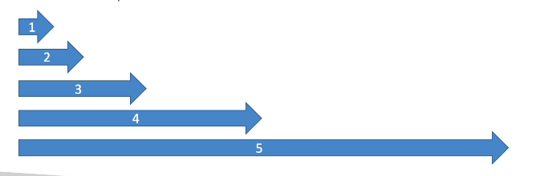


---

### Credentials Provider chain

Descreve a sequencia que se usa para recuperar os acessos ao recursos da AWS.

- CLI
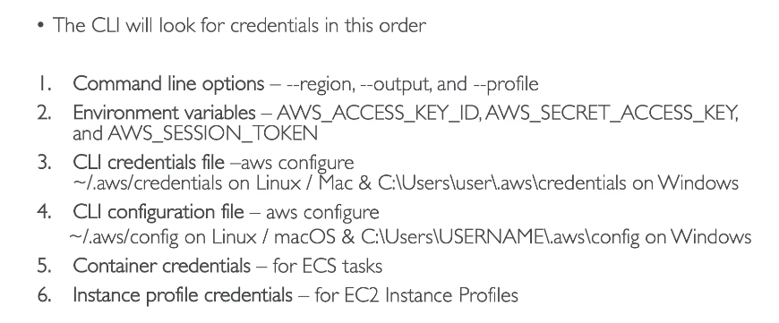

- SDK
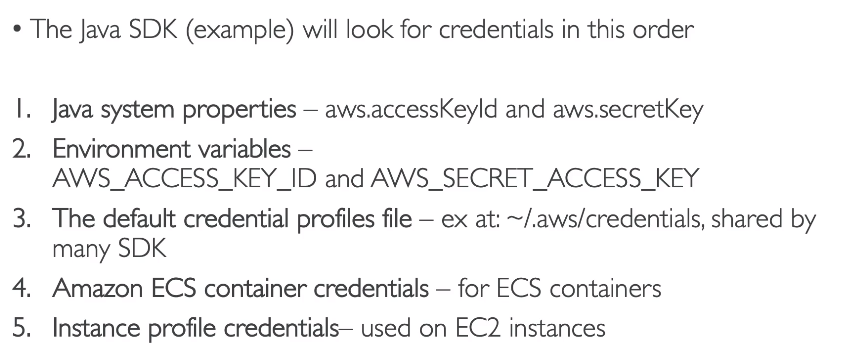


---

## Redes e entrega de conteúdo:

### CloudFront

{}
> Contextualização:

 - O que é [CloudFront](https://docs.uniii.com.br/02-cloud-notes/01-aws/03-aws-cloud-architect-professional/02-conteudo.html#amazon-cloudfront)
{}


Para que o CloudFront possa armazenar o cache ele gera a **cache key** que:

- Por default é formada o hostname + path do recurso.
- Mas é possível adicionar outros itens na formação dessa chave, sendo:
  - **HTTP Headers** - nome, whitelist
  - **Cookies** -   nome, whitelist, include all except , all
  - **Queries strings** -   nome, whitelist, include all except , all

- Todos os itens adicionado a chave são enviados automaticamente para a origem caso não encontre no cache.
- Mas é possível adicionar esses itens apenas na origem.
  - Cache policy vs Origin Request policy
  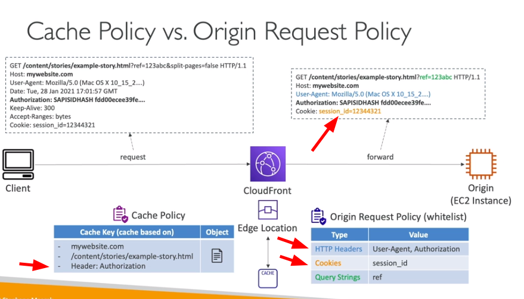

- Tem uma tela que permite invalidar o cache.

**Classes de cobrança**

- **all - all regions** - engloba todas as edge locations e tem melhor performance.
- **200 - most regions** - exclui as regiões mas caras
- **100** - as regiões mais baratas 


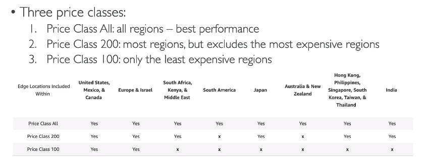


**Logs em tempo real**

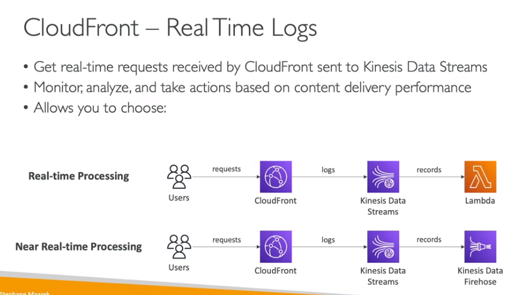

---

### Route 53

{}
> Contextualização:

 - O que é [Route 53](https://docs.uniii.com.br/02-cloud-notes/01-aws/03-aws-cloud-architect-professional/02-conteudo.html#amazon-route-53)
   {}


- Terminologia

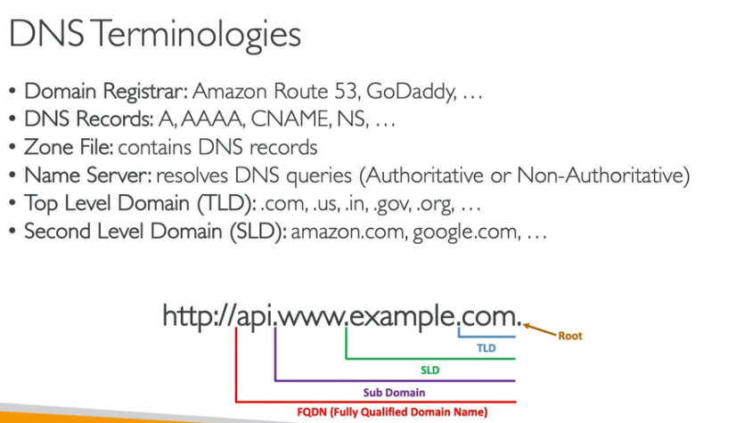


---

### VPC

{}
Não cai muitas coisas sobre isso na prova da certificação develop, mas é importante conhecer os conceitos.

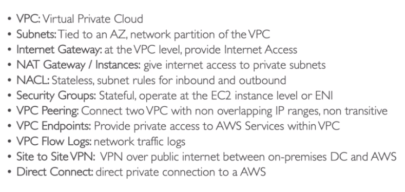

> Leitura recomendada:

 - [VPC para arquitetos](https://docs.uniii.com.br/02-cloud-notes/01-aws/03-aws-cloud-architect-professional/02-conteudo.html#aws-vpc)
   {}


---


## Segurança, identidade e conformidade:


### IAM

- Escopo global, controle de acessos.
- Tem como base o mínimo privilegio possível.
- Criação de usuário e grupos de usuários, grupos não podem conter outros grupos.
- Se atribui políticas de acesso (IAM Police) ao grupo, que vão dar acesso a todos os usuário daquele grupo.
- Políticas de acesso (permissões).
  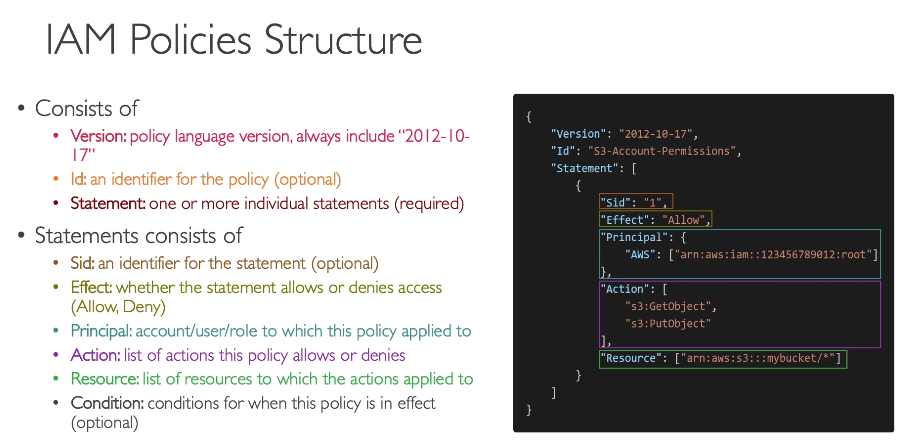
  - Escrita em json.
  - Seguir regra de menor privilégio.
  - A validação de acesso e feito a cada acesso, de forma automática.
  - Podem ser do tipo:
    - **identity-based** - Política que são destinados a usuário / grupos e rules
    - **resource-based** - Políticas que são atribuídas a recursos, para da acesso a outro recursos.
- Access keys - usadas para dar acesso ao AWS CLI e ao AWS SDK.
  - É possível usar um serviço de shell na nuvem (**cloud shell**) que gera um CLI sem a necessidade de configurar access key.
- Roles (funções)
  - Usadas para dar acessos de recursos a recurso (acesso ao S3 por um EC2)
  - Criação de roles de dão acesso a recurso sem ser necessário atribuir ao um usuário ou grupo
  - Podem ser assumidas por recursos ou usuários federados ou usuário de outras contas AWS.
- Dentro do **IAM** temos:
  - **iam user** - Usuário comum.
  - **federated user** - usuário de fora da organização, usuário do **Facebook** por exemplo.
  - **iam role** - permissões que são dadas a recurso, tipo EC2 para acessa um S3.
  - **identity provider (idp)** - Permite customizado acesso provider de terceiros e liberara acesso via token de acesso do STS.
- **IAM Conditions**
  - Permite adicionar condições nas políticas de acessos AWS.
    [](https://docs.uniii.com.br/02-cloud-notes/01-aws/01-aws-cloud-architect-associate.html#image-167ee62909f74073da7853a674734374)
- **IAM Permission Boundaries** (limite de permissões)
  - Quando se criar usuário ou **Roles** e possível dar **permissão genéricas,** tipo de administrador , e setar um **limite** para essas permissões, exemplo o cara é administrado apenas nos recursos do S3.
  - SCP (Service control policies ).
    [](https://docs.uniii.com.br/02-cloud-notes/01-aws/01-aws-cloud-architect-associate.html#image-de03a6f085724008f9923afa31e24703)
- **Lógica da avaliação de política**
[](https://docs.uniii.com.br/02-cloud-notes/01-aws/01-aws-cloud-architect-associate.html#image-bb88ec8672b017a01d1b1d9da984a184)

#### MFA (multi factory atutenticator)

- combinação de uma senha que você conhece com um dispositivo que é seu
```shell
- Há dois via sofware (dispositivo MFA virtual, Chave de chegurança U2F (ex: YUbiKey))
- Há uma opção de Hardware (ex: token Gemalto)
```

#### IAM Security Tools

- **IAM Credencial Report (Account level)** -> Lista todas as contas de usuário e o status de cada uma.
- **IAM Access Advisor** -> Mostras os serviços que o usuário tem acesso e a ultima vez que o mesmo acessou.

#### Responsabilidade compartilhada

> a segurança na cloud é compartilhada e a AWS e nós temos responsabilidades para garantir a conformidade e segurança
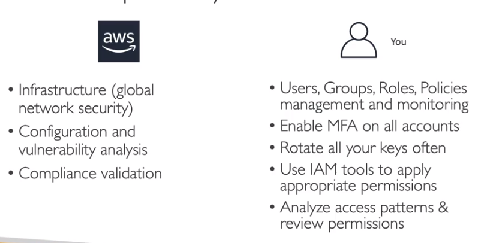


---
## Armazenamento:

> {}
Contextualização:
 - Armazenamento [guia completo AWS](https://docs.uniii.com.br/02-cloud-notes/01-aws/03-aws-cloud-architect-professional/02-conteudo.html#storage)

 Veja direto o que é:
 - [EBS](https://docs.uniii.com.br/02-cloud-notes/01-aws/03-aws-cloud-architect-professional/02-conteudo.html#ebs---elastic-block-storage)
 - [Instance store](https://docs.uniii.com.br/02-cloud-notes/01-aws/03-aws-cloud-architect-professional/02-conteudo.html#instance-store)
 - [EFS](https://docs.uniii.com.br/02-cloud-notes/01-aws/03-aws-cloud-architect-professional/02-conteudo.html#efs---elastic-file-system)
{}


## S3 

> {}
Contextualização:
 - [S3](https://docs.uniii.com.br/02-cloud-notes/01-aws/03-aws-cloud-architect-professional/02-conteudo.html#amazon-s3)

Uma questão comum quanto ao S3 é como melhorar o tempo de busca de arquivos, a arquitetura que melhora resolve esse problema seria criar um index no DynamoDB com os metadados e tags do arquivos e realizar as busca no DynamoDB e apenas recuperar os arquivos no S3.
{}


 S3 - Encryption para prova

- **SSE-S3** - Criptografa os objetos do S3 usando chave gerenciada pela AWS (AES-256).
  - Usa o header "**X-amz-server-side-encryption**": "**AES256**".
- SSE-KMS - Criptografa os objetos do S3 usando chaves criadas no KMS.
  - As chamadas de uso do KMS é logado no cloudtrail.
  - Usa o header "**X-amz-server-side-encryption**": "**aws:kms**".
  - Usa a api **GenerateDataKey** para criptografar.
  - Tem limitação (quotas), pode não ser uma boa ideia usar se tiver muitas requisições, pois a cada chamada será consumido parte da cota, aumentando assim o custo, sendo melhor usar a **SSE-S3**
  - **Caso esteja usando essa criptografia, se o bucket for publico, o usuário não vai conseguir ver os objetos**, pois ele não vai ter acesso a chave.
  - Para conseguir realizar uploads no bucket, precisa ter acesso a permissão (**kms:GenerateDataKey**) caso contrario não vai conseguir.
- SSE-C - Criptografa os objetos do S3 usando a chave gerenciada pelo usuário, quando se usa por exemplo o Cloud HSM.
- Criptografia Client-Side - Quando o usuário criptografa os dados antes de enviar ao S3.
- É possível criar uma bucket police para forçar o uso do SSL nas requisições com a condição **aws:secureTransport**.
- também é possível criar polices para bloquear uploads de arquivos que não tenha um tipo de criptografia, usando uma police que bloqueia com as condições **s3:x-amz-server-side-encryption** ou **s3:x-amz-server-side-encryption-customer-algorithm**.

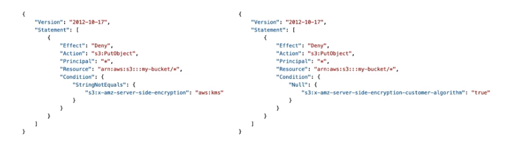

