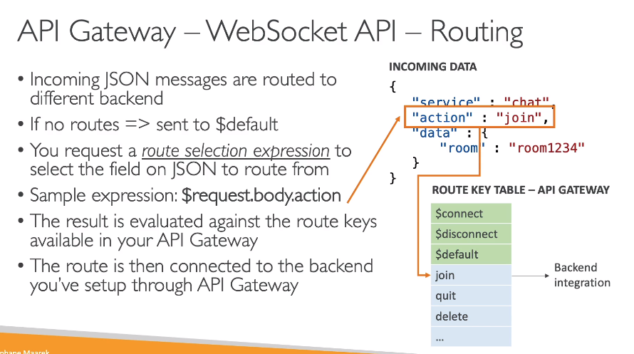

---
title: "Develop Associate"
weight: 4

---

---

{}
Leia sobre a [AWS Certified Developer - Associate. (DVA-C02)](https://aws.amazon.com/pt/certification/certified-developer-associate)
{}

---

| Dominio | % do exame |
| ------- | ---------- |  
|Domínio 1: Desenvolvimento com os serviços da AWS |32%|
|Domínio 2: Segurança |26%|
|Domínio 3: Implantação |24%|
|Domínio 4: Solução de problemas e otimização |18%|


Recursos e produtos da AWS no escopo
{}
Análise:
- [x] Amazon Athena
- [x] Amazon OpenSearch Service

Integração de aplicativos:
- [x] AWS AppSync
- [x] Amazon EventBridge (Amazon CloudWatch Events)
- [x] Amazon SNS
- [x] Amazon SQS
- [x] Amazon Kinesis
- [x] AWS Step Functions
- [x] AWS MSK

Computação:
- [x] Amazon EC2
- [x] AWS Elastic Beanstalk
- [x] AWS Lambda
- [x] AWS Serverless Application Model (AWS SAM)

Contêineres:
- [x] AWS Copilot
- [x] Amazon ECR
- [x] Amazon ECS
- [x] Amazon EKS

Banco de dados:
- [x] Amazon Aurora
- [x] Amazon DynamoDB
- [x] Amazon ElastiCache
- [x] Amazon MemoryDB para Redis
- [x] Amazon RDS

Ferramentas do desenvolvedor:
- [x] AWS Amplify
- [x] AWS Cloud9
- [x] AWS CloudShell
- [x] AWS CodeArtifact
- [x] AWS CodeBuild
- [x] AWS CodeCommit
- [x] AWS CodeDeploy
- [x] Amazon CodeGuru
- [x] AWS CodePipeline
- [x] AWS CodeStar
- [x] AWS X-Ray

Gerenciamento e governança:
- [ ] AWS AppConfig
- [x] AWS Cloud Development Kit (AWS CDK)
- [X] AWS CloudFormation
- [x] AWS CloudTrail
- [x] Amazon CloudWatch
- [x] Amazon CloudWatch Logs
- [x] AWS CLI
- [x] AWS Systems Manager

Redes e entrega de conteúdo:
- [x] Amazon API Gateway
- [x] Amazon CloudFront
- [x] Elastic Load Balancing
- [x] Amazon Route 53
- [x] Amazon VPC

Segurança, identidade e conformidade:
- [x] AWS Certificate Manager (ACM)
- [ ] AWS Certificate Manager Private Certificate Authority
- [x] Amazon Cognito
- [x] AWS IAM
- [x] AWS KMS
- [x] AWS Secrets Manager
- [x] AWS Security Token Service (AWS STS)
- [ ] AWS WAF

Armazenamento:
- [x] Amazon EBS
- [x] Amazon EFS
- [x] Amazon S3
- [x] Amazon S3 Glacier
{}

---

## Análise:

> Serviços AWS usado para análise de dados.

### AWS Athena

{}
> Contextualização:

 - O que é [AWS Athena](https://docs.uniii.com.br/02-cloud-notes/01-aws/03-aws-cloud-architect-professional/02-conteudo.html#aws-athena)
{}


---

### Amazon OpenSearch Service

{}
> Contextualização:

 - O que é [OpenSearch](https://docs.uniii.com.br/02-cloud-notes/01-aws/03-aws-cloud-architect-professional/02-conteudo.html#aws-opensearch)
{}

---

## Integração de aplicativos:

{}

Tempos os seguintes serviços AWS usados para integração de aplicações:
- SQS -> para um modelo de filas.
- SNS -> para um modelo de pub/sub.
- Kinesis -> para um modelo de processamento em tempo real.
 {}

---
### AWS Amplify


- **Amplify Studio** - Permite criar Mobile e Web Applications.
  - Com ele se cria tanto o backend quanto o frontend.
  - Seria como um **beanstalk** para aplicações mobile e web.
  - Usa o CloudFormation para criar os recursos (banco, filas, S3).
  - Usa o AppSync para criar as API GraphQl.
- **Amplify CLI** - Permite configurar o backend com um cli guiado (respondendo perguntas).
- **Amplify Libraries** - Libs para conectar sua app a serviçso AWS.
- **Amplify Hosting** - Permite hospedar as aplicações.
  - Configura como vai ser a implantação.
  
- Features importantes

- Testes E2E


---

### AWS AppSync

 {}
> Contextualização:
 - O que é [AppSync](https://docs.uniii.com.br/02-cloud-notes/01-aws/03-aws-cloud-architect-professional/02-conteudo.html#appsync)
{}

---

### Amazon SQS

{}
> Contextualização:
 - O que é [SQS](https://docs.uniii.com.br/02-cloud-notes/01-aws/03-aws-cloud-architect-professional/02-conteudo.html#amazon-sqs)
 {}

#### Visão extra - desenvolvedor
- Usado para desacoplar aplicações.
- Tem baixa latência (<10 ms).
- Permite mensagem duplicadas (ou seja, não valida o conteúdo da mensagem).
- Para o processamento de mensagem duplicados, usa se o **Message visibility timeout** para tornar a mensagem invisível aos demais consumer.
- Para produzir mensagem usa se o SDK com a API (sendMessage).
- Há dois tipos de filas SQS
  - **Standard**
    - Tem Throughput ilimitado, e quantidade de mensagem na fila ilimitado.
    - Entrega a mensagem ao menos uma vez para os consumers.
    - Ordena as mensagens buscando o melhor esforço.
  - **FIFO** 
    - Tem throughput de 300 msg/s  e 3000 msg/s usando batch.
    - Não tem mensagens duplicadas. Pois tem uma funcionalidade que permite remove-las.
    - Ordena por ordem de chegada.
    - Entrega apenas uma vez a mensagem.
- Conceitos para desenvolvedores:
  - **Long Polling** - Capacidade opcional de ficar esperando, caso não haja mensagens na fila, até uma mensagem chegar.
    - Reduz a quantidade de chamadas de API a fila, aumentado a eficiência e latência da aplicação.
    - Pode se configurar de 1 segundo a 20 (ideal) segundos de tempo.
    - É recomendado o uso ao invés do polling normal (short polling).
    - Pode ser configurado Queue level ou via API level usando **(ReceiveMessageWaitTimeSeconds)**.
  - **Extended Cliente** - Capacidade de enviar mensagem acima de 256kb usando o S3 para salvar a mensagem e se posta apenas os metadados na fila.
    - Usados para enviar videos para processamento,
  - Nomes das APIs
    - **CreateQueue** com (MessageRetentionPeriod), **DeleteQueue**.
    - **PurgeQueue** permite deletar todas as mensagens de uma fila.
    - **SendMessage** com (DelaySeconds), ReceiveMessage, DeleteMessage.
    - **MaxNumberOfMessages** - Permite definir a quantidade de mensagem que podem ser consumida por vez. (default 1 , max 10).
    - **ReceiveMessageWaitTimeSeconds** - Permite configurar o Long Polling.
    - **ChangeMessageVisibility** - Permite mudar o tempo de visibilidade da mensagem.
  - Há também API batch para enviar, deletar e mudar a visibilidade, o que reduz o custo diminuindo a quantidade de chamada ao SQS.
  - **FIFO** conceitos avançados:
    - **de-duplication** - funcionalidade que permite recusar mensagens que estão duplicadas.
      - O tempo em que ignora uma nova mensagem com o mesmo id e de 5 minutos. A partir desse período não considera a nova mensagem como duplicata. 
      - Há dois métodos de de-duplication:
        - Baseado no conteúdo: Gerar um hash sha-256 do body para comparação.
          - Ao se criar a fila, pode setar se ele vai considerar esse método. Caso seleciona o método via ID será opcional.
        - Baseado no ID: Se passa um id de de-duplication ao postar a mensagem.
    - **Message group** - permite agrupar mensagem por um MessageGroupId.
      - Utils quando se que usar a fila para mais de um processo, assim pode se configurar um consumer para considerar apenas as mensagens do grupo.
      - Porém a ordem só é garantida dentro do grupo.      
      


---

### SNS 

{}
> Contextualização:
 - O que é [SNS](https://docs.uniii.com.br/02-cloud-notes/01-aws/03-aws-cloud-architect-professional/02-conteudo.html#amazon-sns)
 {}

#### Visão extra - desenvolvedor
- Há dois tipos de tópicos SNS:
  - **Standard**
    - Notifica a mensagem apenas uma vez para os subscritos. Depois a mensagem e deletada automaticamente.
    - Ordenas as mensagens buscando o melhor esforço.
  - **FIFO** 
    - Tem throughput de 300 msg/s  e 3000 msg/s usando batch.
    - Não tem mensagens duplicadas. Pois tem uma funcionalidade que permite remove-las.
    - Ordena por ordem de chegada.
    - Notifica apenas uma vez a mensagem.
    - Notifica apenas para **SQS FIFO**.

---

### Kinesis

{}
- Usado para coletar, processar, analisar e distribuir dados em tempo real.
- Composto pelas aplicações
  - **Kinesis Data streams** - Captura, processa e armazena fluxos de dados.
  - **Kinesis Data Firehose** - Carrega dados para armazenamentos no AWS.
  - **Kinesis Data Analytics** - Analisa fluxos de dados com SQL e Apache Flink.
  - **Kinesis vídeo streams** - Capture, processa e guardar fluxo de dados de vídeos.
   {}

{}
> Contextualização:

 - O que é [Kinesis](https://docs.uniii.com.br/02-cloud-notes/01-aws/03-aws-cloud-architect-professional/02-conteudo.html#aws-kinesis)
 {}

#### Visão extra - desenvolvedor

- Usado para ingestão de log, métricas, website ClickStreams, telemetria IOT.

- **Kinesis Producer**
  - Record é composto por:
    - chave de partição (gerada ao enviar para o kinesis), Blob data (ate 1MB).
    - Usa um hash chave de partição para definir em que shard vai armazenar.
    - Por isso que deve se definir uma boa chave de partição, de forma a espalhar os dado nos shards evitando sub utilização.
  - Pode ser produzidos por SDK (low level), KPL (high level por oferecer compressão e batch) e kinesis agent para logs de aplicação.
  - Usa a API **PutRecord**.
  - Recomenda usar KPL com Batch, para diminuir custos e aumentar o throughput.
  - Pode lançar a exception **ProvisionedThroughputExceeded** caso envie mais do que é capaz de aceitar. exemplo se tem apenas um shard (pois usou um PK bem restrita) e tenta enviar 2 MB/s sabendo que so aceita 1 MB/s.
    - Soluções:
      - Usar chaves de partições que seja bem distribuídas.
      - Implementar exponential backoff.
      - Aumentar a quantidade de shards.
  
- **Kinesis Consumer**
  - há dois modos de uso:
    - **Shared (Classic) Fan-out**
      - 2 MB/s considerando todos os consumers.
      - Usa a API **GetRecords**.
      - O consumer busca os dados (pull mode).
      - Tem limite de 5 chamadas de APIs por shard por segundos.
    - **Enhanced Fan-out**
      - 2 MB/s por consumer por shard.
      - Usa a API **SubscribeToShard**.
      - O shard envia os dados para o consumer (push mode).
      - Latência e muito baixa 70 ms.

- **KCL - Kinesis client library**

  - Facilita o consumo dos dados. É uma lib java.
  - Cada shard pode ser lido apenas por uma instância KCL. 
    - exemplo: 4 shards -> pode se ter no máximo 4 instâncias do KCL
    - Isso significa que o auto scale esta relacionado a quantidade de shard que se tem provisionados.
  - Usa o DynamoDB para guardar o progresso, por isso precisa configurar acessos no IAM. Isso porque pode haver mais de um KCL executando e para que não haja colisão o track é feito usando o DynamoDB.

- **Kinesis Operations**
  - **Shard Splitting**
    
    - ​	Usado para aumentar a capacidade de stream, ou seja usado para quebrar um shard e outro novos, a fim de aliviar a carga.
    - o shard antigo vai ser deletado quando os dados expirarem e os dados novos serão divididos entre os novos.
  - **Shard Merging**
    
    - O contrario do splitting
    - o shard antigo vai ser deletado quando os dados expirarem e os dados novos serão enviados para o novo.


---

### AWS MSK

{}
> Contextualização:

 - O que é [MSK](https://docs.uniii.com.br/02-cloud-notes/01-aws/03-aws-cloud-architect-professional/02-conteudo.html#msk)
{}

---
### AWS Step Functions

{}
> Contextualização:

 - O que é [Step Functions](https://docs.uniii.com.br/02-cloud-notes/01-aws/03-aws-cloud-architect-professional/02-conteudo.html#aws-step-functions)
 {}

- Escrito em json.
- usado para orquestrar chamada de serviços.
- Cada etapa é chamado de task.
  - Tem que ter uma entrada e uma saída.
  
- Tem os tipos:
  - **Choice State** - Testa uma condição para enviar para uma branch (ramificação).
  - **Fail or Succced State** - Execução parada por erro ou sucesso.
  - **Pass State** - Recebe os dados e repassa sem realizar nenhum processamento.
  - **Wait State** - Espera por uma quantidade de tempo.
  - **Map State** - Permite criar um loop.
  - **Parallel State** - Para processos em paralelo.
  
- Erro handling
  - Quem deve tratar deve ser o Step Function. Isso pois a aplicação deve ter códigos simples.
  - Pode se usar dois tipos de handles:
    - **retry** - realiza uma retentativa de executar a task que falhou.
      - Se configura os tipos de erros e a quantidade de retry com exponetial Backoff.
      
      - Caso atinga a quantidade máxima de tentativas o **catch** é acionado.
    - **catch** - Pode se adicionar um fluxo alternativo ou uma notificação via eventos.
          
      - Passa se o dados do erros adiante com o **ResultPath**    
          
    - Tipos de códigos de erros
      - States.ALL -> Pega todos tipo de erros.
      - States.Timeout -> Pega os timeouts.
      - States.TaskFailed -> Pega falhas de execução.
      - States.Permitions -> Pegas erros de falha de permissão de execução.
  - Tem uma funcionalidade chamada **wait for task token** que funciona como se fosse um callback para dar prosseguimento a execução.
    - Usado quando se aciona um sistema externo (que não seja um Lambda.).  
      
  - Tem a funcionalidade chamada de **Activity Task** para aplicações externas.
    - Aqui se roda um **Activity worker** no EC2, Lambda, ou mobile device, ele realiza poll de tempos em tempos via a API **GetActivityTask** no Step Function em busca de itens a serem processados.
    - Após finalizar o processamento do item encontrado ele aciona o Step Function via as APIs **SendTaskSuccess** ou **SendTaskFailure** com o output do processamento.  
    - Deve se configurar um timeout, para não ficar esperando para sempre após uma task ser liberada para processamento.
    

---
## Computação:


----

### AWS Budget

 {}
Veja aqui tudo que se precisa saber sobre [Budgets](https://docs.uniii.com.br/02-cloud-notes/01-aws/03-aws-cloud-architect-professional/02-conteudo.html#aws-budget)
{}


---

### EC2

{}
> Contextualização:
 - O que é [EC2](https://docs.uniii.com.br/02-cloud-notes/01-aws/03-aws-cloud-architect-professional/02-conteudo.html#ec2)
 - O que é [Security Group](https://docs.uniii.com.br/02-cloud-notes/01-aws/03-aws-cloud-architect-professional/02-conteudo.html#security-group)
 {}

 - Key pair


{}
Ao gerar o key pair atente-se ao:
- Tipo da chave:
  -	RSA:  Usado em linux e Windows.
  -	ED25519: Não suportado pelo Windows.
- Formato
  - .pem - formato aberto usado pelo openssh.
  - .ppk - formato do putty (windows 7 e 8).
  {}


#### Use data

Usado para pre configurar um instancia Ec2. O exemplo abaixo instala o apache na instância.

```shell
## Considerando que AMI seja RedHat Based.

#!/bin/bash
yum update -y
yum install httpd -y
systemctl start httpd
systemctl enable httpd
echo “Hello World from $(hostname -f)” > /var/www/html/index.html
```

#### IMDS - EC2 instance metadata

- Informações sobre a instância.
- Permite que instâncias vejam informações sobre elas mesmas, sem a necessidade de ter um IAM Role.
- Pode ser acessado via **URL**: http://169.254.169.254/latest/meta-data.
  - Permite acessar tanto o user data (script de inicialização) quanto o meta data.Só permite acesso, não preciso negar.
- Ha duas versões
  - **IMDSv1** 
    - Acessa diretamente a **URL**: http://169.254.169.254/latest/meta-data.
  - **IMDSv2** -
    - Mais seguro pois agora o acesso é feito em dois passos
    - Recuperar o token de sessão.
    ```shell
    TOKEN=`curl -X PUT "http://169.254.169.154/latest/api/token" -H "X-aws-ec2-metadata-token-ttl-secondas:21060"`
    ```
    - Recuperar os dados passando o token via heardes:
    ```shell
      curl http://169.254.169.254/latest/metadata -H "X-aws-ec2-metadata-token: $TOKEN" 
      ```
- Quando se configura credencias para a instancia ela usa o **IMDS** para recuperar-las usando a chamada
```shell
  curl  -H "X-aws-ec2-metadata-token: $TOKEN" http://169.254.169.254/latest/metadata/identity-credentials/ec2/security-credentials/ec2-instance
```

  


---

#### ELB / ASG

 {}
> Contextualização:
 - O que é [ELB](https://docs.uniii.com.br/02-cloud-notes/01-aws/03-aws-cloud-architect-professional/02-conteudo.html#elastic-load-balancing)
 - O que é um [ALG](https://docs.uniii.com.br/02-cloud-notes/01-aws/03-aws-cloud-architect-professional/02-conteudo.html#auto-scaling-group-alg)
 {}


---

### Beanstalk

 {}
> Contextualização:
 - O que é [Beanstalk](https://docs.uniii.com.br/02-cloud-notes/01-aws/03-aws-cloud-architect-professional/02-conteudo.html#aws-elastic-beanstalk
)
 {}

#### Beanstalk - Avançado

- Usa o **CloudFormation** para provisionar qualquer recursos na AWS.
- Dentre os formas de deploy (sigle instance e high availability) há a opção de usar instâncias spot.
- Os passos para usar o beanstalk são:
  - Configure a ambiente (plataforma (java, node ..) e recursos usados).
  - Configure os acesso do serviços (roles iam).
  - Configure rede, e banco de dados e tags. Opcional.
  - Configure trafego e politica de escalabilidade. Opcional.
  - Configure updates e monitoramento. Opcional.
- Tem uma funcionalidade de **swap envoriment** onde se pode redirecionar o DNS de um ambiente para outro.
  - O uso disso se faz numa implantação em prod, onde se cria um clone do ambiente atual e atualiza e testa no clone e após isso se troca esse pelo o de prod.
- Tem também um CLI chamado de **eb cli** que facilita o uso de CLI para automatizar pipelines.
- Dentro da aplicação que devemos deployar pode haver uma pasta **.ebextensions** na raiz e :
  - Tem o formato yml/json e a extensão do arquivo deve ser **.config**.
  - Permite altera configurações padrões usando **option_settings**
  - Permite adicionar recursos com RDS, ElastiCache, DynamoDb ....
  - Todos os recursos adicionado via **ebextensions** são deletado quando o ambiente é deletado.
- As opções de deploys para updates são:
  
  - **All at once** - Tudo de uma vez.
    - É mais rápido, mas a instancia fica indisponível por algum tempo.
    - Bom para ambientes de dev e hom.  
    
  - **Rolling** - Cria uma nova versão (chamada de **bucket**)  derrubando parte das instâncias já existentes e redireciona o trafego quando a nova versão estiver de pé.

    - Não há custo adicional.
    - Demora mais tempo para deployar.
  
  - **Rolling com batches adicionais** - Igual ao anterior, mas faz o redirecionamento em partes, mantendo a convivência entre a nova e a versão antigo por algum tempo.
    - Diferente o anterior que seleciona parte das aplicações e derruba pra subir novas essa cria novas e convive com elas por um tempo.
    - Tem um custo adicional. Pois adiciona novas instâncias.
    - Bom para ambientes produtivos. Pois se mantém a capacidade da aplicação sem comprometer o uso.
    
  - **Immutable** - realiza o deploy das instâncias em novo ASG, e quanto esse estiver disponível, se move as instâncias para o ASG antigo e termina as instâncias anteriores.
    - Tem Zero Downtime. Pois cria um ASG temporário.
    - Tem um custo alto pois duplica a quantidade de instância.
    - Mas rápido que o **Rolling**.
    - Bom para produção.
    
  - **Blue/green** - Cria se um novo ambiente, e redireciona (Route 53) quando estiver tudo ok.
    - Tem Zero Downtime.
    - Não é uma feature do **beanstalk** é mais um conceito que pode aplicado. Pois o redirect tem que ser feito manualmente.
    
  - **Traffic Splitting**  envia uma porcentagem de trafego para grupo de instâncias.
  - Usado para teste canário.
    - Duplica a quantidade de instâncias,
    - Tem um custo extra.
    - Facilita rollback e teste.
    

---

#### Ciclo de vida (lifecycle police)

- Pode armazenar mais de 1000 versões de aplicações. Deve se remover de tempos em tempos versões antiga. 
- Para isso uso o Ciclo de vida que pode ser:
  - Baseado em tempo (versões antiga)
  - Baseado em espaço usado (quando se esta ocupando muito espaço com versões antigas)
- Oferece a opção de armazenar as versões no S3 para não haver perda de dados.

---

#### Beanstalk clonning

- Permite clonar um ambiente, mantendo as mesmas configurações.
- Útil para testar uma nova versão da aplicação. Ou atualização de versão da plataforma.
- Todos os recursos da nova versão são preservados.
  - Apenas no caso de Banco de dados que os dados não são clonados apenas as configurações.
- Usado em conjunto a a funcionalidade de **swap**, onde se cria um clone, implanta a nova versão e depois dela ok, se troca o DNS para apontar para a nova versão.


---

#### Migrations

- Após criar um ambiente, não se pode mudar o tipo do **load balancer** apenas as configurações, caso precise mudar será necessário realizar uma migração.
  - Para isso:
    - Crie um novo ambiente com as mesmas configurações, exceto o ELB. (ou seja não pode ser um clone).
    - Deploy a aplicação no novo ambiente.
    - Use o Swap ou o Route 53 para redirecionar o trafego da aplicação.
    - Mate o ambiente anterior.
- Apesar de poder provisionar o RDS via Beanstalk, não é recomendado para ambiente produtivo. Nesse caso o ideal é ter o banco separado.


---

### Lambda


 {}
> Contextualização:
 - O que é [Lambda](https://docs.uniii.com.br/02-cloud-notes/01-aws/03-aws-cloud-architect-professional/02-conteudo.html#aws-lambda)
 {}

#### Visão extra - desenvolvedor
- Linguagem suportadas:
  - Node / Python/ java / c# / Ruby / Golang.
  - Caso seja diferentes dessa pode rodar usando **custom Runtime API** (open source project).
- As dependências devem ser enviadas juntos com o condigo da Lambda. Respeitando a limitações do tamanho do pacote. 
- Suporta também **Lambda Contêiner Image**.
  - Criadas usando o Lambda Runtime API.
- Para atualizar uma Lambda usando o **CloudFormation** deve se realizar o upload o pacote zipado para o S3 e referência-lo no CloudFormation.
  - O S3 deve usar versionamento, para poder disparar o CloudFormation.
  - Caso use para implantar em cross account é necessário ter um Bucket police para permitir acesso ao CloudFormation de cada conta.
- **Lambda Trigger**
  - Na integração com ELB, os dados do request são transformado em Json e repassados a Lambda.
    - O ALB suporta o Multi Header values (necessário habilitar no target group), isto é quando se passa **query string parameters** com múltiplos valores eles são convertido para um objeto json como um array.  
    

  - Há dois modos de operação:
    - Síncrono -> Você chama e esperar pela resposta. (as filas e o stream entram aqui, pois existe o **event source mapping** que realiza a chamada síncrona da Lambda).
    - Assíncrono -> um evento dispara a Lambda, nesse caso a Lambda executa baseados no evento.    
          
      - Caso ocorram erros haverá retry sendo:
        - 3 retry no total.
        - 1 minuto após 1ª chamada, depois aguarda 2 minutos.
        - Deve se garantir que o processamento é idempotente, em casos de retry.
        - Isso é para evitar duplicar logs e criar loop infinito de retentativas na Lambda.
        - Pode se definir uma DLQ (SNS ou SQS) para notificar sobre falhas (precisa de permissão IAM).

  - Integrações com CW Events  / EventBridge 
      - **Via CRON**
        - A cada **x** tempo dispara a Lambda.
      - **Via EventBridge Role** (baseado em um padrão de evento, ex: exclusão de EC2)
        - Trigga quando status sofre mudança.

  - **Event Source Mapping** - Lambda Trigger  
    - Responsável por realizar o polling de dados do **Kinesis Data Stream, SQS, DynamoDB Stream** e invocar a Lambda. Em outra palavras é um processo que realiza o polling dos itens e monta os batches para o Lambda processar.
    - há dois tipos:
      - **Stream**
        - Usado com Kinesis e DynamoDB.
        - cria-se um iterador para cadas shard, e processa os itens em ordem. Inicia do inicio ou a partir de um período.
        - Se ocorrer um erro todo batch é reprocessado.
        - Permite informar uma DLQ para caso de erros.
        
        - Escalonamento 
          - Uma Lambda por shard 
          - Caso use paralelizado, processa 10 batches por shard simultaneamente.
      - **Queue**
        - Usado para SQS e SQS FIFO.
        - Pode se configurar o tamanho do batch.
        - Se configurar a DLQ na Fila, com uma politica de tentativa de erros. Pois DLQ no Lambda é só para chamadas assíncronas, e nesse caso são chamadas síncronas.    
        
        - O Lambda suporta processamento em ordem FIFO, escalando de acordo com o numero de groups ativos. - Escalonamento 
          - Para SQS Standard
            - Pode escalar até 60 instância por minuto.
            - Pode processar até 1000 batches de mensagens simultaneamente.
          - Para SQS FIFO
            - Processa a mensagem em ordem desde que estejam no mesmo GrupoID.
            - Scala de acordo com numero de grupo de mensagem ativos.

  - **Event e Context Object**  
      
    - Quando uma Lambda é aciona ela recebe dois tipos de dados no formato Json, que são:
      - **Event Object**
        - Contém os dados para que a função processe.
        - Contém os dados de quem acionou (todas as informações necessárias)
        - É convertido em um objeto de acordo com o tipo da Lambda (python, java, node) e fica disponível para uso.
      - **Context Object**
        - Contém informações sobre o contexto de execução da Lambda, com memoria_limit_in_mb, function_name, aws_request_id.

- **Lambda destination**
  - Após o processamento da Lambda pode se configurá-la para enviar o resultado para outros serviços AWS.
  - Podendo ser: 
    - Para invocações **assíncronas**: 
      - Pode enviar o resultado em caso de sucesso ou falha para SQS, SNS, Lambda, EventBridge.
      - Recomendado usar ao invés de DLQ, por ser uma solução mais direta. (não requer um solução para o processamento da DLQ).
    - Para **event source mapping** do tipo stream.
      - Para batch descartados: SQS, SNS

- **Lambda polices**
  - **Lambda Execution Role**
    - IAM Role que da acesso ao recursos para leitura e escritas.
      - AWSLambdaBasicExecutionRole -> permite fazer upload de logs para CloudWatch.
      - AWSLambdaKinesisExecutionRole -> permite ler do Kinesis,
      - AWSLambdaDynamoDBExecutionRole -> Permite ler de streams do DynamoDB.
      - AWSLambdaSQSQueueExecutionRole -> permite ler do SQS.
      - AWSLambdaVPCAccessExecutionRole -> permite implantar funções Lambda dentro de nosso VPC.
      - AWSLambdaXrayDaemonWriteAccess -> permite carregar dados de rastreamento para o X-Ray.
      - Recomendado criar uma por Lambda. 
      - Usada quando a lambda realize o pulling das mensagem via **event source mapping**.
  - **Resource Based police**
  - Para que outros serviços consigam chamar uma Lambda deve se criar uma **Resource Based police**
    - Similar a S3 Police. Onde se define quem pode invocar a Lambda.
    - Usado onde um recurso aciona a lambda.

- **Lambda Logging & Monitoring**
  - Usa CW Logs - para logar a execução (precisa da role AWSLambdaBasicExecutionRole ).
  - Usa CW Metrics - para guardar métricas (invocações, duração, execuções concorrentes, erros, rates, throttles).
  - Usa X-Ray - para guardar o traces (necessário ativar, vem desabilitado default), precisar usar X-ray SDK para marcar os traces.


- **Lambda VPC**
  - Por padrão as lambdas rodam um uma VPC gerenciada pela AWS a parte, ou seja não na sua VPC. 
  - Com isso é possível acessar a internet e recursos reginais como DynamoDB e S3.
  - Assim não da para acessar os recursos que são criados na VPC criada na sua conta.
    - Para resolver isso é necessário realizar a implantação da lambda em sua VPC informando o VPC ID, as subnets e grupos de segurança.
    - O o Lambda criar uma ENI nas subnets para conectar a VPC. Precisa ter permissão para criar ENI (API CreateNetworkInterface) ou via role **AWSLambdaENIExecutionRole**.
    - Também é necessário uma role de acesso chamada **AWSLambdaVPCAccessExecutionRole**.    
    
  - Lambdas configuradas para rodar em uma VPC em uma subnet publica **não terá acesso a internet ou tera um IP publico.**
  - Para ter acesso deve se rodar a Lambda em uma subnet privada e usar o NAT Gateway | instance para acessar a internet.  
  

- **Lambda performance**
  - CPU esta relacionado a Memória, aumentado memoria aumenta CPU.
  - Deve executar entre 5 segundos e 15 minutos (timeout).
  - Tem o contexto de execução que:
    - Inicia as dependências de uma Lambda (conexões com banco). É uma péssima ideia iniciar uma conexão com banco de dado na função, pois isso consome do tempo de execução.  
    - Para usar é só chamar fora do handle da função.
        
    - É mantido por um tempo, é pode ser reutilizado por outras execuções (reduzindo tempo de inicialização).
    - Tem acesso ao diretório /tmp, para gravação de arquivos temporários. Será compartilhado com as outra execuções.
      - Para guardar aquivos grandes, que não precisam ser baixados a toda execução.
      - Tem até até 10 GB de espaço.
      - Caso precise encriptar dados use o KMS.
    - Caso precise de armazenamento permanente use o S3.

- **Lambda Layers**
  - Permite criar runtime customizadas.
  - Pode se ter até 5 layers por função de até 250 MB.
  - Permite externalizar dependências para reuso. Evitando assim perda de tempo com uploads de novas versões.  
  
  
- **Lambda File System Mounting**
  - Pode acessar o EFS se estiver rodando na VPC da sua conta.
  - Usa se **EFS Access Point** para isso.  
    
  - Cada Lambda executando será uma conexão no EFS.
  - Comparativo  
    

- **Lambda Concurrency an Throttling**
  - Pode ter até 1000 execuções concorrentes para toda conta - (soft Limit).
  - Pode se configurar a quantidade de concorrência que se quer ter via **reserved concurrency**.
  - Caso a quantidade de invocação passe o limite configurado ocorre o throttling.
  - É recomendado que se defina os limites, pois caso não defina, uma lambda pode causar o throttle em todas as outras dentro da conta.
  - No caso de invocações assíncronas:
    - Caso ocorra o throttling ela vai devolver para a fila interna e tenta reprocessar ao longo de 6 horas com um back off exponencial.

- **Lambda Container Image**
  - Permite executar contêiner criados com base na **Lambda Runtime API** de até 10 GB de tamanho.
  - A vantagem é que a imagem vai está com todas as dependências.  
  
  - Boas praticas:
    - Use sempre imagem Base AWS-provided.
    - Use multi-Stage build para diminuir o tamanho da aplicação.
    - Use o ECR para armazenar os Layer da imagem.

- **Lambda Version e Aliases**
  - Após o desenvolvimento é possível publicar a Lambda, criando assim uma versão.
    - Cada versão tem seu próprio ARN e é imutável.
    - O $Latest representa a ultima versão.
  - Pode ser criar Alias para essa versões.
    - Pode se criar alias por ambiente.
    - Usados para canário deploy, onde se pode adicionar uma segunda versão e colocar pesos no roteamento do tráfego a fim de testar a nova versão.
    - Não pode referênciar outros alias, apenas versões.  
    
  - Pode se usar o **Code Deploy** para realizar o traffic shift (roteamento do trafego).  
  

- **Lambda URL**
  - Permite criar um endpoint dedicado para o Lambda. Suporta IPV4 e IPV6.
  - Gerada um URL única para a Lambda, que pode apontar para um alias ou $Latest.
    - Não é possível apontar para versões diretamente.
  - Suporta CORS e politica baseada em recurso. (especificando CIDR ou IAM principal).
  - Pode ser configurada via Console ou API.
  - Tipo autenticação:
    - Auth Type None -> valida apenas politica Baseada em recurso. Dando acesso a todos.
    - Auth Type AWS_IAM -> valida o principal e a politica baseada em recurso.
      - O principal deve terá a permissão **lambda:InvokeFunctionUrl**.
    
    

- **Lambda boas praticas**


---

### AWS Serverless Application Model (SAM)

 {}
> Contextualização:
 - [SAM](https://docs.uniii.com.br/02-cloud-notes/01-aws/03-aws-cloud-architect-professional/02-conteudo.html#sam---serveless-aplication-model)
{}

#### Visão extra - desenvolvedor

- Construido em cima do CloudFormation.
  - o Arquivo YML (a **receita**) chamado **template.yaml**, que depois é transformado em um template do **CloudFormation**.
  - Requer a definição das sessões de **Transform** e do **Resources**.
  - Veja um [exemplo](https://github.com/Uniliva/uni-salva/blob/main/content/02-cloud-notes/01-aws/04-aws-cloud-develop-associate/exemplos-codigos/sam/template.yaml)
  
- Comandos:

```shell
# Inicia um projeto
sam init

# realiza o build
sam build  <options>

# empacota a aplicação para cloudFormation
sam package  --s3-bucket <bucket-name> --template-file template.yaml --output-template-file gen/template-generated.yaml

## é equivalente a: 
aws cloudformation package  --s3-bucket <bucket-name> --template-file template.yaml --output-template-file gen/template-generated.yaml

# Realiza o deploy
sam deploy  <options>

## é equivalente a: 
aws cloudformation deploy --template-file gen/template-generated.yaml --stack-name <stack name>  --capabilities CAPABILITY_IAM

## Deploy configuravel via perguntas - realiza perguntas e executa o empacotamento e o deploy num comando só
sam deploy --guided
```

- Processo de uso:

- As Polices criados pelo SAM, são baseados em templates configurados pela AWS.

- Ao se criar uma Lambda, há uma opção de usar um projeto já pronto a partir de um exemplo do SAM Aplication Repository (SAR).
- Como configurar o SAM com o **CodeDeploy** para realizar o **Traffic Shifting**

- Como executar SAM Localmente para testes.

  - Lambda
    - Usa o comando **sam local invoke**.
    - Pode se usar o **--profile=<nome>** caso a Lambda se conecte a AWS.
    - Pode se gerar eventos para a lambda usando o comando **sam local generate-event**.
    
  - API Gateway
    - Usa o comando **sam local start-api**.
    - Pode se usar o **--profile=<nome>** caso a Lambda se conecte a AWS.
    

- SAM Aplication Repository (SAR).
  - Permite deployar aplicações que pode ser reutilizadas em outras contas.  
  

---

## Contêineres:

### AWS CoPilot


- CLI para build, release and operate aplicações conteinerizadas.
- Veja aqui o [Getting started](https://docs.aws.amazon.com/AmazonECS/latest/developerguide/getting-started-aws-copilot-cli.html).
- Usa se Yaml para descrever a arquitetura da aplicação.
- Roda as aplicações no AppRunner, ECS e Fargate.
- Abstrai a complicações de infraestrutura, provisionando automaticamente, permitindo que se foque a criação da aplicação.
- Permite automatizar deploys com um comando usando CodePipeline.
- Permite deployar em vários ambientes, além de acesso a logs, troubleshooting e health checks.

---

### Amazon ECS

 {}
> Contextualização:
 - O que é [ECS](https://docs.uniii.com.br/02-cloud-notes/01-aws/03-aws-cloud-architect-professional/02-conteudo.html#amazon-ecs)
   {}


- Usa o **EFS** como volumes (ele é serverless), funciona tanto para EC2 e Fargate.
- Como soluções de arquitetura há:
  - Capacidade de ser acionada pelo EventBridge para executar um processamento de imagem por exemplo
    
  - Possibilidade de usar o EventBridge para executar a cada hora (agendado).
  - Possibilidade de usar uma fila SQS com entrada de dados


##### IAM Roles for ECS

Há dois tipos:
- EC2 instance profile
- ECS Tasks Role


### ECS Service Auto Scaling (tasks scaling)

Pode escalar usando 3 métricas:
- Via média uso de CPU.
- Via média de uso de memória.
- Via quantidade de requisição por target (métrica do ALB)

Pode escalar por
- **Target Tracking** - escala baseado numa métrica do CloudWatch.
- **Step Scaling** - escala baseado em um alarme do CloudWatch.
- **Scheduled Scaling** - escala usando um data e hora especifica.


#### ECS Tasks definitions
- Semelhante ao docker compose ou deployment (EKS), ou seja, serve para definir como vai ser criado o contêiner.
- Tasks rodando na mesma **AZ** compartilham o mesmo sistema de arquivo EFS.
- Numa Tasks é possível adicionar vários containers, como aqueles **sidecars**.
- Caso esteja rodando com o Launch type EC2, pode se definir uma **task placement strategy** e uma **task placement constraints** para definir onde o **ECS** deve alocar os novos containers (tasks) criados. Funciona assim:
  - Se identifica a instância que atenda os requisitos de memória e CPU e Portas definidos na **task definitions**.
  - Valida se a instância está aderente as restrições de alocamento definidas na **task placement constraints**.
  - Valida se a instância está aderente as estratégias de alocamento definidas na **task placement strategy**.
  - Aloca na instância selecionada.
- As **task placement strategy** são
  - **BinPack** 
    - Alocará de acordo com memoria ou CPU.
    - Priorizando minimizar os custos.
    
  - **Random**
    - Seleciona o instância para aloca randomicamente.
    
  - **Spread**
    - Espalha de acordo com o valor passado, como instanceID, attribute:ec2.availability-zone
    - Esse prioriza a disponibilidade.
    
- Pode se combinar as **task placement strategy**

- Já as **task placement constraints** pode ser definidas para limitar o alocamento. Podendo ser:
  - **distinctInstance** - Obriga que o alocamento seja feito é instâncias diferentes.
  - **memberOf** - Obriga que se atenda a expressão que pode ser uma **cluster query language**.
  


#### EC2 Launch type - Auto Scaling (server scaling)


- Serve para escalar o servidor que roda as instâncias.
- Pode usar o Auto Scaling group baseando-se em:
  - Uso do CPU
  - Adição programada, por eventos tipo horário comercial e noite.
- Pode usar o **ECS Cluster Capacity Provider**
  - Provisiona novas instâncias (ec2) automaticamente para atender a demanda de tasks ECS.
  - Usa um Auto Scaling Group e adiciona novas instâncias quando considerando RAM e CPU usados.


#### Rolling Updates

- Define-se o **minimum  healthy porcent** e o **maximum percent** que são a quantidade de tasks da versão anterior que se quer manter e a quantidade de tasks que se pode haver.


Tasks definitions
- Define como será o contêiner docker.
- As informações primordiais são:
  - Imagem do contêiner.
  - Mapeamento de porta (contêiner e host).
  - Variáveis de ambiente.
    - Pode sem **hardcode**, ou referências de **parameter** store os **secrets**.
    - Pode ser carregadas em **bulk** do S3 (arquivos de configurações completos)
  - CPU e Memória.
  - Configuração de rede.
  - IAM Role.
    - Se adiciona na **task definition** para dar acessos aos recursos.
  - Configurações de Logs.
- Como funciona no load balancer:
  - Para **EC2 launch types**
    - Cria se uma porta randômica para cada contêiner através da opção **Dynamic Host Port Mapping** na definição da task.
    - O ALB procura as portas na instância.
    - Deve se permitir trafego no **Security Group do EC2** de qualquer porta vindo do **Security Group do ALB.**
  - Para **Fargate**
    - Cada contêiner vai ganhar seu próprio IP (ENI), assim pode se manter a mesma porta para todos.
    - Na **task** só se define qual vai ser a porta do contêiner.
    - No **Security Group da ENI EC2** se permite a porta definida vinda do **Security Group do ALB**.
    - No **Security Group do ALB** se permite a porta definida da WEB,


---


### Amazon EKS

 {}
> Contextualização:
 - O que é [EKS](https://docs.uniii.com.br/02-cloud-notes/01-aws/03-aws-cloud-architect-professional/02-conteudo.html#amazon-eks)
   {}


### Amazon ECR

 {}
> Contextualização:
 - O que é [ECR](https://docs.uniii.com.br/02-cloud-notes/01-aws/03-aws-cloud-architect-professional/02-conteudo.html#aws-ecr)
   {}


---
## Banco de dados:

### RDS

 {}
> Contextualização:
 - O que é [RDS](https://docs.uniii.com.br/02-cloud-notes/01-aws/03-aws-cloud-architect-professional/02-conteudo.html#rds)

- Veja também:
  - [Backups](https://docs.uniii.com.br/02-cloud-notes/01-aws/03-aws-cloud-architect-professional/02-conteudo.html#backups)
  - [Replicas de leituras](https://docs.uniii.com.br/02-cloud-notes/01-aws/03-aws-cloud-architect-professional/02-conteudo.html#read-replicas)
   - [Multi AZ disastre recover](https://docs.uniii.com.br/02-cloud-notes/01-aws/03-aws-cloud-architect-professional/02-conteudo.html#multi-az-disastre-recover)
   {}

- Para converte um instancia do **RDS** de Sigle AZ para **Multi AZ**, só é necessario alterar o banco e mudar nas configurações. E isso não gera disponibilidade.

---

### Aurora

 {}
> Contextualização:
 - O que é [Aurora](https://docs.uniii.com.br/02-cloud-notes/01-aws/03-aws-cloud-architect-professional/02-conteudo.html#aurora)
 {}

---

### DynamoDB

 {}
> Contextualização:
 - O que é [DynamoDB](https://docs.uniii.com.br/02-cloud-notes/01-aws/03-aws-cloud-architect-professional/02-conteudo.html#dynamodb)
 {}

#### Visão extra - desenvolvedor
- Pode se alterar o modo de **provisionado** ou **sob demanda** a cada 24 horas.
- Tipos de dados aceitos nos atributos:
  - Tipo escalares -> String, number, Binary, Boolean, Null.
  - Documentos -> Map, List.
  - Conjuntos -> String Set, Number Set, Binary Set  
- Caso provisione os WCU e RCU, e exceda pode se usar temporariamente o **Burst Capacity**, que permite ter um Throughput extra.
  - Mas se excede-lo receberá um exception do tipo **ProvisionedThroughputExceededException**.  
- Tem uma funcionalidade de auto scale que reconfigura os valores de WCU e RCU de acordo com o uso.
- Operações
  - **Write**
    - PutItem -> cria novo item.
    - UpdateItem -> Atualiza atribuídos de um item já existente.
    - Conditional expression for Writes -> Adiciona / Deleta / Atualiza de acordo com uma condição.
      - Bom para quando a itens concorrentes. Pois tem uma funcionalidade chamada de **Optimistic Locking** que evita que atualizações / delete enquanto esta sendo atualizado ou deletado.
        - Cada item tem um atributo para validação como se fosse uma versão.
      
      
  - **Read**
    - GetItem -> recuperar um item através das PK ou PK + SK.
      - Pode se definir o **ProjectExpression** para retornar apenas alguns atribuídos.
    - Query -> retorna o item de acordo com uma **KeyConditionExpression**.
      - A PK deve ter o operador (=).
      - A SK é opcional, e pode ter os operadores (=, >,<, Between, Begin with).
      - Pode se adicionar um expressão de filtro (**FilterExpression**) usando os atribuídos não chaves, e será executa após a execução da query.
      - Pode se usar a tabela ou os indexes (LSI e GSI) para a query.
    - Scan -> lê toda a tabela. Consome muito WCU.
  - **Delete**
    - DeleteItem - remove um item com base na PK.
      - Permite adicionar uma condição.
    - DeleteTable -> serve para deletar a tabela e todos os itens.
  - **Batch**
    - Usado para melhorar a performance das operações (executar um conjunto de ações juntas).
    - Caso parte falhe retorna os itens (**UnprocessedItems**) que falharam para uma retentativa futura.
    - BatchWriteItem -> escreve em lotes.
      - Permite inserir ou deletar **25 itens** em uma única chamada.
      - Permite escrever até **16 MB de dados, e até 400 KB de dados por item.**
      - Não da pra atualizar os itens com isso.
    - BatchGetItem -> busca em lotes.
      - retorna de uma ou mais tabelas.
      - Retorna até 100 itens ou 16 MB de dados.
      - São recuperados em paralelos o que diminui a latência.
  - **PartQL** - Permite executar queries semelhante ao SQL (insert, select, update, delete).
    - Não permite realização de JOINs.
  
- **DynamoDB Streams** - Stream das alterações que ocorrem no banco de dados.
  
  - Retém os dados por 24 horas. Feito de Shards como o Kineses.
  - Faz o Stream dos dados para Lambda, Kinesis Data Streams, KCL (Kinesis Client Library Applications.).
  - Uma vez habilitado só vai enviar os dados a partir daquele momento, não enviando o histórico.
  - Pode se escolher o que se vai postar no stream
    - key_only - Somente os nomes dos atributos modificados.
    - new_image - O item inteiro modificado.
    - old_image - o item inteiro antes da modificação.
    - new_and_old_images - O item antes e depois da modificação.

- **DynamoDB CLI** - Bom saber sobre a API do dynamoDB no AWS CLI.
  - **--projection-expression** - permite especificar os atribuídos que se que recuperar.
  - **--filter-expression** - permite filtrar os atribuídos depois que se recuperou.
  - **--page-size** - Quantidade de itens na lista recuperada. Default 1000 itens.
  - **--max-items** - Numero máximo de itens recuperado no CLI, retorna o **Next Token** (identificação dos proximo bloco de itens)
  - **--start-token** - Permite especificar o **Next Token** para se recuperar os próximos itens.

- **DynamoDB Transactions**
  - Serve para criar transações no dynamo (em uma ou mais tabelas), ou seja tudo é inserido ou nada.
  - Serve para situações onde se depende que todos os itens sejam salvos (quando as informações estão quebradas em tabelas).
  - Usados para ACID com Leituras e Escritas e consome 2 WCU na escrita ou 2 RCU na leitura.  
  


---
### ElastiCache

 {}
> Contextualização:
 - O que é [ElastiCache](https://docs.uniii.com.br/02-cloud-notes/01-aws/03-aws-cloud-architect-professional/02-conteudo.html#elasticache)
 {}
 - Estrategias de cache
   - **Lazy loading / Cache aside / Lazy population**
     - Tenta recuperar do cache, se não encontrar consulta no banco e salva no cache.
     - Vantagens:
       - Os dados em cache serão apenas os usados o que reduz armazenamento em cache.
     - Desvantagens
       - Os dados em cache pode esta desatualizados, pois só serão consultados com não estiverem mais em cache.
       - Demora mais para responder pois precisa buscar no banco (Read Penalty).
   - **Write Through**
     - Adiciona ou  atualiza o cache ao se atualizar o banco de dados.
     - Vantagens:
       - Os dados em cache estarão sempre atualizados.
       - Não há demora na busca do cache pois todo dados será adicionado ao cache (write Penalty).
     - Desvantagens
       - Caso os dados do cache seja perdido, perde as vantagem disso, sendo necessário implementar o **lazy load**.
       - Todos os itens estarão em cache, sendo que talvez não seja necessário.
   - **TTL**
     - Termite setar um tempo de expiração do dado em cache.
     - Util para limpar dados antigos não usado, ou para força o **lazy load**.

---

### MemoryDB

- Serviço de banco de dados em memória.
- Compatível com o REDIS.
- Ultra performático com mais de 160 milhões de request por segundo.
- Tem dados gravados via logs de transação em Multi AZ.
- Pode escalar de 10 GBs até 100 TBs de armazenamento.
- Usado em Web e mobile apps, gaming online e streaming de mídia.


---
## Ferramentas do desenvolvedor:

### AWS CodeArtifact
- Gerenciador de artefatos - como o Frog ou o maven ou npmjs.
- Permite armazenar os artefatos gerados (libs (dependências) e aplicações).
- Tem boa integração com quase todas as ferramentas de dependências (maven, pip, npm, etc). 
- Fica em nivel de VPC. Não guarda todas as dependências apenas as suas, as que já são livres ele apenas realiza um proxy buscando do repo original (por exemplo do Maven Central).
- Cachea as dependências mais usadas
- Contém dominios e dentro há repositórios.

- Pode gerar eventos, que pode ser escutados para validar pacotes, ou para triggar o codeStar (codePipeline).
- Usa Resouce Police para dar acesso (a outras contas). e quando se da acesso não tem como granularizar, ou seja o acesso e dado a todos os repositórios.
- Um repositório pode apontar para outros repositórios (**upstream repository**).
  - Permite ter apenas um URL para varios repos.
  - Pode se ter até 10 **upstream repository**
  - E Apenas uma conexão externa (link para um repo publico como o maven) por repo.  
  
- Dominios


---

### AWS CodeCommit
- Controlador de versão (git). Repositórios privado na conta AWS.
- Autenticação (semelhante ao do github) ->  SSH Key e HTTPS
- Autorização -> IAM Polices
- Encriptação dos dados
  - KMS quando em repouso.
  - TLS quando em transito.
- Cross Account
  - Não se compartilha SSH keys.
  - Se cria uma IAM Role usando a API AssumeRole do STS .
  
- Pode se criar regras de notificações para notificar sobre eventos nos repositórios.
  - Tem como target o SNS e o Slack Chat.
- Pode se criar Triggers para disparar ações.
  - Tem como targets o SNS e o Lambda.

---

### AWS CodeBuild


- Usa por de trás o docker para criar o ambiente (ubuntu, Amazon Linux, ... ) e execução do build.
- Permite configurar um timeout de até 8 horas, util para evitar que o build fique executando para sempre.
- Permite configurar instância (CPU e RAM) que será executado, além de certificados usados.
- Precisa ter uma IAM Role para acesso ao recursos.
- Os logs de execução pode ser armazenados no **S3 e CW**.
- Pode se usar o **CW Metrics** para estatísticas de build.
- Pode se usar o **EventBridge** para notificações.
- Pode ser usado sem a necessidade de de usar o **CodePipeline**.
- Realiza o cache de dados reusáveis no S3 para usos futuros.
- Tem um arquivo chamado **buildspec.yml** onde se script de build/test.

- Usando o **codeAgent** pode se executar ele localmente.
  - Isso também pode ser usado caso queira usar instâncias gerenciadas por você para executar o build.
- Por padrão ele roda fora da VPC, mas caso precise acessar algum recurso (RDS, ElastiCache, etc) na sua VPC, pose ser configura-lo para executar em sua VPC.
  - Pode se usar o **Paramtes Store** ou **Secrets Manager** para armazenar as variáveis de ambiente que contém segredos.

---

### AWS CodeDeploy

 {}
> Contextualização:
 - entenda o [CodeDeploy](https://docs.uniii.com.br/02-cloud-notes/01-aws/03-aws-cloud-architect-professional/02-conteudo.html#code-deploy)
{}

- Precisa de uma IAM Role para acessar os recursos EC2/ Lambda/ S3.
- Não realiza deploy no S3, para isso usa o CodeBuild.
- Automatiza o processo de deploy. Pode deployar nos targets:
  - EC2 e Servidores on-premises
    - Necessita ter instalado o **CodeDeploy Agent** (pode ser instalando via SSM ou manual).
    - Permite deploys usando estratégias Blue/Green ou in-place.
    - Devem ter permissões para acessar recurso o **S3** onde fica a aplicação.
    - Cria se um **deployment group**:
      - Que vai conter as instâncias (aws ou on-premises) ou Auto Scale Group que são onde se realizar o deploy.
      - Vai conter estratégias podendo ser Blue/Green ou in-place.
      - Para adicionar uma instância no **deployment group** usa-se tags.
  - Lambda
    - Usa somente a estratégias de **Blue/Green** com **Traffic Shift** para deploy.
    - É integrado com o SAM Framework.
  -  ECS
     - Usa somente a estratégias de **Blue/Green** para deploy.
- Permite realizar rollback, caso erro ou via alarmes do **CW**.
- Permite controlar a granularidade dos deploy (estratégias de deploy). 
  - in-place / linear / blue Green.
- Usa o arquivo chamado **appspec.yml**, o passo a passo do deploy.
- Erros comuns
  - **InvalidSignatueException** - Ocorre quando a hora do cloudDeploy esta diferente da hora da instância.
- Acesse os logs do processo de deploy na instância em **/opt/codedeploy-agent/deployment-root/deploymnent-logs**


---

### AWS CodePipeline

- Fornece um workflow visual do CICD.
- Pode se ter os componentes:
  - **Source** - Repositório git que fornece o código da aplicação (CodeCommit / GitHub / S3 / ECR).
  - **Build** - Realiza o Build da aplicação (CodeBuild / Jenkins / TeamCity).
  - **Test** - Executa os teste da aplicação (CodeBuild, Device Farm , outras ferramentas de terceiros).
  - **Deploy** - Realiza a implantação da aplicação (DoceDeploy, BeanStalk, CloudFormation, ECS, S3).
  - **Invoke** - Permite invocar Lambdas ou Step Functions.
- É composto por estágios.
  - Estágios podem ter múltiplos **action group** que podem ter **provider** (executores de ações).
    - Os **action grupos** podem executar em sequencial ou paralelo.
    - Por exemplo pode se adicionar um **action group** que tem um **provider** que coleta da aprovação manual.
    - Por exemplo pode se adicionar um **action group** que tem um **provider** realiza o deploy no BeanStalk.
  - Os estágios são:
    - **Source** -> Armazena o código - CodeCommit.
      - Obrigatório.
      - Pode se usar o CW Events para dispara a esteira ao detectar mudanças no código.
      - Pode se usar ua outra configuração que da um pull no repo de tempos em tempos para buscar por mudanças.
    - **Build** -> Executas os estágios que contém o Build/Test. - CodeBuild
      - Opcional
      - Usa o saída do estágio anterior para disparar.
    - **Deploy** -> Executas os estágios que contém o Deploy/Invoke - CodeDeploy
      - Opcional
      - Usa o saída do estágio anterior para disparar.
  - Os artefatos gerados são armazenados no **S3** e fica disponíveis para os estágios..
  
- Pode se usar eventos (EventBridge) para notificar o andamento da Pipeline, podendo executar ações.
- Caso de erro a pipe vai parar, e se pode ver os logs de erros no console.
- Usa IAM Role (AWSCodePipelineServiceRole-*) para para acessar os recursos.
- Para disparar a pipeline temos as opções:
  - **Eventos**
    - Usado muito com o **codeCommit**, onde este gera um evento no **eventBridge** que trigga a **Pipeline** via uma **event Role**.
    - No caso do **GitHub** usa se o **CodeStar Source Connection** para trigga a **Pipeline**.
  - **Webhooks**
    - Forma antiga de se triggar, nela se disponibiliza um endpoint que será estimulado e isso dispara a **Pipeline**.
  - **Polling**
    - O code Pipeline regulamente o **Source** em busca de alterações, caso encontre dispara a **Pipeline**.
    - Não é eficiente, pois fica fazendo pulling.
- Como funciona a aprovação manual
  
- Pode rodar o **codePipeline** com o **cloudFormation** para se criar toda a infraestrutura.
  - Exemplos:  criar uma Task e Service do ECS / criar lambdas em diversas contras.
  


---

### Amazon CodeGuru

 {}
> Contextualização:
 - Armazenamento [CodeGuru](https://docs.uniii.com.br/02-cloud-notes/01-aws/03-aws-cloud-architect-professional/02-conteudo.html#codeguru)
{}

- Suporta Java e Python.
- Foi treinado com milhões de repositórios open-source e Amazon.
- Integrado com Github, Bitbucket e CodeCommit.

---

### AWS CodeStar
- Permite uma visualização integrada dos serviços:
  - CodeCommit. codeBuild, codeDeploy, CloudFormation, CodePipeline, CloudWatch, etc.
  - Permite fazer integrações com ferramentas de terceiros, como o Github, BitBucket, etc.
- Permite criar pipelines rapidamentes para projetos com EC2, Lambda, BeanStalk.
- Suporta C#, Go, Html 5, Java, Node.js. Python, Ruby.
- Tem integração com o Jira / Github Issues, para issues tranking.
- Pode se usar em conjunto com o Cloud9 IDE.
- Free, se paga pelos recursos provisionado.
- Precisa de uma IAM Role para acessar os recursos da AWS.

---

### X-Ray

- Permite analisar a aplicação visualmente, serviço de tracing distribuído da AWS.
- Facilita troubleshooting de performance.
- Ajuda a entender as dependências de serviços da aplicação (desenha o fluxo).
- Mostra quais serviços estão com erros e o percentual das requisições que estão sendo afetadas.
- Integra se com:
  - EC2 (on-premises), ECS, Lambda, BeanStalk, API Gateway, ELB.
  - Como configurar no beanStalk:
    - Pode se habilita através da extensões ou ao criar habilitando a flag em serviços.
    - Precisa que a role atribuída tenha acesso ao X-Ray.
  - Como configurar no ECS: 
    - Usa porta 2000 e protocolo UDP, 
    - Usa a variável de ambiente AWS_XRAY_DAEMON_ADDRESS para indicar o url do daemon.
    - Há 2 formas de se fazer:
      - Habilitando o daemon na instância do cluster.
      - Habilitando um contêiner que será um **sidecar** com o daemon.
      - Caso Fargate, usa o modelo **sidecar**.      
      
- **Tracer**
  - Pode se habilitar para cada request ou por um percentual delas.
  - Fornecem informações extras do caminho do request.
- **Security**
  - Usa IAM para autorização.
  - Guarda os dados em repouso encriptado.
- Conceitos 
  - **Segment** - Representa uma aplicação, cada uma tem um.
  - **SubSegments** - Pode se querer granularizar uma aplicação, caso a api tenha dois endpoint pode se criar uma para cada.
  - **Trace** - Segmentos coletados junto do começo ao fim em um request por exemplo.
  - **Sampling** - Em vez de coletar todas a interações se coleta apenas algumas amostras (reduz os custos).
    - Por padrão envia a primeira requisição a cada segundo e 5% das demais requisições naquele segundo.
      - **reservoir** - é como chamada a o percentual de dados coletados na primeira interação.
      - **rate** - é como é chamado a requisições adicionais.
    - Pode se definir os valores do  **reservoir** e **rate** em uma **regra se sampling** para coletar mais ou menos dados. (Não precisa reiniciar a aplicação para isso)    
    
  - **Annotations** - Mapa de chave e valor usados para indexar os traces e para realizar filtros.
  - **Metadata** - Informações adicionais, que não são indexadas e não são usadas para filtros.
- **API**
  - APIs que o daemon precisa para escrever os traces.  
    
  - APIs que o daemon precisa para ler os traces.  
  
- **Como usar**

  - Em aplicações: (Importa o SDK).
    - Se ajusta o código da aplicação para usar o SDK X-Ray.
    - Após isso o SDK ira capturar as interações (request https, para o banco de dados, para filas ...).
  - Em instâncias: (Habilita a integração via daemon).
    - Se instala o daemon do X-Ray (EC2 / Lambda), ele trabalha em baixo nível coletando pacotes UDP (Linux/ Mac/ Windows).
    - Cada aplicação deve ter permissões IAM para escrever no X-Ray.
    - Pode enviar traces cross account, para isso a IAM Role deve ser configurada.
- Problemas com X-Ray
  - Não funciona o EC2
    - Valide as IAM Roles, se estão com as permissões corretas.
    - Valide se o daemon esta rodando na instância.
  - Não funciona no Lambda
    - Valide se a IAM Execution Role esta com a permissão (AWSX-RayWriteOnlyAccess).
    - Valide se o X_Ray foi adicionado ao código Lambda.
    - Valide se esta habilitado o **Lambda X-Ray Active Trancing**.

#### Distro for Open Telemetry


---
## Gerenciamento e governança:

### CloudFormation

{}
> Contextualização:

 - O que é [CloudFormation](https://docs.uniii.com.br/02-cloud-notes/01-aws/03-aws-cloud-architect-professional/02-conteudo.html#aws-cloudformation)
{}

#### Extra

- Pode se usar o AWS CLI para deployar um template do CloudFormation.
- O CF trabalha com templates é composto por:
  - **Format version**: A versão do formato define a capacidade de um modelo.
  - **Description**: Quaisquer comentários sobre o seu modelo podem ser especificados na descrição.
  - **Resources**: Recursos (AWS) que se quer criar. - Mandatório
    - Há mais de 224 tipos de recursos diferentes. [Veja todos ](https://docs.aws.amazon.com/AWSCloudFormation/latest/UserGuide/aws-template-resource-type-ref.html)
  - **Parameters**: São inputs dinâmicos que pode se passar para o template.
    - São usados para permitir o reuso dos templates.
    - Usa se a função **fn::Ref** para referênciar um parâmetro em qualquer lugar no template.
    - Em **YML** usa se o **!Ref** para representar a função **fn::Ref**.
    
    - há também os Pseudos Parâmetros que são oferecido pela AWS.
    
  - **Mappings**: Permite fazer o mapeamento de variáveis estáticas no template.
    - São valores hardcoded usados delimitar as escolhas. Ex: ambiente: dev, hml. prod.
    
    - Para acessar usa se a função **fn::FindInMap** que no YML é **!FindInMap[MapName, TopLevelKey, SecondLevelKey]**.
    
  - **Outputs**: referências de recursos que serão criados.
    - Permite exporta valores para serem usados em outras stack. Por exemplo, tem um stack do CF que cria uma VPC, pode se exportar o VPC ID e Subnets IDs para que possam ser usando em outra stack que cria os security groups.
    - Não é possível deletar uma stack, quem tem o output usado em outra stack. Ou seja não pode deletar pois há uma dependência.
    
    - O campo export é opcional, e usado para renomear o item exportado, pois o nome deve ser único na região.
    - Para importar use a função **fn::ImportValue** que no YML é **!ImportValue**.    
    
  - **Conditions**: Lista de condições para criação de recursos.
    - Usado para limitar a criação de recursos seja por ambiente (dev. hml, prod), por região (us-east-1) , ou parâmetro, etc.
    
    - Pode ser aplicadas a recursos , outputs etc..
    
    - Pode se usar as funções logicas:
      - **fn::And** -> YML **!And**
      - **fn::Equals** -> YML **!Equals**
      - **fn::If** -> YML **!If**
      - **fn::Not** -> YML **!Not**
      - **fn::Or** -> YML **!Or**
  - **Metadata**: Os metadados podem ser usados ​​no modelo para fornecer mais informações usando objetos JSON ou YAML.
- Há também as Funções intrisicas
    - **fn::GetAtt** (**!GetAtt** no YML) - usada para recuperar o valor de um atributo de um recurso criado. Uso:  !GetAtt [nome recurso].[nome atributo]
    - **fn::Ref** (**!Ref** no YML) - usada para referênciar o valor de parâmetros ou o id do recursos no template.
    - **fn::FindInMap** (**!FindInMap** no YML) - usada para acessar valores num mapa.
    - **fn::ImportValue** (**!ImportValue** no YML) - usada para importar outputs de outras stacks.
    - **fn::Join** (**!Join** no YML) - usada para juntar com um delimitador. Uso !Join [ delimitador, [valores separados por virgula]].
    - **fn::Sub** (**!Join** no YML) - usada para substituir variáveis por por texto. Uso !Sub 'nome variável'.
    - Condicionais - usada para avaliar condições.
      - **fn::And** -> YML **!And**
      - **fn::Equals** -> YML **!Equals**
      - **fn::If** -> YML **!If**
      - **fn::Not** -> YML **!Not**
      - **fn::Or** -> YML **!Or**
- Processo de rollback
  - A Criação da stack falhou:
    - Será feito o rollback automático o ela será deletada.
    - É possível desabilitar o delete no rollback para realização de troubleshoot.
  - A Atualização da stack falhou:
    - Será feito o rollback automático, mas da pra ser ver os eventos do ocorrido.
    - Pode se habilitar os logs pra saber mais detalhes.
  - Na criação da stack tem as duas opções, realizar o rollback ou manter os recursos problemáticos.
   

- É possível habilitar a notificação das ações da stack via tópico SNS.

- Tem o **CF Drift** que mostra qual foi a alteração que o recurso criado pela Stack sofreu.
  - Para usa-lo vá até a Stack e em opções use o **detect Drift**
- A Stack police serve para limitar as ações que uma Stack pode fazer, como por exemplos, quais recursos que pode criar ou atualizar.
  - Pode ser usada por organizações para evitar a criação de recurso ou atualização de recursos.
  - Ou para evitar atualizações acidentais, como por exemplo remoção de recurso do banco de dados de produção.

---

#### Tópicos avançados

- **StackSets**
  - Permite criar, deletar, atualizar stacks em múltiplas contas e regiões com uma única operação.
  - Administradores de contas podem criar StackSets.
  - Contas de confiança (Trusted accounts) também podem criar, atualizar e atualizar stacks de um StackSet.
  - Se atualizar um StackSet todas as contas será atualizado.
- **ChangeSets**
  - Usados para verificar qual alterações serão aplicadas.
  - Não diz se a atualização será um sucesso, apenas mostra quais são as alterações.
  
- **Nested Stacks**
  - Permite criar stack usando outras stack (stack aninhadas).
  - Usado quando se que aproveitar uma stack já pronta. 
  - Exemplo a stack que cria ALB, pode ser usada em vários lugares, só alterando os parâmetros. Ela pode usar uma stack que cria o Security Groups.
  
  - Qual a diferença entre **cross** e **Nested Stacks**
    - Cross Stack
      - Usada para stack com diferente ciclos de vida.
      - Usa **Output** export e a **fn::ImportValues**.
      - Exemplo se cria uma VPC numa stack e o VPC ID será usado por várias outras Stacks.
    - Nested Stack
      - Usado para componentes que será reutilizados.
      - Exemplo: Stack de configurações de um ALB.
      - Não é uma stack compartilhada, as stack compõem um stack maior.    
    

---

###  AWS CloudTrail


{}
> Contextualização:

 - O que é [CloudTrail](https://docs.uniii.com.br/02-cloud-notes/01-aws/03-aws-cloud-architect-professional/02-conteudo.html#aws-cloudtrail)
{}


---
### SDK

- O AWS CLI usa a SDK do Python (boto3).
- Caso não sete uma região de default é a us-east-1.

---

### AWS CDK


{}
> Contextualização:
 - O que é [CDK](https://docs.uniii.com.br/02-cloud-notes/01-aws/03-aws-cloud-architect-professional/02-conteudo.html#cdk)
{}
- Permite definir a infra estrutura em uma linguagem de programação.
  - Em: Java | Python | JavaScript / TypScript | .Net.
- Contém a maioria dos recursos da AWS como **construtores**, onde se chama alterando apenas os campos variaveis. 
- Caso não encontre o recurso no construtores da AWS, pode se achar no **Constructor Hub**, onde empresas disponibilizam como se fosse **libs** com outras construções para os recursos.
- O código é compilado para um template do CloudFormation.
- Bom pois como o CDK se pode validar o template programaticamente.
- Diferentimento do SAM, que é focado apenas em aplicações Serverless. Com o CDK pode se criar qualquer recurso.
- Os contrutores são divididos em nivels:
  - **Nivel 1**: **CFN Resource** - Construtor simples, deve informar todos os atribuitos.
  - **Nivel 2**:  Construtor de alto nivel, não precisa informar todos os atribuitos para criar um recurso.
  - **Nivel 3**: Construtores que permite criar mais de um recurso que estão interligados (isso para arquiteturas padrões), ex: lambda que pode conter um api gateway como trigger.
- Principais comandos:
  
  - Entenda o bootstrapping  
  
- Para testar usa se o **CDK Assertion Module**.


---

### Amazon CloudWatch


{}
> Contextualização:
 - O que é [CloudWatch](https://docs.uniii.com.br/02-cloud-notes/01-aws/03-aws-cloud-architect-professional/02-conteudo.html#aws-cloudwatch)
 {}

#### Visão extra - desenvolvedor
- métricas
  - Métricas pertencem a un **namespaces** e contem **dimensões** (atributos, exemplo: ambiente, id da instancia ...).
    - Pode se ter até 30 dimensões diferente para cada métrica.
  - Para criar uma métrica customizadas use a API **PutMetricData** passando os atribuídos (dimensões).
  - Para configurar o tempo de resolução (período de coleta) usa a API **StorageResolution** podendo ser:
    - Standard -> 1 Minutos.
    - High Resolution -> 1|5|10|30 segundos - tem um alto custo.
  - Pode se enviar métricas de até 2 semanas atrás ou 2 horas no futuro. Sem que haja rejeição do cloudWatch.
- Logs
  - Tem o **CloudWatch Logs Insights** - que permite realizar queries nos logs.
    - Pode se realizar filtros baseados em condições, calcular e realizar agregações estáticas, ordenar por eventos, limitar números de linhas retornadas.
    - Permite buscar em múltiplos logs grupos.
  - Pode se criar **métricas** customizadas em cima dos filtros do logs (Metric Filter).
    - Podem ser usadas para disparar alarmes.
    - Só geram dados com logs gerados a partir da hora que foi configurada.    
    
- Alarmes
  - Permite criar alarmes compostos, que são agrupamentos de mais de um alarmes usando as condições AND ou OR.
  - Pode se testar se um alarme esta funcionado usando CLI.
- EventBridge
  - Para da acesso aos event buses é necessário ter um police.  
    
  - É possível definir uma estrutura para o evento (schema , tipo Avro), ou usar algum que já existe, com ele é possível definir o formato do evento que vai ser disparado por um SDK.
  - Fluxo
    - Se cria o event Bus que vai receber os eventos e vai encaminhar para um recurso ou um event Role.
    - Se cria um event role que vai configurar como vai funcionar a entrada de dados de um event bus.
- Criptografia
  - Pode se criptografar os logs (log group) usando KMS, apenas via API usando:
  - **associate-kms-key** - se o log group já existir.
  - **create-log-group** - caso o log group não exista.
  - Necessario adicionar **IAM Police** para que o **Cloud Watch** possa acessar o **KMS**.

---


### AWS CLI

{}
Pré requisitos:
- Instalar o [AWS CLI install](https://docs.aws.amazon.com/cli/latest/userguide/getting-started-install.html).
- Criar um **Access keys** para o usuário em IAM\Users\NOME_USER.
  - vá até a aba security credentials e depois **Access keys**.
  {}
- Para configurar o **awscli** use o comando:
```shell
aws configure
# preencha os itens com os dados do access key.

# serve para configurar novos profiles (outra conta)
aws configure --profile <nome_novo_profile>

```
- Após isso o **awscli** já estará configurado.
```shell
# use o comando para testa e listar o usuários
aws iam list-user

# use o comando para testa e listar o usuários pra um profile e
aws iam list-user --profile <nome_profile>
```


#### MFA com CLI

- Primeiro é necessário ter o um dispositivo configurado no usuário que se deseja usar.
- Para usar MFA é necessário criar uma sessão temporária, usando a API **STS GetSessionToken**.
```shell
aws sts get-session-token --serial-number <arn-do-dispositivo-mfa> --token-code <codigo-mfa> --duration-seconds 3600
```
- Isso vai retornar credenciais temporárias.
- Após isso é necessário configurar um profile com esses dados.
  - Necessário adicionar o token de sessão manualmente no arquivo de configuração.
  - Recomendo criar um script que recebe o token e atualiza o profile.

---

### AWS Limits (Quotas)

- **API Rate Limits**
  - Descreve quantas chamadas se pode fazer nas APIs.
  - exemplos: 
    - a API describeInstances do ec2 é de 100 chamadas por segundo. 
    - a API getObjects do s3  é de 55000 por segundo por prefix.
  - Para erros intermitentes é recomendado implementar o **exponential backoff**.
  - Para erros consistente (limite ultrapassado sempre) recomenda-se solicitar um aumento no limite no **throttling**.

- **Service Quotas** - Limites de serviços
  - Descreve os limites dos serviços.
  - Pode se usar a API de contas para aumentar os limites ou abir um abir um ticket junto a AWS.


#### Exponential Backoff
- Aplica-se a todos o serviços AWS.
- Se estiver recebendo o erro **ThrottlingException** de forma intermitente.
- É um mecanismo de retry que já vem configurado nas chamadas de API via SDK.
- Mas caso use CLI, deve implementar caso necessário.
- Quais tipo de erros deve se usar o retry? apenas com erros **5xx** e **throttling**.


---

### Credentials Provider chain

Descreve a sequencia que se usa para recuperar os acessos ao recursos da AWS.

- CLI


- SDK


---

### AWS Systems Manager

{}
> Contextualização:

 - O que é [Systems Manager](https://docs.uniii.com.br/02-cloud-notes/01-aws/03-aws-cloud-architect-professional/02-conteudo.html#aws-systems-manager)
{}

---
## Redes e entrega de conteúdo:

### API Gateway


{}
> Contextualização:

 - O que é [API Gateway](https://docs.uniii.com.br/02-cloud-notes/01-aws/03-aws-cloud-architect-professional/02-conteudo.html#amazon-api-gateway)
{}

#### Visão extra - desenvolvedor
- Permite importa e exporta APIs do  formato Swagger / Open API.
- Se integra com:
  - Lambda, Http, AWS Service (para usar Authentication)
- **Stage Variables**
  - Stage são pode ser considerados ambientes de implantação.
  - Eles pode ter variáveis de ambiente que são usada para configurar o redirecionamento do Gateway.
  - Além de outras configurações, como timeout, logs, histórico de deploy, entre outras.
  - Caso sejam lambda eles são passados como "context".
  - Para acessar usa-se **${stageVariable.nomeVariavel}**.
  - **Integration type**
    - **Mock** -> retorna um valor mockado sempre, sem repassar para o backend.
    - **Http / AWS** (Lambda e Service) -> tem que configurar o request e o response.
      - Configura os dados enviado usando **Mapeamento via templates** para request e o response.
        - Isso permite modificar query parameters, body, e headers.
        - Usa Velocity Template Language (VTL)
        - Permite filtrar e modificar o response.
        - Permite converter json para XML (soap) ou vise e versa.
    - **AWS_PROXY** -> Lambda Proxy - os dados do request são enviado ao Lambda e ela fica responsável por tratar o request e o response.
      - Não há mapeamento do body, headers ....      
      
    - **HTTP_PROXY** -> Não há mapeamento, a requisição é passada ao backend. O retorno só redirecionado.
      - Permite adicionar **headers** tando no request repassado ao backend.
- **Usage Plans e API Keys**
  - Há uma limitação de 10000 RPS (request por segundo para toda as APIs da conta) - soft limit. Para evitar o consumo total recomenta o uso de Usage Plans.
  - Permite contabilizar o uso da API pelos clientes, podendo estabelecer cotas de uso (throttle limites).
  - Usa se o API Key para linkar a aplicação chamadora com o plano de uso.
  - pode se aplicados a stage e métodos.
  - Como configurar
    - Cria se ou importa a API key das aplicações consumidoras.
    - Cria se o Plano de uso con throttle e cotas de uso,
    - Associa a API Key ao Plano de uso.
    - O cliente deve passar o header **x-api-key** na requisição.
- **Métricas coletadas**
  - **cacheHitCount** e **CacheMissCount** - dados de eficiência do cache.
  - **Count** - Total de requests.
  - **IntegrationLatency** - Latência da integração com o Backend.
  - **Latency** - Tempo desde o recebimento da request até o retorno para o cliente (validação autorização e cache e integração com o backend).
  - **4xxError** - erro do lado do cliente.
  - **5xxErros** - Erros do lado do servidor.
- Diferença entre HTTP APi e REST API


- **WebSocket**
  - Para aplicações bidirecionais com webSocket.
  - Usado pra chats, games ou aplicações que precisa manter conexão abertas.
  - Armazena o ConnectionId no DynamoDB que será usado para futuras interações  
    
  - exemplo  
    
  - Como funciona o retorno da comunicação.
    - Tem se um callback, onde pode ser enviadas mensagens de respostas.
    - Aceita as operações Get, Post, Delete.  
      
  - Roteamento das requisições  
  

---
### CloudFront

{}
> Contextualização:

 - O que é [CloudFront](https://docs.uniii.com.br/02-cloud-notes/01-aws/03-aws-cloud-architect-professional/02-conteudo.html#amazon-cloudfront)
{}


Para que o CloudFront possa armazenar o cache ele gera a **cache key** que:

- Por default é formada o hostname + path do recurso.
- Mas é possível adicionar outros itens na formação dessa chave, sendo:
  - **HTTP Headers** - nome, whitelist
  - **Cookies** -   nome, whitelist, include all except , all
  - **Queries strings** -   nome, whitelist, include all except , all

- Todos os itens adicionado a chave são enviados automaticamente para a origem caso não encontre no cache.
- Mas é possível adicionar esses itens apenas na origem.
  - Cache policy vs Origin Request policy
  

- Tem uma tela que permite invalidar o cache.

**Classes de cobrança**

- **all - all regions** - engloba todas as edge locations e tem melhor performance.
- **200 - most regions** - exclui as regiões mas caras
- **100** - as regiões mais baratas 


**Logs em tempo real**


---

### Route 53

{}
> Contextualização:

 - O que é [Route 53](https://docs.uniii.com.br/02-cloud-notes/01-aws/03-aws-cloud-architect-professional/02-conteudo.html#amazon-route-53)
   {}


- Terminologia


---

### VPC

{}
Não cai muitas coisas sobre isso na prova da certificação develop, mas é importante conhecer os conceitos.


> Leitura recomendada:

 - [VPC para arquitetos](https://docs.uniii.com.br/02-cloud-notes/01-aws/03-aws-cloud-architect-professional/02-conteudo.html#aws-vpc)
   {}


---
## Segurança, identidade e conformidade:

{}
> Leitura recomendada:
 - [RDS Security](https://docs.uniii.com.br/02-cloud-notes/01-aws/03-aws-cloud-architect-professional/02-conteudo.html#rds-security)


 - [SSL encryptation, SNI e MITM](https://docs.uniii.com.br/02-cloud-notes/01-aws/03-aws-cloud-architect-professional/02-conteudo.html#ssl-encryptation-sni-e-mitm)
{}

---

### AWS Certificate Manager

{}
> Contextualização:

 - O que é [AWS Certificate Manager](https://docs.uniii.com.br/02-cloud-notes/01-aws/03-aws-cloud-architect-professional/02-conteudo.html#aws-certificate-manager)
{}

---

### Amazon Cognito

{}
> Contextualização:

 - da uma lida em [Identity Federation & Congnito](https://docs.uniii.com.br/02-cloud-notes/01-aws/03-aws-cloud-architect-professional/02-conteudo.html#identity-federation--congnito)
{}

- Permite que usuarios de fora da AWS possa ter acesso a recurso da AWS.
- Ha dois produtos disponiveis:
- Suporta muitos usuários.
- **Cognito user pools** (CUP)
  - Solução AWS, banco de dados para cadastro de usuário para mobile ou web app.
  - Ajuda apenas na autenticação não na autorização.
  - Integrado com **API Gateway** e **Load Balancer**, para autenticação.
  - Permite a criação de login simples (email ( ou user) e senha).
  - Fornece reset de senha e validação de email e telefone.
  - Fornece MFA. 
    - Pode ser usado com autenticação adaptativa, onde se caso se suspeite da tentativa (pela localização, IP ou dispositivo) de login se solicita o MFA.
  - Permite usar autenticação externas (de terceiros , Google, Facebook).
  - Gerar JWT para logins.  
    
  - Permite usar SES para enviar emails.
  - Tem um UI propria para cadastro e reset de senha. 
    - É possivel customizá-la.
    - E possivel fornece sua própria interface de login.
  - Pode se usar um domínio customizado para a API / URL de login.  
    - Para isso é necessário criar um Certificado no ACM.
  - Tem a opção de realizar um callback em caso de login sucesso.
    
  - Tem a capacidade de triggar uma Lambda para realizar ações como validação, migração ou autenticação.
  
  
- **Cognito identity pools** (Identidade Federada)
  - Provem acesso temporário a recursos da AWS. Usa o STS para gerar credenciais tempórarias.
  - Permite usar autenticação externas (de terceiros , Google, Facebook).
  - Permite usar provider como OpenID e SAML.
  - Permite usuários anônimos (usuários não autenticados).
  - Usa IAM Police para configurar quais acesso o usuário terá.
  
  
  
  - Diferença entre ele o o **Cognito Users Pools**.
    - No **CUP** todos os usuários ficam armazenados no banco interno.
    - O **CUP** se integra o outro providers via federação, ou seja, serve apenas para recuperar os dados para salvar na base de dados.
  
  
  
  

---

### IAM

- Escopo global, controle de acessos.
- Tem como base o mínimo privilegio possível.
- Criação de usuário e grupos de usuários, grupos não podem conter outros grupos.
- Se atribui políticas de acesso (IAM Police) ao grupo, que vão dar acesso a todos os usuário daquele grupo.
- Políticas de acesso (permissões).
  
  - Escrita em json.
  - Seguir regra de menor privilégio.
  - A validação de acesso e feito a cada acesso, de forma automática.
  - Podem ser do tipo:
    - **identity-based** - Política que são destinados a usuário / grupos e rules
    - **resource-based** - Políticas que são atribuídas a recursos, para da acesso a outro recursos.
- Access keys - usadas para dar acesso ao AWS CLI e ao AWS SDK.
  - É possível usar um serviço de shell na nuvem (**cloud shell**) que gera um CLI sem a necessidade de configurar access key.
- Roles (funções)
  - Usadas para dar acessos de recursos a recurso (acesso ao S3 por um EC2)
  - Criação de roles de dão acesso a recurso sem ser necessário atribuir ao um usuário ou grupo
  - Podem ser assumidas por recursos ou usuários federados ou usuário de outras contas AWS.
- Dentro do **IAM** temos:
  - **iam user** - Usuário comum.
  - **federated user** - usuário de fora da organização, usuário do **Facebook** por exemplo.
  - **iam role** - permissões que são dadas a recurso, tipo EC2 para acessa um S3.
  - **identity provider (idp)** - Permite customizado acesso provider de terceiros e liberara acesso via token de acesso do STS.
- **IAM Conditions**
  - Permite adicionar condições nas políticas de acessos AWS.
    [](https://docs.uniii.com.br/02-cloud-notes/01-aws/01-aws-cloud-architect-associate.html#image-167ee62909f74073da7853a674734374)
- **IAM Permission Boundaries** (limite de permissões)
  - Quando se criar usuário ou **Roles** e possível dar **permissão genéricas,** tipo de administrador , e setar um **limite** para essas permissões, exemplo o cara é administrado apenas nos recursos do S3.
  - SCP (Service control policies ).
    [](https://docs.uniii.com.br/02-cloud-notes/01-aws/01-aws-cloud-architect-associate.html#image-de03a6f085724008f9923afa31e24703)
- **Lógica da avaliação de política**
[](https://docs.uniii.com.br/02-cloud-notes/01-aws/01-aws-cloud-architect-associate.html#image-bb88ec8672b017a01d1b1d9da984a184)

#### MFA (multi factory atutenticator)

- combinação de uma senha que você conhece com um dispositivo que é seu
```shell
- Há dois via sofware (dispositivo MFA virtual, Chave de chegurança U2F (ex: YUbiKey))
- Há uma opção de Hardware (ex: token Gemalto)
```

#### IAM Security Tools

- **IAM Credencial Report (Account level)** -> Lista todas as contas de usuário e o status de cada uma.
- **IAM Access Advisor** -> Mostras os serviços que o usuário tem acesso e a ultima vez que o mesmo acessou.

#### Responsabilidade compartilhada

> a segurança na cloud é compartilhada e a AWS e nós temos responsabilidades para garantir a conformidade e segurança


---


### KMS

{}
> Contextualização:

 - O que é [KMS](https://docs.uniii.com.br/02-cloud-notes/01-aws/03-aws-cloud-architect-professional/02-conteudo.html#aws-kms)
{}

#### Visão extra - desenvolvedor
- Todas as chamadas são logadas no CloudTrail.

- Copiando snapshot criptografado entre regiões. 
  

- Tem uma IAM police semelhante ao S3. A unica diferença é que se pode tem uma condição IAM, onde se informa qual conta vai chamar e via qual serviço.

- Como funciona:
  
  
- Isso para dados com tamanho até 4KB. Para maiores deve se usa o **Envelope Encrytion** que seria a API **GenarateDataKey**.
  - Nesse a computação para criptografar e descritografar é feita do lado do cliente. 
  - Para criptografar:  
    
  - Para Descriptografar  
  
  - Por se complexo, geralmente usa-se o SDK para realizar essas operações.
    - Este tem uma funcionalidade de cache do Data Key. Usado para diminuir a quantidade de chamada aos KMS.
  
- APIs do KMS
  - **Encrypt** -> usada para criptografar objetos de até 4KB direto no KMS.
  - **GenerateDataKey** -> Usada para gerar uma **Data Key Simétrica** unica (DEK), que vai ser usada pra criptografar objetos maiores que 4kb.
    - Retorna a **Data Key Simétrica** e texto
    - **E** ele criptografado com a chave que foi chamada na API.
  
 - **GenerateDataKeyWithoutPlaintext** -> Semelhante a anterior, a unica diferença e que não retorna a **Data Key Simétrica** e texto, sendo necessário descriptografar depois
   - É mais demorado, pois precisa fazer duas operações.
   
 - **Decypt** -> usada para descriptografar objetos de até 4KB direto no KMS (usado para descriptografar a **Data Key Simétrica** caso use a API **GenerateDataKeyWithoutPlaintext** ).

 - **GenerateRandom** -> gerar uma Byte String randômica.

- Limites do KMS  
    
  - Cotas
    - É um soft limit, pode se aumentar através da API e aumento de contas ou através do AWS Support.
    - Para chamadas de criptografia, é compartilhado a mesma cota.
      - Para resolver isso use a API **GenerateDataKey** via SDK, pois ela cachea o DEK por um tempo.
    - Caso exceda as cotas vai tomar um erro do tipo **ThrottlingException**.
      - Use **Exponetional Backoff** para resolver o problema.

- S3 Bucket Key
  - Usado para reduzir a chamada ao KMS. Quando não se usa uma chame que não é proprietaria da AWS.
  


---

### AWS STS

{}
> Contextualização:

 - O que é [STS](https://docs.uniii.com.br/02-cloud-notes/01-aws/03-aws-cloud-architect-professional/02-conteudo.html#sts)
{}

- Permite acesso temporário aos recursos de 15 minutos a até 1 hora.

- Para adicionar MFA precisa adicionar a **IAM police** uma **IAM condition** chamada aws:MultiFactorAuthPresent:true
  - A API **GetSessionToken** vai retorna o Access ID, Secret Key e o Session Token. 


---

### AWS SSM Parameter Store

{}
> Contextualização:

 - O que é [AWS SSM Parameter Store](https://docs.uniii.com.br/02-cloud-notes/01-aws/03-aws-cloud-architect-professional/02-conteudo.html#aws-ssm-parameter-store)
{}

- Apis
  - **GetParameters** - Retorna os parametros de acordo o o nome passado na flag --names (pode ser mais de um). 
    - Pode se usar a flag **--with-decription** para retonar o valor parametros com valor criptografado.
  - **GetParametersByPath** - Retorna os todos os parametros contidos no path passado na flag --path. 
    - Pode se usar a flag **--with-decription** para retonar o valor parametros com valor criptografado.
    - Pode se usar o flag **--recursive** para retonar recursivamente os parametro dentro do path.
- Caso use a flag **--with-decription** é necesssario ter a permissão do KMS de **Decypt**.

---
### AWS Secrets Manager

{}
> Contextualização:

 - O que é [Secrets Manager](https://docs.uniii.com.br/02-cloud-notes/01-aws/03-aws-cloud-architect-professional/02-conteudo.html#aws-secrets-manager)
{}

- Quando criar banco de dados RDS e Aurora via CloudFormation pode se usar a opção **ManageMasterUserPasseorg** que vai criar os segregos do banco automaticamente com até esquema de rotação.

---

### AWS Nitro Enclaves


---
## Armazenamento:

 {}
> Contextualização:
 - Armazenamento [guia completo AWS](https://docs.uniii.com.br/02-cloud-notes/01-aws/03-aws-cloud-architect-professional/02-conteudo.html#storage)

 Veja direto o que é:
 - [EBS](https://docs.uniii.com.br/02-cloud-notes/01-aws/03-aws-cloud-architect-professional/02-conteudo.html#ebs---elastic-block-storage)
 - [Instance store](https://docs.uniii.com.br/02-cloud-notes/01-aws/03-aws-cloud-architect-professional/02-conteudo.html#instance-store)
 - [EFS](https://docs.uniii.com.br/02-cloud-notes/01-aws/03-aws-cloud-architect-professional/02-conteudo.html#efs---elastic-file-system)
{}


---


### S3 

 {}
> Contextualização:
 - [S3](https://docs.uniii.com.br/02-cloud-notes/01-aws/03-aws-cloud-architect-professional/02-conteudo.html#amazon-s3)

Uma questão comum quanto ao S3 é como melhorar o tempo de busca de arquivos, a arquitetura que melhora resolve esse problema seria criar um index no DynamoDB com os metadados e tags do arquivos e realizar as busca no DynamoDB e apenas recuperar os arquivos no S3.
{}


 S3 - Encryption para prova

- **SSE-S3** - Criptografa os objetos do S3 usando chave gerenciada pela AWS (AES-256).
  - Usa o header "**X-amz-server-side-encryption**": "**AES256**".
- SSE-KMS - Criptografa os objetos do S3 usando chaves criadas no KMS.
  - As chamadas de uso do KMS é logado no cloudtrail.
  - Usa o header "**X-amz-server-side-encryption**": "**aws:kms**".
  - Usa a api **GenerateDataKey** para criptografar.
  - Tem limitação (quotas), pode não ser uma boa ideia usar se tiver muitas requisições, pois a cada chamada será consumido parte da cota, aumentando assim o custo, sendo melhor usar a **SSE-S3**
  - **Caso esteja usando essa criptografia, se o bucket for publico, o usuário não vai conseguir ver os objetos**, pois ele não vai ter acesso a chave.
  - Para conseguir realizar uploads no bucket, precisa ter acesso a permissão (**kms:GenerateDataKey**) caso contrario não vai conseguir.
- SSE-C - Criptografa os objetos do S3 usando a chave gerenciada pelo usuário, quando se usa por exemplo o Cloud HSM.
- Criptografia Client-Side - Quando o usuário criptografa os dados antes de enviar ao S3.
- É possível criar uma bucket police para forçar o uso do SSL nas requisições com a condição **aws:secureTransport**.
- também é possível criar polices para bloquear uploads de arquivos que não tenha um tipo de criptografia, usando uma police que bloqueia com as condições **s3:x-amz-server-side-encryption** ou **s3:x-amz-server-side-encryption-customer-algorithm**.


## Outros serviços

### Macie

{}
> Contextualização:

 - O que é [Macie](https://docs.uniii.com.br/02-cloud-notes/01-aws/03-aws-cloud-architect-professional/02-conteudo.html#macie)
{}

---

### SES

{}
> Contextualização:

 - O que é [SES](https://docs.uniii.com.br/02-cloud-notes/01-aws/03-aws-cloud-architect-professional/02-conteudo.html#ses)
{}

---

### App Config
- Permite configurar, validar e deployar configurações dinamicas.
- A ideia e tera as configuração da aplicação fora do codigo, evitando que se precise muda-la, ou reemplanta-la.
- Usado para feature flags, application tuning, lista de bloqueio ...
- Usado com aplicação que rodam no EC2, Lambda, EKS, ECS.
- As configuraçãoes podem ser armazenadas no S3, SSM documentos, ou paramter store.
- Usa Json Schema ou Lambda para as validações

