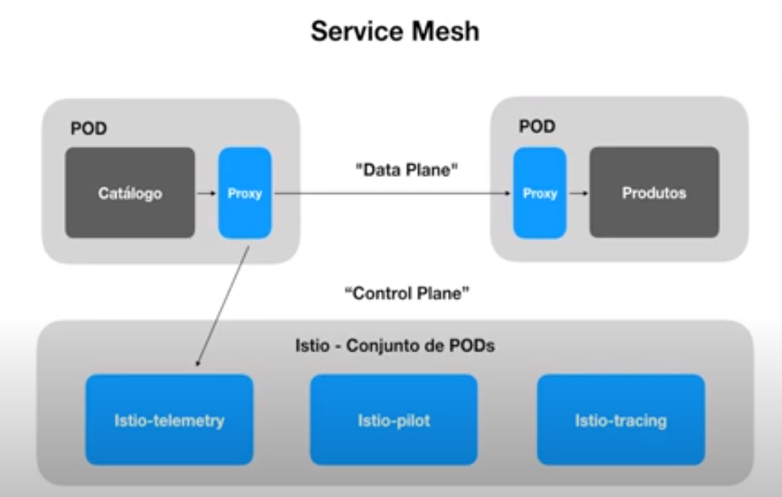

### Conceitos

**Istio** é um service mesh, que nada mais que é uma camada adicionada junto as aplicações deployadas no kubernetes que permite gerenciar a comunicação dos serviços num sistema distribuído.

> Um service mesh gerencia toda a comunicação serviço a serviço em um sistema de software distribuído (potencialmente baseado em microservices). Isso é feito normalmente por meio do uso de proxies "laterais (sidecar)" que são implantados ao lado de cada serviço através do qual todo o tráfego é roteado de forma transparente;

Com o Istio podemos resolver os problemas:

- Externalização da configuração de comunicação dos serviços, incluindo locais de rede de serviços externos, credenciais de segurança e metas de qualidade de serviço;
- Fornecer monitoramento passivo e ativo de outros serviços;
- Descentralizar a aplicação da política em um sistema distribuído;
- Fornecer padrões de observabilidade e padronizar a coleta de dados associados.
- Ativando o registro de solicitações (logs)
- Configurando o rastreamento distribuído;
- Coletando métricas

Existem outros services mesh, Linkerd, Istio, Consul, Kuma e Maesh.




---

### Instalação

link: [instale o istio](https://istio.io/latest/docs/setup/getting-started/)

---

### Comandos

```shell
# Instalar istio no kunbernetes - veja outros profiles: https://istio.io/latest/docs/setup/additional-setup/config-profiles/
istioctl install --set profile=demo -y 


# comandos uteis
# lista os namespaces
kubectl get namespaces

# lista os pods de um namespace
kubectl get pods -n istio-system
kgp -n istio-system

# lista os services de um namespace
kubectl get svc -n istio-system
kgs -n istio-system


# instalar addons 
kubectl apply -f <istio-istall-folder>/samples/addons
kubectl apply -f ~/Documents/programs/istio-1.14.3/samples/addons

# Acessar dash kiali 
istioctl dashboard kiali

# abre serviços
misinikube service <nome do serviço>

# configurar uma porta local pra usar no localhost
kubectl port-forward svc/<nome-serviço> -n <namespace-serviço> <porta-local>:<porta-serviço>
```

- Para ativar os proxys do **Istio** é necessário configurar labels nos **namespace**.

> Após fazer isso automaticamente o istio vai subir no pod um container de proxy.

```shell
# use para listar as lables de um namespace
kubectl get ns <namespace>  --show-labels=true
kubectl get ns ucontas-app   --show-labels=true

# Use para ativar o istion no namespace
kubectl label namespace <nome-namespace> istio-injection=enabled
kubectl label namespace ucontas-app istio-injection=enabled

# E reciso reiniciar os pod para que seja adicionados os sidecar
kubectl delete pods --all -n <namespace>
kubectl delete pods --all -n ucontas-app
```

---

Link: https://www.infoq.com/br/articles/service-mesh-ultimate-guide/
