---

title: "Advanced Architecting on AWS"


---

link: https://bookshelf.vitalsource.com/reader/books/300-ADVARC-30-EN-SG-E/pageid/806
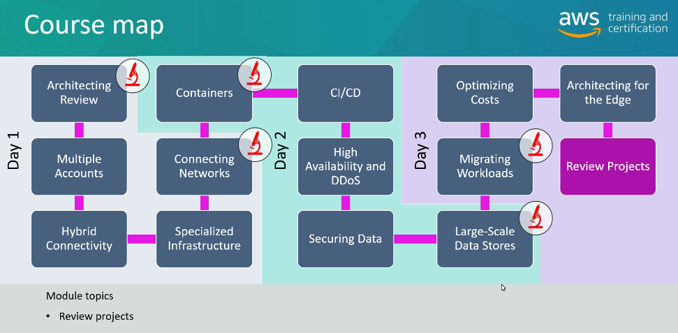
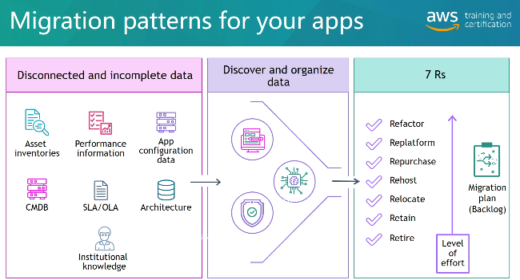
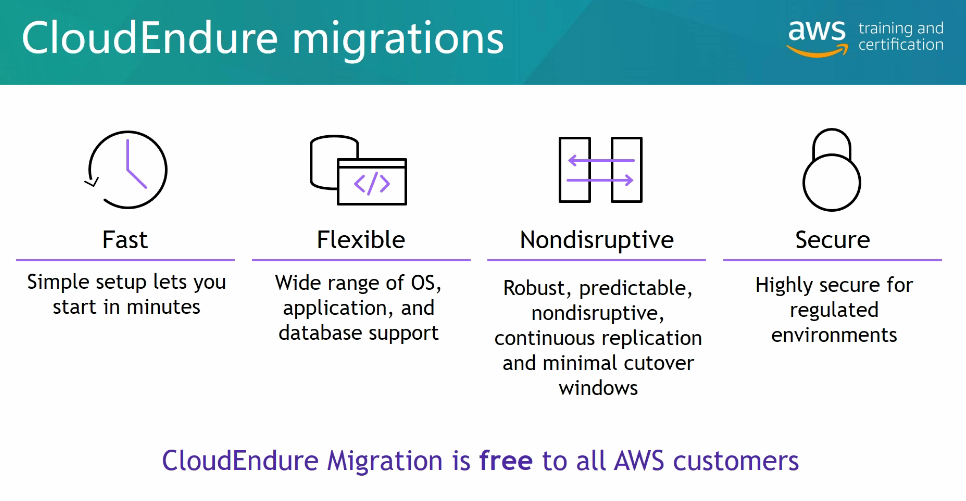
AWS SCT
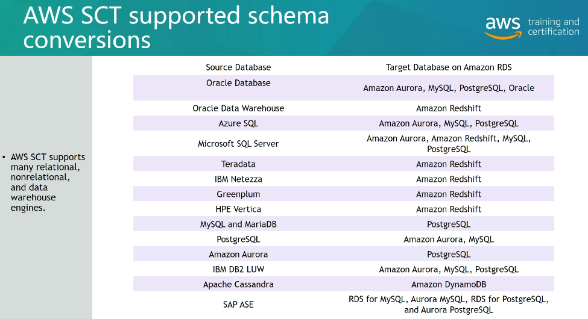

---


## 1 - Architecting Review

ec2 - nitro, usado quando se quer não virtualizar certo componentes, tipo a placa de rede, o que pode melhorar o trafico de rede

---


## 2 - Multiple Accounts

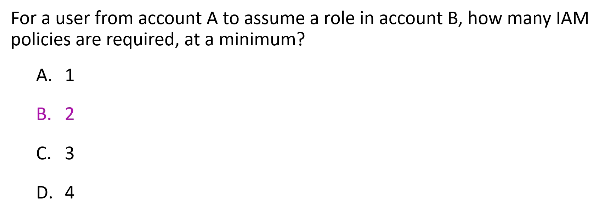
- Uma que da o acesso e outra (trust police) que diz quem pode acessar essa role.
- **Multiplas contas**
  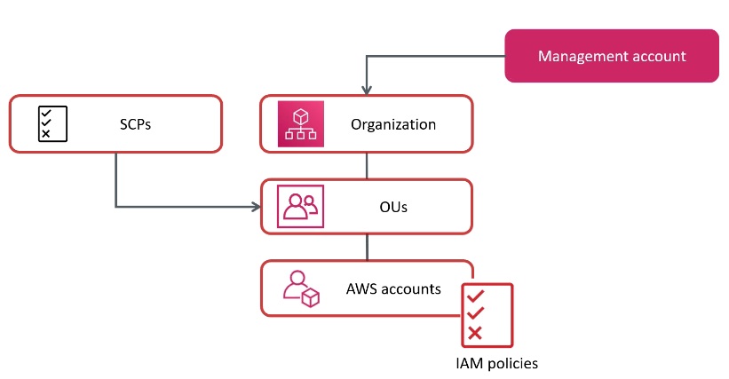
  - Recomenda ter conta expecifica para auditoria, segurançã que serve apenas para armazenar e gerenciar as demais contas.
  - AWS Sevice catalog, permite criar contas pré configuradas, apravés de templates de cloud formation.
  - Usa se SCP, para aplicar regras comuns as contas de uma organização.
    - Pode ser aplicada a **OU**, **a conta aws** ou **a conta root**
    - Caso a politica seja aplicado a nivel de root, e ela não sera aplicado a conta de gerenciamento, a conta onde fica o cartão de credito, conta de cobrança.
- SSO 
  - Forma de acessar ambiente multi account, de forma simples e unificada.
  - Ponto e entrada unico.
  - Pode-se usar um provider identity externo, para realizar a autenticação
- Control Tower
  - Não tem custo, o custo é apenas dos recursos usados.
  - Usar para criar contas do Zero, com boas praticas.
  - Landing zone gerenciada.
  - Usa o oraganizations e o  cloudFormation e o Service catalog para criar novas contas.
  - Usa GardRails que podem ser:
    - Mandatorias, opcionais e fortimentes recomendados.
    - 

---


## 3 - Hybrid connectivityAccounts

- VPN 
  - site-to- site vpn - liga-se direto no datacenter onprimese
    - Pra configurar é disponibilido dois tunel de vpn, cada um com 1.25 mbs.
    - virtual private gataway - ponta do tunel vpn do lado da aws
    - Customer gateway - ponta do lado do cliente, pode ser dois equipamento ou software
  - client VPN - varios usuario usando vpn de forma independencia.
- Route 53
  - Route 53 resolver, faz o encaminhamento do roteamente entre a nuvem e o onprimeses
- Direct Conect
  - Disponivel em 10gbs e 100gbs
  - Direct Conect gateway ?
  - VIF (virtual interface publica ou private) o que é?
  - Transit VIF (virtual interface) o que é?
- Transit Gatway
  - Permite acesso a varias VPC de forma unificada e sem necessario configurar tabelas de rotas.
  - Ver ECMP
- Global aceleration - Pemite conectar onprimese de forma mais rapida, usando a rede da AWS.
- Tolerança a falha vs alta disponibilidade
  - Tolerança a falha, solução para recuperar sua aplicação de falhas e que com o tempo se recuperar sozinho. (cai e recupera rapido)
  - Alta disponibilidade, solução que faz com que sua aplicação fiquem sempre ativa, e caso hava problema se reduz a latencia, o acesso fica fraço, mas não cai. (não cai, mas fica bem lento)
Overlap de IPs só é permitidi com private link junto com o transit gateway.

---


## 4 - Specialized InfrastructureAccounts

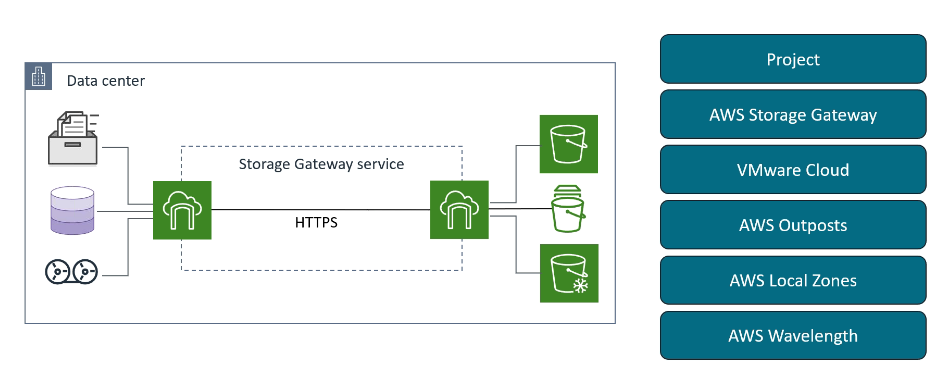
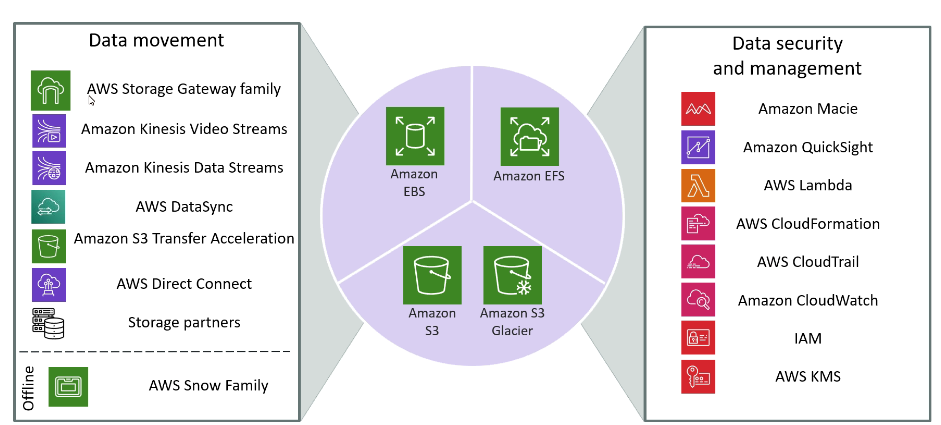
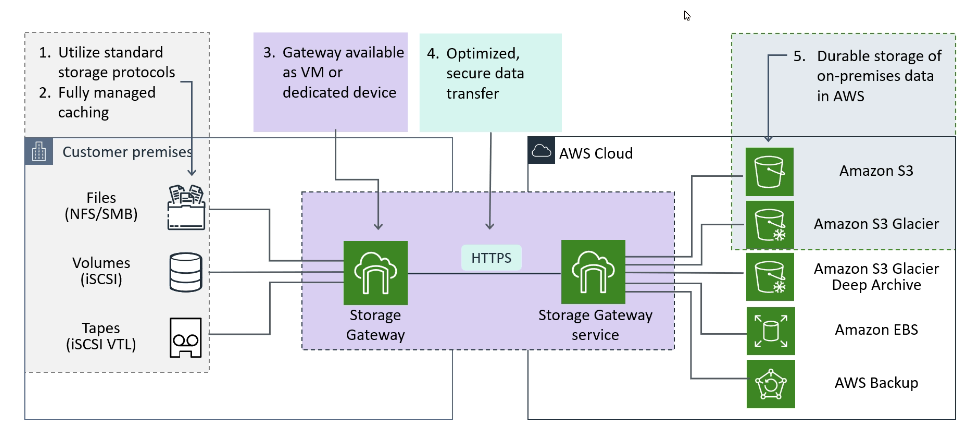

### VMware on AWS solutions

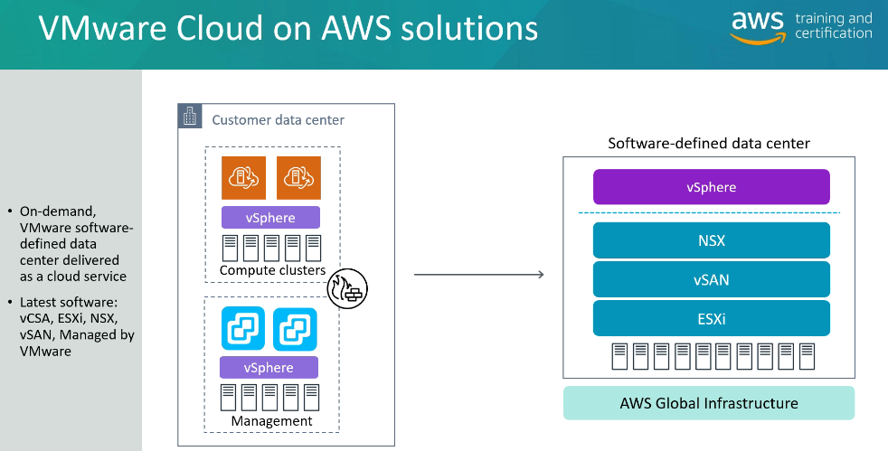
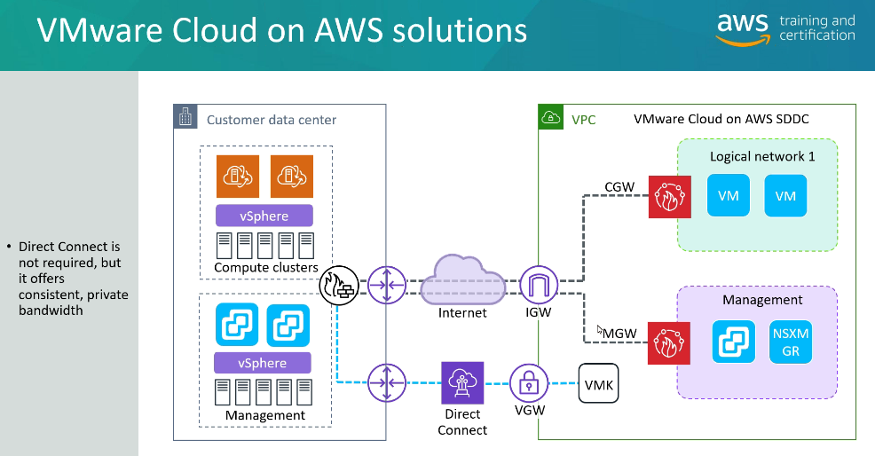
- Gerado a partir de parceira com a VMware, onde se migra o parque vmware para nuvem aws.
- permite a integração entre onprimese e nuvem, se gerencia os itens via console da vmware
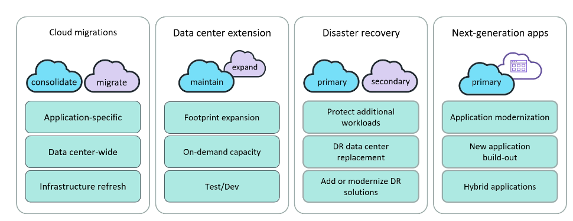
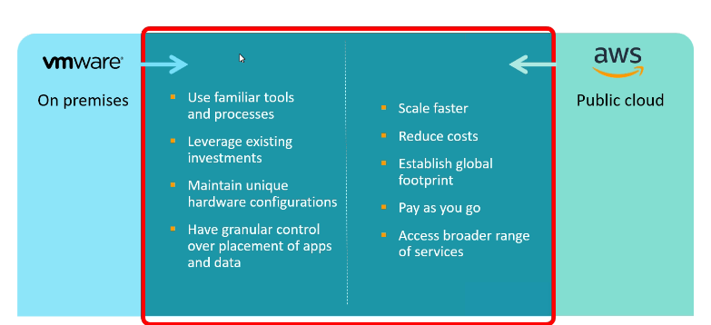

### Outposts

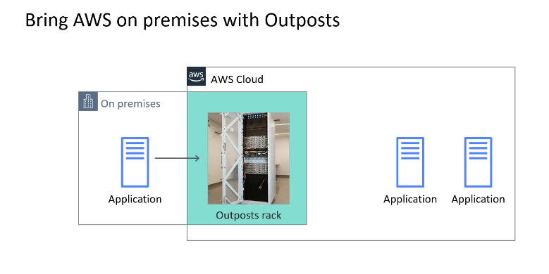
- Disponibiliza um rack que pode ser colocado dentro do datacenter do cliente.
- Funciona como uma AZ adicional da aws, não funciona se estiver disconectado da internet
- Bom pois tera baixa latencia. ou por causa de complice do cliente
- Serviços:
  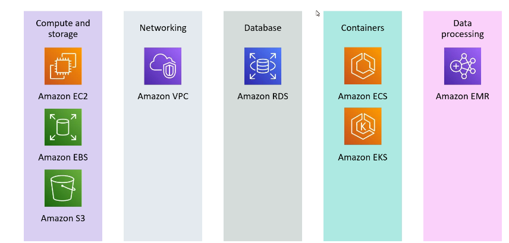
- Opções de configuração
  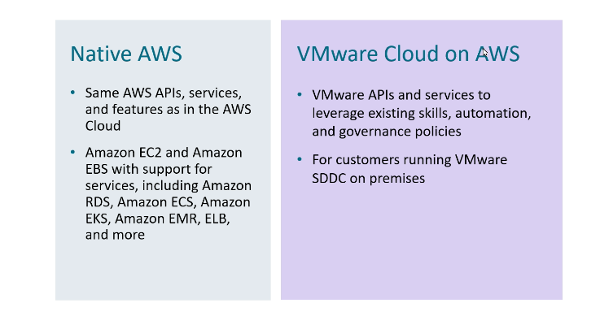
- Comunicação
  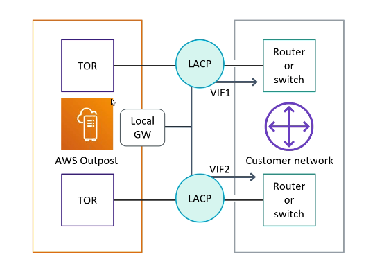

### Local Zones

- Permite rodar serviçes AWS mas não há uma AZ proximo da localidade.
- Local zone é um datacenter de um parcero da AWS que tem a infrastrutura da aws.
- Considera como alguns racks de outpost dentro de um datacenter de um parceiro, que você pode usar.

### AWS Wavelength

- Usado pra se ter baixima latencia, usado para carros autonomos, cirugias a distancias.
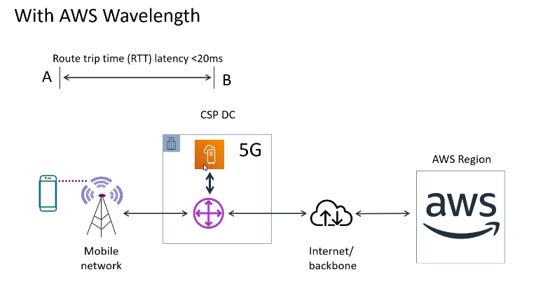

---


## 5 - Connecting NetworksAccounts

### VPC peering
  - permite ligar duas VPC
  - Limite de 125 por VPC.
  - Numero de recomendao de peering por vpc seria 10 na conta.
  - O peering não usa gateway.
  - Ver a diferencia de entre vgw e igw.
- Customer gateway
### Transit Gateway
  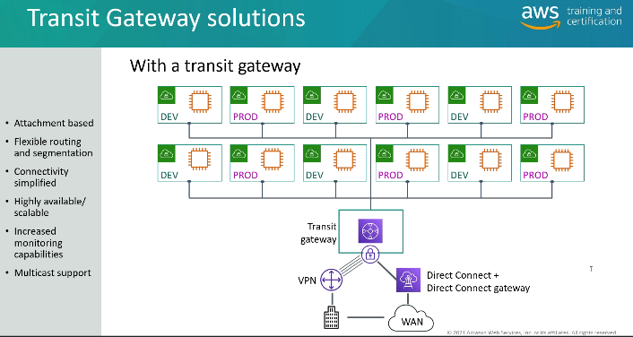
  - Permite ligar varias vpn em apenas um ponto.
  - Tem scope regional, ou seja deve haver um por região
  - É possivel fazer peering de transit gateway.
  - Ver depois transit VPC?
    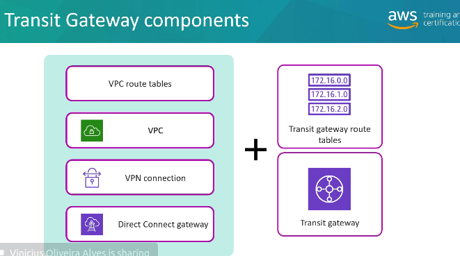
    - Trasit gateway network manager - permite ver as conexões do transit gateway.
    - vpc reachability analyze - ferramenta para analizar problemas na ligação de VPC.
    - route analyze - permite ver conexão dos componentes do ponto de vista do router (https://docs.aws.amazon.com/vpc/latest/tgw/route-analyzer.html).
- AWS RAM
  - Permite compartilhar recurso entre contas
- PrivateLink
  - ver VPC endpoints (interface endpoint - aponta para uma ENI (placa de rede), gateway endpoint - usar um recurso, tipo um S3).
    - Usado apenas para recurso internos
    - Tem scope regional
    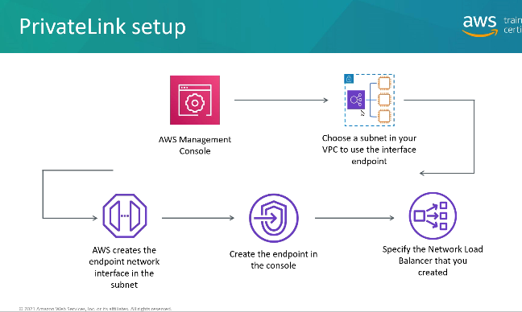
cd ~
 ping 10.1.1.158
 ping  10.2.2.205
 ping 10.3.3.78
 ping 10.4.4.125
ping 10.0.8.13
tgw-0e2ee82c8f1d39125 
tgw-07b424246b676ba8b

---


## 6 - ContainersAccounts


### Container hosting AWS

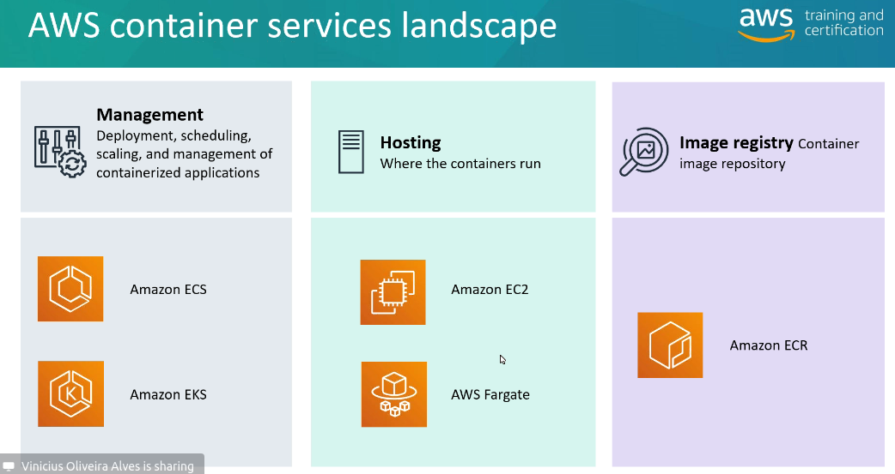
- Fargate - aws gerencia instraestrura das maquinas ec2
  - Não se tem acesso as instancias.
  - Pago pela menoria e poder de processamento.
- EC2 - vc tem que gerencia tudo
  - Cobrado pela hora usada da instancia.
  - Da mais controle, da acesso as instancias
Container lambdas -> https://aws.amazon.com/pt/blogs/aws/new-for-aws-lambda-container-image-support/

### ECR

- - ecr public galery

### EKR

- EKS Distro
  - permite rodar EKS no onprimeses, com mais controle
  - 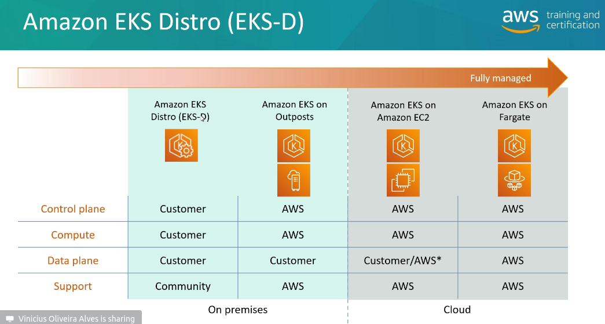

### ECS

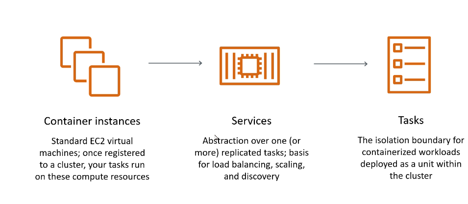
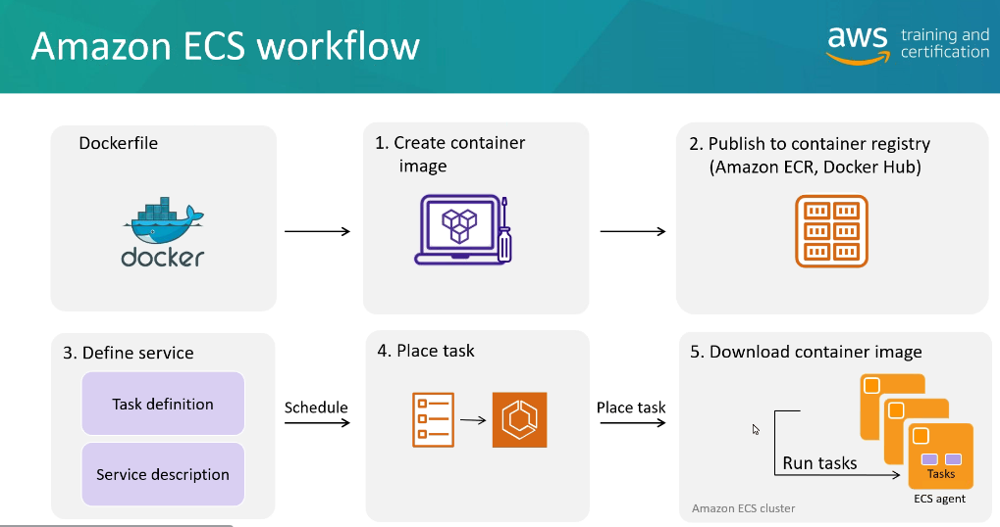
Workshops
- https://ecsworkshop.com/
- https://www.eksworkshop.com
```shell
# Show merged kubeconfig settings
kubectl config view
# List all services in the namespace
kubectl get services
# List all pods in all namespaces
kubectl get pods --all-namespaces
# List all pods in the current namespace, with more details
kubectl get pods -o wide
# List a particular deployment
kubectl get deployment my-dep
# List all pods in the namespace
kubectl get pods
# Get a pod's YAML
kubectl get pod my-pod -o yaml
# Describe commands with verbose output
kubectl describe nodes my-node
kubectl describe pods my-pod
COMANDOS EKSCTL
# List the details about a cluster
    eksctl get cluster [--name=<name>][--region=<region>]
# Create the same kind of basic cluster, but with a different name
    eksctl create cluster --name=cluster-1 --nodes=4
# Delete a cluster
    eksctl delete cluster --name=<name> [--region=<region>]
# Create an additional nodegroup
   eksctl create nodegroup --cluster=<clusterName> [--name=<nodegroupName>]
```

---


## 7 - CI/CD Accounts

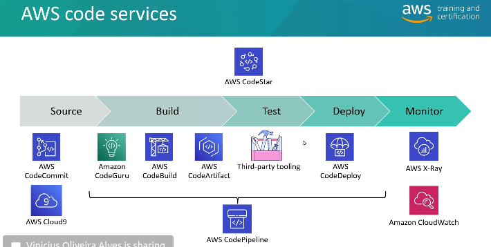

---


## 8 - High Availability and DDosAccounts


### AWS WAF

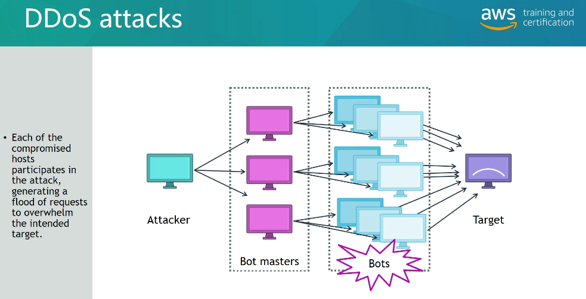
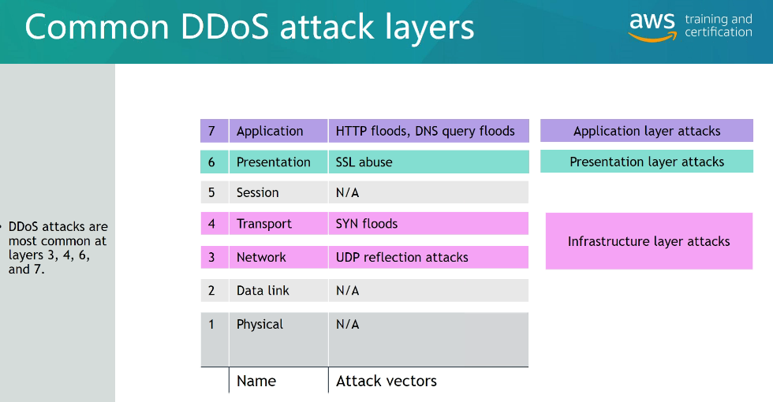
- Ferramenta de proteção de DDos.
- Permite adicionar regras de firewall.
- Proteção contra sql inject.
AWS SHIELD Advanced
- custo do advanced 3000 mill dolares por mês
  - Usando o advancente o WAF e o Firewal não tem custo.
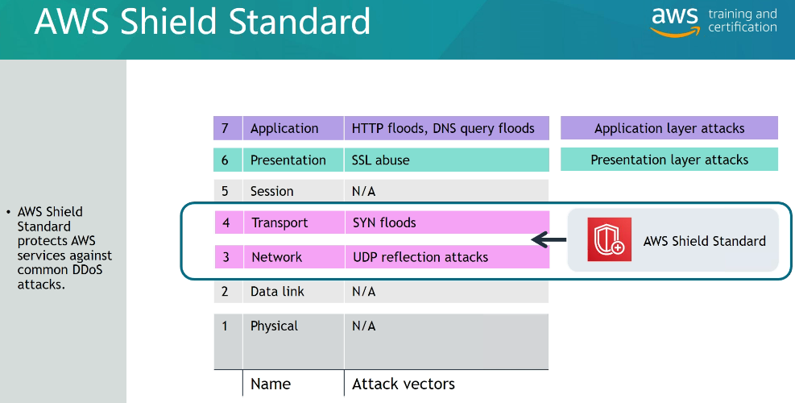
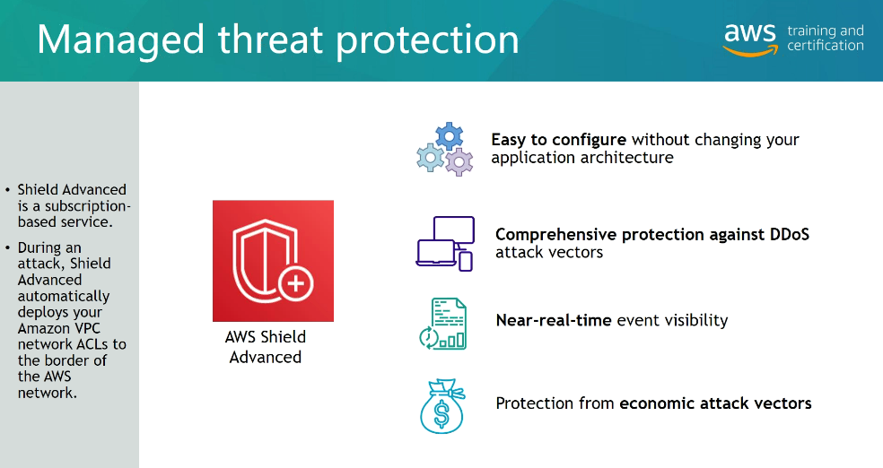
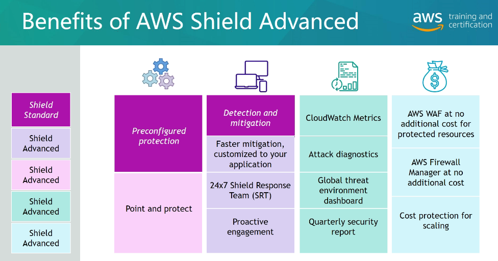
AWS Firewal manager
- Concentrador de regras WAF e Security groups para varia contas (multi account)
- Necessario ter estrutura do organization
  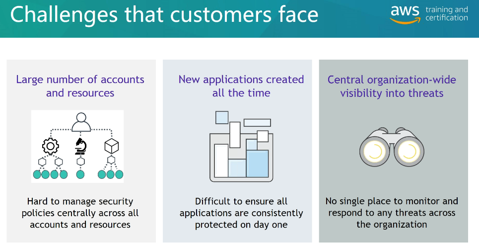

### Network firewall

- Serviço gerenciado de firewall de rede para o nivel de VPC

## 


## 9 - Securing DataAccounts

- AWS KMS
  - envelopamento (data key e master key)
  - usa se a data key pra criptografar dados tipo arquivos no S#
  - Usa se a master key para criptografar a data key 
  - Ver criptografia S3
    - SSE-S3 - Usa chave do S3 gerenciada pela aws.
    - 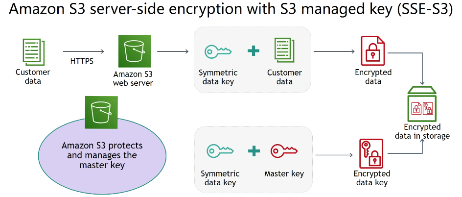
    - SSE-KMS - Usa chave do S3 gerenciado pelo usuário (chave criado pelo usuario)
    - 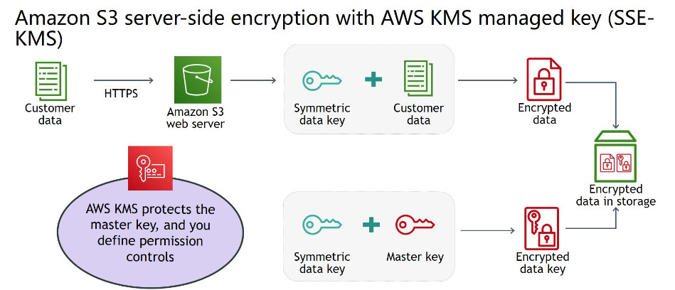
    - SSE-C - Usa uma chava criado pelo usuario e subida pelo usuario na aws. (aquela chave gerada fora da aws)
      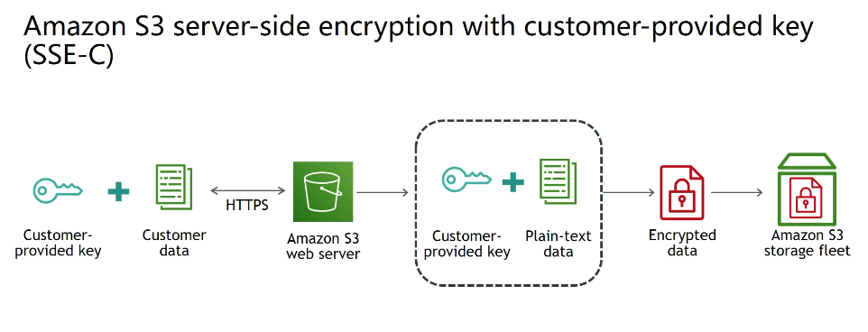
- AWS CLOUDHSM
  - Hardware disponibilizavel para gerar chaves de criptografia.
  - Trabalha com FIPS 140-2 level 3.
  - Usa o KMS para armazenar chaves se usado com o CloudHSM, o que ajuda muito em algumas soluções.
  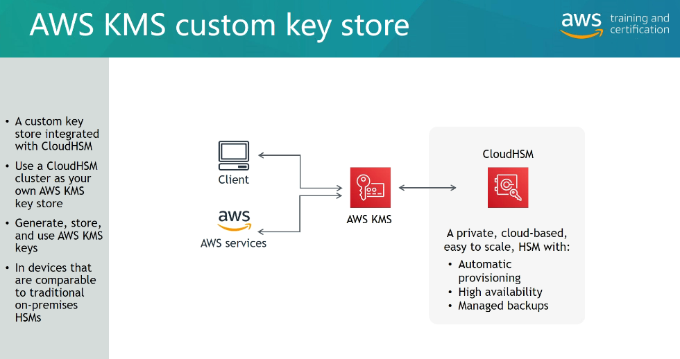
- AWS Secrets manager
  - Serve para guarda segredos, usados para guarda acesso de banco de dados.
  - Semelhante ao Parameter store.
    - O Parameter store tem scope regional, não tem vario custo.
    - O Secrets manager tem scopo multi account e tem custo.
    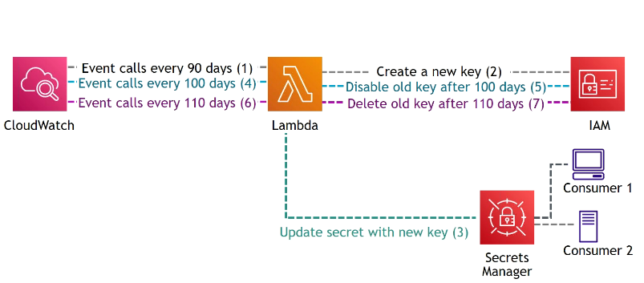
  - [Documentação](https://docs.aws.amazon.com/secretsmanager/latest/userguide/getting-started.html)

---


## 10 - Large-Scale Data StoresAccounts


### S3 Data management

- S3 tem 
  - 4 noves de disponibilidade -> que por ano pode gerar uma indisponibiliade de 52.6 minutos (isso é seria no maximo).
  - 11 noves de durabilidade.
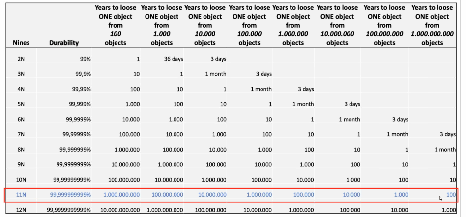

### Data lakes

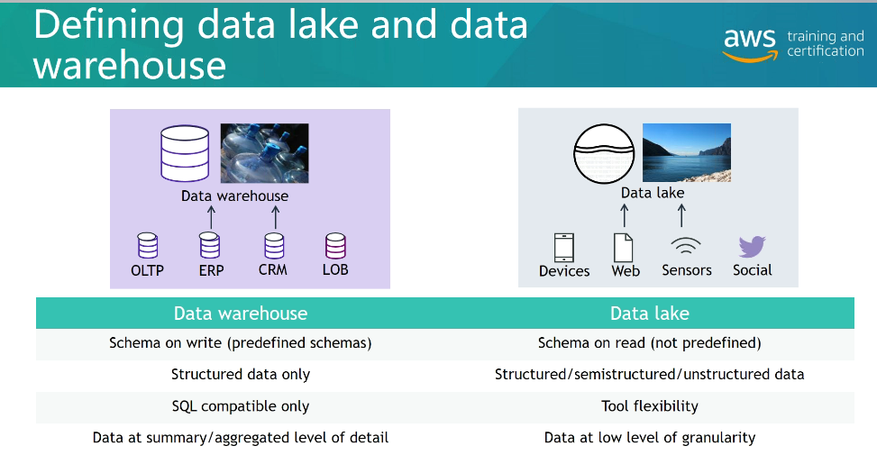

### AWS Lake FOrmation

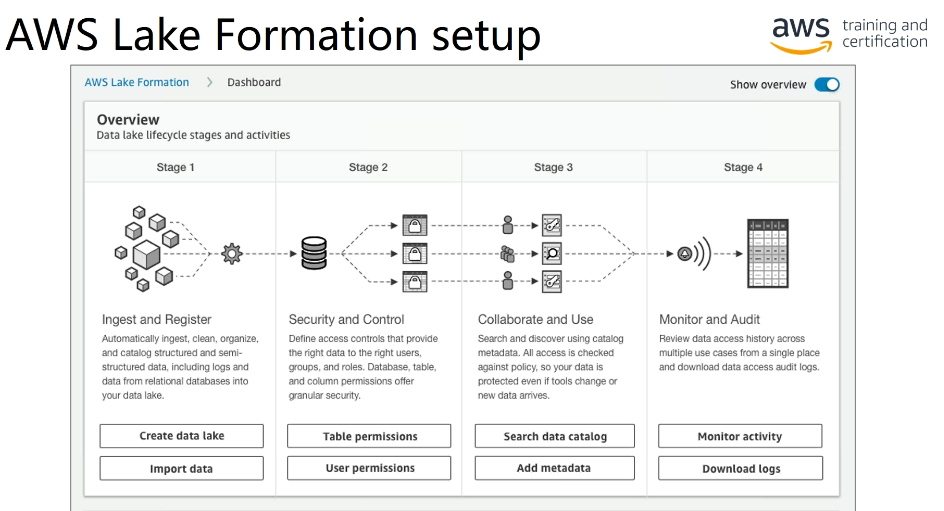
AWS Cloud9

---


## 11 - Migrating WorkloadsAccounts

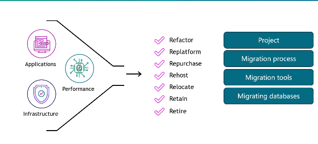
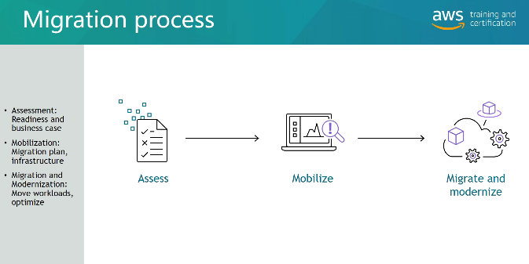

---


## 12 - Optimizing CostsAccounts

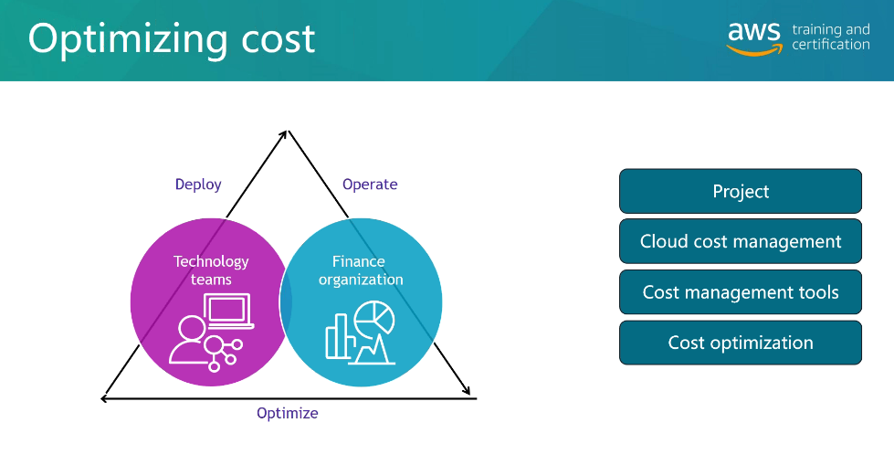
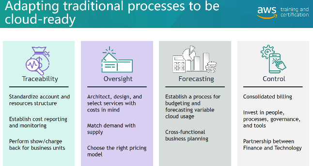
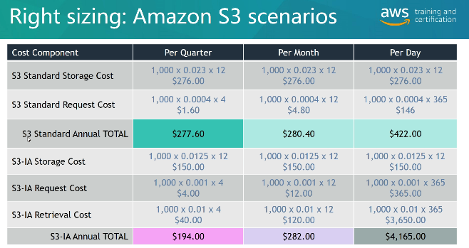

---


## 13 - Architecting for the EDGEAccounts

