---

## Prova de certificação

- Domínios

| Domínio                                                              | percentual |
| -------------------------------------------------------------------- | ---------- |
| Domínio 1: Soluções de design de complexidade organizacional         | 26%        |
| Domínio 2: Design de novas soluções                                  | 29%        |
| Domínio 3: Melhoria contínua de soluções existentes                  | 25%        |
| Domínio 4: Acelerar a migração e a modernização da carga de trabalho | 20%        |

- Tecnologias aws que podem vão cair na prova
  - Computação
  - Gerenciamento de custos
  - Banco de dados
  - Recuperação de desastres
  - Alta disponibilidade
  - Gerenciamento e governança
  - Microsserviços e desacoplamento de componentes
  - Migração e transferência de dados
  - Redes, conectividade e entrega de conteúdo
  - Segurança
  - Princípios de design sem servidor
  - Armazenamento

- Serviços abordados

<details>
  <summary> title="veja a lista completa" </summary>
- Análise:
  - Amazon Athena
  - AWS Data Exchange
  - AWS Data Pipeline
  - Amazon EMR
  - AWS Glue
  - Amazon Kinesis Data Analytics
  - Amazon Kinesis Data Firehose
  - Amazon Kinesis Data Streams
  - AWS Lake Formation
  - Amazon Managed Streaming for Apache Kafka (Amazon MSK)
  - Amazon OpenSearch Service
  - Amazon QuickSight
- Integração de aplicativos:
  - Amazon AppFlow
  - AWS AppSync
  - Amazon EventBridge (Amazon CloudWatch Events)
  - Amazon MQ
  - Amazon Simple Notification Service (Amazon SNS)
  - Amazon Simple Queue Service (Amazon SQS)
  - AWS Step Functions
- Aplicativos empresariais:
  - Alexa for Business
  - Amazon Simple Email Service (Amazon SES)
- Blockchain:
  - Amazon Managed Blockchain
- Cloud Financial Management:
  - AWS Budgets
  - AWS Cost and Usage Report
  - AWS Cost Explorer
  - Savings Plans
- Computação:
  - AWS App Runner
  - AWS Auto Scaling
  - AWS Batch
  - Amazon EC2
  - Amazon EC2 Auto Scaling
  - AWS Elastic Beanstalk
  - Amazon Elastic Kubernetes Service (Amazon EKS)
  - Elastic Load Balancing
  - AWS Fargate
  - AWS Lambda
  - Amazon Lightsail
  - AWS Outposts
  - AWS Wavelength
- Contêineres:
  - Amazon Elastic Container Registry (Amazon ECR)
  - Amazon Elastic Container Service (Amazon ECS)
  - Amazon ECS Anywhere
  - Amazon Elastic Kubernetes Service (Amazon EKS)
  - Amazon EKS Anywhere
  - Amazon EKS Distro
- Banco de dados:
  - Amazon Aurora
  - Amazon Aurora sem servidor
  - Amazon DocumentDB (compatível com o MongoDB)
  - Amazon DynamoDB
  - Amazon ElastiCache
  - Amazon Keyspaces (for Apache Cassandra)
  - Amazon Neptune
  - Amazon RDS
  - Amazon Redshift
  - Amazon Timestream
- Ferramentas do desenvolvedor:
  - AWS Cloud9
  - AWS CodeArtifact
  - AWS CodeBuild
  - AWS CodeCommit
  - AWS CodeDeploy
  - Amazon CodeGuru
  - AWS CodePipeline
  - AWS CodeStar
  - AWS X-Ray
- Computação de usuário final:
  - Amazon AppStream 2.0
  - Amazon WorkSpaces
- Web e dispositivos móveis de front-end:
  - AWS Amplify
  - Amazon API Gateway
  - AWS Device Farm
  - Amazon Pinpoint
- Internet das Coisas:
  - AWS IoT Analytics
  - AWS IoT Core
  - AWS IoT Device Defender
  - AWS IoT Device Management
  - AWS IoT Events
  - AWS IoT Greengrass
  - AWS IoT SiteWise
  - AWS IoT Things Graph
  - AWS IoT 1-Click
- Machine learning:
  - Amazon Comprehend
  - Amazon Forecast
  - Amazon Fraud Detector
  - Amazon Kendra
  - Amazon Lex
  - Amazon Personalize
  - Amazon Polly
  - Amazon Rekognition
  - Amazon SageMaker
  - Amazon Textract
  - Amazon Transcribe
  - Amazon Translate
- Gerenciamento e governança:
  - AWS CloudFormation
  - AWS CloudTrail
  - Amazon CloudWatch
  - Amazon CloudWatch Logs
  - AWS Command Line Interface (AWS CLI)
  - AWS Compute Optimizer
  - AWS Config
  - AWS Control Tower
  - AWS License Manager
  - Amazon Managed Grafana
  - Amazon Managed Service for Prometheus
  - Console de Gerenciamento da AWS
  - AWS Organizations
  - AWS Personal Health Dashboard
  - AWS Proton
  - AWS Service Catalog
  - Service Quotas
  - AWS Systems Manager
  - AWS Trusted Advisor
  - AWS Well-Architected Tool
- Serviços de mídia:
  - Amazon Elastic Transcoder
  - Amazon Kinesis Video Streams
- Migração e transferência:
  - AWS Application Discovery Service
  - AWS Application Migration Service (CloudEndure Migration)
  - AWS Database Migration Service (AWS DMS)
  - AWS DataSync
  - AWS Migration Hub
  - AWS Schema Conversion Tool (AWS SCT)
  - AWS Snow Family
  - AWS Transfer Family
- Redes e entrega de conteúdo:
  - Amazon CloudFront
  - AWS Direct Connect
  - Elastic Load Balancing (ELB)
  - AWS Global Accelerator
  - AWS PrivateLink
  - Amazon Route 53
  - Transit gateway da AWS
  - Amazon VPC
  - AWS VPN
- Segurança, identidade e compatibilidade:
  - AWS Artifact
  - AWS Audit Manager
  - AWS Certificate Manager (ACM)
  - AWS CloudHSM
  - Amazon Cognito
  - Amazon Detective
  - AWS Directory Service
  - AWS Firewall Manager
  - Amazon GuardDuty
  - AWS Identity and Access Management (IAM)
  - Amazon Inspector
  - AWS Key Management Service (AWS KMS)
  - Amazon Macie
  - AWS Network Firewall
  - AWS Resource Access Manager (AWS RAM)
  - AWS Secrets Manager
  - AWS Security Hub
  - AWS Security Token Service (AWS STS)
  - AWS Shield
  - AWS Single Sign-On
  - AWS WAF
- Armazenamento:
  - AWS Backup
  - Amazon Elastic Block Store (Amazon EBS)
  - AWS Elastic Disaster Recovery (CloudEndure Disaster Recovery)
  - Amazon Elastic File System (Amazon EFS)
  - Amazon FSx (para todos os tipos)
  - Amazon S3
  - Amazon S3 Glacier
  - AWS Storage Gateway

</details>

---

## Segurança

### AWS CloudTrail


- provém governança, **compliance** e **auditoria**, é o dedo duro da galera que fez merda.
- Habilitado por default, tem custo zero.
- Recebe informações do **SDK / console / cli / IAM User e IAM roles.**
- Permite ver tudo que foi feito na conta (inclusão, criação ou exclusão de recurso).
- Monitora todas as chamadas de **API** da conta.
- Guarda os logs por 90 dias no **cloud trail**, caso queira guardar mais tempo e possível configurar
  no S3 (não vem habilitado por default).
- Vem aplicado em todas as regiões por padrão.
- Pode ser habilitados em todas ou em apenas uma conta.
- Tipo de eventos analisados:
  - **Eventos gerenciados.**
    - **Operações feitas** em recursos:
      - Criar rules, criar S3 / EC2, alteração de recurso.
      - Separa os eventos de leitura e escrita.
      - **Analise manual do problemas**
  - **Eventos de dados**
    - Não são logados por padrão, e necessário habilitado e é **pago.**
    - Está em **nível do objeto,** para os serviços de Lambda (invocação), S3 (criação, remoção e recuperação) e DymamoDB.
    - Separados por eventos de leitura e escrita.
    - **Analise manual do problemas.**
  - **Cloud trail insights**
    - Usado para avaliar ações e **detectar anomalias na conta.**
    - **Analise automática** dos problemas (anomalias). via **inteligência artificial**.
      - Tipo recurso em excesso.
      - Limites de recursos (**soft** and **hard**).
      - Permite conectar ao **eventBridge** para notificação das anomalias.
    - 
- Solution Architecture
  - Desenho de possibilidades de integração ente Cloudtrail e S3.
    
  - Desenho com várias contas e logs de variar regiões
    
  - Desenho de alertas via chamadas de APIS
    - Permite enviar alerta, para quando um instância for desligada, o removida.
      
  - Desenho de uso em uma organização
    
- Como reagir a eventos os mais rápido possível.
  - Os eventos no CloudTrail podem levar até 15 minutos para ser disparados, nesse cenário uma maneira de reagir aos eventos o mais rápido seria:
    - EventBridge
      - Pode triggar eventos a partir de qualquer chamada de API no CloudTrail.
      - Métodos mais rápido de reação.
    - CloudWatch Logs
      - Envia-se em stream para o CloudWatch e se cria filtros para analisar e detectar anomalias.
    - Envio para o S3
      - O CloudTrail envia para o S3 em 5 minutos.
      - Pode ser analisar os logs e disparar ações, além de armazenar os logs.

---

### AWS KMS

- Serviço de encriptação da AWS - Key Management Service.
- Não é possível baixar as chaves.
- Gerencia chaves de criptografia.
- Serviços com **a opção de se encriptar** dados:
  - EBS, S3, RedShift, RDS, EFS ....
- Serviços com **criptografia default:**
  - CloaudTrail Logs, S3 Glacier, Storage Gateway ....
- Permite importar uma chave externa.
  - Mas a AWS não fica responsável pelo gerenciamento dela.
  - Ou seja, a manutenção é por conta do usuário.
  - Só são suportadas chaves Symetricas.

#### Cloud HSM - Hardware Security Module

- AWS provém um hardware dedicado para que nós possamos gerenciar nossas chaves.
  - Ela não tem acesso ao hardware após provisionar, caso perder os acesso não tem como recuperar.
- O hardware é resistente a alteração e é homologado (FIPS 140-2 Level 3 Compliance)
- Suporta criptografia simetrica e assimetrica.
- **RedShift** suporta encriptação via HSM.
- Pode se ter varios Cloud HSM espalhado por várias AZs para aumentar a disponibilidade.

#### Tipos de chaves


- **CMK** - Customer Master Keys.
- **Gerenciadas pelo usuario - CMK**
  - Criado pelo usuário dentro do **KMS** ou **HSM** (**hardware security module** ), pode ser deletada ou alterada.
  - Pode se habilitar a rotação de chave a cada 1 ano.
  - Também e possível rotacional manualmente, mas é recomendado para chaves **Assimétricas**.
  - Tem um custo de $1 por mês, e $0.003 a cada (1000 calls).
  - Pode ser dos tipos
    - **Simétricas** (AES-256)
      - Todos serviços da AWS usam essa. Não se tem acesso a chave.
      - Precisa usar a API para usar a encriptação o decriptação.
    - **Assimétricas** (RSA & ECC Key Pairs)
      - Tem duas chaves uma publica (encrypt) e outra Privada (decrypt).
      - A publica pode ser baixada, nas não se tem acesso a privada.
      - Caso de usos. 
        - Encriptar dados fora da AWS, onde não se pode chamar a API do KMS.
        - Realizar assinatura de objetos.
- **Gerenciadas pela AWS - CMK**
  - Chaves criadas e gerenciada pela AWS, não temos acesso.
  - Tem rotação automatica de chaves a cada ano.
  - Não tem custo
  - São as usadas nos serviços.
    - EBS, S3, RedShift, RDS, EFS.
  - tem os nomes aws/rds, aws/ebs, aws/service-name.
- **Chaves proprias da AWS**
  - Criada pela AWS, para recurso da AWS, Não temos acesso nem de visualização.
  - SSE-S3, SSE-SQS, SSE-DDB.
  - São de graça.
- **Chaves do HSM**
  - Chaves criada usando o HSM (**hardware security module** ).
  - Replicado em mais de uma AZ.
    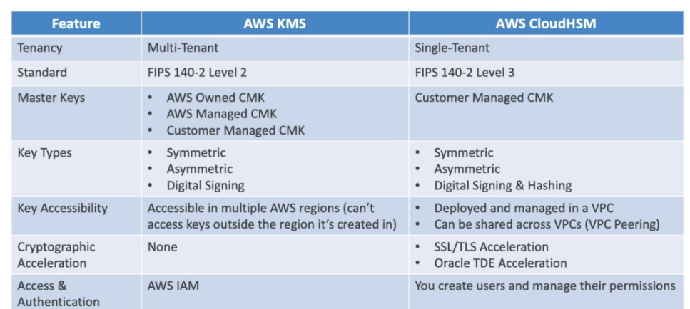
    
- KMS em multiplas regiões
  - Permite criptografar em uma região e descriptografar em outra.
  - O KMS não é **Global** e apenas **Multi-Region com replicação**. Cada KMS de cada região é gerenciado separadamente há apenas a replicação das chaves.
  - Usado para:
    - Disaster Recovery, Global data Management (DynamoDB Global Tabl)
      ​ 

---

### AWS SSM Parameter Store


- Permite armazena configurações e segredos como parâmetros.
- Tem criptografia opcional usando o **KMS**.
- É Serverless, e fácil de usar com SDKs.
- Permite disparar eventos via **Cloud watch Events.**
- São declarados em forma de caminhos (**Paths**).
  
- Da pra acessar o secret manager via parameter store.
  - Acessando assim: **/aws/reference/secretsmanager/secret_id_in_secrets_manager**
- Tem integração com o **CloudFormation**.
- até 10000 parâmetros com valor de até 4KB é de graça por conta e região.
- até 100000 parâmetros com valor de até 8KB é cobrado $0.05 por parâmetro.
  
- É possível definir TTL para parâmetros (**advanced tier**), para força a atualização ou deleta. um caso de uso muito bom seria armazenar o token de acesso no **parameter store** e definir um TTL de 25 minutos, quando ele expirar dispara uma notificação via **CloudWatch Events** que gera um novo token e atualiza ao parâmetro.
  

---

### AWS Secrets Manager


- Usados para guardar segredos (principalmente de banco de dados).
- Permite realizar a rotatividade dos segredos automaticamente.
  - Rotaciona automáticamente usando uma função Lambda.
- Pode ser usado para guarda senhas em produção.
- É muito usado junto com banco de dados.
  - Suportado nativamente pelos bancos na AWS. (DyanamoDB, RDS etc).
- Os segredos ficam criptografados.
- Controla o acesso usando política baseada em recurso (Resource-based police).
- Suportado nativamente por diversos serviços AWS.
- Compartilhando secrets manager entre contas. (via )
  
- Diferenças entre secret manager e parameter store.
  - Secrets manager
    - É mais caro.
    - Rotaciona automaticamente as credenciais.
      - Ou seja, quando se cria um segredo para bancos ela gerar uma Lambda de alteração de seja automático para alterar a senhas nos banco de dados.
    - Uso de criptografia obrigatório.
  - Parameter store
    - É uma API simples.
    - Não tem mecanismo automático de rotação, apesar de ser possível criar usando o event brigde e lambda.
    - O uso de criptografia é opcional.
    - Permite recuperar os segredos (secret manager) via API do SSM (Parameter store).
- Rotação de senha entre Secrets manager e SSM.
  - No Secrets é automatico
  - No SSM precisa criar e manter o event Bridge com a lambda.
    

---

### RDS Security

- Criptografia kms em repouso para Volumes EBS e Snapshots.
- TDE pra Oracle e Sql Server (Transparent Data Encryption).
- Criptografia em vôo pra todos os bando de dados no RDS.
- IAM autentication para Mysql e PostgreSql.
  - **Apenas a autenticação é feita usando IAM, a Autorização ainda é feita usando o RDS.**
- É possível gerar um snapshot criptografado a partir de um não criptografado.
- **CouldTrail não mostras as queries feitas no RDS.**

---

### SSL encryptation, SNI e MITM

- Secure Sockets Layer - Usado pra criptografar conexões.
- TSL - Transport Layer Security - versão mais recente do protocolo SSL.
- CA - Certificate Authorities - emitem certificados de confiança
  - Comodo, Symantec, GoDaddy, Letsencrypt ...
- Certificados SSL tem data de validade.
- Funciona assim:
  - Quando dois host vão se conectar ele realizam o aperto de mão (handshake) usando criptografia assimétrica que é muito cara em termo de processamento. A partir dai é gerados chaves simétricas que serão usadas para as próximas interações, estas que tem um custo de validação mais barato que as assimétricas.
    

---

#### SNI - Sever Name Indication

- Resolve o problema de carregamento de muitos certificados em servidores web, onde posso ter diferentes aplicações e diferentes certificados.
- **Ele requer que seja passado o hostname do servidor destinatário, para iniciar o processo de handshake.**
- Assim ele acha o certificado adequado ou retorna um default.
- Funciona apenas com **ALB e NLB** da nova geração e com o **CloudFront**.
- Não funciona com o CLB. (antiga geração)
  
  

---

#### MITM - Man in the middle


Como previnir:

- Não use publique aplicações com http, apenas com https.
- **Use DNS com o DNSSEC habilitado.**
  - Route 53 permite usar o DNSSEC para registro de dominios e para serviço de DNS usando o KMS.
    

---

### AWS Certificate Manager

- Serviço que permite provisionar, gerenciar e implantar facilmente certificados **SSL/TLS** para uso com os serviços da AWS e os recursos internos conectado.
- Permite solicitar certificados e implanta-los em **Elastic Load Balancers,** distribuições do **Amazon CloudFront** e APIs no **Amazon API Gateway. e APPSync**
- Permite criar certificados privados para recursos internos e centralizar o gerenciamento do ciclo de vida dos certificados
- Permite criar certificados que serão validados no inicio e a partir dai o tráfego fica sendo http, o que reduz o uso de CPU das instancias.
  
- Serviço **regional**, assim caso tenha serviço global precisa gerar certificados para cada região.
  - Não é possivel usar em serviços globais.
  - **Nem é possivel copiar um certificado para outra região.**
    

---

#### Soluction Architecture

- SSL on ALB
  - Forma mais comum de se fazer, o ALB usa o ACM pra validar o Certificados
  - A comunicação após o ALB e http, o que reduz o uso de CPU da maquina que não precisa ficar validando certificado.
    
- SSL nos Web Services com instâncias EC2
  - Usa se um NLB e a comunicação até a instância é feita usando https.
  - porém isso é ruim, pois consome memória.
  - E cada EC2 precisa configurar o certificado em sua maquina.
  - Ele deve ser recuperado no boot do sistema de um parameter store usando script no user data.
    
- Cloud HSM - SSL Offloading
  - Usa se um HSM para processar o SSL fora do EC2.
  - Como ele tem o SSL Acceleration o processo é mais rapido.
  - Suportado pelos Web server Nginx, Apache e IIS.
  - É bem seguro pois a chave nunca irá ser trafegada, tudo é feito dentro do HSM.
  - Para isso é necessário criar um usuário para criptografia no HSM. e amarzenar os dados desse usuário no secrets manager ou parameter store.
    

---

### DDOS e Web Security


- Como se proteger
  
- Arquitetura usada contra ddos.
  

---

### AWS Shield

- Protege contra ataques DDOS | SYN/UDP (floods an reflecion atack).
- Trabalha na camada 6 e 4 (rede e transporte).
- Versão **standard** é de graça para todos os clientes.
- Tem versão **advanced** (analisa a camada 7 aplicação).
- Fica nos prontos de presença.
- Tem a versão aws shild **advanced** 24/7 premium com DRP (DDos response team) que:
  - Tem custo adicional $ **3000** por organização.
  - Pode ser usado em Route 53 / Cloud Front | Global Acelerator | Load Balance
    

---

### AWS WAF

- web application firewall.
- Permite bloquear acesso através de uma lista de regras.
- Fica nos pontos de presença.
- **Protege as aplicações ataques (Layer 7 - aplication).**
- Pode ser usado em:
  - Load balance (regras locais).
  - API Gateway (regras para região ou de pontos de presença).
  - CloudFront (regras globais ou para pontos de presenças).
  - AppSync (para proteger API GraphQl)
- Permite criar web ACL (web acess control list) que permite:
  - Bloquear ranges de ips, headers ...
  - Protege contra Sql Injection, Cross-site Scripting (Xss).
  - Bloqueio por pais ou região (geo-match).
  - Bloqueio por quantidade de requisição.
  - **Tem um custo de $5 por mês por ACL.**
- Pode se usar as ações
  - De contagem de requisição.
  - Liberação ou bloqueio por ranges de ips, headers ...
  - **Captcha para validar do lado do cliente.**
- Logs do WAF
  - Envia os logs para o CloudWatch logs
  - **Envia até 5MB por segundo.**
  - **Pode enviar para o S3 com em intervalos de 5 minutos.**
  - **Pode enviar para kinesis data firehose - Neste caso o time se limita as quotas do kinisis**
    

---

##### AWS Managed roles

- Regras prontas para ser aplicadas.
- Existem mais de 190 ja cadastradas, mas pode se usar o marketplace para encontrar outras.
- Baseadas em grupos de controles.
  

---

##### Soluções com WAF

- Usando WAF pra acessa ALB apenas pelo Cloud Front. Usando o Secrets Manager para gerar novos valores para o header e atualiza-los via Lambda.
  

---

#### AWS Firewal manager

- Permite gerenciar regras de todas as contas AWS de forma centralizada.
- Tem regras comuns de segurança.
  
- Diferenças entre WAF e AWS Firewal manager e AWS Shield
  - WAF usado para proteção em nivel de aplicação (camada 7).
  - AWS Shield usado para proteção contras DDos ( camada 6 e 4 (rede e transporte)).
  - AWS Firewal manager usado para centralizar regras, permite aplicar o WAF e SHIELD em várias contas.

---

#### Bloqueandos IPs

- As vezes desejamos bloquear **IPs** por segurança.
- O bloqueio deve ser feito no **NACL**, pois ele permite criar regras de Negação (**DENY**).
- No caso do **Security Group** é mais complicado de fazer, pois ele parte da ideia de regras de deliberação de acesso (**ALLOW**). caso precisa-se teria que criar um grupo de IPs que podem acessar e permitia o acesso **SG** assim o resto seria bloqueado, mas como seriam muitos torna-se quase inviável.
- Também é possível configurar um firewall num **EC2** para fazer esse bloqueio.
  
  - Caso na sua estrutura esteja usando um **application load balance **(ALB), e possível bloquear usando a **NACL** e configurar o **Security Group** das instâncias EC2 para aceitar o tráfego apenas do **application Load balance**.
    
  - Ou pode se instalar o **WAF** no **ALB**, onde se poderia criar regras de filtros de acesso.
    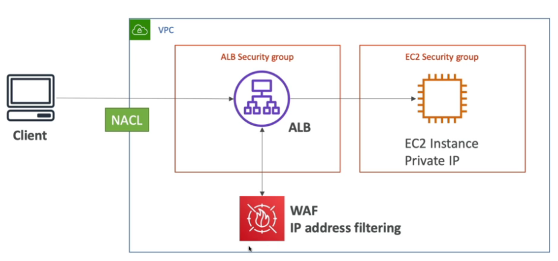
  - Caso esteja usando um Network load balance, a unica forma de bloquear um ip seria usando o **NACL**. Pois o NLB não possui Security Group.
    
- Caso esteja usando **CDN**, e possível usar o **WAF** na para bloquear o acesso. Antes mesmo dele chegar na **VPC**, não sendo necessário usar as **NACL**
  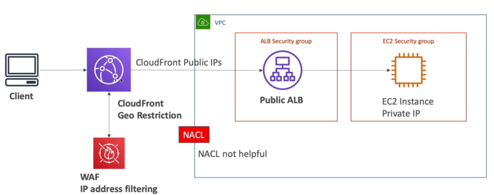

---

### AWS Inspector


- Permite que você analise o comportamento de seus recursos da AWS e ajuda a identificar possíveis problemas de segurança.
- **AWS Inspector** inspeciona instâncias EC2 contra ameaças comuns.
- Tem um agente que pode ser instalado nas EC2 (SSM Agent).
- Analisa apenas instâncias em execução e procura risco na aplicação.
- Pode analisar imagens enviadas para o **ECR.**
- Pode analisar Lambdas functions.
- Possível configurar a periodicidade de execução.
- Tem um alto custo sendo:
  - **60$ - para analises de rede (Acesso indevido e capacidade).**
  - **120$ - para analise da maquina (checa por vulnerabilidade comuns).**
- Analiza:
  - Vulnerabilidades de pacotes **(EC2, ECR e Lambda)** - usando o database CVE.
  - Acesso a rede (EC2).

---

### AWS Config


- Ajuda a verificar o compliance da nossa conta de acordo com a linha do tempo.
- Mostra quais são as modificações que foram feitas.
- Pode usar tópicos para notificação.
- Pode se agregar as analises realizadas nas contas da organização em uma única conta (**Uma**
  **conta de auditoria**).
- É cobrado, **pois fica escaneando os serviços habilitados.**
- Pode ser configurar para monitorar (scannear) continuamente ou para recursos criados ou em um intervalo de tempo, por exemplo 1 vez por dia.
- Possui integração com o **SSM Automation** que permite executar **correções automáticas** ao detectar anomalias.
  - Ex: Caso seu security group esteja liberado para determinado range não permitido. ele detecta e executa um Automação que remove o range e notifica via SNS ou EventBrigde.
- **Serviço regional,** mas nas analise é possível **adicionar serviços globais.**
- Contem várias regras (mais de 75), que servem para validar se um serviço esteja **compliance, possivel criar próprias regras.**
  - Para criar suas configuração é necessário criar uma Lambda function que checa o que se que validar.
    - Ex: Deseja-se validar se as instâncias EC2 criadas são do tipo micro, que são as unicas permitidas, se criaria um Lamdba Function que valida e se definiria uma regra linkada a essa Lambda.
      **Serviço pago $0.003 por regra habilitada**
- Permite ver as alterações feitas que não estão compliance, e quem fez a alteração.
- Uso, pode adicionado uma regra que valida se há acesso **ssh** ao um **security group** e caso detecte é possível disparar uma ação ou uma notificação.
  
  Perguntas que tem como resposta AWS Config:
- Há algum security group configurado sem ssh?
- My bucktes tem algum acesso publico.

#### AWS Config Resource

- Dashboard que permite ver os recursos que estão ou não em compliance.
- Permite ver as configurações

---

### AWS Managed Logs

- Logs gerenciados e produzidos por serviços AWS:
  - Logs de acessos dos Load balances -> podem ser exportados para o S3.
    - Access logs dos loads balances.
  - Logs do CloudTrail -> podem ser ser exportados para o S3 ou Cloud Watch.
    - Logs das chamadas de APIs da AWS.
  - Logs de Fluxo VPC (VPC Flow Logs) -> podem ser ser exportados para o S3 ou Cloud Watch.
    - Dados sobre tráfego de IPs e Interfaces de redes.
  - Logs de acessos Route 53 -> podem ser enviados para o Cloud Watch.
    - Loga as informações que queries recebidas pelo Route 53.
  - Logs de acessos do S3 -> podem ser exportados para o S3.
  - Logs de acessos do Cloud Front -> podem ser exportados para o S3.
  - Logs do AWS Config -> podem ser exportados para o S3.

---

### AWS Guard Duty


- Serviço de inteligência artificial para detectar anomalias na sua conta.
- Tem free trial , após isso é gerado cobrança.
- **É um serviço regional.**
- Recebe dados do:
  - **Cloud Trail** - detecta chamadas incomuns e não autorizadas.
  - **VPC Flow** - detecta tráfego incomum e IPs incomuns.
  - **DNS Logs** - detecta instâncias dados comprometedores enviando dados de DNS.
  - **Kubernetes Autid Logs** - detecta atividade suspeita e potencial compremetrimento dos clusters.
- Ler todos e através de algoritmos ele detecta coisas erradas.
- É possível conectar ao **event Brigde** do **Cloud Watch** para notificar.
- Pode se colocar uma conta da organização para ser a Adminstrador do GuardDuty ele teria permissão de gerenciar o guardDuty em todas as contas.
  

---

### IAM Advanced Policies

#### Condicions

> permite usar condições para liberar acesso.

- Pode se usar as condições:
  - **SourceIP** - Para dar acesso ou negar via IP ou range de IPs. (exemplo - Só permitir que acesse a AWS se estiver na rede da empresa)
    
  - **RequestedRegion** - Permite restrigir a região onde os recursos podem ser criados ou chamados.
    
  - **ResourceTag** - Permite liberar a execução ou uso de recurso que tenha a tag.
    - Exemplo, só permite a execução de instancias que tenha a tag de Project **DataAnalytics**
      
  - **MFA** - Permite usar para exclusão de dados
    - Exemplo, pode se restrigir a exclusão de dados de um S3 ou para uma instancias EC2 apenas se o usuário tiver o MFA habilitado.

---

#### IAM for S3

- Pode se aplicar regras para o bucket e para os objetos e há diferença.
- Usa se o caracter \* pra regras de objetos
  

---

Resource police restritas para a organização

- Permite restrigir usado de polices apenas a menbros de uma organização

---

### AWS Security HUB


- Centraliza a gestão de segurança de múltiplas contas.
- Agrega alertas de outros serviços visto anteriormente.
- Usa o **AWS config** .
- Dá para automatizar com funções para resolver problemas conhecido (tipos porta **ssh** liberada ..)

---

### Amazon Detective

- Analisa e investiga a causa raiz de problemas de segurança, ou atividades suspeitas usando Marchine Learn e Grafos.
- Criar visão unificadas para logs coletados facilitando ve-los.
- Permite criar visualizações desses logs para detalhar problemas identificados.

---

## Compute & Load Balancing


### EC2

- Elastic Compute cloud.
- Maquinas nas nuvem que são possível usar sob demanda.
- O Armazenamento e feito com:
  - **Network-attached:**
    - EBS (Elastic block storage)
  - **hardware** (EC2 Instance Store)
- Tem que ter uma rede conectada.
- Tem que um firewall (**Security group**).
- Quando parado os dados de memórias são perdidos e os dados no volume **EBS** e mantido até a próxima inicialização
- Caso queira manter os dados de memória salvo quando para use a opção de **Hibernate** (hibernar), que mantém em memória os dados.
- Quando destruído a instância os dados de memória e do **EBS** principal são destruídos, mas é possível adicionar um segundo EBS ou marcar para preservar o default.
- **EC2 Nitro** - nova tecnologia de virtualização adotada pela AWS.
  - Melhora o uso da rede.
  - Melhora o **IOPS** (Input/output operations per second) dos armazenamento **EBS**.
- **EC2 Graviton**
  
  - Entregam o melhor performance em relação ao custo. Sendo 46 % mais em contas em comparação com a 5 geração.
  - Suporta muitos OS (Linux, AML 2)
  - Não disponível para Windows.
- **EC2 vCPU**
  - Uma CPU, seria um core de um processador, pode conter várias threads.
  - Uma vCPU seria cada uma dessas threads.
  - É possível especificar qual a configuração de vCPU você precisa, por exemplo para uma aplicação node que é single thead pode se definir 1 vCPU.
- **Placement Groups** - Grupos de Posicionamento
  - Permite decide a estratégia posicionamento das instâncias EC2. ou seja onde vai ficar as instâncias de vai ser:
    - **Cluster** - Todas ais instâncias ficam juntas, tem baixa latência, mas ficam numa única AZ. (alta performance, mas tem um alto risco).
      - Boa escolha quando se tem instâncias com rede otimizada (enhanced Networking).
      - Usados para jobs de processamento rápido de BigData e aplicação que precisam de baixa latência de rede
    - **Spread** - (espalhadas) As instâncias ficar espalhadas em servidores em diferentes AZ, com no máximo de 7 instâncias por grupo por AZ. Usados em aplicações criticas.
      - Baixo risco que indisponibilidade.
    - **Partition** - Similar ao **Spread**, mas as instâncias ficam espalhadas em diferentes partições (conjunto de Racks) numa AZ. Pode escalar para centenas de instâncias por grupo, usadas com o Hadoop, Kafka, Cassandra.
      - Pode ter até 7 partição por AZ, e centenas de instâncias.
      - As partições não compartilham o mesmo hack.
      - Se a partição falhar todas as maquinas são perdidas.
      - As instâncias podem compartilhar dados da partição vias EC2 Metadata.
        
- É possível mover uma instância de um placement group. Para isso é necessário:
  - **Parar a instância e usando o CLI mudar ela de placement group e depois inicia-la novamente.**
- **Metricas**
  
- Instance recovery
  - O **CloudWatch** monitora a instância, caso a instância e problema é possível recupera-la usando uma alarme, criando uma nova com o mesmo IP na mesma rede, com os mesmos metadados e o mesmo **placement group**.
  - Além disso é possível alerta vias **SNS** a equipe.

---

#### Tipos de instâncias

- Veja [tipos de instâncias](https://aws.amazon.com/pt/ec2/instance-types/)
- Veja [informações extras sobre instâncias](https://instances.vantage.sh/)


 

- Nomenclatura dos tipos de instâncias:

  - exemplo: m5.2xlarge

    - m -> classe da instância.
    - 5 -> geração das maquinas.
    - 2xlarge -> Tamanho das instâncias

    

---

#### Precificação

- Todas são pagas por **horas** ativas.
- **on-demand**
  - Não necessário contrato, só rodar quando necessário.
  - Recomendado para cargas de trabalho curtas, (dura 3 meses, ou 1 mês).
- **reserved Instances**
  - Se faz um contrato de **1 a 3 anos,** se reduz o custo em até **75%.**
  - Recomendado para **longas cargas de trabalho**, exemplo banco de dados.
  - Pode ser compartilhado entre as contas de uma organização.
  - **Tipos de reservas**
    - **reserved instances** - onde se reserva um instância de um determinado tipo.
    - **convertible reserved instance** - onde se reserva um instância e é possível alterar o tipo depois, e pode ter até **54% de desconto**.
    - **scheduled reserved instance** - exemplo - toda terça entre 20 a 22 horas.
  - **Tipos de pagamento**
    - **NURI** - no upfront payments - Nenhum pagamento adiantado - redução em até **32%.**
    - **PURI** - partial up-front - Adiantado parcial - redução em até **42% .**
    - **AURI** - all up-front - Tudo adiantado - redução em até **43%.**
- **spot instances**
  - Usado para aplicação **serveless**, que podem ser **paradas a qualquer momento**, são maquinas que **estão paradas na AWS**, poder chegar até 90% mais baratas. a desvantagens e que ela pode parar a qualquer momento, quando quiser.
  - Não são recomendadas para aplicações que precisam de disponibilidades.
  - AWS pode interromper com uma notificação de 2 minutos.
    - **spot fleets**
      - Conjuntos de **spot instance** de diferentes tipos de maquinas e opcionalmente pode haver instâncias on-demand pra chavear (pool de tipo da maquina e em diferentes regiões), a fim de ter maior economia para executar as carga de trabalho. São configuradas para _manter_ a capacidade alvo, iniciando instâncias de substituição após as Instâncias Spot na frota serem encerradas
      - Usados para aproveitar **spot instances com baixo custo**, pois o spot **fleets** pode automaticamente selecionar o conjunto mais barato para executar sua carga de trabalho.
      - Nele se define o preço máximo a pagar pelas instâncias spot e o AWS seleciona um conjunto de instância que esteja abaixo desse preço para executar a carga de trabalho.
        
      - Caso as instâncias estejam caras ele encerra e passa o processamento para instâncias sob demandas.
      - soft limits
        - Tem uma limitação de 10 mil instâncias por frota (Fleet) seja ec2 ou Spot.
        - Tem uma limitação de 1000,000 instâncias por região.
      - Estratégia de alocação de instâncias
        - Menor preço - bom para carga de trabalhos curtas
        - Diversificada - Distribuída, bom para carga de trabalho que precisa está disponível e que tenha longo tempo de execução.
        - Capacidade otimizada - bom para cargas pesadas
- **dedicate instance**
  - Alugar se uma instância que só será sua, outro usuários não terão acesso a hardware.
- **dedicate host**
  - Aluga-se um servidor físico, para demandas de compliance principalmente.
  - Aluga-se por até 3 anos.
  - Mas caro tipo de instância.
- **salving plan**
  - Modelo de economia baseado no compromisso de uma quantidade de uso medido em horas num período de 1 ou 3 anos.
  - Economia de até 66%, é flexível e não precisa se preocupar em gerenciar o custo por instância, apenas com a quantidade de horas usados nas cargas de trabalho
  - **EC2 Instance Savings plan** - Economia de até 72 %, seleciona os tipos de instâncias e as regiões onde ela vai operar. Pode se alterar entre os tipos de instâncias selecionadas e os SO.
  - **Compute Savings plan** - Economia de até 66 %, tem se maior flexibilidade na conversão do tipo de instância e na movimentação entre regiões. Além de poder adicionar Lambdas e Spots.
  - **SageMaker Savings plan** - Economia de até 64 %, para carga de trabalhos do SageMaker.
- **capacity reservation**
  - Permite reserva instâncias por um período "**curto de tempo**", sem precisar se comprometer com um plano de 1 ou 3 anos.
  - Usando por exemplo para reservar maquinas para a **black friday.**
  - Pode ser combinado com o **salving plan.**

---

#### HPC - Alta performance computacional

- Serviços que ajudam ter alta performance na AWS:
  - **Transferência de dados**
    - **AWS Direct Conect** - Permite mover GBs de dados para a cloud.
    - **SnowBall e SnowMobile** - Pemite mover PB de dados para a cloud.
    - **AWS DataSync** - Permite mover grandes quantidade de dados do on-primeses para cloud .(usando S3, EFx, Fxs for Windows)
  - **Computação**
    - **Instâncias EC2**
      - Com CPU otimizada ou GPU otimizada.
      - spot instances / Spot Fleets para economia + auto scaling.
    - **EC2 Placentament Groups** - Permite usar um conjunto de maquinas (cluster) num mesmo **rack** ou região o que diminui a latência..
      - **EC2 Enhanced Networking SR-IOV** (Rede aprimorada para EC2)
        - Interface de rede para HPC.
        - Alta banda, Alto PPS (pacotes por segundos), baixa latência.
        - Opção 1: **Elastic Network Adapter** (ENA) aumenta a capacidade para 100Gbps.
        - Opção 2: Intel 82599 VF para 10 GBs - Antiga não usado mais
      - **Elastic Fabric Adapter** (EFA)
        - Interface de rede usada para HPC no Linux com foco.
        - Melhora a ENA para Alta HPC, apenas para linux.
  - **Armazenamento**
    - **Ligado na instância**
      - **EBS** - Escala até 256,000 IOPS with io2 Block express.
      - **Instance store** - escala para milhões de IOPS, mas é perdido quando a instância desliga.
    - Na rede
      - **S3** - Armazenamento de objetos.
      - **EFS** - Escala IOPS baseado no tamanho total, ou IOPS provisionado .
      - **FSx for Lustre** - FileSystem otimizado para HPC usando linux.
  - **Automação e Orquestração**
    - **AWS Batch** - para trabalhar com jobs e agendamentos.
    - **AWS ParallelCluster**
      - Ferramenta Open Source para deploy e gerenciamento de cluster HPC.

---

#### Auto Scaling group

- Permite aumentar a quantidade de **EC2** de acordo com a demanda, ou alarmes gerados pelo **CloudWatch** com base nas métricas ou eventos.
- Não a cobrança, você só e cobrando pelas recursos (ec2, ebs ..) que são usados.
  - **Escabilidade** - habilidade de escalar vertical e/ou horizontal.
  - **Elasticidade** - Capacidade de escalar dinamicamente, através de alarmes ou métricas, ou reduzir as instâncias com a diminuição do volume de acesso, ou uso.
  - **Agilidade** - Velocidade de se ter infraestrutura a toque de caixa.
    
- **Composto pelo atributos**
  - Uma **configuração** \ **templates** de lançamento (define o tipo de maquina/ armazenamento / Security Group / SSH key pair / User Data que será usada nas instância que serám criadas) .
  - Seta as capacidade mínimas e máximas (quantidade de instâncias).
  - Rede onde irá criar as instâncias.
  - Informações sobre o **Load balance** onde esta linkado.
  - Política de escalabilidade, que define quando irá escalar.
- **Scaling polices**
  - Política de escalabilidade, que define quando irá escalar.
    - **Dynamic scaling police**
      - É possível usar métricas geradas pelo **CloudWatch** para definir as políticas (como media de consumo de CPU, ou quantidade de requisição).
      - Metricas boas para auto scaling:
        - CPUUtilização , RequestCountPerTarget
        - Average Networtk In | Out - para aplicação que usam rede para transferência ....
        - Custom metricas
    - **Sheduled scaling police**
      - É possível agendar para uma determinado período (horário comercial).
    - **Preditive scaling police**
      - É possível usa **marchine learning** (analise do uso anteriores) para criar uma previsão de escalabilidade.
- **Scaling cooldowns** - tempo que deve ser esperado após ser lançada uma instância para validar se as métricas delas estão valida, ou se é preciso escalar.

---

**Processos executados pelo auto scaling**


---

### Para a prova

- Existe uma política de encerramento no **auto scaling group:**
  - 1 . Encontra a AZ com maior numero de instâncias.
  - 2 . Termina a que tiver o configuração de inicialização mais antiga.
- Ciclo de vida de uma instancia com o ASG
  
- Diferença entre Configuração de lançamento (Launch configuration) e templates de lançamento (Launch tempalte)
  - **Launch configuration** é legado, devem ser **recriado** toda vez que se alterar algum atributo
  - **Launch tempalte** é nova e:
    - Tem versionamento, que resolve o problema anterior.
    - Pode se cria subconjuntos de configurações que podem ser herdados por outros templates
    - Permite provisionar instâncias on-demand / spot instances ou um mix de ambos.

---

### Amazon ECS

- Elastic Container Service - **Serviço de container proprietário da AWS.**
- Você deve prover e manter a infraestrutura (instâncias EC2). Ou usa o **Fargate** que abstrai esse gerenciamento.
- Não te tem custo, só paga as maquinas usadas (EC2, EBS ...).
- Para se subir container, primeiro é necessário configurar uma **ECS Task**, ele descreve com será construido o container, seria algo semelhante como um arquivo **docker-compose**. E na Task que se define as políticas de acesso a recursos que a aplicação vai usar além de rede e grupo de segurança.
- As Task podem ser disparadas pelo **Event Brigde**, isso dispara a execução do ECS.
- Tem integração direta como o Application Load Balancer e o Network Load balancer.
- Conceitos
  - 
  - 
    EC2 x Fargate
    
    
    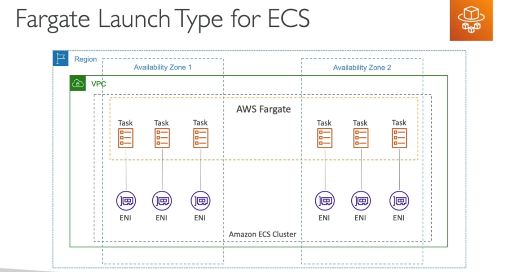
    
    

---

### Amazon EKS

- Amazon Elastic Kubernetes Service.
- Serviço de **kubernetes** totalmente gerenciado pela AWS.
- Custo de **$0,1** por hora por cluster kubernets ($75 por mês) mais os recurso (EC2, EBS).
- Deploy complexo, requer uma pessoa que manja.
- É Open source assim caso migre de nuvem terá mais facilidade no processo.
- Usa o **ECR** para armazenar as imagens.
- Tipos dos nodes
  - **Gerenciados pela AWS**
  - **Gerenciado pelo cliente**
  - **AWS Fargate**
- Volumes
  - Quando se cria o node se espeficica o classe de armazenamendo.
  - Usa se o **CSI (Container storage interface)**
  - Suporta:
    - **EBS**
    - **EFS (quando usando Fargate)**
    - **FSx for Lustre**
    - **Fsx for NetApp ONTAP.**
- É possível rodar o EKS no On-primeses usando o **EKS AnyWhere**.
  - Pode se usar uma imagem da Amazon customizada do Kubernets (AMI), rodando localmente.
  - Pode se conectar o **EKS do On-primeses a AWS** usando EKS **conector**.
  - Usado quando se quer diminuirá a latência, ou por demanda regularizaria. exemplo os dados governamentais do Chile deve ficar no Chile, Roda em um datacenter conectado a AWS.
    

---

### AWS ECR

- AWS Container registry, pode conter repositórios públicos e privados.
- Tem um boa integração com ECS e EKS.
- Acessos controlados pelo IAM.
- Permite replicação em várias regiões e em várias contas.
- Scaneia as imagem para por seguranças, podendo ser manual ao a realizar um push.
  - **Base scanning -> CVE** , caso encontre algum erro ele notifica via EventBridge.
  - Scan profundo - Usa o **Amazon Inspector** para procurar vulnerabilidade caso encontre algum erro ele notifica via EventBridge.


---

### AWS Lambda

- Trabalha com eventos.
- Tem de **128 MB** até **10 GB** de memória que pode ser usado.
- Tem escopo regional.
- Pague por **milissegundo** usado para executar o código.
- **Serveless** (não tem servidor para se preocupar).
- Se preocupe apenas com a aplicação não com a infraestrutura.
- Necessário monitorar bem, pois toda a infraestrutura e liberada após o uso.
- Provisiona servidores de acordo com as chamadas.
- Altamente disponível e totalmente tolerante a falha.
- Tempo de execução de até **15 minutos.**
- Cobrado de 100 em 100 milissegundos de uso.
- Faz escalonamento horizontal e pode ter **ate 999 execução simultâneas.**
- Triggers
  - API Gateway.
  - Kinesis
  - DynamoDB Data Streams
  - S3 events
  - CloudFront
  - EventBridge
  - SNS, SQS
  - Cloud Watch Logs
  - AWS Cognito
- Limitações
  - **Execução**
    - Alocação de memória - 128MB - 10GB.
    - CPU - Linkado a memória ram (Não é possivel alterar)
      - 2vCPU - 1,719 MB de RAM
      - 6vCPU - 10,240 MB de RAM
    - Tempo de execução - até 15 minutos.
    - Variáveis de ambiente - até 4KB.
    - Espaço em disco (no container do Lambda /tmp) - 10 MB.
    - Execuções simultâneas da mesma Lambda - 1000 (Pode ser alterado com solicitação).
    - Tamanho do paylod 6MB (Sync) / 256 KB (async)
  - **Deploy**
    - Tamanho do pacote zippado com a função Lambda - 50MB.
    - Tamanho do pacote com a função Lambda - 250MB.
    - Tamanho da imagem - 10 GB
- Lambdas@Edge
  - É possível executar Lambdas em ponto de presenças, para auxiliar itens relacionados ao CDN , Route 53 ....
  - Bom para diminuir a latência.
    
- CloudFront Functions
  - Saiba mais em [Edge Funtions](https://docs.uniii.com.br/02-cloud-notes/01-aws/03-aws-cloud-architect-professional/02-conteudo.html#edge-function)

---

### AWS App Runner

- Serviço gerenciado pela AWS que facilita o deploy de aplicações web ou API em escala.
- Não necessita conhecimento de infraestrutura para usar.
- Pode se iniciar apenas com o source code ou a imagem do container.
- Automaticamente compila e deploya a aplicação.
- Automaticamente escala e configura alta disponibilidade e load balancer e criptografia.
- Tem suporte a acesso a VPC.
- Permite uso de banco de dados, cache e mensageria.
- Semenhante a idea do heroku.
  

---

### Elastic Load Balancing

- Distribui o tráfego entre as instâncias de EC2.
- Usa o healh check para verificar o status da instâncias.
- Cria um endpoint, para ser a única entrada de requisições.
- Não gerencia sessões por padrão, existe uma **feature** chamada **Stick session,** que realiza isso, porém não é recomendado o uso, pois que controla o dados da sessão é a aplicação.
- Serviço gerenciado pela AWS.
- Pode ser configurado com **privado** ou **publico**.
- Envia métricas para o CloudWatch.
- Há 4 tipos de **ELB**:
  - **classic load balancer** CLB -(v1 - old generation - 2009)
    - http, https e tcp.
    - Checa a saúde via endpoint da aplicação (http ou TCP).
    - Necessário adicionar instâncias manualmente.
  - **Application load balancer** ALB (v2 - new generation - 2016)
    - http, https e webSocket e http/2.
    - Usa target group para agrupar as instâncias.
    - Tem suporte a **routinhg** baseado em (**listeners**) sendo:
      - **Path** ex:(uni.com/post & uni.com/users).
      - **hostmane url** (curriculo.uni.com e fotos.uni.com).
      - **query string** (uni.com?id=123&order=123).
    - Usados bastante numa arquitetura de microserviços
      
  - **Gateway load balance** GWLB - (v2 - 2020)
    - Opera no level 3 (rede) - protocolo IP
    - Usado para balecear carga de soluções de terceiro
    - Usado para Firewall, fazer sistema de detecção e intrusão. Ou seja, usado quando se deseja escanear o tráfego.
    - Utiliza o protocolo GENEVE no porta 6081.
      
  - **Network load balancer** NLB -(v2 - new generation - 2017)
    - tcp, tls (secure tcp) e udp.
    - **Tem uma latência menor que o ALB ~ 100ms vs (400 ms do ALB).**
    - Tem um IP estatico por AZ, é possível usar um Elastic IP.
      
    - Zonal DNS Name
      - Como cada AZ tem um IP estático, quando acionado DNS ele retorna todos os IPs de todas as AZ relacionado ao NLB.
      - Caso precise retornar apenas um é só adicionar a Região mais AZ no DNS.
        - Caso de uso, vc tem duas aplicação instaladas em 3 AZ, e elas conversam entre si.
        - Caso a APP A chame a B em diferente regiões você vai pagar pelo tráfego de transferência de região. nesse caso pode se criar uma lógica para que a aplicação A recupere o o IP da aplicação B da região onde ela esta assim não tendo que pagar pelo tráfego Cross Region.
          

#### Target groups

- Agrupa as "maquinas" para onde o tráfego será redirecionado.
- Essas "Maquinas" podem ser instâncias **EC2, servidores on-premisses linkados via IP e Lambdas.**
- Agrupa
  - As instâncias EC2.
  - As Tasks do ECS.
  - Lambdas Funtions - a requisição é traduzida para um evento.
- É responsável por checar a saúde das instâncias.

#### Stick session


- Permite que as requisições enviada as instâncias que já atenderam aquele cliente a fim de não perder os dados de sessão.
- Tipos cookies que podem ser usados
  - **aplication-based cookies**
    - **Custom cookie**
      - Gerado pelo target.
      - Pode incluir diversos atributos.
      - Pode ter um nome individual por target group.
      - Não use os nomes AWSALB, AWSALBAPP, AWSALBBTG, pois são reservados.
    - **application cookie**
      - Gerados pelo load balancer.
      - Cookie name AWSALBAPP.
  - **duration-based cookies**
    - Cookie gerados pelo load balance.
    - Tem uma duração especificada.
    - Tem os nomes AWSALB para ALB, AWSALBBTG para CLB.

##### Cross-Zone load balance

- Essa funcionalidade distribui o acesso igualmente pela quantidade de instâncias, independente de que zona ela esta, caso não habilitada será distribuído o tráfego igualmente pela zonas de disponibilidade, e cada instância pode receber quantidade de tráfego diferente.
  
- Configurações de disponibilidade
  
  **Request Routing Algoritimo**
- Least Outstanding Request - Solicitação menos pendente
  - Redireciona para estância que tiver o menor numero de requisições pendentes. Ou seja para instância menos ocupada.
  - Funciona com ALB (HTTP) e CLB (HTTP).
- Round Robin - Sequência circular
  - Funciona com ALB e CLB.
  - Redireciona em sequencia 1, 2, 3, e reinicia pelo 1 , 2, 3 independente da quantidade de requisições pendente.
- Flow Hash
  - Seleciona o Destino baseado no protocolo, o IP e a porta de origem e destino, e a numero sequencial do TCP.
  - Cada coneção UDP/TCP e roteado para um único destino durante toda a conexão.
  - Funciona com o NLB

##### SSL Certificates

- Permite criptografar tráfego entre cliente o **load balance** (in-flight encryption).
- Hoje temos o SSL e o TLS (este é mais seguro que o SSL).
- **CLB** - apenas uma aplicação e apenas um certificado.
- **ALB** - suporta múltiplos **listeners** (entenda como app diferente) e múltiplos certificados e usa **SNI** (server name indication) para isso.
- **NLB** - suporta múltiplos **listeners** (entenda como app diferente) e múltiplos certificados usa **SNI** para isso.
  
  

##### Auto Scaling group ALG

- Permite aumentar a quantidade de **EC2** de acordo com a demanda, ou alarmes gerados pelo **CloudWatch** com base nas métricas ou eventos.
- Não a cobrança, você só e cobrando pelas recursos (ec2, ebs ..) que são usados.
  - **Escabilidade** - habilidade de escalar vertical e/ou horizontal.
  - **Elaticidades** - Capacidade de escalar dinamicamente, através de alarmes ou métricas, ou reduzir as instâncias com a diminuição do volume de acesso, ou uso.
  - **Agilidade** - Velocidade de se ter infraestrutura a toque de caixa.
    
- **Composto pelo atributos**
  - Uma **configuração** \ **templates** de lançamento (define o tipo de maquina/ armazenamento / Security Group / SSH key pair / User Data que será usada nas instância que serám criadas) .
  - Seta as capacidade mínimas e máximas (quantidade de instâncias).
  - Rede onde irá criar as instâncias.
  - Informações sobre o **Load balance** onde esta linkado.
  - Política de escalabilidade, que define quando irá escalar para cima ou para baixo.
- **Scaling polices**
  - Política de escalabilidade, que define quando irá escalar para cima ou para baixo.
    - **Dynamic scaling police**
      - É possível usar métricas geradas pelo **CloudWatch** para definir as políticas (como media de consume de CPU, ou quantidade de requisição).
    - **Sheduled scaling police**
      - É possível agendar para uma determinado período.
    - **Preditive scaling police**
      - É possível usa **marchine learning** (analise do uso anteriores) para criar uma previsão de escalabilidade.
- **Scaling cooldowns** - tempo que deve ser esperado após ser lançada uma instância para validar se as métricas delas estão valida, ou se é preciso escalar.

### Para a prova

- Existe uma política de encerramento no **auto scaling group:**
  - 1. Encontra a AZ com maior numero de instâncias.
  - 2 . Termina a que tiver o configuração de inicialização mais antiga.
- Ciclo de vida de uma instancia com o ASG
  
- Diferença entre Configuração de lançamento (Launch configuration) e templates de lançamento (Launch tempalte)
  - **Launch configuration** é legado, devem ser **recriado** toda vez que se alterar algum atributo
  - **Launch tempalte** é nova e:
    - Tem versionamento, que resolve o problema anterior.
    - Pode se cria subconjuntos de configurações que podem ser herdados por outros templates
    - Permite provisionar instâncias on-demand / spot instances ou um mix de ambos.

---

### Amazon API Gateway


- Serveless, usado para criar APIs Rest.
- Possível conectar a serviços de login para validar token ou coisa do tipo.
- Tipos de API
  - APIs RESTful - Para servidores Http ou Lambdas.
  - APIs WEBSOCKET - Para aplicações bidirecionais com webSocket.
    - Usado pra chats, games ou aplicações que precisa manter conexão abertas.
  - AWS Service - Para expor APIs de serviços AWS, (post a message on SQS, ou iniciar um step function, S3)
- Recursos:
  - Versionamento de APIs.
  - Gerenciamento de tráfego (API keys e Throttles)
- Limitações
  - **Timeout de 29 segundos.**
  - Tamanho do payload de no **máximo 10 MB.**
- Deployment stages
  - Permite criar vários estágios de deploy e através dele é possível fazer rollback.
  - Além de controlar o direcionamento do tráfego.
- **LOGs**
  - Possivel enviar os logs para o **Cloud Watch** com os niveis ERRO e INFO
  - Pode logar o request e response completos.
  - Pode enviar os logs de acessos de forma customizada
  - Pode ser enviados diretamente para o **Kinesis Data FireWhose** como alternativa.
  - Metricas
    - São envidas com base nos stages, há possibilidade de envio de métricas detalhadas.
  - X-Ray
    - Pode se habilitar o tracing para recuperar informações sobre as requisições.
    - Pode se cria um desenho da requisição até o destinário.
- **Tipos de endpoints**
  - **Edge-Optimized (default)** - Para clientes Globais (melhora a latencia).
  - **Regional** - Para apenas uma região.
  - **Private** - Acesso apenas pela maquinas dentro de uma VPC.
- **Caching**
  - Permite o uso de caching para reduzir a quantidade de chamadas ao Backend.
  - Por padrão tem um **TTL de 300 segundo, mas pode ser configurado até 0 a 3600 segundos.**
  - Definidos por Stages, mas é possível aplicar para cada métodos (endpoint).
  - O cliente pode invalidar o cache enviando o header **Cache-Control:max-age=0** (precisa de uma IAM que autorize).
  - Pode ser criptografado.
  - **Tem um tamanho que varia de 0.5GB a 237GB.**
- **Plano de uso**
  - Defini quem pode usar o API Gateway. o quão rápido pode se usar.
  - Pode se configurar limites de Throttling (TPS por segundo) e cotas (quantidade máxima de requests) para clientes individualmente.
  - API Keys
    - Identifica um cliente no API Gateway, usado para aplicar as configurações acima.
- **IAM Permissions**
  - Há duas coisa pra se ter acesso:
    - Autenticação -> Diz que o usuário está logado. -> feito com IAM.
    - Autorization -> diz que o usuário tem permissão. -> feito com IAM Policy.
  - O API Gateway usa uma política para verificar quem tem acesso as APIs para "usuarios" da sua organização AWS, as credencias são enviadas no Header com **Sig 4**.
    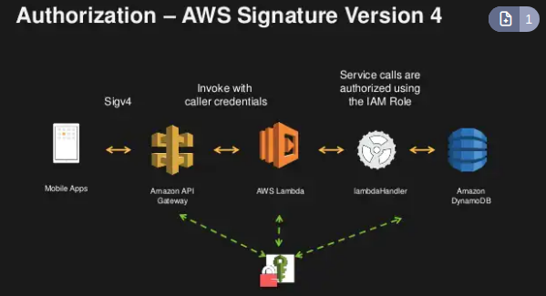
- **Lamdba Authorizer**
  - Conhecido como autorizador customizado, Se cria uma **lambda** para validar um Token e essa validação e cacheada por uma hora.
  - Paga pelo quantidade de Lambda infocado.
  - Pode se usar OAuth / SAML ... para autorizar.
    
  - 
- **Cognito user pools**
  - Solução AWS, para cadastro de usuário, através dele é possível da a um usuário qualquer acesso a recurso da AWS.
  - Ajuda apenas na autenticação não na autorização.
  - Fornece um padrão de autenticação.
  - Permite usar autenticação externas (de terceiros , Google, Facebook).
    
    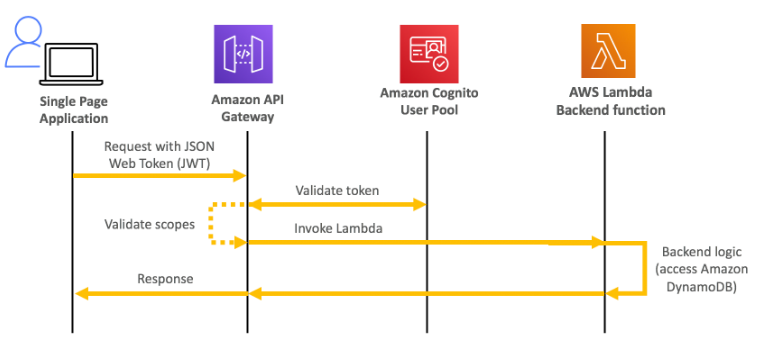

#### Discução de arquiteturas com o API Gateway

- Subindo arquivos em um bucket S3.
  - Pode se usar o API Gateway, porém a uma limitação de tamanho de 10 MB.
  - Solução ideal seria gerar um URL assinada e devolver via API Gateway. (não há limites de tamanho de arquivos)
    


#### Comparando soluções com o API Gateway

- EC2 com Elastic IP
  - Em caso de falha na instância, se cria uma nova e atacha o Elastic IP.
  - Funcional, barato, porém não é escalável devido ao fato de se ter apenas um IP.
    
- Api Gateway + AWS Service
  


---

### AppSync

- Gerenciado pela AWS, Usa **GraphQL**.
- Pode recuperar dados de **varios lugares** (configurados previamente) como Banco de dados, DynamoDB e APIs.
- Permite recuperar os dados em **tempo real** usando **WebSocket or MQTT on WebSocket**
- Para Aplicativos mobile:
  - Pode se usar para armazenar dados locais e para sincronizar dados.
    
- Pode ser usado com o Cognito para recuperar autorização (permissões) baseados em grupos de usuários.
  - Exemplo tenho um blog onde configure o que meu usuários podem fazer, em vez de colocar no código posso colocar aqui e validar a ação de acordo como grupo que o cara pertence.
    

---

### Amazon Route 53

- Serviço gerenciado de DNS.
- Serviço pago, $0.50 por zona configurada.
- Gerencia Roteamento da aplicação para regiões de acordo com alguns critérios muito usado como recuperação de desastre, pois identifica falhas e redireciona o tráfego para outros lugares .
- Dentro do serviço também é possível comprar domínios com no **registro.br** .
- Pode se setar TTL nos Records para controlar o tempo de vida. Ele é obrigatório para todos os tipos de records exceto para o tipo Alias.
  

#### Common Records

- A Record (IPV4) -> www.google.com -> 12.34.56.78
- AAAA Record (IPV6) -> www.google.com -> 2001::od:b8::7337
- CNAME -> hostname to hostname -> www.search.google.com -> www.google.com
  - É pago
  - Não funciona para registro to tipo root ex: -> www.google.com -> www.search.google.com
- ALIAS -> hostname to aws resource -> www.exemplo.com -> (S3, RDS, ELB, CloudFront ...)
  - Na AWS é grátis.
  - Checa a saúde do recurso.
  - Funciona para registo to tipo root ex: -> www.google.com -> www.search.google.com
  - Não precisa setar TTL, pois que senta é o Route 53, no resource.
  - Usado com ELB, Cloud Front, API gateway, Beanstalk, s3 web sites, vpc interface enpoints, global accelerator e Route 53 (na mesma zona).
  - Não é possível setar para um DNS name de uma instância EC2.
- NS -> Name Server - serve para apontar para outro DNS resolver.


```shell
# para verificar use o comando para verificar os valores retornado pelos dns
nslookup <url>
dig <url> 
```


#### Routing police

São políticas de redirecionamento que é possível configurar no **route 53.**

- **Simple routing police** (política de roteamento simples).
  - A se chamar um domínio ele devolve o IP do servidor.
  - Não tem health checks.
  - Se cria um recorde e pode se retornar um ou vários valores e o **browser** decide qual é o melhor para ele.
  - Caso use alias só é possível retornar um item.
- **Weighted routing police** (política de roteamento com pesos).
  - É dado um peso para cada servidor, que define a percentagem de requisição que será
    redirecionado de acordo com o peso.
  - Se cria vários **record** com o mesmo nome, com retornos diferentes e pesos diferente.
- **Latency routing police** (política de roteamento baseado na latência)
  - Redireciona para o servidor de acordo com a menor latência.
  - Se cria vários **record** com o mesmo nome, com retornos diferentes para cada região.
- **Failover routing police** (política de roteamento de falhas)
  - Se defini servidores primários e de **failover**, caso o primário de algum problema será
    redirecionado o tráfego automaticamente. Usa health checks.
  - Se cria vários **record** com o mesmo nome, com retornos diferentes cada um com seu **health check** e se define quem vai ser o primário e o segundario.
- **Geolocation routing police** (política baseada em Geo localização)
  - Redireciona a requisição de acordo com a localização do usuário.
  - Bom para direcionar tráficos para aplicações especificas para países.
- **Geoproximity routing police** (política de roteamento por proximidade)
  - Redireciona o usuário para o recurso mais próximo da localização do mesmo.
  - Diferencia se do anterior, pois ele é usado para países enquanto esse seria para locais dentro do pais.
  - Usa o Bias para manipular a proximidade, com ele é possível dizer o quando quer redirecionar do traffico. Como se fosse uma preferência maior.
  
  - Traffic Flow
    - Simplifica a criação de record grandes e com configurações complexas.
    - Tem um editor visual para se montar árvores de roteamento.
    - Suporta versionamento.
- **Multi Value routing police** (Política de rateamento de multi valores)
  - Usado para devolver vários retorno e se um dele falhar, se terá outras para redirecionar, se a necessidade de consultar o **DNS** novamente.
  - Se cria vários **record** com o mesmo nome, com retornos diferentes cada um. Quanto o browser consulta é devolvido todos os retornos e o **browser** escolhe o que melhor lhe atende.
  - Pode retornar até 8 record saudável e validados
- **IP-based routing police** (Política de rateamento baseado no bloco de ips)
  - Pode se criar um redirecionamento de acordo como bloco de IP que esta chamando (cidr).
  - Usado para diminuir custos de rede.
  - exemplo tudo que for da rede 10.10.10.0/24 vai para o target 1.2.3.4 e tudo que for da rede 19.14.15.0/24 vai para o target 2.8.6.9.


#### Health check

Pode se configurar health checks para monitora a disponibilidade e a saúde da aplicação.

- São pagos $ 0.50 para endpoints AWS - $ 0.70 para outros endpoints.
- Há custos adicionais de outras features (String matching, https, latency measurament).
- Pode se usar http, https, tcp para se configurar como será a verificação.
- Disponibiliza 15 diferentes hosts para checagem (em várias regiões)
- há o modelo de health check calculado, usado para validar o outros health checks e em cima de cada verificação se calcula um valor que diz se esta estável ou não.
- E possível passar dados customizados (text) no retorno do health check nos primeiros 5120 bytes e com isso configurar para passar ou falhar na verificação.
  
- Para verificar a saúde de uma maquina numa **subnet privado**, pode se criar métricas que são envidas para o cloudwatch e dali é possível checa-las com o health check.


#### Hosted Zones

- É um container de registros para definir como rotear o tráfego para um domínio e seus subdomínios.
- Tem um custo de 0.50 por zona criada.
- Podem ser
  - **Publicos** - contém records que especificam rotas para a internet.
  - **Privados** - contém records que especificam rotas internas vista apenas nas VPCs.
    - Tem
      
      

#### Exemplo de uso para soluções resilientes


#### Hybrid DNS e Resolvers

- Hybrid DNS
  - Permite que se use Outros DNS em conjunto com o Route 53, O Route 53 fica como root DNS resolver e ele pode delegar a resolução de nomes para os outros Servidores de DNS.
  - Usado quando se tem uma rede local em on-premises (ou em redes privadas Peered VPC) que já tem um servidor de DNS e se precisa conectar ao AWS, para resolver os nomes entre as redes.
- Resolvers
  - O Resolver endpoint é um ponto de extremidade em sua Virtual Private Cloud (VPC) da AWS que permite que os recursos em sua VPC resolvam nomes de domínio em outros VPCs.
  - Podem ser associados a uma ou mais VPC na mesma região.
  - Pode se criar em duas AZ para ter alta disponibilidade.
  - Cada endpoint suporta até 10000 queries por segundos por IP.
  - São divididos em :
    - Inbound endpoint
      - Permite que a rede envie DNS Queries para o Route 53 Resolver.
      - Permite resolver DNS da AWS e de Recursos na Zona DNS Privada configurada na VPC.
        
    - Outbound endpoint
      - Permite que o Route 53 envie DNS queries para os DNS resolver que não seja do Route 53. (para o servidor de DNS no On-premises).
      - Usa Regras de resolução para encaminhar as queries de DNS.
        - pode se configurar o target
          

---

### AWS Global Accelerator

Serviço que melhora a disponibilidade de um serviço usando os ponto de presença, melhora a disponibilidade em cerca de 60%.

- 2 Anycast IP são criado para redirecionar o tráfego para os pontos de presença.
- É usado como proxy para as aplicações do AWS.
- Recomendado para servidores http, com conteúdo não estático.
- Funciona com Elastic IP, ALB, NLB, EC2 Instances
- Suporta preservação do IP do cliente, exceto para NLBs e Elastic IPs
  
- Diferença entre **CloudFront e Global Accelerator**
  - Ambos usam a rede **Global da AWS e pontos de presença.**
  - Ambos tem integração com **AWS Shield para proteção contra DDOS.**
  - CloudFront
    - Usado para **conteúdo estático** que precisa ser cacheado.
    - Guarda o **conteúdo estático no ponto de presença**.
  - Global Accelerator
    - Melhora o desempenho de aplicações que usam **TCP e UDP. Tipo chats, games, VoiP** ....
    - Mais adequado para aplicativos em **tempo real e serviços que exigem comunicação bidirecional**, como jogos online e aplicativos de negócios.
    - Faz proxy dos pacote entre os pontos de presenças em uma ou mais regiões.
    - Bom para aplicações que usam **IP estático.**


---

### AWS Outposts

- Permite implementar o que se chama de cloud hibrida.
- Ou seja, permite executar a AWS nos servidores on-premises.
- A AWS disponibiliza racks de servidores para executar no datacenter da empresa.
- Agora a empresa é responsável pela segurança física do rack disponibilizados.
- Vantagens:
  - Baixa latência.
  - Residência dos dados, ou seja fica no datacenter da empresa.
    - Com isso reduz a transferência de dados entre regiões.
    - Ou por questão de governança.
- Executa
  - EC2, EBS, S3, EKS, ECS, RDS, EMR
    

---

### AWS WaveLength

- Oferece baixa latência e alto desempenho para aplicativos móveis e de Internet das coisas (IoT) por meio da integração com as redes de 5G das operadoras de telecomunicações.
- Pode se implantar e executar aplicativos e serviços em instâncias de computação nos pontos de presença.
- O que reduz o tempo de resposta e aumenta a qualidade do serviço.
- Para entender imagine que a AWS disponibilize nos datacenter da VIVO (ISP) racks outposts que conseguem executar AWS próximo ao cliente para requisições envolvendo 5G.
- Serviços que podem ser implantados:
  - EC3, EBS, VPC ...
- Uso:
  - COneção de veiculos inteligentes, Lives interativas, AR/VR, games e tempo real.

---

### AWS Local Zones

- Permite executar alguns serviços AWS, mais próximos do clientes, diminuindo assim a latência.
  - EC2, EBS, RDS, Elastic Cache , Direct Connect.
- Imagine que local zones seria datacenter onde a AWS disponibiliza racks Outposts com parceiros para oferecer esses serviços mais proximo ao cliente.
  - Exemplo, a única Region que temos na América do Sul e em São Paulo, caso esteja no Chile teria que se conectar aqui, ou poderia habilitar Zonas Locais no Chile através de um parceiro AWS e ela se conectaria a Region de São Paulo.
    

---

## Storage


---

### EBS - Elastic block storage

- Serviço de armazenamento de instâncias EC2.
- Nativamente replicado dentro da Zona de disponibilidade.
- Backup e feito usando **snapshot**.
  - Pode ser feito de forma **incremental**.
  - Consome I|O, por isso é recomendado ser feito quando há baixo uso.
  - Não é necessário parar o volume para fazer o backup mas é recomendado.
  - É armazenado no S3. **Pode se copiar-los entre regiões (uso Recuperação de disastre).**
  - Pode se criar **AMI com os Snapshot.**
- E possível criar uma novo volume com o snapshot criado.
- Possível encriptar, dados em repouso em transporte e snapshots.
- Volume pode ser aumentado ou reduzido.
- O processo de encriptação é transparente ao usuário.
- Para se encriptar um volume já criado sem encriptação e **necessário criar um snapshot** e depois criar uma copia desse snapshot e **marcar a opção de encriptação** e depois criar um volume a partir desse novo snapshot e conecta-lo na instância.
- É possível usar o **EBS** com RAID (apenas o Raid 0 e o Raid 1) sendo:
  - RAID 0 - os dados são dividos entre os discos (melhora o desempenho).
  - RAID 1 - os dados são espelhados entre os discos (tolerante a falha).
  - Precisa ser feito dentro do SO, não há ferramentas dentro do console para isso
- Tipos
  
  
  **os tipos io1 / io2 permitem conectar o mesmo em mais de uma instância, isso é usado em aplicação de alta disponibilidade, ex Cassandra ...**
  

##### Exemplo de restore snapshot


---

#### Data Lifecycle Manager

- Automatiza a criação, retenção e deleção de snapshot EBS e AMIs.
- Permite agendar backups, snapshots de outras regiões, e delete dados antigos.
- Permite usar tags para identificar os recursos ao qual se aplicará ação. (EBS e ECS).
- Não gerência snapshots/AMI criados fora do DLM (Data Lifecycle Manager).
- Não pode ser usado para gerência armazenamento de instâncias, apenas EBS e AMI.
- Qual a diferença dele para o AWS Backup.
  - O AWS Backup permeite gerenciar o Backups de todos os serviços incluindo o EBS num unico lugar.
  - Enquanto o DLM só permite gerenciar o Backup de EBS e AMIs.

---

### Instance store

- O Instance Store são os volumes em bloco armazenados diretamente no **host físico**, dentro do servidor físico na AWS onde está rodando sua instância EC2.
- Diferente do EBS, que fica fora do servidor, mas ainda assim dentro do Datacenter.
- Não permite o aumento ou redução do
- Algumas instâncias EC2 podem ter discos diretamente conectado ao servidor onde são virtualizadas.
- Armazenamento com melhor I/O.
- Dados guardados dentro da instância, e perdido ao se parar a instância
- Excelente para guardar cache / dados temporários.
- Existe um recurso de hibernação que preserva os dados.
  

---

### EFS - Elastic file system


- NFS (network file system) que pode ser montado num EC2. (usa o protocolo NFSv4.1)
- Diferente do EBS que só pode sem usado em apenas uma **AZ**, o **EFS** pode ser montado e AZs diferentes
- Pague por uso.
- Usa um **security group** para se linkar as instâncias.
- Usados quando se quer compartilhar arquivos com várias instâncias ex. arquivos **wordpress**.
- Usados apenas com **Linux** (AMI), não compatível com Windows.
- Pode ser encriptado usando KMS.
- Pode se usar o AWS Access Point para restringir o acesso aos usuários.
  - 
- Suporta milhares de clientes, e pode ter até 10gb+ de thoughput .
- Permite realizar a replicação cross region.
- O tipo de performance pode ser definido na criação podendo ser:
  - **General purpose (default)** - (web server - cms, etc...)
  - **Max I/O** - Big data, processamento de vídeo.
- **Throughput mode**
  - **Bursting** - Inicia com 1 TB = 50MiB/s e pode ter um bust de até 100MiB/s;
  - **Provisioned** - Possível definir um nível.
  - **Elastic** - Escala de acordo com carga de trabalho.
- **Storages Ties** (lifecycle management feature - Move os arquivos após 30 dias)
  - **Standard** - para arquivos acessados frequentemente
  - **Infrequent access (EFS-IA)** - Arquivos que não são acessado com muita frequência, tem preço menor, pórem e cobrado por recuperação de arquivo.
  - 

##### Uso


---

### Amazon FSx

- Semelhante ao **EFS** (usado para Linux).
- Permite configurar sistema de arquivos de terceiros como:
  - FSx For Lustre
    - Lustre (linux + cluster) é um sistema de arquivo distribuído e paralelo para computação em escala.
    - Usado em marchine learning e Computação de alta performace (HPC)
    - Usado para sistema de arquivos distribuidos, para computação de alta performace e escala.
    - Permite ler e escrever no S3 através dele.
      - **Possivel usar uma funcionalidade de carregamento preguiço, que so irá carregar os dados do S3, quando for solicitados evitando gasto carregando milhares de dados.**
    - Tipos de sistemas de arquivos
      - **Scratch File System**
        - Usado para armazenamento temporario, e não há replicação.
        - Tem uma velocidade muita alta (6x faster, 200MBps)
        - Usado para ligar se ao S3
        - 
      - **Persistente File System**
        - Usado para armazenamento de longo periodos.
        - Os dados são replicados na mesma AZ.
        - 
  - **Fsx for Windows File System.**
    - Tem suporte para os protocolos **SMB e NTFS.**
    - Tem suporte para o Active Directory da Microsoft.
    - Suporta o sistema de arquivos distribuido do Windows DFS.
    - Permite agrupar Filesystem utilizando o DFS Namespaces.
  - **FSx NetApp ONTAP**
    - Permite criar sistema de arquivo do tipo NetApp ONTAP. (sistema compativel com linux, mac e linux)
    - Compativel com os protocolos NFS, SMB,ISCSI
  - **FSx for OpenZFS**
    - Compativel com NFS (V3, v4, v4.1, v4.2)
    - Usado para rodar sustema de arquivo ZFS na AWS.
- Gerenciado pela AWS.
- Na criação se diz se vai ser **single AZ ou Multi AZ.**
  - Não é possivel converter de um para outro
  - **Caso precise migrar de single para multi AZ, é necessário criar um Multi AZ e usar um AWS DataSync.**
  - Tambem é possivel realizar um backup da Single e restorar no Multi, seria mais rapido que usando o AWS DataSyng.
- Não é possivel reduzir o tamanho de um file system, apenas aumentar, caso precisa o remcomendado e criar um novo e usar o AWS DataSync para copiar os dados.

---

### Amazon S3

- Serviço **regional** com visibilidade **global**.
- E totalmente gerenciado pela AWS.
- Tem que ter o nome único em todo mundo para o nome do bucket. **Pois será usado na URL do arquivo armazenado. De 3 a 63 letras, sem caracteres especiais.**
- Repica os dado em **3 AZ.**
- Tem uma durabilidade de **99,999... (11 noves).**
- E possível definir as permissões de acesso.
- É possível subir qualquer arquivo de até **0 bytes até 5 terasbytes de tamanho.**
- **Multi Part** é o processo de subir um arquivo em vários pedaços menores paralelamente.
- **O upload de Multi Part** também é recomendado assim que o arquivo tiver mais de **100 MB**
  - E possivel remover partes de imcompletas via **lifecycle police**, no caso de uploads cancelados.
- Pode ser recuperar o objetos utilizando a **recuperação em paralel**a, onde o arquivo e quebrado em partes e pode ser recuperado em paralelo.
  - Tambem é possivel só recuperar o **caberçario do arquivo**, o que evitaria gastar banda.
- É armazenado como **Object level storage.**
- As ações dentro do S3 geram eventos.
- Como segurança tem **ACL (acess control list)**, referece a regras de acesso ao bucket, para dar acesso aos arquivo e preciso torna-lo publico
- Como segurança tem o **Bucket police,** onde é possível definir as regras de acesso
- Caso de uso mais comuns
  - **Backup and storage.**
  - **Application hosting (site estático).**
  - **Media Hosting.**
  - **software delivery.**
- **Glacier Vault Lock -** Permite configurar para que arquivos nunca seja deletados, usado em complience.
- **S3 Object Lock** - Semelhante ao anterior, mas permite configurar a retenção do objeto, por exemplo o arquivo não pode ser modificado por 30 dias, o a nota fiscal não pode ser apagada por 5 anos
- S3 events integra apenas com SNS, SQS e Lambda.
- Contém metadados e tags, porém não é possível buscar objetos por eles, caso preciso é necessário colocar esses metadados no DynamoDB e usa-lo para criar filtros.

#### Precificação

- GBs por mês.
- Transferência para fora da região do **bucket**.
- Requisições **via api (put, get, copy,list, post).**

#### Classes de S3

- **Standard S3:** o Standard S3 é uma plataforma de armazenamento de objetos de uso geral projetada para dados de aplicativos que devem estar disponíveis instantânea e constantemente.
- **Intelligent-Tiering:** Muitos aplicativos têm grandes conjuntos de dados com uma variedade de padrões de acesso. Esses padrões dependem de fatores como o tipo de dados, mudanças sazonais e necessidades internas de negócios. O Intelligent-Tiering identifica e move automaticamente os dados acessados com pouca frequência - dados que não foram acessados por 30 dias - para uma infraestrutura de baixo custo. Quando um objeto na camada não frequente é acessado, ele é automaticamente movido de volta para a camada de alto desempenho e o relógio de 30 dias é reiniciado.
- **Standard-Infrequent Access (IA):** alguns dados raramente são acessados, mas exigem desempenho rápido quando os usuários precisam. A camada Standard-IA visa esse cenário e oferece desempenho semelhante ao S3 padrão, mas com menos disponibilidade.
- **One Zone-IA:** Ao contrário do Standard-IA, esta camada não distribui dados automaticamente em pelo menos três AZs. No entanto, os dois níveis de IA fornecem a mesma latência de milissegundos para os dados que o S3 padrão.
- **Glacier Instant Retrieval:**
  - Recupera os dados em milissegundos, bom para dados acessados uma vez ou outra.
  - A duração mínima de armazenamento é de 90 dias.
- **Glacier Flexible Retrieval:**
  - Aqui cada arquivo é chamado de **Archive** e são armazenados em **vaults** que é a mesma coisa que buckets.
  - Formas de recuperar os arquivos
    - **Expedited** - (1 a 5 minutos) - custa $10
    - **Standard** - (3 a 5 horas) - custa $0.05
    - **Bulk** - (5 a 12 horas) - free
  - A duração mínima de armazenamento é de 90 dias.
- **Glacier Deep Archive:** Deep Archive é projetado para arquivamento de longo prazo - pense em anos - com acesso raro e lento aos dados em 12 horas.
  - Formas de recuperar os arquivos
    - **Standard** - (12 horas) - custa $0.10
    - **Bulk** - (48 horas) - custa $ 0.025
  - A duração minima de armazenamento é de 180 dias.
    E possivel usar o S3 - Intelligent - Tiering , mover os dados para os outro niveis de classe do s3
    
    
    Recomendação de leitura: [Analise as classes de armazenamento do Amazon S3, do padrão ao Glacier](https://searchaws.techtarget.com/tip/Analyze-Amazon-S3-storage-classes-from-Standard-to-Glacier)

#### S3 - Encryption for Objects

- **SSE-S3** - Criptografa os objetos do S3 usando chave gerenciada pela AWS (AES-256).
  - Usada para todos os dados no Glacier.
  - Usa o header "**X-amz-server-side-encryption**": "**AES256**".
- SSE-KMS - Criptografa os objetos do S3 usando chaves criadas no KMS.
  - As chamadas de uso do KMS é logado no cloudtrail.
  - Usa o header "**X-amz-server-side-encryption**": "**aws:kms**".
  - **Caso esteja usando essa criptografia, se o bucket for publico, o usuário não vai conseguir ver os objetos**, pois ele não vai ter acesso a chave.
  - Para conseguir realizar uploads no bucket, precisa ter acesso a permissão (**kms:GenerateDataKey**) caso contrario não vai conseguir.
- SSE-C - Criptografa os objetos do S3 usando a chave gerenciada pelo usuário, quando se usa por exemplo o Cloud HSM.
- Criptografia Client-Side - Quando o usuário criptografa os dados antes de enviar ao S3.
  
- É possível criar uma bucket police para forçar o uso do SSL nas requisições com a condição **aws:secureTransport**.
- Caso o bucket tenha uma encriptação habilitado por default, e se criptografe o arquivo durante o upload, esse arquivo não será encriptado de novo pelo encriptação default.
- Criptografia em transito (SSL / TLS)
  - S3 expõe os endpoints:
    - http - sem criptografia. - Não recomendado
    - https - com criptografia em vôo.
      - Obrigatório quando se usa criptografia SSE-C.

#### S3 - Data consistency


#### S3 - Replication

- O **S3 - Versioning** deve esta habilitado em ambos os buckets.
- Pode ser feito usando contas diferentes.
- Não replica regras do lifecycle manager.
- Há dois tipos
  - **SRR** - Same region replication
    - Usado para agrupamento de logs, replicação de dados entre ambientes (dev e hml).
  - **CRR** - Cross region replication
    - Usado para compliance, baixar a latência de acesso, replicação em diferentes contas.
  - **S3 RTC** - Replication Time Control
    - Garante que a maioria dos objetos do S3 seja replicado em segundo e que 99,99% seja replicado em no máximo 15 minutos.
    - Usado para complienve e Disatre Recovery.
      
- Após habilitado só irá replicar novos objetos, **os antigos não serão replicados.**
- Para deletar, se **deleta da origem** e é replicado a delação, mais isso é opcional, se não for **habilitado não será replicado o marcador de delete para o outro bucket.**

#### S3 - Versioning


#### S3 - lifecycle management


- **Ações de transição** - Permite definir quando o objeto será movido.
- **Ações de expiração** - Permite definir tempo de expiração dos objetos e regras para deletar.
- Também é possível definir regras por **prefixos** ou **tag** , para, por exemplo, mover apenas objetos de uma pasta X.

#### S3 - Transfer acceleration


#### S3 - Security

1. Forma de acesso ao bucket e aos objetos contido nele.

- **Baseada em usuários** (user based) - diz-se que para ter acesso precisa ter permissão via IAM Console, ou seja toda chamada de API é validada junto ao IAM.
- **Baseada em recurso** (Resource based)
  - **Bucket Polices**
    - Regras de acesso ao bucket, permite outros recurso e outras contas a ter acesso.
    - Escrita em json.
    - Pode ser usada para dar acesso publico ao bucket.
    - Pode ser usada para foçar o uso de criptografia,
    - Pode ser usada para dar acesso a cross account.
    - Pode se usar as condições:
      - **SourceIP** - Para validar se o IP é publico ou elástico
      - **VpcSourceIp** - Para validar se o IP é privado (isso considerando um VPC endpoint)
      - **Source VPC** ou **Source VPC Endpoint** - permite trabalhar com VPC endpoints
        - Permite filtrar o acesso para apenas aqueles que usaram um determinado VPC endpoint ou range de IPs.
      - **ClouldFront Origin Identity** - Permite que apenas o cloudFront acesso a bucket.
      - **MFA** - Permite usar para exclusão de dados
  - **Object Access Control List (ACL)** - Define a lista de acesso de cada objeto armazenado (nível mais baixo).
  - **Bucket Access Control List (ACL)** - Define a lista de acesso de cada **bucket** (menos comum de ser usado);
    De forma geral se deve ter acesso concedido via IAM **OU** via Resouce police para ter acesso, senão tudo será negado.
    

2. Para segurança e auditoria o **S3** disponibiliza:

- S3 Access Logs, que pode ser armazenado em outro S3.
- API que pode loggar essa informações no AWS CloudTrail.
- Também é possível implementar o MFA para deletar de objetos específicos.


#### S3 - Access logs

- É possível usar um bucket de logs para guardar os **server access logs** de um bucket S3.
- É usado para auditoria, ou para analise com o **Athena**.
- Os logs devem ser armazenados em um **bucket** diferente (senão geraria um loop).

#### S3 - Select e Glacier Select

- Permite usar SQL para melhorar a recuperação de dados por meio de filtros
- É possível realizar filtros por linhas e colunas (consultas simples de SQL)
- Usa menos banda de rede pois as queries serám executado do lado do S3 e só retornará o resultado.
  

#### S3 - Storage Class Analysis

- Analise as classes de armazenamento e mostra o uso.
  

#### S3 - Storage Lens

- Usado para analisar e entender e otimizar o uso do S3 na organização.
- Mostra no dashboard dados de multipas regiões e multipas contas.
  
- Permite configurar métrica customizadas
  

#### S3 - Eventos

##### Access logs

- É possível usar um bucket de logs para guardar os **server access logs** de um bucket S3.
- É usado para auditoria, ou para analise com o **Athena**.
- Os logs devem ser armazenados em um **bucket** diferente (senão geraria um loop).
- Podem demorar horas para ser entregue.
- Podem ser incompletos.

##### Events Notifications

- Envia notificação de ações ou eventos ocorridos no bucket. ex: criação de objetos, delete etc...
- Podem ser enviados para o SNS, SQS, Lambda.
  - Para isso é necessario criar uma resource police que permite ao enviar ao SNS, SQS ou lambda.
  - A police deve ser atachada o SNS, SQS, ou a Lambda.
- São enviados em geral em segundos, mas podem demorar minutos.
- **Como o versionamento, em situações raras onde duas pessoal estão editando ao mesmo tempo, pode ser receber ao invés de dois eventos apenas um.**

##### Trust Advisor

- Permite checar as permissões dos buckets, para verificar se estão como publico. Ou se foram alterados e tomar ações.

##### EventBridge

- **Necessita que o log em nivel de objeto esteja habilitado, para funcionar.**
- Pode acionar um Lambda, SNS, SQS e outros, diferente do eventos notifications do S3 que só permite nos 3 primeiros.


---

#### S3 - Presigned urls

- Gera uma url da acesso temporário a um recurso no S3.
- Pode se usar o CLI ou o SDK para gerar urls.
  - Para **download** (fácil, use CLI)
  - Para **upload** (complidado, use SDK)
- Tem um tempo de expiração padrão de 3600 segundos, mas e possível alterar.
  - S3 console - pode ter de 1 minuto a 12 horas (720 minutos)
  - AWS ClI - pode ter até 604800 (168 horas)
- Permite gerar url assinadas tanto para get (download) quanto post (upload).
  

---

#### S3 - MFA - delete

- Impede que o usuário deleta permanentemente um objeto versionado no S3.
- Deve ser habilitado pelo dono do bucket (root account).
- Só pode ser habilitado via CLI com o profile de **root account**.
- Para usar essa funcionalidade é necessário ter o **S3 - Versioning** habilitado.
- Será usado quando:
  - For deletar um arquivo permanentemente.
  - For desabilitar o versionamento.
- Não precisa usar quando:
  - For deletar uma versão qualquer.
  - For habilitar o versionamento.

---

#### VPC Endpoint para o S3

- Permite criar uma acesso sem passar pela internet para buckets publico ou cross account.
- Isso para instâncias que não tem acesso a internet.
  

---

#### Vault Lock e S3 Object Lock

- **Vault Lock** -
  - Adota o **WORM (Write Once Read Many)**
  - Permite configurar para que arquivos nunca seja delatados ou alterados, usado em compliance.
- **S3 Object Lock**
  - Semelhante ao anterior, mas permite configurar a retenção do objeto, por exemplo o arquivo não pode ser modificado por 30 dias, o a nota fiscal não pode ser apagada por 5 anos.
  - Adota o **WORM (Write Once Read Many)**

---

#### S3 Access Points

- Permite criar pontos de acesso para buckets para cenários onde se tem dados compartilhados.
- Permite restringir o acesso via VPC e configurar o acesso ao bucket via tags o nomes de buckets.
- o S3 gera um novo pseudônimo de ponto de acesso. (DNS Name).
- Na pratica, em vez de criar uma police com várias regras para cada usuário, cria se um access point onde quem tiver acesso acessa aquele S3.
  

---

##### S3 Multi-Region Access Points

- Permite criar um access point global, que redireciona o tráfego de acesso para o bucket na região mais proxima.
- A ideia é se ter buckets replicados em cada região e através de um Access Point acessa-lo, assim diminuindo a latência.
- Usado em cenários de faillover, (ativo-ativo ou ativo-passivo).
  

---

##### S3 Object Lambda

- Permite criar endpoint para alterar ou enriquecer os dados dados após ser recuperados por uma aplicação consumidora.
- Caso de usos:
  - Converter de xml para json.
  - Ocultar informações pessoais para ambientes não produtivos.
  - Adicionar marca d'agua em fotos e redimensionar o tamanho.
    

---

#### S3 Well Architected


---

### AWS DataSync


- Usado para mover grades quantidade de dados do on-primises para AWS. e de AWS para AWS.
- Permite sincronizar dados com S3 , FSx, EFS. A cada hora / dia/ semana (ou seja agendado.)
- Usa os protocores **SMS** , **NFS** e outros para mover os dados do **NAS** (network attached storage) para AWS.
- Preserva os permissões e metadata dos arquivos migrados.

---

### AWS Transfer Family


- Usado pra transferir dados via FTP, FTPS, SFTP.
- Pode se usar um DNS para o serviço, pois em endpoint public, o ip pode mudar.
- 

---

### Storage Services Price Comparison


---

## Caching

### Amazon CloudFront

- Serviço de **CDN** (content delivery network).
- Cachea um conteúdo estático de uma aplicação em um edge location (ponto de presença).
- Suporta HTTP,HTTPS, WebSocket.
- Diminui a latência de entrega de um conteúdo.
- Tem mais de 216 pontos de presença.
- Projete contra ataque DDOS.
- Possível bloquear um pais de acessar via **Geo Restriction**.
  - Para isso o CLoudFront adiciona o cabeçario **cloudFront-Viewer-Country.**
- Preço varia de região para região, é cobrado por quantidade de dados trafegados quanto mais mais barato será.
- Permite adicionar pagina de erros caso não encontre o item, e caso tenha se essa pagina no servidor, pode se cacheá-la com um tempo de vida, para evitar que seja chamado toda vez.
- **CloudFront Signed URL** - são comummente usados para distribuir conteúdo privado por meio da geração dinâmica de **CloudFront Signed URL** (uma para cada conteúdo).
- **CloudFront Signed cookies** - são comumente usados para distribuir vários conteúdo privados com uma única URL.
- Diferença entre CloudFront Signed URL e S3 Signed URL
  - 
- É possível usar múltiplas origens no CDN, baseando em padrão da URL.
  
- uso:
  - **S3**
    - Para distribuição de arquivos.
    - Facilita o upload de arquivos
    - Protege com ataque de negação de serviço.
    - Pode se usar o **Origin Access Identity (OAI)** para que apenas CDN acesse o bucket e não redirecione para o bucket. Nesse caso o **bucket** pode continuar privado e acessando pelo CDN vai aparecer os arquivos, pois eles são acessado por um "usuário cdn" liberado.
      - A evolução do OAI e o **OAC (Origins Access control)**
        
  - **Origem customizada**
    - Como aplicação customizada / site estático
    - Servidor http num EC2
    - Para entregar video sobre demanda.
- Beneficio de usar um **cloudFront** em vez de **S3 Cross Region replication**.
  - CloudFront
    - Rede de pontos de presença.
    - Arquivos cacheado com tempo de vida de um dia.
    - Recomendado para arquivos estáticos.
    - Mais barato as requisições.
  - S3 Cross Region replication
    - É necessário configurar em o **bucket** em todas as regiões.
    - Recomendado para arquivos dinâmicos.
    - É possível escrever no bucket original, os outro são apenas de leitura.

#### **Origin Groups**


#### Field level Encryption


---

### Edge Function


- É possível executar Lambdas em ponto de presenças, para auxiliar itens relacionados ao CDN , Route 53 ....
- Usado para:
  - Manipular as requisições.
  - Implementar filtros.
  - Adicionar autenticação e autorização.
  - Para gerar html direto no ponto de presença.
  - Teste A/B.
- Pode ser de tanto Lambdas@Edge e CloudFront Function
  
  
  
- CloudFront Function
  - Leves escritas em javascript, para CDN de alta escalabilidade e sensível a latência.
  - Roda no pronto de presença, tem o processamento isolado.
  - Usado para **mudar dados de request e response.**
  - **Não recomendado para chamar funcionalidade externas.**
  - Recomendado para pequenas alterações no request e response.
  - **Não tem acesso ao request body.**
- Lambdas@Edge
  - Podem ser escritas em NodeJs ou Python.
  - Escala em 1000 por request por segundo.
  - Roda no ponte de presença da região (Reginal Edge Cache).
  - **Usado para mudar dados de request e response.**
  - Usado :
    - **Quando se tem um tempo maior de execução.**
    - Para chamar serviços **externos e ter acesso a rede.**
      Podem ser usado em conjunto
      
      Ou separados
      
      Usos:
      
      
- Para reduzir latência da primeira requisição.
  


---

### ElastiCache

- Banco de dados em memória, **Redis o MemCached.**
- Serviço gerenciado pela AWS.
- Caso de uso:
  - Pode ser usado como cache do banco de dado, para aliviar o acesso ao RDS.
  - Pode ser usado para guarda dados de sessão do usuário, permitindo assim criar aplicações sem estado (aplication **stateless**)
- **well architected**
  

#### Redis

- Deploy em multi AZ.
- Tem replicas de leitura para escalar a leitura, tem **alta disponibilidade.**
- Persiste os dados, o que permite realizar **restores features**.
- Permite encriptar os dados em:
  - Repouso com KMS.
  - Em transito com Redis AUTH.
    

#### MenCached

- Multi node para partição dos dados (compartimento - Sharding)
- Não tem alta disponibilidade (replicação).
- **Não persiste dados e não tem backups.**
- Usa arquitetura de **multi-thread.**
  

#### Comparação


### Para Prova

- Caches no **ElastiCach**:
  - **Não suportam autenticação com IAM.**
  - As políticas criada usando IAM, só são usadas em nível de API AWS, não do banco em si.
- Autenticação:
  - **Redis**
    - Usa se o Redis Auth, onde se cria uma token de acesso quando se cria o cluster.
    - Isso e algo a mais, pois a segurança mesmo deve ser feita usando **Security Groups.**
    - Permite usar **SSL** para os dados em transito.
      
  - **MemCached**
    - Suporta autenticação baseada em SASL.
    - Lazy load feature
      

---

### Lidando com Taxas Extremas

- limites dos serviços.
  

---

## Databases

---

### DynamoDB

- NoSql do tipo chave e valor.
- Alto volume de dados (1 milhão de requisição por segundo).
- Similar ao apache Cassandra (há a possibilidade de migrar para DynamoDB)
- Tamanho máximo de objeto (registro aceito 400 KB), para objetos maiores se armazena no S3 e guarda a referência no DynamoDB.
- Escala horizontalmente automaticamente de acordo com número de requisição.
- Permite usar o DAX (DynamoDB Accelarator) para melhorar o IO para milissegundos.
  - Cachea em memória registos muito acessado, por 5 minutos (TTL).
  - Resolve o problema de **Hot Key**, ou seja registros muitos acessados (muitas leituras).
  - Pode se ter até 11 nodes de cache.
- Replica em 3 AZ (Zona de disponibilidade).
- Tem um scopo regional.
- Responde em milissegundos.
- Permite criar tabela global, que replica os dados em diferentes regiões (Brasil,
  EUA, Europa por exemplo) para isso é necessário ativar o DynamoDB Streams.
- É schemaless (não tem schema forte).
- Dispara eventos para o **Event Bridge** via **DynamoDB Streams.**
- DynamoDB Streams permite conectar ao Kinesis para enviar os dados para armazenamento em outros lugares ou para processamento posterior
- 
- Suporta ACID (Transações sobre múltiplas tabelas) via **DynamoDB Transactions**.
- Consistências na leitura.
  - **eventual (eventually)** -> Pega a informação de qualquer  uma das replicas é 5
    vezes mais rápido, pois não valida se a informação é a mais recente.
  - **forte (strong)** -> valida se a informação é mais recente e para isso antes de
    retorná-la, valida em todas as replicas.
    - Para usar seta o parameter **ConsistentRead** como true na APIs (GetItem, BatchGetItem, Query, Scan).
- Quando criado pode se escolher entre provisionado e on-demand (paga por requisição feita).
  - Caso provisionado é preciso definir a:
    - Unidade de capacidade de leitura (**RCU** - Read Capacity Units), sendo cobrado ($0.00013) por RCU.
      - 1 RCU - 1 leitura consistente (**strong**) lendo até 4KB por segundo.
      - 1 RCU - 2 Leitura Eventual (eventually) lendo até 4KB por segundo.      
      
    - Unidade de capacidade de escrita (**WCU** - Write Capacity Units), sendo cobrado ($0.00065) por WCU.
      - 1 WCU - 1 escrita de até 1KB      
          
  - on-demand
    - Read Request Units (RRU) -> igual ao RCU.
    - Write Request Units (WRU) -> igual ao WCU.
    - 2.5x mais cara que o modo provisionado.
  - Há duas classes de tabelas, **Standard e Infrequent Access .**
- Tipos de chaves - por ser um banco nosql a unica coisa que precisa ser definida na criação da tabela é a chave primaria e ela pode ser de dois tipos:
  - **Unica** - PK unica do tipo Hash - Unica e não se repete na tabela
  - **Composta** - PK (Hash) + SK (Range) - A PK pode se repetir mas em conjunto com a SK não se repete.
- **Indexes** - Há dois tipos
  - LSI - Local Segundary Index - Se mantem a PK e se cria uma nova SK. (criado em tempo de criação)
    - Pode se ter até 5 por tabela.
    - Pode se definir os atribuitos que vão ficar na tabela, se não definidos ficam todos.
  - GSI - Global Segundary Index - Se cria uma nova PK, podendo ser única ou composta pelas SK. (É criada após a criação da tabela)
    - Pode se definir os atribuitos que vão ficar na tabela, se não definidos ficam todos.
    - Se houver throttle no GSI (numa leitura intensa por exemplo) na tabela também haverá.
    - Pode se definir os WCU e RCU proprios. Por default copia o que esta na tabela.
- TTL
  - Permite definir um periodo para deletar os itens.
  - Não consome nenhum WCU. (Não tem custo). 
  - Tem o formato **unix epoch timestamp**
- Soluções com o DynamoDB
  - Indexador de objetos
    
  - Devo usar DAX ou ElasticCache
    - Se a cliente acessar a tabela diretamente usa se DAX, Cache de objetos individuais (exemplo buscar um resultado pela PK).
    - Mas se a consulta for resultado de uma computação então deve se usar o ElasticCache (exemplo resultado de uma media dos registo).

---

### AWS OpenSearch

- Usado para buscas de qualquer campo, muito usado em conjunto com aplicações big data.
- Fork do projeto ElastichSearch, que mudou de licença, por isso a AWS criou o seu proprio.
- Pode se disponibilizar um cluster com várias instâncias. Ou pode se usar no modo serverless.
- Tem integrações com **Kinesis Data FireHose**, AWS IoT, **Cloud Watch Logs**.
- Seria o ELK stack da AWS.
- É subsistuto do ElasticSearch
  - O kibana chama se **OpenSearch Dashboards.**
- Solução de arquitetura com OpenSearch.
  - Buscador usando DynamoDB
    
  - Dados vindo do kinesis  
  

---

### RDS


Serviço de banco de dados relacional da AWS.

- Escala automaticamente em minutos.
- Serviço totalmente gerenciado pela AWS.
  - Provisiona SO, faz os bkps e restores, monitora desempenho, faz manutenção.
  - Usa armazenamento do tipo EBS (gp2 ou io1), permite auto-scale.
  - Não temos acesso ao **SSH** da maquina onde esta o banco.
- Permite criptografia.
- Segurança
  
- Replica em mais de uma AZ, para segurança e recuperação de desastres (quando habilitado é gerado um DNS name e o chateamento em caso de falha é automático.).
- Executado em uma VPC, se for acessar via Lambda lembre-se que deve estar na mesma VPC.
- Permite replicas de leitura (**read replicas**) para melhorar a performance. Pode se criar replicas em outras regiões para diminuir a latência. Para se distribuir o acesso de leitura entre essas replicas usa-se o Route 53, onde pode se configurar uma política de peso para encaminhamento (Weighted Record Set)
- **Tipos**
  - **Postgres**
  - **Mysql**
  - **MariaDB**
  - **Oracle**
  - **Aurora**
- RDS para Lamba
  - Caso use Lambda, como é serveless, pode se ter um problema de **TooManyConnections**.
  - Para evitar isso usa-se o **RDS Proxy**, que fica responsável por gerenciar o pool de conexões, liberando sempre que se encerra uma lambda.


- RDS para ORACLE


- **Pilares da well architecture**
  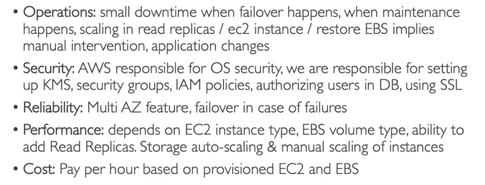

---

#### Aurora

- DB proprietário da AWS.
- 5 vezes mais performatico que o **mysql.**
- 3 vezes mais performatico que o **postgres**.
- Serviço de escopo regional, porém é possível usar em multi regiões podendo criar uma instalação o global, mas o que será uma **master** numa região e replicas de leituras nas outras.
- **Faz replicação (6 copias) em 3 AZ.**
- **Pode se adicionar até 15 replica de leituras, para melhorar o uso.**
- Tem a opção serveless, não se preocupando com gerenciamento.
- **Cresce de 10GB em 10GB podendo chegar até 128TB de dados.**
- Tem uma funcionalidade chamada encaminhamento de escrita, que permite que uma replica de leitura receba uma requisição de escrita e encaminhe para o node de escrita, e via replicação o dado e inserido ou atualizado na replica de leitura.
- 20% mais barato que o RDS comum.
- 
- 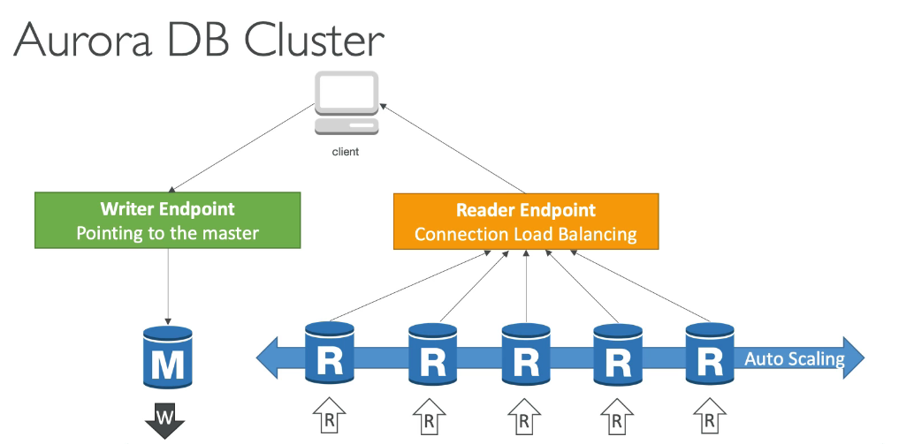

##### Auroral - well architected


##### Conceitos avançados aurora


###### Aurora Replica - auto scaling


###### Custom endpoints


###### Serveless

- Scala automaticamente o banco de acordo com o uso.
- Bom para carga de trabalho que não são muito frequente.
- Não e necessário planejar, pois ele auto escala para atender a demanda.
- Pago por segundo de uso.
  

###### Multi Master

- Caso queira alta disponibilidade, nesse caso caso haja falha, todos os nós de leitura passa a escrever também.
- 

###### Global aurora

- **Cross region read** replica - útil para desastre **recover** .
- Global database
  - Se tem 1 região primaria (read/write) e 5 outras regiões segundarias, com replicação de menor que 1 segundo.
  - há 16 replicas de leitura por região segundaria.
  - Caso de desastre, promove-se outra região como primaria em menos de 1 minuto.
  - 

###### Marchine Learning

- Aurora permite usar **marchine learning** nos dados através de interação com os serviços **Amazon SageMaker** e **Amazon comprehand**.
- Não há necessidade de ter experiência em **marchine learning** para usar essa funcionalidade.
- Caso de uso:
  - Deteção de fraude, propaganda localizada, recomendação de produtos.
    

#### Backups

- São habilitado automaticamente no RDS.
- São realizados automaticamente.
  - Backup diário.
  - Logs de transações são feito backup a cada 5 minutos, o que permite que seja restaurado a qualquer ponto de 5 em 5 minutos.
- Tem uma retenção default de **7** dias, que pode ser estendido para **35** dias.
- Também é possível realizar snapshot do banco **(db snapshot)**.
  - Isso permite uma maior tempo de retenção.

#### Storage auto scale

Quando se cria um banco no RDS se passa quando ele deve ter, com essa funcionalidade ele aumenta o tamanho da banco ao se aproximar de limite de uso do espaço.

- Ajuda a aumentar o armazenamento dinamicamente. Quando detetado que esta próximo do limite.
- Necessário setar um _threshold_ de limite máximo de alocação de armazenamento.
- Automaticamente modifica o armazenamento se:
  - Tiver menos que **10%** de armazenamento alocado.

#### Read replicas

- Ajuda a escalar na leitura dos dados do banco.
- Podem ser criada em:
  - Na mesma **AZ** onde esta o banco..
  - Em outra **AZ**.
  - Em outra **Região**.
- Após criado, é realizado replicação dos dados de forma assíncrona **( por isso a consistência eventual)**

##### Caso de uso

- Imagine que se tenha uma aplicação em produção que armazena informação num banco, ai surgi outra aplicação que gera relatório, e que ler varia tabelas, nesse cenário se cria uma replica só de leitura para essa nova aplicação
  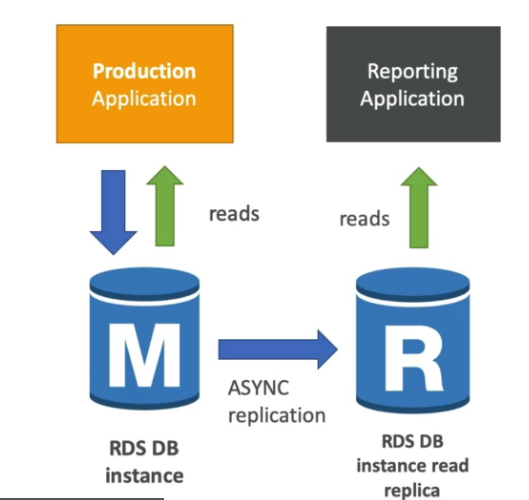

##### Precificação

- Custo de rede (replicação).
  - Não há se a replica estiver na mesma região.
  - Caso seja em regiões diferentes há um custo adicional de transferência
    

#### Multi AZ (disastre recover)

- E criado uma replica do banco de dados em outra **AZ**, e os dados são sincronizados.
- E gerado um único **DNS name** para apontar para o banco tido com "master".
- Caso falha ele auto eleva o outro para "**master**" e não e necessário intervenção manual.
- Não é usado para escalar, apenas como medida de **disastre recover.**
- Caso já tenha um banco que seja **Single AZ** e queira converte-lo para **multi AZ**, será criado por debaixo dos panos um snapshot do banco, que será restaurado no novo banco em outra AZ, e então iniciara o processo de sincronização entre os bancos.
  

#### Encryption

- Para encriptação em repouso.
  - Tanto do **master** quanto das replicas de leitura com **AWS KMS - AES-256**.
  - Define a encriptação durante a criação, se o **master** não for encriptado as **replicas de leitura** não poderão ser.
  - Para Oracle e SQL Server há o **TDE** (Trasparent Data Encryption) que é outra maneira de fazer a encriptação do banco.
- Para encriptação de a bordo (in-flight / durante as transferência).
  - Pode se usar certificados SSL para realizar a encriptação.

#### Autenticação

- Pode ser feita usando usuário e senha.
- Para os bancos postgres, aurora e mysql, há a opção de **IAM Autetication** que gera um token para se acessar o banco.
  - Centraliza os usuários, controla acesso via roles.
  - Todo o tráfego seria feito usando SSL.
    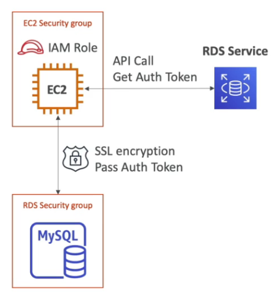

---

## Service Communication

### AWS Step Functions


- Permite criar uma **workflow** para orquestrar **Lambdas functions**.
- O Fluxo (flow) é representado o com **maquina de estado Json.**
- Pode configurar para executar Lambda sequencialmente, paralelas, com condições, e timeouts ..
- O workflow pode ser executado por no máximo 1 ano, após isso é necessário aprovar por mais 1 ano.
- Pode se integrar com:
  
- Pode ser acionado via:
  
- Tipos
  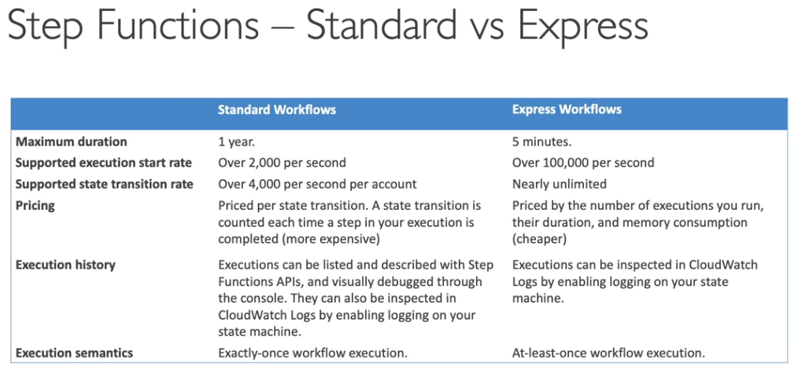


- Exemplo de arquitetura
  

---

### Amazon SQS


- Amazon Simple Queue Service.
- Tem escopo regional. Gerenciado pela AWS.
- `Produtor -> **envia** > fila < **recupera** <- consumidor`
- O consumidor da um **pull** na fila para recupera a mensagem.
  - Pode receber até 10 mensagem por vez.
  - O consumidor deve deletar a mensagem, pois não há um delete após a leitura.
- Auto escalável vai de 1 mensagem por segundo a 10000 por segundo.
- Retém as mensagem de 4 (mínimo) a 14 (máximo) dias.
- Não há limites de quantidade de mensagens na fila.
- Mensagem de até 254Kb de tamanho, é possível usar o S3 para guardar mensagem maiores.
- Possível usar métrica da **SQS** para dispara o **Auto Scaling Group** via CloudWatch metrics (**approximateNumerofMensages**).
  - Isso serve para escalar os consumidores.
- **Política de acesso**.
  
  - Permite definir uma politica de quem pode enviar mensagens e consumir da fila.
  - Usada para dar acesso de cosumer cross account.
  - Pode ser usada para permitir um producer ser os eventos do S3.
- Pode ser consumida por um Lambda com as mensagens em Batch.
- **Encriptação**
  - Em transito vem habilitado por padrão (HTTPS).
  - Do lado do servidor, usa a SQS Key (SSE-SQS), mas é possivel usar uma chave criada no KMS (SSE-KMS).
- **Message visibility timeout**
  - Quando uma mensagem é recuperado por um consumidor, ela fica invisível para os outros, esse tempo que invisibilidade é definido por esse campo.
  - O valor default e 30 segundos.
  - Caso seja necessário (por ainda esta em processamento) é possível mudar essa visibilidade via API (**ChangeMensageVisibility**) do SDK.
- **Delay Queues** - Permite definir uma atraso na **disponibilização** da mensagem para **leitura**.
  - Default é 0 segundos. Mas na criação da fila pode se definir um novo default para a fila.
- **Dead letter queue**
  - Fila onde pode ser enviada mensagens não processada, ou processadas com erro por várias vezes. Exemplo a mensagem foi processada 5 vezes sem sucesso, mova ela para **DLQ** para debug futuro.
  - Para que seja enviada para a DLQ é necessário setar o threshold **maximumReceives**, que define quantas vezes a mensagem será disponibilizada para processamento. Quando atigir esse threshold ela será movida para a DLQ.
  - Usado para debug de problemas, onde se pode colocar uma alarme que notifica a ocorrência de problemas.
  - Uma DLQ deve respeitar o tipo da fila, ou seja se for uma fila FIFO a DLQ deve ser uma fila FIFO.
  - Possui uma funcionalidade chamada **Redrive to source** que permite reenviar as mensagem contida em uma DLQ para a fila de processamento. É usada quando de descobriu o motivo do não processamento e ajustou o código e deseja tentar processar as mensagens na DLQ.
- **Request-Response System**
  - Ao postar na fila, é informado um correlationID e a fila de retorno da reposta. Assim que for processar a mensagem devolver o resultado na fila de retorno.
  - 

#### SQS x SNS x Kinesis

- Apesar se serem serviços de mensageira, há diferenças sobre o funcionamento deles.
  

---

### AWS MQ

- Permite usa mensageira com os protocolos tradicionais do mercado MQTT, AMQP, STOMP, WSS, Opemwire na AWS.
- E um serviço referênciado pela AWS para rodar RabbitMQ e ActiveMQ.
- Não escala como o SQS ou SNS.
- **Pode ser usado numa configuração de Multi-AZ para failover.**
- Usado para migra soluções criadas nessa plataforma

---

### Amazon SNS

- Simple Notification Service.
- Tem escopo regional. Gerenciado pela AWS.
- Produtor -> **envia** > topico -> **envia** > assinante (pub/sub pattern).
- O tópico da **push** na mensagem para os assinantes.
- Usado quando se precisa notificar varios sistemas.
- **Cada tópico pode ter mais 12 milhões de assinantes.**
- **Limite de 100000 tópicos. (soft Limit)**
- Não retém mensagens, após notificar o assinante é descartada.
- **Assinantes (http, email, lambda, mobile, kinesis data firehose).**
- Caso garantir a ordem de entrega use a SQS FIFO.
  - Serve para ordenar as mensagens.
  - Usado para Deduplicação de mensagem
- **Politica de acesso**.
  - Permite definir uma política de quem pode enviar mensagens para o tópico.
  - Semelhande a do SQS.
- **Encriptação**
  - Em transito vem habilitado por padrão (HTTPS).
  - Do lado do servidor, usa a SQS Key (SSE-SNS), mas é possivel usar uma chave criada no KMS (SSE-KMS).
- **SNS + SQS - Fan Out pattern**
  - A ideia é usar um tópico SNS na frente de **N** fila para garantir que aquela mensagem possa se processado por **N** sistema, seja para evitar perda de dados ou por causas de serviços que só permitem notificar um único tópico (ex: **S3 events**).
  - Pode usar em várias regiões.
    
  - **Message Filtering** - permite filtrar as mensagem e notificar os assinantes de acordo com os filtros.
    - Uma json policy para filtragem.
      
- Tem integração com o **Kinessis data firehose.**
  
- **Retry**
  - Caso o subscrito do tópico esteja fora há um processo de retry definido via policy.
  - Caso não seja um serviço AWS, tem que se configurar uma política de retry.
    
  - Em ultimo caso pode se uma uma DLQ.
    - E adicionado junto a subscrição
      

---

## Data Engineering

### AWS Kinesis


- Facilita coletar e processar e analisar fluxos (**steams**) de dados em tempo real.
- Opção ao **kafka** da AWS. Ou seja serviço de stream de dados em tempo real.
- Bom para Logs, metricas e IOT. Bom para projetos de tempo real com bigdata (uso com SPARK, NiFi).
- **Dados são sincronizados em 3 AZ.**
- Tem um produtor > enviar um **record** > **kinesis data stream** > repassa o **record** > ao consumidores.
- A ordenação dos dados pode ser feita passando a mesma chave de partição, pois assim os dados serão enviado para o mesmo **shard**.
  
- Tipo de aplicação
  - **Kinesis Data streams** - Captura, processa e armazena fluxos de dados.
  - **Kinesis Data Firehose** - Carrega dados para armazenamentos no AWS.
  - **Kiness Data Analytics** - Analisa fluxos de dados com SQL e Apache Flink.
  - **Kinesis vídeo streams** - Capture, processa e guardar fluxo de dados de vídeos.

#### Kinesis Data streams

- Captura, processa e armazena fluxos de dados.
- Usado para ingestão de grande quantidade de dados com baixa latência.
  
- É cobrado por **shard** provisionados.
- Cada fragmento (**shard** semelhante as partições do kafka) permite entrada de 1 MB/s e saída de dados de 2 MB/s.
- Tem um período de retenção de 1 (padrão) a **365** dia.
- Multipos consumers pode ler do mesmo **Shard**.
- Os dados não podem ser deletados (são imutáveis).
- **Consumers**
  - Kinesis client library (KCL, usado para leitura em paralelo, checkpoint e leitura coordenada)
  - AWS SDK. Lambda
- **Producer**
  - Lambda, Kinesis data firehose, kinesis data analytics.
  - **AWS SDK , Kinesis Producer Libary (KPL - permite usar batch, compressão, retry)**
  - Kinesis Agent - Usado para monitorar logs, e enviá-los ao Kinesis Data Streams ou Kinesis Firehose.
- Pode ser usado como **Streaming ETL** que permitem que você limpe, aprimore, organize e transforme dados brutos antes de carregar seu data lake ou data warehouse em tempo real.
- Modos de operação
  - **Sobe demanda** - Não é necessário planejar. o Kinesis escala de acordo com a demanda.
    - Se pagar shard provisionado por hora.
  - **Provisionado** - Se define a quantidade de shards e gerencia para atender a demanda.
    - Nesse se paga por hora de stream e por I/O por GB.
- O **Shards** podem ser consumidos em modo **batch** ou **mensagem por mensagem**.
- Limites
  - 

---

#### Kinesis Data Firehose

- Carrega dados para armazenamentos no AWS (Como S3, ReadShift, OpenSearch e Splunk).
  
- Serviço totalmente gerenciado pela AWS (Auto Scale, Serveless).
- Pague apenas pelos dados processados.
- Serviço próximo do **tempo real.**
  - Próximo devido a uma escolha de uso de buffer para melhorar o processo de armazenamento.
  - Pois os dados são acumulados num buffer e são inserido via batch.
  - O tamanho do buffer varia em tempo ou tamanho.
    - **Caso seja tamanho ao alcançar o tamanho ou tempo limpa o buffer e ele insere,e aguarda um novo preenchimento.**
    - Ele automaticamente aumenta o tamanho do buffer ou o tempo de acordo com a demanda.
  - **Caso precise de algo em tempo real use o Lambda para realizar a operação.**
- Exemplo do processo de entrega
  
- Diferença entre Data Stream e o Firehose.
  

---

#### Kinesis Data Analytics

- Analisa fluxos de dados com SQL e Apache Flink.
  
- Executa os processos em tempo real.
- Totalmente gerenciado pela AWS.
- Pagos por **volume** de dados consumidos.
- Permite criar fluxo consulta em tempo real.
- Permite usar Lambda para pre-processar os dados.
- Tem um Schema discovery.
- Usa o IAM para acessar o origem e o destino dos dados processado.
- Uso:
  - Analise de período de tempo.
  - Dashboard em tempo real.
  - Métricas em tempo real.

---

#### Arquiteturas com Streams (Kinesis)

- Pipeline em tempo real
  
- Soluções em tempo real com melhor custo
  
- Comparação com outras soluções
  

---

### MSK


- Kafka manager service, serviço de kafka da AWS.
- Alternativa ao Kineses.
- Dados são armazenados nos EBS, por quanto tempo o cliente quiser.
- Permite implantar o cluster nas VPC ou em **Multi AZs (3 para HPA)**
- Tem a opção de ser serveless, não sendo necessário provisionar um cluster.
- Os consumer podem ser:
  - Aplicação que lê do topico.
  - Kinesis Data Analytics.
  - AWS Glue.
  - Lambdas.
- Diferença entre MSK e Kinesis
  

---

### AWS Batch

- **Permite batch job como imagens docker.**
- **Paga pelos recursos usados** (Ec2, Fargate, Spot).
- Há duas opções:
  - Rodar usando o fargate (Não há necessidade de um cluster).
  - Rodar usando um instância provisionada (EC2 e Spot) na VPC.
    
- Caso de usos:
  - **Processamento de imagens em lote, Execução de jobs concorrents.**
- **Pode se usar o EventBrigde para agendar a execução.**
- Pode ser acionado usando **Step Funtions.**
- Caso precise executar com alta performance (HPA) pode se usar o modo Multi Node
  - Disponibiliza várias instâncias para execução dos Jobs.
  - **Não é possível usar instâncias spot.**
  - Trabalha bem com Placement Group.
- Diferença entre Batch e Lambda
  
- Soluções de arquitetura
  - Criação de Tumbmails
    

---

### EMR

- Elastic MapReduce.
- Ajuda a criar clusters **Hadoop (Big data), para analise de grande quantidade de dados.**
- Pode ser construido em cima de centenas de instâncias EC2.
- **Suporta Apache Spark, HBase, Presto, Flink.**
- Usa **Spot Instances** para **Auto Scale** (que reduz os custos).
- Uso: Big Data, Marchine Learning e Web Indexing.
- **Usando em Single AZ.**
  - **Para se ter a melhor performance, devido não ter transferência de dados entre AZ.**
- Usa EBS do tipo **HDFS (Hadoop FileSystem)** para arquivos temporários.
- Caso precise de armazenamento de longo prazo, **pode se usar o S3 (EMRFS)** que tem uma integração nativa.
- Integrações:
  - **S3**
  - **DynamoDB**
- Tipos de nodes e preços
  
- Configuração das instâncias
  - **Uniforme Instance Group**
    - Seleciona um único tipo de instância (ou on demand ou spot) para rodar os tipos de nodes.
    - Tem Auto Scale
  - **Instance Fleet**
    - Se define a quantidade e tipo de cada node, podendo distribuir entre on-demand ou instância Spot.
    - Não tem Auto Scale

---

### Executando Jobs na AWS

- As soluções são várias de variam de acordo com a demanda.
  - 1 - Bom para longas execuções, mas não escala, há necessidade de gerenciamento de infraestrutura.
  - 2 - Escala bem, porém tem as limitações do Lambda (tempo de execução).
  - 3 - Reativo a diversos tipos de eventos, porém tem as limitações do Lambda (tempo de execução).
  - 4 - Bom para jobs longos um custo maior e é mais complexo de implementar.
  - 5 - Bom para jobs longos, não há necessidade de gerenciamento de infraestrutura.
  - 6 - Bom para execução de dados para BigData.
    

---

### AWS Glue

- Serviço gerenciado de **ETL** (extract, tranform, and Load).
- Serviço **Serverless**, possui 3 serviços:
  - **AWS Crawler** - Os rastreadores (Crawler) e classificadores examinam dados de fontes diferentes, classificam dados, detectam informações de esquema e armazenam meta-dados automaticamente no **AWS Glue Data Catalog.**
  - **AWS ETL ** - O núcleo do programa ETL fornece geração de código Python ou Scala para limpeza, enriquecimento, remoção de duplicatas e outras tarefas complexas de transformação de dados.
  - **AWS Glue Data Catalog** - fornece armazenamento centralizado e uniforme de meta-dados para rastreamento, consulta e transformação de dados usando meta-dados salvos.
- Permite extrair dados do **S3** ou **RBDMS** e transformar e enviar para o **RedShift**.
  
- Pode ser usado com **Athena**, **Redshift**, **EMR** para se criar um catalogo de dados
  (dataSet) reutilizável (GLUE Data catalog).
  

---

### Redshift

- Banco para Data warehouse.
- Baseado no **Postgres**, mas não e usado para OLTP (online transation processing) e sim para OLAP (online analytical processing).
- Envia-se os dados em escala (de hora em hora) para data **warehouse**.
- **10x** melhor que outros **OLAP**, e escala para PBs (Penta bytes) de dados.
- Baseado em colunas e permite **execução massiva de consultas paralelas (MPP).**
- Pague pelo que usa, baseado em instâncias provisionadas.
- Tem uma interface SQL pra escrita de querys.
- Pode se integra com o **AWS Quicksight** or **Tableau** para tarefas de BI.
- **Redshit Workload Management (WLM)**
  - Permite criar múltiplas filas para tratar as execuções de carga de trabalho (fila super usuário, fila de trabalho curtos, fila de trabalhos longos).
  - Isso garante que um trabalho rápido não fique preso a um trabalho longo.
  - Pode ser feito de forma manual, ou automática pelo RedShift
- Como é um cluster provisionado para executar a carga de trabalho, caso tenha consulta apenas exporadicas, o ideial seria usar o **Athena**. Pois esse é usando para consultas massivas e em grandes quantidades.
- Os dados podem ser carregados do S3, Do **DynamoDB** ou de qualquer banco via **DMS** (data migration service) ou via **Kinesis firehose**.
  
- Pode escalar de **1 nó até 128** nós com cada nó tendo até **16 TB** de espaço.
- Há dois tipos de nós:
  - **Nó líder** - usado para o planejamento da queries e agregação dos resultados.
  - **Nó de computação** - Responsável por executar as queries e enviar o resultado ao líder.
- Tem uma funcionado chamada **Sprectrum** que permite executar a queries direto no **S3**, sem precisar carregar os dados para o **RedShift**.
  
- **Redshift Enhanced VPC Routing** - permite copiar e carregar dados através de uma VPC sem passar pela internet.
- Não é multi **AZ**, cada nó fica numa **AZ**, por isso para ter recuperação de desastres é feito **Snapshots**. incrementais que são internamente armazenados no S3.
  - Permite usar múltiplos Nodes com Multi-AZ mas para alguns tipos de Cluster apenas.
- Os Snapshots são feitos automaticamente de a cada **8 horas** ou a cada **5GB** ou podem ser agendados. Mas é possível realizar manualmente.
  
- Caso o snapshot seja cripografado, é necessário copiar a chave KMS para o novo cluster.
  

#### Well architected


---

### DocumentDB

- Implementação da AWS para o MongoDB.
- Conceitos de deploy similar ao Aurora.
- Totalmente gerenciado pela AWS e Replicado em 3 AZs.
- Armazenamento cresce de 10 GB em 10 GB.
- Escala automaticamente para milhões de requisições por segundo.
- Preço
  

---

### Amazon Timestream

- Serviço de banco de dados **de Time Series (serie temporais).**
- Totalmente gerenciado pela AWS, rápido, escalavel e serveless.
- Permite armazenar e analisar trilhões de dados por dia.
- **1000 vezes mais rapido e 1/10 mas baratos que banco relacionais.**
- Tem compatibilidade com o SQL.
- Dados recentes são armazenados em memória e depois enviado para armazenamento permanente em um armazenamento mais barato.
- Permite criar funções de analise de series temporais.
- Tem criptografia em transito e em repouso.
- Uso:
  - Dados de IOT,
  - Analise em tempo real.
    

---

### AWS Athena


- Serviço **Serverless**, que permite realizar analises em arquivos no S3.
- Usa **SQL** para fazer queries nos arquivos.
- Tem conetores **JDBC** e **ODBC** para conectar aplicativos de BI.
- Suportar CVS, JSON, ORC, Avro, Parquet...
- **Cobrado por uso, queries executadas e mede de dados escaneados.**
  - **5$ por TB de dados escaneados.**
- Pode ser usado em BI, Analitics, relatórios e analises de VPC Flow Logs, ELB Log ..
- Ideal para queries rápidas ad hoc e se integrar com o AWS **QuickSight** para facilidade de visualização, ele também consegue lidar com análise complexa, inclusive grandes junções, funções de janela e arrays.
- **Usa o [Presto](https://aws.amazon.com/pt/big-data/what-is-presto/) com suporte completo a SQL padrão.**
- Permite executar querys em outros serviços de armazenamento (DBs) usando as Queries federadas através de uma lambda, depois pode se armazenar os dados no S3.
  
- **well architected**
  
- Melhorando a performance
  

---

### AWS QuickSight

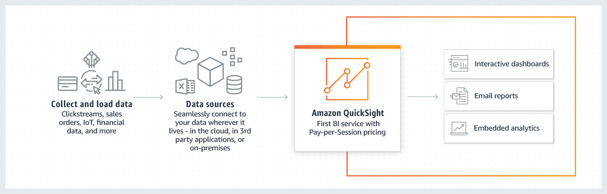

- Serviço de inteligência comercial (BI) promovido por **machine learning, escalável, sem servidor, incorporável, construído para a nuvem.**
- Permite que você crie e publique facilmente painéis interativos que incluem o **Insights de Machine Learning.**
- **Pago por Sessão.**
- Acesso pode ser feito via Usuários ou Grupos, que não precisam existir no IAM.
- **É baseado no “SPICE”, um mecanismo de cálculo super-rápido e paralelo na memória.**
- **Permite configura o CLS (Column-level security) que bloqueia certa colunas para certos usuarios.**
- Conecta se a :
  - Aurora, RDS, Athena, S3.
    

---

### Pipelines para trabalhar com dados

- Analise de dados
  
- Ingestão de dados Big Data
  
- Comparação de tecnologias
  

---

## Monitoring

### AWS CloudWatch

#### Logs
- Coleta métricas e **logs** de tudo no AWS. Também é possível enviar logs através do:
  - SDK, Cloud Watch Logs Agent, Cloud Watch Unified Agent.
  - Elastick Beanstalk, ECS, Lambda, VPC Flow Logs, API Gateway, CloudTrail
  - Cloud Watch Logs Agent só pode ser instalado no EC2
  - Route53 - Logs de queries DNS
- Pode ser **exportado** para o S3 ou feito um stream para o **OpenSearch** para analises futuras.
- **LogGroup** - Agrupamento de logs, pode ser por exemplo, todos os logs de uma aplicação.
- **LogStream** - Fluxo de logs de um recurso.
- Pode ser definido um período de retenção de logs, e configurado um batch de exportação para o S3.
- Permite usar criptografia KMS nos logs.
- Pode-se ter um **tail** dos logs do **Cloud Watch** via CLI.
- Pode enviar os logs para:
  - Kinesis Data Streams
  - Kinesis firehose
  - Lambda
  - OpenSearch
  - S3 (export)
    - Só pode criptografar os logs com **AES-256 (SSE-S3), não pode SS3-KMS.**
    - Pode levar até 12 horas para exportar.
    - Não é automático, precisa configurar ou usar a API call **CreatExportTask**.
- Subscrição de logs:
  
- A possibilidade de agregar logs de várias regiões.
  
- A maioria dos problema que se da aqui e por causa de permissões configuradas errado.
- Permite aplicar filtros através de expressões regulares ou métricas ou IPs. E com isso dispara alarmes.
- Por padrão nenhum log e enviado das instâncias EC2, caso queira ter os logs é necessária habilitar o **CloudWatch Agent** e isso fará que o **CloudWatch unified Agent** nas instâncias envie os logs.
  - Para isso precisa ter uma police que der permissão para enviar logs.
  

---

#### Metricas

- São coletadas de todos os serviços da AWS, São úteis para automatizar ações de acordo com status da métrica.
  - **Métricas** ->> thresholds ->> actions.
- Criar alarmes de acordo com as métricas.
- E com esses alarmes criar ações (posta numa fila do **SNS** ou acionar o **Auto Scale**)
- Existem métricas **default com tempos pré definidos (a cada 5 minutos)**, mas se necessário e por um custo adicional é possível adicionar novas métricas detalhadas e alterar o tempo de coleta.
- o Free Tier disponibiliza até **10 métricas detalhadas.**
  
- Para criar uma métrica customizada, e só usar a API **putMetricaData** no sdk/cli.
  - Também é possível definir a resolução da métrica ( "tempo de coleta") sendo:
    - **Standard** - 1 minuto.
    - **High Resolution** - 1|5|10|30 segundos - mas tem um alto custo.
  - Permite enviar métrica antigas (ate duas semanas) e métricas futuras até 2 horas sem que o **Cloud Watch** reclame.
- O uso de memória não é monitorada por default, caso queira e preciso usar métricas customizada.

---

#### Alarmes

- Permite definir alarmes para qualquer métrica.
- tem 3 status:
  - OK , INSUFICIENTE_DATA, ALARM.
- Os alarmes podem ser disparados através de métricas e filtros.
- Muito usado em conjunto com Ec2, para auto scale e monitorar saúde.
- Tem os 3 targets **EC2, EC2 Auto Scaling**, SNS (permite enviar para os outros).
- Pode enviar dados para o **eventBrigde** para conectar ao outros serviços.

---

#### Dashboards

- Com as métricas é possível criar Dashboards, para facilitar a visualização.
- Os Dashboards são **globais**.
- Neles é possível incluir gráficos de diferentes **contas AWS e regiões.**
- É possível compartilhar um Dashboard com um terceiro via **cognito**.
- até 3 Dashboards são de graça, e demais se paga $3 dólares por mês por Dashboard.  

### Synthetics Canary
  - Robo que fica verificando a saúde de API e caso encontre problema pode ajustar o ALB ou DNS para redirecionar o tráfego.
  - Permite configurar scripts (nodeJs e Python) para monitorar APIs e URLs, WebSites.
    - Pode agendar a execução da de única vez ou de tempos em tempos.
    - Permite acessos a recursos do Google Chrome.
  - Serve para achar problemas antes de os clientes achem (teste de API).
  - Checa a latência e saúde, da para fazer teste armazenando dados e prints da UI.
  

---

#### Eventos

Permite criar eventos, ous seja ações predefinidas ou agendadas que podem disparar alguns serviços AWS (regras que define ações).

- Padrão de evento - intercepta eventos dos serviços AWS, tipo quando o status estiver pendente.
  - EC2 start, codeBuild Failure, S3
- Permite criar crons e eventos agendados.
- Gera json de evento, que pode ser enviado para um target **SNS**, **SQS** ...

---

#### **EventBridge** - (ponte de eventos)


- Permite criar uma canal que vai receber eventos (**event bus**) e criar regras para tratar esse eventos postados nesse canal.
- Permite agendar eventos.
- É possivel definir uma **estrutura para o evento** (schema , tipo avro), ou usar algum que já existe, com ele é possivel definir o formato do evento que vai ser diparado por um SDK.
- A mesma coisa que o **Eventos** com adicional de que :
  - Permite criar um **event bus (Partner)** para algums **SAAS** envie eventos a **AWS** (Datadog, zendesk).
  - Permite criar um event bus (Custom) para receber eventos da sua aplicação.
  - Permite arquivar os eventos para futuras analises.
- Para acessar esse **Buses precisar ter uma política baseada em recurso.**
  - Permitindo até a agregação desses eventos em uma **única conta.**
- Vai substituir os eventos.

---

### X-Ray

- Permite analisar a aplicação visualmente, serviço de tracing distribuido da AWS.
- integra se com:
  - EC2, ECS, Lambda, BeanStalk, Api Gateway.

---

### Personal Health Dashboard

- Serviço global que mostras os eventos de manutenção da AWS.
- Pode mostrar os eventos que podem impactar a sua operação.
- Lista conjunto de ações para remediação caso tenha algum item fora ou em manutenção.
- Pode ser acessada via API.
- Pode se agregar os eventos caso tenha uma organização.
- Pode se usar o EventBridge para reagir aos eventos de manutenção, para notificação ou para tomar alguma ação.
  

---

## Deployment and Instance Management

### AWS Elastic Beanstalk


- Feito para o desenvolvedor, permite ter uma visão centralizada do ambiente de deployado.
- Usados para aplicações web, ex: cria toda infraestrutura e só precisa passar o pacote que será usando. ex. (war para o tomcat) .
- Usa todos os componentes do AWS (ec2, S3 ..).
- Seria uma PAAS (semelhante ao Heroku).
- O serviço do Beanstalk é gratis, o uso dele não é cobrado, apenas os **componentes usados serão cobrados.**
- Solução para migrar aplicações, sem se preocupar com a infraestrutura.
- É totalmente gerenciado pela AWS.
- Usa como base o CouldFormation para criar os recursos.
- **Componetes**
  - **Aplicação** - Aplicação em si.
  - **Versão da aplicação** - define a versão da aplicação.
  - **Ambiente** - Ambiente onde a aplicação pode ser disponibiliza.
    - Há dois tier de aplicações
      - **Web tier** - usa uma balanciador de cargas.
      - **Worker tier** - usa filas, e workes para processar a carga de trabalho.
    - Há duas formas de deploy
      - **Single instânce** - Boa para ambiente em dev
      - **hige Availibity** - Boa para ambientes de produção
      
- Tipos de tier

- Forma de deploy

- Exemplo de arquitetura
  

---

### Code Deploy

- Usado para realizar deploy de EC2, ECS, Lambda.
- Pode deployar segundo as estratégias
  - **in-place** -> mata o antigo e coloca o novo (somente disponível para EC2).
  - **blue / green** -> criar um novo recurso e roteia os dados em parte.
    - Este por usa vez usa o **Traffic Shifted** podendo ser:
      - **Canary** - divide o tráfego entre as duas versões em percentagem até chegar os 100% da novar versão.
      - **Linear** - divide o tráfego entre as duas versões igualmente.
      - **All-at-once** - envia todo o tráfego um para uma ou para outra.
- EC2
  - Usa o **AppSpec.yml** (definição da aplicação) + estratégia de deploy.
  - O Code deploy atualiza (in place) as instâncias de acordo com a estratégia de deploy.
  - Pode se configurar **Hooks para validade como foi o processo de deploy**
    
- ASG
  - há dois tipos de deploy
    - **in place** - Substitui parte dos das instância de acordo estratégia de deploy.
    - **blue - greem** - Criar um novo scale group com as novas instância e usa o ELB para controlar o tráfego. Após um tempo o antigo ASG é removido.
- Lambda
  - Code deploy criar uma nova versão do lambda.
  - Executa uma Lambda de teste (**Pre-Traffic)** para validar a nova versão.
  - Usa o **Traffic Shifting** para distribuir o tráfego entre as versões deployadas.
  - Usa o Cloud Watch Alarms para fazer rollback caso necessário.
  - Caso esteja OK, redireciona todo o tráfego para a nova versão e executa uma Lambda de teste **(Post Traffic)** para validar se o tráfego esta OK.
    
    
  - **SAM Framework usa nativamente o code deploy.**
- ECS
  
- Após o traffic shifting dinalizado e estando OK, o tasks da versão anteriores são encerradas.
  
  

---

### AWS CloudFormation


- Permite criar qualquer recurso da AWS via código (95%).
- Usado para criar infraestrutura como código (IAAC).
- Usa Yaml ou json para declarar os recursos.
- Ele mesmo se resolve sob a ordem de criação dos recursos.
- Taggea de forma uniforme os recursos criados.
- Usando é possível ter uma estimativa de custo da estrutura que se vai criar.
- Habilidade de se **criar infraestrutura em muitos contas, regiões,** ambientes com o arquivos do template (StackSets). Permite criar infraestrutura globalmente.
- Permite criar **Recursos customizados usando Lambda**, o CF chama a Lambda e ele cria/ deleta/ atualiza. **Usado para criar recurso que a CF não da suporte** (criar infra no on-premises, limpar buckets).
- É a base para:
  - **BeanStalk**
  - **Service Catalog**
  - SAM (Service application Model) Framework
- Permite configura uma política de preservar alguns recurso, quando deletado. sendo dos tipos:
  - **DeletionPolice=Retain**
    - Permite especificar recursos para preservar / realizar backups em caso de delete.
  - **DeletePolice=snapshot**
    - Permite configurar parar criar um snapshot quando deletar.
    - usado com **EBS, ElasticCach cluster, ElasticCache ReplicationGroup,**
    - RDS (instância, cluster )
    - **RedShift**
  - DeletePolice=delete (default)
    - Para custer **RDS o default é a police DeletePolice=snapshot.**
    - Para deletar o **S3, ele precisa esta vazio.**

---

### AWS Service Catalog

- Crie e gerencie catálogos de serviços de TI aprovados para uso na AWS.
- Na pratica permite que numa organização se controle quais serviços da AWS, possam ser usados pelas contas.
- Ajuda na governança e compliance.
- Os administradores define os templates dos produtos utilizando CloudFormation e montam um portfólio de produtos que são controlados via Policy IAM.
- Os usuários usam esses templates (produtos) e provisionam

---

### SAM - Serveless aplication model

- Framework para desenvolvimento e deploy de aplicações serveless.
- Configurações são escritas em YAML.
- Com ele pode se criar:
  - Lambdas, DynamoDB Tables, Api Gateway.
- Permite roda os itens acima localmente, o que facilita durante a fase de desenvolvimento.
- Permite via **CodeDeploy** realizar o deploy de Lambdas usando **Traffic Shifting.**
- Usa o **CloudFormation** por debaixo dos panos.
- Arquitetura com SAM.
  

---

### CDK


---

### AWS Systems Manager


- Permite criar grupos de recursos para facilitar a visualização de dados operacionais.
  - Pode se executar comandos (scripts nesse grupos).
- Permite gerenciar **EC2 e on-premises em escala.**
- Permite detectar problemas de infraestrutura
- Permite automatizar **patchs de atualizações.**
- Permite conectar as maquinas vias **SSM Session Manager.**
  - Nesse caso não é necessário **SSH, Bastion Hosts e Chaves SSH.**
  - É Usado para conectar instâncias via **console AWS.**
  - Envia para o **CloudTrail dados das sessões.**
    
- Trabalha com mac, Windows e Linux e não precisa de SSH.
- Integrado com Cloud Watch metricas e dashboards. IAM e CloudTrail.
- É de graça
- Para usar é só instalar o **agente SSM na instância, ou VM.**
  - Necessário **criar uma role para que o agente tem acesso ao SSM.**
- Patchs
  

---

### Cloud Map


- Serviço gerenciado pela AWS de **descoberta de serviços.**
- Cria se um **map de serviços e recursos e se conecta o front end ao Cloud Map.**
- Tem **healhcheck e é integrado com o Route53.**
- Pode se usar SDK, API or DNS para realizar querys no Cloud Map

---

## Cost Control

### TAGs


#### Cost Allocation Tags

- Com tags podemos realizar o **tracking** dos recursos.
- Com **Cost Allocation Tags** podemos habilidar relatorios detalhados de custo.
- As tags podem ser adicionadas como colunas nos relatorios.
- há dois tipos de tags
  - **AWS Generated**
    - Adicionada aos recursos automaticamente uma vez que esteja habilitada.
    - Inicia com o prefixo AWS: (ex AWS:CreateBy)
  - **User Tags**
    - Definidas pelo usuario
    - Inicia com o prefixo user: .
- Esses tags aparecem apenas no **Billing Console.**
- Após criada uma nova tags e adicionado ao recurso leva **24 horas** para aparecer no console.

---

#### Tag Editor

- Serve para gerenciar as tags de multipos recursos em um só lugar.
- Permite **adicionar , remover e atualizar tags.**
- Permite procurar **recursos taggeados e não taggeados** em **todas a regiões.**

---

### Calculadora de preços da AWS

- É uma ferramenta online gratuita que ajuda a estimar o custo mensal dos serviços da AWS.
- Ela permite que os usuários calculem o custo de diferentes combinações de serviços da AWS com base em suas necessidades específicas.
- útil para ajudar as empresas a planejar e gerenciar seus orçamentos de TI, bem como para avaliar diferentes cenários de implantação para seus aplicativos e serviços na nuvem da AWS.

---

### AWS Trusted Advisor

- Traz uma análise em **tempo real dos serviços** baseados nas boas práticas AWS.
- Fornece orientação que ajuda a **reduzir custos e aumentar o desempenho e melhorar a**
  **segurança.**
- Analisa e gera recomendações sobre:
  - **Custo**.
  - Performance.
  - Segurança.
  - Tolerança a falha.
  - **Limites de serviços.**
- Permite a configuração de email semanal com notificações.
- Há dois tipos de planos
  - **Comum** - Faz checagem e recomendações comuns
  - **Completo** - Disponivel para planos de suportes Bussiness & Enteprise.
    - Da acesso programático via APIs
    - Permite seta alarmes quando encontrar limites de serviços.
- Suports
  
- Bom saber
  - Pode checar se o bucket S3 é publico. Mas não checa se os objetos dentro são publicos.
  - Pode checar os limites de serviços, porém para aumenta-los precisa abrir solicitação no AWS Suport center ou usar AWS Service Quotas.

---

### Service Quotas

- Permite definir **threshold** para os serviços.
- Envia notificações quando o serviço esta **próximo ao limite de contas.**
- Para isso cria se **CloudWatch Alarmes no console do Service Cotas.**

---

### EC2 Launch Types & Savings Plan

- Ver Compute & Load Balancing > EC2 > Precificação

---

### S3 Storage Classes

- Ver Storage > Amazon S3 > Classes de S3

---

### AWS Budget

- Pode definir um **orçamento** que o alerte quando você exceder (ou estiver previsto para exceder) seu custo orçado ou valor de uso.
- Usado para **gerenciamento de custo antes de uma demanda**, ou seja definir orçamento para determinada demanda.
- Pode ser usado para **saber quanto se usou** daquele planejamento inicial.
- Através das **tags** permite ver onde se está gastando seu dinheiro.
- Pode gerar alarmes de gastos, enviar email, postar em tópicos **SNS** (até 5 topicos) e configurar ações (Lambdas).
- Pode criar até **20.000 orçamentos. (soft Limit)**
- **O 2 são de graça**, mas os demais se paga **0.02 $ por dia por Budget.**
- Há 4 Tipos de Budget que podem ser criados:
  - **Usage**
  - Cost
  - **Reservation**
  - Savings Plan

#### Budget Actions

- Permite **configurar ações para quando o budget atingir um certo custo** ou uso de um determinado threshold.
- Suporta 3 tipos de ações:
  - **Aplicar IAM Policy a Users, Groups e Roles**. - Permite restringir nova criações de recurso
  - **Aplicar SCP a OUs.** - Permite restringir nova criações de recurso
  - **Parar Instâncias do EC2 ou RDS.**
- Podem ser executadas automaticamente, ou pode se ter um workflow de aprovação para execução.

#### Centralized Budget Management

- Permite gerenciar os **Budget em um conta centralizada.**
- Para cada conta que existir na organização deve haver um **Budget para ela e depois esse budget** pode se gerenciado pela conta centralizada.
- Pode se ter dois tipos de OU, uma mais restritiva e outra não.
- Caso uma conta dessa não restritiva **exceda o limites** definidos no Budget, pode se **mover-la para a OU mas restritiva** e pode-se enviar um e-mail para notificar os administradores da conta.
  

#### Cost Explorer


- Serviço usado para **ver, entender e gerenciar os gastos** (com várias granularidade mês, ano , dia).
- Permite que você explore **seus custos e uso da AWS** em um nível alto e detalhado de análise, e permite que você mergulhe mais fundo usando uma série de dimensões de filtragem (por exemplo, serviço da AWS, região, conta de membro, etc.)
- Contem vários relatórios para analisar os gastos, e permite criar outros customizado.
- Tem um recurso que prever o uso com base nos últimos 12 meses.
- **Quando devo usar o AWS Compute Optimizer e quando devo usar o AWS Cost Explorer**?
  - **AWS Cost Explorer** se quiser identificar instâncias do **EC2 subutilizadas** e quiser entender o impacto potencial em sua fatura.
  - **AWS Compute Optimizer** se quiser ver as recomendações de tipo de instância além do **downsizing**. Faz o uso de aprendizado de máquina para identificar tipos de carga de trabalho e escolher automaticamente a metodologia de recomendação específica de carga de trabalho para eles.

---

#### Compute Optimizer

- Usa **Machine Learning** para analisar os **recurso e prever recomendações para os mesmos.**
- Ajuda a **reduzir custos** recomendando os recursos ideias para as cargas de trabalhos executadas.
- Ajuda na configuração desses recursos de forma a **reduzir o desperdício e o custo.**
- Suporta **EC2, ASG, EBS, Lambdas.**
- Reduz até **25 % dos custos** e as recomendações podem ser enviadas para o S3.
- Uso:
  - Analisa uso de RAM, e faz recomendações

---

## Migration

### Cloud Migrations - The 6R


- [6 estratégia para migra para a cloud.](https://aws.amazon.com/pt/blogs/enterprise-strategy/6-strategies-for-migrating-applications-to-the-cloud/)
  - **Rehosting** - “lift-and-shift.”
    - Apenas mova do on-premises para AWS (a aplicação inteiramente).
  - **Replatforming**  - “lift-tinker-and-shift.”
    - Migra por exemplo de um banco on-premises para o RDS.
    - Ou seja migra a plataforma, estava Weblogic muda para Tomcat.
    - Não muda o core da aplicação.
  - **Repurchasing** — "drop and shop"
    - Muda para um nova solução, ex muda de CRM para Salesforce.
  - **Refactoring / Re-architecting**
    - Reescreve a aplicação em uma nova arquitetura.
    - Mas demorado, e mais caro, porém pode se tirar o máximo da cloud.
    - Facilita novas features.
  - **Retire**   - Livrar-se
    - Livra se do que não se usa, ou que usa muito pouco.
  - **Retain**
    - Deixa no on-premises e se conecta aos AWS.
    - Se mantém, pois é muito complexo a migração o não vale o esforço.

---

### AWS Storage Gateway

- Usado e **cloud híbrida.** Permite fazer uma **ponte entre os dados da nuvem e o ambiente local** (on-premises).
- Conecta um dispositivo de software local a um armazenamento em nuvem para oferecer uma
  integração perfeita e segura entre um ambiente de TI local e a infraestrutura de armazenamento da AWS.
- Você pode usar esse serviço para armazenar dados no AWS para
  armazenamento escalável e econômico que ajuda a manter a segurança dos dados.
- Oferece **Gateways** de arquivo baseados em **arquivo (S3, EFS, FSx )**, volumes
  (armazenados em cache e armazenados) e soluções de armazenamento em fita.
- Tipos de armazenamento que é possivel configurar:
  - **S3 File Gateway** - Usado para armazenar arquivos.
    
  - **FSx File Gateway** - Bom para cache de dados de arquivos muitos acessados.
    
  - **Volumes Gateway (EBS)** - Usados para armazenar dados de backups, ou volumes.
    
  - **Fitas (TAPE) Gateway (S3 Glacier) -** Usado onde há processos semelhantes fitas.
    
- Pode se usar autenticação integrada com o Active directory.
- AWS, também oferecer **hardware** para disponibilizar essas funcionalidade. Onde não há própria estrutura de virtualização para implementar o **AWS Gateway Storage.**
- Uso:
  - Recuperação de desastre.
  - Backup e Restauração.
  - Armazenamento.
  - Redução de latência e cache no ambiente on-premises.
    Arquitetura com Storage Gateway
- Usado para migrar dados do on-premises para AWS, ou para conectar aplicação migrada no modo Rehosting.
  
- Usado como replica de leitura entre ambientes de on-premises
  
- Para processo de backup, para economia
  

---

### AWS Snow Family

- Dispositivo **offline** que permite realizar **migração de grande quantidade de dados**. Muito usado para levar dados para AWS sem usar a rede.
- Podem **rodar instâncias EC2 ou lambdas**, para processamentos de dados em **áreas remotas**, onde não se tem acesso ao recursos da AWS.
  - Pode se contratar por um log período de **1 a 3 anos** o que gera desconto.
- Há um software chamado **OpsHub** que fornece uma interface gráfica para os dispositivos.
- Há 3 tipos:
  - **Snowball edge** - Usado para transportar **TBs e PBs** de dados, semelhante a uma maleta.
    - **Storage otimized**
      - (**40vCpu 80Gb Memória**) - com 80 TBs compatível com S3.
    - **Compute otimized**
      - (**52vCpu 208Gb Memória**) com 42 TBs compatível com S3.
      - Caso necessário pode vir com **placa de vídeo.**
  - **SnowCone** - Dispositivo menor espaço, pesa cerca de 2,1 kg, com bateria opcional.
    - HDD - **2 vCPUS, 4 Gb de memória, 8TBs de espaço,** USB tipo c.
    - SSD - **2 vCPUS, 4 Gb de memória, 14 TB of SSD**
  - **SnowMobile** - Caminhão, usado para transporta dados acima de **10 PBs para AWS.**
    
- Não é possível importar os dado do **Snowball** diretamente para o **Glacier**, primeiro se importaria para o S3 e com uma política de ciclo de vida se moveria para o **Glacier**.
- Melhorando a transferência para os dispositivos.

---

### AWS DMS


- Serviço de **migração** de dados para a AWS.
- Permite migrar dados para o **RDS** (a nuvem) de um **banco relacional on-primeses.**
- Permite que o **banco fique ativo** durante a migração, pois usa os **logs para a migração**.
- Utiliza o **CDC (Change Data Capture)** para **Continous Data Replacation.**
- Roda numa instância **EC2**.
- Permite migrações:
  - **homogéneas** - de um de um tipo (oracle) para um bando do mesmo tipo (oracle) na nuvem.
  - **heterogéneas** - de um banco de um tipo (oracle) para outro de outro tipo (mysql)
    - Usa o **SCT (Schema conversion tool)** para migrar DB diferentes
- Origem e destino
  
- É bom saber sobre DMS
  - Trabalha com **VPC Peering, VPN, Direct Connect.**
  - modos:
    - **Full Load** - Carrega tudo e pronto.
    - **CDC only** - migração continua
    - **Full Load + CDC** - Carga Inicial mais integração continua de novos registos.
  - Oracle
    - Suporta **TDE** na Origem usando "**BinaryReader**"
    - Suporta TDE, **BLOBs in tables** que tenha PK no destino
  - Possível combinar SnowBall com o DMS.
    - Pega os dados so **banco** e usa o **SCT** para extrair os dados e mover para o **SnowBall**
    - Pega o **SnowBall** e move os dados para o S3.
    - Usa se o **DMS** com o **CDC** para colocar os dado no banco.

---

### Disaster Recovery in AWS

- DR é um modelo de arquitetura que visa prevenir **desastres** que possam afetar sua operação.
- A ideia e **"ter uma copia de sua solução"** em uma região afastada, que seria "acionada" quando sua região principal ficasse fora.
- Na **AWS** a ideia e semelhante, mas propõe que seus serviços e recurso sejam **distribuído** / **replicados** em mais de uma **região**.
- **Tipos**
  - **on-primeses -> on-primeses** -> tem um datacenter em SP e outro em Fortaleza. -> Solução bem cara de manter.
  - **on-primeses -> AWS** - uma estrutura Híbrida.
  - **AWS Região A -> AWS Região B** - Replica ou distribui os serviços e recurso em mais de uma região
- **Termos importante**
  - RPO - Recover point objective - está relacionado com a frequência de backup.
  - RTO - Recover time objective - está relacionado a tempo de recuperação de desastre.
    

#### Estratégias de DR


- **Backup e Restore**
  ​ 
  - A ideia aqui e realizar backups com uma certa frequência (RPO) e quando dá um problema se recuperar os dados do backup (RTO).
  - Tem uma alta tempo de recuperação (alto RTO).
  - Muito barato comparado as outras.
- **Pilot Light**
  ​ 
  - A ideia aqui é usar versões pequenas das aplicação (apenas para Apps Core) em outra regiões, e continuamente, sincronizar os dados entre elas. Caso ocorra um desastre seria só redirecionar os tráfego para nova região e escalar a aplicação.
- **Warm standby**
  ​ 
  - A ideia aqui seria ter toda a infraestrutura replicada só que em escala menor, caso haja um desastre, se redirecionaria o tráfego e escalava as aplicações.
- **hot site / multi site approach**
  
  
- A ideia aqui e se ter as aplicações e recurso distribuídos entres as regiões, e os dados sincronizados assim se ocorrer um desastre o tráfego seria redirecionado quase que instantaneamente.
- Tem o menor tempo de recuperação (RTO), porém é uma solução mas cara.

#### Dicas


---

### AWS FIS - Fault Injection Simulator


- Permite **Injetar falhas** nas cargas de trabalho na AWS a fim de **validar a capacidade de resiliência** das soluções.
- Baseado na engenharia do chaos, stressa as aplicações criando eventos disruptivos, permitindo que eles sejam **observados** e que se crie soluções para responde-los.
- Ajuda descobrir novos **bugs e lacunas de performance.**
- Suportas os serviços: **EC2, RDs, EKS, ECS ....**

---

### VM Migration Service


#### Application Discovery service

- Permite **planejar migração** dos projetos com base nas **informações coletadas** de data centers.
- Utilização do **servidor e e dependências** são mapeados como itens importantes para migração.
- **Agentless discovery** (Connector)
  - **OVA** (open virtual Applieance) que pode ser deployada numa VM.
  - Realiza o **inventário das VMS**, (CPU, Memory, Uso de disco).
  - Funciona em todos os sistemas
- **Agent Based Discovery**
  - Agente que pode ser instalado e que recuperar informações sobre a **configuração dos sistemas**, **performance, processo em execução e detalhes de rede.**
  - Pode ser instalado em:
    - **Microsoft Server, Amazon Linux, Ubuntu, RedHat, CentOs, Suse....**
  - Os dados podem ser exportados via CSV, ou podem ser enviados para o Migration HUB ou para um S3 para ser analizado no Athena

---

#### MGN - Aplication Migration Service

- Evolução do **SMS (Server Migration Service) e do CLoudEndure Migration**.
- Usado para aplicação de **rehosting** (lift and Shift) - mover do on-premises para AWS.
- Converter **recursos fisicos** ou virtuais em recursos da **cloud AWS.**
- Pode migrar suas aplicações da infraestrutura física, do **VMware vSphere**, do **Microsoft Hyper-V**, do EC2, da VPC e de outras nuvens para a AWS.
  

---

#### DRS Elastic Disaster Recover

- Chamado anteriormente de **CloudEndure Disaster Recovery.**
- Permite recuperar recursos físicos ou virtuais e servidores na cloud.
  

---

#### Migration Evaluator


---

### AWS Backup


- **Serviço de backup gerenciado pela AWS.**
- Permite **centralizar** as **configurações** de backups.
- Suporta **cross-regions e cross-accounts backups.**
- Pode ter **backups agendados** ou **sob demanda.**
- Permite aplicar uma política de **tagueamento do backups.**
- Permite criar uma **política de backup (período) e tempo de retenção de um backup.**
- **Backup Vault Lock**
  - Permite que os dados salvos não possam ser deletados implementa o **WORM(Write Once Read Many)**
  - Garante que não seja deletado por engano o por software mal.

---

## AWS VPC


- Virtual private cloud (rede privada na nuvem).
- Tem escopo **regional**.
- Toda região tem um VPC default, configurada com **subnets** publicas, ou seja tem acesso via Internet.
- Pode haver até **5 VPCs por região (soft Limit).**
- Cada **VPC** pode ter até **5 CIDRs sendo:**
  - No mínimo /28 com **16 IPs.**
  - No máximo /16 com **65536 IPS.**
- Como VPC é privado só são permitidos os ranges:
  - 10.0.0.0/8
  - 172.16.0.0/12
  - 192.168.0.0/16
- Resolução de DNS, há duas configurações possíveis
  - **enableDnsSuport** (configuração de resolução de DNS)
    - O padrão para VPC é **true**, serve para habilitar o suporte a resolução de DNS na VPC .
    - Private Dns
  - **enableDnsHostname**
    - **true** na VPC default mas **false** para novas VPCs.
    - Habilita o DNS para instâncias e a criação de **hostname** para instâncias.
    - Public Dns
      

### CIDR


- Classless inter-Domain Routing (Roteamento entre domínios sem classe).
- Usado para repartir os endereços IPs e definir ranges de ips.
  - x.x.x.x/32 -> tem 1 IP
  - 0.0.0.0/0 -> todos os IPs
    

### Subnets

- Bloco de rede dentro de uma VPC.
- Tem escopo de **AZ.**
- Quando se criar ele é privado por padrão.
- Para se fazer ela publica, deve se atachar um **Internet Gateway**.
- E adicionar uma tabela de rota de comunicação com o **Gateway**.
- AWS reserva **5 IPs (os 4 primeiros e o ultimo)** em cada **subnet** ex: o bloco CIDR 10.0.0.0/24:
  - 10.0.0.0 - Endereço de rede.
  - 10.0.0.1 - Reservado para o VPC Router.
  - 10.0.0.2 - Reservado para mapear DNS.
  - 10.0.0.3 - Reservado para uso futuro.
  - 10.0.0.255 - Endereço de broadcast.

### Internet Gateway


- Permite que uma **VPC** tenha acesso ao Internet.
- Escala horizontalmente e tem alta disponibilidade.
- Deve haver um **Internet Gateway** para uma **VPC**.
- Também fazem **NAT** para instâncias EC2 que tem IP publico.
- Lembrando que quem permite acesso ou não a Internet e a **tabela de Rotas.**

### Route table


- Serve para **direcionar** o tráfego de rede para as **subnets**, permitindo assim que se tenha acesso a Internet ou não.
- É boa pratica criar no mínimo duas tabelas de rotas por VPC:
  - Uma tabela de rotas publica que ter as **subnets** publicas, esta se liberar o tráfego de qualquer lugar colocando como target o **Internet Gateway.**
  - Uma privada onde vai estar as **subnetes** privadas.

### NAT Gateway


- As instâncias das **subnets** privadas precisam acesso a Internet para atualizações, é com usa de NAT que fazemos isso.
- Totalmente gerenciado pela AWS.
- Pague por hora e banda usada.
- São criado em uma **AZ** especifica e **Usam Elastic IP.** caso queira alta disponibilidade é recomendado criar e mais de uma **AZ**.
- Não pode ser usado por instâncias da mesma sub-rede, apenas por outras.
- Se criar um **NAT Gateway** numa **subnet** publica e apronta o tráfego das subnets privadas para o NAT, que por sua vez via **route table** repassa ao **Internet Gateway**, como nas **subnets** privadas só que pode acessar e que esta na mesma **VPC** se mantém a segurança.
- Há uma opção de usar uma i**nstancia EC2 como NAT Instance.**
  - Mas barato que o Nat Gateway, porém não é resiliente e toda manutenção deve ser feita por nós.
  - Deve se usar um **IP Elastico** junto a instância.
  - Para que funcione deve ser **desabilitado a Checagem de Sorce/Destination (EC2 settings).**

### Security Group


- **(Regras de acessos)** por padrão vem negando tudo.
- Só permite acesso, não preciso negar.
- É a primeira camada de segurança
- Está no nível de instâncias. Pode ser entendido como firewall das instâncias EC2.
- Eles têm estado (**statefull**), o que significa que todas as alterações aplicadas a uma regra de entrada são automaticamente aplicadas a uma regra de saída.


> Porta que vc deve conhecer :
> - 22 -> SSH
> - 21 -> FTP
> - 22 -> SFTP
> - 80 -> HTTP — access unsecured websites
> - 443 -> HTTPS — access secured websites
> - 3389 ->  RDP (Remote Desktop Protocol for Windows instance) 


### NACL


- Network access control list, deve haver uma por **subnet**.
- Deve dizer o que **é permitido e o que é negado**. Seguindo a ideia de procedência indo de **1 - 32766, sendo quanto menor no numero maior a procedência.**
- É a segunda camada de segurança.
- Esta no nível de Subnets. Pode ser entendido como firewall de **subnet**.
- Eles não têm estado (stateless), o que significa que qualquer alteração aplicada a uma regra de entrada não é aplicada automaticamente a uma regra de saída.

### VPC Peering

- Permite conectar 2 VPCs, mas para isso não pode haver sob posição de **CIDRs**.
- Não são transitivas, ou seja no exemplo abaixo a VPC A não esta conectada a VPC C.
  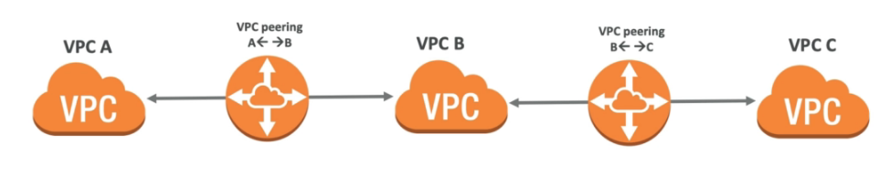
- Caso precise que elas se "vejam" e necessário criar um **VPC Peering** com as duas.
  
- Para cada conjunto (A - B , B - C, A - C) é necessário atualizar as tabelas de rotas, para que as instâncias possam se ver.
- Serviço **cross account** e **inter-regions**, ou seja é possível conectar VPCs de contas diferentes e em regiões diferentes.
- Possível configurar **Security Groups** que considerem VPCs pareadas.
- Caso haja um cenario onde haja 2 VPC com a mesma CIDR conectadas com a uma outra VPC **usa se Prefix para definir como vai ser o roteamento.**
  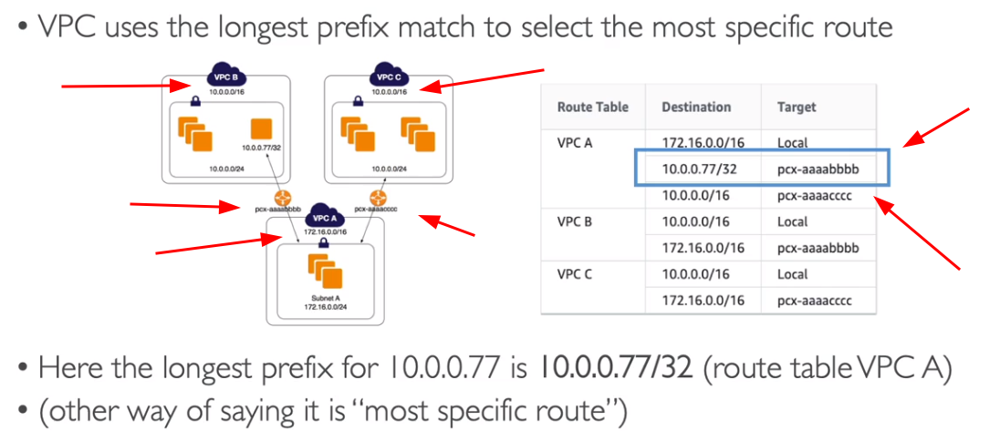
- **Não suporta roteamento de borda, para NAT devices**
  
  

---

### VPC Endpoints


- Permite criar **endpoints para acesso de serviços internos da AWS.**
- Escala **Horizontalmente** e tem **redundância**.
- Usado quando queremos que uma rede privada tenha acesso a recursos AWS, mas sem que esse tráfego saia para a internet.
- Ele remove a necessidade de se ter uma **NAT Gateway** para acessar serviços da AWS.
- Usado **para subnets privadas.**
- Tipos:
  - **Interface** - cria uma interface de rede (**ENI**) que fornece um IP para os serviços devem ser configurado o acesso **no Security Group.**
    - Quando criado cria se um **URL que será atachada ao ENI.**
    - Precisa habilidar as configurações na VPC **"Enable DNS Hostnames" e "Enable DNS Support"**, pois Serviço de DNS irá resolver o **Private Endpoint para rede privada.**
    - Para todos exceto o DynamoDB.
    - As interfaces podem ser compartilhadas via **DX e VPN.**
  - **Gateway** - usa um Gateway para provisionar um destino e deve ser configurado na tabela de rotas (**Route Table**)
    - Somente para **S3 e Dynamo DB**.
    - Não tem custo. **Tem maior flexibilidade de acessos.**
    - Não pode ser expandido para fora da VPC. Ous seja não pode ser compartilhado usando **(VPN, DX, TGW, Peering)** só funciona **dentro da VPC.**
    - Se deve criar um único por VPC. O DNS deve esta habilitado e com isso pode se usar hostname para o S3 ou DynamoDB
    - Criado em nivel de VPC, por isso que é necessário definir a entrada de acesso no rout table
      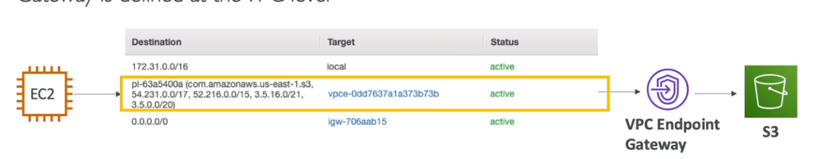
- Caso use **VPC Endpoints** deve se atentar a usar as configurações de DNS, Outra coisa que pode gerar confusão e que a partir da hora que se usa o **VPC Endpoints** e necessário informar as região ao usar comandos do CLI, pois o **VPC Endpoints** tem escopo regional.
- **VPC Endpoint Police**
  - Permite controlar os acesso a **serviços AWS.**
  - Não sobrescreve **política do S3 ou só IAM**, apenas adiciona a endpoint a definição de quem pode acessa-lo.
  - Caso queria restringir o acesso de algum recurso a apenas ao VPC Endpoint é necessário ir no recurso e definir uma política de acesso que indique que o acesso a aquele recurso deve ter origem do VPC Endpoint com a condição "aws:sourceVpce" onde se passa os endpoints que podem acessar o recurso.

---

### AWS PrivateLink - VPC Endpoint Services


- Permite compartilhar um **serviço de uma VPC com outra VPC** sem precisar que aquele serviço publico, ou sem precisar ligar as VPC com **VPC Peering.**
- Forma mais segura e escalável de se **expor mais de 1000 serviços AWS.**
- Sem a necessidade de **Peering, DX e VPN, NAT ou RouteTables.**
- Faz uso do **VPC endpoints, por isso muitas vezes pode ser considerado o mesmo serviço.**
- Usando com S3 e Direct Connect
  
- Usando com VPC Peering
  

---

### VPC Flow Logs

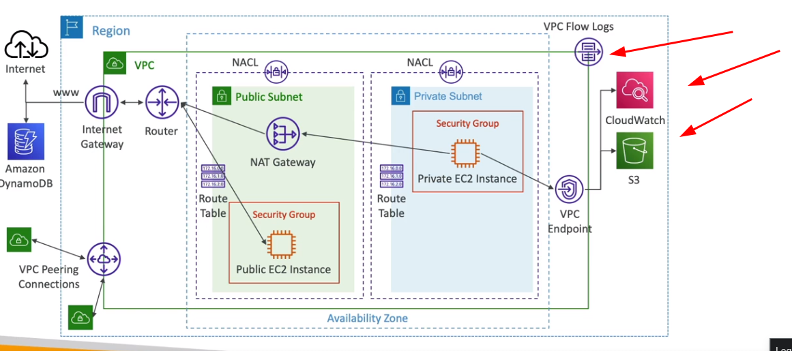

- Permite capturar o tráfego **IP dentro de uma VPC.**
- Esta em **nivel de VPCs.**
- Tipos:
  - **VPC Flow Logs** - se aplica a tudo dentro da VPC.
  - **Subnet Flow Logs** - se aplica as subnets dentro de uma VPC.
  - **ENI Flow Log** - Se aplica a uma interface de rede.
- Podem ajudar a monitorar tráfegos de rede dentro da VPC, ajuda na **troubleshooting**.
- Pode se usar o **Athena** ou **Cloud Watch Insights** para identificar anomalias.
  
- Arquiteturas com FPC Flow Logs
  

---

### Bastion Hosts

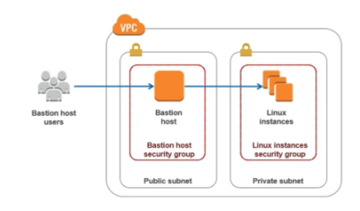

- Maquina numa rede publica da onde é possível conectar a instâncias em uma rede privada via SSH.
- Se conectar ao **Bastion Hosts** via SSH e a partir dele se conecta as instâncias na rede privada.
- Outra solução é a **Session Manager** que permite acesso na WEB sem necessidade de SSH.

---

### Virtual Private Gateway

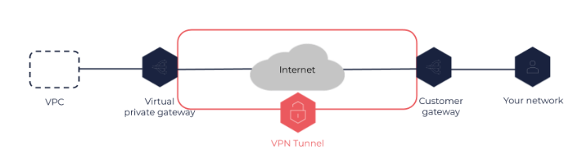

- Permite ligar uma rede on-primise a AWS via VPN, para isso é necessario configurar um **Virtual** **Customer Gateway** do lado do on-primese e do lado da AWS cria se uma **Virtual Private Gateway**.

### AWS Direct Connect


- C**onexão dedicada, fibra** que vai do seu **datacenter** até a AWS.
- Demora cerca de **1 Mês** para ser implementado toda a infraestrutura.
- Por padrão os dados em transito não são cartografados, pois já se esta numa rede privada, mas caso queira pode se usar **um solução de IPSec com VPN.**
- O **Direct Connect (DX)** é um recurso que permite a conexão dedicada (vai de fibra até o datacenter) e direta com a AWS, fora da infraestrutura da Internet.
- Exemplo de uso, o Itaú deseja ter a melhor conexão possível entre seus datacenter e a AWS, ele contrata um **DX que vai ligar uma fibra do datacenter do Itaú até a AWS (Um parceiro).**
- Caso se queira conectar mais de uma região deve se usar um **Direct Conect Gateway**
  
- Alta disponibilidade
  
- Direct Connect Gateway - Site Link
  
- Tipos de DX
  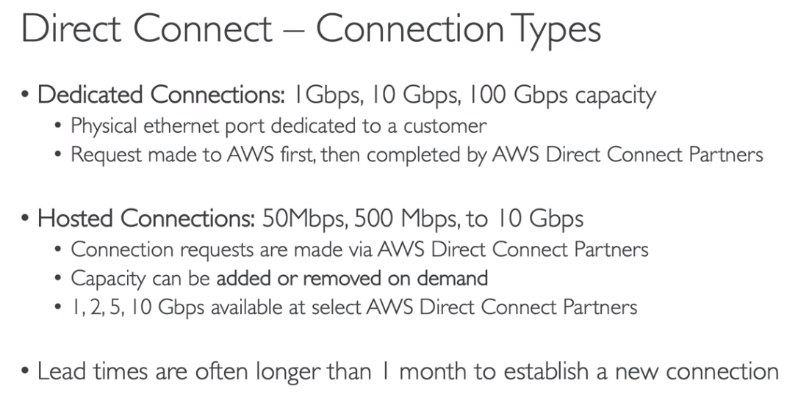

#### Virtual Interface VIF

- **Public VIF** - Permite conectar serviços publicos da AWS (S3, EC2).
- **Private VIF** - Permite conectar aos recursos na sua VPC (EC2, ALB).
- **Transit Virtual Interface** - Conecta aos recursos usando um TGW (Transit Gateway).
- Endpoints privados não precisam de interfaces (Private VIF) para conexão, pois podem ser acessados diretamente.

---

### Egress Only Internet Gateway

- Um **gateway** da Internet somente de saída é um componente da VPC horizontalmente escalado, redundante e altamente disponível que permite a comunicação de saída pela **IPv6** das instâncias na VPC para a Internet e impede a Internet de iniciar uma conexão **IPv6** com suas instâncias.

---

### Transit Gateway


- **O AWS Transit Gateway** conecta VPCs e suas redes locais por meio de um **hub central**. Isso simplifica a rede e elimina os complexos relacionamentos de emparelhamento. Ele atua como um roteador de nuvem e cada nova conexão só é feita uma vez.
- Permite instâncias na VPC acesse a NAT Gateway, NLBs, PrivateLink, e EFS e outras VPC conectadas ao **AWS Transit Gateway**.
- Permite usar o **Direct Conect ao premises ou VPN.**
- Transit Gateway é um recurso **regional e pode conectar milhares de VPCs na mesma região da AWS.**
- Pode ser compartilhado com outras contas da AWS usando **RAM**.
- Permite restringir quais VPC tem acesso a quais VPC usado Route Tables.
- Suporta **IP Multicast** (Não suportado por nenhum outro serviço da AWS.)
- **Casos de Uso**
  - Para implementar a topologia **Hub e Spoke (star).**
  - Para conectar vários Amazon VPCs entre regiões (usando **peering do Transit Gateway**).
  - Forneça aplicativos em todo o mundo - **o Transit Gateway** ajuda a criar aplicativos que abrangem milhares de Amazon VPCs. Tudo é mais fácil de implantar, gerenciar e solucionar problemas.
- **Limitações**
  - Você pode se conectar a no máximo três **Transit Gateways** em uma única Conexão **Direct Connect** para conectividade híbrida.
  - **O Transit Gateway** não oferece suporte ao roteamento entre VPCs com CIDRs sobrepostos.
- **Inter e Intra Region Peering**
  - Dentro de uma região é possivel ter dois **TGW** ( Transit Gateway) com finalidades diferentes e conecta-los usando i**ntra-Refion Peering Mesh.**
  - Mas caso queira conectar a outra região com um estrutura semelhante seria necessário criar um novo TGW e realizar o inter-Region Peeering Mesh.
    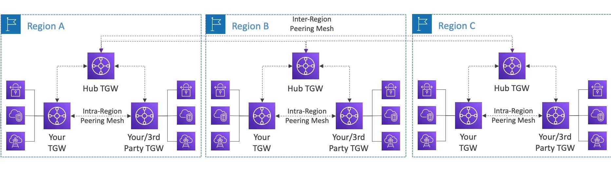

---

### Custo de rede


---

### AWS VPN

- Permite conectar o **on-premises a AWS** via internet publica, com segurança.
- AWS Recomenda a criação de uma **VPN diferente para cada VPC.** porém isso pode ser complicado, por isso é recomendado o uso de **DX (Direct Conect).**
- para se criar precisa:
  - Do lado on-premises:
    - Disponibilizar um estrutura com com IP publico.
    - Criar um **Customer Gateway (CGW)**
  - Do lado da AWS
    - Configurar um **Virtual Private Gateway** e atachar a VPC
    - Conectar a**o Customer Gateway ao Virtual Private Gateway (VGW)**
- Para alta disponibilidade se recomenda a existência no mínimos duas VPN configuradas.
- Pode se usar o **Global Acelerator** para melhorar a velocidade.
  
- Configuração da tabela de rotas
  - **Static Routing** - Insere manualmente as rotas em cada uma das tabelas de rotas.
  - **Dynamic Routing** - Usa se o protocolo **BGP** para realizar a configuração da tabela de rotas automaticamente compartilhando os IP Entre as tabelas de rotas.
    - Necessário especificar um **ASN** para cada **Gateway criado**
- **Link Aggregation Group**
  - O **LAG no AWS Direct Connect** permite que você agregue várias conexões de rede físicas em uma única conexão lógica de alta capacidade. Isso pode ajudar a aumentar a largura de banda, melhorar a redundância e simplificar a configuração da rede. Com o **LAG**, você pode criar um único link de conexão lógica que pode fornecer uma largura de banda de até 10 Gbps.
  - Além disso, o **LAG** pode ser usado para criar conexões redundantes para garantir a alta disponibilidade da sua rede. Se uma das conexões físicas falhar, o tráfego pode ser automaticamente roteado para outra conexão sem interrupções de serviço.
  - 
- Acessando a Internet **via cloud do on-premises**
  - **Nat Gateway** - não funciona pois ele não pode ser acessado de origem vinda de DX, VPN ou Peering.
    
    
    **Client VPN** - Permite configurar uma VPN para que os **usuários possam conectar via por exemplo (OpenVPN)**

#### CloudHub

- Permite conectar mais de **10 Customer Gateway a cada Virtual Private Gateway.**
  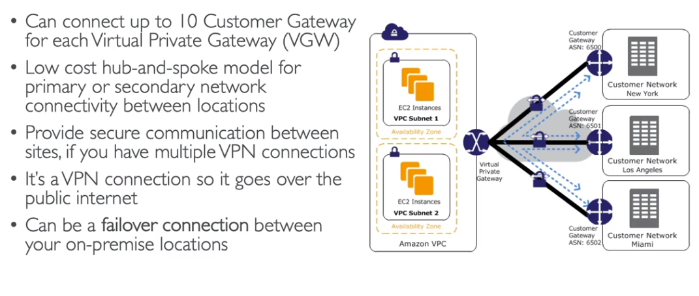

---

### AWS Network Firewall

- Protege a VPC inteira
  
  
  

---

## Machine Learning


---

### Rekognition (reconhecimento)


- Permite buscar **pessoas, objetos, textos e cenas em imagens e videos usando ML.**
- Pode se realizar reconhecimento e busca facial para verificação de usuário, e contagem de pessoas.
- Posse criar um **banco de faces familiares ou usar de celebridades.**
- Caso de usos:
  - **Moderação de conteudo**
  - Detecção de texto.
  - Deteção de analise de faces (género, range de idade, emoções)
  - Reconhecimento de celebridades
  - Caminhos (Para analise de futebol)
  - Usado e medias sociais, e-commerce
- As imagens ou vídeos são analisadas e e validado junto a um threshold de **nível de confiança** e pode se adicionar um passo opcional que seria a validação por humanos via **Augmented AI (A2I).**

---

### Transcribe

- Serviço de conversão de **áudio em texto.**
- Usa processos de aprendizados profundo de maquina chamados de **Automatic Spreech Recognition (ASR)** para converter o discurso (áudio) em texto rapidamente.
- Permite remover automaticamente as **PII (Personal Identifiable Information) usando Redaction**.
- Suporta automaticamente linguagens diferentes em áudio com multi-línguas e consegue identifica-las.

---

### Polly

- Serviço de conversão de **texto em áudio**. (oposto de Transcribe).
- Permite criar **aplicação que falam.**
- Permite usar Lexicon e SSML
  - **Pronunciation Lexicon** - permite customizar a pronúncia de palavras. Assim quando aparecer
    - AWS -> Amazon Web Service
    - Uniliva -> Uniliva, aquele mineiro bunito dimais
  - **SSML - Speech Synthesis Markup Language** - gera áudio através de textos e documentos. Permite customizar para :
    - Da ênfase em palavras especificas ou frases.
    - Usar pronuncia fonética.
    - **Incluir quebra de som ou sussurros.**

---

### Translate

- Serviço de tradução de línguas da AWS.
- Permite traduzir grandes volumes de **textos rapidamente, permite localizar o conteúdo e traduzi lo de acordo com a preferência do usuário.**

---

### Lex + Connect


- Lex
  - Mesma tecnologia usada pela **Alexa**. Utiliza o **ASR (Automatic Spreech Recognition)** para converte o áudio em texto.
  - Entende **linguagem natural e converte-la em texto.**
  - Usado para criar **chatbots e call center bots.**
- Connect
  - Permite receber chamadas, criar contatos baseados na nuvem, ou seja contatos virtuais (Virtual contact center).
  - **Solução de centro de contato,** pode ser integrados com outros CRM ou AWS. De forma que receba um chamada e crie um chamado ou redirecione para um atendente (semelhante a URA).
  - Não tem pagamento UPfront **e 80% mais econômico que concorrentes.**

---

### Comprehend

- Usado para processamento de linguagem natural (**NLP**).
- Totalmente gerenciado pela AWS.
- Usado para:
  - **Entender a linguagem de um texto.**
  - **Se ele é positiva ou negativa.**
  - **Extrair frases, lugares, pessoas , marcas ou eventos.**
  - Permite usar **tokenization** nos textos.
- Exemplos de uso
  - **Analizar dezenas de e-mail,** buscando mensagem positivas ou negativas ou oportunidade.
  - Criar e agrupar artigos de mesmo contexto.

---

### Comprehend Medical

- Usado para interpretar **textos clínicos** (receita do medico).
- Pode se usar o **PHI (Protected Health Information)** usando NLP
- Permite ler receitas e anotações medicas e armazenar esses dados no S3 **e usando outras tecnologias converter essa anotações em documentos ou até mesmo áudio.**

---

### SageMaker

- Serviço gerenciado pela AWS, para criação de modelos de Machine Learning.
- Nele há a possibilidade de se criar um modelo **,treina-lo e aplica-lo e novos conjuntos de dados para predizer coisas.**

---

### Forecast


- Serviço gerenciado pela AWS, que usa ML para realizar **previsões.**
- Exemplos: **Prever vendas futuras** de carros e outros itens.
- **50% mais acurado** quando olhando datas por si só.
- Reduz o **tempo de previsão de meses para horas.**
- Use cases: **Planejamento de demanda de produtos, planejamento de Financeiro e de recurso**.

---

### Kendra


- Serviço gerenciado pela AWS, para **busca em documentos usando ML. (Document Search service)**
- Permite extrair resposta de documentos (text, pdf, HTML, PowerPoint, Word, FAQs).
- Pense que é um **buscador igual ao Google.**

---

### Personalize


- Serviço gerenciado pela AWS, para criação de APP com **recomendações personalizadas** em tempo real.
- Exemplo:
  - **Recomendações personalizadas de produtos,**
  - Re/Ranking de produtos.
  - **Email de marketing direcionados e personalizados**.
- Usado na Amazon para recomendar produtos de acordo com histórico de pesquisa e compras.

---

### Textracs


- Automaticamente **extrai textos, escritos a mão de documentos ou de arquivos escaneados usando IA e ML.**
- Extrai de tabelas, PDF, imagens.

---

## Outros Serviços

- **CodeCommit**: armazene o código em repositórios controlados por versão. O código pode existir em múltiplos branches (ramificações).
- **CodeBuild**: construa e teste o código sob demanda em suas pipelines de CICD.
- **CodeDeploy**: faça o deploy do código em EC2, Lambda ou ECS.
- **CodePipeline**: orquestre pipelines de CICD. Se usar o **CodeCommit** como fonte, ele se conectará a apenas um branch.
- **CloudSearch**: solução de busca **gerenciada** para realizar pesquisas de texto completo, auto completar em suas aplicações.
- **Alexa for Business**: use a Alexa para ajudar os funcionários a serem mais produtivos em salas de reunião e suas mesas.
- **Lex**: Reconhecimento automático de fala **(ASR)** para converter fala em texto. Útil para construir chatbots.
- **Connect**: receba chamadas, crie fluxos de contato, centro de contato virtual baseado em nuvem.
- **Rekognition**: encontre objetos, pessoas, textos, cenas em imagens e vídeos usando Machine Learning.
- **Kinesis Video Stream**: um fluxo por dispositivo de vídeo, análise usando instâncias do EC2 ou Rekognition.
- **WorkSpaces**: estações de trabalho Windows sob demanda. WAM é usado para gerenciar aplicativos.
- **AppStream 2.0**: transmita aplicativos de desktop para navegadores da web.
- **Mechanical Turk**: marketplace de **crowdsourcing** para realizar tarefas simples para humanos, integração com SWF.
- **Device Farm**: serviço de teste de aplicativos para seus aplicativos móveis e web em dispositivos reais.

### CodeGuru


- Serviço de ML para automatizar code reviews de realizar recomendações de performance no código.
- provém duas funcionalidades:
  - **CodeGuru Review** - Realiza o review (analise) de conteúdo estático.
  - **CodeGuru Profiler** - Realiza recomendações sobre a performance das aplicação durante o tempo de execução.

---

### Alexa for Business, Lex e Connect

- **Alexa for Business**
  - Ajuda os empregados a serem mais produtivos.
  - Permite mensurar e incrementar a utilização de salas de reuniões.

---

### Kinesis Video Streams

- Um stream de **vídeo por dispositivo** (producer).
  - Cameras de segurança, smatphones
  - Pode se usar a biblioteca do Kinesis video strems.
- Dados são armazenados no S3 (Nós não temos acesso direto aos dados)
- **Não** pode enviar os dados de fluxo diretamente para o S3. (precisa criar um solução customizada)
- **Consumers**
  - EC2 para processamento em **tempo real.**
  - **Rekognition** para identificação de pessoas
    

---

### WorkSpaces

- Ambientes de trabalhos seguros e gerenciados na nuvem(como fosse uma **VDI** na nuvem).
- Bom para eliminar o gerencimento de VDI (Virtual Desktop Infrastructure).
- **Paga-se por hora** ou pode se fazer uma assinatura mensal.
- **IP Access Control Groups**
  - Similar security group para os WorkSpace, permite configurar um range de IPs que podem acessar.
- Integrado com o AD da Microsoft.
  
  
  

---

### AppStream 2.0

- Serviço de Stream de **aplicações desktop.**
- Entrega para qualquer computador se a necessidade de provisionar infraestrutura.
- As aplicação são entregues em **browsers web.**
- Ou seja, em vez de se o uma aplicação em 10 maquinas, pode se ter em uma única maquina e realizar stream dessa aplicação em vários computadores permitindo acessa-las via browser.
  

---

### Device Farm

- Device Farm é um serviço de **testes de aplicativos móveis** na nuvem oferecido pela Amazon Web Services (AWS).
- Ele permite que desenvolvedores de aplicativos testem suas aplicações em uma ampla variedade de dispositivos móveis reais, como smartphones e tablets, sem precisar possuir cada um desses dispositivos fisicamente.
- O Device Farm automatiza testes em dispositivos móveis em paralelo, ajudando a detectar erros e problemas de desempenho em seus aplicativos antes de serem lançados no mercado.
- Além disso, o Device Farm também oferece **recursos de relatórios detalhados** que ajudam os desenvolvedores a entender melhor como suas aplicações estão sendo executadas em diferentes dispositivos.

---

### Macie


- Usa **machine learning,** para detectar dados sensíveis (**PII - Personally identifiable information**).
- Totalmente **serveless**.
- Analisa os dados e notifica o **CloudWatch EventBridge** que notica via **SQS**, **SNS** ou
  **Lambda**.

---

### SES


- Amazon **Simple Email Service**. É um serviço de e-mail em nuvem.
- Permite que empresas **enviem e-mail**s em grande escala para seus clientes ou usuários finais de forma rápida, confiável e escalável.
- Podem enviar e-mails transacionais, como confirmações de pedidos, notificações de transações financeiras, lembretes de senha e outros e-mails importantes relacionados ao serviço.
- Inclui recursos de monitoramento e relatórios detalhados, permitindo que as empresas avaliem a eficácia de suas campanhas de e-mail e monitorem a entrega de seus e-mails.
  - Conjunto de configuração. Permite customizar o envio e a analise do processo.
    - **Event Destinations** - permite configurar para onde será enviados os dados de envio e resposta do e-mail.
    - **Ip Pool Management** - Use para enviar e-mail específicos e **particulares**.
- Suporta **DKIM (DomainKeys Identified Mail) e SPF (Sender Policy Framework)**
- Pode ser acessado via API e SMTP.

---

### EC2 Imagem Builder


- Serviço de **criação e gerenciamento de imagens de máquinas virtuais (VMs - AMIs) ou Container image.**
- Serviço gratuito (Pague apenas pelos recursos usados).
- Permite que os usuários criem, **atualizem e gerenciem imagens personalizadas de VMs para uso em ambientes de nuvem.**
- Permite automatizar o processo de criação de imagens, **incluindo a instalação de software, a aplicação de patches de segurança e a configuração de configurações personalizadas.**
  - Criação semanal com atualizações de segurança, ou atualização de pacotes.
- Pode ser integrado a outros serviços como o **S3 e o Systems Manager.**
- Permite publicar as AMsI em **Múltipla** regiões e contas
- Oferece recursos de versionamento e controle de acesso.

---

### IoT Core


- Serviço de **gerenciamento de dispositivos IoT (Internet das Coisas)** . Serviço **serveless**.
- Fornece uma plataforma para **conectar, gerenciar e controlar dispositivos IoT**, permitindo que se colete e analisem dados de dispositivos em tempo real.
- Com o IoT Core, os dispositivos podem se comunicar de maneira segura e escalável, usando protocolos de comunicação padrão, como **MQTT e HTTPS.**
- Fornece recursos para gerenciamento dispositivos, como **registro de dispositivos, autenticação e autorização, gerenciamento de certificados, monitoramento de saúde do dispositivo e aplicação de atualizações de firmware.**
- Pode ser integrado com outros serviços como o **S3, o Amazon Kinesis e o AWS Lambda**, para realizar análises em tempo real e processamento de dados de dispositivos IoT.
  
  

---

Data Exchange
Data Pipeline
Lake Formation
AppFlow
Managed Blockchain
App Runner
Lightsail
Wavelength
EKS Distro
EKS Anywhere
Keyspaces (for Apache Cassandra)
Cloud9
CodeArtifact
CodeStar
Amplify
Pinpoint
Internet das Coisas:

- AWS IoT Analytics
- AWS IoT Core
- AWS IoT Device Defender
- AWS IoT Device Management
- AWS IoT Events
- AWS IoT Greengrass
- AWS IoT SiteWise
- AWS IoT Things Graph
- AWS IoT 1-Click
  Serviços de mídia:
- Amazon Elastic Transcoder
- Amazon Kinesis Video Streams
