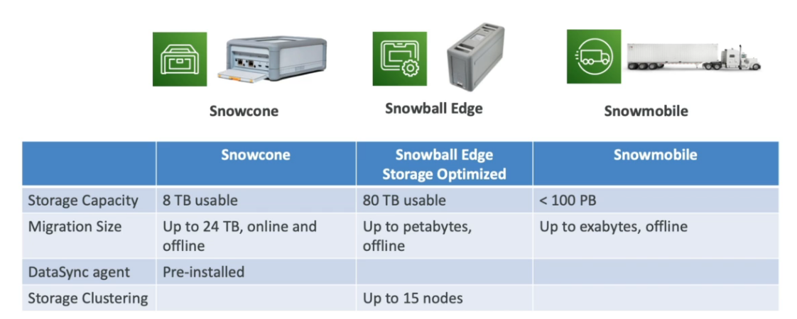
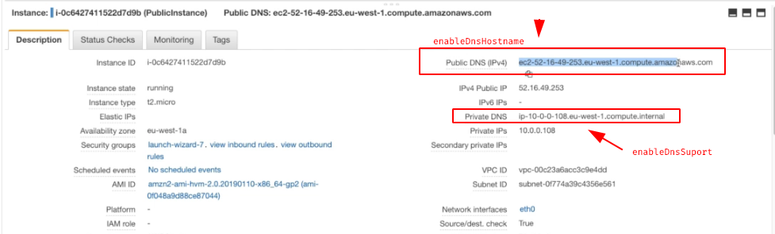
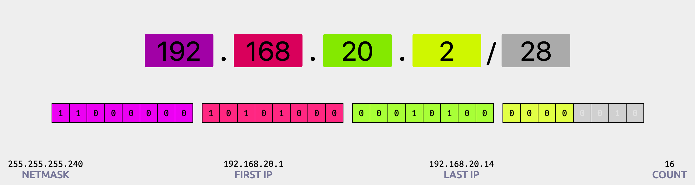
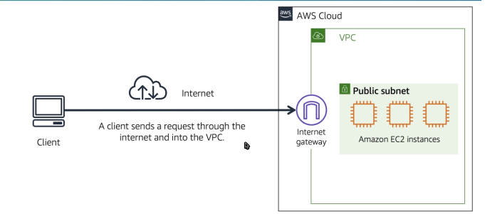
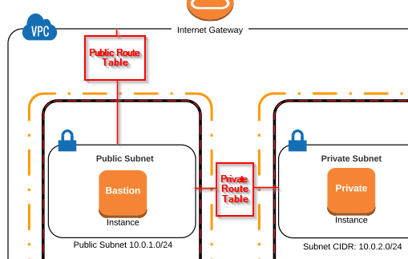
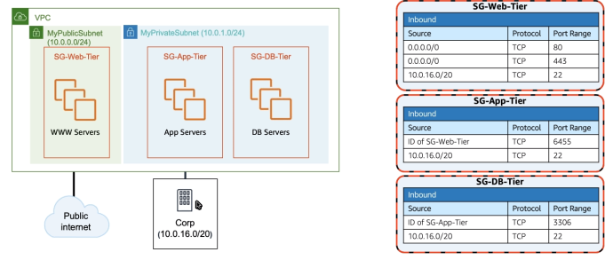
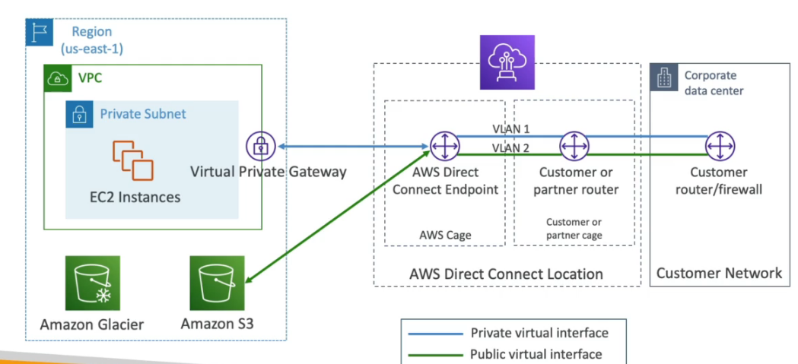
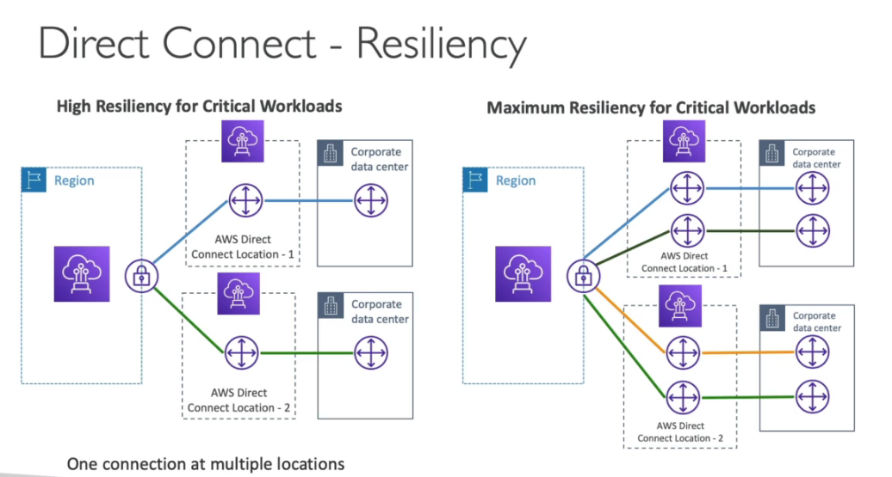
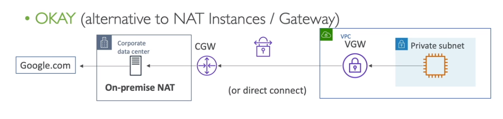
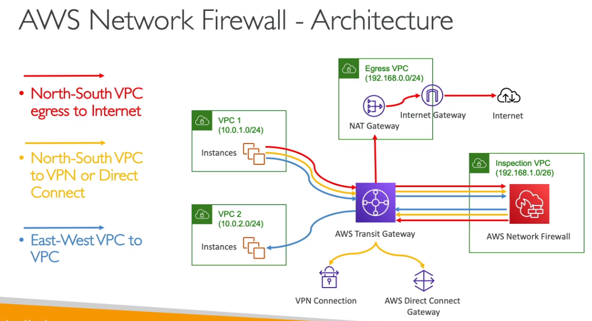

---

## Prova de certificação

- Domínios

| Domínio                                                              | percentual |
| -------------------------------------------------------------------- | ---------- |
| Domínio 1: Soluções de design de complexidade organizacional         | 26%        |
| Domínio 2: Design de novas soluções                                  | 29%        |
| Domínio 3: Melhoria contínua de soluções existentes                  | 25%        |
| Domínio 4: Acelerar a migração e a modernização da carga de trabalho | 20%        |

- Tecnologias aws que podem vão cair na prova
  - Computação
  - Gerenciamento de custos
  - Banco de dados
  - Recuperação de desastres
  - Alta disponibilidade
  - Gerenciamento e governança
  - Microsserviços e desacoplamento de componentes
  - Migração e transferência de dados
  - Redes, conectividade e entrega de conteúdo
  - Segurança
  - Princípios de design sem servidor
  - Armazenamento

- Serviços abordados

  
 title="veja a lista completa" 

- Análise:
  - Amazon Athena
  - AWS Data Exchange
  - AWS Data Pipeline
  - Amazon EMR
  - AWS Glue
  - Amazon Kinesis Data Analytics
  - Amazon Kinesis Data Firehose
  - Amazon Kinesis Data Streams
  - AWS Lake Formation
  - Amazon Managed Streaming for Apache Kafka (Amazon MSK)
  - Amazon OpenSearch Service
  - Amazon QuickSight
- Integração de aplicativos:
  - Amazon AppFlow
  - AWS AppSync
  - Amazon EventBridge (Amazon CloudWatch Events)
  - Amazon MQ
  - Amazon Simple Notification Service (Amazon SNS)
  - Amazon Simple Queue Service (Amazon SQS)
  - AWS Step Functions
- Aplicativos empresariais:
  - Alexa for Business
  - Amazon Simple Email Service (Amazon SES)
- Blockchain:
  - Amazon Managed Blockchain
- Cloud Financial Management:
  - AWS Budgets
  - AWS Cost and Usage Report
  - AWS Cost Explorer
  - Savings Plans
- Computação:
  - AWS App Runner
  - AWS Auto Scaling
  - AWS Batch
  - Amazon EC2
  - Amazon EC2 Auto Scaling
  - AWS Elastic Beanstalk
  - Amazon Elastic Kubernetes Service (Amazon EKS)
  - Elastic Load Balancing
  - AWS Fargate
  - AWS Lambda
  - Amazon Lightsail
  - AWS Outposts
  - AWS Wavelength
- Contêineres:
  - Amazon Elastic Container Registry (Amazon ECR)
  - Amazon Elastic Container Service (Amazon ECS)
  - Amazon ECS Anywhere
  - Amazon Elastic Kubernetes Service (Amazon EKS)
  - Amazon EKS Anywhere
  - Amazon EKS Distro
- Banco de dados:
  - Amazon Aurora
  - Amazon Aurora sem servidor
  - Amazon DocumentDB (compatível com o MongoDB)
  - Amazon DynamoDB
  - Amazon ElastiCache
  - Amazon Keyspaces (for Apache Cassandra)
  - Amazon Neptune
  - Amazon RDS
  - Amazon Redshift
  - Amazon Timestream
- Ferramentas do desenvolvedor:
  - AWS Cloud9
  - AWS CodeArtifact
  - AWS CodeBuild
  - AWS CodeCommit
  - AWS CodeDeploy
  - Amazon CodeGuru
  - AWS CodePipeline
  - AWS CodeStar
  - AWS X-Ray
- Computação de usuário final:
  - Amazon AppStream 2.0
  - Amazon WorkSpaces
- Web e dispositivos móveis de front-end:
  - AWS Amplify
  - Amazon API Gateway
  - AWS Device Farm
  - Amazon Pinpoint
- Internet das Coisas:
  - AWS IoT Analytics
  - AWS IoT Core
  - AWS IoT Device Defender
  - AWS IoT Device Management
  - AWS IoT Events
  - AWS IoT Greengrass
  - AWS IoT SiteWise
  - AWS IoT Things Graph
  - AWS IoT 1-Click
- Machine learning:
  - Amazon Comprehend
  - Amazon Forecast
  - Amazon Fraud Detector
  - Amazon Kendra
  - Amazon Lex
  - Amazon Personalize
  - Amazon Polly
  - Amazon Rekognition
  - Amazon SageMaker
  - Amazon Textract
  - Amazon Transcribe
  - Amazon Translate
- Gerenciamento e governança:
  - AWS CloudFormation
  - AWS CloudTrail
  - Amazon CloudWatch
  - Amazon CloudWatch Logs
  - AWS Command Line Interface (AWS CLI)
  - AWS Compute Optimizer
  - AWS Config
  - AWS Control Tower
  - AWS License Manager
  - Amazon Managed Grafana
  - Amazon Managed Service for Prometheus
  - Console de Gerenciamento da AWS
  - AWS Organizations
  - AWS Personal Health Dashboard
  - AWS Proton
  - AWS Service Catalog
  - Service Quotas
  - AWS Systems Manager
  - AWS Trusted Advisor
  - AWS Well-Architected Tool
- Serviços de mídia:
  - Amazon Elastic Transcoder
  - Amazon Kinesis Video Streams
- Migração e transferência:
  - AWS Application Discovery Service
  - AWS Application Migration Service (CloudEndure Migration)
  - AWS Database Migration Service (AWS DMS)
  - AWS DataSync
  - AWS Migration Hub
  - AWS Schema Conversion Tool (AWS SCT)
  - AWS Snow Family
  - AWS Transfer Family
- Redes e entrega de conteúdo:
  - Amazon CloudFront
  - AWS Direct Connect
  - Elastic Load Balancing (ELB)
  - AWS Global Accelerator
  - AWS PrivateLink
  - Amazon Route 53
  - Transit gateway da AWS
  - Amazon VPC
  - AWS VPN
- Segurança, identidade e compatibilidade:
  - AWS Artifact
  - AWS Audit Manager
  - AWS Certificate Manager (ACM)
  - AWS CloudHSM
  - Amazon Cognito
  - Amazon Detective
  - AWS Directory Service
  - AWS Firewall Manager
  - Amazon GuardDuty
  - AWS Identity and Access Management (IAM)
  - Amazon Inspector
  - AWS Key Management Service (AWS KMS)
  - Amazon Macie
  - AWS Network Firewall
  - AWS Resource Access Manager (AWS RAM)
  - AWS Secrets Manager
  - AWS Security Hub
  - AWS Security Token Service (AWS STS)
  - AWS Shield
  - AWS Single Sign-On
  - AWS WAF
- Armazenamento:
  - AWS Backup
  - Amazon Elastic Block Store (Amazon EBS)
  - AWS Elastic Disaster Recovery (CloudEndure Disaster Recovery)
  - Amazon Elastic File System (Amazon EFS)
  - Amazon FSx (para todos os tipos)
  - Amazon S3
  - Amazon S3 Glacier
  - AWS Storage Gateway

---

## Migration

### Cloud Migrations - The 6R

- [6 estratégia para migra para a cloud.](https://aws.amazon.com/pt/blogs/enterprise-strategy/6-strategies-for-migrating-applications-to-the-cloud/)
  - **Rehosting** - “lift-and-shift.”
    - Apenas mova do on-premises para AWS (a aplicação inteiramente).
  - **Replatforming**  - “lift-tinker-and-shift.”
    - Migra por exemplo de um banco on-premises para o RDS.
    - Ou seja migra a plataforma, estava Weblogic muda para Tomcat.
    - Não muda o core da aplicação.
  - **Repurchasing** — "drop and shop"
    - Muda para um nova solução, ex muda de CRM para Salesforce.
  - **Refactoring / Re-architecting**
    - Reescreve a aplicação em uma nova arquitetura.
    - Mas demorado, e mais caro, porém pode se tirar o máximo da cloud.
    - Facilita novas features.
  - **Retire**   - Livrar-se
    - Livra se do que não se usa, ou que usa muito pouco.
  - **Retain**
    - Deixa no on-premises e se conecta aos AWS.
    - Se mantém, pois é muito complexo a migração o não vale o esforço.

---

### AWS Storage Gateway

- Usado e **cloud híbrida.** Permite fazer uma **ponte entre os dados da nuvem e o ambiente local** (on-premises).
- Conecta um dispositivo de software local a um armazenamento em nuvem para oferecer uma
  integração perfeita e segura entre um ambiente de TI local e a infraestrutura de armazenamento da AWS.
- Você pode usar esse serviço para armazenar dados no AWS para
  armazenamento escalável e econômico que ajuda a manter a segurança dos dados.
- Oferece **Gateways** de arquivo baseados em **arquivo (S3, EFS, FSx )**, volumes
  (armazenados em cache e armazenados) e soluções de armazenamento em fita.
- Tipos de armazenamento que é possivel configurar:
  - **S3 File Gateway** - Usado para armazenar arquivos.
    
  - **FSx File Gateway** - Bom para cache de dados de arquivos muitos acessados.
    
  - **Volumes Gateway (EBS)** - Usados para armazenar dados de backups, ou volumes.
    
  - **Fitas (TAPE) Gateway (S3 Glacier) -** Usado onde há processos semelhantes fitas.
    
- Pode se usar autenticação integrada com o Active directory.
- AWS, também oferecer **hardware** para disponibilizar essas funcionalidade. Onde não há própria estrutura de virtualização para implementar o **AWS Gateway Storage.**
- Uso:
  - Recuperação de desastre.
  - Backup e Restauração.
  - Armazenamento.
  - Redução de latência e cache no ambiente on-premises.
    Arquitetura com Storage Gateway
- Usado para migrar dados do on-premises para AWS, ou para conectar aplicação migrada no modo Rehosting.
  
- Usado como replica de leitura entre ambientes de on-premises
  
- Para processo de backup, para economia
  

---

### AWS Snow Family

- Dispositivo **offline** que permite realizar **migração de grande quantidade de dados**. Muito usado para levar dados para AWS sem usar a rede.
- Podem **rodar instâncias EC2 ou lambdas**, para processamentos de dados em **áreas remotas**, onde não se tem acesso ao recursos da AWS.
  - Pode se contratar por um log período de **1 a 3 anos** o que gera desconto.
- Há um software chamado **OpsHub** que fornece uma interface gráfica para os dispositivos.
- Há 3 tipos:
  - **Snowball edge** - Usado para transportar **TBs e PBs** de dados, semelhante a uma maleta.
    - **Storage otimized**
      - (**40vCpu 80Gb Memória**) - com 80 TBs compatível com S3.
    - **Compute otimized**
      - (**52vCpu 208Gb Memória**) com 42 TBs compatível com S3.
      - Caso necessário pode vir com **placa de vídeo.**
  - **SnowCone** - Dispositivo menor espaço, pesa cerca de 2,1 kg, com bateria opcional.
    - HDD - **2 vCPUS, 4 Gb de memória, 8TBs de espaço,** USB tipo c.
    - SSD - **2 vCPUS, 4 Gb de memória, 14 TB of SSD**
  - **SnowMobile** - Caminhão, usado para transporta dados acima de **10 PBs para AWS.**
    
- Não é possível importar os dado do **Snowball** diretamente para o **Glacier**, primeiro se importaria para o S3 e com uma política de ciclo de vida se moveria para o **Glacier**.
- Melhorando a transferência para os dispositivos.

---

### AWS DMS

- Serviço de **migração** de dados para a AWS.
- Permite migrar dados para o **RDS** (a nuvem) de um **banco relacional on-primeses.**
- Permite que o **banco fique ativo** durante a migração, pois usa os **logs para a migração**.
- Utiliza o **CDC (Change Data Capture)** para **Continous Data Replacation.**
- Roda numa instância **EC2**.
- Permite migrações:
  - **homogéneas** - de um de um tipo (oracle) para um bando do mesmo tipo (oracle) na nuvem.
  - **heterogéneas** - de um banco de um tipo (oracle) para outro de outro tipo (mysql)
    - Usa o **SCT (Schema conversion tool)** para migrar DB diferentes
- Origem e destino
  
- É bom saber sobre DMS
  - Trabalha com **VPC Peering, VPN, Direct Connect.**
  - modos:
    - **Full Load** - Carrega tudo e pronto.
    - **CDC only** - migração continua
    - **Full Load + CDC** - Carga Inicial mais integração continua de novos registos.
  - Oracle
    - Suporta **TDE** na Origem usando "**BinaryReader**"
    - Suporta TDE, **BLOBs in tables** que tenha PK no destino
  - Possível combinar SnowBall com o DMS.
    - Pega os dados so **banco** e usa o **SCT** para extrair os dados e mover para o **SnowBall**
    - Pega o **SnowBall** e move os dados para o S3.
    - Usa se o **DMS** com o **CDC** para colocar os dado no banco.

---

### Disaster Recovery in AWS

- DR é um modelo de arquitetura que visa prevenir **desastres** que possam afetar sua operação.
- A ideia e **"ter uma copia de sua solução"** em uma região afastada, que seria "acionada" quando sua região principal ficasse fora.
- Na **AWS** a ideia e semelhante, mas propõe que seus serviços e recurso sejam **distribuído** / **replicados** em mais de uma **região**.
- **Tipos**
  - **on-primeses -> on-primeses** -> tem um datacenter em SP e outro em Fortaleza. -> Solução bem cara de manter.
  - **on-primeses -> AWS** - uma estrutura Híbrida.
  - **AWS Região A -> AWS Região B** - Replica ou distribui os serviços e recurso em mais de uma região
- **Termos importante**
  - RPO - Recover point objective - está relacionado com a frequência de backup.
  - RTO - Recover time objective - está relacionado a tempo de recuperação de desastre.
    

#### Estratégias de DR

- **Backup e Restore**
  ​ 
  - A ideia aqui e realizar backups com uma certa frequência (RPO) e quando dá um problema se recuperar os dados do backup (RTO).
  - Tem uma alta tempo de recuperação (alto RTO).
  - Muito barato comparado as outras.
- **Pilot Light**
  ​ 
  - A ideia aqui é usar versões pequenas das aplicação (apenas para Apps Core) em outra regiões, e continuamente, sincronizar os dados entre elas. Caso ocorra um desastre seria só redirecionar os tráfego para nova região e escalar a aplicação.
- **Warm standby**
  ​ 
  - A ideia aqui seria ter toda a infraestrutura replicada só que em escala menor, caso haja um desastre, se redirecionaria o tráfego e escalava as aplicações.
- **hot site / multi site approach**
  
  
- A ideia aqui e se ter as aplicações e recurso distribuídos entres as regiões, e os dados sincronizados assim se ocorrer um desastre o tráfego seria redirecionado quase que instantaneamente.
- Tem o menor tempo de recuperação (RTO), porém é uma solução mas cara.

#### Dicas

---

### AWS FIS - Fault Injection Simulator

- Permite **Injetar falhas** nas cargas de trabalho na AWS a fim de **validar a capacidade de resiliência** das soluções.
- Baseado na engenharia do chaos, stressa as aplicações criando eventos disruptivos, permitindo que eles sejam **observados** e que se crie soluções para responde-los.
- Ajuda descobrir novos **bugs e lacunas de performance.**
- Suportas os serviços: **EC2, RDs, EKS, ECS ....**

---

### VM Migration Service

#### Application Discovery service

- Permite **planejar migração** dos projetos com base nas **informações coletadas** de data centers.
- Utilização do **servidor e e dependências** são mapeados como itens importantes para migração.
- **Agentless discovery** (Connector)
  - **OVA** (open virtual Applieance) que pode ser deployada numa VM.
  - Realiza o **inventário das VMS**, (CPU, Memory, Uso de disco).
  - Funciona em todos os sistemas
- **Agent Based Discovery**
  - Agente que pode ser instalado e que recuperar informações sobre a **configuração dos sistemas**, **performance, processo em execução e detalhes de rede.**
  - Pode ser instalado em:
    - **Microsoft Server, Amazon Linux, Ubuntu, RedHat, CentOs, Suse....**
  - Os dados podem ser exportados via CSV, ou podem ser enviados para o Migration HUB ou para um S3 para ser analizado no Athena

---

#### MGN - Aplication Migration Service

- Evolução do **SMS (Server Migration Service) e do CLoudEndure Migration**.
- Usado para aplicação de **rehosting** (lift and Shift) - mover do on-premises para AWS.
- Converter **recursos fisicos** ou virtuais em recursos da **cloud AWS.**
- Pode migrar suas aplicações da infraestrutura física, do **VMware vSphere**, do **Microsoft Hyper-V**, do EC2, da VPC e de outras nuvens para a AWS.
  

---

#### DRS Elastic Disaster Recover

- Chamado anteriormente de **CloudEndure Disaster Recovery.**
- Permite recuperar recursos físicos ou virtuais e servidores na cloud.
  

---

#### Migration Evaluator

---

### AWS Backup

- **Serviço de backup gerenciado pela AWS.**
- Permite **centralizar** as **configurações** de backups.
- Suporta **cross-regions e cross-accounts backups.**
- Pode ter **backups agendados** ou **sob demanda.**
- Permite aplicar uma política de **tagueamento do backups.**
- Permite criar uma **política de backup (período) e tempo de retenção de um backup.**
- **Backup Vault Lock**
  - Permite que os dados salvos não possam ser deletados implementa o **WORM(Write Once Read Many)**
  - Garante que não seja deletado por engano o por software mal.

---

## AWS VPC

- Virtual private cloud (rede privada na nuvem).
- Tem escopo **regional**.
- Toda região tem um VPC default, configurada com **subnets** publicas, ou seja tem acesso via Internet.
- Pode haver até **5 VPCs por região (soft Limit).**
- Cada **VPC** pode ter até **5 CIDRs sendo:**
  - No mínimo /28 com **16 IPs.**
  - No máximo /16 com **65536 IPS.**
- Como VPC é privado só são permitidos os ranges:
  - 10.0.0.0/8
  - 172.16.0.0/12
  - 192.168.0.0/16
- Resolução de DNS, há duas configurações possíveis
  - **enableDnsSuport** (configuração de resolução de DNS)
    - O padrão para VPC é **true**, serve para habilitar o suporte a resolução de DNS na VPC .
    - Private Dns
  - **enableDnsHostname**
    - **true** na VPC default mas **false** para novas VPCs.
    - Habilita o DNS para instâncias e a criação de **hostname** para instâncias.
    - Public Dns
      

### CIDR

- Classless inter-Domain Routing (Roteamento entre domínios sem classe).
- Usado para repartir os endereços IPs e definir ranges de ips.
  - x.x.x.x/32 -> tem 1 IP
  - 0.0.0.0/0 -> todos os IPs
    

### Subnets

- Bloco de rede dentro de uma VPC.
- Tem escopo de **AZ.**
- Quando se criar ele é privado por padrão.
- Para se fazer ela publica, deve se atachar um **Internet Gateway**.
- E adicionar uma tabela de rota de comunicação com o **Gateway**.
- AWS reserva **5 IPs (os 4 primeiros e o ultimo)** em cada **subnet** ex: o bloco CIDR 10.0.0.0/24:
  - 10.0.0.0 - Endereço de rede.
  - 10.0.0.1 - Reservado para o VPC Router.
  - 10.0.0.2 - Reservado para mapear DNS.
  - 10.0.0.3 - Reservado para uso futuro.
  - 10.0.0.255 - Endereço de broadcast.

### Internet Gateway

- Permite que uma **VPC** tenha acesso ao Internet.
- Escala horizontalmente e tem alta disponibilidade.
- Deve haver um **Internet Gateway** para uma **VPC**.
- Também fazem **NAT** para instâncias EC2 que tem IP publico.
- Lembrando que quem permite acesso ou não a Internet e a **tabela de Rotas.**

### Route table

- Serve para **direcionar** o tráfego de rede para as **subnets**, permitindo assim que se tenha acesso a Internet ou não.
- É boa pratica criar no mínimo duas tabelas de rotas por VPC:
  - Uma tabela de rotas publica que ter as **subnets** publicas, esta se liberar o tráfego de qualquer lugar colocando como target o **Internet Gateway.**
  - Uma privada onde vai estar as **subnetes** privadas.

### NAT Gateway

- As instâncias das **subnets** privadas precisam acesso a Internet para atualizações, é com usa de NAT que fazemos isso.
- Totalmente gerenciado pela AWS.
- Pague por hora e banda usada.
- São criado em uma **AZ** especifica e **Usam Elastic IP.** caso queira alta disponibilidade é recomendado criar e mais de uma **AZ**.
- Não pode ser usado por instâncias da mesma sub-rede, apenas por outras.
- Se criar um **NAT Gateway** numa **subnet** publica e apronta o tráfego das subnets privadas para o NAT, que por sua vez via **route table** repassa ao **Internet Gateway**, como nas **subnets** privadas só que pode acessar e que esta na mesma **VPC** se mantém a segurança.
- Há uma opção de usar uma i**nstancia EC2 como NAT Instance.**
  - Mas barato que o Nat Gateway, porém não é resiliente e toda manutenção deve ser feita por nós.
  - Deve se usar um **IP Elastico** junto a instância.
  - Para que funcione deve ser **desabilitado a Checagem de Sorce/Destination (EC2 settings).**

### Security Group

- **(Regras de acessos)** por padrão vem negando tudo.
- Só permite acesso, não preciso negar.
- É a primeira camada de segurança
- Está no nível de instâncias. Pode ser entendido como firewall das instâncias EC2.
- Eles têm estado (**statefull**), o que significa que todas as alterações aplicadas a uma regra de entrada são automaticamente aplicadas a uma regra de saída.

> Porta que vc deve conhecer :
> - 22 -> SSH
> - 21 -> FTP
> - 22 -> SFTP
> - 80 -> HTTP — access unsecured websites
> - 443 -> HTTPS — access secured websites
> - 3389 ->  RDP (Remote Desktop Protocol for Windows instance) 

### NACL

- Network access control list, deve haver uma por **subnet**.
- Deve dizer o que **é permitido e o que é negado**. Seguindo a ideia de procedência indo de **1 - 32766, sendo quanto menor no numero maior a procedência.**
- É a segunda camada de segurança.
- Esta no nível de Subnets. Pode ser entendido como firewall de **subnet**.
- Eles não têm estado (stateless), o que significa que qualquer alteração aplicada a uma regra de entrada não é aplicada automaticamente a uma regra de saída.

### VPC Peering

- Permite conectar 2 VPCs, mas para isso não pode haver sob posição de **CIDRs**.
- Não são transitivas, ou seja no exemplo abaixo a VPC A não esta conectada a VPC C.
  
- Caso precise que elas se "vejam" e necessário criar um **VPC Peering** com as duas.
  
- Para cada conjunto (A - B , B - C, A - C) é necessário atualizar as tabelas de rotas, para que as instâncias possam se ver.
- Serviço **cross account** e **inter-regions**, ou seja é possível conectar VPCs de contas diferentes e em regiões diferentes.
- Possível configurar **Security Groups** que considerem VPCs pareadas.
- Caso haja um cenario onde haja 2 VPC com a mesma CIDR conectadas com a uma outra VPC **usa se Prefix para definir como vai ser o roteamento.**
  
- **Não suporta roteamento de borda, para NAT devices**
  
  

---

### VPC Endpoints

- Permite criar **endpoints para acesso de serviços internos da AWS.**
- Escala **Horizontalmente** e tem **redundância**.
- Usado quando queremos que uma rede privada tenha acesso a recursos AWS, mas sem que esse tráfego saia para a internet.
- Ele remove a necessidade de se ter uma **NAT Gateway** para acessar serviços da AWS.
- Usado **para subnets privadas.**
- Tipos:
  - **Interface** - cria uma interface de rede (**ENI**) que fornece um IP para os serviços devem ser configurado o acesso **no Security Group.**
    - Quando criado cria se um **URL que será atachada ao ENI.**
    - Precisa habilidar as configurações na VPC **"Enable DNS Hostnames" e "Enable DNS Support"**, pois Serviço de DNS irá resolver o **Private Endpoint para rede privada.**
    - Para todos exceto o DynamoDB.
    - As interfaces podem ser compartilhadas via **DX e VPN.**
  - **Gateway** - usa um Gateway para provisionar um destino e deve ser configurado na tabela de rotas (**Route Table**)
    - Somente para **S3 e Dynamo DB**.
    - Não tem custo. **Tem maior flexibilidade de acessos.**
    - Não pode ser expandido para fora da VPC. Ous seja não pode ser compartilhado usando **(VPN, DX, TGW, Peering)** só funciona **dentro da VPC.**
    - Se deve criar um único por VPC. O DNS deve esta habilitado e com isso pode se usar hostname para o S3 ou DynamoDB
    - Criado em nivel de VPC, por isso que é necessário definir a entrada de acesso no rout table
      
- Caso use **VPC Endpoints** deve se atentar a usar as configurações de DNS, Outra coisa que pode gerar confusão e que a partir da hora que se usa o **VPC Endpoints** e necessário informar as região ao usar comandos do CLI, pois o **VPC Endpoints** tem escopo regional.
- **VPC Endpoint Police**
  - Permite controlar os acesso a **serviços AWS.**
  - Não sobrescreve **política do S3 ou só IAM**, apenas adiciona a endpoint a definição de quem pode acessa-lo.
  - Caso queria restringir o acesso de algum recurso a apenas ao VPC Endpoint é necessário ir no recurso e definir uma política de acesso que indique que o acesso a aquele recurso deve ter origem do VPC Endpoint com a condição "aws:sourceVpce" onde se passa os endpoints que podem acessar o recurso.

---

### AWS PrivateLink - VPC Endpoint Services

- Permite compartilhar um **serviço de uma VPC com outra VPC** sem precisar que aquele serviço publico, ou sem precisar ligar as VPC com **VPC Peering.**
- Forma mais segura e escalável de se **expor mais de 1000 serviços AWS.**
- Sem a necessidade de **Peering, DX e VPN, NAT ou RouteTables.**
- Faz uso do **VPC endpoints, por isso muitas vezes pode ser considerado o mesmo serviço.**
- Usando com S3 e Direct Connect
  
- Usando com VPC Peering
  

---

### VPC Flow Logs

- Permite capturar o tráfego **IP dentro de uma VPC.**
- Esta em **nivel de VPCs.**
- Tipos:
  - **VPC Flow Logs** - se aplica a tudo dentro da VPC.
  - **Subnet Flow Logs** - se aplica as subnets dentro de uma VPC.
  - **ENI Flow Log** - Se aplica a uma interface de rede.
- Podem ajudar a monitorar tráfegos de rede dentro da VPC, ajuda na **troubleshooting**.
- Pode se usar o **Athena** ou **Cloud Watch Insights** para identificar anomalias.
  
- Arquiteturas com FPC Flow Logs
  

---

### Bastion Hosts

- Maquina numa rede publica da onde é possível conectar a instâncias em uma rede privada via SSH.
- Se conectar ao **Bastion Hosts** via SSH e a partir dele se conecta as instâncias na rede privada.
- Outra solução é a **Session Manager** que permite acesso na WEB sem necessidade de SSH.

---

### Virtual Private Gateway

- Permite ligar uma rede on-primise a AWS via VPN, para isso é necessario configurar um **Virtual** **Customer Gateway** do lado do on-primese e do lado da AWS cria se uma **Virtual Private Gateway**.

### AWS Direct Connect

- C**onexão dedicada, fibra** que vai do seu **datacenter** até a AWS.
- Demora cerca de **1 Mês** para ser implementado toda a infraestrutura.
- Por padrão os dados em transito não são cartografados, pois já se esta numa rede privada, mas caso queira pode se usar **um solução de IPSec com VPN.**
- O **Direct Connect (DX)** é um recurso que permite a conexão dedicada (vai de fibra até o datacenter) e direta com a AWS, fora da infraestrutura da Internet.
- Exemplo de uso, o Itaú deseja ter a melhor conexão possível entre seus datacenter e a AWS, ele contrata um **DX que vai ligar uma fibra do datacenter do Itaú até a AWS (Um parceiro).**
- Caso se queira conectar mais de uma região deve se usar um **Direct Conect Gateway**
  
- Alta disponibilidade
  
- Direct Connect Gateway - Site Link
  
- Tipos de DX
  

#### Virtual Interface VIF

- **Public VIF** - Permite conectar serviços publicos da AWS (S3, EC2).
- **Private VIF** - Permite conectar aos recursos na sua VPC (EC2, ALB).
- **Transit Virtual Interface** - Conecta aos recursos usando um TGW (Transit Gateway).
- Endpoints privados não precisam de interfaces (Private VIF) para conexão, pois podem ser acessados diretamente.

---

### Egress Only Internet Gateway

- Um **gateway** da Internet somente de saída é um componente da VPC horizontalmente escalado, redundante e altamente disponível que permite a comunicação de saída pela **IPv6** das instâncias na VPC para a Internet e impede a Internet de iniciar uma conexão **IPv6** com suas instâncias.

---

### Transit Gateway

- **O AWS Transit Gateway** conecta VPCs e suas redes locais por meio de um **hub central**. Isso simplifica a rede e elimina os complexos relacionamentos de emparelhamento. Ele atua como um roteador de nuvem e cada nova conexão só é feita uma vez.
- Permite instâncias na VPC acesse a NAT Gateway, NLBs, PrivateLink, e EFS e outras VPC conectadas ao **AWS Transit Gateway**.
- Permite usar o **Direct Conect ao premises ou VPN.**
- Transit Gateway é um recurso **regional e pode conectar milhares de VPCs na mesma região da AWS.**
- Pode ser compartilhado com outras contas da AWS usando **RAM**.
- Permite restringir quais VPC tem acesso a quais VPC usado Route Tables.
- Suporta **IP Multicast** (Não suportado por nenhum outro serviço da AWS.)
- **Casos de Uso**
  - Para implementar a topologia **Hub e Spoke (star).**
  - Para conectar vários Amazon VPCs entre regiões (usando **peering do Transit Gateway**).
  - Forneça aplicativos em todo o mundo - **o Transit Gateway** ajuda a criar aplicativos que abrangem milhares de Amazon VPCs. Tudo é mais fácil de implantar, gerenciar e solucionar problemas.
- **Limitações**
  - Você pode se conectar a no máximo três **Transit Gateways** em uma única Conexão **Direct Connect** para conectividade híbrida.
  - **O Transit Gateway** não oferece suporte ao roteamento entre VPCs com CIDRs sobrepostos.
- **Inter e Intra Region Peering**
  - Dentro de uma região é possivel ter dois **TGW** ( Transit Gateway) com finalidades diferentes e conecta-los usando i**ntra-Refion Peering Mesh.**
  - Mas caso queira conectar a outra região com um estrutura semelhante seria necessário criar um novo TGW e realizar o inter-Region Peeering Mesh.
    

---

### Custo de rede

---

### AWS VPN

- Permite conectar o **on-premises a AWS** via internet publica, com segurança.
- AWS Recomenda a criação de uma **VPN diferente para cada VPC.** porém isso pode ser complicado, por isso é recomendado o uso de **DX (Direct Conect).**
- para se criar precisa:
  - Do lado on-premises:
    - Disponibilizar um estrutura com com IP publico.
    - Criar um **Customer Gateway (CGW)**
  - Do lado da AWS
    - Configurar um **Virtual Private Gateway** e atachar a VPC
    - Conectar a**o Customer Gateway ao Virtual Private Gateway (VGW)**
- Para alta disponibilidade se recomenda a existência no mínimos duas VPN configuradas.
- Pode se usar o **Global Acelerator** para melhorar a velocidade.
  
- Configuração da tabela de rotas
  - **Static Routing** - Insere manualmente as rotas em cada uma das tabelas de rotas.
  - **Dynamic Routing** - Usa se o protocolo **BGP** para realizar a configuração da tabela de rotas automaticamente compartilhando os IP Entre as tabelas de rotas.
    - Necessário especificar um **ASN** para cada **Gateway criado**
- **Link Aggregation Group**
  - O **LAG no AWS Direct Connect** permite que você agregue várias conexões de rede físicas em uma única conexão lógica de alta capacidade. Isso pode ajudar a aumentar a largura de banda, melhorar a redundância e simplificar a configuração da rede. Com o **LAG**, você pode criar um único link de conexão lógica que pode fornecer uma largura de banda de até 10 Gbps.
  - Além disso, o **LAG** pode ser usado para criar conexões redundantes para garantir a alta disponibilidade da sua rede. Se uma das conexões físicas falhar, o tráfego pode ser automaticamente roteado para outra conexão sem interrupções de serviço.
  - 
- Acessando a Internet **via cloud do on-premises**
  - **Nat Gateway** - não funciona pois ele não pode ser acessado de origem vinda de DX, VPN ou Peering.
    
    
    **Client VPN** - Permite configurar uma VPN para que os **usuários possam conectar via por exemplo (OpenVPN)**

#### CloudHub

- Permite conectar mais de **10 Customer Gateway a cada Virtual Private Gateway.**
  

---

### AWS Network Firewall

- Protege a VPC inteira
  
  
  

---

## Machine Learning

---

### Rekognition (reconhecimento)

- Permite buscar **pessoas, objetos, textos e cenas em imagens e videos usando ML.**
- Pode se realizar reconhecimento e busca facial para verificação de usuário, e contagem de pessoas.
- Posse criar um **banco de faces familiares ou usar de celebridades.**
- Caso de usos:
  - **Moderação de conteudo**
  - Detecção de texto.
  - Deteção de analise de faces (género, range de idade, emoções)
  - Reconhecimento de celebridades
  - Caminhos (Para analise de futebol)
  - Usado e medias sociais, e-commerce
- As imagens ou vídeos são analisadas e e validado junto a um threshold de **nível de confiança** e pode se adicionar um passo opcional que seria a validação por humanos via **Augmented AI (A2I).**

---

### Transcribe

- Serviço de conversão de **áudio em texto.**
- Usa processos de aprendizados profundo de maquina chamados de **Automatic Spreech Recognition (ASR)** para converter o discurso (áudio) em texto rapidamente.
- Permite remover automaticamente as **PII (Personal Identifiable Information) usando Redaction**.
- Suporta automaticamente linguagens diferentes em áudio com multi-línguas e consegue identifica-las.

---

### Polly

- Serviço de conversão de **texto em áudio**. (oposto de Transcribe).
- Permite criar **aplicação que falam.**
- Permite usar Lexicon e SSML
  - **Pronunciation Lexicon** - permite customizar a pronúncia de palavras. Assim quando aparecer
    - AWS -> Amazon Web Service
    - Uniliva -> Uniliva, aquele mineiro bunito dimais
  - **SSML - Speech Synthesis Markup Language** - gera áudio através de textos e documentos. Permite customizar para :
    - Da ênfase em palavras especificas ou frases.
    - Usar pronuncia fonética.
    - **Incluir quebra de som ou sussurros.**

---

### Translate

- Serviço de tradução de línguas da AWS.
- Permite traduzir grandes volumes de **textos rapidamente, permite localizar o conteúdo e traduzi lo de acordo com a preferência do usuário.**

---

### Lex + Connect

- Lex
  - Mesma tecnologia usada pela **Alexa**. Utiliza o **ASR (Automatic Spreech Recognition)** para converte o áudio em texto.
  - Entende **linguagem natural e converte-la em texto.**
  - Usado para criar **chatbots e call center bots.**
- Connect
  - Permite receber chamadas, criar contatos baseados na nuvem, ou seja contatos virtuais (Virtual contact center).
  - **Solução de centro de contato,** pode ser integrados com outros CRM ou AWS. De forma que receba um chamada e crie um chamado ou redirecione para um atendente (semelhante a URA).
  - Não tem pagamento UPfront **e 80% mais econômico que concorrentes.**

---

### Comprehend

- Usado para processamento de linguagem natural (**NLP**).
- Totalmente gerenciado pela AWS.
- Usado para:
  - **Entender a linguagem de um texto.**
  - **Se ele é positiva ou negativa.**
  - **Extrair frases, lugares, pessoas , marcas ou eventos.**
  - Permite usar **tokenization** nos textos.
- Exemplos de uso
  - **Analizar dezenas de e-mail,** buscando mensagem positivas ou negativas ou oportunidade.
  - Criar e agrupar artigos de mesmo contexto.

---

### Comprehend Medical

- Usado para interpretar **textos clínicos** (receita do medico).
- Pode se usar o **PHI (Protected Health Information)** usando NLP
- Permite ler receitas e anotações medicas e armazenar esses dados no S3 **e usando outras tecnologias converter essa anotações em documentos ou até mesmo áudio.**

---

### SageMaker

- Serviço gerenciado pela AWS, para criação de modelos de Machine Learning.
- Nele há a possibilidade de se criar um modelo **,treina-lo e aplica-lo e novos conjuntos de dados para predizer coisas.**

---

### Forecast

- Serviço gerenciado pela AWS, que usa ML para realizar **previsões.**
- Exemplos: **Prever vendas futuras** de carros e outros itens.
- **50% mais acurado** quando olhando datas por si só.
- Reduz o **tempo de previsão de meses para horas.**
- Use cases: **Planejamento de demanda de produtos, planejamento de Financeiro e de recurso**.

---

### Kendra

- Serviço gerenciado pela AWS, para **busca em documentos usando ML. (Document Search service)**
- Permite extrair resposta de documentos (text, pdf, HTML, PowerPoint, Word, FAQs).
- Pense que é um **buscador igual ao Google.**

---

### Personalize

- Serviço gerenciado pela AWS, para criação de APP com **recomendações personalizadas** em tempo real.
- Exemplo:
  - **Recomendações personalizadas de produtos,**
  - Re/Ranking de produtos.
  - **Email de marketing direcionados e personalizados**.
- Usado na Amazon para recomendar produtos de acordo com histórico de pesquisa e compras.

---

### Textracs

- Automaticamente **extrai textos, escritos a mão de documentos ou de arquivos escaneados usando IA e ML.**
- Extrai de tabelas, PDF, imagens.

---

## Outros Serviços

- **CodeCommit**: armazene o código em repositórios controlados por versão. O código pode existir em múltiplos branches (ramificações).
- **CodeBuild**: construa e teste o código sob demanda em suas pipelines de CICD.
- **CodeDeploy**: faça o deploy do código em EC2, Lambda ou ECS.
- **CodePipeline**: orquestre pipelines de CICD. Se usar o **CodeCommit** como fonte, ele se conectará a apenas um branch.
- **CloudSearch**: solução de busca **gerenciada** para realizar pesquisas de texto completo, auto completar em suas aplicações.
- **Alexa for Business**: use a Alexa para ajudar os funcionários a serem mais produtivos em salas de reunião e suas mesas.
- **Lex**: Reconhecimento automático de fala **(ASR)** para converter fala em texto. Útil para construir chatbots.
- **Connect**: receba chamadas, crie fluxos de contato, centro de contato virtual baseado em nuvem.
- **Rekognition**: encontre objetos, pessoas, textos, cenas em imagens e vídeos usando Machine Learning.
- **Kinesis Video Stream**: um fluxo por dispositivo de vídeo, análise usando instâncias do EC2 ou Rekognition.
- **WorkSpaces**: estações de trabalho Windows sob demanda. WAM é usado para gerenciar aplicativos.
- **AppStream 2.0**: transmita aplicativos de desktop para navegadores da web.
- **Mechanical Turk**: marketplace de **crowdsourcing** para realizar tarefas simples para humanos, integração com SWF.
- **Device Farm**: serviço de teste de aplicativos para seus aplicativos móveis e web em dispositivos reais.

### CodeGuru

- Serviço de ML para automatizar code reviews de realizar recomendações de performance no código.
- provém duas funcionalidades:
  - **CodeGuru Review** - Realiza o review (analise) de conteúdo estático.
  - **CodeGuru Profiler** - Realiza recomendações sobre a performance das aplicação durante o tempo de execução.

---

### Alexa for Business, Lex e Connect

- **Alexa for Business**
  - Ajuda os empregados a serem mais produtivos.
  - Permite mensurar e incrementar a utilização de salas de reuniões.

---

### Kinesis Video Streams

- Um stream de **vídeo por dispositivo** (producer).
  - Cameras de segurança, smatphones
  - Pode se usar a biblioteca do Kinesis video strems.
- Dados são armazenados no S3 (Nós não temos acesso direto aos dados)
- **Não** pode enviar os dados de fluxo diretamente para o S3. (precisa criar um solução customizada)
- **Consumers**
  - EC2 para processamento em **tempo real.**
  - **Rekognition** para identificação de pessoas
    

---

### WorkSpaces

- Ambientes de trabalhos seguros e gerenciados na nuvem(como fosse uma **VDI** na nuvem).
- Bom para eliminar o gerencimento de VDI (Virtual Desktop Infrastructure).
- **Paga-se por hora** ou pode se fazer uma assinatura mensal.
- **IP Access Control Groups**
  - Similar security group para os WorkSpace, permite configurar um range de IPs que podem acessar.
- Integrado com o AD da Microsoft.
  
  
  

---

### AppStream 2.0

- Serviço de Stream de **aplicações desktop.**
- Entrega para qualquer computador se a necessidade de provisionar infraestrutura.
- As aplicação são entregues em **browsers web.**
- Ou seja, em vez de se o uma aplicação em 10 maquinas, pode se ter em uma única maquina e realizar stream dessa aplicação em vários computadores permitindo acessa-las via browser.
  

---

### Device Farm

- Device Farm é um serviço de **testes de aplicativos móveis** na nuvem oferecido pela Amazon Web Services (AWS).
- Ele permite que desenvolvedores de aplicativos testem suas aplicações em uma ampla variedade de dispositivos móveis reais, como smartphones e tablets, sem precisar possuir cada um desses dispositivos fisicamente.
- O Device Farm automatiza testes em dispositivos móveis em paralelo, ajudando a detectar erros e problemas de desempenho em seus aplicativos antes de serem lançados no mercado.
- Além disso, o Device Farm também oferece **recursos de relatórios detalhados** que ajudam os desenvolvedores a entender melhor como suas aplicações estão sendo executadas em diferentes dispositivos.

---

### Macie

- Usa **machine learning,** para detectar dados sensíveis (**PII - Personally identifiable information**).
- Totalmente **serveless**.
- Analisa os dados e notifica o **CloudWatch EventBridge** que notica via **SQS**, **SNS** ou
  **Lambda**.

---

### SES

- Amazon **Simple Email Service**. É um serviço de e-mail em nuvem.
- Permite que empresas **enviem e-mail**s em grande escala para seus clientes ou usuários finais de forma rápida, confiável e escalável.
- Podem enviar e-mails transacionais, como confirmações de pedidos, notificações de transações financeiras, lembretes de senha e outros e-mails importantes relacionados ao serviço.
- Inclui recursos de monitoramento e relatórios detalhados, permitindo que as empresas avaliem a eficácia de suas campanhas de e-mail e monitorem a entrega de seus e-mails.
  - Conjunto de configuração. Permite customizar o envio e a analise do processo.
    - **Event Destinations** - permite configurar para onde será enviados os dados de envio e resposta do e-mail.
    - **Ip Pool Management** - Use para enviar e-mail específicos e **particulares**.
- Suporta **DKIM (DomainKeys Identified Mail) e SPF (Sender Policy Framework)**
- Pode ser acessado via API e SMTP.

---

### EC2 Imagem Builder

- Serviço de **criação e gerenciamento de imagens de máquinas virtuais (VMs - AMIs) ou Container image.**
- Serviço gratuito (Pague apenas pelos recursos usados).
- Permite que os usuários criem, **atualizem e gerenciem imagens personalizadas de VMs para uso em ambientes de nuvem.**
- Permite automatizar o processo de criação de imagens, **incluindo a instalação de software, a aplicação de patches de segurança e a configuração de configurações personalizadas.**
  - Criação semanal com atualizações de segurança, ou atualização de pacotes.
- Pode ser integrado a outros serviços como o **S3 e o Systems Manager.**
- Permite publicar as AMsI em **Múltipla** regiões e contas
- Oferece recursos de versionamento e controle de acesso.

---

### IoT Core

- Serviço de **gerenciamento de dispositivos IoT (Internet das Coisas)** . Serviço **serveless**.
- Fornece uma plataforma para **conectar, gerenciar e controlar dispositivos IoT**, permitindo que se colete e analisem dados de dispositivos em tempo real.
- Com o IoT Core, os dispositivos podem se comunicar de maneira segura e escalável, usando protocolos de comunicação padrão, como **MQTT e HTTPS.**
- Fornece recursos para gerenciamento dispositivos, como **registro de dispositivos, autenticação e autorização, gerenciamento de certificados, monitoramento de saúde do dispositivo e aplicação de atualizações de firmware.**
- Pode ser integrado com outros serviços como o **S3, o Amazon Kinesis e o AWS Lambda**, para realizar análises em tempo real e processamento de dados de dispositivos IoT.
  
  

---

Data Exchange
Data Pipeline
Lake Formation
AppFlow
Managed Blockchain
App Runner
Lightsail
Wavelength
EKS Distro
EKS Anywhere
Keyspaces (for Apache Cassandra)
Cloud9
CodeArtifact
CodeStar
Amplify
Pinpoint
Internet das Coisas:

- AWS IoT Analytics
- AWS IoT Core
- AWS IoT Device Defender
- AWS IoT Device Management
- AWS IoT Events
- AWS IoT Greengrass
- AWS IoT SiteWise
- AWS IoT Things Graph
- AWS IoT 1-Click
  Serviços de mídia:
- Amazon Elastic Transcoder
- Amazon Kinesis Video Streams
