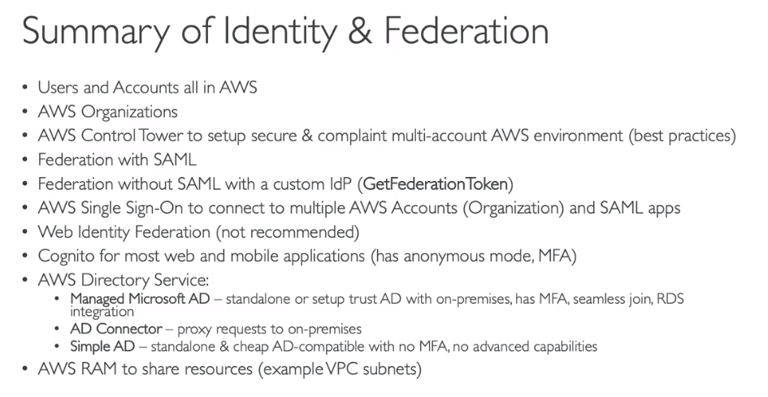

---

## IAM

- Escopo global, controle de acessos.
- Tem como base o princípio do menor privilégio possível.
- Criação de usuários e grupos de usuários; grupos não podem conter outros grupos.
- Atribuem-se políticas de acesso (**IAM Policy**) aos grupos, que concedem acesso a todos os usuários daquele grupo.
- **Access keys** usadas para conceder acesso ao AWS CLI e ao AWS SDK.
  - É possível usar um serviço de Shell na nuvem (**Cloud Shell**) que gera um CLI sem a necessidade de configurar uma access key.
- **Roles (funções)**
  - Usadas para conceder acesso de recursos a recursos (exemplo: acesso ao S3 por um EC2).
  - Criação de roles que dão acesso a recursos sem necessidade de atribuí-las a um usuário ou grupo.
  - Podem ser assumidas por recursos, usuários federados ou usuários de outras contas AWS.
  - Quando se assume uma role, as permissões que o usuário tinha antes são sobrescritas, ou seja, ele só terá acesso às permissões da role.
- Dentro do **IAM**, temos:
  - **IAM User** - Usuário comum.
  - **Federated User** - Usuário de fora da organização, como um usuário do **Facebook**, por exemplo.
  - **IAM Role** - Permissões dadas a recursos, como um EC2 para acessar um S3.
  - **Identity Provider (IdP)** - Permite acesso customizado a provedores de terceiros e libera acesso via token do STS.
- **IAM Policies** - Políticas de acesso (permissões).
  - Seguem a regra do menor privilégio.
  - A validação de acesso é feita automaticamente a cada requisição.
  - Podem ser do tipo:
    - **Identity-based** - Políticas destinadas a usuários, grupos e roles.
    - **Resource-based** - Políticas atribuídas a recursos para conceder acesso a outros recursos. Ao usar esse modelo em vez de uma role, o usuário não perde os acessos que já possuía.
  - São escritas em JSON e contêm os campos: `Effect`, `Action`, `Resource`, `Condition`, `Policy Variables`.
  - **Access Advisor** - Permite visualizar as permissões e a última vez que foram utilizadas.
  - **Access Analyzer**
    - Permite analisar quais recursos são compartilhados com entidades externas, como buckets S3.
    - Permite definir uma **Zona de Confiança** com contas ou organizações. O que estiver fora dessa zona terá o acesso sinalizado.
    - Além disso, há um validador de policies:
      - Valida as melhores práticas de escrita de policies.
      - Dá sugestões sobre erros, alertas e segurança.
    - Também é possível gerar policies automaticamente.
      - O **AWS Access Analyzer** pode ler os logs do **CloudTrail** e gerar policies com permissões refinadas.
  - **Tags e variáveis**
    - Permitem criar policies com recursos genéricos.
- **IAM Policy Conditions**
  - Permitem adicionar condições nas políticas de acesso da AWS.
  - Operações que podem ser usadas nas condições:
    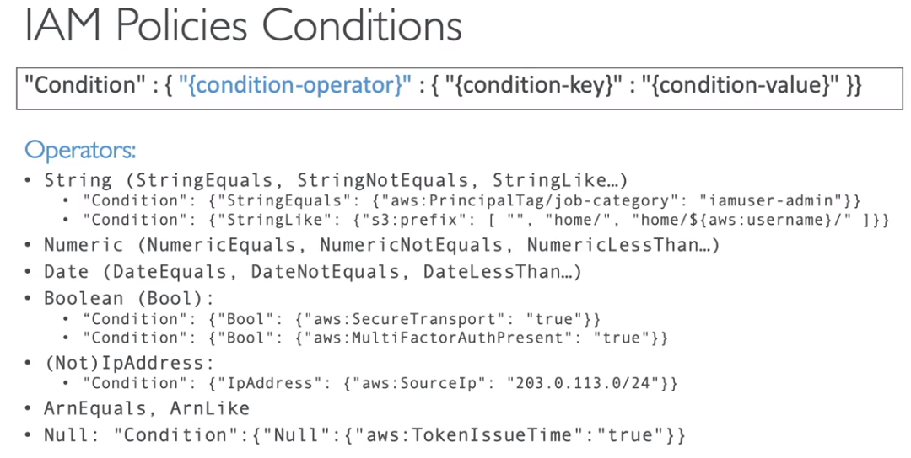
- **IAM Permission Boundaries** (limite de permissões)
  - Ao criar usuários ou **roles**, é possível conceder permissões genéricas (por exemplo, administrador) e definir um **limite** para essas permissões. Exemplo: um usuário pode ser administrador apenas em recursos do S3.
  - Suportado apenas por usuários e roles (não por grupos).
  - **SCP (Service Control Policies)**.
    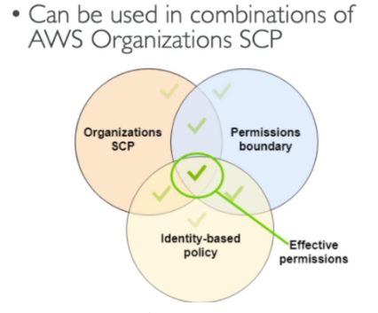
    **Lógica da avaliação de política:**
    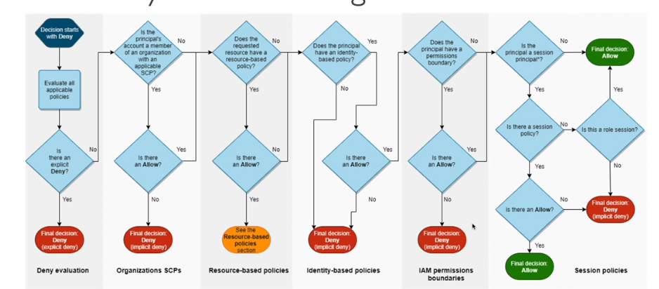

### MFA (Multi-Factor Authentication)

- Existem duas opções via ‘software’ (dispositivo MFA virtual, chave de segurança U2F, como **YubiKey**).
- Há uma opção de equipamento físico (exemplo: token **Gemalto**).

### IAM Security Tools

- **IAM Credential Report (nível da conta)** → Lista todas as contas de usuário e o status de cada uma.
- **IAM Access Advisor** → Mostra os serviços que o usuário tem acesso e a última vez que os utilizou.

### Recomendações básicas

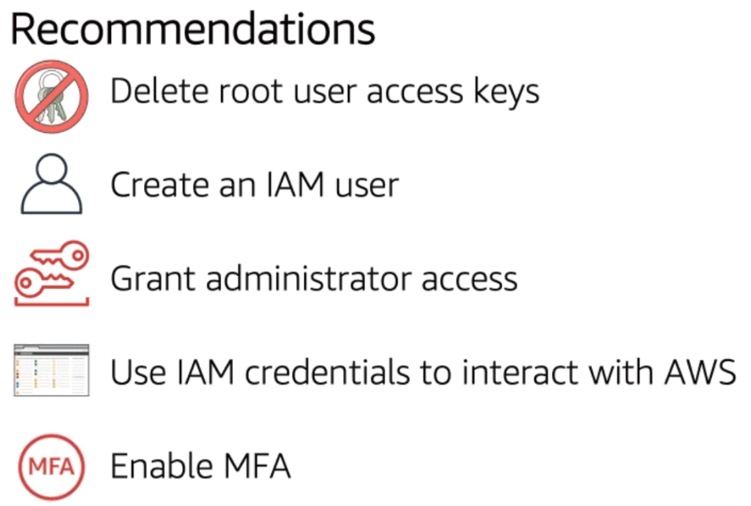

---

## STS

### Assume Role

- Criamos as roles e definimos os **principais** que podem acessá-las.
- Geramos credenciais temporárias, que geram um token válido de 15 minutos a 12 horas.
- Onde usar **Assume Role**:
  - Para conceder acesso temporário a usuários ou recursos em uma conta onde eles não têm acesso.
  - Para conceder acesso a usuários externos à organização (usuários federados).
- Permite revogar o acesso à role adicionando um novo bloco `Statement` ou usando o **AWSRevokeOlderSessions**.
- Lembrando que, ao assumirmos uma role, perdemos nossos acessos anteriores.

### Session Tags

- Muito utilizadas para usuários federados.

### APIs Importantes do STS

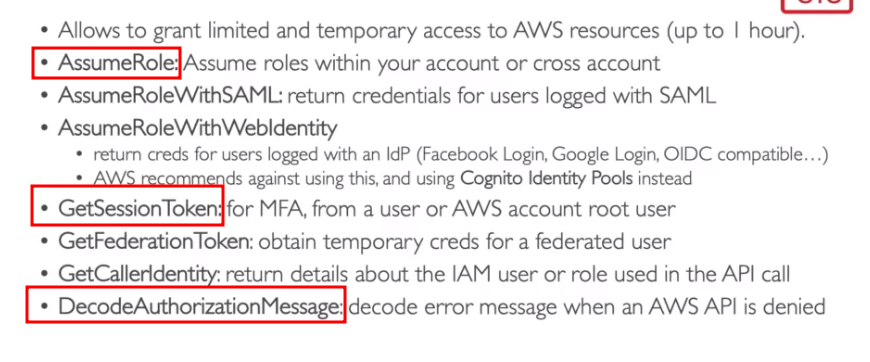

---

## Identity Federation & Cognito

### Identity Federation

- Permite conceder acesso a usuários externos para recursos na sua conta AWS.
- Não é necessário criar um usuário para isso.
- Casos de uso:
  - A empresa usa seu próprio sistema de identificação (exemplo: **Active Directory da Microsoft**).
  - Uma aplicação web precisa acessar recursos da AWS.
- Métodos de implementação:
  - **SAML 2.0**
    - Sigla para **Security Assertion Markup Language 2.0**.
    - Padrão aberto, compatível com vários provedores como o **Active Directory**.
    - **Requer a criação de uma relação de confiança entre o provedor e a AWS.**
    - Utiliza a API **AssumeRoleWithSAML**.
    - Hoje em dia, o **SSO** é mais recomendado por ser mais simples.
  - **Custom Identity Broker**
    - **Não é compatível com o SAML 2.0**.
    - Método mais antigo e menos recomendado.
  - **Web Identity Federation com ou sem Cognito**.
    - **Sem Cognito:**
      - Não recomendado.
    - **Com Cognito:**
      - Método recomendado.
      - Cria uma role com o menor privilégio possível.
      - Estabelece uma relação de confiança entre o provedor de identidade e a AWS.
      - **Vantagens:**
        - **Suporta usuários anônimos.**
        - Suporta **MFA**.
        - **Sincronização de dados**.
      - Uma vez concedido o acesso, criam-se policies configuradas com variáveis que restringem o acesso ao usuário apenas ao que foi designado para ele.
  - **Single Sign-On (SSO)**

---
### AWS Directory Service

Forma de usar o **Active Directory** na AWS.

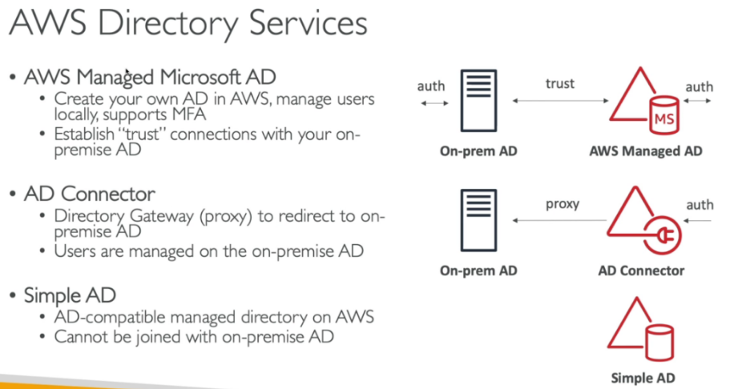

---

**AWS Managed Microsoft AD**
- É possível configurar o **Active Directory (AD) em mais de uma VPC.**
- **EC2 Windows**
  - Nele, podem ser executadas aplicações que utilizam o AD, como o **SharePoint**.
- **Integrações**
  - Pode ser integrado com **RDS para SQL, AWS Workspaces e QuickSight**.
  - Pode-se usar o **SSO** para fornecer acesso a aplicações de terceiros.
- Pode ser usado em conjunto com o **AD do ambiente on-premise**.
- Permite adicionar outros **Domain Controllers (DCs)** para escalabilidade.
- Possui **backups automáticos**.

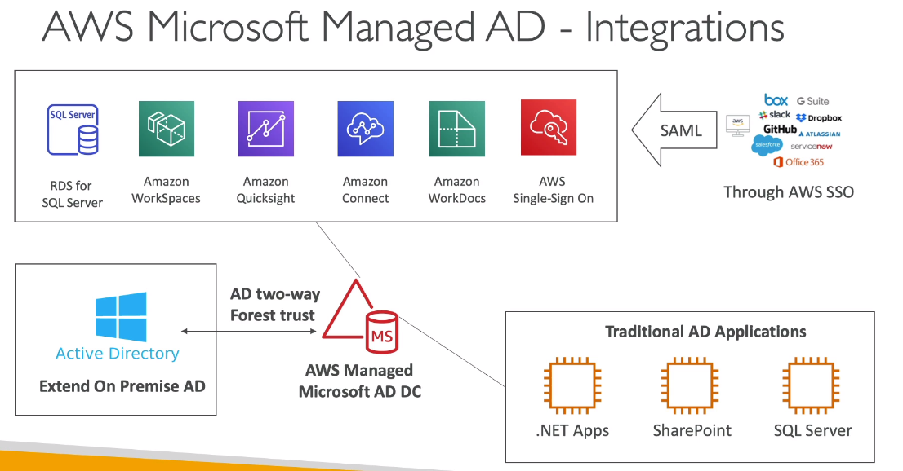

---

**Conectando ao AD no On-Premise**
- Deve-se estabelecer uma conexão via **Direct Connect ou VPN Connection**.
- A relação de confiança pode ser feita de três formas:
  - **One-Way Trust**  
    - AWS → On-Premise
  - **One-Way Trust**  
    - On-Premise → AWS
  - **Two-Way Forest Trust**  
    - AWS ⟷ On-Premise
- A relação de confiança **não envolve sincronização**. Ela apenas indica que o AD remoto é válido e confiável.
- **Replicação não é suportada.**

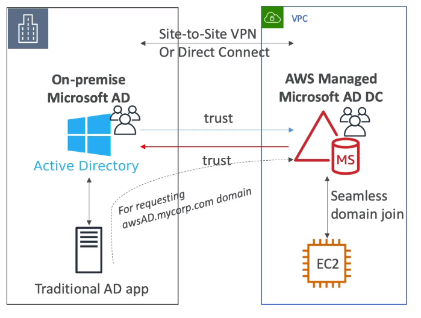

**Criando um Processo de Replicação na Nuvem**
- Para criar um **processo de replicação** do AD na nuvem, deve-se:
  - Instalar uma **réplica do AD em uma instância EC2**.
  - Criar a **relação de confiança com o AWS Managed AD**.

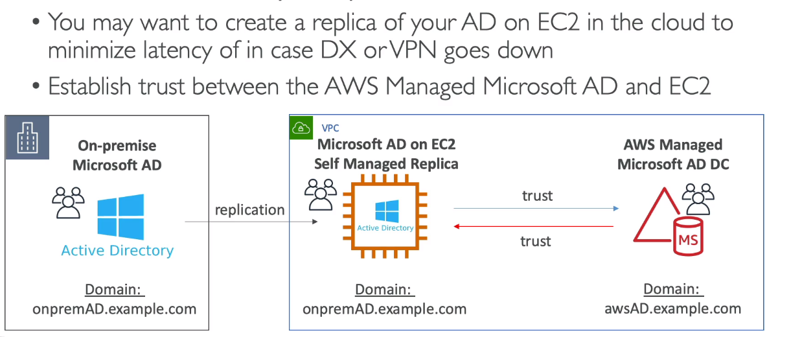

---

**AD Connector**
- Permite criar um **gateway para o AD no On-Premise**.

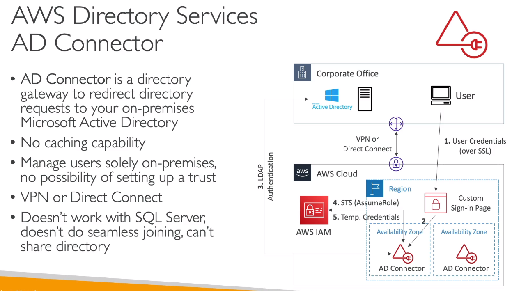

---

**Simple AD**
- Serviço básico de Active Directory oferecido pela AWS.

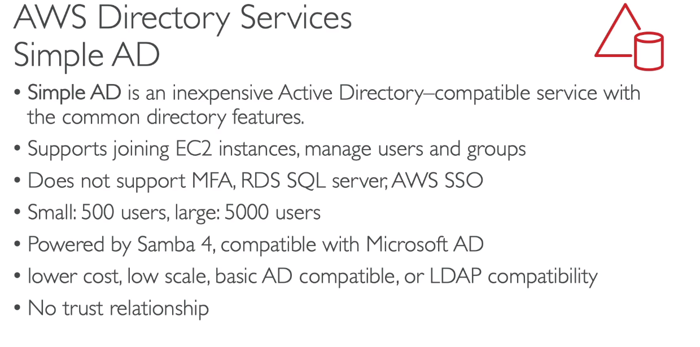

---

## AWS Organizations

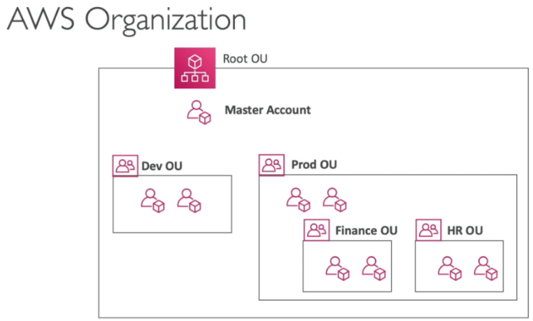

### Principais Recursos
- Consolida **múltiplas contas** em uma única estrutura organizacional.
- Permite **unificar a fatura** de pagamento e custos (**Consolidated Billing**).
- Centraliza **auditoria, monitoramento e segurança** em uma única conta.
- Há um **limite de 20 contas** por organização (esse limite pode ser aumentado via suporte AWS).
- Com **AWS Organizations**, é possível definir **políticas de acesso a recursos (SCPs)** aplicáveis às contas.  
  - **Exemplo:** se quiser que a conta de desenvolvimento não tenha acesso ao **Athena**, basta criar uma **SCP** restringindo esse serviço e aplicá-la na conta de desenvolvimento.
- Na AWS, quando falamos em permissões, o **DENY** sempre tem maior precedência que o **ALLOW**.  
  - **Exemplo:** se um recurso for negado na **OU Prod**, ele estará **negado** na **OU HR**, mesmo que uma política conceda acesso.

**Organização das Contas**
- As contas podem ser organizadas de diferentes formas:
  - **BU (Business Unit)** → Unidades de negócio (ex.: vendas, financeiro, cobrança).
  - **Ambientes** → Produção, desenvolvimento, homologação.
  - **Projetos** → Projetos específicos (ex.: Ultron, Mark 1, SpaceX).

**Role OrganizationAccountAccessRole**
- A role **OrganizationAccountAccessRole** permite que os usuários que a assumem tenham permissões administrativas dentro da conta.
  - Com ela, é possível criar novos usuários.
  - **Essa role é criada automaticamente ao criar uma conta dentro de uma OU.**  
    - **Porém, se a conta já existir e for adicionada à OU via convite, a role precisa ser criada manualmente.**

**Instâncias Reservadas e Economia**
- Se houver um plano de **instâncias reservadas**, ele pode ser utilizado por qualquer **conta dentro da organização**.
  - Isso permite uma grande economia, pois a instância reservada estará sempre em uso.
- Com **AWS Organizations**, é possível gerenciar **contratos de instâncias reservadas** e **Savings Plans** de todas as contas associadas.

**Migrando uma Conta para Outra Organização**
1. **Remova a conta** da organização antiga.
2. **Envie um convite** para a nova organização.
3. **Aceite o convite** na conta migrada.

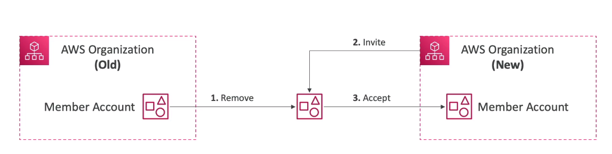

---

### Service Control Policies (SCP)

- Define **lista de ações permitidas ou bloqueadas** no IAM.
- Aplicável a **OUs e Contas**.
- **Não se aplica** à conta de gerenciamento.
- **Afeta todos os usuários e roles** de uma conta, incluindo o **usuário Root**.
- **Não se aplica a roles que interligam serviços** (ex.: roles que integram com **AWS Organizations**).
- Por padrão, **não permitem nada**, exigindo permissões explícitas.

**Casos de Uso**
- **Restringir acesso a serviços em uma conta ou OU.**  
  - Exemplo: bloquear o uso do **EMR**.  
  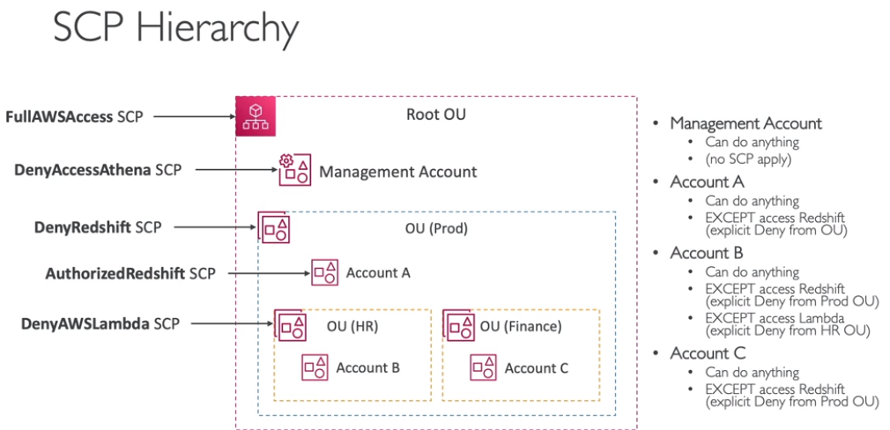

- **Exigir que os usuários adicionem tags nos recursos.**  
  - **Exemplo:** Restringir o uso de certas tags por usuários.  
    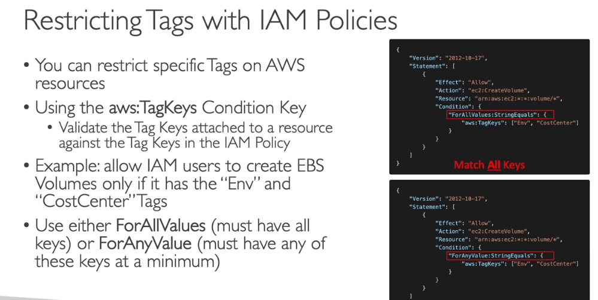
  - **Obrigar o uso de tags para criar recursos** (sem tags, a criação será bloqueada).  
    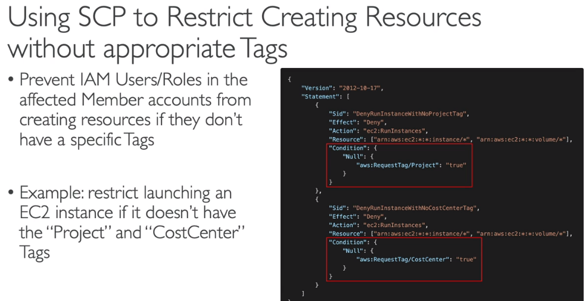

### Tag Policys

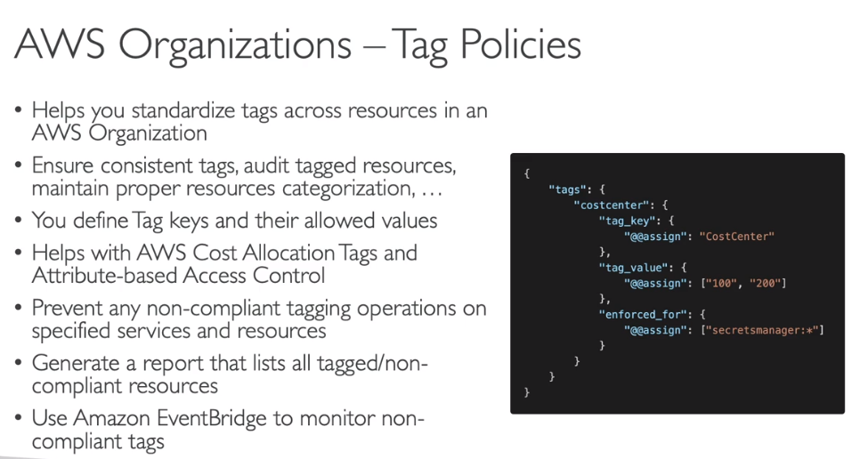

### AI Services

- A AWS usa seus dados para Melhorar a IA, caso queira desabilitar essa funcionalidade deve se criar uma police.
  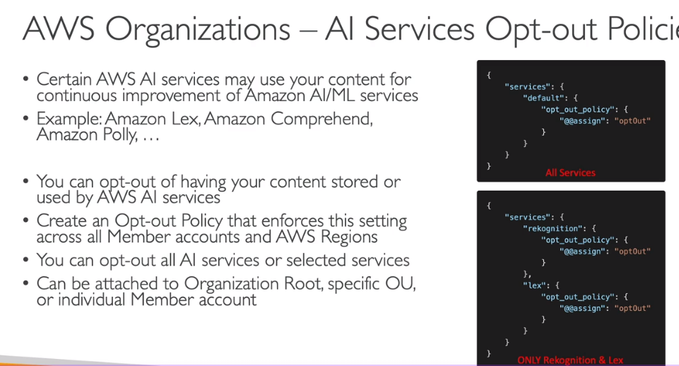

---

### Backup police

- Permite criar regras de backup
  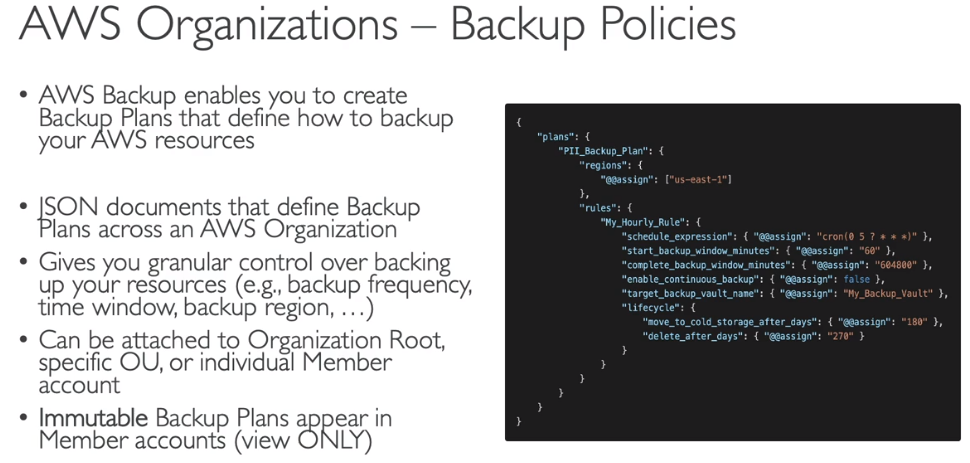

---

## AWS IAM Identity Center

**Sucessor do AWS Single Sign-On (SSO).**  
  - **Um único login** para acessar **todas as contas** da sua organização na AWS.  
  - Permite acesso a **aplicações de terceiros**, como **Salesforce** e **Office 365**.  
  - Compatível com **aplicações que suportam SAML 2.0**.  
  - Pode ser utilizado para login em **instâncias EC2 com Windows**.  

**Integração com Provedores de Identidade (IdP)**  
  - Permite integração com **Active Directory (AD)** ou outros provedores de identidade.  
  - Possibilita a **gestão centralizada de usuários e grupos** dentro da AWS.  

**Arquitetura do AWS IAM Identity Center**
- O serviço permite criar uma **estrutura organizada de usuários e grupos** dentro da AWS.  
  - **Facilita o gerenciamento de permissões e acessos** em múltiplas contas.  

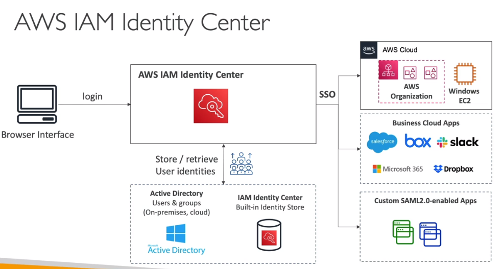  
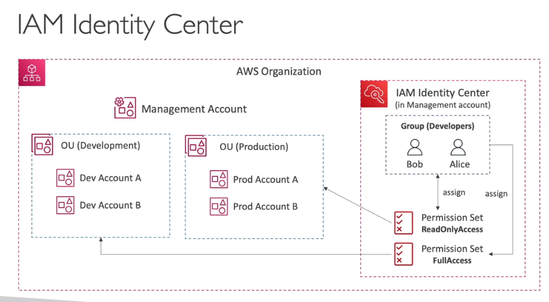

---

## AWS Control Tower

## AWS IAM Identity Center

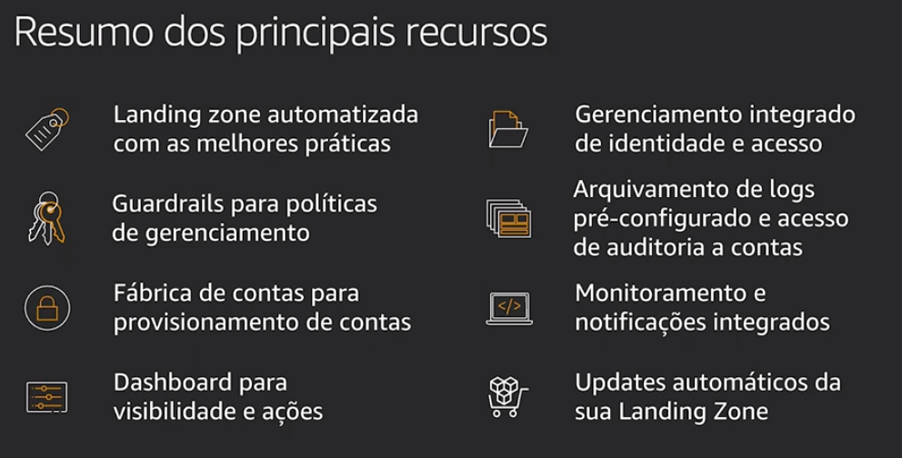  
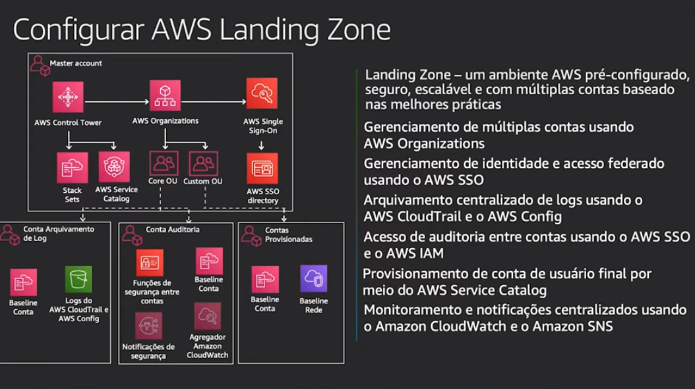  
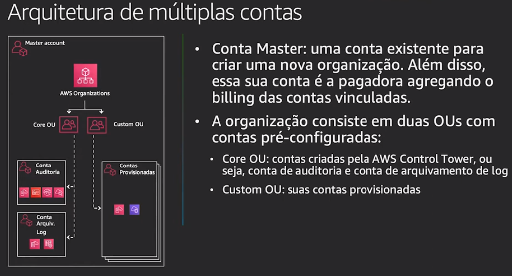  

**O que é o AWS IAM Identity Center?**
- É uma **maneira simplificada e eficiente** de configurar e governar um ambiente **seguro e compatível** para múltiplas contas AWS, seguindo as **melhores práticas recomendadas**.

**Landing Zone**
- **Conjunto de boas práticas recomendadas pela AWS.**  
- Permite configurar um ambiente seguro, escalável e segue padrões recomendados.  
- **Control Tower** é o serviço AWS que ajuda a implementar uma **Landing Zone** de forma automatizada.

**Benefícios**
- **Automação simplificada** → Configuração do ambiente em poucos cliques.  
- **Aplicação de políticas de governança** usando **guardrails** (regras pré-configuradas).  
  - **Aplicadas no nível de Organização (OU).**  
  - **Tipos de guardrails:**  
    - **Preventivos** → Utilizam **SCPs** (Service Control Policies) para **desativar recursos** ou **bloquear ações indesejadas**.  
    - **Detetivos** → Utilizam **AWS Config** para validar se as configurações das contas estão corretas.  
      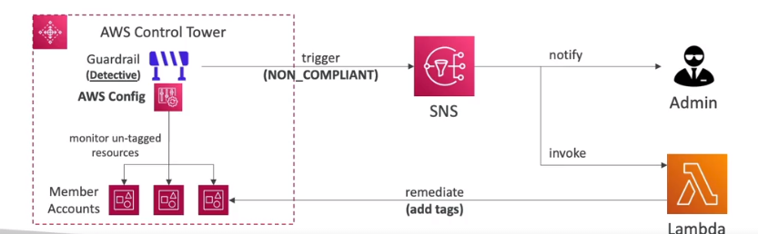  
  - **Níveis de guardrails:**  
    - **Mandatórios** → Obrigatórios, geralmente relacionados à segurança (ex.: desabilitar acesso a determinado recurso).  
    - **Fortemente Recomendados** → Baseados em boas práticas (ex.: criptografar dados do **EBS**).  
    - **Eletivos** → Definidos pela empresa para um propósito específico (ex.: padronização de nomes no **S3**).  
      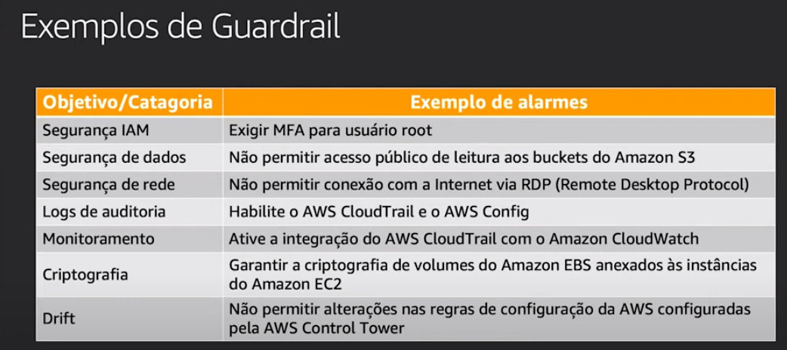  

- **Monitoramento e Correção Automática**  
  - Detecta **violações de políticas** e pode corrigi-las automaticamente.  
  - Permite monitorar a conformidade do ambiente por meio de um **painel de controle interativo**.  

**Fábrica de Contas**
- Permite a **criação e configuração automatizada de novas contas AWS**.  
- Define como serão configurados os **recursos da conta** (ex.: **VPC, Security Groups**).  
- Utiliza **AWS Service Catalog** para provisionar novas contas.  
  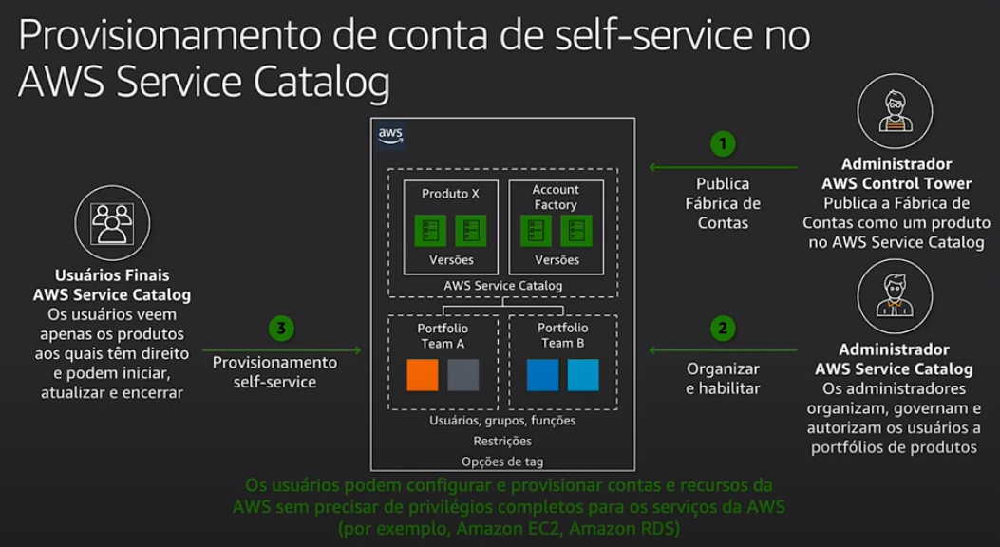  

**Como funciona a automação de novas contas?**
- O processo de criação e configuração das contas pode ser **totalmente automatizado**, garantindo conformidade e segurança desde o início.  
  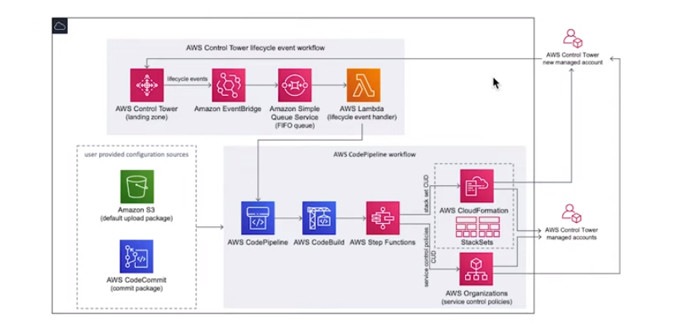  

---

## AWS Resource Access Manager (RAM)

  

### O que é o AWS RAM?
- O **AWS Resource Access Manager (RAM)** permite **compartilhar recursos** entre contas na mesma **AWS Organizations**.  
- **Benefícios:**  
  - **Evita duplicação de recursos**, reduzindo custos e complexidade.  
  - **Mantém o controle** → Somente o dono do recurso compartilhado pode excluí-lo.  

---

### Recursos que podem ser compartilhados no AWS RAM
A seguir, alguns dos recursos que podem ser compartilhados entre contas AWS:  

- **AWS App Mesh** → Serviço de malha de serviços para comunicação segura entre microsserviços.  
- **Amazon Aurora** → Banco de dados relacional totalmente gerenciado, compatível com MySQL e PostgreSQL.  
- **AWS Certificate Manager Private Certificate Authority (ACM PCA)** → Gerenciamento e emissão de certificados privados.  
- **AWS CodeBuild** → Serviço de compilação e testes contínuos para desenvolvimento de software.  
- **Amazon EC2** → Serviço de computação na nuvem para executar servidores virtuais.  
- **EC2 Image Builder** → Automatiza a criação e manutenção de imagens seguras do Amazon Machine Image (AMI).  
- **AWS Glue** → Serviço de ETL para integração e transformação de dados.  
- **AWS License Manager** → Gerenciamento centralizado de licenças de software na AWS.  
- **AWS Network Firewall** → Firewall gerenciado para proteger redes VPC.  
- **AWS Outposts** → Infraestrutura AWS em data centers locais para ambientes híbridos.  
- **Amazon S3 on Outposts** → Armazenamento de objetos do S3 disponível em ambientes locais usando AWS Outposts.  
- **AWS Resource Groups** → Organização e gerenciamento de recursos AWS por grupos lógicos.  
- **Amazon Route 53** → Serviço de DNS escalável e altamente disponível.  
- **AWS Systems Manager Incident Manager** → Gerenciamento de incidentes e resposta a falhas.  
- **Amazon VPC** → Serviço para criação de redes virtuais privadas na AWS.  
