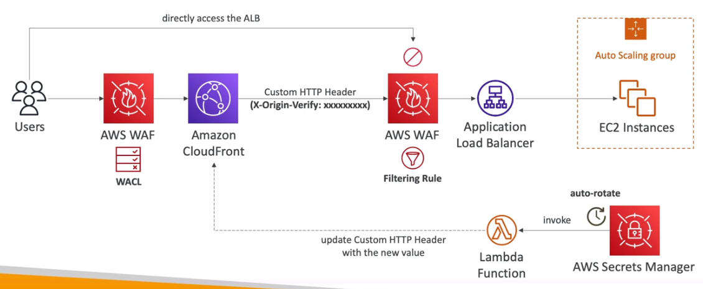
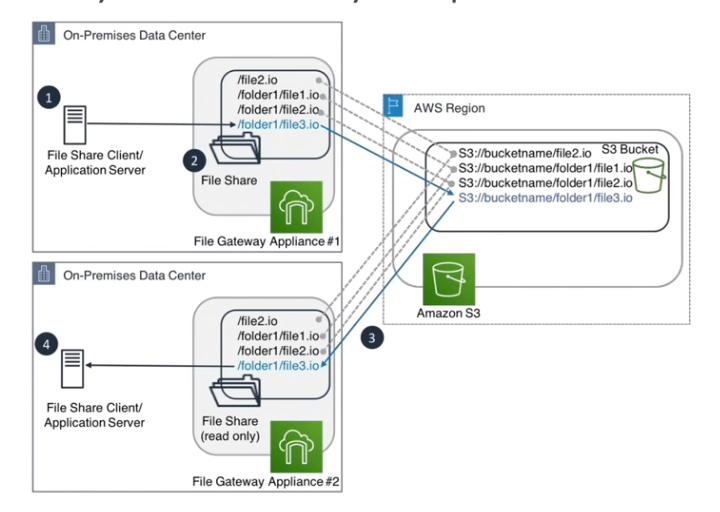
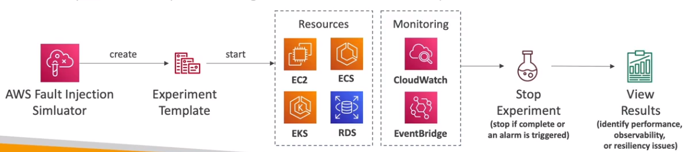
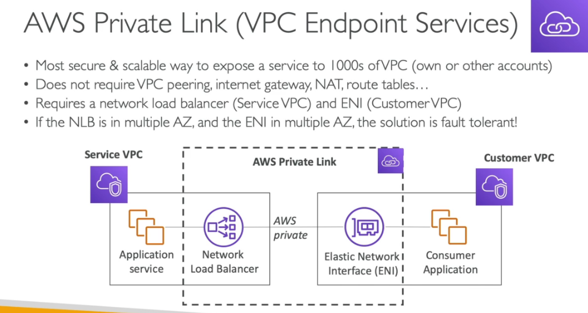
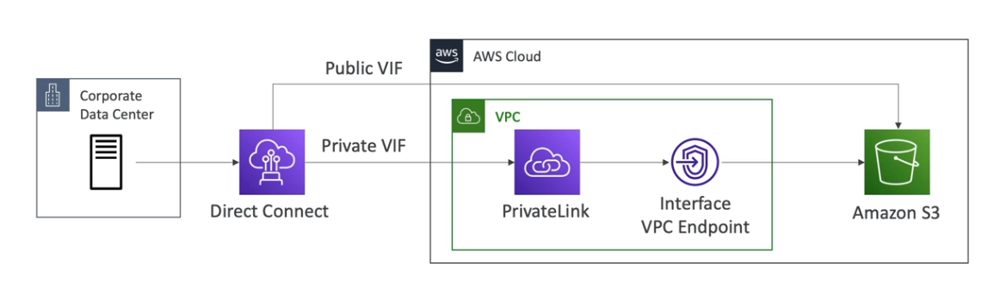
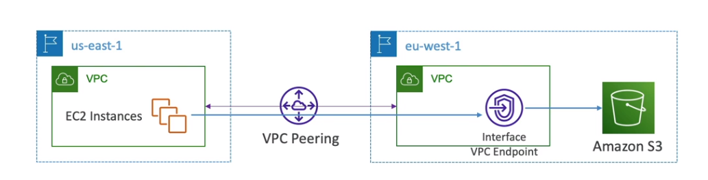
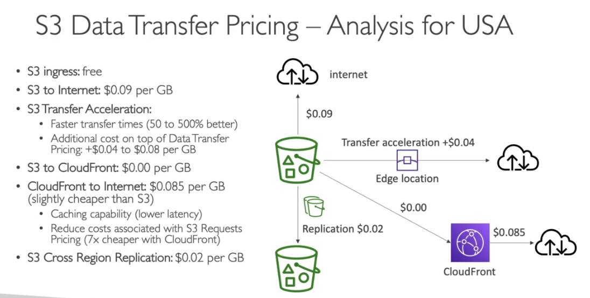

### AWS Accounts and Organizations

#### AWS Organizations

- Há um limite de 20 contas por organização.
- Role **OrganizationAccountAccessRole**  da permissão de admin dentro das  contas da organização
  - Essa role é criada automaticamente quando se cria uma conta dentro de uma OU. Porém caso a conta já exista e esta convidando ela pra a OU é necessário criá-la manualmente..

- Permite compartilhar instancias reservadas com as contas

##### Service Control Policies (SCP)

- É aplicada para todos os usuários e Roles de um conta incluindo usuário Root.
- **Não se aplicam a roles que interligam serviços**, ou seja não se aplicam para roles que integra com o AWS Organization.
- Devem ter permissões explicitas, e por padrão não permitem nada.
- São herdadas numa estrutura de OUs. 
  - Ha duas estrategias que se pode usar:
    - **Deny List**  - Tudo liberado e crias SCP para negar as coisas. - **Default**
      - Cria se um SCP que libera tudo e outras que vão negando.
    - **Allow List** - Criar se SCP para liberar resursos especificos
- Na police pode ser usar as condicions:
  - **awsTagKeys** - Para informar quais tags podem ser passadas.
  - **aws:RequestTags/&lt;tagname&gt;** - Para obrigar que uma tag seja passada.

##### Tag Polices

- Permite configurar os valores possiveis de tags e quais recursos podem recebe-las. ou seja padronizar o uso de tag
- Usa se o eventbrigde para monitorar tags fora de compliance

##### AI Services

- A AWS usa seus dados para Melhorar a IA, caso queira desabilitar essa funcionalidade deve se criar uma police.

##### Backup police

- Permite criar regras de backup, que devem ser respeitas pelas contas
- Pode ser adicinadas a OU ou a contas.
- Descrever janelas de backups, frequência, região;

---

#### AWS Control Tower

- Permite configurar e governar um Múltiplas contas AWS para seguir praticas recomendadas.
- Não se aplica a conta de gerenciamento nem ao usuario root.
- Permite criar **Landing Zone** - Conjunto de contra que seguem um padrão de configuração / regras de como deve se comportar (em qual região pode operar).
- Permite aplicar política usando **guardrails** (regras de governança pre-configuradas).  Aplicado em nível de OU.
  - **Preventivo**, usando SCPs, desabilitando recursos, o bloqueando ações.
  - **Detectivo**, Usando AWS Config, para validar se as configuração da conta esta de acordo.
    - Usa o **AWS Config** para validar se esta fora da compliance, caso esteja usa uma lambda para realizar alterações (tipo remover porta aberta, que não é permitido), ou para enviar notificações via SNS.
- **Fabrica de contas** - Permite criar novas contas e  configurar como serão os recursos da conta, como VPC, Security Groups. Usa **AWS Service Catalog** para provisionar novas contas.

---

### Identity Management and Permissions

#### IAM

- Dentro do **IAM** temos:

  - **iam user** - Usuário comum.
  - **federated user** - usuário de fora da organização, usuário do **Facebook** por exemplo.
  - **iam role** - permissões que são dadas a recurso, tipo EC2 para acessa um S3. Pode ser assumida por usuarios (usando STS) ou recursos
  - **identity provider (idp)** - Permite customizado acesso provider de terceiros e liberara acesso via token de acesso do STS.

- **IAM Polices** - Políticas de acesso (permissões).

  - A validação de acesso é feita a cada acesso, de forma automática. Podem ser do tipo:
    - i**dentity-based** - Política que são destinados a usuário / grupos e rules
    - **resource-based** - Políticas que são atribuídas a recursos, para da acesso a outro recursos. Ao usar isso ao invés de uma role, o usuário não perde os acesso que tinha.

- **Access Advisor** - Permite ver as permissões e a ultima vez que foi usada.

- **Access Analize** 

  - Permite analisar quais recursos são compartilhada com entidades externas, ex buckets.

  - Permite definir uma Zona de confiança com as contas ou as organizações que confia. O que estiver fora dessa Zona terá o acesso sinalizado

  - Pode ler logs de do CloudTrail e gerar polices com permissões granuladas.

- **Polices com variaveis e tags**

  - Permite criar politicas genéricas e usar tags para definir condições para os recursos.

  

  

  

#### **IAM Permission Boundaries**

- Quando se criar usuário ou **Roles** e possível dar **permissão genéricas,** tipo de administrador , e setar um **limite** para essas permissões, exemplo o cara é administrado apenas nos recursos do S3.

- Suportado apenas por usuários e roles (Não grupos).

#### IAM Security Tools

- **IAM Credencial Report (Account level)** -> Lista todas as contas de usuário e o status de cada uma.
- **IAM Access Advisor** -> Mostras os serviços que o usuário tem acesso e a ultima vez que o mesmo acessou.

---

#### STS

- Serviço de geração token para acesso validos de 15 minutos a 12 horas.
- Fornece uma api chamada **assumeRole**, que é usada para assumir outras roles.

- Cria se uma police do tipo **Trust Police** com a ação assume role, e com a principal a que se confia.
- 

- Lembrando que quando assuminos uma Role, perdemos nossos acessos anteriores.
- Permite revogar o acesso a role adicionando um novo bloco de statement ou usando o **AWSRevokeOlderSessions**.

- **Usando em cross acount**

  

  - Cria se um relação de confiança com a outra conta.
  - Pode gerar um external ID (segredo entre a conta e a conta externa) para a outra conta.
  - Configura uma assume Role com esse ID. para mais segurança
  - Mas é possível configurar apenas com o ID da conta externa.

- **Session Tags**

  - Usado para segregar acessos, assim quem assume a role é obrigado a passar a tag de sessão para acessar o determinado recurso.

- **APIs importantes**

---

#### ACM

- Serviço **regional**, não é possível copiar certificados entre regiões
- Caso queira usar global cada região deve ter seu próprio certificado
- Usado em ELB, API Gateway e Cloud Front

#### SNI - Sever Name Indication

- **Ele requer que seja passado o hostname do servidor destinatário, para iniciar o processo de handshake.**
- Funciona apenas com **ALB e NLB** da nova geração e com o **CloudFront**.

#### S3 Encryption for Objects

- **SSE-S3** - Criptografa os objetos do S3 usando chave gerenciada pela AWS (AES-256).
  - Usada para todos os dados no Glacier

- SSE-KMS - Criptografa os objetos do S3 usando chaves criadas no KMS.

  - As chamadas de uso do KMS é logado no cloudtrail.
  - **Caso esteja usando essa criptografia, se o bucket for publico, o usuário não vai conseguir ver os objetos**, pois ele não vai ter acesso a chave.
  - Para conseguir realizar uploads no bucket, precisa ter acesso a permissão (kms:GenerateDataKey) caso contrario não vai conseguir.

- SSE-C - Criptografa os objetos do S3 usando a chave gerenciada pelo usuário, quando se usa por exemplo o Cloud HSM

- Criptografia Client-Side - Quando o usuário criptografa os dados antes de enviar ao S#.

### S3 - Security

1. Forma de acesso ao bucket e aos objetos contido nele.

- **Baseada em usuários** (user based) - diz-se que para ter acesso precisa ter permissão via IAM Console, ou seja toda chamada de API é validada junto ao IAM.
- **Baseada em recurso** (Resource based)
  - **Bucket Polices** 
    - Regras de acesso ao bucket, permite outros recurso e outras contas a ter acesso.
    - Escrita em json.
    - Pode ser usada para dar acesso publico ao bucket.
    - Pode ser usada para foçar o uso de criptografia,
    - Pode ser usada para dar acesso a cross account.
    - Pode se usar as condições:
      - **SourceIP** - Para validar se o IP é publico ou elástico
      - **VpcSourceIp** - Para validar se o IP é privado (isso considerando um VPC endpoint)
      - **Source VPC** ou **Source VPC Endpoint** - permite trabalhar com VPC endpoints
        - Permite filtrar o acesso para apenas aqueles que usaram um determinado VPC endpoint ou range de IPs.
      - **ClouldFront Origin Identity** - Permite que apenas o cloudFront acesso a bucket.
      - **MFA** - Permite usar para exclusão de dados
  - **Object Access Control List (ACL)** - Define a lista de acesso de cada objeto armazenado (nível mais baixo).
  - **Bubcket Access Control List (ACL)** - Define a lista de acesso de cada **bucket** (menos comum de ser usado);

### Vault Lock e S3 Object Lock

- **Vault Lock** -
  - Adota o WORM (Write Once Read Many)
  - Permite configurar para que arquivos nunca seja delatados ou alterados, usado em compliance.
- **S3 Object Lock** 
  - Semelhante ao anterior, mas permite configurar a retenção do objeto, por exemplo o arquivo não pode ser modificado por 30 dias, o a nota fiscal não pode ser apagada por 5 anos.
  - Adota o WORM (Write Once Read Many)

### S3 Access Points

#### S3 Multi-Region Access Points

- Permite criar um access point global, que redireciona o trafico de acesso para o bucket na região mais proxima.
- A ideia e se ter buckets replicados em cada região e através de um Access Point acessa-lo, assim diminuindo a latência.
- Usado em cenários de faillover, (ativo-ativo ou ativo-passivo).

#### Soluções com WAF

- Usando WAF pra acessa ALB apenas pelo Cloud Front. Usando o Secrets Manager para gerar novos valores para o header e atualiza-los via Lambda.

---

### AWS Firewal manager

- Permite gerenciar regras de todas as contas AWS de forma centralizada.
- Tem regras comuns de segurança.

- Diferenças entre WAF e AWS Firewal manager e AWS Shield
  - WAF usado para proteção em nivel de aplicação (camada 7).
  - AWS Shield usado para proteção  contras DDos ( camada 6 e 4 (rede e transporte)).
  - AWS Firewal manager usado para centralizar regras, permite aplicar o WAF e SHIELD em varias contas.

### AWS Guard Duty

- Serviço de inteligência artificial para detectar anomalias na sua conta.
- **É um serviço regional.** 

- é um serviço inteligente de detecção de ameaças que monitora continuamente suas contas da AWS, instâncias do Amazon Elastic Compute Cloud (EC2), clusters do Amazon Elastic Kubernetes Service (EKS) e dados armazenados no Amazon Simple Storage Service (S3) para atividades maliciosas sem o uso de software ou agentes de segurança. 
- Se for detectada atividade maliciosa em potencial, como comportamento anômalo, exfiltração de credenciais ou comunicação de infraestrutura de comando e controle (C2), o GuardDuty gera descobertas de segurança detalhadas que podem ser usadas para visibilidade da segurança e assistência na correção.
- O GuardDuty pode monitorar atividades de reconhecimento por um invasor, como atividade incomum de API, verificação de porta intra-VPC, padrões incomuns de solicitações de login com falha ou sondagem de porta desbloqueada de um IP ruim conhecido.

---

### EC2

**EC2 Nitro** - nova tecnologia de virtualização adotada pela AWS,

- Melhora o uso da rede. Melhora o **IOPS** (Input/output operations per second) dos armazenamento **EBS**.

**EC2 Graviton**

- Entregam o melhor performance em relação ao custo. Sendo 46 % mais em contas em comparação com a 5 geração.

- **Placement Groups** - Grupos de Posicionamento

  - Permite decide a estratégia posicionamento das instâncias EC2. ou seja onde vai ficar as instâncias de vai ser:

    - **Cluster** - Todas ais instâncias ficam juntas, tem baixa latência, mas ficam numa única AZ. (alta performance, mas tem um alto risco).
      - Boa escolha quando se tem instâncias com rede otimizada (enhanced Networking).
      - Usados para jobs de processamento rápido de BigData e aplicação que precisam de baixa latência de rede

    - **Spread** - (espalhadas) As instâncias ficar  espalhadas em servidores em diferentes AZ, com uma máximo de 7 instâncias por grupo por AZ. Usados em aplicações criticas.
      - Baixo risco que indisponibilidade.

    - **Partition** - Similar ao **Spread**, mas as instâncias ficam espalhadas em diferentes partições (conjunto de Racks) numa AZ. Pode escalar para centenas de instâncias por grupo, usadas com o Hadoop, Kafka, Cassandra.
      - Pode ter ate 7 partição por AZ, e centenas de instâncias.
      - As partições não compartilham o mesmo hack.
      - Se a partição falhar todas as maquinas são perdidas.
      - As instâncias podem compartilhar dados da partição vias EC2 Metadata.

- **Metricas**

  

  ### Tipos de instâncias

  - https://aws.amazon.com/pt/ec2/instance-types/

  

  

  ### Alta performance computacional HPC

  - Serviços que ajudam ter alta performance na AWS:

    - **Transferência de dados**

      - **AWS Direct Conect** - Permite mover GBs de dados para a cloud.
      - **SnowBall e SnowMobile** - Pemite mover PB de dados para a cloud.
      - **AWS DataSync** - Permite mover grandes quantidade de dados do on-primeses para cloud .(usando S3, EFx, Fxs for Windows)

    - **Computação**

      - **Instâncias EC2**
        - Com CPU otimizada ou GPU otimizada.
        - spot instances / Spot Fleets para economia + auto scaling.
      - **EC2 Placentament Groups** - Permite usar um conjunto de maquinas  (cluster) num mesmo **rack** ou região o que diminui a latência..
        - **EC2 Enhanced Networking  SR-IOV** (Rede aprimorada para EC2) 
          - Interface de rede para HPC.
          - Alta banda, Alto PPS (pacotes por segundos), baixa latência.
          - Opção 1: **Elastic Network Adapter** (ENA) aumenta a capacidade para 100Gbps.
          - Opção 2: Intel 82599 VF para 10 GBs - Antiga não usado mais
        - **Elastic Fabric Adapter** (EFA)
          - Interface de rede usada para HPC no Linux com foco.
          - Melhora a ENA para Alta HPC, apenas para linux.

    - **Armazenamento**

      - **Ligado na instância**
        - **EBS** - Escala ate 256,000 IOP with io2 Block express.
        - **Instance store** - escala para milhões de IOPS, mas é perdido quando a instância desliga.
      - Na rede
        - **S3** - Armazenamento de objetos.
        - **EFS** - Escala IOPS baseado no tamanho total, ou IOPS provisionado .
        - **FSx for Lustre** - FileSystem otimizado para HPC usando linux.

    - **Automação e Orquestração**

      - **AWS Batch** - para trabalhar com jobs e agendamentos.

      - **AWS ParallelCluster**
        - Ferramenta Open Source para deploy e gerenciamento de cluster HPC.

---

---

### Amazon EKS

- Custo de **$0,1** por hora por cluster kubernete ($75 por mês) mais os recurso (EC2, EBS).
- Tipos dos nodes
  - **Gerenciados pela AWS**
  - **Gerenciado pelo cliente** 
  - **AWS Fargate**

- Volumes 
  - Usa se o **CSI (Container storage interface)**
  - Suporta:
    - **EBS**
    - **EFS (quando usando Fargate)**
    - **FSx for Lustre**
    - **Fsx for NetApp ONTAP.**

- É possivel rodar o EKS no On-primeses usando o **EKS AnyWhere**
  - Pode se usar uma imagem da Amazon customizada do Kubernets (AMI), rodando localmente.
  - Pode se conectar o **EKS do On-primeses a AWS** usando EKS **conector**.
  - Usado quando se quer diminuirá a latência, ou por demanda regularizaria. exemplo os dados governamentais do Chile deve ficar no Chile, Roda em um datacenter conectado a AWS.

---

### AWS Lambda

- Tem de **128 MB** ate **10 GB** de memoria que pode ser usado.

- Tem escopo regional.

- Pague por **milissegundo** usado para executar o código.

- Tempo de execução de ate **15 minutos.**

- Cobrado de 100 em 100 milissegundos de uso.

- Faz escalonamento horizontal e pode ter **ate 999 execução simultâneas.**

- **Triggers**

  - API Gateway

  - Kinisis

  - DynamoDB Data Streams

  - S3 events

  - EventBridge

  - SNS, SQS

  - Cloud Watch Logs

  - AWS Cognito

- Limitações

  - **Execução**
    - Alocação de memoria - 128MB - 10GB.
    - CPU - Linkado a memoria ram **(Não é possivel alterar)**
      - 2vCPU - 1,719 MB de RAM
      - 6vCPU - 10,240 MB de RAM
    - Tempo de execução - ate 15 minutos.
    - Variáveis de ambiente - **ate 4KB.**
    - Espaço em disco (no container do Lambda) - **10 MB.**
    - Execuções simultâneas da mesma Lambda - **1000 (Pode ser alterado com solicitação).**
    - Tamanho do paylod **6MB (Sync) / 256 KB (async)**
  - **Deploy**
    - Tamanho do pacote zippado com a função lambda - 50MB.
    - Tamanho do pacote com a função lambda - 250MB.
    - Tamanho da imagem - 10 GB

- Lambdas@Edge

  - É possível executar Lambdas em ponto de presenças, para auxiliar itens relacionados ao CDN , Route 53 ....

    

---

### AWS App Runner

- Serviço gerenciado pela AWS que facilita o deploy de aplicações web ou API em escala.
- Não necessita conhecimento de infraestrutura para usar.
- Pode se iniciar apenas com o source code ou a imagem do container.
- Automaticamente compila e deploya a aplicação.
- Automaticamente escala e configura alta disponibilidade e load balancer e criptografia.
- Tem suporte a acesso a VPC.
- Permite uso de banco de dados, cache e mensageria.
- Semenhante a idea do heroku.

---

### Amazon API Gateway

Limitações

- **Timeout de 29 segundos.**
- Tamanho do payload de no **máximo 10 MB.**

**LOGs**

- Possivel enviar os logs para o **Cloud Watch** com os niveis ERRO e INFO
- Pode logar o request e response completos.
- Pode enviar os logs de acessos de forma customizada
- Pode ser enviados diretamente para o **Kinesis Data Firehose** como alternativa.
- Metricas
  - São envidas com base nos **stages**, há possibilidade de envio de métricas detalhadas.

- X-Ray
  - Pode se habilitar o tracing para recuperar informações sobre as requisições.
  - Pode se cria um desenho da requisição ate o destinario.

---

### AppSync

- Gerenciado pela AWS, para GraphQL.
- Solução flexível e escalável para criar APIs GraphQL seguras e em tempo real, que podem ser usadas para uma ampla variedade de casos de uso em aplicativos móveis e da web.
- Um caso de uso comum do AWS AppSync é a criação de aplicativos móveis e da web que exigem uma experiência de usuário rica e em tempo real, como aplicativos de bate-papo, jogos multiplayer e aplicativos de colaboração em tempo real. O AWS AppSync permite que os desenvolvedores criem APIs GraphQL em tempo real, que fornecem atualizações instantâneas aos clientes quando os dados são atualizados no back-end.
- Outro caso de uso do AWS AppSync é a criação de aplicativos móveis e da web que precisam integrar dados de várias fontes, como bancos de dados, serviços da web e outras APIs. O AWS AppSync simplifica a integração de dados, permitindo que os desenvolvedores criem um único ponto de acesso para vários back-ends e serviços, além de oferecer recursos avançados de resolução de conflitos e versionamento.
- Além disso, o AWS AppSync também é útil para aplicativos que exigem segurança e controle granular de acesso aos dados. Com o AppSync, os desenvolvedores podem definir regras de autorização e autenticação para controlar o acesso aos dados, bem como criar um histórico de auditoria de todas as ações do usuário no back-end.

---

### Amazon Route 53

- Pode se setar TTL nos Records para controlar o tempo de vida. Ele é obrigatório para todos os tipos de records exceto para o tipo Alias

- ### Common Records

  - A Record  (IPV4) -> www.google.com -> 12.34.56.78
  - AAAA Record (IPV6) ->  www.google.com -> 2001::od:b8::7337
  - CNAME -> hostname to hostname -> www.search.google.com -> www.google.com
    - É pago
    - Não funciona para registro to tipo root ex: -> www.google.com -> www.search.google.com
  - ALIAS ->  hostname to aws resource -> www.exemplo.com -> (S3, RDS, ELB, CloudFront ...)
    - Na AWS é grátis.
    - Checa a saúde do recurso.
    - Funciona para registo to tipo root ex: -> www.google.com -> www.search.google.com

- ### Routing police

  São políticas de redirecionamento que é possível configurar no **route 53.**

  - **Simple routing police** (política de roteamento simples).
  - **Weighted routing police** (política de roteamento com pesos).
  - **Latency routing police** (política de roteamento baseado na latência)
  - **Failover routing police** (política de roteamento de falhas)
  - **Geolocation routing police** (política baseada em Geo localização)
  - **Geoproximity routing police** (política de roteamento por proximidade)
    - Redireciona o usuário para o recurso mais próximo da localização do mesmo.
    - Diferencia se do anterior, pois ele é usado para países enquanto esse seria para locais dentro do pais.
    - Usa o Bias para manipular a proximidade, com ele é possível dizer o quando quer redirecionar do traffico. Como se fosse uma preferência maior.
    - 
    - Traffic Flow 
      - Simplifica a criação de record grandes e com configurações complexas.
      - Tem um editor visual para se montar árvores de roteamento. 
      - Suporta versionamento.
  - **Multi Value routing police** (Política de rateamento de multi valores)

- ### Health check

  Pode se configurar health checks para monitora a disponibilidade e a saúde da aplicação.

  - São pagos **$ 0.50 para endpoints AWS - $ 0.70** para outros endpoints.
  - Há custos adicionais de outras features (String matching, https, latency measurament).
  - Disponibiliza **15 diferentes hosts** para checagem (em varias regiões)
  - E possível passar dados customizados (text) no retorno do health check nos primeiros **5120 bytes e com isso configurar para passar ou falhar na verificação.**
  - São integrados com **CouldWatch Metrics**
  - Para verificar a **saúde de uma maquina numa subnet privado**, pode se criar métricas que são envidas para o **cloud Watch e dali é possível checa-las com o heath check.**

- ### Hosted Zones

  -  É um container de registros para definir como rotear o tráfego para um domínio e seus subdomínios. Podem ser
     - **Publicos** - contém records que especificam rotas para a internet.
       - Pode se usar o DNSSEC para proteger contra MITM.
     - **Privados** - contém records que especificam rotas internas vista apenas nas VPCs.
       - Precisa que o **enableDnsHostnames** e **enableDnsSupport** estejam habilitados na VPC.

  

  - **Hybrid DNS e Resolvers** 

    - **Hybrid DNS**

      - Permite que se use Outros DNS em conjunto com o Route 53, O Route 53 fica como root DNS resolver e ele pode delegar a resolução de nomes para os outros Servidores de DNS.

    - **Resolvers**

      - O **Resolver endpoint** é um ponto de extremidade em sua VPC, que permite que os recursos em sua VPC resolvam nomes de domínio em outros VPCs.

      - Podem ser associados a **uma ou mais VPC** na mesma região.

      - Cada endpoint suporta ate **10000 queries** por segundos por IP.

      - São divididos em :

        - **Inbound endpoint**

          - Permite que a rede envie DNS Queries para o Route 53 Resolver.
          - Permite resolver DNS da AWS e de Recursos na Zona DNS Privada configurada na VPC.

          

        - **Outbound endpoint**

          - Permite que o Route 53 envie DNS queries para os DNS resolver que não seja do Route 53. (para o servidor de DNS no On-premises).

          

---

### AWS Global Accelerator

Serviço que melhora a disponibilidade de um serviço usando os ponto de presença, melhora a disponibilidade em cerca de 60%.

- 2 Anycast IP são criado para redirecionar o trafico para os pontos de presença.
- Funciona com Elastic IP, ALB, NLB, EC2 Instances
- Suporta preservação do IP do cliente, exceto para **NLBs e Elastic IPs**

- Diferença entre **CloudFront e Global Accelerator**
  - Ambos usam a rede **Global da AWS e pontos de presença.** e tem integração com **AWS Shield para proteção contra DDOS.**
  - CloudFront
    - Usado para **conteúdo estático** que precisa ser cacheado.
    - Guarda o **conteúdo estático no ponto de presença**.
  - Global Accelerator
    - Melhora o desempenho de aplicações que usam **TCP e UDP. Tipo chats, games, VoiP** ....
    - Mais adequado para aplicativos em **tempo real e serviços que exigem comunicação bidirecional**, como jogos online e aplicativos de negócios. 
    - Faz proxy dos pacote entre os pontos de presenças em uma ou mais regiões.
    - Bom para aplicações que usam **IP estático.**

---

###  AWS Outposts

- Permite implementar o que se chama de cloud hibrida. 
- Ou seja, permite executar a AWS nos servidores on-premises.
- Executa
  - EC2, EBS, S3, EKS, ECS, RDS, EMR
- Tem um tipo de classe S3 chamada **S3 Outposts.**

---

### AWS WaveLength

- Oferece **baixa latência e alto desempenho** para aplicativos **móveis e de Internet das coisas (IoT)** por meio da integração com as redes de **5G das operadoras de telecomunicaçõe**s.
- Para entender imagine que a AWS disponibilize nos datacenter da VIVO (ISP) racks outposts que conseguem executar AWS próximo ao cliente para requisições envolvendo 5G.
- Serviços que podem ser implantados:
  - **EC3, EBS, VPC ...**
- Uso:
  - Coneção de veiculos inteligentes, Lives interativas, AR/VR, games e tempo real.

---

### Storage

### EBS

- Para se encriptar um volume já criado sem encriptação e **necessário criar um snapshot** e depois criar uma copia desse snapshot e **marcar a opção de encriptação** e depois criar um volume a partir desse novo snapshot e conecta-lo na instância. 
- Tipos

- Oss tipos io1 / io2 permitem conectar o mesmo em **mais de uma instância**, isso é usado em aplicação de alta disponibilidade, ex Cassandra .

- **Data Lifecycle Manager**

  - Automatiza a criação, retenção e deleção de snapshot EBS e AMIs.

  - Qual a diferença dele para o AWS Backup.
    - O **AWS Backup** permite gerenciar o **Backups de todos os serviços** incluindo o EBS num unico lugar.
    - Enquanto o **DLM só permite gerenciar o Backup de EBS e AMIs.**

---

### EFS - Elastic file system

- Usa um **security group** para se linkar as instâncias.
- Usados apenas com **Linux** (AMI), não compatível com **Windows.**
- Pode se usar o **AWS Access Point** para restringir o acesso aos usuários.
- Suporta milhares de clientes, e pode ter ate **10gb+ de thoughput .**
- O tipo de performance pode ser definido na criação podendo ser:

  - **General purpose (default)** - (web server - cms, etc...)
  - **Max I/O** - Big data, processamento de vídeo.
- **Throughput mode**
  - **Bursting** - Inicia com 1 TB = 50MiB/s e pode ter um bust de ate 100MiB/s;
  - **Provisioned** - Possível definir um nível.
  - **Elastic ** - Escala de acordo com carga de trabalho.

- **Storages Ties** (lifecycle management feature - Move os arquivos após 30 dias)

  - **Standard** - para arquivos acessados frequentemente
  - **Infrequent access (EFS-IA)** - Arquivos que não são acessado com muita frequência, tem preço menor, pórem e cobrado por recuperação de arquivo.

---

### FSx

- Permite configurar sistema de arquivos de terceiros como:
  - **FSx For Lustre**
    - Lustre **(linux + cluster)** é um sistema de arquivo distribuído e paralelo para computação em escala. Usado em **marchine learning e Computação de alta performace (HPC)**,  sistema de arquivos **distribuídos**.
    - Permite ler e escrever no S3 através dele.
      - Possivel usar uma funcionalidade de carregamento preguiço, que só ira carregar os **dados do S3**, quando for solicitados evitando gasto carregando milhares de dados.
    - Tipos de sistemas de arquivos
      - **Scratch File System**
        - Usado para armazenamento temporario, e não há replicação.
        - Tem uma velocidade muita alta (6x faster, 200MBps)
        - Usado para ligar se ao S3
        - 
      - **Persistente File System**
        - Usado para armazenamento de longo periodos.
        - 
  - **Fsx for Windows File System.**
    - Tem suporte para os protocolos **SMB e NTFS.**
    - Tem suporte para o **Active Directory da Microsoft.**
    - Suporta o sistema de arquivos distribuido do Windows DFS.
    - Permite agrupar Filesystem utilizando o **DFS Namespaces.**
  - **FSx NetApp ONTAP**
    - Permite criar sistema de arquivo do tipo NetApp ONTAP. (sistema compativel com linux, mac e linux)
    - Compativel com os protocolos NFS, SMB,ISCSI
  - **FSx for OpenZFS**
    - Compativel com NFS (V3, v4, v4.1, v4.2)
    - Usado para rodar sistema de arquivo ZFS na AWS.
- Na criação se diz se vai ser **single AZ ou Multi AZ.**
  - Não é possivel converter de um para outro
  - **Caso precise migrar de single para multi AZ, é necessário criar um Multi AZ e usar um AWS DataSync.**
  - Tambem é possivel realizar um backup da Single e restorar no Multi, seria mais rapido que usando o **AWS DataSync.**
- Não é possível reduzir o tamanho de um **file system**, apenas aumentar, caso precisa o recomendado e criar um novo e usar **o AWS DataSync para copiar os dados.**

---

### S3 - Storage Lens

- Usado para analisar e entender e otimizar o uso do S3 na orgranização.
- Mostra no dashboard dados de multipas regiões e multipas contas.

- Permite configurar metrica customizadas

---

### AWS DataSync

- Usado para mover grades quantidade de dados do on-primises para AWS. e de AWS para AWS.
- Permite sincronizar dados com S3 , FSx, EFS. A cada hora / dia/ semana (ou seja agendado.)
- Usa os protocores **SMS** , **NFS** e outros para mover os dados do **NAS** (network attached storage) para AWS.
- Preserva os permissões e metadata dos arquivos migrados.
- O AWS DataSync pode ser configurado para se conectar a várias origens de dados diferentes, incluindo servidores locais, sistemas de arquivos do EFS, buckets do S3, sistemas de arquivos do Network File System (NFS) e servidores do Amazon FSx for Windows File Server. Ele também pode ser usado para migrar dados entre diferentes regiões da AWS ou entre diferentes contas da AWS.

###  Storage Services Price Comparison

---

### Amazon CloudFront

- Possível bloquear um pais de acessar via **Geo Restriction**.

  - Para isso o CLoudFront adiciona o cabeçario **cloudFront-Viewer-Country.**

- **CloudFront Signed URL** - são comummente usados para distribuir conteúdo privado por meio da geração dinâmica de **CloudFront Signed URL** (uma para cada conteúdo).

- **CloudFront Signed cookies** - são comummente usados para distribuir vários conteúdo privados com uma única URL.

- Diferença entre CloudFront Signed URL e S3 Signed URL

Pode se usar o **Origin Access Identity (OAI)** para que apenas CDN acesse o bucket e não redirecione para o bucket. Nesse caso o **bucket** pode continuar privado e acessando pelo CDN vai aparecer os arquivos, pois eles são acessado por um "usuário cdn" liberado.

- A evolução do **OAI e o OAC (Origins Access control)**

### Field level Encryption

### Lambdas@Edge e CloudFront Function

---

### Handling Extreme Rates

---

### DynamoDB

- Tamanho **máximo de objeto (registro aceito 400 KB)**, para objetos maiores se **armazena no S3 e guarda a referencia no DynamoDB.**
- Permite usar o **DAX (DynamoDB Accelarator)** para melhorar o **IO para milissegundos.**

  - Cachea registo muito acessado, por **5 minutos (TTL)**
- Permite criar **tabela global**, que replica os dados em diferentes regiões (Brasil,
  EUA, Europa por exemplo) para isso é necessário ativar o **DynamoDB Streams.**
- Suporta **ACID (Transações sobre múltiplas tabelas)**
- Devo usar DAX ou ElasticCache
  - Se a cliente acessar a t**abela diretamente** usa se **DAX, Cache de objetos individuais** (exemplo buscar um resultado pela PK).
  - Mas se a consulta for **resultado de uma computação** então deve se usar o **ElasticCache** (exemplo resultado de uma media dos registo).

---

### RDS

RDS para Lamba

- Caso use **Lambda**, como é **serveless**, pode se ter um problema de **TooManyConnections.**
- Para evitar isso usa-se o **RDS Proxy**, que fica responsável por gerenciar o **pool de conexões,** liberando sempre que se encerra uma lambda.

---

**Aurora**

- **Faz replicação (6 copias) em 3 AZ.**
- 
- **Pode se adicionar ate 15 replica de leituras, para melhorar o uso.**
- Tem a opção serveless, não se preocupando com gerenciamento.
- **Cresce de 10GB em 10GB podendo chegar ate 128TB de dados.**

##### Global aurora

- **Cross region read** replica - útil para desastre **recover** .
- Global database
  - Se tem 1 região primaria (read/write) e **5 outras regiões segundarias**, com replicação de **menor que 1 segundo.**
  - há **16 replicas de leitura** por região segundaria.
  - Caso de desastre, promove-se outra região como primaria em **menos de 1 minuto.**

---

### Amazon SQS

- Retém as mensagem de 1 a 14 dias.
- Mensagem de ate **254Kb de tamanho**, é possível usar o **S3 para guardar mensagem** maiores.
- Possível usar métrica da **SQS** para dispara o **Auto Scaling Group**  via CloudWatch metrics (**approximateNumerofMensages**).
- **Message visibility timeout**
  - Quando uma mensagem é recuperado por um consumidor, ela fica invisível para os outros, esse tempo que invisibilidade é definido por esse campo.
- **Delay Queues** - Permite definir uma atraso na **disponibilização** da mensagem para **leitura**.

---

### Kinesis 

- **Consumers** 

  -  Kinesis client library (KCL, usado para leitura em paralelo, checkpoint e leitura coordenada) 
  -  AWS SDK. Lambda
- **Producer** 

  - Lambda, Kinesis data firehose, kinesis data analytics.
  - **AWS SDK , Kinesis Producer Libary (KPL - permite usar batch, compressão, retry)**
  - Kinesis Agent - Usado para monitorar logs, e enviá-los ao Kinesis Data Streams ou Kinesis Firehose.

### Kinesis Data Firehose

- Carrega dados para armazenamentos no AWS (Como S3, ReadShift, OpenSearch e Splunk).

---

### AWS Batch

Caso precise executar com alta performance (HPA) pode se usar o modo Multi Node

- Disponibiliza varias instâncias para execução dos Jobs.
- **Não é possível usar instâncias spot.**
- Trabalha bem com Placement Group.

---

### AWS Glue

- Serviço gerenciado de **ETL** (extract, tranform, and Load).

- Serviço **Serverless**, possui 3 serviços:

  - **AWS Crawler** - Os rastreadores (Crawler) e classificadores examinam dados de fontes diferentes, classificam dados, detectam informações de esquema e armazenam meta-dados automaticamente no AWS Glue Data Catalog.
  - **AWS ETL ** - O núcleo do programa ETL fornece geração de código Python ou Scala para limpeza, enriquecimento, remoção de duplicatas e outras tarefas complexas de transformação de dados.
  - **AWS Glue Data Catalog** - fornece armazenamento centralizado e uniforme de meta-dados para rastreamento, consulta e transformação de dados usando meta-dados salvos.

  ---

  ### Redshift

  - Banco para Data warehouse.
  - Envia-se os dados em escala (de hora em hora) para data **warehouse**.
  - **10x** melhor que outros **OLAP**, e escala para PBs (Penta bytes) de dados.
  - **Redshit Workload Management (WLM)**
    - Permite criar múltiplas filas para tratar as execuções de carga de trabalho (fila super usuário, fila de trabalho curtos, fila de trabalhos longos).
    - Isso garante que um trabalho rápido não fique preso a um trabalho longo.
  - Pode escalar de **1 nó ate 128** nós com cada nó tendo ate **16 TB** de espaço.
  - Tem uma funcionado chamada **Sprectrum** que permite executar a queries direto no **S3**, sem precisar carregar os dados para o **RedShift**.

---

### Athena

---

---

### AWS CloudWatch

- Pode enviar os logs para:
  - Kinesis Data Streams
  - Kinesis firehose
  - Lambda
  - OpenSearch
  - S3 (export)
    - Só pode criptografar os logs com **AES-256 (SSE-S3), não pode SS3-KMS.**
    - Pode levar ate 12 para exportar.
    - Não é automático, precisa configurar ou usar a API call CreatExportTask.

### Dashboards

- Com as métricas é possível criar Dashboards, para facilitar a visualização.
- Os Dashboards são **globais**.
- Neles é possível incluir gráficos de diferentes **contas AWS e regiões.**
- É possível compartilhar um Dashboard com um terceiro via **cognito**.
- Ate 3 Dashboards são de graça, e demais se paga $3 dólares por mês por Dashboard.

---

### Code deploy

- Permite deployar aplicações em EC2, Lambdas, ECS
- Pode deployar segundo as estratégias
  - **in-place** -> mata o antigo e coloca o novo (somente disponível para EC2).
  - **blue / green** -> criar um novo recurso e roteia os dados em parte. 
    - Este por usa vez usa o **Traffic Shifted** podendo ser:
      - **Canary** - divide o trafico entre as duas versões em percentagem ate chegar os 100% da novar versão.
      - **Linear** - divide o trafico entre as duas versões igualmente.
      - **All-at-once** - envia todo o trafico um para uma ou para outra.

---

### AWS Trusted Advisor

- Fornece orientação que ajuda a **reduzir custos e aumentar o desempenho e melhorar a**
  **segurança.**
- Analisa e gera recomendações sobre:
  - **Custo**.
  - Performance.
  - Segurança.
  - Tolerança a falha.
  - **Limites de serviços.**
- Bom saber
  - Pode checar se o **bucket S3 é publico**. Mas não checa se os objetos dentro são públicos.
  - Pode checar os limites de serviços, porem para aumenta-los precisa abrir solicitação no **AWS Suport center** ou usar **AWS Service Quotas.**

---

### AWS Budget

- Pode definir um **orçamento** que o alerte quando você exceder (ou estiver previsto para exceder) seu custo orçado ou valor de uso.
- Pode criar até **20.000 orçamentos. (soft Limit)**
- **O 2 são de graça**, mas os demais se paga **0.02 $ por dia por Budget.**
- Há 4 Tipos de Budget que podem ser criados:
  - **Usage**
  - Cost
  - **Reservation**
  - Savings Plan

---

### Cost Explorer

- Serviço usado para **ver, entender e gerenciar os gastos** (com varias granularidade mês, ano , dia).

- **Quando devo usar o AWS Compute Optimizer e quando devo usar o AWS Cost Explorer**?

  - **AWS Cost Explorer** se quiser identificar instâncias do **EC2 subutilizadas** e quiser entender o impacto potencial em sua fatura.

  - **AWS Compute Optimizer** se quiser ver as recomendações de tipo de instância além do **downsizing**. Faz o uso de aprendizado de máquina para identificar tipos de carga de trabalho e escolher automaticamente a metodologia de recomendação específica de carga de trabalho para eles.

---

### Cloud Migrations - The 6R

- [6 estratégia para migra para a cloud.](https://aws.amazon.com/pt/blogs/enterprise-strategy/6-strategies-for-migrating-applications-to-the-cloud/)
  - **Rehosting** -  “lift-and-shift.”  - re-hospedagem
    - Apenas mova do on-premises para AWS (a aplicação inteiramente). 
  - **Replatforming**  - “lift-tinker-and-shift.” - Nova plataforma
    - Migra por exemplo de um banco on-premises para  o RDS.
    - Ou seja migra a plataforma, estava Weblogic muda para Tomcat.
    - Não muda o core da aplicação.
  - **Repurchasing** — "drop and shop" - recompra
    - Muda para um nova solução, ex muda de CRM para Salesforce.
  - **Refactoring / Re-architecting** 
    - Reescreve a aplicação em uma nova arquitetura.
    - Mas demorado, e mais caro, porem pode se tirar  o máximo da cloud.
    - Facilita novas features.
  - **Retire**   - Livrar-se
    - Livra se do que não se usa, ou que usa muito pouco.
  - **Retain** -reter
    - Deixa no on-premises e se conecta aos AWS. 
    - Se mantém, pois é muito complexo a migração o não vale o esforço.

---

### AWS Storage Gateway

- **S3 File Gateway** - Usado para armazenar arquivos.
- **FSx File Gateway** - Bom para cache de dados de arquivos muitos acessados.
- **Volumes Gateway (EBS)** - Usados para armazenar dados de backups, ou volumes.
- **Fitas (TAPE) Gateway (S3 Glacier) -** Usado onde há processos semelhantes fitas.

Uso:

- Recuperação de desastre.
- Backup e Restauração.
- Armazenamento.
- Redução de latência e cache no ambiente on-premises.

Arquitetura com Storage Gateway

- Usado para migrar dados do on-premises para AWS, ou para conectar aplicação migrada no modo Rehosting.

- Usado como replica de leitura entre ambientes de on-premises

- Para processo de backup, para economia

---

### Disaster Recovery in AWS

**Termos importante**

- RPO - Recover point objective - está relacionado com a frequência de backup.
- RTO - Recover time objective - está relacionado a tempo de recuperação de desastre.

### Estratégias de DR

### Dicas

---

### AWS FIS - Fault Injection Simulator

- Permite **Injetar falhas** nas cargas de trabalho na AWS a fim de **validar a capacidade de resiliência** das soluções.
- Suportas os serviços: **EC2, RDs, EKS, ECS ....**

---

### VM Migration Service

---

### DRS Elastic Disaster Recover

---

###  VPC Endpoints

- Tipos:

  - **Interface** - cria uma interface de rede (**ENI**) que fornece um IP para os serviços devem ser configurado o acesso **no Security Group.**

    - Quando criado cria se um **URL que será atachada ao ENI.**
    - Precisa habilidar as configurações na VPC **"Enable DNS Hostnames" e "Enable DNS Support"**, pois Serviço de DNS ira resolver o **Private Endpoint para rede privada.**
    - Para todos exceto o DynamoDB. e S3
    - As interfaces podem ser compartilhadas via **DX e VPN.**
    - Para usar endpoints da interface, você precisa estar atento às propriedades e limitações atuais:
      - Para cada endpoint de interface, você pode escolher somente uma **sub-rede** por AZ.
      - Quando o provedor de serviços e o consumidor tiverem **contas diferentes e usarem várias AZ** e o consumidor visualizar as informações do serviço do VPC endpoint, a resposta incluirá apenas as **AZ comuns.** 
      - Por padrão, cada endpoint de interface é compatível com uma largura de banda de até **10 Gbps** por AZ e pode ser automaticamente dimensionada para até **40 Gbps**. 
      - Um endpoint de interface é compatível somente com **tráfego TCP.**
      - Ao criar um endpoint, **você pode anexar uma política de endpoint** a ele para controlar o acesso ao serviço ao qual está se conectando.
      - Endpoints são compatíveis **somente na mesma região**. Não é possível criar um endpoint entre uma VPC e um **serviço em uma região diferente.**

    

  - **Gateway** - usa um Gateway para provisionar um destino e deve ser configurado na tabela de rotas (**Route Table**)

    - Somente para **S3 e Dynamo DB**.
    - Não tem custo. **Tem maior flexibilidade de acessos.**
    - Não pode ser expandido para fora da VPC. Ous seja não pode ser compartilhado usando **(VPN, DX, TGW, Peering)** só funciona **dentro da VPC.**
    - Se deve criar um único por VPC. O **DNS deve esta habilitado e com isso pode se usar hostname para o S3 ou DynamoDB**
    - Criado em **nivel de VPC,** por isso que é necessário definir a entrada de acesso no rout table
    - Para usar endpoints do gateway, você precisa estar atento às limitações atuais:
      - Você não pode usar um **ID de lista de prefixos da AWS** em uma regra de saída de uma ACL da rede para permitir ou negar o tráfego de saída. Se as regras da ACL da rede restringirem o tráfego, será preciso especificar **o bloco CIDR** (intervalo de endereço IP) para o serviço. **Mas você pode usar um ID da lista de prefixos da AWS em uma regra do grupo de segurança** de saída. 
      - **Endpoints** são compatíveis **somente na mesma região**. Não é possível criar um endpoint **entre uma VPC e um serviço em uma região diferente.**
      - Endpoints são compatíveis somente com **tráfego de IPv4.**
      - Não é possível transferir um endpoint de uma **VPC para outra**, nem de um serviço para outro.
      - Você tem uma cota para o número de endpoints criados por você por VPC.  **20 podendo ir ate 255.**

    

- Caso use  **VPC Endpoints** deve se atentar a usar as configurações de DNS, Outra coisa que pode gerar confusão e que a partir da hora que se usa o **VPC Endpoints** e necessário informar as região ao usar comandos do CLI, pois o **VPC Endpoints** tem escopo regional.

- **VPC Endpoint Police**

  - Permite controlar os acesso a **serviços AWS.**
  - Não sobrescreve **política do S3 ou só IAM**, apenas adiciona a endpoint a definição de quem pode acessa-lo.
  - Caso queria restringir o acesso de algum recurso a apenas ao **VPC Endpoint é necessário** ir no recurso e definir uma política de acesso que indique que o acesso a aquele recurso deve ter origem do VPC Endpoint com a condição **"aws:sourceVpce"** onde se passa os endpoints que podem acessar o recurso.

---

### AWS PrivateLink - VPC Endpoint Services

- Usado para expor serviços AWS na VPCs (na VPC próprias ou cross VPC)
- Sem precisar ligar as VPC com **VPC Peering**.

- Permite compartilhar um **serviço de uma VPC com outra VPC** sem precisar que aquele serviço publico, ou sem precisar ligar as VPC com **VPC Peering.**
- Forma mais segura e escalável de se **expor mais de 1000 serviços AWS.**
- Sem a necessidade de **Peering, DX e VPN, NAT ou RouteTables.**
- Faz uso do **VPC endpoints, por isso muitas vezes pode ser considerado o mesmo serviço.**
- Usando com S3 e Direct Connect

- Usando com VPC Peering

---

### Virtual Interface VIF

- **Public VIF** - Permite conectar serviços publicos da AWS (S3, EC2).
- **Private VIF** - Permite conectar aos recursos na sua VPC (EC2, ALB).
- **Transit Virtual Interface** - Conecta aos recursos usando um TGW (Transit Gateway).
- Endpoints privados não precisam de interfaces (Private VIF) para conexão, pois podem ser acessados diretamente.

---

### Egress Only Internet Gateway

- Um **gateway** da Internet somente de saída é um componente da VPC horizontalmente escalado, redundante e altamente disponível que permite a comunicação de saída pela **IPv6** das instâncias na VPC para a Internet e impede a Internet de iniciar uma conexão **IPv6** com suas instâncias.

---

### O AWS Transit Gateway

- **Casos de Uso**
  - Para implementar a topologia **Hub e Spoke (star).**
  - Para conectar vários Amazon VPCs entre regiões (usando  **peering do Transit Gateway**).
  - Forneça aplicativos em todo o mundo - **o Transit Gateway** ajuda a criar aplicativos que abrangem milhares de Amazon VPCs. Tudo é mais fácil de implantar, gerenciar e solucionar problemas.
- **Limitações**

  - Você pode se conectar a no máximo três **Transit Gateways** em uma única Conexão **Direct Connect** para conectividade híbrida.
  - **O Transit Gateway** não oferece suporte ao roteamento entre VPCs com CIDRs sobrepostos.

- **Inter e Intra Region Peering**

  - Dentro de uma região é possivel ter dois **TGW** ( Transit Gateway) com finalidades diferentes e conecta-los usando i**ntra-Refion Peering Mesh.**
  - Mas caso queira conectar a outra região com um estrutura semelhante seria necessário criar um novo TGW e realizar o **inter-Region Peeering Mesh.**

  

---

### Custo de rede

---

### CloudHub

- Permite conectar mais de **10 Customer Gateway a cada Virtual Private Gateway.**

---

### Machine Learning

---

### Outros Serviços

- **CodeCommit**: armazene o código em repositórios controlados por versão. O código pode existir em múltiplos branches (ramificações).

- **CodeBuild**: construa e teste o código sob demanda em suas pipelines de CICD.

- **CodeDeploy**: faça o deploy do código em EC2, ASG, Lambda ou ECS.

- **CodePipeline**: orquestre pipelines de CICD. Se usar o CodeCommit como fonte, ele se conectará a apenas um branch.

- **CloudSearch**: solução de busca gerenciada para realizar pesquisas de texto completo, auto completar em suas aplicações.

- **Alexa for Business**: use a Alexa para ajudar os funcionários a serem mais produtivos em salas de reunião e suas mesas.

- **Lex**: Reconhecimento automático de fala (ASR) para converter fala em texto. Útil para construir chatbots.

- **Connect**: receba chamadas, crie fluxos de contato, centro de contato virtual baseado em nuvem.

- **Rekognition**: encontre objetos, pessoas, textos, cenas em imagens e vídeos usando Machine Learning.

- **Kinesis Video Stream**: um fluxo por dispositivo de vídeo, análise usando instâncias do EC2 ou Rekognition.

- **WorkSpaces**: estações de trabalho Windows sob demanda. WAM é usado para gerenciar aplicativos.

- **AppStream 2.0**: transmita aplicativos de desktop para navegadores da web.

- **Mechanical Turk**: marketplace de crowdsourcing para realizar tarefas simples para humanos, integração com SWF.

- **Device Farm**: serviço de teste de aplicativos para seus aplicativos móveis e web em dispositivos reais.

---

**Data Exchange** -  é um serviço de troca de dados na nuvem que permite que os clientes encontrem, assinem e usem dados de terceiros de maneira segura e eficiente. 

**Data Pipeline -** permite criar pipelines da dados, onde se pode mover e transformar.

**Lake Formation** - ajuda a simplificar e acelerar a criação de data lakes seguros na nuvem

**AWS AppFlow** -  permite a transferência segura de dados entre diferentes aplicativos de nuvem  como Salesforce, Slack, Marketo e Zendesk, S3 e o Snowflake

**AWS ECS Anywhere** - Permite executar ecs em maquinas do cliente.

.3348533490091f0f0c9ae6d049092fea266b45fa.png)

 **AWS EKS Anywhere** - permite que os usuários executem seus clusters do Amazon Elastic Kubernetes Service (EKS) em qualquer lugar - localmente, em data centers da empresa ou em outras nuvens - e gerenciem esses clusters por meio do AWS Management Console, AWS CLI ou API.

Usa se o **AWS EKS Distro** (versão do kubernetes da AWS) para rodar no cliente

**AWS keyspaces** - antigo Amazon Managed Apache Cassandra Service - permite criar e executar aplicativos Cassandra escaláveis na nuvem.

**AWS Cloud9**  - IDE baseado na nuvem que permite que os desenvolvedores escrevam, executem e depurem código.  permite que várias pessoas trabalhem juntas no mesmo código e vejam as alterações em tempo real. 

**AWS Amplify** - é um conjunto de ferramentas e serviços para criar e implantar aplicativos web e móveis escaláveis e seguros.

**Amazon Pinpoint** é um serviço de marketing por e-mail, SMS e notificação push para envolver e reter usuários em aplicativos móveis e web.

