## AWS CloudTrail

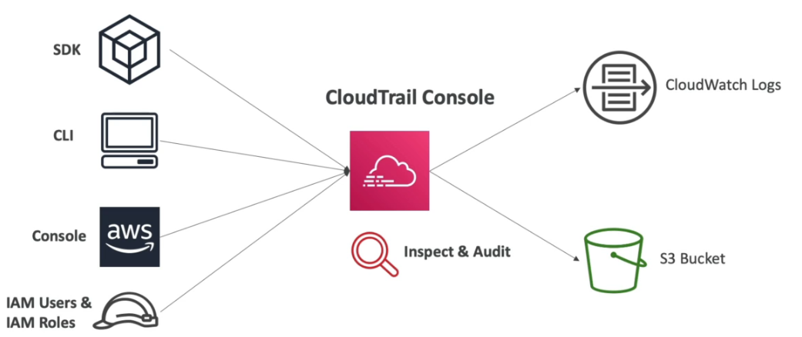

> Visão Geral

- Proporciona **governança, compliance e auditoria**, permitindo rastrear ações realizadas na conta.
- Habilitado por padrão e sem custo inicial.
- Coleta informações do **SDK, Console, CLI, IAM Users e IAM Roles**.
- Permite visualizar todas as ações realizadas na conta (inclusão, criação ou exclusão de recursos).
- Monitora todas as chamadas de **API** na conta.
- Armazena os logs por **90 dias no CloudTrail**. Para retenção maior, é possível configurar o armazenamento no **Amazon S3** (não habilitado por padrão).
- Aplicado por padrão em todas as regiões da AWS.
- Pode ser habilitado para monitorar todas as contas da organização ou apenas uma conta específica.
- **CloudTrail Lake**: Permite consultar eventos usando SQL, com retenção de até 7 anos.
- **Integridade dos Logs**: Pode ser habilitada validação de integridade usando hash SHA-256.

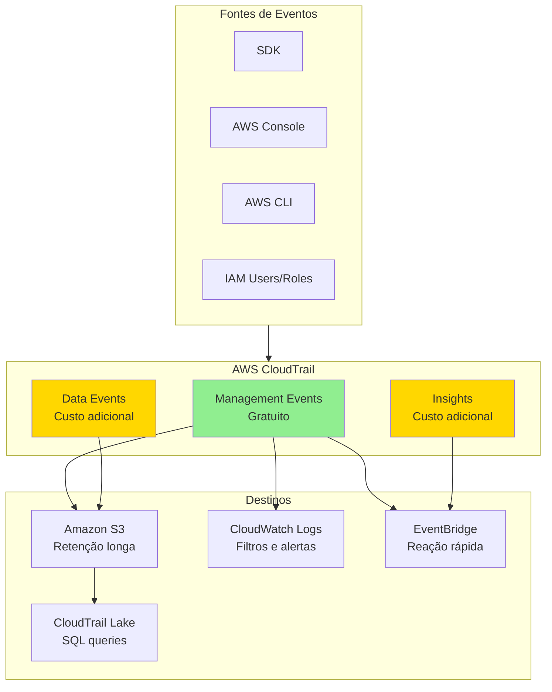

---

#### Tipos de Eventos Analisados

> Eventos Gerenciados

- Eventos relacionados a operações feitas em recursos, como:
  - Criação de regras, buckets S3, instâncias EC2 e modificações em recursos.
  - Separação entre eventos de **leitura e escrita**.
  - **Análise manual** necessária para identificar possíveis problemas.

> Eventos de Dados

- **Não são logados por padrão**. Devem ser habilitados manualmente e possuem custo adicional.
- Operam no **nível de objeto**, sendo aplicáveis a serviços como:
  - **AWS Lambda** (invocação de funções).
  - **Amazon S3** (criação, remoção e recuperação de objetos).
  - **Amazon DynamoDB** (operações em itens da tabela).
- Eventos são separados entre **leitura e escrita**.
- **Análise manual** necessária para investigação de problemas.

> CloudTrail Insights

- Utilizado para detectar **anomalias e padrões incomuns** na conta.
- **Análise automática** baseada em **inteligência artificial** para identificar:
  - Uso excessivo de recursos.
  - Limites atingidos (**soft** e **hard limits**).
- Integração com **Amazon EventBridge** para envio de notificações automáticas.

---

### Arquiteturas de Solução CloudTrail

> Integração do CloudTrail com o Amazon S3

- Possibilita armazenar logs de eventos de forma persistente.

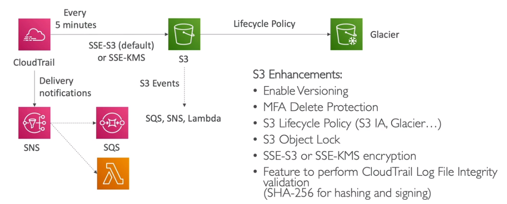

> Monitoramento de Várias Contas e Regiões

- Permite centralizar logs de diferentes contas e regiões em um único local.

> Alertas via Chamadas de API

- Possibilidade de configurar alertas para eventos específicos, como:
  - **Desligamento ou remoção de instâncias EC2**.

> Uso do CloudTrail em uma Organização

- Estratégia para monitoramento e auditoria de múltiplas contas dentro de uma organização AWS.

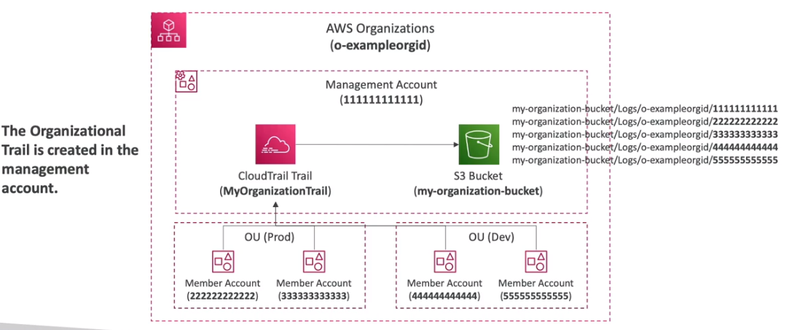

---

#### Como Reagir a Eventos o Mais Rápido Possível

Os eventos no CloudTrail podem levar até **15 minutos** para serem processados. Para acelerar a reação a eventos importantes, algumas estratégias incluem:

> Amazon EventBridge

- Pode **disparar eventos** a partir de qualquer chamada de API no CloudTrail.
- **Método mais rápido** para reagir a eventos críticos.

> Amazon CloudWatch Logs

- Permite **streaming de logs** diretamente para o CloudWatch.
- Possibilita a criação de **filtros** para análise e detecção de anomalias.

> Armazenamento no Amazon S3

- O CloudTrail envia logs para o **Amazon S3 em aproximadamente 5 minutos**.
- É possível **analisar os logs** e disparar ações automáticas, além de armazenar os dados para auditoria.

---

## AWS KMS

> Visão Geral

- **AWS KMS (Key Management Service)** é o serviço de gerenciamento de chaves de criptografia da AWS.
- **Não é possível baixar as chaves** gerenciadas pelo KMS.
- Permite criar, gerenciar e controlar o uso de chaves de criptografia na AWS.
- Serviços que Possuem a Opção de Criptografia
  - **EBS, S3, RedShift, RDS, EFS**, entre outros.
- Serviços com Criptografia Ativada por Padrão
  - **CloudTrail Logs, S3 Glacier, Storage Gateway**, entre outros.
- **Cotas importantes**: 5.500 a 30.000 requests/segundo dependendo da região (pode aumentar via ticket).
- **Envelope Encryption**: KMS gera uma Data Key que criptografa os dados, e a Master Key criptografa a Data Key.
- **KMS Key Policy**: Similar a bucket policy, define quem pode usar/administrar a chave.

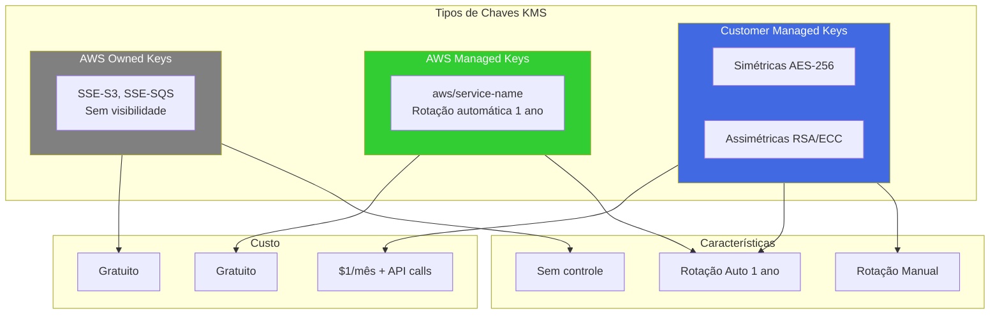

> Importação de Chaves Externas

- Permite importar uma chave gerada externamente.
- A AWS **não** gerencia essa chave, ficando a responsabilidade por conta do usuário.
- Apenas chaves **simétricas** são suportadas.

> CloudHSM - Hardware Security Module

- A AWS fornece um **hardware dedicado** para gerenciamento de chaves criptográficas.
- **A AWS não tem acesso ao hardware após a provisão**, então, se o acesso for perdido, não há como recuperá-lo.
- O hardware é **resistente a alterações** e possui certificação **FIPS 140-2 Level 3 Compliance**.
- Suporta **criptografia simétrica e assimétrica**.
- O **Amazon Redshift** suporta criptografia via HSM.
- É possível distribuir múltiplos **CloudHSM** em diferentes **Zonas de Disponibilidade (AZs)** para aumentar a **disponibilidade**.

#### Tipos de Chaves

> Customer Master Keys (CMK - Chaves Gerenciadas pelo Usuário)

- Criadas pelo usuário dentro do **AWS KMS** ou **CloudHSM**.
- Podem ser **deletadas** ou **modificadas**.
- É possível habilitar **rotação automática** da chave a cada **1 ano**.
- A rotação manual também é possível, sendo **recomendada para chaves assimétricas**.
- **Custos**:
  - $1 por mês por chave.
  - $0.003 a cada **1.000 chamadas** à API.
- **Tipos de Chaves**:
  - **Simétricas (AES-256)**:
    - Todos os serviços da AWS utilizam esse tipo de chave.
    - O usuário **não** tem acesso direto à chave.
    - Para criptografar ou descriptografar, é necessário usar a API do KMS.
  - **Assimétricas (RSA & ECC Key Pairs)**:
    - São compostas por um **par de chaves**:
      - **Chave pública**: usada para criptografar dados.
      - **Chave privada**: usada para descriptografar dados (não é acessível pelo usuário).
    - **Casos de uso**:
      - Criptografar dados **fora da AWS**, onde não se pode chamar a API do KMS.
      - Assinatura digital de objetos.

> Chaves Gerenciadas pela AWS (CMK)

- Criadas e gerenciadas pela **AWS** (sem acesso para o usuário).
- Possuem **rotação automática** a cada **1 ano**.
- **Não possuem custo adicional**.
- São usadas por serviços da AWS, como:
  - **EBS, S3, RedShift, RDS, EFS**.
- São identificadas com nomes como:
  - `aws/rds`, `aws/ebs`, `aws/service-name`.

> Chaves Próprias da AWS

- Criadas pela AWS para seus próprios serviços (sem acesso ou visualização pelo usuário).
- Usadas em:
  - **SSE-S3**, **SSE-SQS**, **SSE-DynamoDB**.
- **Não possuem custo adicional**.

> Chaves do CloudHSM

- Criadas usando **CloudHSM** (**Hardware Security Module**).
- Replicadas automaticamente em múltiplas **Zonas de Disponibilidade (AZs)**.

#### KMS vs CloudHSM - Comparação para o Exame

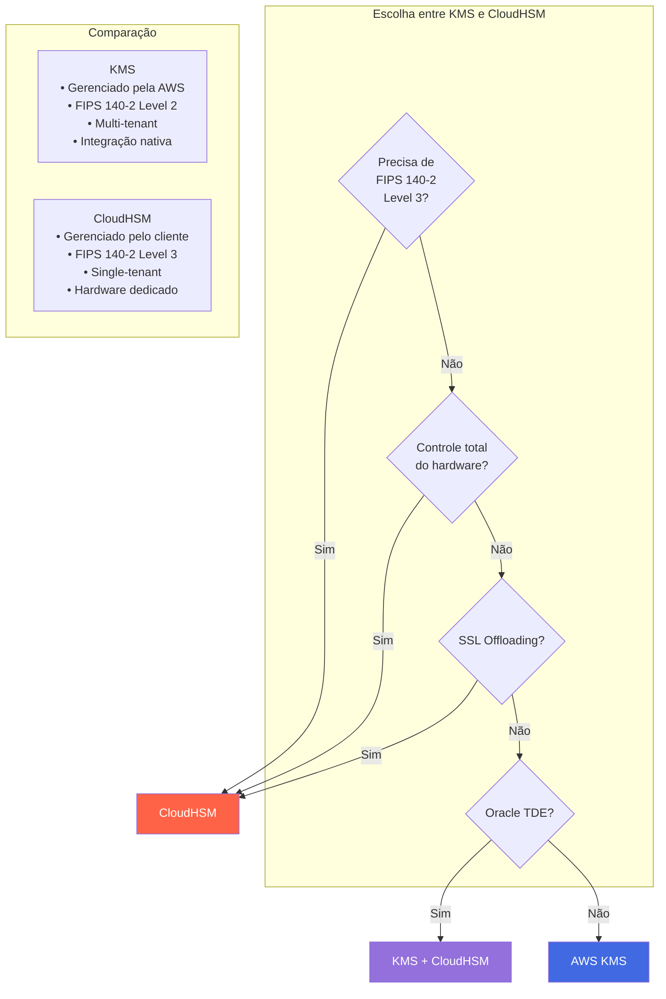

| Característica | KMS | CloudHSM |
|---------------|-----|----------|
| **Gerenciamento** | AWS | Cliente |
| **Compliance** | FIPS 140-2 Level 2 | FIPS 140-2 Level 3 |
| **Tenancy** | Multi-tenant | Single-tenant |
| **Chaves Assimétricas** | Limitado | Completo |
| **SSL Offloading** | Não | Sim |
| **Preço** | Por uso | Por hora (~$1.50/hr) |
| **HA** | Automático | Manual (cluster) |

#### KMS em Múltiplas Regiões

- Permite **criptografar dados em uma região** e **descriptografar em outra**.
- O **KMS não é um serviço global**. Ele opera de forma **multi-regional com replicação**, onde cada KMS regional é gerenciado separadamente.
- **Casos de uso**:
  - **Disaster Recovery**.
  - **Gerenciamento Global de Dados** (ex.: **DynamoDB Global Tables**).

---

### Arquiteturas de Solução SSL E KMS

Arquiteturas de solução para implementação de SSL em aplicações hospedadas na AWS.  

> **SSL no ALB (Application Load Balancer)**  

- Essa é a forma mais comum de implementar SSL na AWS.  
- O ALB usa o **AWS Certificate Manager (ACM)** para validar os certificados SSL.  
- A comunicação entre o ALB e os servidores backend ocorre via HTTP, reduzindo o consumo de CPU nas instâncias EC2, pois elas não precisam processar a criptografia SSL.  

  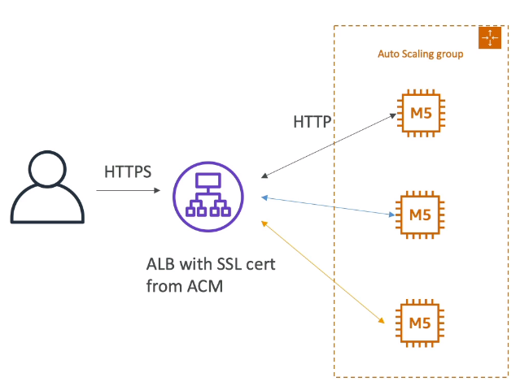

> **SSL nos Web Services com instâncias EC2**  

- Usa-se um **Network Load Balancer (NLB)** para encaminhar o tráfego HTTPS até as instâncias EC2.  
- No entanto, essa abordagem tem desvantagens:  
  - Consome mais memória nas instâncias EC2.  
  - Cada instância EC2 precisa ter um certificado SSL configurado.  
  - O certificado deve ser recuperado no boot do sistema a partir do **AWS Systems Manager Parameter Store**, utilizando um script no **User Data**.  

  

> **Cloud HSM - SSL Offloading**  

- Utiliza o **AWS CloudHSM** para processar a criptografia SSL externamente, reduzindo a carga sobre as instâncias EC2.  
- O **CloudHSM** possui **SSL Acceleration**, tornando o processo mais rápido.  
- Suportado por servidores web como **Nginx, Apache e IIS**.  
- Oferece um nível elevado de segurança, pois a chave de criptografia nunca é exposta ou trafegada. Todo o processamento ocorre dentro do HSM.  
- Para usar essa abordagem, é necessário:  
  - Criar um usuário no HSM para realizar a criptografia.  
  - Armazenar as credenciais desse usuário no **AWS Secrets Manager** ou no **AWS Systems Manager Parameter Store**.  

    

---

## AWS SSM Parameter Store

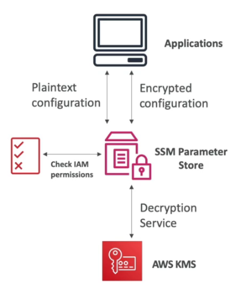

> Visão Geral

- Permite **armazenar configurações e segredos** como parâmetros.
- Oferece **criptografia opcional** utilizando o **AWS KMS**.
- É um serviço **serverless**, fácil de usar com SDKs da AWS.
- Permite **disparar eventos** via **Amazon CloudWatch Events**.
- Os parâmetros são organizados em forma de **caminhos (Paths)**, facilitando a estruturação.
  
- Possui **integração com o AWS CloudFormation** para facilitar a automação e gerenciamento da infraestrutura.

> Integração com AWS Secrets Manager

- É possível acessar segredos armazenados no **AWS Secrets Manager** diretamente via **Parameter Store**.
- Para isso, basta utilizar o seguinte caminho: /aws/reference/secretsmanager/secret_id_in_secrets_manager

> Custos e Limitações

- **Até 10.000 parâmetros**, com tamanho de até **4 KB**, são **gratuitos** por conta e região.
- **Até 100.000 parâmetros**, com tamanho de até **8 KB**, têm um custo de **$0.05 por parâmetro**.

> TTL para Parâmetros (Advanced Tier)

- No **Advanced Tier**, é possível definir um **TTL (Time-to-Live)** para forçar a atualização ou exclusão do parâmetro.
- Caso de uso: **armazenamento de tokens de acesso**.
- Exemplo: armazenar um **token de acesso** no **Parameter Store** com TTL de **25 minutos**.
- Quando o token expirar, um evento do **CloudWatch Events** pode ser disparado para gerar um novo token automaticamente e atualizar o parâmetro.

---

## AWS Secrets Manager

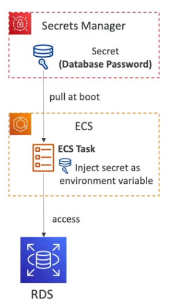

> Visão Geral

- Serviço para **armazenamento seguro de segredos**, como credenciais de banco de dados, chaves de API e outros dados sensíveis.
- Permite **rotação automática de credenciais** usando uma **função Lambda**.
- Ideal para **armazenar senhas em produção** e gerenciar credenciais de forma segura.
- **Nativamente suportado** por diversos bancos de dados na AWS, como **Amazon RDS e DynamoDB**.
- Os segredos são **sempre criptografados**.
- O acesso aos segredos é controlado via **políticas baseadas em recursos (Resource-based Policies)**.
- Permite **compartilhamento de segredos entre contas da AWS**.

> Diferenças entre AWS Secrets Manager e AWS SSM Parameter Store

- AWS Secrets Manager
  - **Mais caro** em comparação com o Parameter Store.
  - Permite **rotação automática de credenciais**.
  - Ao criar um segredo para bancos de dados, o serviço gera **automaticamente** uma **função Lambda** para alterar a senha periodicamente.
  - **Criptografia obrigatória**.

- AWS SSM Parameter Store
  - **API simples**, mais acessível.
  - **Não possui mecanismo automático de rotação** nativo, mas pode ser configurado usando **EventBridge + Lambda**.
  - **Criptografia opcional**.
  - Permite recuperar segredos do **AWS Secrets Manager** via API do **SSM Parameter Store**.

> Rotação de Senhas: Secrets Manager vs. Parameter Store

- No **Secrets Manager**, a rotação de senhas é **automática**.
- No **Parameter Store**, é necessário **criar e manter uma integração** via **EventBridge + Lambda** para gerenciar a rotação manualmente.

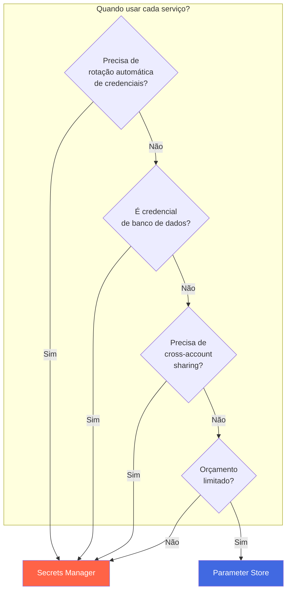

| Característica | Parameter Store | Secrets Manager |
|---------------|----------------|-----------------|
| **Custo** | Gratuito (Standard) | $0.40/secret/mês |
| **Rotação Automática** | Não (manual via Lambda) | Sim (nativo) |
| **Tamanho máximo** | 8KB (Advanced) | 64KB |
| **Cross-account** | Não | Sim |
| **Versionamento** | Sim | Sim |
| **Criptografia** | Opcional | Obrigatória |
| **Integração RDS** | Manual | Nativa |
| **Hierarquia de paths** | Sim | Não |

---

## RDS Security

> Visão Geral
- **Criptografia em repouso** utilizando **AWS KMS** para **volumes EBS e snapshots**.
- **TDE (Transparent Data Encryption)** disponível para **Oracle e SQL Server**.
- **Criptografia em trânsito** para todos os bancos de dados no **Amazon RDS**.
- **Autenticação IAM** disponível para **MySQL e PostgreSQL**.
  - **Apenas a autenticação é feita usando IAM. A autorização ainda é gerenciada pelo RDS.**
- É possível **gerar um snapshot criptografado** a partir de um snapshot **não criptografado**.
- **AWS CloudTrail não registra as queries feitas no RDS.** Apenas ações administrativas são registradas.

---

## SSL Encryption, SNI e MITM

> Visão Geral

- **SSL (Secure Sockets Layer)** – Usado para **criptografar conexões**.
- **TLS (Transport Layer Security)** – Versão mais recente do **protocolo SSL**.
- **CA (Certificate Authorities)** – Entidades responsáveis por emitir certificados de confiança.
  - Exemplos: **Comodo, Symantec, GoDaddy, Let's Encrypt**.
- **Os certificados SSL possuem uma data de validade** e devem ser renovados periodicamente.

> Como funciona a comunicação segura?

1. Quando dois hosts iniciam uma conexão segura, eles realizam o **handshake** usando **criptografia assimétrica**.
2. A criptografia assimétrica tem **alto custo computacional**, então, após o handshake, são geradas **chaves simétricas** para as interações seguintes.
3. O uso de chaves simétricas reduz o custo da criptografia e melhora o desempenho.
   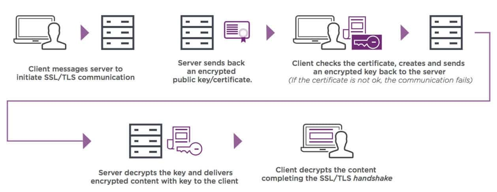

---

## SNI - Server Name Indication

> Visão Geral

- Resolve o problema do carregamento de múltiplos certificados em servidores web, permitindo **diferentes aplicações com diferentes certificados** no mesmo servidor.
- **Exige que o hostname do servidor destinatário seja enviado no início do handshake**.
- Assim, o servidor seleciona o certificado adequado ou retorna um padrão.
- **Suporte na AWS**:
  - Funciona apenas com **ALB (Application Load Balancer)**, **NLB (Network Load Balancer) da nova geração** e **CloudFront**.
  - **Não funciona** com **CLB (Classic Load Balancer)**, que é da geração antiga.
  
  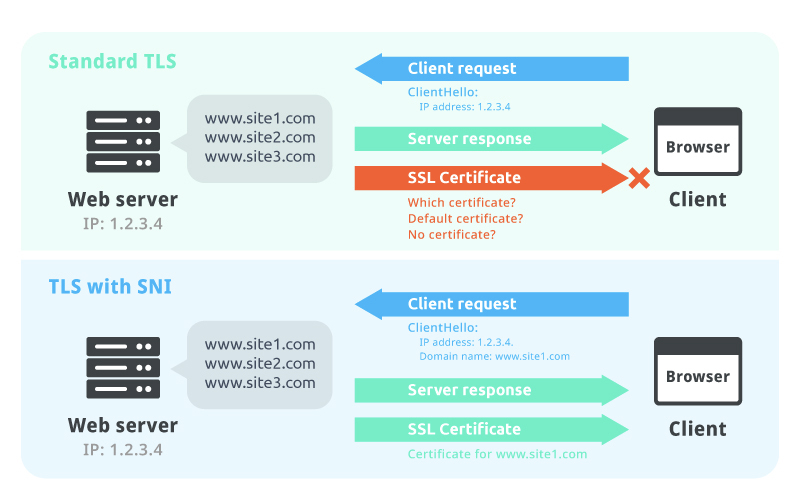

---

## AWS Certificate Manager (ACM)

> Visão Geral

- Serviço da AWS que permite **provisionar, gerenciar e implantar certificados SSL/TLS**.
- Facilita a **implantação de certificados** em:
  - **Elastic Load Balancers (ALB, NLB)**
  - **Amazon CloudFront**
  - **Amazon API Gateway e AWS AppSync**
- **Criação de certificados privados** para uso interno, centralizando o gerenciamento do ciclo de vida dos certificados.

> Características do ACM

- Permite criar certificados que são **validados no início da conexão**, reduzindo o uso de CPU das instâncias, já que o tráfego subsequente pode ser HTTP.

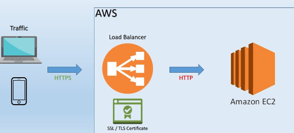
- O ACM é um serviço **regional**:
  - Para serviços **globais**, é necessário gerar certificados separadamente em cada região.
  - **Não é possível copiar certificados entre regiões.**
    

---

## MITM - Man-in-the-Middle Attack

> Como prevenir ataques MITM?

1. **Sempre utilize HTTPS** em vez de HTTP.
2. **Use DNS com DNSSEC habilitado** para evitar manipulação de respostas DNS.
   - O **Amazon Route 53** suporta **DNSSEC** para:
     - Registros de domínio.
     - Serviço de DNS, integrando-se ao **AWS KMS** para maior segurança.
     

---

## DDoS e Web Security

> Visão Geral

> Como se proteger

> Arquitetura usada contra DDoS

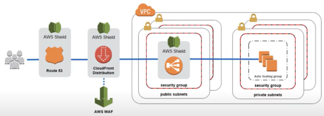

---

## AWS Shield

> Visão Geral

- Protege contra ataques **DDoS**, incluindo **SYN Flood, UDP Flood e Reflection Attack**.
- Atua nas camadas **3 (Rede) e 4 (Transporte)** do modelo **OSI**.
- **Versão Standard** é gratuita para todos os clientes AWS.
- **Versão Advanced** oferece proteção adicional na camada **7 (Aplicação)**.
- Está presente nos **pontos de presença (PoPs)** da AWS.
- O **AWS Shield Advanced** oferece suporte 24/7 por meio do **DDoS Response Team (DRP)**:
  - Custo adicional de **$3000 por organização**.
  - Pode ser usado em **Route 53, CloudFront, Global Accelerator e Load Balancer**.
  
  

---

## AWS WAF (Web Application Firewall)

> Visão Geral

- **Firewall para aplicações web**.
- Permite **bloquear acessos indesejados** através de listas de regras personalizadas.
- Opera nos **pontos de presença** da AWS.
- **Protege aplicações contra ataques na camada 7 (Aplicação).**
- Pode ser utilizado em:
  - **Load Balancer (ALB)** – Regras aplicadas localmente.
  - **API Gateway** – Regras por região ou nos pontos de presença.
  - **CloudFront** – Regras globais ou específicas por ponto de presença.
  - **AppSync** – Para proteger **APIs GraphQL**.
  
> Web ACL (Web Access Control List)

- Permite criar regras de bloqueio baseadas em:
  - **Faixas de IPs, headers e parâmetros de requisição.**
  - **Ataques como SQL Injection e Cross-Site Scripting (XSS).**
  - **Bloqueio geográfico (por país ou região).**
  - **Bloqueio por taxa de requisições (rate-based rules).**
- **Custo de $5/mês por Web ACL.**

> Ações disponíveis no WAF

- **Contagem de requisições** para monitoramento.
- **Liberação ou bloqueio de IPs, headers e outros critérios.**
- **Validação via CAPTCHA** do lado do cliente.

> Logs do AWS WAF

- Logs podem ser enviados para **CloudWatch Logs**.
- **Suporta envio de até 5 MB por segundo**.
- **Pode armazenar logs no S3** (com intervalo de 5 minutos).
- **Pode enviar logs para o Kinesis Data Firehose**, sujeito às cotas do **Kinesis**.

  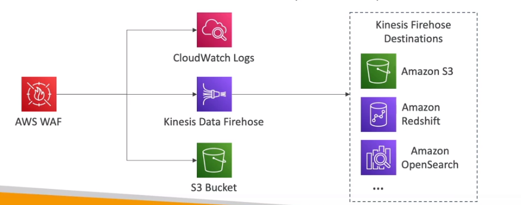

---

> AWS Managed Rules

- Conjunto de **regras pré-configuradas** que podem ser aplicadas rapidamente.
- **Mais de 190 regras prontas disponíveis**.
- Possível buscar regras adicionais no **AWS Marketplace**.
- Baseadas em **grupos de controles de segurança**.

  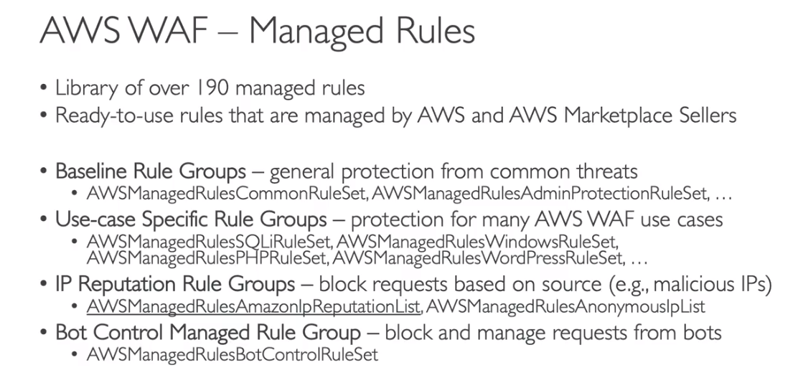

---

### Soluções com WAF

- **Restrição de acesso ao ALB via CloudFront**, utilizando o **Secrets Manager** para gerar e atualizar valores de headers via Lambda.

  

---

## AWS Firewall Manager

> Visão Geral

- **Gerenciamento centralizado de regras de segurança** em múltiplas contas AWS.
- Permite **aplicar regras comuns de segurança** globalmente.

  

> Diferenças entre WAF, AWS Firewall Manager e AWS Shield

- **WAF** → Proteção na camada **7 (Aplicação)**.
- **AWS Shield** → Proteção contra **DDoS** nas camadas **3 e 4 (Rede e Transporte)**.
- **AWS Firewall Manager** → Centraliza a aplicação de regras do **WAF e Shield** em várias contas AWS.

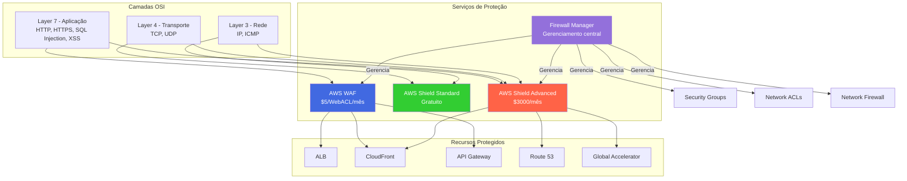

| Serviço | Camada | Custo | Proteção |
|---------|--------|-------|----------|
| **Shield Standard** | L3/L4 | Gratuito | DDoS básico |
| **Shield Advanced** | L3/L4/L7 | $3000/org/mês | DDoS + DRT 24/7 + cost protection |
| **WAF** | L7 | $5/WebACL + regras | SQL Injection, XSS, geo-blocking |
| **Firewall Manager** | Todos | $100/policy/região | Gerenciamento centralizado |
| **Network Firewall** | L3/L4 | Por hora + GB | Stateful/Stateless inspection |

---

### Bloqueio de IPs

- Para bloquear **IPs indesejados**, o método recomendado depende do serviço em uso:

> **Network ACL (NACL)**
- Melhor opção para **bloqueio direto de IPs**.
- Suporta **regras de negação (DENY)**.

> **Security Groups**
- **Não suportam regras de bloqueio explícito**, pois trabalham com listas de **permissão (ALLOW)**.
- Para bloquear IPs, é necessário criar uma lista de **IPs permitidos** e negar todo o resto, o que pode ser inviável em cenários com muitos IPs.

> **Firewall em instância EC2**
- Também pode ser usado para bloquear tráfego específico.

  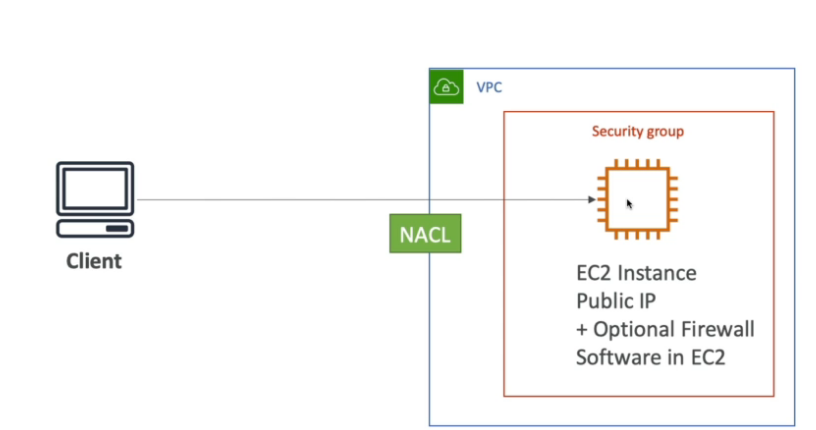

> **Bloqueio de IPs em Load Balancers**
- **Application Load Balancer (ALB)**:
  - Bloqueio via **NACL** e **Security Groups**.
  - Alternativamente, pode ser usado o **WAF** para criar regras de filtro.

  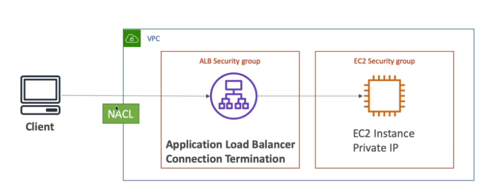

- **Network Load Balancer (NLB)**:
  - **A única forma de bloquear IPs é via NACL**, pois **o NLB não suporta Security Groups**.

  

> **Bloqueio de IPs em CDNs**
- Caso esteja usando um **CDN (CloudFront)**, o **AWS WAF** pode ser utilizado para bloquear acessos **antes que o tráfego chegue à VPC**, sem necessidade de configurar **NACLs**.

  

---

## AWS Inspector

> Visão Geral

  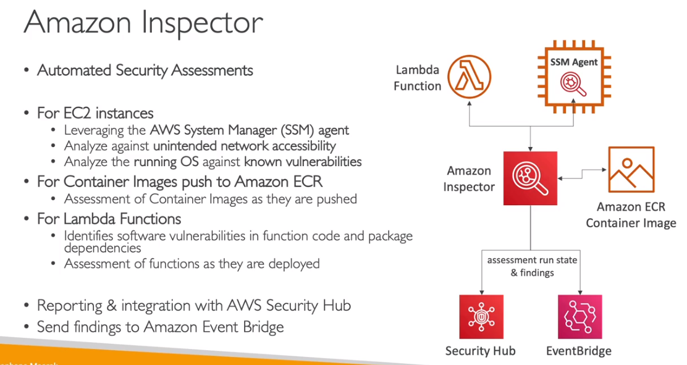

- Serviço que **analisa vulnerabilidades** em recursos da AWS.
- **AWS Inspector** inspeciona **instâncias EC2, imagens do ECR e funções Lambda** contra ameaças conhecidas.
- Utiliza um **agente (SSM Agent)** para análise de instâncias EC2.
- Analisa **apenas instâncias em execução** e identifica **riscos na aplicação**.

> Recursos analisados

- **Instâncias EC2** – Procura vulnerabilidades em pacotes e permissões indevidas.
- **Imagens de container no ECR** – Verifica falhas conhecidas antes da implantação.
- **Funções Lambda** – Avaliação de segurança em código e dependências.

> Configuração e custos

- Permite configurar a **periodicidade das análises**.
- Tem um **alto custo**, com os seguintes planos:
  - **$60/mês** → Análises de rede (**acesso indevido e capacidade**).
  - **$120/mês** → Análise da máquina (**checagem de vulnerabilidades**).

> Métodos de análise

- **Verificação de vulnerabilidades de pacotes** em **EC2, ECR e Lambda**, baseada no banco de dados **CVE**.
- **Avaliação de acessibilidade de rede** em instâncias EC2.

---

## AWS Config

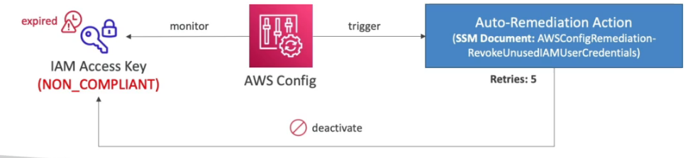

> Visão Geral

- Serviço que ajuda a verificar a conformidade (**compliance**) da conta AWS ao longo do tempo.
- Permite visualizar quais modificações foram feitas nos recursos da conta.
- Pode utilizar **tópicos SNS** para notificações sobre alterações detectadas.
- Permite agregar as análises de múltiplas contas da organização em uma única conta de auditoria.
- **Serviço pago**, pois escaneia continuamente os serviços habilitados.
- Pode ser configurado para monitoramento contínuo, para detectar novos recursos ou com um intervalo definido (por exemplo, uma vez por dia).
- Integra-se ao **SSM Automation**, permitindo a execução de **correções automáticas** ao detectar não conformidades.
  - **Exemplo:** Caso um **Security Group** esteja liberado para um range de IPs não permitido, o AWS Config pode detectar essa configuração e executar uma **automação** para removê-la e notificar via **SNS** ou **EventBridge**.
- **Serviço regional**, mas é possível incluir a análise de serviços globais.
- Contém **mais de 75 regras** prontas para validar a conformidade de serviços, além da possibilidade de criar regras personalizadas.
  - Para criar regras personalizadas, é necessário desenvolver uma **AWS Lambda Function** que realize a validação.
    - **Exemplo:** Se apenas instâncias EC2 do tipo **t2.micro** são permitidas, uma Lambda pode ser criada para validar esse requisito e ser vinculada a uma regra específica.
- **Custo:** $0.003 por regra habilitada.
- Permite visualizar alterações feitas nos recursos e identificar quem realizou a modificação.
- **Exemplo de uso:** Criar uma regra que valida se há acesso **SSH** aberto em um **Security Group** e, caso detectado, disparar uma notificação ou ação corretiva automática.

> Perguntas que podem ser respondidas pelo AWS Config:
- Há algum **Security Group** configurado **sem SSH**?
- Meus **buckets S3** têm acesso público?

> **AWS Config Resource**
- Dashboard que exibe os recursos em conformidade ou não.
- Permite visualizar as configurações e histórico de alterações.

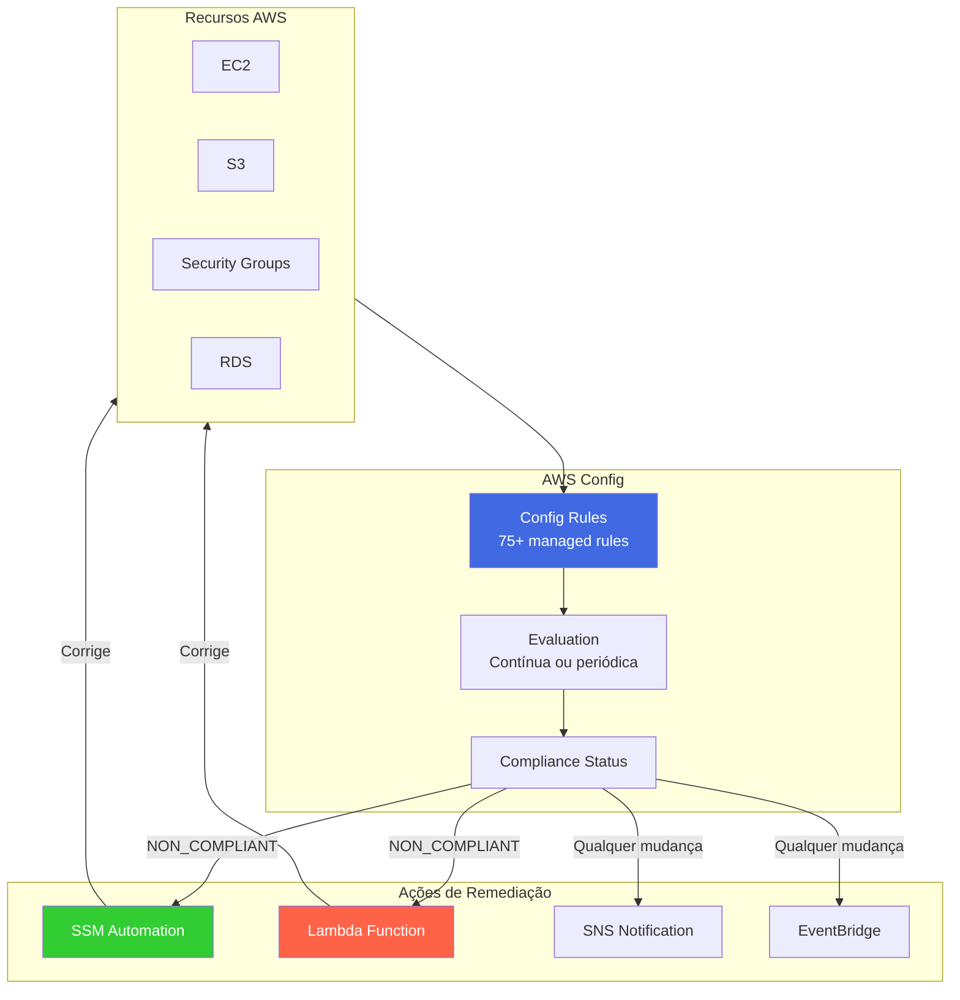

> **Dicas para o Exame - AWS Config**

- **Conformance Packs**: Conjunto de regras e remediações que podem ser implantadas como uma unidade.
- **Aggregators**: Permitem visualizar dados de Config de múltiplas contas e regiões em um dashboard único.
- **Config não previne ações** - apenas detecta e pode remediar após o fato.
- **Para prevenir**, use SCPs ou IAM policies.
- **Custo**: $0.003 por item de configuração + $0.001 por avaliação de regra.

| Regra Comum | O que verifica |
|------------|----------------|
| `s3-bucket-public-read-prohibited` | Buckets S3 públicos |
| `ec2-instance-no-public-ip` | EC2 com IP público |
| `rds-instance-public-access-check` | RDS acessível publicamente |
| `iam-user-mfa-enabled` | MFA habilitado |
| `encrypted-volumes` | EBS criptografado |

---

## AWS Managed Logs

> Visão Geral

- Logs gerenciados e produzidos automaticamente por serviços AWS.
- Os logs podem ser exportados para **Amazon S3** ou **CloudWatch Logs**, dependendo do serviço.

> **Principais logs gerenciados pela AWS:**
- **Load Balancer Logs** → logs de acesso dos **Application Load Balancers** e **Network Load Balancers**.
- **AWS CloudTrail Logs** → registra chamadas de API feitas dentro da AWS.
- **VPC Flow Logs** → captura informações sobre tráfego IP em **VPCs e interfaces de rede**.
- **Route 53 Resolver Query Logs** → registra as queries DNS recebidas pelo **Route 53**.
- **S3 Access Logs** → logs detalhados sobre acessos a buckets **S3**.
- **CloudFront Access Logs** → registra acessos às distribuições **CloudFront**.
- **AWS Config Logs** → logs gerados pelo **AWS Config** contendo detalhes sobre conformidade e mudanças em recursos.

---

## AWS GuardDuty

> Visão Geral

- **Serviço de detecção de ameaças** que utiliza inteligência artificial para analisar comportamentos suspeitos na conta AWS.
- Possui **free trial**, mas é cobrado após o período gratuito.
- **Serviço regional**, ou seja, deve ser ativado em cada região AWS necessária.

> **Fontes de dados analisadas pelo GuardDuty:**
- **AWS CloudTrail** → detecta chamadas de API incomuns ou não autorizadas.
- **VPC Flow Logs** → identifica tráfego anômalo e interações com IPs maliciosos.
- **DNS Logs** → detecta comunicação suspeita com domínios comprometidos.
- **Kubernetes Audit Logs** → monitora eventos suspeitos em **clusters Kubernetes gerenciados pelo EKS**.

- O GuardDuty analisa essas fontes de dados utilizando algoritmos de machine learning para detectar **anomalias e possíveis ameaças**.
- Pode ser integrado ao **Amazon EventBridge** para disparar notificações e automações.
- Permite configurar uma conta centralizada dentro da **AWS Organizations** para atuar como **Administrador do GuardDuty**, gerenciando detecções de ameaças em todas as contas da organização.

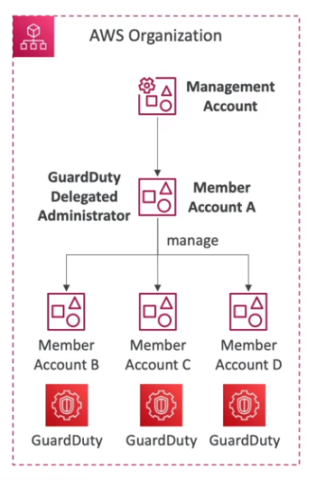

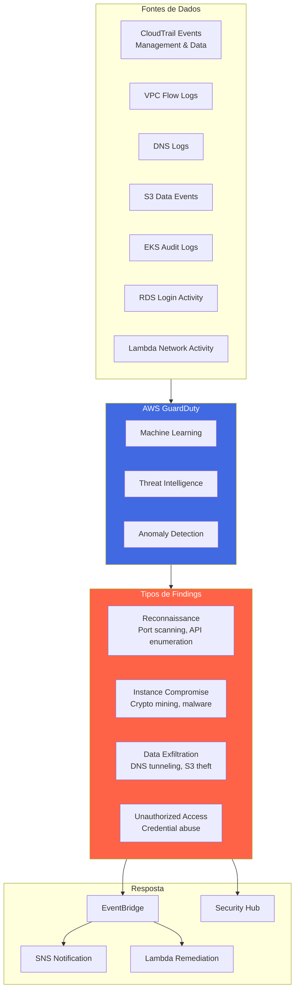

> **Dicas para o Exame - GuardDuty**

- **Não requer agente** - usa logs já disponíveis na AWS.
- **Preço baseado em volume** de logs analisados.
- **Trusted/Threat IP Lists**: Permite whitelist e blacklist de IPs.
- **Suppression Rules**: Permite ignorar findings específicos.
- **S3 Protection**: Detecta acesso anômalo a buckets S3.
- **EKS Protection**: Detecta ameaças em clusters Kubernetes.
- **Malware Protection**: Escaneia EBS volumes anexados a EC2/ECS.
- **RDS Protection**: Detecta tentativas de login suspeitas em Aurora.

---

## IAM Advanced Policies

Políticas avançadas do IAM permitem a criação de regras mais refinadas para controlar acessos dentro da AWS.

> **Condições (Conditions)**  

Permite definir condições específicas para conceder ou negar acesso a recursos da AWS.

- **SourceIP** - Restringe acesso com base no IP de origem ou em um intervalo de IPs.  
  - Exemplo: Só permitir que um usuário acesse a AWS se estiver dentro da rede da empresa.  
  

- **RequestedRegion** - Permite restringir a criação ou chamada de recursos a uma determinada região.  
  - Exemplo: Impedir a criação de recursos fora da região `us-east-1`.  
  

- **ResourceTag** - Controla permissões com base em tags dos recursos.  
  - Exemplo: Permitir que um usuário inicie apenas instâncias EC2 que tenham a tag `Project=DataAnalytics`.  
  

- **MFA (Autenticação Multifator)** - Requer autenticação multifator para determinadas ações sensíveis.  
  - Exemplo: Impedir que usuários excluam objetos de um bucket S3 ou encerrem instâncias EC2 sem MFA ativado.

---

### IAM para S3

O IAM permite aplicar regras de acesso tanto no nível do bucket quanto no nível dos objetos individuais, e há diferenças importantes entre os dois.

- Para regras que se aplicam a todos os objetos dentro de um bucket, utiliza-se o caractere `*`.  
  

---

### Políticas Restritas para a Organização

- Permite restringir o uso de políticas apenas a membros de uma organização da AWS Organizations.  
  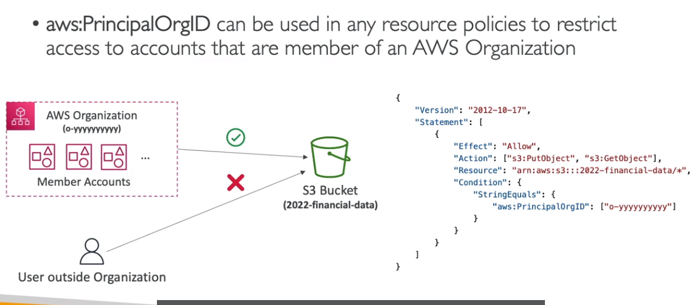

---

## AWS Security Hub  

> Visão Geral

- Centraliza a gestão de segurança de múltiplas contas.  
- Agrega alertas de outros serviços de segurança da AWS.  
- Utiliza o **AWS Config** para avaliar continuamente a conformidade dos recursos.  
- Permite automação para correção de problemas comuns, como portas SSH expostas ao público.  

---

## Amazon Detective

> Visão Geral

Serviço que ajuda a investigar incidentes de segurança e analisar a causa raiz de atividades suspeitas.

- Utiliza **Machine Learning** e **grafos** para identificar padrões suspeitos.
- Consolida logs de diversos serviços da AWS, criando uma visão unificada das atividades.
- Permite gerar visualizações detalhadas para facilitar a análise forense e a resposta a incidentes.

---

## Resumo de Serviços de Segurança para o Exame

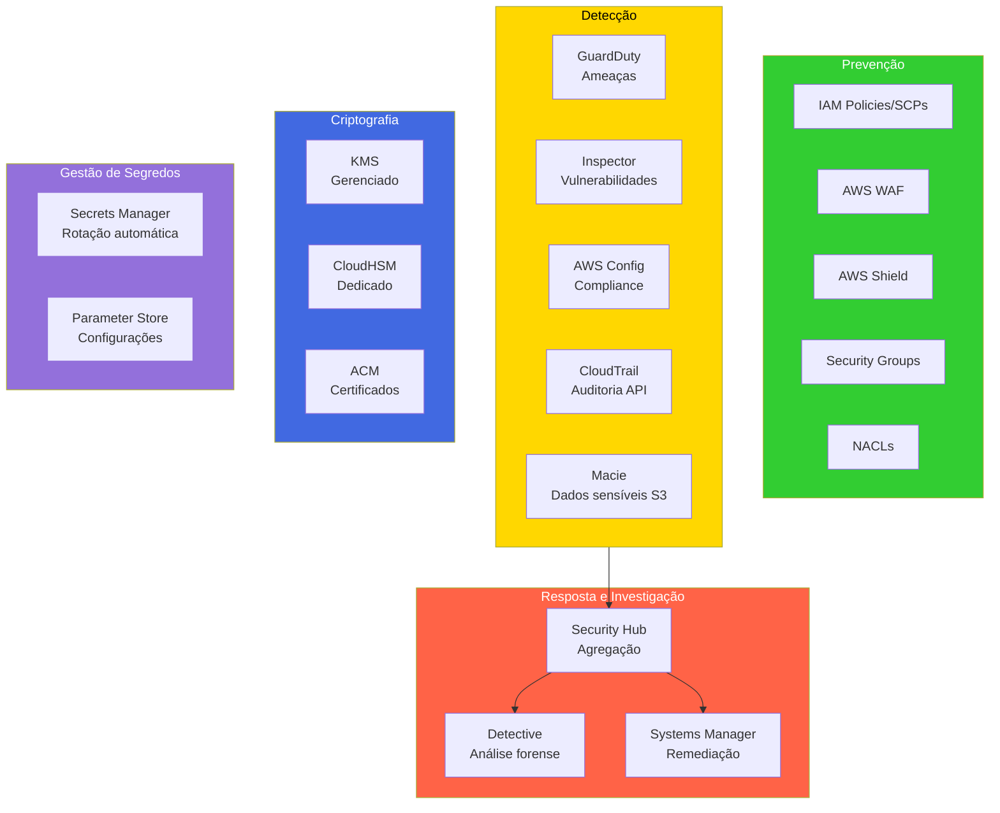

### Tabela de Decisão Rápida

| Cenário | Serviço |
|---------|---------|
| Auditoria de chamadas de API | CloudTrail |
| Detectar ameaças em tempo real | GuardDuty |
| Verificar vulnerabilidades em EC2/Lambda/ECR | Inspector |
| Verificar compliance de configurações | AWS Config |
| Detectar dados sensíveis em S3 | Macie |
| Investigar incidentes de segurança | Detective |
| Centralizar findings de segurança | Security Hub |
| Proteção DDoS layer 3/4 | Shield |
| Proteção layer 7 (SQL injection, XSS) | WAF |
| Gerenciamento centralizado de regras | Firewall Manager |
| Criptografia gerenciada | KMS |
| Criptografia FIPS 140-2 Level 3 | CloudHSM |
| Rotação automática de credenciais DB | Secrets Manager |
| Configurações/segredos simples | Parameter Store |
| Certificados SSL/TLS | ACM |

### Dicas Importantes para o Exame

1. **CloudTrail vs Config**: CloudTrail registra "quem fez o quê", Config registra "como está configurado".
2. **GuardDuty vs Inspector**: GuardDuty detecta ameaças ativas, Inspector encontra vulnerabilidades.
3. **Detective**: Usado APÓS um finding do GuardDuty para investigar a causa raiz.
4. **Security Hub**: Agrega findings de GuardDuty, Inspector, Macie, Firewall Manager, IAM Access Analyzer.
5. **Macie**: Focado exclusivamente em dados sensíveis (PII, credenciais) no S3.
6. **Shield Advanced**: Inclui proteção contra custos de DDoS (cost protection).
7. **Firewall Manager**: Requer AWS Organizations para funcionar.
8. **ACM**: Certificados são regionais, exceto para CloudFront (us-east-1).  
