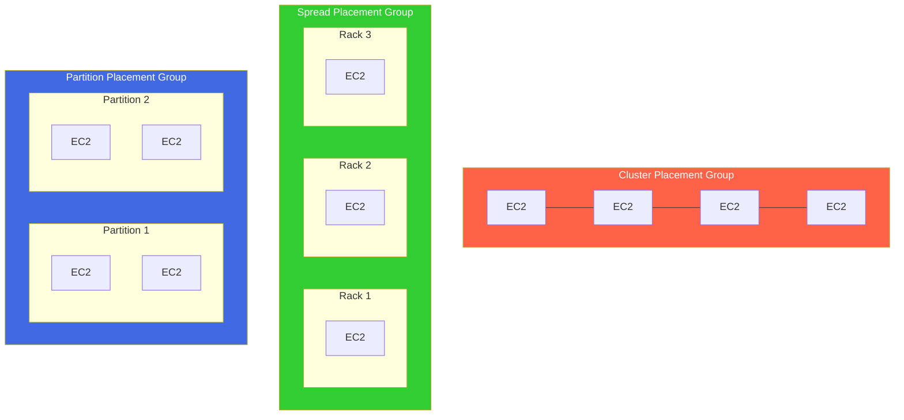
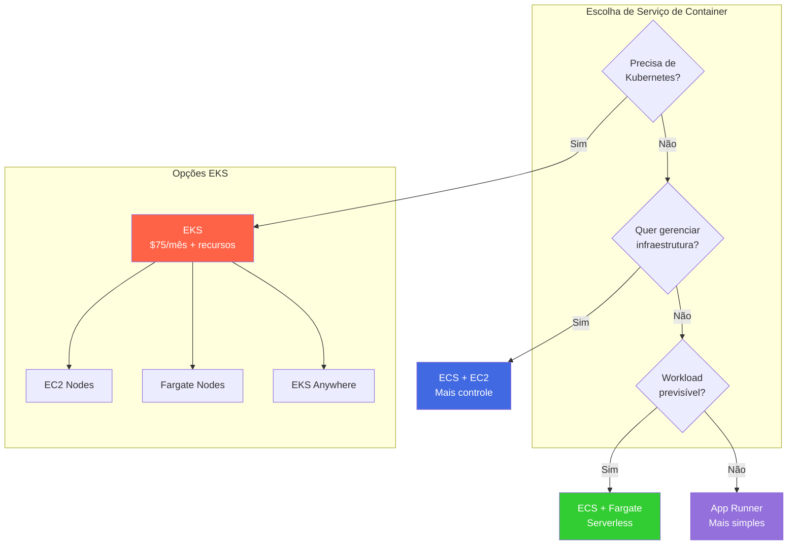
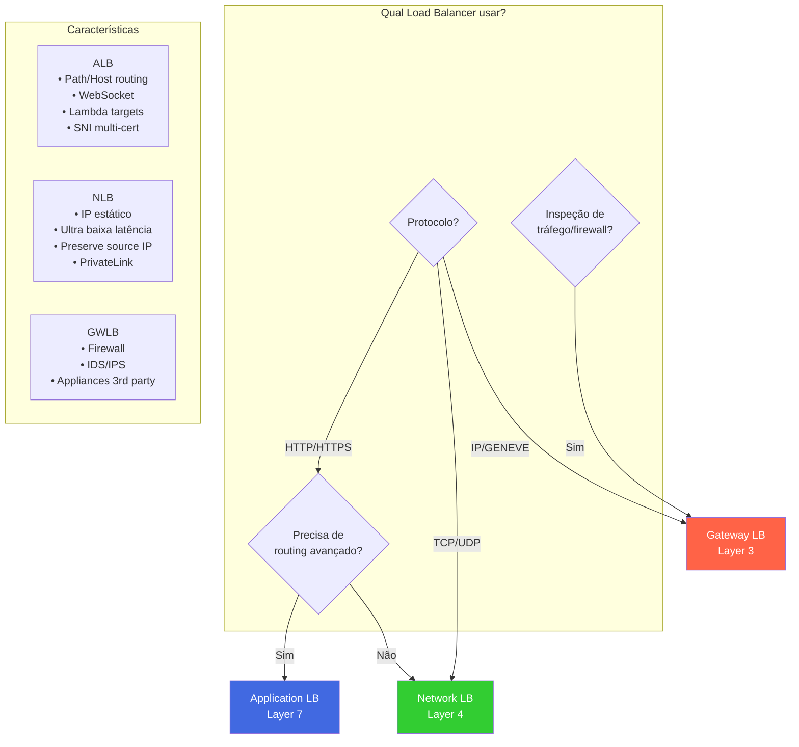
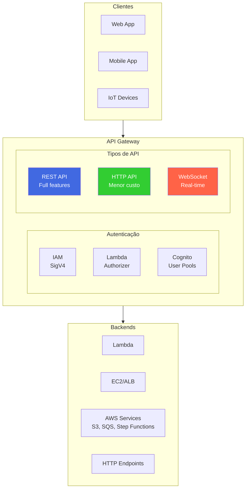
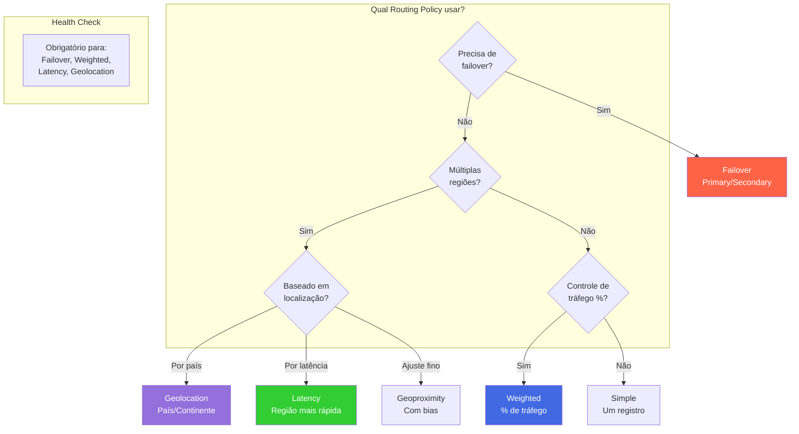
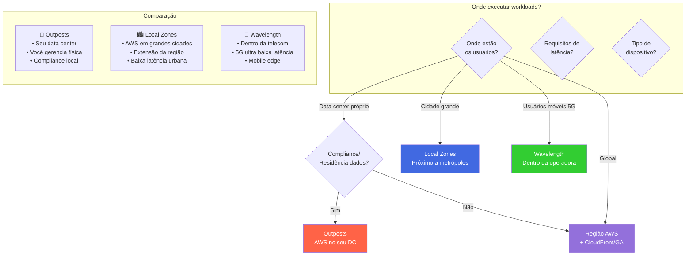
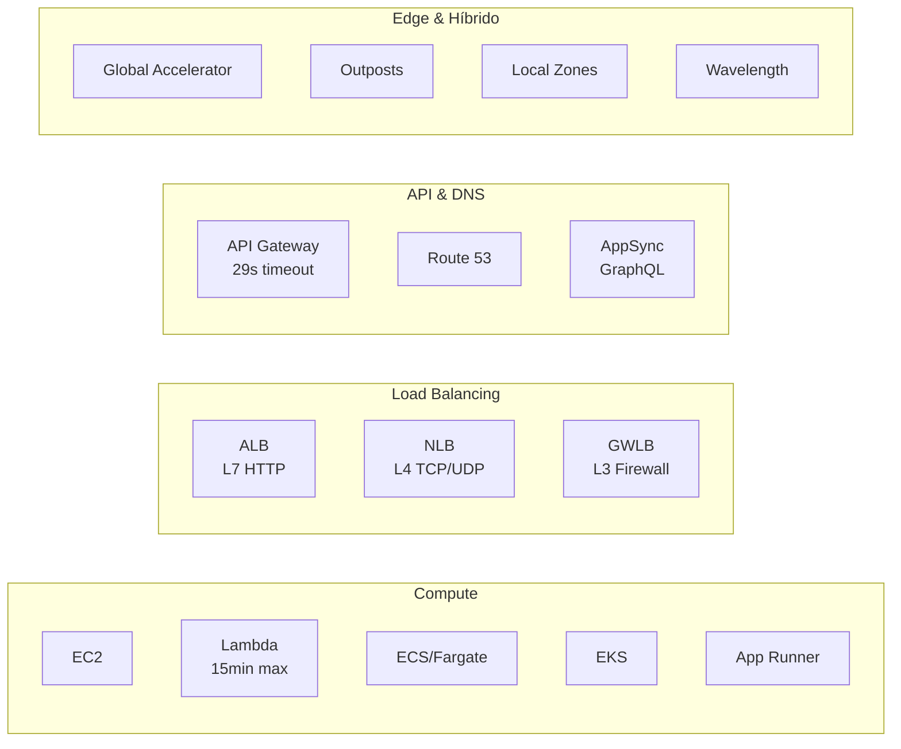

---

## EC2 - Elastic Compute Cloud 

- **Elastic Compute Cloud** (EC2).
- Máquinas na nuvem que podem ser utilizadas sob demanda.
- O armazenamento pode ser feito de duas formas:
  - **Network-attached:**
    - EBS (Elastic Block Storage).
  - **Hardware (EC2 Instance Store):**
    - Armazenamento físico diretamente na instância.
- A instância precisa estar conectada a uma rede.
- Deve possuir um firewall (**Security Group**).
- Quando a instância é parada, os dados da memória são perdidos, mas os dados armazenados no **EBS** são mantidos até a próxima inicialização.
- Caso queira preservar os dados em memória ao parar a instância, use a opção **Hibernate** (hibernar), que mantém os dados na RAM.
- Quando a instância é encerrada:
  - Os dados da memória e do **EBS** principal são perdidos.
  - É possível adicionar um segundo EBS ou marcar a opção para preservar o volume principal.
  
:::tip EC2 Nitro
**EC2 Nitro** é uma tecnologia de virtualização da AWS que:
- Melhora o desempenho da rede.
- Aumenta a eficiência de **IOPS** (operações de entrada/saída por segundo) no armazenamento **EBS**.
:::

:::info EC2 Graviton
- Proporciona melhor desempenho em relação ao custo, sendo **46% mais eficiente** que a 5ª geração.
- Suporta vários sistemas operacionais, como Linux e Amazon Linux 2 (AML 2).
- **Não é compatível com Windows.**
:::

---

> **EC2 vCPU**
- Uma **CPU física** pode ter múltiplos núcleos (**cores**), cada um com múltiplas **threads**.
- Uma **vCPU** representa uma dessas threads.
- É possível configurar a quantidade de vCPUs conforme a necessidade da aplicação.
  - Exemplo: uma aplicação Node.js que é **single-threaded** pode utilizar apenas **1 vCPU**.

---

> **Placement Groups (Grupos de Posicionamento)**
- Define a estratégia de posicionamento das instâncias EC2:
  - **Cluster:**
    - Todas as instâncias ficam juntas.
    - Baixa latência, mas ficam em uma única **AZ (Availability Zone)**.
    - Alta performance, porém com maior risco de falha.
    - Ideal para **processamento de Big Data** e **aplicações com baixa latência de rede**.
  - **Spread:**
    - Instâncias espalhadas em servidores diferentes, até **7 por AZ**.
    - Reduz riscos de indisponibilidade.
    - Indicado para **aplicações críticas**.
  - **Partition:**
    - Similar ao Spread, mas as instâncias são distribuídas em **diferentes partições (racks)** dentro de uma AZ.
    - Pode ter até **7 partições por AZ** e centenas de instâncias.
    - **Partições não compartilham o mesmo rack**.
    - Se uma partição falhar, todas as instâncias dentro dela serão perdidas.
    - Instâncias podem compartilhar dados da partição via **EC2 Metadata**.



| Placement Group | Max Instâncias | Caso de Uso | Risco |
|-----------------|---------------|-------------|-------|
| **Cluster** | Sem limite | HPC, Big Data, baixa latência | Alto (mesma AZ/rack) |
| **Spread** | 7 por AZ | Apps críticas, HA | Baixo |
| **Partition** | Centenas (7 partições/AZ) | Hadoop, Cassandra, Kafka | Médio |

:::warning
**Mover uma instância entre Placement Groups:**
- É necessário **parar a instância**.
- Utilizar **CLI** para alterar o Placement Group.
- Reiniciar a instância após a mudança.
:::

---

> Auto Scaling Group

- Permite ajustar automaticamente a quantidade de instâncias **EC2** com base na demanda.
- O ajuste pode ser feito com **CloudWatch** através de métricas ou eventos.
- Não há cobrança pelo **Auto Scaling Group**, apenas pelos recursos utilizados.
**Características principais:**
- **Escalabilidade:** capacidade de aumentar ou reduzir instâncias.
- **Elasticidade:** ajuste dinâmico com base na necessidade.
- **Agilidade:** provisionamento rápido de infraestrutura.
**Políticas de escalabilidade:**
- **Dynamic Scaling Policy:**
  - Baseia-se em métricas do **CloudWatch**, como **CPUUtilization** e **RequestCountPerTarget**.
- **Scheduled Scaling Policy:**
  - Agendamento para um período específico (ex: horário comercial).
- **Predictive Scaling Policy:**
  - Utiliza **Machine Learning** para prever e ajustar a escalabilidade com base em dados históricos.

:::note
**Para certificação:**
- O **Auto Scaling Group** encerra instâncias seguindo estas etapas:
  1. Encontra a AZ com maior número de instâncias.
  2. Remove a instância com a configuração mais antiga.
- **Diferença entre Launch Configuration e Launch Template:**
  - **Launch Configuration:** legado, precisa ser recriado para cada alteração.
  - **Launch Template:** moderno, com suporte a versionamento e configuração flexível.
:::

**Importante**

- Acesse pra mais [detalhes do EC2](https://docs.uniii.com.br/docs/cloud-notes/aws/aws-cloud-architect-associate#ec2)
- Veja também [HPC - Alta performance](https://docs.uniii.com.br/docs/cloud-notes/aws/aws-cloud-architect-associate#alta-performance-computacional-hpc)

Para informações detalhadas sobre tipos de instâncias, acesse:
- [AWS EC2 Instance Types](https://aws.amazon.com/pt/ec2/instance-types/)
- [Vantage - AWS Instances](https://instances.vantage.sh/)

---

## ECS - Elastic Container Service

- **Elastic Container Service (ECS)** - Serviço de container proprietário da AWS.
- Você deve prover e manter a infraestrutura (instâncias EC2) ou utilizar o **Fargate**, que abstrai esse gerenciamento.
- O ECS em si não tem custo, você paga apenas pelos recursos utilizados (EC2, EBS, etc.).
- Para subir um container, primeiro é necessário configurar uma **ECS Task**, que descreve como o container será construído. A Task é semelhante a um arquivo **docker-compose** e define:
  - Políticas de acesso a recursos utilizados pela aplicação.
  - Configurações de rede e grupos de segurança.
- As Tasks podem ser disparadas pelo **EventBridge**, que aciona a execução do ECS.
- Integração direta com o **Application Load Balancer** e **Network Load Balancer**.

:::info
A **ECS Task** é um conceito essencial para a certificação AWS. Você deve entender como configurá-la e como ela se relaciona com a execução dos containers.
:::

> Conceitos

- **Execução em EC2 vs. Fargate:**
  - EC2: Requer provisionamento e gerenciamento das instâncias.
  - Fargate: AWS gerencia automaticamente a infraestrutura.



| Serviço | Custo Base | Gerenciamento | Portabilidade | Caso de Uso |
|---------|-----------|--------------|---------------|-------------|
| **ECS + EC2** | Só recursos | Cliente gerencia EC2 | Baixa | Controle total |
| **ECS + Fargate** | Por vCPU/memória | Serverless | Baixa | Simplicidade |
| **EKS** | $75/mês + recursos | Control plane gerenciado | Alta (K8s) | Multi-cloud |
| **App Runner** | Por vCPU/memória | Totalmente gerenciado | Baixa | Deploys rápidos |

  
  
  
  
  
  
  

---

## EKS - Elastic Kubernetes Service

- **Amazon Elastic Kubernetes Service (EKS)** - Serviço de Kubernetes totalmente gerenciado pela AWS.
- Custo de **$0,1 por hora por cluster** Kubernetes (~$75/mês) mais os recursos utilizados (EC2, EBS, etc.).
- **Deploy complexo**, requer conhecimento especializado.
- **Open source**, facilitando a migração entre nuvens.
- Utiliza o **ECR** para armazenar as imagens.

> Tipos de Nodes

- **Gerenciados pela AWS**
- **Gerenciados pelo cliente**
- **AWS Fargate**

> Volumes

- Ao criar um node, é necessário especificar a classe de armazenamento.
- Utiliza **CSI (Container Storage Interface)**.
- Suporte a:
  - **EBS**
  - **EFS (quando usando Fargate)**
  - **FSx for Lustre**
  - **FSx for NetApp ONTAP**

:::tip
Para certificação, saiba como EKS gerencia volumes e a diferença entre EBS, EFS e FSx.
:::

> EKS On-Premises (EKS Anywhere)

- Permite rodar o **EKS no ambiente on-premises**.
- Pode-se utilizar uma **AMI customizada da Amazon para Kubernetes** localmente.
- Conexão do **EKS on-premises à AWS** via **EKS Connector**.
- Útil para casos onde:
  - É necessário **reduzir latência**.
  - Existem **regras regulatórias** exigindo armazenamento local de dados (exemplo: dados governamentais do Chile).

  

:::warning
O EKS Anywhere é um tema relevante para certificações, pois permite rodar Kubernetes em ambientes híbridos.
:::

---

## ECR - Elastic Container Registry

- **AWS Elastic Container Registry (ECR)** - Repositório de imagens de containers.
- Pode conter **repositórios públicos e privados**.
- **Alta integração com ECS e EKS**.
- Acessos controlados via **IAM**.
- **Suporte à replicação** em múltiplas regiões e contas AWS.

> Segurança e Scans de Imagens

- Possui scanner de segurança integrado:
  - **Base scanning (CVE)** - Notifica vulnerabilidades via **EventBridge**.
  - **Scan profundo** - Utiliza o **Amazon Inspector** para análises mais detalhadas.

:::danger
A segurança das imagens de containers é frequentemente abordada em certificações AWS. Certifique-se de entender como funcionam os scans e as notificações de vulnerabilidades.
:::

---

## AWS Lambda

- Trabalha com eventos.
- Possui de **128 MB** até **10 GB** de memória disponível.
- Tem escopo regional.
- Pagamento baseado no **milissegundo** de execução.
- **Serverless** (não há necessidade de gerenciar servidores).
- Foco no código da aplicação, sem preocupações com infraestrutura.
- É necessário monitoramento adequado, pois a infraestrutura é liberada após o uso.
- Provisiona servidores automaticamente conforme a demanda.
- **Altamente disponível** e **tolerante a falhas**.
- Tempo máximo de execução: **15 minutos**.
- Cobrança a cada **100 milissegundos de uso**.
- Faz escalonamento horizontal e pode ter **até 999 execuções simultâneas**.

---

> Triggers

- API Gateway, 
- Kinesis, 
- DynamoDB Data Streams, 
- S3 events, 
- CloudFront, 
- EventBridge, 
- SNS, SQS, 
- CloudWatch Logs, 
- AWS Cognito, 

:::info
É essencial entender os diferentes gatilhos (triggers) do AWS Lambda para a certificação AWS.
:::

---

> Limitações

- **Execução**
  - **Alocação de memória:** 128MB - 10GB.
  - **CPU:** Vinculada à memória RAM (não é possível alterar diretamente).
    - 2vCPU - 1,719 MB de RAM.
    - 6vCPU - 10,240 MB de RAM.
  - **Tempo máximo de execução:** 15 minutos.
  - **Variáveis de ambiente:** até 4KB.
  - **Espaço em disco no container do Lambda (/tmp):** 10 MB.
  - **Execuções simultâneas da mesma Lambda:** 1000 (pode ser alterado mediante solicitação).
  - **Tamanho do payload:**
    - 6MB (síncrono).
    - 256 KB (assíncrono).

- **Deploy**
  - Tamanho máximo do pacote compactado (zip): 50MB.
  - Tamanho máximo do pacote descompactado: 250MB.
  - Tamanho máximo da imagem do container: 10 GB.

:::warning
As limitações de execução e deploy do AWS Lambda são frequentemente cobradas em exames de certificação.
:::

> Lambdas@Edge

- Permite executar Lambdas em pontos de presença (PoPs), auxiliando serviços como **CDN** e **Route 53**.
- Reduz latência ao executar código próximo ao usuário final.

  

> CloudFront Functions

- Saiba mais em [Edge Functions](https://docs.uniii.com.br/docs/cloud-notes/aws/aws-cloud-architect-professional/caching#edge-function).

---

## AWS App Runner

- Serviço **gerenciado pela AWS** que facilita o deploy de aplicações web ou APIs em escala.
- **Não requer conhecimento de infraestrutura** para ser utilizado.
- Pode ser iniciado a partir do **código-fonte** ou de uma **imagem de container**.
- **Compila e faz deploy automaticamente** da aplicação.
- **Escala automaticamente**, garantindo alta disponibilidade, load balancing e criptografia.
- Suporte a **acesso a VPC**.
- Permite integração com **banco de dados, cache e mensageria**.
- Semelhante ao conceito do **Heroku**.

  

:::tip
O AWS App Runner é uma opção para quem busca simplicidade na implementação de aplicações sem gerenciar infraestrutura, algo que pode ser cobrado na certificação AWS.
:::


---

## Elastic Load Balancing

- Distribui o tráfego entre as instâncias de EC2.
- Usa o **health check** para verificar o status das instâncias.
- Cria um **endpoint** para ser a única entrada de requisições.
- Não gerencia sessões por padrão. Existe uma **feature** chamada **Sticky Session**, que realiza isso. No entanto, não é recomendado o uso, pois o controle dos dados da sessão deve ser feito pela aplicação.
- Serviço gerenciado pela AWS.
- Pode ser configurado como **privado** ou **público**.
- Envia métricas para o CloudWatch.

---

> Tipos de Elastic Load Balancer (ELB)



| Load Balancer | Layer | Protocolos | IP Estático | Latência | Caso de Uso |
|--------------|-------|------------|-------------|----------|-------------|
| **CLB** | 4/7 | HTTP, HTTPS, TCP | Não | ~400ms | Legacy |
| **ALB** | 7 | HTTP, HTTPS, WebSocket | Não | ~400ms | Microservices, routing |
| **NLB** | 4 | TCP, UDP, TLS | Sim (1/AZ) | ~100ms | Gaming, IoT, performance |
| **GWLB** | 3 | IP, GENEVE (6081) | Não | - | Security appliances |

**Classic Load Balancer (CLB) - (v1 - geração antiga - 2009)**
- Suporta **HTTP, HTTPS e TCP**.
- Verifica a saúde via endpoint da aplicação (**HTTP ou TCP**).
- Necessário adicionar instâncias manualmente.

**Application Load Balancer (ALB) - (v2 - nova geração - 2016)**
- Suporta **HTTP, HTTPS, WebSocket e HTTP/2**.
- Utiliza **target groups** para agrupar instâncias.
- Suporte a **routing** baseado em **listeners**, incluindo:
  - **Path-based routing** (exemplo: `uni.com/post` & `uni.com/users`).
  - **Hostname-based routing** (`curriculo.uni.com` e `fotos.uni.com`).
  - **Query string routing** (`uni.com?id=123&order=123`).
- Muito utilizado em arquiteturas de microserviços.


**Gateway Load Balancer (GWLB) - (v2 - 2020)**
- Opera na camada **3** (rede) - protocolo **IP**.
- Usado para balancear carga de soluções de terceiros.
- Aplicado para **firewall**, **sistemas de detecção e intrusão**, e inspeção de tráfego.
- Utiliza o protocolo **GENEVE** na porta **6081**.


**Network Load Balancer (NLB) - (v2 - nova geração - 2017)**
- Suporta **TCP, TLS (Secure TCP) e UDP**.
- Possui latência menor que o ALB (~100ms vs. 400ms do ALB).
- Tem um **IP estático** por **AZ**, podendo usar um **Elastic IP**.


**DNS Zonal do NLB**
- Como cada **AZ** possui um IP estático, ao acionar o DNS ele retorna todos os IPs das AZs associadas ao NLB.
- Se precisar retornar apenas um IP, é necessário adicionar a **Região + AZ** no DNS.
- **Caso de uso:** Se uma aplicação **A** precisa se comunicar com **B** em diferentes regiões, pode-se otimizar os custos evitando o tráfego **Cross-Region**.


---
> Target Groups
- Agrupam os recursos para onde o tráfego será redirecionado.
- Podem conter **instâncias EC2, servidores on-premises (via IP) e Lambdas**.
- Possuem suporte a:
  - **Instâncias EC2**
  - **Tasks do ECS**
  - **Lambda Functions** (a requisição é traduzida para um evento)
- Responsáveis por verificar a saúde das instâncias.

---

> Sticky Session


- Permite que requisições subsequentes sejam enviadas à mesma instância que já atendeu o cliente, evitando perda de dados de sessão.
- Tipos de cookies suportados:
  - **Application-based cookies**
    - **Custom cookie**
      - Gerado pelo **target**.
      - Pode incluir diversos atributos.
      - Pode ter um nome individual por target group.
      - Nomes **AWSALB, AWSALBAPP, AWSALBBTG** são reservados e não devem ser utilizados.
    - **Application cookie**
      - Gerado pelo load balancer.
      - Nome do cookie: **AWSALBAPP**.
  - **Duration-based cookies**
    - Gerado pelo load balancer.
    - Possui duração especificada.
    - Nome do cookie: **AWSALB** (ALB) e **AWSALBBTG** (CLB).


---

> Cross-Zone Load Balancing
- Distribui o tráfego igualmente entre as instâncias, independentemente da zona de disponibilidade (AZ).
- Caso **desativado**, a distribuição ocorre apenas entre as AZs, podendo resultar em tráfego desigual entre instâncias.


- Algoritmos de roteamento de requisição
  - **Least Outstanding Request** (Solicitação menos pendente)
    - Redireciona para a instância com menos requisições pendentes.
    - Funciona com **ALB (HTTP) e CLB (HTTP)**.
  - **Round Robin** (Sequência circular)
    - Funciona com **ALB e CLB**.
    - Redireciona as requisições em sequência (1, 2, 3... e reinicia o ciclo).
  - **Flow Hash**
    - Seleciona o destino baseado no **protocolo, IP, porta de origem e destino, e número sequencial do TCP**.
    - Cada conexão **UDP/TCP** é roteada para um único destino durante toda a sessão.
    - Funciona com **NLB**.

---
> SSL Certificates

- Permite **criptografar** o tráfego entre o cliente e o **load balancer** (**in-flight encryption**).
- Atualmente, o **TLS** é mais seguro que o **SSL**.
- Suporte por tipo de ELB:
  - **CLB**: Suporta apenas **uma aplicação** e **um certificado**.
  - **ALB**: Suporta **múltiplos listeners** (diferentes aplicações) e **múltiplos certificados**, utilizando **SNI** (Server Name Indication).
  - **NLB**: Suporta **múltiplos listeners** e **múltiplos certificados**, também utilizando **SNI**.


---

> Auto Scaling Group (ASG)

O **Auto Scaling Group (ASG)** é um serviço da AWS que permite aumentar ou reduzir dinamicamente a quantidade de instâncias **EC2** de acordo com a demanda. Isso pode ser feito automaticamente com base em métricas do **CloudWatch**, garantindo escalabilidade eficiente e otimização de custos.

- **Não há cobrança direta pelo ASG**, apenas pelos recursos consumidos, como EC2 e EBS.
- Benefícios:
  - **Escalabilidade** – Capacidade de escalar verticalmente (instâncias maiores) e/ou horizontalmente (mais instâncias).
  - **Elasticidade** – Ajuste dinâmico do número de instâncias conforme a demanda, ativado por métricas ou alarmes.
  - **Agilidade** – Infraestrutura altamente responsiva, permitindo ajustes automáticos com rapidez.


---

> Componentes do ASG

O ASG é composto pelos seguintes elementos principais:

- **Configuração de lançamento (Launch Configuration) ou Template de Lançamento (Launch Template)**  
  Define os detalhes das instâncias EC2 que serão criadas, incluindo:
  - Tipo da máquina (exemplo: t3.micro, m5.large).
  - Tipo de armazenamento.
  - Security Groups.
  - Chave SSH.
  - User Data (scripts de inicialização).
  
- **Capacidade mínima e máxima**  
  Define a quantidade mínima e máxima de instâncias no grupo.

- **Rede**  
  Especifica em quais **Subnets** e **Zonas de Disponibilidade (AZs)** as instâncias serão lançadas.

- **Integração com Load Balancer**  
  Se o ASG estiver vinculado a um **Elastic Load Balancer (ELB)**, as instâncias serão automaticamente adicionadas ao balanceamento de carga.

- **Política de escalabilidade**  
  Determina as condições para adicionar ou remover instâncias.

---

> Tipos de Políticas de Escalabilidade

- **Dynamic Scaling Policy**  
  - Usa métricas do **CloudWatch** para aumentar ou reduzir instâncias conforme necessário.
  - Exemplos:  
    - Se o uso de CPU ultrapassar 70%, adicionar uma nova instância.
    - Se o número de requisições ultrapassar um limite, escalar horizontalmente.

- **Scheduled Scaling Policy**  
  - Permite programar a escalabilidade para horários específicos.
  - Exemplo: Aumentar o número de instâncias às 8h e reduzir às 22h.

- **Predictive Scaling Policy**  
  - Usa **Machine Learning** para prever o uso futuro e ajustar a escalabilidade automaticamente.
  - Baseia-se em dados históricos para antecipar picos de tráfego.

---

>  Scaling Cooldowns  

- **Cooldown Period**  
  - Após lançar uma nova instância, o ASG aguarda um tempo antes de avaliar novas escalabilidades.
  - Isso evita que instâncias sejam adicionadas ou removidas rapidamente, causando instabilidade.

---

> 🎯 Para a Prova: Conceitos Importantes  

:::info
- O **Auto Scaling Group** tem uma **política de encerramento de instâncias**:
  1. Identifica a **Zona de Disponibilidade (AZ)** com mais instâncias.
  2. Escolhe a instância mais antiga (com a configuração de inicialização mais antiga) para encerramento.  
- **Ciclo de vida de uma instância no ASG**:  
  
:::

>  **Diferença entre Launch Configuration e Launch Template**

- **Launch Configuration**  
  - **Legado** – Não recomendado para novos projetos.  
  - **Não suporta versionamento** – qualquer alteração exige a recriação do ASG.  

- **Launch Template**  
  - **Moderno e recomendado**.  
  - **Suporta versionamento**, permitindo modificações sem precisar recriar o ASG.  
  - Permite **herança de configurações** entre diferentes templates.  
  - Suporta **instâncias On-Demand e Spot**, permitindo um **mix de ambos** para otimizar custos.


---

## Amazon API Gateway

O **Amazon API Gateway** é um serviço totalmente gerenciado e **serverless**, usado para criar, publicar, manter, monitorar e proteger **APIs REST e WebSocket**. Ele facilita a comunicação entre clientes e serviços da AWS ou sistemas externos.



| Tipo de API | Custo | Features | Caso de Uso |
|-------------|-------|----------|-------------|
| **REST API** | $$$ | Completo (cache, WAF, validação) | APIs empresariais |
| **HTTP API** | $ | Básico (mais rápido) | Microservices, Lambda proxy |
| **WebSocket** | Por msg/conexão | Bidirectional | Chat, gaming, real-time |


> Benefícios  
  - **Escalabilidade automática** – Suporta milhares de chamadas simultâneas sem precisar gerenciar infraestrutura.  
  - **Segurança integrada** – Suporte para autenticação via IAM, Lambda Authorizer e Amazon Cognito.  
  - **Gerenciamento de tráfego** – Permite controle sobre o uso da API com **throttling** e **rate limiting**.  
  - **Monitoramento nativo** – Integração com **CloudWatch Logs** e **AWS X-Ray**.  

---

> Tipos de API  

O **API Gateway** suporta diferentes tipos de APIs, cada uma adequada para casos específicos:  

- **APIs RESTful**  
  - Ideal para chamadas síncronas HTTP/HTTPS.  
  - Pode se conectar a **EC2, Lambda, DynamoDB, entre outros**.  

- **APIs WebSocket**  
  - Suporte para comunicação **bidirecional e em tempo real**.  
  - Usado para **chats, jogos multiplayer e sistemas de notificação**.  

- **APIs AWS Service**  
  - Exposição de serviços internos da AWS via API Gateway.  
  - Exemplo: disparar mensagens no **SQS**, iniciar **Step Functions**, acessar **S3**, entre outros.  

---

> Recursos do API Gateway  

- **Versionamento de APIs** – Permite criar múltiplas versões para facilitar atualizações e compatibilidade.  
- **Gerenciamento de tráfego** – Controle de acesso por **API Keys**, **Throttling** (limites por segundo) e **cotas** (número total de requisições permitidas).  

---

> 📌 Limitações Importantes  

:::danger
- **Timeout máximo:** 29 segundos  
- **Tamanho máximo do payload:** 10 MB  
:::

---

> Deployment Stages  

- Permite criar **vários estágios de deploy** (ex.: `dev`, `staging`, `production`).  
- Possibilita **rollback** para versões anteriores.  
- Permite controle de tráfego entre diferentes versões da API.  

---

> Logs e Monitoramento  

- **CloudWatch Logs**  
  - Captura logs detalhados de requisições (ERRO e INFO).  
  - Permite logar **requests** e **responses** completos.  
  - Logs podem ser enviados para **Kinesis Data Firehose** como alternativa.  

- **Métricas**  
  - API Gateway gera métricas por **stage** no **CloudWatch**.  
  - É possível ativar métricas detalhadas.  

- **AWS X-Ray**  
  - Permite rastrear requisições e visualizar o fluxo da API até o serviço de destino.  
  - Ajuda na **detecção de gargalos** e **problemas de desempenho**.  

---

> Tipos de Endpoints  

- **Edge-Optimized (Padrão)**- Melhora a latência globalmente usando a rede da **Amazon CloudFront**.  
- **Regional** - Restrito a uma **única região** da AWS.  
- **Private** - Acesso apenas por **máquinas dentro da mesma VPC**.  

---

> Caching no API Gateway  

- **Reduz chamadas ao backend, melhorando a performance**.  
- **TTL padrão:** 300 segundos (pode ser configurado entre **0 a 3600 segundos**).  
- **Configuração por Stage**, mas pode ser aplicada por método específico.  
- **Tamanho do cache:** 0.5GB a 237GB.  
- **Suporte a criptografia** para segurança adicional.  
- **O cliente pode invalidar o cache** enviando o header `Cache-Control: max-age=0` (requer permissões via IAM).  

---

> Planos de Uso  

Define **quem pode acessar a API** e **com que frequência**.  

- **Throttling** – Define **limites de requisições por segundo**.  
- **Cotas** – Define um **limite total de requisições** em um período.  
- **API Keys**  
  - Identificam clientes individualmente no API Gateway.  
  - Associadas a **Planos de Uso** para aplicar restrições.  

---

> IAM Permissions e Segurança  

A segurança no API Gateway envolve dois conceitos principais:

- **Autenticação** – Garante que o usuário está logado (**feito via IAM**).  
- **Autorização** – Define o que o usuário pode acessar (**feito via IAM Policy**).  

O **API Gateway** verifica permissões usando **SigV4** (assinatura de credenciais enviadas no header).  
Ideal para controle de **usuários internos** dentro da **AWS Organization**.  

  

---

> Lambda Authorizer  

- Também chamado de **autorizador personalizado**.  
- **Valida tokens customizados** (ex.: OAuth, JWT, SAML).  
- **Responde com permissões do usuário**, permitindo ou negando acesso à API.  
- **Resultados podem ser cacheados por até 1 hora**, reduzindo chamadas à Lambda.  
- Cobrado **por invocação da Lambda**.  

  

---

> Cognito User Pools  

- **Gerencia autenticação de usuários** na AWS.  
- Não realiza autorização, apenas autenticação.  
- Suporte a **Google, Facebook, Amazon, Apple** para login externo.  
- Pode ser integrado ao API Gateway para **controle de acesso via JWT tokens**.  

  

---

> 📌 Arquitetura com API Gateway  

**Upload de arquivos para o S3 via API Gateway**

- API Gateway **tem um limite de 10 MB**, o que pode ser um problema para uploads grandes.  
  - **Solução recomendada:** gerar uma **URL assinada (pre-signed URL)** no S3 e retornar via API Gateway.  
  - Essa abordagem permite uploads **sem limite de tamanho** diretamente para o S3.  

  

---

> Comparação com outras soluções  

**EC2 com Elastic IP**

- Em caso de falha, cria-se uma nova instância e **reatribui-se o Elastic IP**.  
- **Funcional e barato**, mas **não escalável** (apenas um IP fixo).  

  

**API Gateway + AWS Service**

- API Gateway pode ser usado para **expor serviços internos da AWS**.  
- Exemplo: ativar um **Step Function**, enviar mensagem para **SQS**, etc.  

  

---

> 🎯 Para a Prova: Conceitos Importantes  

:::info
- **Timeout máximo de requisições:** 29 segundos  
- **Tamanho máximo do payload:** 10 MB  
- **Caching:** TTL padrão de 300 segundos (pode ser alterado).  
- **Métodos de autenticação:**  
  - IAM (interno AWS)  
  - Lambda Authorizer (customizado)  
  - Cognito (para usuários externos)  
- **Melhores práticas de escalabilidade e segurança:**  
  - Usar **Regional Endpoints** quando a API for consumida apenas em uma região.  
  - Utilizar **CloudFront** para reduzir a latência globalmente.  
  - Evitar expor APIs privadas sem controle adequado de segurança.  
:::

---

## AWS AppSync  

O **AWS AppSync** é um serviço **gerenciado de GraphQL** que permite a criação de APIs para acessar, manipular e sincronizar dados de diferentes fontes, como **bancos de dados, DynamoDB, APIs REST, e outros serviços da AWS**.  

Além disso, **suporta comunicação em tempo real** através de **WebSockets** e **MQTT sobre WebSockets**, tornando-o ideal para aplicações que exigem atualizações instantâneas.  

---

> Benefícios  

- **Gerenciado pela AWS** – Reduz a necessidade de configuração e manutenção.  
- **Suporte a múltiplas fontes de dados** – Integra-se com DynamoDB, RDS, Lambda, APIs REST, entre outros.  
- **Suporte a comunicação em tempo real** – Permite atualizações dinâmicas para clientes conectados.  
- **Sincronização offline** – Perfeito para aplicações móveis que precisam armazenar dados localmente e sincronizar quando houver conexão com a internet.  

---

> Como o AppSync funciona?  

O **AppSync** permite definir um esquema GraphQL que abstrai múltiplas fontes de dados. Assim, em vez de fazer várias chamadas a APIs distintas, um cliente pode **recuperar ou modificar** dados de diversas origens com **uma única requisição GraphQL**.  

Exemplo:  
- Um aplicativo pode buscar **usuários de um DynamoDB**, **dados financeiros de um RDS** e **notícias de uma API REST**, tudo dentro de uma única chamada GraphQL.  

---

> 🔗 Integração com Cognito  

O **AWS AppSync** pode ser integrado com o **Amazon Cognito** para **autenticação e controle de acesso**.  

- **Permissões baseadas em grupos de usuários**  
  - Exemplo: em um blog, diferentes tipos de usuários (administradores, escritores e leitores) podem ter **diferentes permissões** definidas diretamente no AppSync.  

- **Vantagem:**  
  - As permissões **não precisam estar no código do aplicativo**, facilitando mudanças e gerenciamento de segurança.  

📌 **Exemplo de controle de acesso baseado em grupos:**  
  

---

> AppSync para Aplicações Móveis  

- **Suporte a sincronização offline** – Os dados podem ser armazenados localmente e **sincronizados automaticamente** quando houver conexão.  
- **Ideal para aplicativos móveis** que precisam de acesso a dados mesmo sem internet.  

📌 **Exemplo de sincronização de dados em um aplicativo mobile:**  
  

---

> 🎯 Para a Prova: Conceitos Importantes  

:::info  
- **AppSync é um serviço de GraphQL gerenciado pela AWS.**  
- **Suporte a múltiplas fontes de dados**, como DynamoDB, RDS e APIs REST.  
- **Permite comunicação em tempo real** via **WebSocket e MQTT sobre WebSocket**.  
- **Integração com Cognito para controle de permissões baseado em grupos.**  
- **Ideal para aplicações móveis** devido ao suporte à **sincronização offline**.  
:::

---

## Amazon Route 53  

O **Amazon Route 53** é um serviço gerenciado de **DNS (Domain Name System)** da AWS, usado para registrar domínios, rotear tráfego da internet para recursos da AWS e gerenciar a alta disponibilidade de aplicações.  

- **Serviço pago**: custa **$0.50 por zona hospedada**.  
- **Roteamento inteligente**: permite direcionar tráfego com base em **latência, geolocalização, failover** e outras regras.  
- **Recuperação de desastres**: identifica falhas e redireciona automaticamente para recursos alternativos.  
- **Registro de domínios**: pode ser usado para **comprar domínios** diretamente pela AWS.  
- **TTL (Time To Live)**: define o tempo de cache de um registro. O TTL é **obrigatório** para todos os tipos de registros, exceto o **Alias**.  

  

**Common Records (Tipos de Registros)**

| Tipo | Descrição |
|------|-----------|
| **A Record (IPv4)** | Mapeia um domínio para um endereço IP v4. Ex: `www.google.com -> 12.34.56.78` |
| **AAAA Record (IPv6)** | Mapeia um domínio para um endereço IPv6. Ex: `www.google.com -> 2001::od:b8::7337` |
| **CNAME** | Aponta um hostname para outro hostname (`www.search.google.com -> www.google.com`). <br/>🔸 **Não pode ser usado no domínio raiz (ex: google.com)**. <br/>🔸 **Registro pago**. |
| **Alias** | Aponta um hostname para um **recurso AWS** (S3, ELB, CloudFront, etc.). <br/>🔹 **Gratuito na AWS**. <br/>🔹 **Funciona no domínio raiz**. <br/>🔹 **TTL gerenciado automaticamente pelo Route 53**. |
| **NS (Name Server)** | Define os servidores de nomes responsáveis pela resolução do domínio. |

:::note
```shell
# Para verificar os valores retornados pelos DNS use:
nslookup <url>
dig <url>
```
:::

:::tip
📌 **Dica para a Prova**  
**Alias vs CNAME**:  
- O **CNAME** é pago e não pode ser usado no domínio raiz.  
- O **Alias** é gratuito e pode ser usado no domínio raiz.  
- O **Alias** é recomendado para apontar para **recursos AWS** (S3, ELB, CloudFront).  
::: 

---

> Routing Policies (Políticas de Roteamento)

O **Route 53** oferece diferentes formas de direcionar tráfego.



| Routing Policy | Health Check | Caso de Uso |
|---------------|--------------|-------------|
| **Simple** | Não | Um servidor, sem redundância |
| **Weighted** | Opcional | Testes A/B, blue/green |
| **Failover** | Obrigatório | Disaster recovery |
| **Latency** | Recomendado | Performance global |
| **Geolocation** | Recomendado | Compliance, localização |
| **Geoproximity** | Recomendado | Ajuste fino de tráfego |
| **Multi-Value** | Obrigatório | Load balancing DNS |
| **IP-Based** | Opcional | Roteamento por CIDR |

**1. Simple Routing (Roteamento Simples)**
- Retorna **um único IP** para um domínio.
- **Não suporta** health checks.
- Se houver vários IPs configurados, o **navegador escolhe qual usar**.  

**2. Weighted Routing (Roteamento por Peso)**
- Distribui tráfego entre **vários servidores** com base em **pesos atribuídos**.  
- Exemplo:  
  - Servidor A (peso 80) recebe 80% do tráfego.  
  - Servidor B (peso 20) recebe 20% do tráfego.  

**3. Latency Routing (Roteamento por Latência)**
- Redireciona tráfego para o servidor **com menor latência**.  
- Usa métricas da AWS para determinar a **melhor região** para o usuário.  

**4. Failover Routing (Roteamento por Failover)**
- **Garante alta disponibilidade** direcionando tráfego para um **servidor de backup** quando o principal falha.  
- **Requer health checks** para monitorar a saúde dos servidores.  

**5. Geolocation Routing (Roteamento por Geolocalização)**
- Direciona tráfego **com base na localização do usuário**.  
- Exemplo:  
  - Usuários do Brasil → Servidor na AWS São Paulo  
  - Usuários dos EUA → Servidor na AWS Virgínia  

**6. Geoproximity Routing (Roteamento por Proximidade)**
- Similar ao **Geolocation**, mas permite ajustar a proximidade de um destino com o **bias**.  
- Exemplo: aumentar o bias para a região da Europa para direcionar mais tráfego para lá.  

:::note
O **Bias** (ou viés) no contexto do Geoproximity Routing do Route 53 é um ajuste que permite manipular a proximidade de um local para aumentar ou diminuir a chance de um usuário ser direcionado para determinada região.
:::

  

**7. Multi Value Routing (Roteamento Multi Valor)**
- Retorna **múltiplos IPs** e permite que o navegador escolha qual utilizar.  
- **Requer health checks** para garantir que apenas IPs saudáveis sejam retornados.  
- **Suporta até 8 registros saudáveis**.  

**8. IP-based Routing (Roteamento por Bloco de IPs)**
- Direciona tráfego **com base no bloco de IP (CIDR)** do usuário.  
- Útil para **controlar custos de rede** e otimizar conexões internas.  

---

> 🔍 Health Check (Verificação de Saúde)  

O **Route 53** pode monitorar a saúde dos seus recursos para garantir **alta disponibilidade**.  

- **Custo**:  
  - **$0.50 por endpoint AWS**.  
  - **$0.70 por endpoint externo**.  
- **Suporta**:  
  - HTTP, HTTPS, TCP.  
  - **String Matching** (verificar se a resposta contém um valor específico).  
  - **Medição de latência**.  
- **São 15 localizações diferentes** ao redor do mundo para testar a disponibilidade.  
- **Pode ser usado para monitorar servidores on-premises**.  

:::tip
📌 **Dica para a Prova**  
- Health Checks são **essenciais para failover automático**.  
- Pode-se configurar um **Health Check Calculado**, que combina múltiplas verificações para decidir se um serviço está saudável ou não.  
:::

  

---

> Hosted Zones  

Uma **Hosted Zone** é um **container de registros DNS**.  

- **Custo:** $0.50 por zona hospedada.  
- **Tipos:**  
  - **Pública**: visível para a internet.  
  - **Privada**: visível apenas dentro de uma **VPC**.  

  

---

> Hybrid DNS & Resolvers  

**Hybrid DNS**
- Permite combinar **Route 53 + outros servidores DNS** (ex: um DNS on-premises).  
- Útil para cenários híbridos **AWS + Data Center local**.  

**Route 53 Resolvers**
- **Permitem resolver domínios entre VPCs e redes on-premises**.  
- **Inbound Endpoint**: recebe queries DNS da rede externa para a AWS.  
- **Outbound Endpoint**: permite que a AWS envie queries para um DNS externo.  

  

:::tip
📌 **Dica para a Prova**  
- **Inbound Endpoint** é usado para **resolver DNS da AWS internamente**.  
- **Outbound Endpoint** permite **consultar DNS externos** a partir da AWS.  
:::

---

## AWS Global Accelerator  

O **AWS Global Accelerator** melhora a **disponibilidade** e o **desempenho** de aplicações globais ao utilizar a rede **AWS Global Network** e **Pontos de Presença (PoPs)** da AWS. Isso pode **reduzir a latência em até 60%** para usuários finais.  

**Principais Características**

- **Dois Anycast IPs** são criados para redirecionar o tráfego para os pontos de presença da AWS.  
- Atua como um **proxy** para as aplicações hospedadas na AWS.  
- **Indicado para servidores HTTP com conteúdo dinâmico** (não estático).  
- Funciona com:  
  - **Elastic IPs**  
  - **Application Load Balancer (ALB)**  
  - **Network Load Balancer (NLB)**  
  - **Instâncias EC2**  
- **Preserva o IP do cliente**, exceto quando usado com **NLBs e Elastic IPs**.  

  

**Diferença entre **CloudFront** e **Global Accelerator****

| Recurso              | CloudFront | Global Accelerator |
|----------------------|------------|-------------------|
| **Uso principal**   | Distribuição de conteúdo estático | Aplicações interativas e comunicação em tempo real |
| **Cache**          | Sim (nos pontos de presença) | Não faz cache |
| **Protocolos**      | HTTP, HTTPS | TCP, UDP |
| **Casos de uso**   | Streaming, imagens, sites estáticos | Jogos, VoIP, bancos de dados distribuídos, APIs globais |
| **IP fixo**        | Não | Sim |

:::tip **Dica para a prova 🎯**  
Se a questão mencionar **conteúdo estático** e **cache**, a resposta provavelmente é **CloudFront**.  
Se falar de **baixa latência para conexões TCP/UDP globais**, a resposta tende a ser **Global Accelerator**.  
[Saiba mais sobre AWS Global Accelerator](https://docs.aws.amazon.com/global-accelerator/latest/dg/what-is-global-accelerator.html)  
:::

---

## AWS Outposts  

O **AWS Outposts** permite que empresas **executem serviços da AWS dentro de seus próprios data centers**, criando uma **nuvem híbrida**.  

**Como funciona?**

- A AWS fornece **racks físicos** que as empresas instalam **on-premises**.  
- A responsabilidade pela **segurança física** desses racks é da empresa.  
- **Mantém a experiência da AWS**, mas dentro da infraestrutura local.  

**Vantagens**

✅ **Baixa latência**: Ideal para aplicações que precisam de tempo de resposta rápido.  
✅ **Residência dos dados**: Os dados permanecem na empresa, evitando problemas de compliance.  
✅ **Redução de custos com transferência de dados** entre AWS e o data center da empresa.  

**Serviços suportados no AWS Outposts**

- **EC2, EBS, S3, EKS, ECS, RDS, EMR**, entre outros.  

  

:::tip **Casos comuns em provas da AWS**  
- Se a questão mencionar **latência ultrabaixa** e **uso de AWS dentro da própria infraestrutura**, a resposta provavelmente será **AWS Outposts**.  
- É útil para **governança e conformidade**, onde dados precisam ficar armazenados **localmente**.  
[Saiba mais sobre AWS Outposts](https://aws.amazon.com/outposts/)  
:::

---

## AWS Wavelength  

O **AWS Wavelength** é um serviço da AWS que leva a **nuvem para dentro da infraestrutura das operadoras de telefonia móvel**, possibilitando **baixa latência** para aplicações **5G**.  

**Como funciona?**

- A AWS disponibiliza **racks Outposts** dentro dos **data centers das operadoras de telecom**.  
- Isso permite que aplicações na AWS fiquem **fisicamente mais próximas dos usuários móveis**, reduzindo a latência.  
- É especialmente útil para **aplicações que exigem resposta em tempo real**.  

**Casos de Uso**

- 🚗 **Carros conectados** (veículos autônomos e monitoramento em tempo real).  
- 🎥 **Streaming ao vivo e interativo** (lives sem delay).  
- 🕶️ **Realidade Aumentada/Virtual (AR/VR)**.  
- 🎮 **Jogos online em tempo real**.  

**Serviços compatíveis**

- **EC2, EBS, VPC**, entre outros.  

:::tip **Dica para a prova 📌**  
Se a questão mencionar **baixa latência para dispositivos móveis 5G**, a resposta pode ser **AWS Wavelength**.  
[Saiba mais sobre AWS Wavelength](https://aws.amazon.com/wavelength/)  
:::

---

## AWS Local Zones  

O **AWS Local Zones** permite que empresas **executem serviços da AWS mais próximos dos usuários finais**, reduzindo a **latência** e melhorando o **desempenho** de aplicações sensíveis ao tempo de resposta.  

> Como funciona?  

- A AWS implanta **infraestrutura local** (data centers menores) **próxima a grandes centros urbanos**.  
- Essas zonas locais estão **conectadas a uma região AWS principal**, o que permite rodar cargas de trabalho críticas de baixa latência sem precisar depender exclusivamente da região AWS mais próxima.  
- Empresas podem habilitar **Local Zones** em sua conta AWS, caso estejam disponíveis na localização desejada.  

> Serviços disponíveis nas AWS Local Zones  

- **EC2 (máquinas virtuais)**  
- **EBS (armazenamento de bloco)**  
- **RDS (banco de dados gerenciado)**  
- **ElastiCache (cache de alto desempenho)**  
- **Direct Connect (conexão direta com a AWS)**  

> Exemplo de uso  

Atualmente, a única região AWS na América do Sul é **São Paulo**.  
Se uma empresa no **Chile** quiser uma latência menor, ela poderia habilitar uma **AWS Local Zone** no Chile (caso disponível) para executar seus serviços **sem precisar se conectar diretamente à região de São Paulo**.  


:::tip **Dica para a prova 🎯**
- Se a questão mencionar **baixa latência** para usuários em **grandes centros urbanos**, a resposta pode ser **AWS Local Zones**.
- Se precisar rodar **cargas computacionais sensíveis à latência** (como streaming, renderização de vídeos ou jogos online), essa pode ser a solução.
[Saiba mais sobre AWS Local Zones](https://aws.amazon.com/about-aws/global-infrastructure/localzones/)
:::

---

## Resumo: Edge e Infraestrutura Híbrida



| Serviço | Localização | Gerenciado por | Latência | Caso de Uso |
|---------|------------|----------------|----------|-------------|
| **Região AWS** | Data centers AWS | AWS | Normal | Workloads padrão |
| **Outposts** | Seu data center | AWS + Cliente | Muito baixa | Compliance, híbrido |
| **Local Zones** | Grandes cidades | AWS | Baixa | Streaming, gaming |
| **Wavelength** | Operadora telecom | AWS | Ultra baixa | 5G, IoT, AR/VR |

### Resumo Geral para o Exame



| Limite Importante | Valor |
|------------------|-------|
| Lambda timeout | 15 minutos |
| Lambda memória | 128MB - 10GB |
| API Gateway timeout | 29 segundos |
| API Gateway payload | 10 MB |
| Spread placement group | 7 instâncias/AZ |
| EKS custo base | $75/mês por cluster |
| Health check Route 53 | 15 localizações |

---