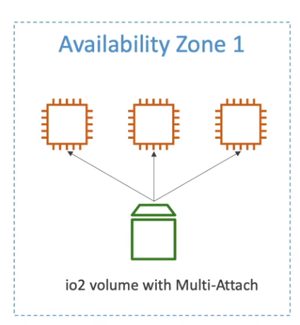
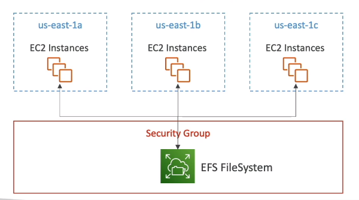
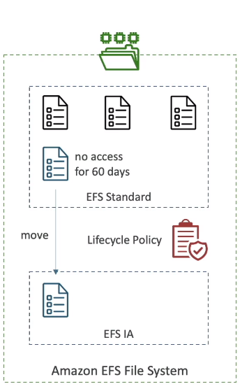
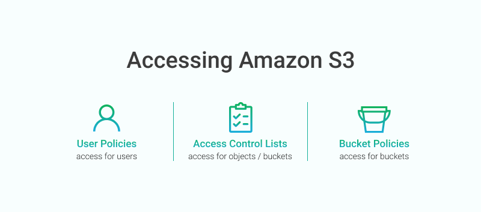
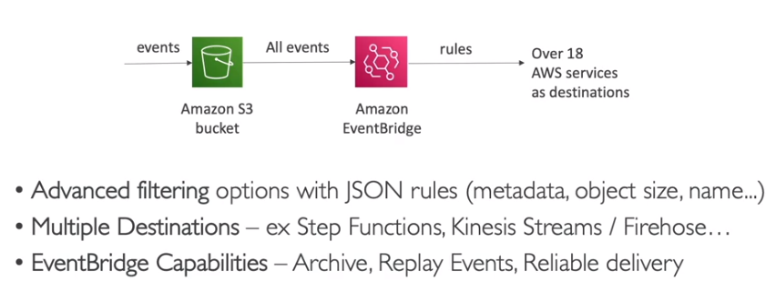
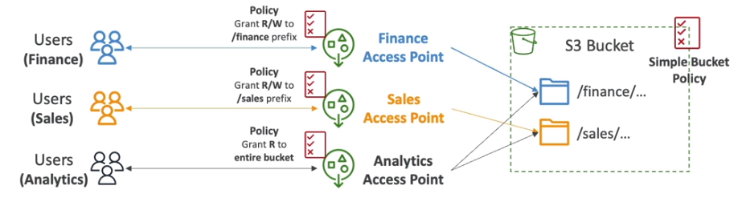
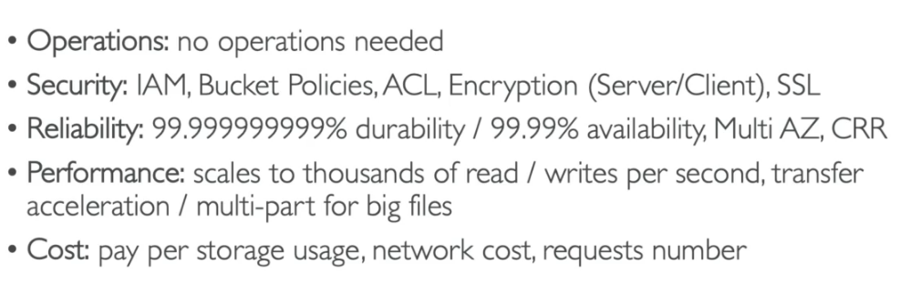
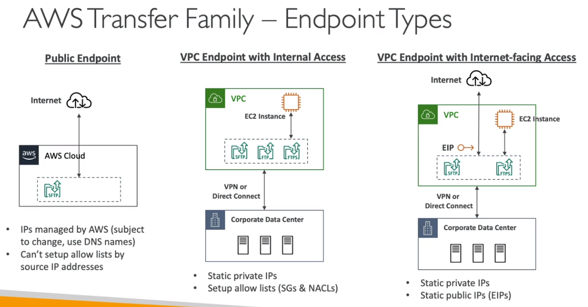
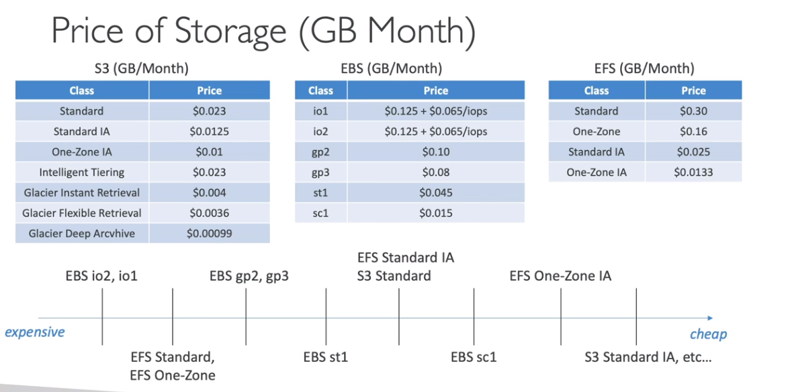

---

## EBS - Elastic Block Storage  

O **Amazon EBS (Elastic Block Store)** é um serviço de **armazenamento persistente** para instâncias **EC2**.
Ele fornece **volumes de armazenamento em bloco**, altamente disponíveis e replicados dentro da mesma **Zona de Disponibilidade (AZ)**.  

**Características principais**

- **Armazenamento de instâncias EC2**.  
- **Replicação automática dentro da Zona de Disponibilidade** para garantir disponibilidade e durabilidade.  
- **Backup feito por snapshots**, armazenados no **Amazon S3**.  
- **Possibilidade de criptografia** para dados em repouso, em trânsito e nos snapshots.  
- **Expansão de volume** sem necessidade de recriação.  

> Snapshots

- **Snapshots são backups do volume EBS** e podem ser feitos de forma **incremental** (somente os blocos alterados desde o último snapshot são salvos).  
- **Snapshots consomem I/O**, por isso é recomendável fazê-los quando há **baixo uso da instância**.  
- **Não é necessário parar a instância para criar um snapshot**, mas é **recomendado** para evitar inconsistências.  
- **Os snapshots são armazenados no Amazon S3 e podem ser copiados entre regiões**, permitindo **recuperação de desastres (Disaster Recovery)**.  
- **Pode-se criar AMIs a partir de snapshots**, facilitando a replicação de máquinas virtuais.  

:::tip **Dica para a prova 🎯**  
> Se precisar **migrar** um volume EBS **para outra região**, primeiro **crie um snapshot**, copie-o para a nova região e depois crie um novo volume EBS a partir desse snapshot.  
[Saiba mais sobre Snapshots do EBS](https://docs.aws.amazon.com/AWSEC2/latest/UserGuide/EBSSnapshots.html)  
:::  

---

> Criptografia

- **Pode ser aplicada a volumes EBS, snapshots e AMIs criadas a partir de volumes criptografados**.  
- **Transparente para o usuário**, sem impacto no desempenho.  
- **Para criptografar um volume não criptografado:**  
  1. Criar um snapshot do volume.  
  2. Criar uma **cópia do snapshot** marcando a opção de criptografia.  
  3. Criar um novo volume a partir desse snapshot criptografado.  
  4. Conectar o volume à instância EC2.  

---

> RAID com EBS

O **EBS permite a configuração de RAID**, mas isso deve ser feito no **sistema operacional da instância EC2** (não há suporte nativo no console da AWS).  

- **RAID 0** - Os dados são distribuídos entre vários discos.  
  - **Vantagem**: melhora o desempenho, aumentando a taxa de transferência.  
  - **Desvantagem**: não há tolerância a falhas.  
- **RAID 1** - Os dados são espelhados entre os discos.  
  - **Vantagem**: alta disponibilidade e tolerância a falhas.  
  - **Desvantagem**: armazenamento duplicado (usa o dobro de espaço).  

:::info **Importante**  
- **RAID 0** é usado para **desempenho**, como em cargas de trabalho intensivas de leitura/escrita.  
- **RAID 1** é usado para **alta disponibilidade**, pois garante que os dados sejam espelhados em dois volumes.  
:::  

---

> Tipos de EBS

  
  

Os volumes **io1/io2** permitem conexão **simultânea** a **várias instâncias EC2**, sendo úteis para aplicações distribuídas como **Apache Cassandra**.  

  

:::tip **Dica para a prova 🎯**  
> Se a questão mencionar **várias instâncias acessando o mesmo volume EBS**, a resposta pode ser **io1/io2 com Multi-Attach**.  
[Saiba mais sobre Multi-Attach](https://docs.aws.amazon.com/AWSEC2/latest/UserGuide/ebs-volumes-multi.html)  
:::  

---

> Data Lifecycle Manager (DLM)  

O **AWS Data Lifecycle Manager (DLM)** permite **automatizar a criação, retenção e exclusão de snapshots do EBS** e **AMIs**.  

> Recursos do DLM

- **Automatiza backups agendados**.  
- **Copia snapshots para outras regiões** (para recuperação de desastres).  
- **Permite deletar snapshots antigos automaticamente** para evitar custos desnecessários.  
- **Usa tags para definir quais volumes devem ser protegidos**.  

**Diferença entre **AWS Backup** e **DLM****

| Característica        | AWS Backup                                  | Data Lifecycle Manager (DLM)          |
| --------------------- | ------------------------------------------- | ------------------------------------- |
| **Abrangência**       | Gerencia backups de vários serviços AWS     | Gerencia apenas backups de EBS e AMIs |
| **Automação**         | Backup centralizado para múltiplos serviços | Automação focada em EBS e AMIs        |
| **Retenção de dados** | Políticas flexíveis de retenção e expiração | Apenas snapshots e AMIs               |

:::tip **Dica para a prova 🎯**  
> Se a questão falar sobre **gestão automatizada de snapshots do EBS**, a resposta provavelmente será **Data Lifecycle Manager (DLM)**.  
Se a pergunta envolver **gerenciamento centralizado de backups de vários serviços AWS**, então **AWS Backup** é a resposta correta.  
[Saiba mais sobre AWS DLM](https://docs.aws.amazon.com/AWSEC2/latest/UserGuide/snapshot-lifecycle.html)  
:::  

---

## Instance Store  

O **Instance Store** é um tipo de armazenamento em bloco que fica diretamente **dentro do host físico** onde a instância EC2 está sendo executada.  

> Características  

- **Diferente do EBS**, que é um armazenamento persistente fora do host, o **Instance Store** armazena os dados **no próprio servidor físico** onde a instância está rodando.  
- **Não permite redimensionamento** (não é possível aumentar ou diminuir o tamanho do volume).  
- **Melhor desempenho de I/O** comparado ao EBS, pois o armazenamento está fisicamente dentro do host.  
- **Os dados são temporários** e são perdidos ao parar ou terminar a instância.  
- **Recomendado para armazenar cache, dados temporários e buffers**.  
- Algumas instâncias EC2 vêm com discos locais **diretamente conectados ao servidor físico** onde são virtualizadas.  
- **Hibernação disponível**: permite preservar os dados armazenados no **Instance Store** quando a instância entra em hibernação.  

  

:::tip **Dica para a prova 🎯**  
> Se a questão mencionar **armazenamento de alta velocidade, temporário e sem persistência**, a resposta provavelmente será **Instance Store**.  
Se a questão tratar de **armazenamento persistente**, então **EBS** é a melhor resposta.  
[Saiba mais sobre o Instance Store](https://docs.aws.amazon.com/AWSEC2/latest/UserGuide/InstanceStorage.html)  
:::  

---

## EFS - Elastic File System  

O **Amazon EFS (Elastic File System)** é um **sistema de arquivos escalável e totalmente gerenciado**, que pode ser montado em **múltiplas instâncias EC2** simultaneamente.  

  

> Características  

- **Usa o protocolo NFSv4.1**, permitindo que várias instâncias EC2 acessem o mesmo sistema de arquivos simultaneamente.  
- **Diferente do EBS**, que só pode ser montado em uma única **Zona de Disponibilidade (AZ)**, o **EFS** pode ser montado em várias **AZs**.  
- **Modelo de pagamento por uso**: você paga apenas pelo armazenamento utilizado.  
- **Proteção de acesso via Security Groups**.  
- **Suporte apenas para Linux (AMI)**, **não compatível com Windows**.  
- **Possibilidade de criptografia usando AWS KMS**.  
- **Suporte a AWS Access Point**, permitindo restrição de acesso para diferentes usuários.  

  

- **Suporte a milhares de conexões simultâneas**, com **throughput superior a 10GB/s**.  
- **Permite replicação entre regiões (Cross-Region Replication)**.  

---

> Modos de Desempenho  

O **modo de performance** do EFS pode ser definido na criação:  

- **General Purpose (padrão)** → Recomendado para aplicações como servidores web e CMS (ex: WordPress).  
- **Max I/O** → Ideal para Big Data, Machine Learning e processamento de vídeo.  

> Modos de Throughput  

O throughput do EFS pode ser ajustado de três formas:  

- **Bursting** → Começa com 1 TB = 50MiB/s e pode atingir picos de até **100MiB/s**.  
- **Provisioned** → Permite definir manualmente um nível de throughput.  
- **Elastic** → Escala automaticamente de acordo com a carga de trabalho.  

---

> Storage Tiers  

O **EFS suporta gerenciamento de ciclo de vida**, permitindo mover arquivos automaticamente para uma camada de armazenamento mais barata após **30 dias de inatividade**.  

- **Standard** → Para arquivos acessados frequentemente.  
- **Infrequent Access (EFS-IA)** → Para arquivos acessados raramente.  
  - **Menor custo de armazenamento**, mas cobra taxa por recuperação de dados.  

  

---

> Casos de Uso  

- Compartilhamento de arquivos entre várias instâncias EC2.  
- Hospedagem de sites que precisam de armazenamento compartilhado (ex: **WordPress**).  
- Ambientes de desenvolvimento e análise de dados que exigem **escalabilidade automática**.  
- Aplicações que necessitam de um **sistema de arquivos distribuído e tolerante a falhas**.  

  

:::tip **Dica para a prova 🎯**  
> Se a questão mencionar **armazenamento de arquivos compartilhado entre várias instâncias EC2**, a resposta provavelmente será **EFS**.  
Se a necessidade for **armazenamento de bloco persistente** para uma única instância, então a melhor opção será **EBS**.  
[Saiba mais sobre o Amazon EFS](https://docs.aws.amazon.com/efs/latest/ug/whatisefs.html)  
:::  

---

## Amazon FSx  

O **Amazon FSx** é um serviço da AWS que permite configurar **sistemas de arquivos de terceiros totalmente gerenciados**.   Ele é semelhante ao **EFS**, mas enquanto o EFS é voltado para sistemas baseados em **Linux** com o protocolo **NFS**, o FSx permite o uso de sistemas de arquivos mais específicos, como **Windows File Server, Lustre, NetApp ONTAP e OpenZFS**.  

> Características Gerais  

- **Gerenciado pela AWS**, eliminando a necessidade de configurar e manter servidores de arquivos manualmente.  
- **Oferece suporte a diferentes sistemas de arquivos** para atender a diversas necessidades de desempenho e compatibilidade.  
- **Permite escolher entre implantação Single-AZ e Multi-AZ**.  
  - **Não é possível converter** um sistema de arquivos **Single-AZ para Multi-AZ** diretamente.  
  - Para migração, pode-se criar um novo **Multi-AZ** e usar **AWS DataSync** ou realizar um backup da versão **Single-AZ** e restaurá-lo na versão **Multi-AZ**.  
- **Não é possível reduzir o tamanho do sistema de arquivos**, apenas aumentá-lo.  
  - Caso precise diminuir, a recomendação é criar um novo FSx e utilizar **AWS DataSync** para copiar os dados.  

---

> Tipos de FSx  

O **Amazon FSx** suporta quatro tipos principais de sistemas de arquivos:  

> FSx for Lustre  

- **Lustre** é um sistema de arquivos distribuído e paralelo otimizado para **computação de alto desempenho (HPC)**.  
- Utilizado em **Machine Learning, Big Data, simulações científicas e renderização de vídeos**.  
- Suporta integração com **Amazon S3**, permitindo ler e escrever diretamente no S3.  
  - **Lazy Loading (Carregamento Preguiçoso)** → Os dados do S3 são carregados apenas quando solicitados, evitando custos desnecessários ao transferir grandes volumes de dados.  

**Tipos de FSx for Lustre**
  1. **Scratch File System**  
     - Projetado para **armazenamento temporário**, sem replicação de dados.  
     - **Extremamente rápido** (até **6x mais rápido**, com throughput de **200MBps**).  
     - **Recomendado para cargas de trabalho temporárias** que precisam de alta performance.  

       

  2. **Persistent File System**  
     - **Projetado para armazenamento de longo prazo**.  
     - **Os dados são replicados dentro da mesma AZ**, garantindo maior disponibilidade.  
     - Mais adequado para workloads que exigem **persistência e redundância**.  

       

---

> FSx for Windows File Server  

- **Compatível com protocolos SMB e NTFS**.  
- **Suporte ao Active Directory da Microsoft**, permitindo integração com domínios existentes.  
- **Suporta Distributed File System (DFS)**, possibilitando criar um sistema de arquivos distribuído.  
- **Permite agrupar múltiplos file systems com DFS Namespaces**, simplificando a organização dos dados.  

---

> FSx for NetApp ONTAP  

- **Permite criar sistemas de arquivos baseados no NetApp ONTAP** (compatível com Linux, macOS e Windows).  
- Compatível com **NFS, SMB e iSCSI**, oferecendo alta flexibilidade.  
- Ideal para empresas que já utilizam soluções NetApp e desejam migrar para a AWS.  

---

> FSx for OpenZFS  

- Compatível com **NFS (v3, v4, v4.1, v4.2)**.  
- **Permite rodar o sistema de arquivos ZFS na AWS**, oferecendo suporte a snapshots, compressão e alta integridade dos dados.  
- Ótimo para cargas de trabalho que exigem **alta confiabilidade e eficiência no uso de espaço**.  

---

:::tip **Dica para a prova 🎯**  
> Se a questão mencionar **armazenamento de arquivos para Windows**, a resposta mais adequada será **FSx for Windows**.  
Se for **computação de alto desempenho (HPC)**, a resposta será **FSx for Lustre**.  
Se a questão mencionar **NetApp ONTAP** ou **OpenZFS**, deve-se escolher FSx específico para essas tecnologias.  
[Saiba mais sobre Amazon FSx](https://docs.aws.amazon.com/fsx/latest/WindowsGuide/what-is-fsx.html)  
:::  

---

## Amazon S3

:::info O que é?
O **Amazon S3 (Simple Storage Service)** é um serviço de armazenamento de objetos da AWS. Ele é altamente escalável, durável e seguro, sendo utilizado para armazenar e recuperar qualquer quantidade de dados a qualquer momento.
:::

### Características Principais

- É um serviço **regional** com visibilidade **global**.
- É totalmente gerenciado pela AWS.
- O nome do bucket deve ser **único globalmente**, pois é utilizado na URL dos arquivos armazenados. O nome deve ter entre **3 a 63 caracteres**, sem caracteres especiais.
- Os dados são **replicados em pelo menos 3 zonas de disponibilidade (AZs)** dentro da região escolhida.
- Possui uma durabilidade de **99,999999999% (11 noves)**.
- É possível definir permissões de acesso para buckets e objetos.
- Permite armazenar arquivos de **0 bytes até 5 terabytes de tamanho**.
- **Multipart Upload** é um processo que permite dividir um arquivo grande em partes menores e enviá-las paralelamente.
  - O uso de **Multipart Upload** é recomendado para arquivos maiores que **100 MB**.
  - É possível remover partes incompletas usando **lifecycle policy**, para evitar desperdício de armazenamento devido a uploads cancelados.
- É possível recuperar objetos utilizando **recuperação em paralelo**, onde o arquivo é baixado em partes simultaneamente.
  - Também é possível recuperar apenas o **cabeçalho do arquivo**, economizando largura de banda.
- O S3 é um sistema de **armazenamento baseado em objetos (Object-Level Storage)**.
- As ações dentro do S3 podem gerar eventos para automação e monitoramento.
- Para controle de acesso, existem dois mecanismos principais:
  - **ACL (Access Control List):** Define regras de acesso a objetos e buckets.
  - **Bucket Policy:** Permite definir regras mais granulares de acesso ao bucket.

:::tip Casos de Uso
- **Backup e armazenamento de dados**.
- **Hospedagem de aplicações (sites estáticos)**.
- **Armazenamento de mídia (imagens, vídeos, áudios)**.
- **Distribuição de software e atualizações**.
:::

> Segurança e Compliance

- **Glacier Vault Lock:** Permite configurar regras para impedir a exclusão de arquivos, garantindo conformidade regulatória.
- **S3 Object Lock:** Semelhante ao Vault Lock, mas permite configurar **retenção temporal**. Por exemplo:
  - Um arquivo pode ser protegido contra modificação por **30 dias**.
  - Uma nota fiscal pode ser configurada para não ser excluída por **5 anos**.
- **S3 Events:** Integra-se apenas com **SNS, SQS e Lambda** para notificações e automação.
- S3 permite adicionar **metadados e tags** aos objetos, mas **não é possível pesquisar objetos diretamente por eles**. Para buscar objetos por metadados, é recomendado armazenar essas informações no **DynamoDB** e usá-lo como indexador.

> Precificação

:::info Como é cobrado?
O custo do S3 depende dos seguintes fatores:
- Armazenamento (GBs por mês).
- Transferência de dados **para fora da região do bucket**.
- Requisições via API: **PUT, GET, COPY, LIST, POST**.
:::

---

> Classes de S3

:::info
O Amazon S3 oferece diversas classes de armazenamento para diferentes necessidades de acesso e custo. Escolher a classe correta pode otimizar custos e garantir o nível adequado de disponibilidade e durabilidade dos dados.
:::

- **Standard S3:** Classe de uso geral, projetada para dados que precisam estar disponíveis imediatamente e com alta durabilidade.
- **Intelligent-Tiering:** Projetada para dados com padrões de acesso variáveis. Move automaticamente objetos não acessados por 30 dias para uma camada de menor custo e retorna os dados à camada de alto desempenho quando acessados.
- **Standard-Infrequent Access (IA):** Para dados acessados raramente, mas que precisam de resposta rápida quando acessados. Tem menor custo de armazenamento em relação ao Standard S3, mas cobra por recuperação.
- **One Zone-IA:** Similar ao Standard-IA, mas armazena os dados em uma única Zona de Disponibilidade (AZ), resultando em menor custo e menor durabilidade.
- **Glacier Instant Retrieval:** Ideal para dados arquivados que precisam ser acessados ocasionalmente, oferecendo recuperação em milissegundos. A duração mínima de armazenamento é de 90 dias.
- **Glacier Flexible Retrieval:** Para arquivamento de longo prazo, onde cada arquivo é chamado de **Archive** e armazenado em **Vaults** (equivalente a buckets). Formas de recuperação:
  - **Expedited**: (1 a 5 minutos) - Custo: $10
  - **Standard**: (3 a 5 horas) - Custo: $0.05
  - **Bulk**: (5 a 12 horas) - Gratuito
  - Duração mínima de armazenamento: 90 dias.
- **Glacier Deep Archive:** Projetado para arquivamento de longo prazo (anos). Formas de recuperação:
  - **Standard**: (12 horas) - Custo: $0.10
  - **Bulk**: (48 horas) - Custo: $0.025
  - Duração mínima de armazenamento: 180 dias.

:::tip
É possível utilizar o **Intelligent-Tiering** para mover automaticamente os dados entre diferentes classes de armazenamento, otimizando custos.
:::

Recomendação de leitura: [Analise as classes de armazenamento do Amazon S3, do padrão ao Glacier](https://searchaws.techtarget.com/tip/Analyze-Amazon-S3-storage-classes-from-Standard-to-Glacier)

:::tip **Dica para a prova 🎯**  
> Questões frequentemente abordam **diferentes classes de armazenamento do S3**, pedindo para identificar a mais adequada com base em custo, latência de recuperação e tempo mínimo de retenção.  

📌 **Exemplo:** Uma empresa precisa armazenar backups de logs que raramente serão acessados, mas devem ser mantidos por pelo menos **180 dias**. Qual a classe de armazenamento do S3 mais adequada para reduzir custos?  
- ✅ Amazon S3 Glacier Deep Archive  

---

> O **S3 Object Lock** pode ser exigido em conformidade com regulamentos como **HIPAA, FINRA e SEC 17a-4(f)**, garantindo que arquivos não possam ser modificados ou excluídos dentro de um período específico.  

📌 **Exemplo:** Uma empresa do setor financeiro precisa armazenar documentos regulatórios que **não podem ser apagados ou modificados por 7 anos**. Qual funcionalidade do S3 deve ser utilizada?  
- ✅ Amazon S3 Object Lock no modo Compliance  

---

> Questões podem testar **eventos do S3** e como automatizar fluxos de trabalho quando um arquivo é carregado ou excluído.  

📌 **Exemplo:** Um time de Data Science quer ser **automaticamente notificado** sempre que um novo dataset for carregado no S3. Como isso pode ser implementado?  
- ✅ Configurar **S3 Event Notifications** para acionar um tópico **SNS** ou enviar mensagens para **SQS**  

---

> Questões podem abordar **restrições de nomeação de buckets** e visibilidade global do S3.  

📌 **Exemplo:** Uma equipe tenta criar um bucket do S3 chamado `logs`. No entanto, a criação falha. Qual pode ser o motivo?  
- ✅ O nome do bucket do S3 deve ser **único globalmente**, e `logs` já pode estar em uso por outra conta.  

---

> O **S3 Transfer Acceleration** pode ser útil para acelerar uploads de arquivos para buckets que precisam receber dados de diferentes partes do mundo.  

📌 **Exemplo:** Um time de desenvolvimento precisa permitir **uploads rápidos de arquivos grandes** para um bucket do S3 a partir de clientes localizados globalmente. Qual recurso AWS pode ajudar?  
- ✅ **S3 Transfer Acceleration**  

---

> Questões podem comparar **diferentes formas de recuperação de objetos armazenados no Glacier**.  

📌 **Exemplo:** Um cliente armazenou arquivos no **Glacier Flexible Retrieval** e precisa recuperar os dados em **menos de 5 minutos**. Qual método de recuperação deve ser usado?  
- ✅ **Expedited Retrieval**  
:::
---

### Gerenciamento de Armazenamento

> Consistência de Dados

A consistência de dados no S3 segue o seguinte modelo:

- **Leitura após gravação para novos objetos:** Assim que um novo objeto é gravado no S3, ele pode ser imediatamente lido.
- **Consistência eventual para sobrescrita e deleção:** Se um objeto for sobrescrito ou excluído, pode haver um pequeno atraso até que a alteração se propague.

:::info  
Esse comportamento pode impactar aplicações que dependem de leitura imediata após atualizações de objetos.  
:::

---

> Replicação 

- O **S3 Versioning** deve estar habilitado em ambos os buckets para que a replicação funcione corretamente.
- A replicação pode ser configurada entre diferentes contas AWS.
- **Não replica regras do Lifecycle Management.**
- Existem três tipos de replicação:

  - **SRR (Same Region Replication):**  
    - Usado para agrupamento de logs e replicação de dados entre diferentes ambientes (por exemplo, desenvolvimento e homologação).

  - **CRR (Cross Region Replication):**  
    - Usado para requisitos de conformidade (compliance), redução de latência de acesso e replicação entre contas diferentes.

  - **S3 RTC (Replication Time Control):**  
    - Garante que a maioria dos objetos do S3 seja replicada em segundos e que 99,99% sejam replicados em no máximo 15 minutos.
    - Usado para compliance e **Disaster Recovery**.

  

:::warning  
Após a habilitação, **apenas novos objetos serão replicados**. Objetos já existentes **não** serão replicados automaticamente.  
:::

- A deleção pode ser replicada, mas isso é opcional. Se não for ativada, o marcador de deleção **não será propagado para o bucket de destino**.

---

> Versionamento

O **versionamento** no S3 permite que múltiplas versões de um objeto sejam armazenadas, garantindo proteção contra exclusões acidentais.

:::tip  
Se um objeto for excluído, o S3 apenas adicionará um marcador de exclusão, sem remover completamente os dados.  
:::

---

> Gerenciamento do Ciclo de Vida

O gerenciamento do ciclo de vida permite definir regras automáticas para mover e excluir objetos no S3, reduzindo custos de armazenamento.

- **Ações de transição:** Movem objetos entre classes de armazenamento, como do **S3 Standard** para **S3 Glacier**.
- **Ações de expiração:** Definem um tempo para que objetos sejam automaticamente deletados.
- Regras podem ser aplicadas com base em **prefixos** ou **tags**, permitindo segmentação granular (por exemplo, mover apenas objetos de uma determinada pasta).

:::info  
Essa funcionalidade é essencial para otimizar custos ao mover arquivos menos acessados para camadas de armazenamento mais baratas.  
:::

---

> Aceleração de Transferência

O **S3 Transfer Acceleration** usa a rede global da AWS para acelerar uploads para buckets S3, melhorando a velocidade de transferência, principalmente para usuários geograficamente distantes do bucket de destino.

:::tip  
Ideal para uploads de arquivos grandes ou aplicações globais com alto volume de transferência de dados.  
:::

---

> Storage Class Analysis

:::info O que é?
O **Storage Class Analysis** ajuda a identificar padrões de uso dos objetos armazenados no S3. Ele permite decidir quando mover objetos para classes de armazenamento mais econômicas, como S3 Glacier ou S3 Intelligent-Tiering.
:::

- Analisa automaticamente os padrões de acesso aos dados.
- Ajuda a otimizar custos, sugerindo mudanças de classe de armazenamento.
- Exibe relatórios detalhados sobre o uso dos objetos ao longo do tempo.

---
> Storage Lens

:::info O que é?
O **Storage Lens** fornece insights detalhados sobre a utilização do armazenamento S3 em toda a organização. Ele permite monitorar, analisar e otimizar o uso do armazenamento.
:::

- Permite visualizar múltiplas regiões e contas em um painel unificado.
- Gera relatórios detalhados sobre o armazenamento e uso de objetos.
- Possui opção para configurar métricas personalizadas.

---

:::tip **Dica para a prova 🎯**  
> Questões frequentemente testam o comportamento de **consistência de dados no S3**, especialmente para leitura após gravação e sobrescrita de objetos.  

📌 **Exemplo:**  Uma aplicação grava um arquivo em um bucket S3 e imediatamente tenta lê-lo. Em seguida, o mesmo arquivo é atualizado e lido novamente logo após a atualização. Qual comportamento pode ser esperado?  
- ✅  
  - A primeira leitura será bem-sucedida, pois o S3 garante **consistência de leitura após gravação para novos objetos**.  
  - A segunda leitura pode retornar a versão anterior do arquivo por um curto período, pois **atualizações e deleções seguem consistência eventual**.  

---

> Questões podem abordar **replicação de dados no S3**, como SRR (Same Region Replication) e CRR (Cross Region Replication).  

📌 **Exemplo:**  Uma empresa quer garantir que os dados armazenados no S3 sejam replicados automaticamente em **outra conta AWS, localizada em uma região diferente**, para atender requisitos de compliance. Qual solução AWS deve ser usada?  
- ✅ **Cross Region Replication (CRR)**  

---

> O **versionamento no S3** é um tema recorrente, testando como objetos são protegidos contra exclusões acidentais.  

📌 **Exemplo:**  Uma equipe ativou o versionamento em um bucket S3. Posteriormente, um usuário exclui um arquivo acidentalmente. Como a equipe pode recuperar esse arquivo?  
- ✅ O S3 cria um **marcador de exclusão**, mas **a versão antiga do objeto ainda existe** e pode ser restaurada removendo o marcador.  

---

> Questões podem explorar o **gerenciamento do ciclo de vida (Lifecycle Management)** do S3 para otimização de custos.  

📌 **Exemplo:**  Uma empresa quer mover arquivos do S3 Standard para **Glacier** automaticamente após 90 dias e excluir os arquivos após 1 ano. Como isso pode ser configurado?  
- ✅ Criar uma **regra de ciclo de vida** no bucket S3 com as seguintes ações:  
  - **Transição** para Glacier após 90 dias.  
  - **Expiração** do objeto após 365 dias.  

---

> Questões podem envolver **S3 Transfer Acceleration**, usado para melhorar a velocidade de uploads globais para o S3.  

📌 **Exemplo:**  Um time de desenvolvimento precisa permitir **uploads rápidos de arquivos grandes** para um bucket do S3 a partir de clientes localizados globalmente. Qual recurso AWS pode ajudar?  
- ✅ **S3 Transfer Acceleration**  

::::

---

### Segurança e Controle de Acesso

> Criptografia

:::info
O S3 suporta diversas formas de criptografia para proteger os dados, tanto em repouso quanto em trânsito.
:::

- **SSE-S3**: Criptografa os objetos usando chaves gerenciadas pela AWS (AES-256).
  - Utilizado por padrão para todos os dados armazenados no Glacier.
  - Requer o cabeçalho HTTP `X-amz-server-side-encryption: AES256`.
- **SSE-KMS**: Utiliza chaves gerenciadas pelo AWS Key Management Service (KMS).
  - As chamadas ao KMS são registradas no CloudTrail para auditoria.
  - Requer o cabeçalho HTTP `X-amz-server-side-encryption: aws:kms`.
  - Se um bucket for público, mas estiver usando SSE-KMS, os usuários não conseguirão acessar os objetos sem permissões específicas da chave KMS.
  - Para realizar uploads, é necessário ter a permissão `kms:GenerateDataKey`, caso contrário, a operação falhará.
- **SSE-C**: O usuário fornece a chave de criptografia ao enviar os dados. Recomendado para quem usa soluções como AWS CloudHSM.
- **Criptografia Client-Side**: Os dados são criptografados antes do upload para o S3, garantindo que a AWS nunca tenha acesso ao conteúdo não criptografado.

**Configuração Adicional de Segurança**

- **Forçar uso de SSL:** É possível criar uma *Bucket Policy* para exigir que todas as conexões usem SSL, utilizando a condição `aws:SecureTransport`.
- **Criptografia em Trânsito:**
  - O S3 disponibiliza dois endpoints:
    - **HTTP**: Sem criptografia (não recomendado).
    - **HTTPS**: Utiliza SSL/TLS para segurança em trânsito.
      - Obrigatório ao usar SSE-C para garantir a proteção da chave de criptografia.
- **Criptografia Default:** Se um bucket tiver criptografia padrão ativada e um objeto for enviado já criptografado pelo cliente, ele não será criptografado novamente.

:::tip
Sempre utilize HTTPS ao interagir com o S3 para garantir a segurança dos dados em trânsito.
:::

---

> Controle de Acesso

- **Baseado em usuários (User-based):**  
  - Acesso controlado via permissões do **IAM**.
  - Todas as chamadas de API são validadas pelo IAM.

- **Baseado em recursos (Resource-based):**  
  - **Bucket Policies:**  
    - Define permissões para buckets e pode conceder acesso a outras contas ou serviços AWS.
    - Escrito em **JSON**.
    - Pode ser usado para:
      - Tornar um bucket público.
      - **Forçar criptografia** nos objetos armazenados.
      - Conceder acesso entre contas (**cross-account access**).
      - Aplicar restrições baseadas em IP ou VPC.
  - **Object ACLs e Bucket ACLs:**  
    - **Object ACLs** definem permissões por objeto.
    - **Bucket ACLs** definem permissões no nível do bucket (menos comum).

  

:::warning  
O controle de acesso no S3 pode ser feito via IAM **ou** Bucket Policy. Caso contrário, o acesso será negado.  
:::

---

> Segurança e Auditoria

O S3 fornece ferramentas para auditoria e monitoramento:

- **S3 Access Logs:** Registra acessos ao bucket, podendo ser armazenados em outro S3.
- **CloudTrail:** Monitora chamadas de API relacionadas ao S3.
- **MFA Delete:** Protege contra exclusões acidentais exigindo autenticação multifator (MFA) para deletar objetos.

---

> MFA Delete

:::warning
O **MFA Delete** impede a exclusão permanente de objetos versionados no S3, adicionando uma camada extra de segurança.
:::

- Deve ser habilitado pelo **proprietário do bucket** (conta root).
- Só pode ser ativado via **CLI**, usando o perfil da **conta root**.
- Requer que o **Versionamento do S3** esteja ativado.
- Quando é necessário:
  - Para excluir permanentemente um objeto.
  - Para desabilitar o versionamento do bucket.
- Quando **não** é necessário:
  - Para excluir uma versão específica de um objeto.
  - Para habilitar o versionamento.

---

> Vault Lock e S3 Object Lock

**Vault Lock**

- Implementa o **WORM (Write Once, Read Many)**.
- Permite a configuração para que arquivos **nunca sejam excluídos ou alterados**.
- Utilizado principalmente para **compliance e retenção obrigatória de dados**.

**S3 Object Lock**

- Similar ao **Vault Lock**, mas permite definir um período de retenção.
- Exemplos de uso:
  - Impedir a modificação de um arquivo por **30 dias**.
  - Garantir que uma **nota fiscal seja preservada por 5 anos**.
- Também adota o **WORM (Write Once, Read Many)**.

--- 

> VPC Endpoint para o S3

:::info
Os **VPC Endpoints** permitem o acesso direto ao S3 sem passar pela internet, ideal para instâncias sem conectividade externa.
:::

- Possibilita acesso seguro a **buckets públicos ou cross-account**.
- Evita a necessidade de NAT Gateway ou Internet Gateway para comunicação com o S3.
  
  

---

:::tip **Dica para a prova 🎯**  
> Questões frequentemente abordam **diferentes métodos de criptografia no S3**, pedindo para identificar o mais adequado para cada cenário.  

📌 **Exemplo:**  Uma empresa precisa armazenar arquivos altamente sensíveis no S3 e quer garantir que apenas usuários autorizados possam descriptografá-los, além de registrar todas as tentativas de acesso à chave de criptografia. Qual método deve ser utilizado?  

- ✅ **SSE-KMS** (Server-Side Encryption com AWS KMS), pois permite controle granular sobre chaves e auditoria via CloudTrail.  

---

> O **MFA Delete** pode ser cobrado em perguntas para testar conhecimento sobre proteção contra exclusões acidentais.  

📌 **Exemplo:**  Uma empresa ativou o versionamento no S3 e quer impedir que objetos sejam excluídos permanentemente sem uma autenticação adicional. Qual funcionalidade deve ser usada?  

- ✅ **MFA Delete**, que exige um código de autenticação multifator para a exclusão permanente de objetos.  

---

> Questões podem explorar a diferença entre **controle de acesso baseado em IAM e Bucket Policy**.  

📌 **Exemplo:**  Uma equipe de segurança quer garantir que apenas usuários de um determinado grupo IAM possam acessar um bucket S3, sem precisar configurar permissões em cada objeto individualmente. Qual abordagem é recomendada?  

- ✅ **Bucket Policy**, pois permite definir regras de acesso no nível do bucket de forma centralizada.  

---

> O **VPC Endpoint para S3** pode ser exigido em cenários de segurança para evitar tráfego pela internet.  

📌 **Exemplo:**  Uma empresa tem instâncias em uma VPC privada sem acesso à internet, mas precisa permitir que essas instâncias acessem um bucket S3. Qual solução deve ser usada?  

- ✅ Criar um **VPC Endpoint para S3**, garantindo acesso seguro sem necessidade de NAT Gateway ou Internet Gateway.  

---

> O **S3 Object Lock** pode aparecer em questões relacionadas à retenção de dados e conformidade regulatória.  

📌 **Exemplo:**  Uma empresa do setor de saúde precisa armazenar registros médicos em um bucket S3, garantindo que esses arquivos **não possam ser modificados ou excluídos por um período de 10 anos**. Qual funcionalidade deve ser utilizada?  

- ✅ **S3 Object Lock no modo Compliance**, pois impede alterações e exclusões dentro do período configurado.  

:::

--- 

### Logs e Monitoramento

> Logs de Acesso

- O **S3 Access Logs** permite armazenar **server access logs** para auditoria e análise.
- Pode ser integrado ao **AWS Athena** para consulta e análise avançada.
- Os logs devem ser armazenados em um **bucket separado** para evitar loops infinitos.

---

> Eventos

**Access Logs**

:::info O que é?
O **S3 Access Logs** registra todas as requisições feitas ao bucket para auditoria e análise de acessos.
:::

- É possível armazenar os logs em outro bucket S3.
- Auxilia na auditoria e pode ser analisado usando o **Athena**.
- Os logs devem ser armazenados em um bucket diferente para evitar loops.
- A entrega dos logs pode levar algumas horas.
- Os registros podem estar incompletos em alguns casos.

**Event Notifications**

:::info O que é?
O **S3 Event Notifications** permite disparar eventos quando ocorrem mudanças em um bucket, como a criação ou exclusão de objetos.
:::

- Suporta envio de eventos para **SNS, SQS e Lambda**.
- É necessário criar uma **resource policy** para permitir que o S3 envie eventos para SNS, SQS ou Lambda.
- A policy deve ser anexada ao recurso de destino (SNS, SQS ou Lambda).
- Os eventos são enviados em segundos, mas podem levar alguns minutos.
- **Assim como no versionamento, em situações raras onde duas pessoas editam ao mesmo tempo, pode ocorrer o recebimento de apenas um evento em vez de dois.**

**Trusted Advisor**

:::info O que é?
O **Trusted Advisor** ajuda a monitorar e sugerir melhorias na segurança e configuração dos buckets S3.
:::

- Verifica permissões dos buckets para garantir que não estão públicos por engano.
- Permite visualizar alterações recentes e tomar ações corretivas.

**EventBridge**

:::info O que é?
O **EventBridge** é um serviço que permite criar regras de eventos e acionar serviços como Lambda, SNS e SQS com eventos do S3.
:::

- **Requer que o log em nível de objeto esteja habilitado para funcionar**.
- Permite integrar o S3 com uma gama mais ampla de serviços, diferente das **Event Notifications**, que suportam apenas SNS, SQS e Lambda.

---

:::tip **Dica para a prova 🎯**  
> Questões frequentemente abordam **S3 Access Logs** e sua utilização para auditoria.  

📌 **Exemplo:** Uma equipe de segurança deseja monitorar **todas as requisições feitas a um bucket S3**, registrando logs para auditoria e análise posterior. Qual solução da AWS deve ser utilizada?  

- ✅ **S3 Access Logs**, que registra todas as requisições ao bucket e pode ser armazenado em outro bucket para análise.  

---

> O **S3 Event Notifications** pode ser abordado em questões sobre notificações de eventos em buckets S3.  

📌 **Exemplo:** Uma aplicação precisa ser notificada **sempre que um novo objeto for enviado a um bucket S3**. A notificação deve ser enviada para um serviço da AWS que consiga processar a mensagem e executar uma ação automática. Qual solução é a mais apropriada?  

- ✅ **S3 Event Notifications** enviando eventos para um **Amazon SNS, Amazon SQS ou AWS Lambda**.  

---

> O **Trusted Advisor** pode aparecer em questões sobre **boas práticas de segurança no S3**.  

📌 **Exemplo:** Um time de compliance precisa verificar **se há buckets públicos na conta da AWS** para evitar exposição indevida de dados. Qual serviço da AWS pode ser utilizado para essa análise?  

- ✅ **AWS Trusted Advisor**, que identifica buckets públicos e sugere melhorias de segurança.  

---

> O **Amazon EventBridge** pode ser testado em questões sobre monitoramento de eventos do S3.  

📌 **Exemplo:** Uma empresa precisa capturar eventos **de cada objeto armazenado ou excluído no S3** e enviar essas informações para vários serviços da AWS além do SNS, SQS ou Lambda. Qual serviço é mais adequado?  

- ✅ **Amazon EventBridge**, pois oferece suporte a um conjunto mais amplo de destinos para eventos do S3.  

---

> Questões podem explorar a diferença entre **S3 Event Notifications e EventBridge**.  

📌 **Exemplo:** Um time de engenharia precisa processar **eventos em tempo real do S3**, mas requer suporte para múltiplos destinos além do SNS, SQS e Lambda. Qual serviço deve ser utilizado?  

- ✅ **Amazon EventBridge**, pois permite roteamento avançado e integração com diversos serviços além dos suportados pelo S3 Event Notifications.  

:::

---

### Acesso e Integração

> Presigned URLs

:::info
**Presigned URLs** permitem o acesso temporário a um recurso armazenado no S3, sem a necessidade de conceder permissões diretas ao usuário.
:::

- Pode-se usar o **AWS CLI** ou o **SDK** para gerar URLs assinadas.
  - Para **download**: processo simples, pode ser feito via CLI.
  - Para **upload**: mais complexo, deve ser realizado via SDK.
- O tempo de expiração padrão é **3600 segundos (1 hora)**, mas pode ser alterado:
  - **Console do S3**: de **1 minuto a 12 horas (720 minutos)**.
  - **AWS CLI**: até **604800 segundos (168 horas, ou 7 dias)**.
- As URLs assinadas podem ser geradas tanto para **GET (download)** quanto para **POST (upload)**.
  
  

---

> Access Points

:::info
Os **Access Points** simplificam o gerenciamento de permissões para buckets compartilhados.
:::

- Facilitam o controle de acesso, permitindo regras baseadas em **VPCs, tags e nomes de bucket**.
- O S3 gera um **novo pseudônimo de ponto de acesso (DNS Name)**.
- Em vez de configurar políticas complexas, cria-se um **Access Point** para gerenciar permissões de maneira centralizada.
  
  

---

> Multi-Region Access Points

:::info
Os **Multi-Region Access Points** direcionam automaticamente o tráfego para a região mais próxima, melhorando a latência e a disponibilidade.
:::

- Permite o acesso global a buckets replicados em múltiplas regiões.
- Ideal para **failover ativo-ativo ou ativo-passivo**.
- Reduz a latência ao direcionar usuários para a cópia mais próxima do bucket.
  
  

---

> Object Lambda

:::info
O **S3 Object Lambda** permite modificar ou enriquecer objetos do S3 no momento da recuperação, sem alterar o original.
:::

- Casos de uso:
  - Converter arquivos de **XML para JSON**.
  - Remover ou mascarar informações sensíveis para ambientes não produtivos.
  - Adicionar **marca d’água** em imagens e redimensioná-las automaticamente.
  
  

---

:::tip **Dica para a prova 🎯**  
> Questões podem abordar o uso de **Presigned URLs** para fornecer acesso temporário a objetos no S3 sem alterar permissões no bucket.  

📌 **Exemplo:** Uma aplicação precisa permitir que usuários façam **upload temporário de arquivos diretamente para um bucket S3**, sem conceder permissões permanentes ao bucket. Qual recurso da AWS deve ser utilizado?  

- ✅ **Presigned URLs**, pois permitem a geração de URLs temporárias para upload e download sem expor permissões do bucket.  

---

> Os **Access Points** do S3 são frequentemente abordados em questões sobre gerenciamento de permissões em buckets compartilhados.  

📌 **Exemplo:** Uma empresa precisa fornecer acesso a diferentes aplicações para um bucket compartilhado do S3, aplicando políticas específicas para cada aplicação sem gerenciar permissões no nível do bucket. Qual recurso do S3 deve ser utilizado?  

- ✅ **S3 Access Points**, pois permitem definir políticas de acesso separadas para diferentes aplicações e usuários.  

---

> Questões sobre **acesso otimizado e replicação em múltiplas regiões** podem abordar os **Multi-Region Access Points**.  

📌 **Exemplo:** Uma empresa multinacional precisa garantir **acesso rápido a arquivos armazenados no S3** para usuários em diversas regiões, minimizando latência e garantindo resiliência. Qual solução é mais adequada?  

- ✅ **Multi-Region Access Points**, pois direcionam automaticamente os usuários para a cópia mais próxima do bucket.  

---

> O **S3 Object Lambda** pode ser abordado em questões sobre modificação de objetos no momento do acesso.  

📌 **Exemplo:** Uma empresa precisa entregar versões mascaradas de documentos armazenados no S3 quando acessados por usuários sem permissões administrativas, sem modificar os arquivos originais. Qual recurso pode ser utilizado?  

- ✅ **S3 Object Lambda**, pois permite modificar objetos no momento da recuperação sem alterar os dados originais.  

---

> Questões sobre **acesso seguro ao S3** podem abordar a configuração de permissões para **Presigned URLs**.  

📌 **Exemplo:** Um desenvolvedor gerou uma **Presigned URL** para upload em um bucket S3, mas recebeu um erro de acesso negado ao tentar usá-la. O que pode estar causando esse problema?  

- ✅ O usuário que gerou a URL **não tem permissões suficientes** para realizar uploads no bucket ou para gerar **Presigned URLs** com permissões de escrita.  

:::
---

### Consultas e Analytics

> Select e Glacier Select

:::info O que é?
O **S3 Select** e o **Glacier Select** permitem recuperar partes de um objeto armazenado no Amazon S3 usando consultas SQL. Isso melhora a eficiência ao acessar grandes volumes de dados, pois evita o download completo do objeto.
:::

- Permite usar SQL para recuperar apenas os dados necessários de um objeto armazenado no S3 ou Glacier.
- Suporta filtros por linhas e colunas, realizando consultas SQL simples diretamente no armazenamento.
- **Economiza largura de banda**, pois as consultas são executadas no lado do S3, retornando apenas os resultados necessários.

Aqui estão cinco questões e dicas baseadas em **Consultas e Analytics no S3**:  

---

:::tip **Dica para a prova 🎯**  
> Questões podem abordar o uso do **S3 Select** para melhorar a eficiência da recuperação de dados.  

📌 **Exemplo:** Uma empresa armazena grandes arquivos CSV no S3 e deseja recuperar **apenas colunas específicas sem baixar o arquivo inteiro**. Qual recurso do S3 deve ser utilizado?  

- ✅ **S3 Select**, pois permite executar consultas SQL diretamente nos objetos do S3, reduzindo a necessidade de transferência de dados.  

---

> Questões sobre **acesso eficiente a dados arquivados** podem abordar o **Glacier Select**.  

📌 **Exemplo:** Uma empresa armazena dados arquivados no **S3 Glacier** e precisa recuperar **apenas registros específicos sem restaurar o objeto inteiro**. Qual recurso deve ser utilizado?  

- ✅ **Glacier Select**, pois permite realizar consultas SQL diretamente em objetos armazenados no Glacier, reduzindo custos e tempo de recuperação.  

---

> Questões podem exigir a escolha do **método mais eficiente** para processar grandes volumes de dados armazenados no S3.  

📌 **Exemplo:** Uma empresa precisa processar **petabytes de dados armazenados no S3** para análises de Big Data sem mover os arquivos para outro serviço. Qual solução é recomendada?  

- ✅ **AWS Athena**, pois permite executar consultas SQL diretamente nos dados armazenados no S3 sem necessidade de ETL.  

---

> Questões podem abordar estratégias para **reduzir custos ao analisar dados armazenados no S3**.  

📌 **Exemplo:** Uma empresa está enfrentando altos custos ao transferir grandes volumes de dados do S3 para um cluster de análise. Como esses custos podem ser reduzidos?  

- ✅ Utilizando **S3 Select** para processar os dados diretamente no S3, reduzindo a quantidade de dados transferidos para o cluster.  

:::

---

### Boas Práticas

> S3 Well-Architected

:::info
O **Well-Architected Framework** fornece diretrizes para construir aplicações eficientes, seguras e resilientes usando o S3.
:::

  

---

:::tip **Dica para a prova 🎯**  
> > O **Well-Architected Framework** pode ser testado em questões que exigem boas práticas para segurança e otimização de custos no S3.  

📌 **Exemplo:** Ao projetar uma solução de armazenamento na AWS, quais pilares do **AWS Well-Architected Framework** devem ser considerados para garantir eficiência e segurança?  

- ✅  
  - **Excelência Operacional**: Monitoramento e automação do S3.  
  - **Segurança**: Controle de acesso com IAM, KMS e políticas de bucket.  
  - **Confiabilidade**: Replicação entre regiões e versionamento.  
  - **Eficiência de Desempenho**: Uso de S3 Select para reduzir transferência de dados.  
  - **Otimização de Custos**: Uso de classes de armazenamento adequadas.  

:::

---

## AWS DataSync

**AWS DataSync** é um serviço gerenciado que facilita a movimentação de grandes volumes de dados entre ambientes on-premises e a AWS, bem como entre serviços dentro da própria AWS.

> **Características:**
- Permite transferências programadas de dados para **Amazon S3**, **Amazon FSx** e **Amazon EFS**, podendo ser configurado para ocorrer a cada hora, dia ou semana.
- Suporta os protocolos **SMB** (Server Message Block) e **NFS** (Network File System) para transferir dados de **NAS** (Network Attached Storage) para a AWS.
- Mantém as permissões, metadados e atributos dos arquivos transferidos, garantindo consistência e segurança.

:::tip **Dica para a prova 🎯**
Questões podem abordar integrações do DataSync com diferentes serviços de armazenamento e como configurar transferências eficientes.

📌 **Exemplo:** Uma empresa deseja migrar 100 TB de dados de um NAS on-premises para um bucket do Amazon S3 de forma rápida e automatizada. O requisito é que os metadados e permissões dos arquivos sejam preservados. Qual serviço AWS deve ser utilizado?

✅ AWS DataSync
:::

---

## AWS Transfer Family

O **AWS Transfer Family** é um serviço gerenciado que permite transferir arquivos de forma segura para a AWS usando **FTP, FTPS e SFTP**.

> **Características:**
- Suporta **DNS personalizado**, pois os endpoints públicos podem ter IPs dinâmicos.
- Facilita a integração com serviços de armazenamento como **Amazon S3** e **Amazon EFS**.

:::tip **Dica para a prova 🎯**

É importante entender quando usar **Transfer Family** em vez de outros métodos de transferência, como **DataSync** ou **Snowball**. Questões podem explorar autenticação, DNS e permissões para servidores SFTP gerenciados.

📌 **Exemplo:** Uma empresa deseja disponibilizar um servidor SFTP gerenciado para que clientes externos enviem arquivos diretamente para um bucket do S3. Qual serviço AWS pode atender essa necessidade?

✅ AWS Transfer Family
:::

---

## Comparação de Preços dos Serviços de Armazenamento

A AWS oferece diferentes serviços de armazenamento, cada um com um modelo de precificação distinto. É essencial conhecer as diferenças entre **S3, EBS, EFS, FSx e Glacier** para escolher a melhor opção conforme o caso de uso.

> Considerações para custos:
- **Amazon S3**: Preços baseados em armazenamento, requisições e transferência de dados.
- **Amazon EFS**: Modelo de pagamento por capacidade usada e classes de armazenamento otimizadas para custo.
- **Amazon FSx**: Preço varia conforme o sistema de arquivos escolhido (**Windows, Lustre, NetApp, OpenZFS**).
- **Amazon EBS**: Preço por gigabyte provisionado, com variações para SSD e HDD.
- **Amazon S3 Glacier**: Armazenamento de baixo custo para arquivamento de longo prazo, mas com custos de recuperação.

:::tip **Dica para a prova 🎯**
Questões frequentemente comparam os modelos de **precificação** dos serviços de armazenamento. Esteja preparado para identificar o mais econômico para um determinado caso de uso.

📌 **Exemplo:** Uma empresa precisa armazenar grandes volumes de arquivos que são acessados raramente, mas precisam ser recuperados em menos de 5 minutos. Qual serviço AWS apresenta o menor custo para esse requisito?

✅ Amazon S3 Glacier Instant Retrieval
:::