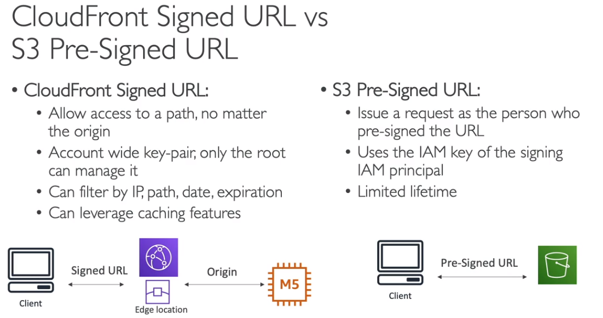
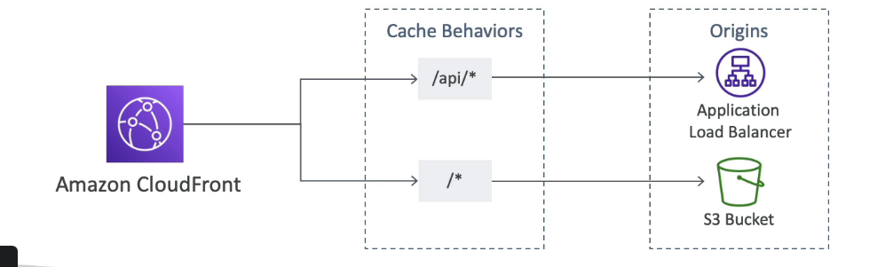
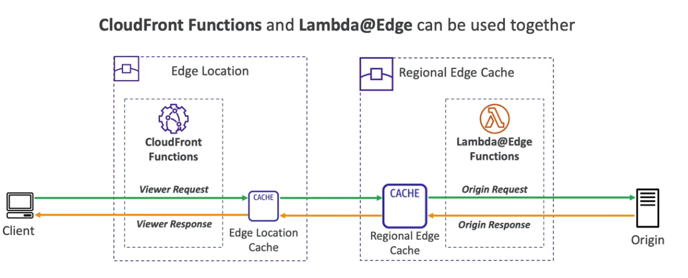
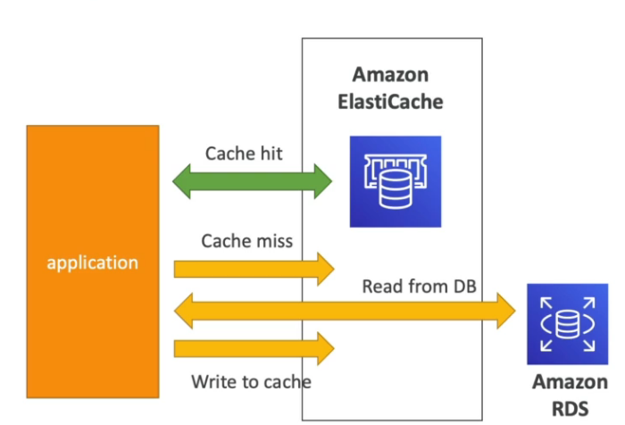

## Amazon CloudFront

Amazon CloudFront é um serviço de **CDN** (*Content Delivery Network*) da AWS que permite distribuir conteúdo globalmente com baixa latência e alto desempenho. Ele armazena em cache conteúdos estáticos em **Edge Locations** (pontos de presença) e oferece recursos avançados de segurança e personalização.

---

> Recursos e Benefícios

- **Redução de latência**: O CloudFront armazena conteúdos estáticos em *Edge Locations* próximas aos usuários finais, acelerando a entrega de arquivos.
- **Suporte a múltiplos protocolos**: Compatível com HTTP, HTTPS e WebSocket.
- **Alta disponibilidade**: Com mais de 216 pontos de presença globais, garante resiliência e baixa latência.
- **Proteção contra ataques DDoS**: Integrado ao AWS Shield para mitigar ataques de negação de serviço.
- **Geo Restriction** (*Restrições geográficas*): Permite bloquear o acesso de determinados países ao conteúdo usando o cabeçalho `CloudFront-Viewer-Country`.
- **Preços baseados no uso**: Cobrança por volume de dados trafegados, sendo mais barato conforme o uso aumenta.
- **Personalização de erros**: Permite criar páginas de erro personalizadas e armazená-las em cache para evitar chamadas recorrentes ao servidor de origem.

:::tip **Dica para a prova 🎯**  
> O preço do **CloudFront** varia conforme a **região** e a **quantidade de dados transferidos**. Quanto maior o volume de tráfego, menor o custo por GB.  
[Documentação de preços do CloudFront](https://aws.amazon.com/cloudfront/pricing/)  
:::

---

> Distribuição de Conteúdo Privado

- **CloudFront Signed URL**: Usado para distribuir conteúdos privados com URLs assinadas individualmente.
- **CloudFront Signed Cookies**: Permite distribuir múltiplos conteúdos privados usando um único cookie assinado.

**Diferença entre CloudFront Signed URL e S3 Signed URL**

---

> Configuração de Origem no CloudFront

CloudFront pode utilizar múltiplas origens para distribuir conteúdos, escolhendo a origem com base nos padrões de URL.

---

> Casos de Uso

**Amazon S3 como Origem**

- Ideal para distribuição de arquivos estáticos.
- Facilita o upload e gerenciamento de conteúdos.
- Protege contra ataques DDoS.
- Pode utilizar **Origin Access Identity (OAI)** para garantir que apenas o CloudFront acesse o bucket.
- O **Origin Access Control (OAC)** é a versão aprimorada do OAI, oferecendo mais controle sobre permissões de acesso.

:::tip **Dica para a prova 🎯**  
> O **OAC (Origin Access Control)** é a evolução do **OAI (Origin Access Identity)**, trazendo mais flexibilidade no controle de permissões de acesso ao **Amazon S3**.  
:::

**Origem Customizada**

- Pode ser um servidor HTTP hospedado em uma instância EC2.
- Ideal para sites dinâmicos e aplicações customizadas.
- Suporta entrega de vídeos sob demanda.

---

> CloudFront vs S3 Cross-Region Replication

| Característica | CloudFront | S3 Cross-Region Replication |
|--------------|------------|--------------------------|
| Tipo de replicação | Cache distribuído em pontos de presença | Cópia de objetos entre buckets em diferentes regiões |
| Melhor uso | Arquivos estáticos com cache configurável | Arquivos dinâmicos que precisam ser replicados |
| Configuração | Nenhuma replicação necessária | Deve configurar cada bucket manualmente |
| Custo | Cobrado por requisição e tráfego | Custo de armazenamento e transferência |

:::tip **Dica para a prova 🎯**  
> Use **CloudFront** para distribuição eficiente de arquivos **estáticos** e **S3 Cross-Region Replication** para sincronização de arquivos **dinâmicos** entre regiões.  
:::

---

> **Origin Groups**

CloudFront permite configurar **grupos de origem** para fornecer redundância e failover.

---

> **Field Level Encryption**

O recurso de **Field Level Encryption** permite criptografar dados sensíveis diretamente no nível do edge location, garantindo maior segurança no transporte dos dados.

:::warning **Atenção**  
> O **Field Level Encryption** permite criptografar **apenas campos específicos** do payload HTTP. Isso é útil para proteger informações sensíveis antes que cheguem ao backend.  
[Saiba mais sobre Field Level Encryption](https://docs.aws.amazon.com/AmazonCloudFront/latest/DeveloperGuide/field-level-encryption.html)  
:::

:::tip **Dica para a prova 🎯**  
> Questões frequentemente abordam **CloudFront e restrições geográficas**, pedindo para identificar a melhor abordagem para bloquear acessos indesejados.  

📌 Uma empresa deseja impedir que usuários de um país específico acessem seu conteúdo distribuído via **CloudFront**. Qual recurso deve ser utilizado?  
✅ **Geo Restriction** com o cabeçalho `CloudFront-Viewer-Country`  

---

> Questões sobre **replicação de dados no S3** são comuns e podem testar conhecimentos sobre **S3 Cross-Region Replication** e **S3 Same-Region Replication**.  

📌 Uma organização precisa garantir a replicação automática de objetos entre dois **buckets do S3 em diferentes regiões**. Qual recurso deve ser utilizado?  
✅ **S3 Cross-Region Replication (CRR)**  

---

> Questões podem testar conhecimentos sobre **OAC (Origin Access Control)** e **OAI (Origin Access Identity)** no CloudFront para proteger buckets do S3.  

📌 Qual a melhor maneira de garantir que um bucket do **Amazon S3** seja acessível apenas pelo **CloudFront**, sem permitir acesso público direto?  
✅ **Usar Origin Access Control (OAC) no CloudFront**  

---

> Questões frequentemente abordam **Field-Level Encryption no CloudFront**, exigindo que o candidato entenda como proteger informações sensíveis.  

📌 Uma empresa precisa garantir que **números de cartão de crédito** sejam criptografados no nível da **Edge Location** antes de serem enviados ao servidor de backend. Qual recurso deve ser usado?  
✅ **Field-Level Encryption no CloudFront**  

---

> Questões podem abordar o uso de **Origin Groups** no CloudFront para fornecer **failover** entre diferentes origens.  

📌 Uma aplicação de streaming precisa garantir alta disponibilidade e quer configurar um **backup automático** caso a origem primária falhe. Qual funcionalidade do CloudFront deve ser utilizada?  
✅ **Origin Groups** no CloudFront  
:::

---

## Edge Function  

  

Edge Functions permitem a execução de código nos pontos de presença (PoPs) da AWS, ajudando em tarefas relacionadas ao **CloudFront**, **Route 53**, entre outros serviços.  

> **Principais usos:**  
> - Manipulação de requisições antes de chegarem ao servidor de origem.  
> - Implementação de filtros para segurança e controle de acesso.  
> - Adição de autenticação e autorização no nível da borda.  
> - Geração dinâmica de HTML nos pontos de presença.  
> - Testes A/B para personalização de conteúdo.  

> **Tipos de Edge Function**  

Atualmente, a AWS oferece duas formas principais de executar código na borda:  

  
  
  

> **CloudFront Function**  
- Funções **leves**, escritas em **JavaScript**, otimizadas para **baixa latência** e **alta escalabilidade**.  
- Executadas **nos próprios pontos de presença** (PoPs) do CloudFront.  
- Indicadas para **modificações simples** em requests e responses.  
- 🚫 **Não têm acesso ao corpo (body) das requisições**.  
- 🚫 **Não devem chamar serviços externos**.  

---

**Lambda@Edge**  
- Suporta **Node.js e Python**.  
- Pode escalar até **1000 requisições por segundo**.  
- Executado nos **Regional Edge Caches**, em vez de diretamente no PoP.  
- Permite **chamar serviços externos** e acessar redes privadas.  
- Suportado para **execuções mais demoradas**.  
 
**Casos de uso:**  
- Modificação avançada de requisições e respostas.  
- Processamento dinâmico de conteúdo.  
- Autenticação avançada e chamadas para APIs externas.  

  

É possível usar **Lambda@Edge** e **CloudFront Functions** juntos ou separadamente, dependendo da necessidade.  

---

> **Comparação entre CloudFront Function e Lambda@Edge**  

| Característica          | CloudFront Function | Lambda@Edge |
|----------------------|------------------|-------------|
| Linguagem | JavaScript | Node.js, Python |
| Execução | No PoP (Ponto de Presença) | No Regional Edge Cache |
| Tempo de resposta | Muito rápido (ms) | Mais alto (até segundos) |
| Modificação de requisições/respostas | ✅ Sim | ✅ Sim |
| Chamada de serviços externos | 🚫 Não | ✅ Sim |
| Acesso ao corpo da requisição | 🚫 Não | ✅ Sim |
| Casos de uso | Pequenas mudanças, manipulação de headers | Processamento dinâmico, autenticação |

  

---

> **Melhorando a latência da primeira requisição**  
Para reduzir a latência da primeira requisição, a AWS recomenda a **precarga de cache** ou a **utilização de Lambda@Edge para pré-processar as respostas**.  

  

---

:::tip **Dica para a prova 🎯**  

> Questões frequentemente abordam **a diferença entre CloudFront Functions e Lambda@Edge**, testando qual deve ser utilizado em diferentes cenários.  

📌 Um cliente precisa modificar os **headers das requisições no ponto de presença do CloudFront**, garantindo **mínima latência** e **sem necessidade de chamadas externas**. Qual opção usar?  
- ✅ **CloudFront Functions**  

📌 Uma aplicação precisa modificar **respostas dinâmicas** com base em regras de negócio e realizar chamadas para APIs externas. Qual opção deve ser usada?  
- ✅ **Lambda@Edge**  

---

> O **CloudFront Functions** é uma opção mais eficiente para tarefas de manipulação de requests e responses, mas tem **limitações**, como a impossibilidade de acessar o corpo da requisição.  

📌 Qual das seguintes opções **não** pode ser feita com um **CloudFront Function**?  
1. Modificar cabeçalhos de requisição.  
2. Alterar parâmetros da URL antes de rotear a requisição.  
3. Fazer chamadas para um serviço externo via API.  
4. Aplicar regras de roteamento com base em cookies.  

✅ **Opção 3** – CloudFront Functions **não podem fazer chamadas para serviços externos**.  

---

> Questões podem testar o conhecimento sobre **como reduzir a latência da primeira requisição no CloudFront**.  

📌 Como um desenvolvedor pode reduzir a latência da **primeira requisição** ao usar o CloudFront?  
- ✅ **Pré-carregamento de cache** e **uso de Lambda@Edge para processar respostas dinamicamente**.  

📌 Qual solução pode ser usada para garantir que **objetos dinâmicos sejam entregues rapidamente** por meio do CloudFront?  
- ✅ **Lambda@Edge** para processamento na borda.  

---

> **Lambda@Edge** é frequentemente usado para **implementar autenticação** diretamente no CloudFront, evitando chamadas ao servidor de origem.  

📌 Uma empresa deseja autenticar usuários antes de permitir acesso a um conteúdo protegido no CloudFront. A lógica de autenticação envolve uma chamada para um banco de dados externo. Qual solução usar?  
- ✅ **Lambda@Edge**, pois permite chamadas externas.  

📌 Um cliente quer adicionar **autenticação JWT** diretamente nas requisições do CloudFront, sem precisar rotear as requisições para um backend. Qual serviço usar?  
- ✅ **Lambda@Edge**  

---

> O **CloudFront Functions** é recomendado para **testes A/B** e manipulação de respostas em alta escala, pois sua execução é extremamente rápida.  

📌 Uma empresa deseja realizar um **teste A/B** para modificar conteúdos entregues via CloudFront com **baixa latência**. Qual solução deve ser usada?  
- ✅ **CloudFront Functions**  

📌 Qual função da AWS é mais eficiente para **realizar redirecionamentos dinâmicos** de URLs no CloudFront?  
- ✅ **CloudFront Functions**  

:::

---

## ElastiCache  

O **Amazon ElastiCache** é um serviço **gerenciado de cache em memória** que oferece suporte ao **Redis** e ao **Memcached**. Ele é projetado para fornecer **baixa latência** e **alto throughput**, reduzindo a carga em bancos de dados relacionais ou NoSQL.  

> **Casos de uso:**  
 - **Cache de banco de dados:** Reduz acessos ao **RDS** ou **DynamoDB**, melhorando a performance.  
 - **Armazenamento de sessões:** Mantém dados de sessão na memória, permitindo aplicações **stateless**.  
 - **Fila de mensagens temporárias:** Permite armazenar mensagens temporárias que expiram automaticamente.  

  

---

> **Redis**  
 - Suporta **deploy Multi-AZ** para alta disponibilidade.  
 - Oferece **réplicas de leitura** para escalabilidade.  
 - Persiste os dados, permitindo **restauração rápida (restore features)**.  
 - Permite criptografia de dados em:  
   - **Repouso** com **AWS KMS**.  
   - **Trânsito** com **Redis AUTH**.  

  

---

> **Memcached**  
 - Suporta **multi-nó** para **sharding** (particionamento dos dados).  
 - 🚫 **Não possui replicação** – ou seja, **não tem alta disponibilidade**.  
 - 🚫 **Não persiste dados** e **não tem backups**.  
 - Arquitetura baseada em **multi-thread**, permitindo melhor uso de CPU em comparação com o Redis.  

  

---

> **Comparação entre Redis e Memcached**  

  

---

:::note Segurança e Autenticação no ElastiCache  

> **Autenticação e Permissões**  
 - 🚫 **O ElastiCache não suporta autenticação via IAM**.  
 - Políticas do **IAM** servem apenas para controle de **API AWS**, mas não restringem acesso aos dados dentro do banco.  

> **Redis**  
 - Utiliza **Redis AUTH**, configurado no momento da criação do cluster.  
 - A **principal segurança** deve ser aplicada com **Security Groups**.  
 - Suporta **SSL/TLS** para criptografia dos dados em trânsito.  

  

> **Memcached**  
 - Suporta **autenticação SASL** (Simple Authentication and Security Layer).  
 - Permite ativar a **lazy load feature**, que carrega os dados no cache sob demanda.  

  
:::

---

> Lidando com Taxas Extremas  

O ElastiCache possui **limites de throughput e conexões simultâneas**, dependendo do tipo de instância utilizada.  

  

---

:::tip **Dica para a prova 🎯**  

> Questões frequentemente abordam **a diferença entre Redis e Memcached no ElastiCache**, testando qual opção é mais adequada para diferentes casos de uso.  

📌 Uma aplicação exige **cache distribuído** para balancear a carga de leitura entre múltiplos nós, sem necessidade de persistência de dados. Qual serviço do ElastiCache é mais adequado?  
- ✅ **Memcached**, pois permite escalabilidade horizontal com sharding, sem a necessidade de replicação.  

📌 Uma aplicação de e-commerce precisa **armazenar sessões de usuários de forma persistente**, garantindo que os dados não sejam perdidos em caso de falha no nó primário. Qual serviço do ElastiCache deve ser utilizado?  
- ✅ **Redis**, pois suporta persistência de dados e failover automático em Multi-AZ.  

---

> A **segurança no ElastiCache** é um tema recorrente na prova, testando autenticação, criptografia e permissões de acesso.  

📌 Uma equipe quer garantir que apenas aplicações autorizadas possam se conectar ao cluster do ElastiCache. O que deve ser utilizado para restringir o acesso?  
- ✅ **Security Groups e VPC Subnets**, pois o ElastiCache **não suporta autenticação via IAM**.  

📌 O Redis pode criptografar dados em repouso e em trânsito. Qual mecanismo de criptografia deve ser utilizado para proteger **dados em trânsito**?  
- ✅ **Redis AUTH e SSL/TLS**, garantindo que somente clientes autorizados possam se conectar.  

---

> Questões sobre **otimização de desempenho no ElastiCache** podem aparecer, especialmente relacionadas a estratégias de cache e escalabilidade.  

📌 Um sistema de recomendação precisa garantir que apenas os **dados mais acessados** fiquem armazenados no cache, removendo os menos utilizados. Qual estratégia de expiração deve ser configurada?  
- ✅ **Least Recently Used (LRU)**, pois remove os itens menos acessados para liberar espaço no cache.  

📌 Como garantir que o Redis escale para **grandes volumes de leitura** sem comprometer a performance?  
- ✅ **Utilizando réplicas de leitura**, distribuindo o tráfego entre múltiplos nós.  

:::

----