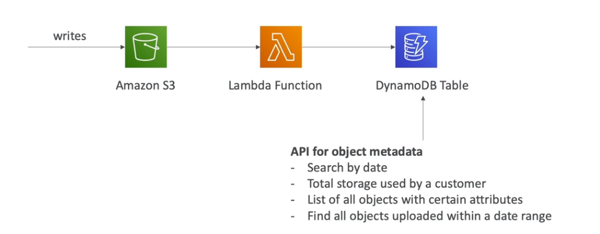
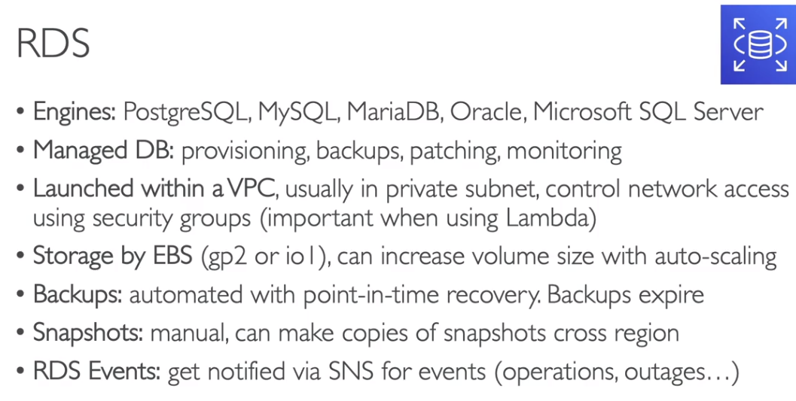
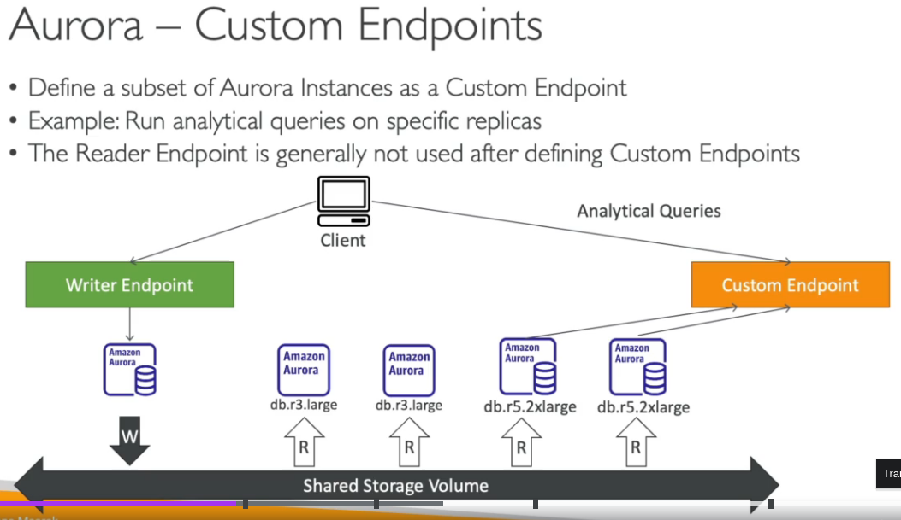
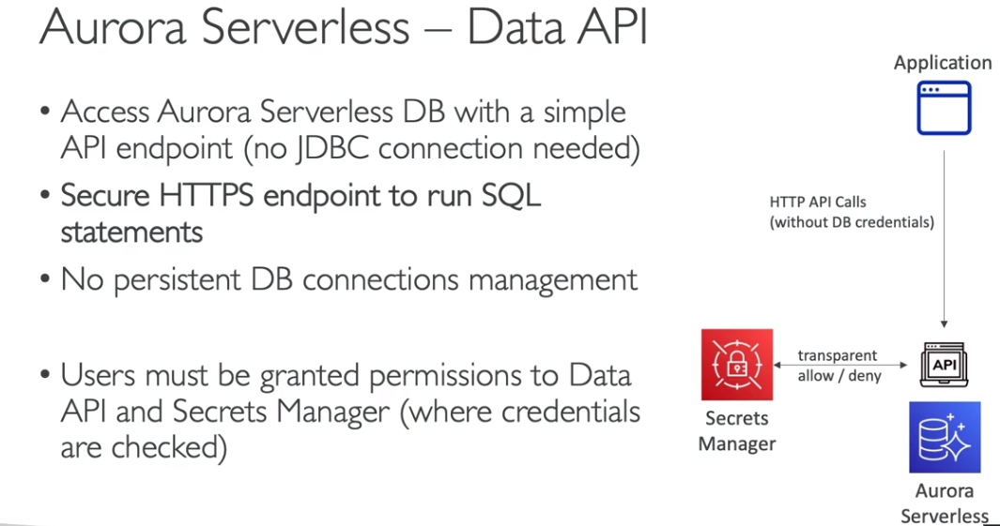
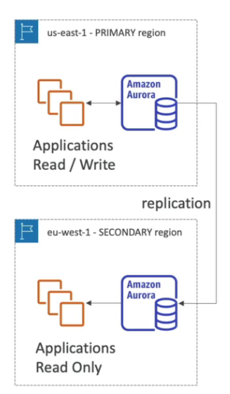

> Consistência de Leitura  

No DynamoDB, há dois tipos de leitura:  

- **Leitura Eventual (Eventually Consistent Read)**  
  - Mais rápida e **5 vezes mais barata**.  
  - Pode retornar dados desatualizados, pois busca os dados de qualquer réplica.  

- **Leitura Forte (Strongly Consistent Read)**  
  - Retorna sempre o **dado mais atualizado**, validando em todas as réplicas antes de retornar.  
  - **Mais lenta e mais cara**.  
  - Para utilizar, é necessário configurar o parâmetro **ConsistentRead = true** nas APIs:  
    - `GetItem`, `BatchGetItem`, `Query`, `Scan`.  

---

> DynamoDB Accelerator (DAX)  

O **DAX (DynamoDB Accelerator)** é um **cache em memória** totalmente gerenciado para o DynamoDB.  

**Benefícios do DAX:**  
- Reduz a latência de **milissegundos para microssegundos**.  
- Mantém **registros frequentemente acessados em cache** por até **5 minutos** (**TTL**).  
- Resolve o problema de **Hot Key** (**chaves altamente acessadas**).  
- **Suporta até 11 nós de cache**.  

📌 Quando usar DAX?
- Quando há **altas taxas de leitura**, especialmente em consultas repetitivas.  
- Quando a aplicação exige **respostas extremamente rápidas**.  

📌 Quando NÃO usar DAX?
- Quando a aplicação exige **consistência forte** (DAX só oferece **leitura eventual**).  
- Quando há poucas leituras e muitas escritas (DAX **não melhora a escrita**).  

---

> Modelos de Capacidade  

Ao criar uma tabela no DynamoDB, é necessário escolher entre dois modelos de capacidade:  

**Provisionado (Provisioned Mode)**  
- **É necessário definir capacidade de leitura e escrita** antecipadamente.  
- Mais **barato** para cargas de trabalho previsíveis.  
- **Pode usar Auto Scaling** para ajustar a capacidade dinamicamente.  
- Cobrança baseada em **RCU** (Read Capacity Units) e **WCU** (Write Capacity Units).  

📌 RCU (Read Capacity Units)  
- 1 **RCU** permite:  
  - 1 leitura **fortemente consistente** de **até 4 KB por segundo**.  
  - 2 leituras **eventualmente consistentes** de **até 4 KB por segundo**.  

📌 WCU (Write Capacity Units)  
- 1 **WCU** permite 1 **escrita de até 1 KB** por segundo.  

  

  

**Sob demanda (On-Demand Mode)**  
- **Não precisa definir capacidade de leitura e escrita** antecipadamente.  
- Ideal para cargas de trabalho **imprevisíveis** ou com **picos de tráfego**.  
- **2.5x mais caro** do que o modo provisionado.  
- Cobrança baseada em:  
  - **Read Request Units (RRU)** = equivalente a **RCU**.  
  - **Write Request Units (WRU)** = equivalente a **WCU**.  

---

> Tipos de Chaves no DynamoDB  

- **Chave Primária Simples (Partition Key - PK)**  
  - Apenas um **atributo Hash**.  
  - Deve ser **único na tabela**.  

- **Chave Primária Composta (Partition Key + Sort Key - PK + SK)**  
  - Permite **chaves repetidas**, desde que a **PK + SK juntas sejam únicas**.  
  - Facilita a criação de **consultas otimizadas**, permitindo buscar registros agrupados por PK.  

---

> Índices no DynamoDB  

O DynamoDB permite criar **índices secundários** para facilitar consultas sem precisar buscar apenas pela chave primária.  

📌 LSI (Local Secondary Index)  
- Mantém a **mesma Partition Key (PK)**, mas permite **criar uma nova Sort Key (SK)**.  
- Deve ser definido no **momento da criação da tabela**.  
- **Máximo de 5 LSIs por tabela**.  

📌 GSI (Global Secondary Index)  
- Permite criar **uma nova chave primária** (PK + SK) diferente da tabela original.  
- Pode ser criado **a qualquer momento** (diferente do LSI).  
- **Consome RCU e WCU separados da tabela principal**.  
- Se houver **throttling no GSI**, a tabela principal também será afetada.  

---

> Time To Live (TTL) no DynamoDB

O **TTL (Time To Live)** permite definir um **timestamp de expiração** para os itens, fazendo com que sejam removidos automaticamente.  

📌 Benefícios:  
- **Reduz custo** ao eliminar registros antigos sem a necessidade de deletá-los manualmente.  
- **Não consome WCU** (remoção automática sem custo).  
- O timestamp deve ser definido no formato **Unix Epoch Timestamp**.  

---

> Casos de Uso do DynamoDB

📌 Indexador de Objetos  
- O DynamoDB pode ser usado como um **indexador de metadados** para objetos armazenados no **S3**, permitindo buscas rápidas.  
  

📌 DAX ou ElastiCache?  
- **DAX**: Use quando o **cliente acessa os dados diretamente** via chave primária.  
- **ElastiCache**: Use quando os dados são resultado de **cálculos ou agregações** (ex: médias, contagens).  

---

:::tip **Dica para a prova 🎯**  

> Questões frequentemente abordam **modos de capacidade do DynamoDB** e a escolha ideal entre **Provisioned Mode** e **On-Demand Mode** com base na previsibilidade da carga de trabalho.  

📌 Uma empresa possui uma aplicação com **carga de trabalho estável e previsível**. Para reduzir custos, qual modelo de capacidade do DynamoDB é mais recomendado?  
- ✅ **Provisioned Mode** com Auto Scaling  

📌 Uma startup lançou um novo aplicativo que pode sofrer **picos imprevisíveis de tráfego**. Qual modelo de capacidade deve ser utilizado para evitar throttling e garantir escalabilidade automática?  
- ✅ **On-Demand Mode**  

---

> O **DynamoDB Accelerator (DAX)** é um serviço de **cache em memória** para DynamoDB, ideal para reduzir a latência de leituras repetitivas. No entanto, DAX **não suporta leitura forte**.  

📌 Uma aplicação de e-commerce precisa **consultar frequentemente** produtos mais vendidos com **baixa latência**, mas a consistência forte **não é necessária**. Qual serviço pode ser utilizado para otimizar a performance?  
- ✅ **DynamoDB Accelerator (DAX)**  

📌 Um sistema bancário precisa acessar o saldo atualizado da conta do cliente **com garantia de consistência forte**. O uso do DAX é recomendado?  
- ❌ **Não**, pois DAX **só oferece leitura eventual**.  

---

> O **DynamoDB Streams** permite capturar alterações nos dados de uma tabela DynamoDB em tempo real. Esse recurso é necessário para replicação entre regiões usando **Global Tables**.  

📌 Uma empresa deseja replicar automaticamente seus dados do DynamoDB em **duas regiões da AWS** para **reduzir latência** e **garantir alta disponibilidade**. Qual funcionalidade precisa ser ativada?  
- ✅ **DynamoDB Streams** e **Global Tables**  

📌 Uma aplicação deseja processar eventos em tempo real sempre que novos registros forem inseridos no DynamoDB. Qual serviço pode ser integrado para processar esses eventos?  
- ✅ **AWS Lambda** ou **Amazon Kinesis Data Streams**  

---

> O **Time To Live (TTL)** no DynamoDB é uma funcionalidade que permite a remoção automática de registros após um tempo específico, reduzindo custos de armazenamento.  

📌 Uma aplicação de chat precisa excluir automaticamente mensagens após **7 dias**. Como essa remoção pode ser feita sem consumir WCU?  
- ✅ **Ativando o TTL e definindo um timestamp de expiração**  

📌 Uma empresa deseja evitar que dados expirados no DynamoDB continuem consumindo armazenamento **sem precisar deletá-los manualmente**. Qual funcionalidade deve ser usada?  
- ✅ **Time To Live (TTL)**  

---

> O **Global Secondary Index (GSI)** permite criar novas chaves de busca no DynamoDB, mas consome **RCU e WCU separadamente**. O **Local Secondary Index (LSI)** mantém a mesma Partition Key, mas permite **novas Sort Keys**.  

📌 Uma tabela DynamoDB precisa permitir consultas usando um **atributo diferente da chave primária**, e esse índice deve ser criado **após a criação da tabela**. Qual tipo de índice deve ser utilizado?  
- ✅ **Global Secondary Index (GSI)**  

📌 Uma tabela DynamoDB precisa permitir consultas com **diferentes ordenações** mantendo a mesma Partition Key. Qual tipo de índice deve ser utilizado?  
- ✅ **Local Secondary Index (LSI)** (precisa ser definido no momento da criação da tabela)  

:::

---

## AWS OpenSearch  

O **AWS OpenSearch** é um serviço gerenciado de **busca e análise de dados**, amplamente utilizado para **big data, monitoramento de logs e análise de segurança**.  

> Principais Características

- Permite **buscas textuais avançadas** em qualquer campo dos documentos armazenados.  
- É um **fork do ElasticSearch**, criado pela AWS após mudanças na licença do ElasticSearch original.  
- Pode ser implantado em **modo cluster (instâncias dedicadas)** ou no **modo serverless**, dependendo da necessidade de escalabilidade e custo.  
- Integra-se com **Kinesis Data Firehose, AWS IoT, CloudWatch Logs**, entre outros serviços da AWS.  
- Equivalente ao **ELK Stack** da AWS, combinando **OpenSearch (substituto do ElasticSearch), OpenSearch Dashboards (equivalente ao Kibana) e outras ferramentas de análise**.  

> Casos de Uso

- **Monitoramento de logs** (por exemplo, logs do CloudWatch ou de aplicações).  
- **Buscadores full-text**, como motores de busca internos para aplicações.  
- **Análise de grandes volumes de dados** em tempo real.  
- **Segurança e detecção de anomalias**, analisando padrões suspeitos em grandes conjuntos de logs.  

---

> Arquiteturas com OpenSearch

O OpenSearch pode ser utilizado em diferentes arquiteturas para indexação e busca de dados:  

📌 Buscador baseado em DynamoDB
- Dados armazenados no **DynamoDB** podem ser indexados no OpenSearch para buscas eficientes.  
  

📌 Processamento de dados via Kinesis
- Dados recebidos pelo **Kinesis Data Streams** podem ser enviados para OpenSearch para análise e visualização.  
  

---

:::info **Saiba Mais: OpenSearch vs ElasticSearch**  
O **AWS OpenSearch** é um fork do ElasticSearch, criado após mudanças na licença da versão original. Isso significa que **OpenSearch mantém muitas funcionalidades do ElasticSearch**, mas é totalmente gerenciado pela AWS e recebe atualizações independentes.  

📌 Qual escolher?
- **OpenSearch (AWS)** → Melhor integração com AWS, escalabilidade automática e suporte gerenciado.  
- **ElasticSearch (Self-Managed)** → Controle total sobre configurações, mas exige manutenção manual.  

🔗 [Documentação oficial da AWS OpenSearch](https://docs.aws.amazon.com/opensearch-service/latest/developerguide/what-is.html)  
:::  

---

:::tip **Dica para a prova 🎯**  

> Questões frequentemente abordam **quando usar OpenSearch em vez de um banco de dados tradicional**, especialmente para buscas full-text, análise de logs e monitoramento de eventos em tempo real.  

📌 Uma empresa precisa armazenar **logs de aplicações e permitir buscas textuais rápidas e complexas** para análise de erros e padrões de acesso. Qual serviço AWS é mais adequado?  
- ✅ **AWS OpenSearch**  

📌 Uma aplicação precisa armazenar **dados transacionais estruturados** e garantir **consistência forte** nas leituras. OpenSearch é uma boa escolha?  
- ❌ **Não!** Para esse caso, um banco relacional como **Amazon RDS** ou um NoSQL como **Amazon DynamoDB** seria mais apropriado.  

---

> O **AWS OpenSearch** é frequentemente comparado ao ElasticSearch. A AWS criou esse serviço como um fork devido a mudanças na licença do ElasticSearch original.  

📌 Qual a principal diferença entre **AWS OpenSearch e ElasticSearch** em relação ao suporte e gerenciamento?  
- ✅ **AWS OpenSearch é totalmente gerenciado pela AWS**, enquanto o ElasticSearch pode ser usado de forma self-hosted ou com provedores de terceiros.  

---

> OpenSearch Serverless** é uma opção sem necessidade de provisionamento de instâncias, sendo cobrado com base no consumo real de recurso

📌 Uma startup quer usar OpenSearch para buscas, mas **precisa de uma solução escalável e sem necessidade de gerenciar servidores**. Qual a melhor escolha?  
- ✅ **AWS OpenSearch Serverless**  

📌 Quando **NÃO** usar OpenSearch Serverless?  
- ❌ Quando há a necessidade de **controle total sobre as instâncias e tuning avançado de performance**, o modo provisionado pode ser mais adequado.  

---

> OpenSearch pode ser integrado com serviços como Kinesis, CloudWatch Logs e S3** para análise de dados em tempo rea

📌 Uma empresa quer processar **eventos de streaming** em tempo real e indexá-los para buscas. Qual a melhor integração da AWS para conectar ao OpenSearch?  
- ✅ **Kinesis Data Firehose**, pois permite a ingestão contínua de dados para OpenSearch.  

📌 Como visualizar os dados indexados no OpenSearch?  
- ✅ Através do **OpenSearch Dashboards** (antigo Kibana).  

:::

---

## RDS  

  

O Amazon RDS (**Relational Database Service**) é um serviço gerenciado de banco de dados relacional da AWS. Ele automatiza tarefas como provisionamento, backup, recuperação e escalabilidade.  

- **Escala automaticamente** em minutos.  
- **Serviço totalmente gerenciado pela AWS**, incluindo:  
  - Provisionamento do sistema operacional, backups e restores.  
  - Monitoramento de desempenho e manutenção.  
  - Armazenamento baseado no **EBS** (gp2, gp3 ou io1), permitindo **auto-scale**.  
  - **Sem acesso via SSH** à máquina onde o banco está hospedado.  
- **Permite criptografia de dados** para segurança.  

**Segurança no RDS**  
  

- **Alta disponibilidade:** RDS pode replicar os dados em **múltiplas zonas de disponibilidade (Multi-AZ)**.  
  - Quando habilitado, um **DNS name** é gerado, permitindo o failover automático em caso de falha.  
- **Integração com VPC:**  
  - O RDS é executado dentro de uma **VPC**.  
  - Se for acessado via **AWS Lambda**, a função **deve estar na mesma VPC**.  
- **Replicas de leitura** (_Read Replicas_):  
  - Melhoram a performance distribuindo a carga de leitura.  
  - Possível criar **réplicas em outras regiões** para reduzir a latência.  
  - O **Route 53** pode ser usado para balancear o tráfego entre réplicas com política de peso (_Weighted Record Set_).  

**Tipos de bancos de dados suportados pelo RDS:**  
- **PostgreSQL**  
- **MySQL**  
- **MariaDB**  
- **Oracle**  
- **Aurora**  

> Pilares do Well-Architected Framework

  

---

> RDS para Lambda  

- Cada execução de uma função Lambda pode criar uma nova conexão com o banco de dados. Como o Lambda escala automaticamente para atender à demanda, um grande número de execuções simultâneas pode gerar **muitas conexões simultâneas** ao RDS. Isso pode levar ao erro **TooManyConnections**, que ocorre quando o número máximo de conexões do banco é atingido.   
- Para evitar esse problema, a AWS oferece o **RDS Proxy**, que gerencia o pool de conexões e melhora a eficiência.  

:::note Benefícios do RDS Proxy:
- **Gerenciamento de pool de conexões:** Mantém um número reduzido de conexões ativas e reutiliza conexões existentes, evitando sobrecarga.  
- **Escalabilidade eficiente:** Permite que múltiplas execuções do Lambda compartilhem conexões ao invés de abrir novas.  
- **Segurança:** Pode ser integrado ao **IAM** e ao **Secrets Manager**, eliminando a necessidade de armazenar credenciais no código.  
- **Failover mais rápido:** Em caso de falha, reduz o tempo de recuperação do banco de dados.  
:::

**Arquitetura RDS com Lambda e Proxy**  
  

---

> RDS para Oracle  

  

---

> Backups no RDS

- **Habilitados automaticamente.**  
- **Backup diário** e **logs de transação a cada 5 minutos** (permite recuperação em qualquer ponto dentro do período de retenção).  
- **Retenção padrão de 7 dias** (podendo ser aumentada para **até 35 dias**).  
- **Snapshots manuais (_DB snapshots_)** permitem retenção indefinida.  

---

> Storage Auto Scale

- Permite aumentar o armazenamento automaticamente à medida que o banco se aproxima do limite.  
- **Define um limite máximo (_threshold_)** para controle de crescimento.  
- **Expande automaticamente se houver menos de 10% de espaço disponível.**  

---

> Read Replicas

- **Melhora a escalabilidade** de leitura do banco.  
- Tipos de réplicas:  
  - Na mesma **AZ**.  
  - Em outra **AZ**.  
  - Em outra **Região**.  
- **Replicação assíncrona**, resultando em **consistência eventual**.  

> Caso de uso: relatório em uma réplica de leitura
  

> Custos de rede
- Sem custo na mesma região.  
- Custo adicional se for replicado para outra região.  
  

---

> Multi-AZ (Disaster Recovery)

- **Cria uma réplica sincronizada do banco em outra AZ.**  
- O **DNS name** aponta sempre para o banco primário.  
- Em caso de falha, ocorre **failover automático** para a réplica secundária.  
- **Não é usado para escalabilidade**, apenas **alta disponibilidade e recuperação de desastres**.  

  

---

> Encryption no RDS

- **Criptografia em repouso:**  
  - **AWS KMS - AES-256** para o banco e réplicas de leitura.  
  - O banco principal **deve estar criptografado** para que as réplicas sejam criptografadas.  
  - Suporte a **TDE (Transparent Data Encryption)** para Oracle e SQL Server.  

- **Criptografia em trânsito (_in-flight_)**:  
  - Uso de **certificados SSL** para proteção durante a transferência de dados.  

---

> Autenticação no RDS

- **Usuário e senha tradicionais.**  
- **IAM Authentication (PostgreSQL, MySQL e Aurora):**  
  - Permite autenticação via IAM, eliminando a necessidade de armazenar credenciais no código.  
  - Exige tráfego criptografado com **SSL**.  

  

---

:::tip **Dica para a prova 🎯**  

> Questões frequentemente abordam a diferença entre **Multi-AZ e Read Replicas**, testando qual opção é mais adequada para **alta disponibilidade** ou **escalabilidade de leitura**.  

📌 Uma aplicação precisa de **alta disponibilidade** e recuperação automática em caso de falha do banco de dados. Qual recurso do RDS deve ser usado?  
- ✅ **Multi-AZ**  

📌 Uma aplicação precisa **escalar a leitura** para distribuir a carga entre múltiplas instâncias. Qual recurso deve ser utilizado?  
- ✅ **Read Replicas**  

---

> O **RDS Proxy** é uma solução eficiente para lidar com problemas de **TooManyConnections** em bancos de dados usados por aplicações serverless, como AWS Lambda.  

📌 Um sistema usa AWS Lambda para acessar um banco de dados RDS. Com o aumento da carga, há erros de **TooManyConnections**. Como resolver esse problema de forma eficiente?  
- ✅ **Utilizar o RDS Proxy para gerenciar o pool de conexões**  

---

> O **RDS realiza backups automáticos** e mantém logs de transação a cada **5 minutos**, permitindo restauração ponto a ponto dentro do período de retenção configurado.  

📌 Qual é a **retenção padrão** de backups automáticos do RDS?  
- ✅ **7 dias (podendo ser estendida até 35 dias)**  

📌 Para backups **manuais** com retenção indefinida, qual recurso do RDS deve ser usado?  
- ✅ **DB Snapshots**  

---

> O **RDS oferece criptografia de dados em repouso e em trânsito** para aumentar a segurança das informações armazenadas.  

📌 Uma empresa precisa garantir que os dados do banco no RDS estejam **criptografados em repouso**. Qual tecnologia AWS deve ser usada?  
- ✅ **AWS KMS - AES-256**  

📌 Durante a comunicação entre uma aplicação e um banco de dados RDS, os dados precisam ser criptografados **em trânsito**. Como isso pode ser feito?  
- ✅ **Habilitando SSL/TLS para conexões ao banco**  

---

> **Read Replicas entre regiões** são usadas para melhorar a performance global, reduzindo a latência de leitura para usuários distribuídos geograficamente.  

📌 Uma aplicação global precisa reduzir a latência de leitura para usuários em diferentes regiões. Qual a melhor solução?  
- ✅ **Criar Read Replicas em outras regiões**  

📌 Como distribuir o tráfego de leitura entre várias Read Replicas?  
- ✅ **Usando o Route 53 com Weighted Routing**  

:::

---

### Aurora

- Banco de dados proprietário da AWS.  
- **5 vezes mais rápido** que o MySQL e **3 vezes mais rápido** que o PostgreSQL.  
- **Escopo regional**, mas pode ser implantado em várias regiões com replicação global.  
- **Replicação automática (6 cópias de dados) em 3 AZs.**  
- **Suporte a até 15 réplicas de leitura** para escalabilidade.  
- Disponível na versão **serverless**, sem necessidade de gerenciamento manual.  
- **Expansível até 128 TB**, crescendo automaticamente de **10 GB em 10 GB**.  
- **Encaminhamento de escrita:** permite que uma réplica de leitura receba operações de escrita e encaminhe para o nó principal.  
- **20% mais barato** que o RDS tradicional.  

> Arquitetura do Aurora
  
  

> Aurora e Well-Architected Framework
  

> Conceitos Avançados do Aurora

  

> Aurora Replica - Auto Scaling

  

> Custom Endpoints

  

> Aurora Serverless

- **Escala automaticamente** de acordo com a demanda.  
- Ideal para cargas de trabalho **intermitentes e imprevisíveis**.  
- **Cobrança baseada no uso por segundo.**  

  

> Aurora Multi-Master

- Proporciona **alta disponibilidade**.  
- Caso o nó principal falhe, **todos os nós passam a aceitar escrita**.  

  

> Global Aurora

- **Cross-region read replica**: usado para **recuperação de desastres**.  
- **Global Database**:  
  - 1 região **primária (read/write)** e até **5 regiões secundárias**.  
  - Latência de replicação menor que **1 segundo**.  
  - Até **16 réplicas de leitura por região secundária**.  
  - **Failover para outra região** em menos de 1 minuto em caso de desastre.  

  

> Aurora + Machine Learning

- Integração com **Amazon SageMaker** e **Amazon Comprehend**.  
- Não requer experiência em **Machine Learning** para utilização.  
- **Casos de uso:**  
  - Detecção de fraudes.  
  - Propaganda personalizada.  
  - Recomendações de produtos.  

  

---

:::tip **Dica para a prova 🎯**  

> Questões frequentemente abordam **as diferenças entre Aurora e RDS**, testando conhecimento sobre desempenho, escalabilidade e custo.  

📌 Uma aplicação precisa de um banco de dados altamente escalável, com suporte para **até 15 réplicas de leitura** e replicação automática entre **3 zonas de disponibilidade**. Qual serviço AWS é mais adequado?  
- ✅ **Amazon Aurora**  

📌 Uma empresa busca um banco de dados gerenciado, mas com suporte a **licenciamento do Oracle ou SQL Server**. Qual serviço AWS deve ser utilizado?  
- ✅ **Amazon RDS**  

---

> O **Aurora Serverless** é ideal para cargas de trabalho intermitentes, pois escala automaticamente e cobra apenas pelo uso real.  

📌 Uma startup precisa de um banco de dados que **escale automaticamente com base na demanda** e **cobre apenas pelo uso por segundo**. Qual serviço AWS é mais adequado?  
- ✅ **Amazon Aurora Serverless**  

📌 Quando **NÃO** utilizar Aurora Serverless?  
- ❌ Quando a aplicação precisa de **baixa latência previsível e cargas de trabalho constantes**, o Aurora provisionado pode ser mais adequado.  

---

> O **Aurora Global Database** permite replicação entre regiões, sendo útil para recuperação de desastres e baixa latência de leitura global.  

📌 Uma empresa multinacional precisa de um banco de dados **com replicação entre regiões**, permitindo leitura rápida para usuários ao redor do mundo. Qual serviço AWS deve ser utilizado?  
- ✅ **Aurora Global Database**  

📌 Qual a principal vantagem do **Aurora Global Database** em relação às **Cross-Region Read Replicas** do RDS?  
- ✅ **Failover automático para outra região em menos de 1 minuto**  

---

> O **Aurora Multi-Master** permite escrita em múltiplos nós para alta disponibilidade e failover instantâneo.  

📌 Uma aplicação precisa de um banco de dados onde **todos os nós aceitam escrita**, garantindo **failover instantâneo** sem interrupção em caso de falha. Qual recurso deve ser usado?  
- ✅ **Aurora Multi-Master**  

📌 Qual a principal limitação do Aurora Multi-Master?  
- ❌ **Não suporta replicação entre regiões (apenas dentro da mesma região).**  

---

> O **Aurora ML Integration** permite a execução de modelos de Machine Learning diretamente no banco de dados.  

📌 Uma fintech quer detectar **transações fraudulentas em tempo real** usando Machine Learning, sem necessidade de mover dados para outro serviço. Qual funcionalidade do Aurora pode ser utilizada?  
- ✅ **Aurora Machine Learning Integration com Amazon SageMaker**  

📌 Além da detecção de fraudes, qual outro caso de uso comum para **Aurora Machine Learning**?  
- ✅ **Recomendações personalizadas de produtos**  

:::

---