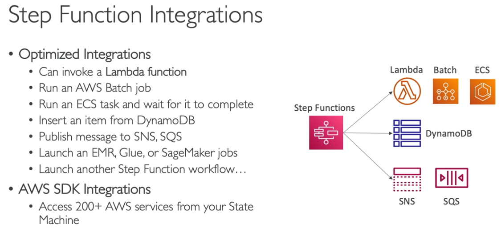
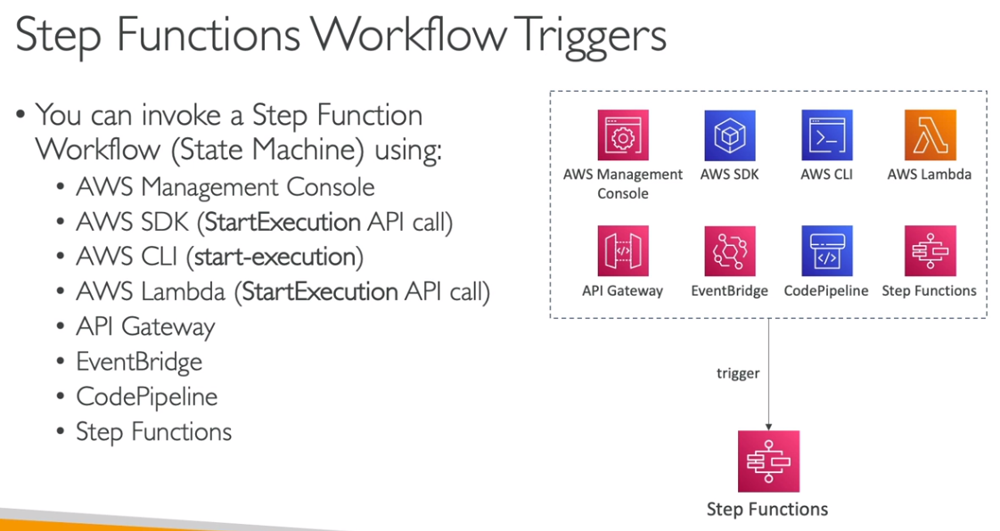
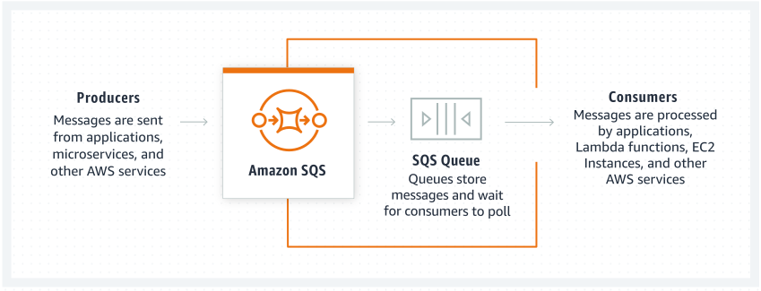
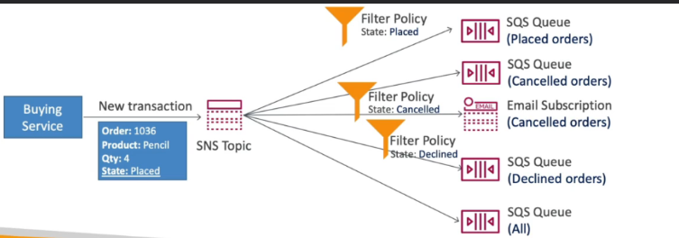
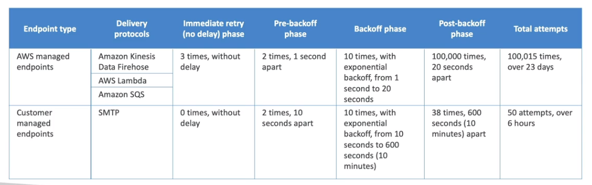

> Integrações com outros serviços

  

O Step Functions pode se integrar diretamente com vários serviços da AWS, sem necessidade de código intermediário. Algumas das integrações mais comuns incluem:  

- **AWS Lambda:** Para execução de funções sem servidor dentro do fluxo de trabalho.  
- **Amazon S3:** Para interações com objetos armazenados no S3.  
- **Amazon DynamoDB:** Para manipulação de dados estruturados.  
- **Amazon SNS e SQS:** Para envio de notificações e filas de mensagens.  
- **AWS Glue:** Para execução de ETLs.  
- **Amazon SageMaker:** Para incorporar Machine Learning ao fluxo de trabalho.  

---

> Gatilhos de Execução do Step Functions

  

O Step Functions pode ser acionado por diferentes fontes, incluindo:  

- **API Gateway:** Permite iniciar fluxos via chamadas HTTP.  
- **EventBridge:** Executa o workflow em resposta a eventos AWS.  
- **AWS Lambda:** Inicia fluxos diretamente a partir de funções Lambda.  
- **Amazon S3:** Pode disparar workflows ao criar ou modificar objetos.  
- **AWS SDK e AWS CLI:** Permite iniciar fluxos de forma programática.  

---

> Tipos de Workflows no Step Functions

  

O AWS Step Functions oferece dois tipos principais de workflows:  

1. **Standard Workflows:**  
   - Ideal para processos longos e complexos.  
   - Suporta execuções que duram até **1 ano**.  
   - Histórico detalhado de execução.  

2. **Express Workflows:**  
   - Projetado para execuções rápidas e de alta taxa de requisições.  
   - Limite de duração de **5 minutos**.  
   - Usa modelo de precificação baseado em **número de execuções**, enquanto o **Standard Workflow** cobra pelo tempo de execução.  

> Quando usar cada tipo de workflow?
:::note  
- Use **Standard Workflow** para **processos de longa duração**, como fluxos de aprovação e ETLs.  
- Use **Express Workflow** para **eventos de alta taxa de tráfego**, como ingestão de logs e processamento de eventos em tempo real.  
:::

---

> Exemplo de Arquitetura com Step Functions

  

A imagem acima mostra um exemplo de arquitetura onde o Step Functions orquestra múltiplas funções AWS Lambda para processamento de dados.  

> Casos de Uso Comuns
- **Processamento de pedidos** em e-commerce.  
- **Orquestração de ETL** (Extração, Transformação e Carga de dados).  
- **Automação de resposta a incidentes** (ex.: segurança e compliance).  
- **Processamento de arquivos e imagens**.  
- **Treinamento e inferência de modelos de Machine Learning**.  

---

> Benefícios do AWS Step Functions
:::info  
✅ **Alta disponibilidade e tolerância a falhas**: Workflows são automaticamente gerenciados pela AWS.  
✅ **Facilidade de integração**: Conecta-se facilmente com outros serviços AWS sem necessidade de código extra.  
✅ **Observabilidade**: Possui logs detalhados e histórico de execução.  
✅ **Escalabilidade**: Suporta workloads de qualquer tamanho.  
✅ **Baixo custo para processos event-driven**: Express Workflows cobram apenas por execução.  
:::

---

:::tip **Dica para a prova 🎯**  

> Questões frequentemente abordam **quando usar AWS Step Functions em comparação com outros serviços AWS**, como SQS, SNS e EventBridge.  

📌 Uma empresa deseja criar um **workflow automatizado para processar pedidos**, onde cada pedido passa por diversas etapas, incluindo **validação, pagamento e envio de e-mails**. Qual serviço AWS é mais indicado para gerenciar esse fluxo de forma organizada e resiliente?  
- ✅ **AWS Step Functions**, pois permite orquestrar diferentes etapas do workflow com controle de estados, execução sequencial e tratamento de falhas.  

📌 Uma aplicação precisa processar eventos em tempo real, mas sem rastrear estados ou ter dependência entre as mensagens. Qual opção é mais adequada?  
- ✅ **Amazon SQS ou EventBridge**, pois são mais indicados para sistemas **event-driven**, onde não há necessidade de acompanhar estados entre mensagens.  

---

> **AWS Step Functions Standard vs. Express Workflows** é um tema recorrente nas provas, especialmente para cenários de escalabilidade e custo.  

📌 Uma aplicação precisa processar **milhões de eventos curtos por segundo**, com tempo de execução abaixo de **5 minutos** por workflow. Qual opção do Step Functions é mais adequada?  
- ✅ **Express Workflow**, pois é otimizado para **execuções rápidas e alta taxa de requisições**, cobrando por número de execuções ao invés de tempo de execução.  

📌 Um workflow de **ETL de dados** precisa rodar por **horas ou até dias**, garantindo **resiliência e rastreamento detalhado das execuções**. Qual tipo de workflow do Step Functions deve ser escolhido?  
- ✅ **Standard Workflow**, pois permite **execuções de até 1 ano**, mantém logs detalhados e oferece **retries automáticos** em caso de falhas.  

---

> **Step Functions vs. AWS Lambda**: Algumas questões podem testar a necessidade de usar workflows em vez de apenas funções serverless.  

📌 Uma aplicação precisa **coordenar a execução de múltiplas funções Lambda** de forma sequencial, garantindo que uma função só inicie após a conclusão da anterior. Como fazer isso de forma otimizada?  
- ✅ **AWS Step Functions**, pois fornece **controle de estados** e **execução sequencial** sem necessidade de gerenciar lógica de orquestração manualmente dentro do código.  

📌 Uma aplicação precisa executar **uma única função Lambda de maneira independente**, sem necessidade de acompanhar estados ou combinar múltiplas execuções. O uso do Step Functions é necessário?  
- ❌ **Não!** Para esse caso, uma única **AWS Lambda** chamada diretamente pelo API Gateway ou EventBridge seria suficiente, sem a sobrecarga do Step Functions.  

---

> Questões podem abordar **integrações do Step Functions com outros serviços AWS**.  

📌 Uma empresa precisa **orquestrar um processo de Machine Learning**, onde os dados são carregados no **S3**, pré-processados com **AWS Glue**, e depois enviados ao **Amazon SageMaker** para inferência. Como automatizar essa pipeline?  
- ✅ **AWS Step Functions**, pois permite orquestrar múltiplos serviços AWS, garantindo que cada etapa seja executada na ordem correta e lidando com falhas automaticamente.  

📌 Uma empresa quer executar **cálculos financeiros pesados em grande escala** usando um workflow. No entanto, cada cálculo pode levar **mais de 15 minutos** para ser concluído. Qual a melhor abordagem?  
- ✅ **Executar os cálculos em containers no AWS Batch** e orquestrá-los com **AWS Step Functions**, pois Lambdas possuem limite de **15 minutos** de execução.  

:::

---

## AWS SQS  

  

O **Amazon Simple Queue Service (SQS)** é um serviço de **mensageria assíncrona**, totalmente gerenciado pela AWS, que permite o desacoplamento de componentes de aplicações distribuídas.  

> Principais Características:
- Possui **escopo regional** e é gerenciado pela AWS.  
- Segue o modelo:  
  - **Produtor** → **envia** → **fila** ← **recupera** ← **Consumidor**.  
- O consumidor faz um **pull** na fila para recuperar mensagens.  
  - Pode receber até **10 mensagens por vez**.  
  - **O consumidor deve excluir a mensagem após o processamento**, pois **não há exclusão automática** após a leitura.  
- **Escalabilidade automática**, suportando desde **1 até 10.000 mensagens por segundo**.  
- **Tempo de retenção** das mensagens entre **4 horas (mínimo) e 14 dias (máximo)**.  
- **Sem limite de quantidade de mensagens na fila**.  
- **Mensagens de até 256 KB**. Para mensagens maiores, pode-se armazená-las no **S3** e usar **SQS Extended Client Library**.  

---

> Auto Scaling e Métricas

- O **Amazon CloudWatch** monitora métricas da fila, como:  
  - **ApproximateNumberOfMessages**: Número estimado de mensagens na fila.  
  - **NumberOfMessagesSent**: Quantidade de mensagens enviadas.  
  - **NumberOfMessagesReceived**: Quantidade de mensagens recebidas.  
- É possível configurar **Auto Scaling** para escalar os consumidores de forma automática com base no tamanho da fila.  

---

> Política de Acesso

  

- Permite definir quem pode **enviar** e **consumir** mensagens da fila.  
- Pode ser usada para permitir **acesso entre contas** (cross-account).  
- Exemplo de uso: Permitir que um bucket do **S3** publique eventos na fila SQS.  

---

> Integração com AWS Lambda

- A **SQS pode acionar funções Lambda**, processando mensagens **em batch** automaticamente.  
- Lambda lê mensagens da fila, processa e as remove após o sucesso da execução.  
- Ideal para **event-driven architectures**.  

---

> Criptografia no SQS

- **Em trânsito**: O tráfego entre os serviços e o SQS é **criptografado automaticamente via HTTPS**.  
- **Em repouso**:  
  - O **SQS usa SSE-SQS (Server-Side Encryption)** com uma chave padrão.  
  - Também é possível usar uma **chave gerenciada no AWS KMS (SSE-KMS)** para maior controle.  

---

> Message Visibility Timeout

- Quando um consumidor recupera uma mensagem, ela fica **invisível** para os outros consumidores até ser processada.  
- O tempo de invisibilidade é definido pelo **Message Visibility Timeout**.  
- **Valor padrão: 30 segundos**.  
- Se o processamento demorar mais que o tempo definido, a mensagem **reaparece na fila** e pode ser processada novamente, levando a **duplicação**.  
- Para estender o tempo de invisibilidade, usa-se a API **ChangeMessageVisibility** do AWS SDK.  

---

> Delay Queues

- Define um **atraso** na entrega da mensagem para os consumidores.  
- **Padrão: 0 segundos** (entrega imediata).  
- No momento da **criação da fila**, pode-se configurar um **atraso padrão** para todas as mensagens.  
- Ideal para cenários onde é necessário um tempo antes de processar as mensagens.  

---

> Dead Letter Queue (DLQ)

- As mensagens podem ser enviadas para uma **fila de erro (DLQ - Dead Letter Queue)** se **não forem processadas corretamente após um número definido de tentativas**.  
- O número de tentativas antes de mover para a DLQ é definido pelo **maximumReceives**.  
- **Usado para debug**, permitindo identificar problemas sem perder as mensagens.  
- Importante:  
  - **A DLQ deve ser do mesmo tipo da fila principal**, ou seja, **se a fila for FIFO, a DLQ também deve ser FIFO**.  
- **Redrive to Source Queue**: Permite reenviar as mensagens da DLQ para a fila original após corrigir o problema.  

---

> Request-Response System no SQS

- O SQS pode ser usado para **modelos de requisição-resposta**.  
- Ao postar uma mensagem na fila, o produtor informa um **CorrelationID** e uma **fila de resposta**.  
- Assim que a mensagem for processada, a resposta é enviada para a fila de retorno.  

  

---

> Comparação: SQS vs SNS vs Kinesis

Embora todos sejam **serviços de mensageria**, possuem diferenças fundamentais.  

  

**Principais diferenças:**  

| Serviço | Tipo | Mensagens Persistentes? | Casos de Uso |
|---------|------|-----------------------|-------------|
| **SQS** | Fila | ✅ Sim | Processamento assíncrono, desacoplamento de sistemas |
| **SNS** | Publicação/Assinatura | ❌ Não | Notificações push, mensagens broadcast para múltiplos consumidores |
| **Kinesis** | Stream | ✅ Sim | Processamento de eventos em tempo real, análise contínua de dados |

---

:::note **Quando usar SQS, SNS ou Kinesis?**  
- **SQS**: Quando precisa de **mensagens persistentes** e consumidores independentes.  
- **SNS**: Quando quer **distribuir mensagens para múltiplos assinantes** (ex.: notificações push, alertas).  
- **Kinesis**: Quando precisa de **análise de dados em tempo real** e streaming contínuo de eventos.  
:::

---

:::tip **Dica para a prova 🎯**  

> **Dead Letter Queue (DLQ) é frequentemente abordado na prova**, especialmente sobre quando e como configurar essa funcionalidade para evitar perda de mensagens.  

📌 Uma aplicação está processando mensagens de uma fila **SQS Standard**, mas algumas mensagens falham repetidamente no processamento. Como garantir que essas mensagens possam ser analisadas posteriormente?  
- ✅ Configurar uma **Dead Letter Queue (DLQ)** e definir um **MaximumReceives** apropriado.  

📌 Uma aplicação usa **SQS FIFO** para garantir ordem e exatamente uma vez no processamento. Como deve ser configurada a DLQ?  
- ✅ A **DLQ também deve ser FIFO**, pois não é permitido misturar tipos de fila.  

---

> **Message Visibility Timeout** pode gerar duplicação de mensagens se não for configurado corretamente.  

📌 Um serviço recupera mensagens da SQS, mas leva **1 minuto** para processá-las. Se o **Message Visibility Timeout** estiver no valor padrão (30 segundos), o que pode acontecer?  
- ✅ A mensagem pode ser entregue a outro consumidor antes de ser processada completamente, gerando **processamento duplicado**.  

📌 Como evitar a duplicação no cenário acima?  
- ✅ Ajustar o **Message Visibility Timeout** para um tempo superior ao tempo médio de processamento das mensagens.  

---

> **Integração do SQS com Lambda** é um tema comum na certificação.  

📌 O que acontece quando uma função Lambda processa mensagens de uma fila **SQS Standard** e falha no processamento?  
- ✅ A mensagem será **reprocessada automaticamente**, pois **SQS Standard pode entregar mensagens mais de uma vez**.  

📌 Como evitar que mensagens com erro causem reprocessamentos infinitos ao usar Lambda com SQS?  
- ✅ Configurar uma **DLQ** para armazenar mensagens que falharam após um número máximo de tentativas.  

---

> **Comparação entre SQS, SNS e Kinesis** é essencial para escolher a melhor solução na prova.  

📌 Um sistema precisa entregar **uma mensagem para múltiplos consumidores simultaneamente**, garantindo **baixa latência**. Qual serviço AWS é mais adequado?  
- ✅ **Amazon SNS**, pois permite **publicação/assinatura (pub/sub)** e entrega mensagens para vários consumidores ao mesmo tempo.  

📌 Uma aplicação precisa processar um **grande volume de dados em tempo real**, mantendo **ordem e reprocessamento**. Qual serviço AWS é mais adequado?  
- ✅ **Amazon Kinesis**, pois suporta **streaming de dados com retenção e reprocessamento**.  

---

> **Auto Scaling baseado em métricas do SQS** pode aparecer na prova.  

📌 Como escalar dinamicamente os consumidores de uma fila SQS para lidar com um alto volume de mensagens?  
- ✅ Configurar **Auto Scaling Group** para os consumidores baseado na métrica **ApproximateNumberOfMessages** do **Amazon CloudWatch**.  

📌 Uma fila SQS está com **alto número de mensagens pendentes** e os consumidores não estão dando conta. Como resolver esse problema?  
- ✅ Aumentar o número de instâncias do consumidor via **Auto Scaling** ou otimizar o código para processar mensagens em batch.  
:::

---

## AWS MQ  

O **AWS MQ** é um serviço gerenciado de **mensageria compatível com protocolos tradicionais**, permitindo a execução de **RabbitMQ** e **ActiveMQ** na AWS. Ele é ideal para empresas que desejam **migrar** suas soluções de mensageria existentes para a nuvem sem precisar modificar aplicações que dependem desses protocolos.  

> Principais características:
- Suporta **protocolos tradicionais** de mensageria, como **MQTT, AMQP, STOMP, WSS e OpenWire**.  
- Serviço gerenciado da AWS para executar **RabbitMQ** e **ActiveMQ**.  
- **Não escala automaticamente** como o **Amazon SQS** ou **Amazon SNS**.  
- **Pode ser configurado em Multi-AZ**, garantindo alta disponibilidade e **failover automático**.  
- Principalmente usado para **migração de soluções legadas** que já utilizam esses protocolos.  

---

> Casos de Uso

- Empresas que já utilizam **RabbitMQ ou ActiveMQ** e desejam **migrar para a AWS** sem modificar a aplicação.  
- Sistemas que exigem **entrega ordenada e garantida de mensagens**.  
- Ambientes que necessitam de **suporte a protocolos tradicionais** incompatíveis com **SQS/SNS**.  

---

:::note **AWS MQ vs SQS/SNS**  

| Característica       | AWS MQ | Amazon SQS | Amazon SNS |
|----------------------|--------|------------|------------|
| **Modelo**          | Broker de Mensagens | Fila de Mensagens | Publicação/Assinatura (Pub/Sub) |
| **Protocolos Suportados** | MQTT, AMQP, STOMP, OpenWire, etc. | Protocolo proprietário da AWS | Protocolo proprietário da AWS |
| **Escalabilidade**  | Limitada | Altamente escalável | Altamente escalável |
| **Persistência de Mensagens** | Sim | Sim | Não |
| **Ordem Garantida** | Sim (depende da configuração) | Apenas em filas FIFO | Não |
| **Caso de Uso** | Migração de aplicações que já usam mensageria tradicional | Processamento assíncrono com alta escalabilidade | Distribuição de mensagens para múltiplos consumidores |

:::

---

> Alta Disponibilidade e Failover

- O **AWS MQ** pode ser configurado em **Multi-AZ**, garantindo **failover automático** caso ocorra falha em uma zona de disponibilidade.  
- Em um ambiente **ActiveMQ**, é possível configurar um **Cluster de Brokers**, distribuindo a carga e melhorando a resiliência.  
- No **RabbitMQ**, pode-se utilizar **replicação de filas** para maior confiabilidade.  

---

> Custos e Considerações

- **AWS MQ pode ser mais caro** que SQS/SNS devido à necessidade de manter brokers ativos.  
- Não é ideal para **alta escala**, pois não escala horizontalmente como o **SQS**.  
- Recomenda-se para **cargas de trabalho previsíveis** e **migração de aplicações legadas**.  

---

:::tip **Dica para a prova 🎯**  

> Questões frequentemente testam a **diferença entre AWS MQ, SQS e SNS**, avaliando qual solução é mais adequada para diferentes cenários de mensageria.  

📌 Uma empresa já utiliza **ActiveMQ on-premises** e deseja migrar para a AWS sem refatorar a aplicação. Qual serviço AWS deve ser utilizado?  
- ✅ **AWS MQ** (Compatível com ActiveMQ, sem necessidade de modificar a aplicação).  

📌 Uma aplicação distribuída precisa de uma solução de mensageria **altamente escalável**, mas não exige compatibilidade com protocolos tradicionais. Qual a melhor opção?  
- ✅ **Amazon SQS** (Escalável e totalmente gerenciado, ideal para mensagens assíncronas).  

---

> O **AWS MQ pode ser configurado em Multi-AZ** para garantir alta disponibilidade, ativando um **failover automático** caso um broker falhe.  

📌 Uma empresa precisa de um serviço de mensageria que ofereça **failover automático** entre zonas de disponibilidade, garantindo alta disponibilidade. Qual a melhor solução?  
- ✅ **AWS MQ** configurado em **Multi-AZ**.  

---

> O **AWS MQ** não escala horizontalmente como o **SQS** ou **SNS**, tornando-se **mais caro e menos adequado** para grandes volumes de mensagens.  

📌 Qual serviço AWS é mais adequado para processar **milhões de mensagens por segundo** com escalabilidade automática?  
- ✅ **Amazon SQS** (Melhor para escalabilidade massiva).  

📌 Um sistema precisa garantir **ordem estrita** das mensagens e evitar duplicação. Qual serviço deve ser escolhido?  
- ✅ **Amazon SQS FIFO** (Suporte à ordem estrita e processamento único de mensagens).  

:::

---

## AWS SNS  

O **Amazon Simple Notification Service (SNS)** é um serviço de **mensageria assíncrona** baseado no padrão **pub/sub (publicação/assinatura)**, permitindo o envio de notificações para múltiplos assinantes simultaneamente. Ele é amplamente utilizado para **distribuir eventos** e **notificar serviços ou usuários** de maneira escalável.  

> Principais características
- Serviço **gerenciado** pela AWS, com **escopo regional**.  
- Utiliza o modelo **Produtor → Envia → Tópico → Notifica → Assinantes** (**pub/sub pattern**).  
- **Cada tópico pode ter até 12 milhões de assinantes**.  
- **Soft limit de 100.000 tópicos por conta**.  
- **Mensagens não são retidas** após a entrega; elas são descartadas após a notificação.  
- Suporte a diversos tipos de assinantes:  
  - **HTTP(S), e-mail, Lambda, dispositivos móveis, Kinesis Data Firehose**.  

---

> Entrega de Mensagens e Ordem de Processamento

- **O SNS "empurra" as mensagens para os assinantes**, ao contrário do **SQS**, que exige polling.  
- Caso seja necessário garantir **ordem de entrega** e **evitar duplicação**, recomenda-se o uso de **SQS FIFO** como assinante.  

:::info 📌 **Quando usar SNS vs. SQS FIFO?**  
- **SNS:** Para **notificações em tempo real** para múltiplos assinantes sem necessidade de ordem específica.  
- **SQS FIFO:** Para garantir **ordem estrita** das mensagens e evitar **duplicações**.  
:::

---

> Política de Acesso (IAM Policy)

- Permite definir **quem pode enviar mensagens para um tópico**.  
- Funciona de forma semelhante às **políticas de acesso do SQS**.  
- Exemplo de caso de uso:  
  - **Restringir o envio de mensagens** apenas para serviços internos.  
  - **Permitir que outra conta AWS publique mensagens no tópico**.  

---

> Criptografia no SNS

- **Em trânsito:** A comunicação é **segura por padrão** via **HTTPS**.  
- **Em repouso:**  
  - Usa **SSE-SNS** (Server-Side Encryption) com chave padrão da AWS.  
  - **Pode ser configurado com AWS KMS (SSE-KMS)** para maior controle.  

---

> SNS + SQS - Fan-Out Pattern

A arquitetura **Fan-Out** usa um **tópico SNS** para distribuir mensagens para múltiplas filas **SQS**, garantindo que diferentes sistemas possam processar o mesmo evento.  

📌 **Benefícios do Fan-Out Pattern**:  
- Permite que **vários sistemas processem a mesma mensagem**.  
- **Evita perda de dados** ao garantir que cada consumidor receba sua própria cópia da mensagem.  
- Útil para serviços que **só permitem notificação para um único destino** (**exemplo: S3 Events**).  
- **Funciona entre regiões AWS**.  

  

---

> Message Filtering (Filtragem de Mensagens)

- O SNS permite filtrar mensagens para **notificar assinantes apenas quando um critério for atendido**.  
- Utiliza **JSON policies** para definir regras de filtragem.  

:::tip 📌 Exemplo:  
- Um **sistema de pedidos** pode publicar eventos no SNS.  
- Apenas **assinantes interessados em "Pedidos Cancelados"** recebem notificações desse tipo.  
:::

  

🔗 [Documentação oficial do SNS Message Filtering](https://docs.aws.amazon.com/sns/latest/dg/message-filtering.html)  

---

> Integração com Kinesis Data Firehose

O **Amazon SNS** pode enviar mensagens diretamente para o **Kinesis Data Firehose**, permitindo:  
- **Armazenamento em tempo real** no **S3, Redshift ou Elasticsearch**.  
- **Processamento e análise de logs e eventos** em grande escala.  

  

🔗 [Documentação oficial da integração SNS + Firehose](https://docs.aws.amazon.com/sns/latest/dg/sns-firehose-as-subscriber.html)  

---

> Retry e Dead Letter Queue (DLQ)

📌 O **SNS reenvia mensagens automaticamente** caso o assinante não esteja disponível.  

- **Para serviços AWS (ex: Lambda, SQS)**, o **SNS já possui um mecanismo de retry automático**.  
- **Para endpoints externos (ex: HTTP)**, é necessário **configurar uma política de retry**.  
- **Caso uma mensagem não seja entregue após várias tentativas, pode-se configurar uma DLQ (Dead Letter Queue)**.  

📌 **Quando usar DLQ no SNS?**  
- Para **garantir que mensagens não sejam perdidas** se o destinatário estiver indisponível.  
- Para **analisar falhas na entrega** e evitar perda de dados críticos.  

  

> Como funciona a DLQ no SNS?
- A DLQ é **associada à assinatura** do tópico SNS.  
- Mensagens que **falham após múltiplas tentativas** são **enviadas para a DLQ** para futura análise.  

  

🔗 [Documentação oficial sobre SNS DLQ](https://docs.aws.amazon.com/sns/latest/dg/sns-dead-letter-queues.html)  

---

:::tip **Dica para a prova 🎯**  

> Questões sobre **SNS vs. SQS** são comuns, exigindo que você escolha a solução mais adequada para um caso específico.  

📌 Uma aplicação precisa enviar notificações **instantâneas** para diversos sistemas distribuídos, garantindo **entrega em tempo real**, mas **não exige ordenação nem processamento único** das mensagens. Qual serviço deve ser utilizado?  
- ✅ **Amazon SNS** (pub/sub para notificações em tempo real)  

📌 Um sistema precisa garantir que **mensagens sejam processadas em ordem e sem duplicações**. Qual serviço deve ser utilizado?  
- ✅ **Amazon SQS FIFO** (garante ordem e deduplicação)  

🔗 [Comparação oficial SNS vs. SQS](https://docs.aws.amazon.com/sns/latest/dg/sns-vs-sqs.html)  

---

> Perguntas podem abordar **políticas de acesso (IAM) do SNS**, testando se você sabe como controlar **quem pode publicar ou assinar tópicos SNS**.  

📌 Uma equipe de segurança exige que **apenas aplicações dentro da conta AWS da empresa possam publicar mensagens em um tópico SNS**. Como garantir isso?  
- ✅ Criar uma **SNS Access Policy** restringindo publicações apenas para a **conta AWS específica**.  

📌 Um parceiro externo precisa **assinar** um tópico SNS para receber notificações, mas **não pode publicar mensagens**. Como configurar isso corretamente?  
- ✅ Criar uma **política SNS** permitindo apenas **"Subscribe"** para o parceiro e negando **"Publish"**.  

🔗 [Guia oficial de políticas do SNS](https://docs.aws.amazon.com/sns/latest/dg/sns-access-policy-use-cases.html)  

---

> SNS pode ser testado em relação à **criptografia** e **segurança** na prova, exigindo que você saiba configurar **SSE-SNS** e **SSE-KMS**.  

📌 Uma aplicação envia mensagens **sensíveis** para um tópico SNS. A empresa exige que os dados estejam **criptografados em repouso** usando uma **chave gerenciada pelo cliente**. Qual configuração deve ser usada?  
- ✅ **Habilitar SSE-KMS** no tópico SNS com uma chave do AWS KMS.  

📌 O tráfego entre os produtores e o SNS **deve ser criptografado** para evitar interceptação. Qual configuração garante isso?  
- ✅ **Configurar os produtores para usar HTTPS** ao publicar mensagens no SNS.  

🔗 [Documentação sobre criptografia do SNS](https://docs.aws.amazon.com/sns/latest/dg/sns-server-side-encryption.html)  

---

> SNS é frequentemente cobrado na prova em questões sobre **Fan-Out Pattern** e **integração com SQS**.  

📌 Uma aplicação precisa **garantir que múltiplos sistemas recebam e processem mensagens do mesmo evento**, evitando perda de dados. Qual solução AWS pode ser usada?  
- ✅ **Configurar SNS para distribuir mensagens para várias filas SQS (Fan-Out Pattern)**.  

📌 Um serviço em outra região precisa processar mensagens enviadas por um tópico SNS. Como garantir que ele receba os eventos corretamente?  
- ✅ Criar **SQS em outra região**, assiná-la ao tópico SNS e habilitar **cross-region replication**.  

🔗 [Fan-Out Pattern com SNS + SQS](https://docs.aws.amazon.com/sns/latest/dg/sns-sqs-as-subscriber.html)  

---

> Questões podem testar **retry policies e Dead Letter Queues (DLQ) no SNS**, cobrando como garantir a entrega de mensagens.  

📌 Um endpoint HTTP assina um tópico SNS, mas está frequentemente indisponível. Como evitar a perda de mensagens?  
- ✅ **Configurar uma DLQ para armazenar mensagens falhas e reprocessá-las posteriormente**.  

📌 Um serviço recebe notificações do SNS via Lambda, mas algumas mensagens estão falhando. Como melhorar a resiliência?  
- ✅ **Habilitar DLQ no SNS para capturar mensagens falhas e analisar os erros**.  

🔗 [DLQ no SNS](https://docs.aws.amazon.com/sns/latest/dg/sns-dead-letter-queues.html)  

:::

---

