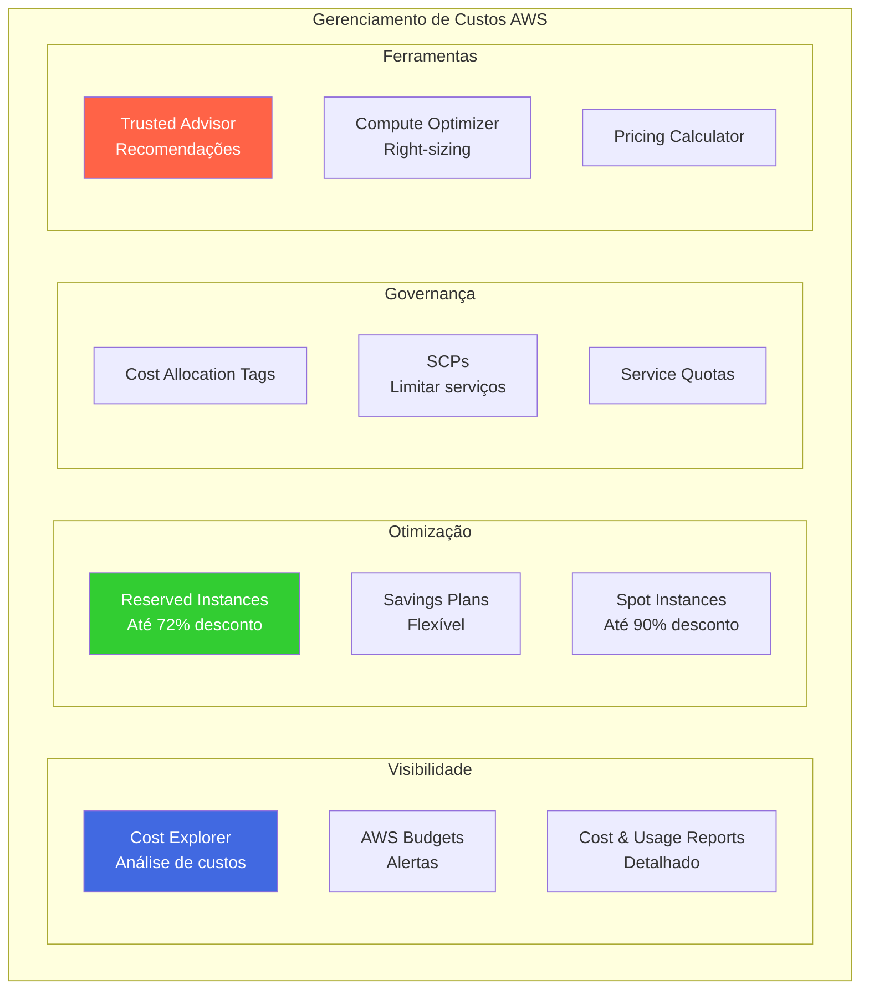

## TAGs

> Cost Allocation Tags

As **Cost Allocation Tags** são extremamente úteis para fazer o rastreamento e análise de custos dentro da AWS. Elas ajudam a separar e identificar os custos de diferentes recursos ou departamentos da organização. Ao associar tags a diferentes recursos, você pode gerar relatórios financeiros detalhados que ajudam a controlar orçamentos e a realizar a alocação de custos de forma mais eficiente.  
- Com tags, podemos realizar o **tracking** dos recursos.
- Com **Cost Allocation Tags**, podemos habilitar relatórios detalhados de custos.
- As tags podem ser adicionadas como colunas nos relatórios.
- Existem dois tipos de tags:
  - **AWS Generated**
    - Adicionadas aos recursos automaticamente, uma vez que estejam habilitadas.
    - Iniciam com o prefixo **AWS:** (ex: **AWS:CreatedBy**).
  - **User Tags**
    - Definidas pelo usuário.
    - Iniciam com o prefixo **user:**.
- Essas tags aparecem apenas no **Billing Console**.
- Após criar uma nova tag e adicioná-la ao recurso, leva **24 horas** para aparecer no console.

---

> Tag Editor

O **Tag Editor** é uma ferramenta muito útil, especialmente quando você tem muitos recursos distribuídos em várias regiões. Ele oferece uma visão centralizada de todos os recursos e suas respectivas tags, permitindo que você realize alterações em massa, sem a necessidade de acessar cada recurso individualmente. Isso economiza tempo e ajuda a manter a consistência das tags em toda a organização.
- Serve para gerenciar as tags de múltiplos recursos em um só lugar.
- Permite **adicionar, remover e atualizar tags**.
- Permite procurar **recursos taggeados e não taggeados** em **todas as regiões**.

---
## Calculadora de preços da AWS

> Visão Geral

A **Calculadora de Preços da AWS** é uma ferramenta online gratuita que ajuda a estimar o custo mensal dos serviços da AWS. Ela permite que os usuários calculem o custo de diferentes combinações de serviços com base em suas necessidades específicas. Esta ferramenta é útil tanto para planejar orçamentos de TI quanto para avaliar diferentes cenários de implantação de aplicativos e serviços na nuvem da AWS.  
A calculadora pode ser usada para determinar custos iniciais e estimativas de longo prazo, ajudando a tomar decisões mais informadas sobre a escolha de serviços e a arquitetura de soluções.  

- A **Calculadora de Preços da AWS** oferece uma **visão detalhada de custos** para diversos serviços da AWS.
- Permite simular **diferentes cenários de implantação** de aplicativos.
- Utilizada por empresas para **planejamento e gerenciamento de orçamentos de TI**.
- Oferece **estimativas personalizadas** com base nos recursos selecionados, incluindo **instâncias EC2**, **serviços de banco de dados**, **storage**, e **networking**.

> Funcionalidades

- A calculadora pode simular custos com base em diferentes configurações de **instâncias EC2** e **tipo de armazenamento**.
- Permite estimar **custos de serviços gerenciados**, como **RDS**, **Lambda** e **S3**.
- Possui **planos de preços** detalhados para modelos como **on-demand**, **reserved** e **spot instances**.
- A estimativa de custo pode ser ajustada de acordo com **fatores como localização** da instância, **uso de largura de banda**, e **opções de backup**.

:::note 📌 **Dica de Uso**
Ao usar a calculadora, é importante revisar as configurações detalhadas, como as **zonas de disponibilidade** e **opções de pagamento** para cada serviço. Pequenos ajustes podem afetar significativamente o custo total.
:::

---

## AWS Trusted Advisor

> Visão Geral

O **AWS Trusted Advisor** fornece uma análise em **tempo real dos serviços**, baseada nas melhores práticas recomendadas pela AWS. Ele oferece orientações para ajudar a **reduzir custos**, **aumentar o desempenho** e **melhorar a segurança**. O Trusted Advisor realiza uma análise detalhada dos seus recursos na AWS e gera recomendações para otimizar o uso da infraestrutura. Ele atua em diversas áreas, incluindo **custo**, **segurança**, **performance**, e **tolerância a falhas**.

> Principais Funcionalidades:

- **Análise em tempo real**: Monitora os recursos da AWS e fornece recomendações imediatas.
- Geração de **relatórios detalhados** sobre os seguintes tópicos:
  - **Custo**: Identifica recursos ociosos ou subutilizados, que podem ser desligados ou ajustados.
  - **Performance**: Ajuda a otimizar o desempenho dos serviços para melhorar a eficiência.
  - **Segurança**: Verifica configurações de segurança, como permissões excessivas ou riscos de dados expostos.
  - **Tolerância a falhas**: Avalia as configurações para garantir alta disponibilidade e resiliência.
  - **Limites de serviços**: Monitora os limites de uso de recursos e avisa quando eles se aproximam do limite.
  
> Tipos de Planos

- **Plano Comum**:
  - Realiza checagens e fornece recomendações comuns para otimizar o uso da AWS.
  - Recomendado para empresas que desejam melhorar o gerenciamento básico dos recursos.

- **Plano Completo**:
  - Disponível para clientes com planos de suporte **Business** ou **Enterprise**.
  - Oferece acesso programático via **APIs** para integrar com outros sistemas e automações.
  - Permite configurar **alarmes** quando os limites de serviços forem atingidos.
  - Fornece recomendações mais avançadas e detalhadas.

> Funcionalidades Adicionais

- É possível **configurar alertas por e-mail semanalmente**, para receber notificações sobre as recomendações e alertas.
- O **Trusted Advisor** também pode verificar se um **bucket S3** é público, mas **não verifica se os objetos dentro do bucket** são públicos.
- Pode verificar os **limites de serviços**, mas para **aumentá-los**, é necessário abrir uma solicitação no **AWS Support Center** ou usar o **AWS Service Quotas**.

:::note 📌 **Detalhamento Técnico**

> O **Trusted Advisor** não realiza verificações automáticas de recursos que estão em **instâncias spot** ou **em ambientes de alta disponibilidade**. Nestes casos, recomendações de performance e segurança devem ser realizadas manualmente, levando em consideração a arquitetura específica da empresa.

:::

---

## Service Quotas

> Visão Geral

O **AWS Service Quotas** é um serviço que permite definir **limites (thresholds)** para os recursos e serviços da AWS, ajudando a monitorar e gerenciar o uso dentro da conta. Com ele, é possível receber alertas de quando um serviço está **próximo de atingir o limite** estabelecido, evitando problemas como a superação de limites que podem afetar a operação dos seus aplicativos. Ele é essencial para garantir que os recursos da AWS sejam utilizados de maneira eficiente, evitando surpresas nos custos e ajudando a gerenciar a infraestrutura.

> Funcionalidades Principais:

- Permite **definir limites personalizados** (thresholds) para os serviços da AWS.
- Envia **notificações** quando um serviço está **próximo do limite da conta**.
- Permite **criar alarmes no Amazon CloudWatch** para monitorar os limites de serviço.
- Acompanhe o uso dos serviços e faça ajustes conforme necessário, baseado nas notificações recebidas.

> Como Funciona:

Para definir esses limites, o **AWS Service Quotas** integra-se ao **CloudWatch** para enviar alertas quando um recurso atingir um limite específico. Esses alertas podem ser configurados para enviar **e-mails** ou realizar **ações automáticas** baseadas em suas necessidades. Isso ajuda a ter visibilidade sobre o uso de recursos antes que eles impactem o desempenho ou as operações.

:::note 📌 **Detalhamento Técnico**

> O **AWS Service Quotas** também fornece uma interface para solicitar o aumento de quotas em serviços específicos, caso os limites definidos sejam atingidos. Caso precise de mais recursos em um determinado serviço, é possível abrir uma solicitação diretamente pelo console.

:::

---

## EC2 Launch Types & Savings Plan

> Tipos de Lançamento EC2 (EC2 Launch Types)

O **Amazon EC2** (Elastic Compute Cloud) oferece diferentes tipos de lançamento para facilitar a adaptação das suas instâncias de acordo com os requisitos de custo, escalabilidade e gerenciamento. Os **Launch Types** definem como as instâncias serão provisionadas e gerenciadas na AWS.

Existem três tipos principais de lançamento de instâncias EC2:

1. **On-Demand Instances**  
   - As instâncias **On-Demand** são ideais para cargas de trabalho com **demanda imprevisível** ou curta duração.  
   - Você paga por segundo ou hora, dependendo da instância, sem compromissos de longo prazo.  
   - Útil quando você não pode prever a utilização ou se a necessidade de capacidade de computação é temporária.

2. **Reserved Instances**  
   - As **Reserved Instances** permitem que você reserve capacidade EC2 por **um ou três anos**, com descontos em relação às instâncias On-Demand.  
   - Ideal para **cargas de trabalho previsíveis** e de longo prazo.  
   - Existem três opções de pagamento:
     - **All Upfront (Pago antecipadamente)**: Desconto maior, pagamento completo no início do período.
     - **Partial Upfront (Pagamento parcial antecipado)**: Uma parte paga antecipadamente e o resto ao longo do período.
     - **No Upfront (Sem pagamento antecipado)**: Pagamento mensal durante o período da instância reservada.

3. **Spot Instances**  
   - As **Spot Instances** permitem que você aproveite a capacidade de computação não utilizada da AWS, com **grandes descontos** em comparação com as instâncias On-Demand.  
   - São ideais para **cargas de trabalho flexíveis**, como processamento de dados em massa ou análises em larga escala.  
   - O preço das Spot Instances varia de acordo com a demanda, e a AWS pode interromper essas instâncias a qualquer momento, com um aviso de dois minutos.

> Savings Plans

Os **Savings Plans** são uma forma flexível e econômica de se comprometer com o uso de EC2, oferecendo **descontos em troca de um compromisso de uso** durante um período de um ou três anos. Em vez de fazer compromissos de instâncias específicas, como nas **Reserved Instances**, o Savings Plan permite que você escolha entre diferentes tipos de uso e **serviços** da AWS, como EC2, Fargate e Lambda, e ainda assim obter descontos significativos.

Existem dois tipos principais de **Savings Plans**:

1. **Compute Savings Plan**  
   - Oferece flexibilidade total, permitindo que você use os recursos em **qualquer tipo de instância EC2**, **qualquer região**, e até mesmo **em diferentes famílias de instâncias**, **opções de sistemas operacionais** e **contas da AWS**.
   - Ideal para clientes que precisam de **flexibilidade** nas configurações da infraestrutura.

2. **EC2 Instance Savings Plan**  
   - Oferece **descontos mais profundos**, mas com restrições de uso a instâncias EC2 específicas dentro de uma **família de instâncias** e em uma **única região**.
   - Ideal para cargas de trabalho previsíveis que não exigem a flexibilidade do **Compute Savings Plan**.

:::note 📌 **Detalhamento Técnico**  
Os **Savings Plans** são baseados no consumo de recursos e podem ser usados para uma gama ampla de serviços, como **AWS Lambda** e **AWS Fargate**, o que torna mais fácil obter descontos, mesmo que você use uma combinação de serviços.  

:::

---

## S3 Storage Classes

> Visão Geral das Classes de Armazenamento S3

O **Amazon S3** (Simple Storage Service) oferece diferentes classes de armazenamento para atender a diferentes necessidades de desempenho, custo e durabilidade. As classes de armazenamento variam em termos de **acessibilidade**, **tempo de recuperação** e **custo**, permitindo que você escolha a mais adequada com base nos seus requisitos de uso e orçamento.

Cada classe tem características específicas para otimizar o custo e o desempenho, e as empresas podem migrar dados entre essas classes para maximizar a eficiência de custo. As classes mais comuns são:

1. **S3 Standard**  
   - Ideal para dados frequentemente acessados, como sites, aplicativos e backups em tempo real.
   - Garantia de **alta durabilidade** e **acesso rápido**.
   - **Custo mais alto** em comparação com outras classes, devido à alta disponibilidade e baixíssima latência.

2. **S3 Intelligent-Tiering**  
   - Otimiza automaticamente os custos movendo dados entre duas camadas: **frequentemente acessada** e **raramente acessada**, sem afetar o desempenho.
   - **Sem necessidade de gerenciar o processo manualmente**, o que é ideal para dados com padrões de acesso imprevisíveis.
   - Ideal para aplicações com grandes volumes de dados, onde não se sabe com certeza o padrão de acesso futuro.

3. **S3 Standard-IA (Infrequent Access)**  
   - Destinado a dados que são acessados **raramente**, mas precisam ser recuperados rapidamente quando necessário.
   - **Custo de armazenamento mais baixo** que o S3 Standard, mas a recuperação tem um custo adicional.
   - Ideal para backups e dados de longo prazo que não precisam de acesso frequente.

4. **S3 One Zone-IA**  
   - Semelhante ao **S3 Standard-IA**, mas os dados são armazenados em uma única zona de disponibilidade, o que reduz ainda mais os custos de armazenamento.
   - Ideal para **dados secundários**, como backups e cópias de dados que não precisam de alta resiliência.

5. **S3 Glacier**  
   - Uma solução de **arquivamento de dados** com **latência mais alta** para recuperação (geralmente entre minutos a horas).
   - **Muito mais barato** que o S3 Standard, mas ideal para dados que não precisam ser acessados frequentemente, como arquivos de longo prazo.
   - **Ideal para arquivamento**, como o cumprimento de requisitos legais de retenção de dados.

6. **S3 Glacier Deep Archive**  
   - A classe **mais econômica** para arquivamento de dados que **não serão acessados por anos**.
   - Ideal para dados de retenção a longo prazo e para conformidade regulatória.
   - Tem um custo **muito baixo**, mas a recuperação dos dados pode levar horas.

> Manejo de Dados com Classes de Armazenamento

As classes de armazenamento do S3 permitem uma grande flexibilidade no gerenciamento de dados, podendo ser alteradas de acordo com as necessidades de acessibilidade e custo. Por exemplo, dados que começam sendo armazenados em **S3 Standard** podem ser movidos automaticamente para o **S3 Glacier** após determinado período de inatividade, ajudando a reduzir custos.

> Migração entre Classes de Armazenamento

Você pode configurar regras de **lifecycles** no S3 para mover dados automaticamente entre diferentes classes de armazenamento com base em suas necessidades de acesso ao longo do tempo. Isso é útil para otimizar custos sem precisar gerenciar manualmente o processo de migração.

:::note 📌 **Detalhamento Técnico**
O **S3 Lifecycle Policy** permite mover dados automaticamente entre classes de armazenamento para reduzir custos conforme a necessidade de acesso muda ao longo do tempo. Essas políticas podem ser definidas com base em regras específicas, como a idade dos objetos ou o padrão de acesso. Além disso, é possível definir o **tempo mínimo de retenção** de dados para classes como S3 Glacier e S3 Glacier Deep Archive.

:::

---

## AWS Budget

> **Visão Geral do AWS Budget**

O **AWS Budget** permite definir um orçamento para monitorar e alertar quando você estiver prestes a exceder o custo ou uso planejado. Ele é essencial para gerenciar os custos de forma proativa e pode ser usado para entender como o consumo de recursos está se saindo em relação aos seus objetivos orçamentários.

- Você pode definir um **orçamento** que avisa quando o custo ou o uso excede (ou está previsto para exceder) o valor do orçamento.
- Usado para **gerenciamento de custos antes de uma demanda**, ou seja, definir um orçamento para determinada demanda de recursos.
- Pode ser usado para **ver quanto foi utilizado** em relação ao planejamento inicial.
- Através das **tags**, é possível ver onde você está gastando seu dinheiro, proporcionando maior controle sobre os custos.
- Pode gerar alertas de gastos, enviar e-mails, postar em tópicos **SNS** (até 5 tópicos) e configurar ações (como Lambdas).
- É possível criar até **20.000 orçamentos** (limite soft).
- **Os 2 primeiros orçamentos são gratuitos**, mas os adicionais têm custo de **0,02 USD por dia por orçamento**.
- Há 4 tipos de orçamento que podem ser criados:
  - **Usage** (Uso)
  - **Cost** (Custo)
  - **Reservation** (Reserva)
  - **Savings Plan** (Plano de Economias)

> **Pergunta com Possível Enfoque na Certificação AWS:**
- **Qual a diferença entre os tipos de orçamento?**
  - **Usage Budget**: Foca no uso de recursos.
  - **Cost Budget**: Foca nos custos com base no uso.
  - **Reservation Budget**: Relacionado com os custos e a utilização de instâncias reservadas.
  - **Savings Plan Budget**: Relacionado aos planos de economia, como o AWS Compute Savings Plan.

---

### Budget Actions

> **O que são e como configurar as ações do Budget**

O **AWS Budget Actions** permite que você configure ações automáticas a serem executadas quando o orçamento atingir um certo limite de custo ou uso. Essas ações ajudam a gerenciar e otimizar os gastos sem intervenção manual.

- Permite **configurar ações automáticas** quando o orçamento atingir um limite específico de custo ou uso.
- Suporta 3 tipos de ações:
  - **Aplicar IAM Policy a Users, Groups e Roles**: Permite restringir a criação de novos recursos.
  - **Aplicar SCP a OUs**: Permite restringir a criação de novos recursos para unidades organizacionais (OUs).
  - **Parar instâncias do EC2 ou RDS**: Permite interromper instâncias para controlar o uso de recursos e custos.
- As ações podem ser executadas automaticamente ou através de um fluxo de trabalho de aprovação antes da execução.

:::note **Detalhamento sobre o uso de Budget Actions**
As ações de **IAM Policy** e **SCP** são poderosas para garantir que uma conta não ultrapasse os limites estabelecidos, aplicando restrições de forma imediata. Essas políticas podem ser configuradas para impedir a criação de recursos desnecessários quando o orçamento atingir um determinado valor, ajudando a evitar surpresas nos custos.

:::

---

### Centralized Budget Management

> **Gerenciamento Centralizado de Orçamentos**

O **Centralized Budget Management** permite gerenciar orçamentos em uma conta centralizada, facilitando o controle de custos em grandes organizações com múltiplas contas. Com isso, você pode criar orçamentos para cada conta e gerenciar tudo de uma única localização.

- Permite gerenciar os **orçamentos em uma conta centralizada**.
- Para cada conta na organização, deve haver um **orçamento para ela**, e depois esse orçamento pode ser gerido pela conta centralizada.
- Você pode ter dois tipos de Unidades Organizacionais (OUs): uma mais restritiva e outra mais flexível.
- Se uma conta da OU mais flexível **exceder os limites** definidos no orçamento, ela pode ser **movida para a OU mais restritiva** e um e-mail pode ser enviado para notificar os administradores da conta.

---

### Cost Explorer

> **O que é o AWS Cost Explorer?**

O **AWS Cost Explorer** é uma ferramenta poderosa que permite visualizar, entender e gerenciar os gastos com os serviços da AWS. Ele oferece análises detalhadas e relatórios personalizados para ajudar a identificar padrões de gastos e otimizar o uso de recursos.

- Serviço usado para **ver, entender e gerenciar os gastos** (com várias granularidades: mês, ano, dia).
- Permite explorar **seus custos e uso da AWS** com base em dimensões como serviço da AWS, região, conta de membro, etc.
- Contém vários relatórios para analisar os gastos, permitindo criar relatórios personalizados.
- Possui uma funcionalidade que prevê o uso e custos com base nos últimos 12 meses.

> **Quando devo usar o AWS Cost Explorer e o AWS Compute Optimizer?**

- **AWS Cost Explorer**: Se você deseja identificar **instâncias EC2 subutilizadas** e entender o impacto potencial nas suas faturas.
- **AWS Compute Optimizer**: Se você deseja ver recomendações sobre **tipo de instância**, além de sugestões para **downsizing**. Utiliza aprendizado de máquina para identificar os tipos de carga de trabalho e escolher a melhor recomendação de recursos.

---

### Compute Optimizer

> **Como o AWS Compute Optimizer pode ajudar na otimização de custos**

O **AWS Compute Optimizer** utiliza **machine learning** para analisar seus recursos e prever recomendações para otimizar o uso dos mesmos, ajudando a reduzir custos sem comprometer o desempenho.

- Usa **Machine Learning** para analisar os **recursos** e prever recomendações para os mesmos.
- Ajuda a **reduzir custos** recomendando os recursos ideais para as cargas de trabalho.
- Suporta **EC2, Auto Scaling Groups (ASG), EBS e Lambda**.
- Pode reduzir até **25% dos custos** com as recomendações.
- As recomendações podem ser exportadas para o **S3** para facilitar o acompanhamento e aplicação.

:::note **Detalhamento sobre o AWS Compute Optimizer**
O **AWS Compute Optimizer** recomenda instâncias de EC2, volumes EBS e configurações de Auto Scaling mais eficientes, levando em conta o histórico de uso e o tipo de carga de trabalho. Essas recomendações são baseadas em análises de machine learning, ajudando a identificar onde o uso dos recursos pode ser otimizado.

:::

