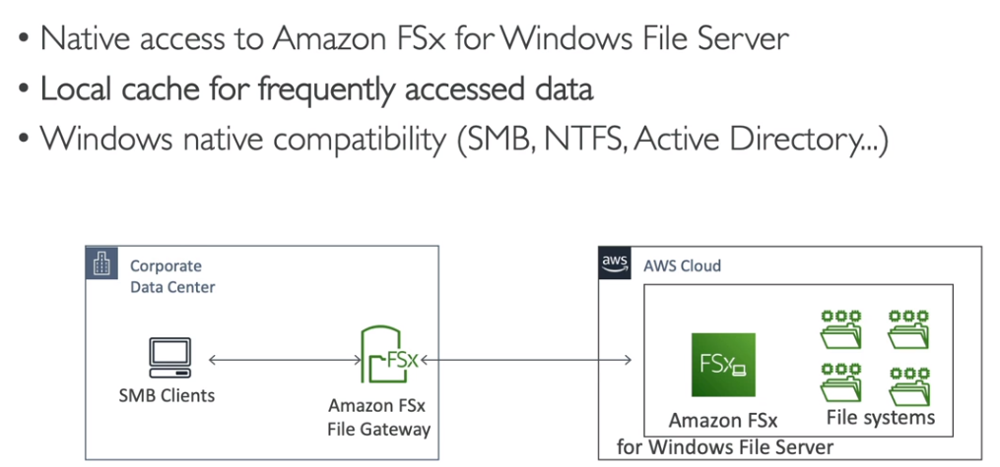
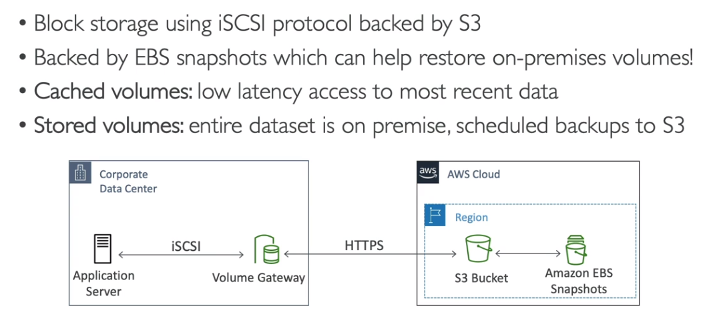
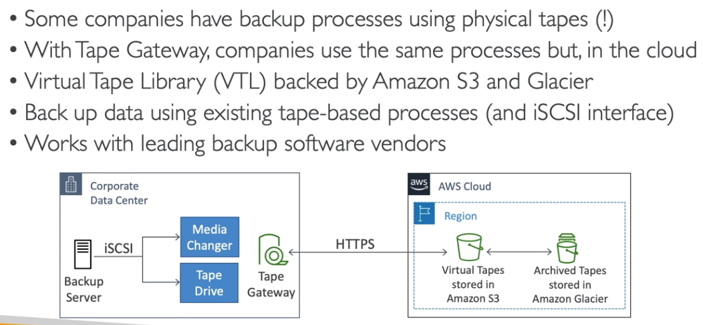
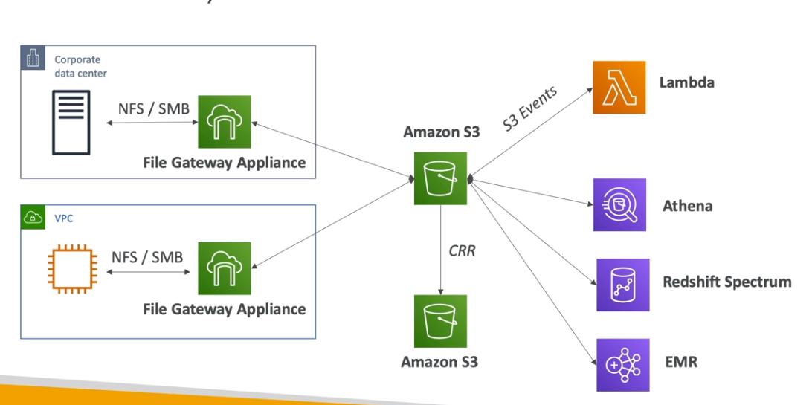
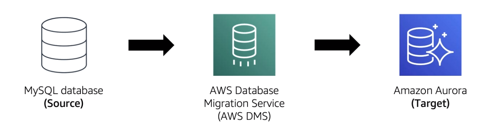
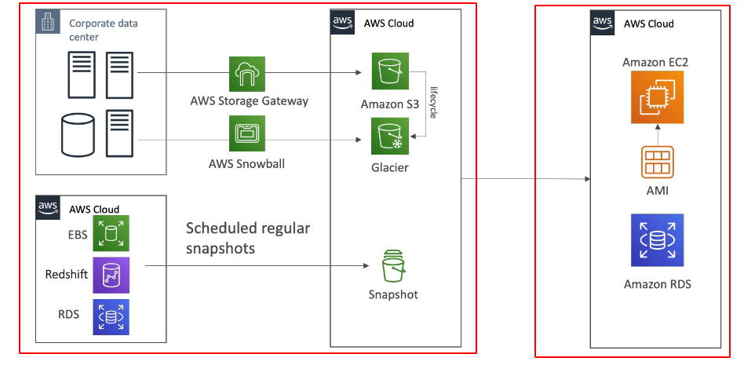
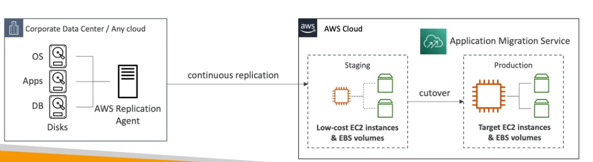
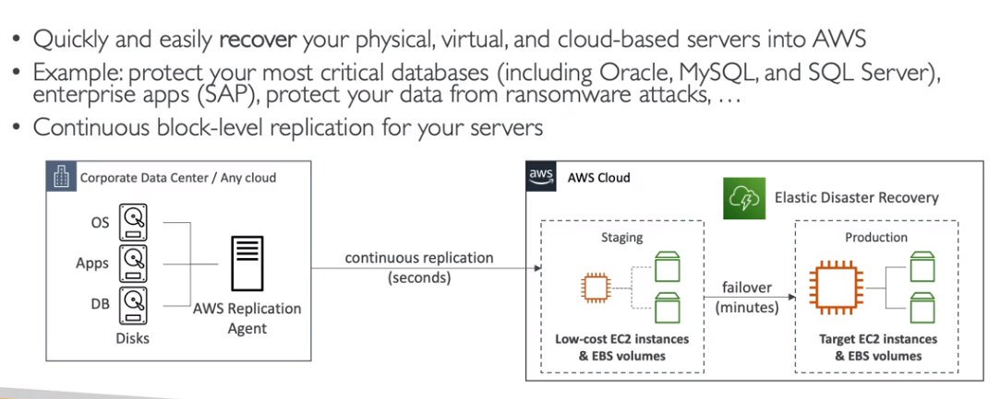
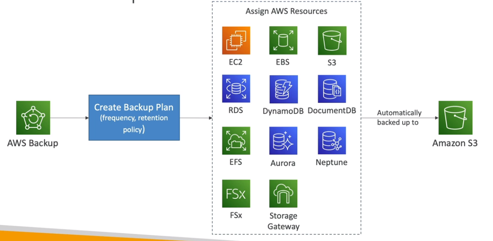

## Migration

### Cloud Migrations - The 6R 🚀

:::tip 💡 O que são as 6Rs?
As 6 estratégias de migração para a nuvem ajudam a escolher o melhor caminho para cada aplicação, considerando esforço, custo e benefícios.
:::

- [6 estratégias para migrar para a cloud](https://aws.amazon.com/pt/blogs/enterprise-strategy/6-strategies-for-migrating-applications-to-the-cloud/)
  - **Rehosting** - “lift-and-shift”
    - Migração direta do on-premises para AWS (aplicação inteira, sem grandes mudanças).
    - Exemplo: mover VMs do datacenter para EC2.
  - **Replatforming**  - “lift-tinker-and-shift”
    - Migração com pequenas otimizações, sem alterar o core da aplicação.
    - Exemplo: migrar banco local para RDS ou trocar Weblogic por Tomcat.
  - **Repurchasing** — "drop and shop"
    - Troca de solução por uma nova, geralmente SaaS.
    - Exemplo: migrar de CRM próprio para Salesforce.
  - **Refactoring / Re-architecting**
    - Reescrever a aplicação para aproveitar ao máximo os recursos da nuvem.
    - Mais caro e demorado, mas facilita novas features e escalabilidade.
    - Exemplo: migrar monolito para microserviços serverless.
  - **Retire**   - Livrar-se
    - Eliminar sistemas que não são mais necessários ou pouco usados.
  - **Retain**
    - Manter parte da infraestrutura local, integrando com AWS.
    - Usado quando migrar não vale o esforço ou é muito complexo.

:::tip Dica para a prova

📌 Uma empresa deseja migrar suas VMs do datacenter para a AWS sem modificar nada. Qual estratégia usar?  
✅ **Rehosting (Lift-and-shift)**

📌 Você precisa mover um banco de dados local para o Amazon RDS com pequenas mudanças de configuração. Qual estratégia aplicar?  
✅ **Replatforming**

📌 A empresa está trocando seu sistema de CRM on-premises por uma solução SaaS como o Salesforce. Qual estratégia representa isso?  
✅ **Repurchasing**

📌 Qual a diferença entre Refactoring e Replatforming?  
✅ Refactoring envolve reescrever a aplicação; Replatforming ajusta a infraestrutura sem reescrever o código.

📌 Qual abordagem usar para redesenhar aplicações monolíticas em microserviços?  
✅ **Refactor / Re-architect**

:::

---

### AWS Storage Gateway 🗄️

:::info 📦 O que é?
Permite criar uma ponte entre dados locais e a nuvem AWS, ideal para ambientes híbridos, backup, DR e cache.
:::

- Conecta um dispositivo de software local ao armazenamento em nuvem, garantindo integração segura e eficiente.
- Ideal para backup, recuperação de desastres, armazenamento escalável e redução de latência.

#### Tipos de Storage Gateway:

- **S3 File Gateway**  
  Usado para armazenar arquivos diretamente no S3.  
  
- **FSx File Gateway**  
  Ótimo para cache de arquivos muito acessados, integra com FSx.  
  
- **Volumes Gateway (EBS)**  
  Armazena dados de backups ou volumes, integra com EBS.  
  
- **Tape Gateway (S3 Glacier)**  
  Simula fitas para backup, integrando com S3 Glacier.  
  

:::tip 💡 Dica
A AWS oferece hardware dedicado para Storage Gateway, caso não haja estrutura de virtualização local.
:::

**Usos comuns:**
- Recuperação de desastres
- Backup e restauração
- Armazenamento escalável
- Redução de latência e cache local

**Arquiteturas:**
- Migração de dados do on-premises para AWS ou conexão de aplicações migradas (Rehosting).
  
- Replica de leitura entre ambientes locais.
  
- Backup econômico.
  

:::tip Dica para a prova

📌 Qual tipo de Storage Gateway armazena arquivos diretamente no S3?  
✅ **S3 File Gateway**

📌 Qual tipo de gateway usar para montar compartilhamento com cache local?  
✅ **FSx File Gateway**

📌 Qual gateway simula fitas e integra com Glacier?  
✅ **Tape Gateway**

:::

---

### AWS Snow Family ❄️

:::info 🚚 O que é?
Dispositivos offline para migração de grandes volumes de dados, sem depender da rede. Podem rodar EC2 ou Lambda para processamento em áreas remotas.
:::

#### Tipos:

- **Snowball Edge**  
  Transporta TBs/PBs de dados, formato maleta.  
  - Storage Optimized: 40 vCPU, 80 GB RAM, 80 TB S3.
  - Compute Optimized: 52 vCPU, 208 GB RAM, 42 TB S3, opção de GPU.
- **SnowCone**  
  Menor, pesa ~2,1 kg, bateria opcional.  
  - HDD: 2 vCPU, 4 GB RAM, 8 TB, USB-C.
  - SSD: 2 vCPU, 4 GB RAM, 14 TB SSD.
- **SnowMobile**  
  Caminhão para transportar mais de 10 PBs para AWS!  
  

:::caution Atenção!
Não é possível importar dados do Snowball direto para Glacier, primeiro vai para S3 e depois ciclo de vida move para Glacier.
:::

:::tip Dica para a prova

📌 Como migrar mais de 10 PB de dados de um datacenter remoto para a AWS?  
✅ **AWS Snowmobile**

📌 Você precisa migrar até 80 TB de dados com processamento local. Qual opção usar?  
✅ **AWS Snowball Edge**

📌 Qual dispositivo portátil pode operar offline e ser carregado manualmente?  
✅ **Snowcone**

📌 Qual ferramenta AWS permite mover grandes quantidades de dados físicos para a nuvem?  
✅ **AWS Snowball**

:::

---

### AWS DMS (Database Migration Service) 🛢️

:::info O que é?
Serviço gerenciado para migração de bancos de dados para AWS, com suporte a migração ativa e replicação contínua.
:::

**Tipos de migração:**
- **Homogênea:** mesmo tipo de banco (ex: Oracle para Oracle).
- **Heterogênea:** tipos diferentes (ex: Oracle para MySQL), usando o **SCT (Schema Conversion Tool)**.

**Modos de operação:**
- **Full Load:** carga completa inicial.
- **CDC only:** replicação contínua.
- **Full Load + CDC:** carga inicial + replicação contínua.

:::tip 💡 Dica
Pode combinar Snowball com DMS para grandes volumes: extrai dados com SCT, move para Snowball, importa para S3, usa DMS para replicar no banco.

📌 Como migrar um banco Oracle on-premises para Aurora PostgreSQL na AWS?  
✅ **AWS DMS + Schema Conversion Tool (SCT)**

📌 Qual modo do DMS permite copiar dados em tempo real sem causar downtime?  
✅ **CDC (Change Data Capture)**

📌 Quando usar Full Load + CDC no DMS?  
✅ Quando é necessário migrar dados históricos e manter a replicação contínua.

📌 Ao usar DMS, é possível migrar dados entre diferentes tipos de bancos?  
✅ Sim! O **DMS** suporta migração heterogênea.

:::

---

### Disaster Recovery in AWS 🆘

:::info O que é?
Estratégia para prevenir desastres e garantir continuidade de operação, mantendo cópia da solução em região afastada.
:::

**Modelos:**
- On-premises → On-premises (caro)
- On-premises → AWS (híbrido)
- AWS Região A → AWS Região B (replicação entre regiões)

**Termos importantes:**
- **RPO (Recovery Point Objective):** frequência dos backups.
- **RTO (Recovery Time Objective):** tempo de recuperação.

#### Estratégias de DR

- **Backup & Restore:** backups frequentes, recuperação manual.  
  
- **Pilot Light:** infra mínima pronta para escalar em desastre.  
  
- **Warm Standby:** infra replicada em menor escala, pronta para escalar.  
  
- **Hot Site / Multi Site:** infra completa e sincronizada, failover quase instantâneo.  
    
  

:::tip Dica para a prova

📌 Qual modelo de DR usa infraestrutura mínima pronta para escalar após um desastre?  
✅ **Pilot Light**

📌 O que significam RPO e RTO?  
✅ **RPO:** quanto de dados pode ser perdido  
✅ **RTO:** tempo que o serviço pode ficar fora do ar

📌 Qual estratégia de DR garante failover quase instantâneo entre regiões?  
✅ **Multi-site (Hot Site)**

:::

---

### AWS FIS - Fault Injection Simulator 🧪

:::info O que é?
Permite injetar falhas nas cargas de trabalho AWS para validar resiliência, baseado em engenharia do caos.
:::

:::tip Dica para a prova

📌 Qual serviço AWS permite injetar falhas controladas em workloads para testar resiliência?  
✅ **AWS Fault Injection Simulator (FIS)**

:::

---

### VM Migration Service & Application Discovery Service 🖥️

:::info O que é?
Planeja migração de projetos com base em informações coletadas dos data centers, mapeando uso de servidores e dependências.
:::

**Modos:**
- **Agentless Discovery (Connector):**  
  - OVA (Open Virtual Appliance) deployada em VM.
  - Inventário de VMs (CPU, memória, disco).
  - Funciona em todos os sistemas.
- **Agent Based Discovery:**  
  - Agente instalado para coletar dados de configuração, performance, processos e rede.
  - Suporta Microsoft Server, Amazon Linux, Ubuntu, RedHat, CentOS, Suse...
  - Exporta dados via CSV, Migration Hub ou S3 (análise no Athena).

---

#### MGN - Application Migration Service 🔄

:::info O que é?
Evolução do SMS e CloudEndure Migration, foca em rehosting e migra recursos físicos, VMware, Hyper-V, EC2, VPC e outras nuvens para AWS.
:::

:::tip Dica para a prova

📌 Uma empresa precisa migrar servidores legados para a nuvem com o menor esforço. Qual estratégia usar?  
✅ **Rehost com MGN**

📌 Como migrar máquinas virtuais do VMware para EC2 com replicação contínua?  
✅ **AWS MGN (Application Migration Service)**

📌 Como descobrir automaticamente servidores e dependências antes da migração?  
✅ **AWS Application Discovery Service**

📌 O que faz o Migration Evaluator?  
✅ Avalia custos e benefícios da migração para justificar o projeto.

📌 Como acompanhar o progresso de todas as migrações em tempo real?  
✅ **AWS Migration Hub**

:::

---

#### DRS Elastic Disaster Recovery 🛡️

:::info O que é?
Antes chamado de CloudEndure Disaster Recovery, recupera recursos físicos, virtuais e servidores na nuvem.
:::

---

#### Migration Evaluator 📊

:::tip 💡 Dica
Avalia custos e benefícios da migração para AWS, útil para justificar projetos de migração.
:::

---

### AWS Backup 💾

:::info O que é?
Serviço gerenciado de backup pela AWS, centraliza configurações, suporta cross-region e cross-account, e permite backups agendados ou sob demanda.
:::

- Políticas de tags e retenção.
- **Backup Vault Lock:**  
  - Implementa WORM (Write Once Read Many), protegendo dados contra deleção acidental ou maliciosa.

:::tip Dica para a prova

📌 Como proteger backups contra exclusão acidental ou maliciosa?  
✅ **AWS Backup com Vault Lock (WORM)**

📌 Qual serviço AWS permite configurar backups agendados e centralizados para várias contas?  
✅ **AWS Backup**

:::

---

## Links para Recursos Adicionais e Referências 📚

:::info Links Úteis
- [Documentação oficial AWS Migration](https://aws.amazon.com/pt/migration/)
- [Exemplos de perguntas de certificação AWS](https://www.examtopics.com/exams/amazon/aws-certified-solutions-architect-professional/view/)
- [AWS Storage Gateway](https://aws.amazon.com/pt/storagegateway/)
- [AWS Snow Family](https://aws.amazon.com/pt/snow/)
- [AWS DMS](https://aws.amazon.com/pt/dms/)
- [AWS Backup](https://aws.amazon.com/pt/backup/)
:::

---