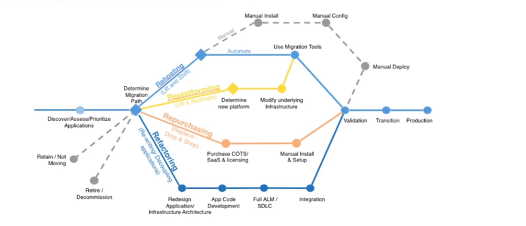
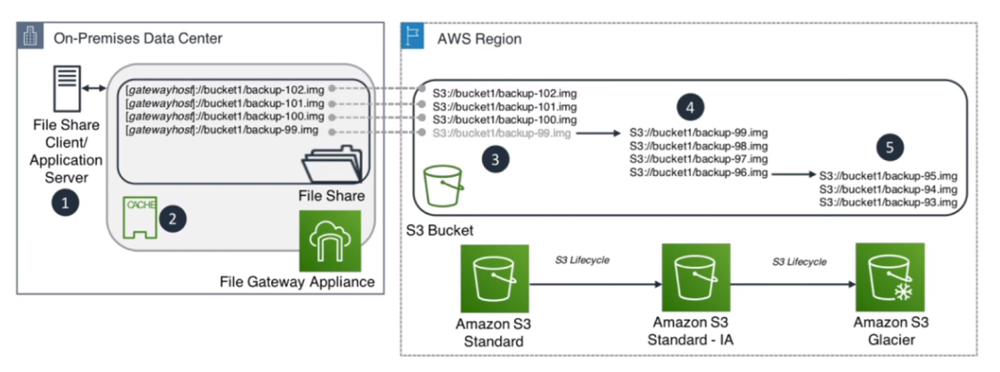
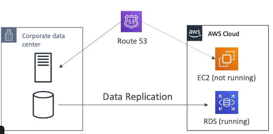
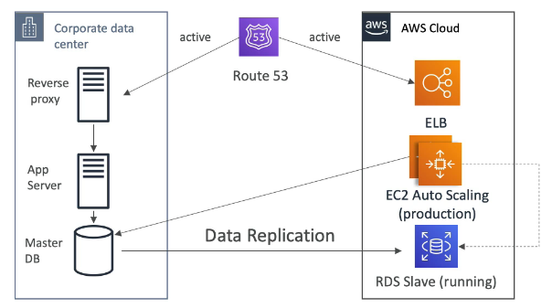
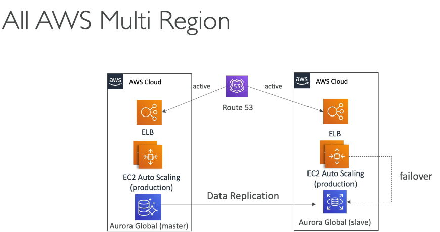

## Migration

### Cloud Migrations - The 7R 🚀

:::tip 💡 O que são os 7Rs?
As 7 estratégias de migração para a nuvem ajudam a escolher o melhor caminho para cada aplicação, considerando esforço, custo e benefícios. A AWS atualizou de 6R para 7R, adicionando **Relocate**.
:::

- [7 estratégias para migrar para a cloud](https://aws.amazon.com/pt/blogs/enterprise-strategy/6-strategies-for-migrating-applications-to-the-cloud/)
  - **Relocate** - "hypervisor-level lift and shift" (novo!)
    - Move workloads VMware para VMware Cloud on AWS sem modificações.
    - Não requer compra de novo hardware ou reescrita de aplicações.
    - Exemplo: migrar VMs VMware vSphere diretamente para VMware Cloud on AWS.
  - **Rehosting** - "lift-and-shift"
    - Migração direta do on-premises para AWS (aplicação inteira, sem grandes mudanças).
    - Exemplo: mover VMs do datacenter para EC2.
  - **Replatforming**  - “lift-tinker-and-shift”
    - Migração com pequenas otimizações, sem alterar o core da aplicação.
    - Exemplo: migrar banco local para RDS ou trocar Weblogic por Tomcat.
  - **Repurchasing** — "drop and shop"
    - Troca de solução por uma nova, geralmente SaaS.
    - Exemplo: migrar de CRM próprio para Salesforce.
  - **Refactoring / Re-architecting**
    - Reescrever a aplicação para aproveitar ao máximo os recursos da nuvem.
    - Mais caro e demorado, mas facilita novas features e escalabilidade.
    - Exemplo: migrar monolito para microserviços serverless.
  - **Retire**   - Livrar-se
    - Eliminar sistemas que não são mais necessários ou pouco usados.
  - **Retain**
    - Manter parte da infraestrutura local, integrando com AWS.
    - Usado quando migrar não vale o esforço ou é muito complexo.

:::tip Dica para a prova

📌 Uma empresa deseja migrar suas VMs do datacenter para a AWS sem modificar nada. Qual estratégia usar?  
✅ **Rehosting (Lift-and-shift)**

📌 Você precisa mover um banco de dados local para o Amazon RDS com pequenas mudanças de configuração. Qual estratégia aplicar?  
✅ **Replatforming**

📌 A empresa está trocando seu sistema de CRM on-premises por uma solução SaaS como o Salesforce. Qual estratégia representa isso?  
✅ **Repurchasing**

📌 Qual a diferença entre Refactoring e Replatforming?  
✅ Refactoring envolve reescrever a aplicação; Replatforming ajusta a infraestrutura sem reescrever o código.

📌 Qual abordagem usar para redesenhar aplicações monolíticas em microserviços? 
✅ **Refactor / Re-architect**

📌 Uma empresa quer mover workloads VMware para AWS sem modificar nada. Qual estratégia? 
✅ **Relocate** (VMware Cloud on AWS)

:::

---

### AWS Storage Gateway 🗄️

:::info 📦 O que é?
Permite criar uma ponte entre dados locais e a nuvem AWS, ideal para ambientes híbridos, backup, DR e cache.
:::

- Conecta um dispositivo de software local ao armazenamento em nuvem, garantindo integração segura e eficiente.
- Ideal para backup, recuperação de desastres, armazenamento escalável e redução de latência.

#### Tipos de Storage Gateway:

- **S3 File Gateway**  
  Usado para armazenar arquivos diretamente no S3.  
  
- **FSx File Gateway**  
  Ótimo para cache de arquivos muito acessados, integra com FSx.  
  
- **Volumes Gateway (EBS)**  
  Armazena dados de backups ou volumes, integra com EBS.  
  
- **Tape Gateway (S3 Glacier)**  
  Simula fitas para backup, integrando com S3 Glacier.  
  

:::tip 💡 Dica
A AWS oferece hardware dedicado para Storage Gateway, caso não haja estrutura de virtualização local.
:::

**Usos comuns:**
- Recuperação de desastres
- Backup e restauração
- Armazenamento escalável
- Redução de latência e cache local

**Arquiteturas:**
- Migração de dados do on-premises para AWS ou conexão de aplicações migradas (Rehosting).
  
- Replica de leitura entre ambientes locais.
  
- Backup econômico.
  

:::tip Dica para a prova

📌 Qual tipo de Storage Gateway armazena arquivos diretamente no S3?  
✅ **S3 File Gateway**

📌 Qual tipo de gateway usar para montar compartilhamento com cache local?  
✅ **FSx File Gateway**

📌 Qual gateway simula fitas e integra com Glacier?
✅ **Tape Gateway**

:::

---

### AWS DataSync 🔄

:::info 📡 O que é?
Serviço de transferência de dados **online** que automatiza e acelera a movimentação de dados entre on-premises e AWS, ou entre serviços AWS.
:::

**Características principais:**
- Transfere dados até **10x mais rápido** que ferramentas open-source.
- Usa agente instalado on-premises para conectar via NFS, SMB, HDFS ou APIs de armazenamento de objetos.
- Criptografia em trânsito (TLS) e validação de integridade automática.
- Pode usar **Direct Connect** ou internet para transferência.
- **Agendamento:** tarefas podem ser agendadas (horária, diária, semanal).
- **Largura de banda:** pode limitar o uso de banda para não impactar a rede.

**Destinos suportados:**
- Amazon S3 (todas as classes de armazenamento)
- Amazon EFS
- Amazon FSx (Windows File Server, Lustre, NetApp ONTAP, OpenZFS)
- Entre regiões AWS (S3 para S3, EFS para EFS)

**Casos de uso:**
- Migração de dados para a nuvem
- Replicação de dados para DR
- Arquivamento de dados cold para S3 Glacier
- Sincronização contínua entre on-premises e AWS

:::caution DataSync vs Storage Gateway
- **DataSync:** migração/sincronização de dados (transferência única ou agendada).
- **Storage Gateway:** acesso híbrido contínuo (aplicações acessam dados na nuvem como se fossem locais).
:::

:::tip Dica para a prova

📌 Qual serviço usar para migrar petabytes de dados de NFS on-premises para S3 pela rede?
✅ **AWS DataSync**

📌 Qual a diferença entre DataSync e Storage Gateway?
✅ DataSync é para **transferência/migração**; Storage Gateway é para **acesso híbrido contínuo**.

📌 DataSync pode transferir dados entre serviços AWS em diferentes regiões?
✅ Sim! Pode sincronizar S3 para S3 ou EFS para EFS cross-region.

📌 Qual serviço usar para sincronizar dados de HDFS (Hadoop) para S3?
✅ **AWS DataSync** (suporta HDFS como source)

:::

---

### AWS Transfer Family 📁

:::info 📤 O que é?
Serviço gerenciado para transferência de arquivos via SFTP, FTPS, FTP e AS2 diretamente para Amazon S3 ou EFS.
:::

**Protocolos suportados:**
- **SFTP** (SSH File Transfer Protocol) - porta 22
- **FTPS** (FTP over SSL) - porta 990
- **FTP** (File Transfer Protocol) - porta 21 (não recomendado, sem criptografia)
- **AS2** (Applicability Statement 2) - para B2B

**Características:**
- Endpoint pode ser público ou dentro de VPC (via VPC Endpoint).
- Integração com AD, LDAP ou provedor de identidade customizado (Lambda).
- Armazenamento em S3 ou EFS.
- Alta disponibilidade e escalabilidade gerenciada.

**Casos de uso:**
- Substituir servidores FTP legados.
- Integração B2B com parceiros que usam protocolos tradicionais.
- Compliance que exige protocolos específicos.

:::tip Dica para a prova

📌 Uma empresa precisa receber arquivos de parceiros via SFTP e armazenar no S3. Qual serviço usar?
✅ **AWS Transfer Family**

📌 Qual serviço permite que aplicações legadas usem FTP para enviar arquivos para AWS?
✅ **AWS Transfer Family**

📌 AWS Transfer Family suporta integração com Active Directory?
✅ Sim! Suporta AD, LDAP e provedores de identidade customizados.

:::

---

### Comparação: Ferramentas de Transferência de Dados 📊

| Ferramenta | Uso Principal | Rede | Volume |
|------------|---------------|------|--------|
| **DataSync** | Migração/sincronização online | Internet/Direct Connect | TBs |
| **Storage Gateway** | Acesso híbrido contínuo | Internet/Direct Connect | Contínuo |
| **Snow Family** | Migração offline | Física | PBs |
| **Transfer Family** | SFTP/FTP para S3/EFS | Internet | Arquivos |
| **S3 Transfer Acceleration** | Upload rápido para S3 | Internet (edge locations) | Qualquer |

:::tip Dica para a prova

📌 Qual ferramenta usar para migração de 50 TB com conexão de rede limitada (10 Mbps)?
✅ **Snowball** (migração offline é mais rápida que transferir pela rede lenta)

📌 Qual ferramenta para sincronização contínua de 1 TB/dia entre on-premises e S3?
✅ **AWS DataSync** (agendamento automático)

📌 Aplicações on-premises precisam acessar arquivos no S3 como se fossem locais. Qual usar?
✅ **S3 File Gateway** (Storage Gateway)

:::

---

### AWS Snow Family ❄️

:::info 🚚 O que é?
Dispositivos offline para migração de grandes volumes de dados, sem depender da rede. Podem rodar EC2 ou Lambda para processamento em áreas remotas.
:::

#### Tipos:

- **Snowball Edge**  
  Transporta TBs/PBs de dados, formato maleta.  
  - Storage Optimized: 40 vCPU, 80 GB RAM, 80 TB S3.
  - Compute Optimized: 52 vCPU, 208 GB RAM, 42 TB S3, opção de GPU.
- **SnowCone**  
  Menor, pesa ~2,1 kg, bateria opcional.  
  - HDD: 2 vCPU, 4 GB RAM, 8 TB, USB-C.
  - SSD: 2 vCPU, 4 GB RAM, 14 TB SSD.
- **SnowMobile**  
  Caminhão para transportar mais de 10 PBs para AWS!  
  

**OpsHub:** Interface gráfica para gerenciar dispositivos Snow (não precisa de CLI).

**Edge Computing com Snow:**
- Snowball Edge e Snowcone podem rodar EC2 e Lambda localmente.
- Útil para processamento em locais remotos (navios, minas, fábricas).
- Dados podem ser pré-processados antes de enviar para AWS.

:::caution Atenção!
- Não é possível importar dados do Snowball direto para Glacier - primeiro vai para S3 e depois lifecycle move para Glacier.
- Snowball não pode ser usado para transferir dados entre regiões AWS diretamente.
- Tempo de transferência: considere o tempo de envio físico (~1 semana) no cálculo.
:::

:::tip Dica para a prova

📌 Como migrar mais de 10 PB de dados de um datacenter remoto para a AWS?  
✅ **AWS Snowmobile**

📌 Você precisa migrar até 80 TB de dados com processamento local. Qual opção usar?  
✅ **AWS Snowball Edge**

📌 Qual dispositivo portátil pode operar offline e ser carregado manualmente?  
✅ **Snowcone**

📌 Qual ferramenta AWS permite mover grandes quantidades de dados físicos para a nuvem?
✅ **AWS Snowball**

📌 Quando usar Snowball vs DataSync?
✅ **Regra prática:** se a transferência pela rede leva mais de 1 semana, use Snowball.
✅ Fórmula: `Dados(TB) × 8 × 1024 / Bandwidth(Mbps) / 86400 = dias`

📌 Snowball pode rodar código Lambda localmente?
✅ Sim! Snowball Edge suporta Lambda para processamento local.

:::

---

### AWS DMS (Database Migration Service) 🛢️

:::info O que é?
Serviço gerenciado para migração de bancos de dados para AWS, com suporte a migração ativa e replicação contínua.
:::

**Tipos de migração:**
- **Homogênea:** mesmo tipo de banco (ex: Oracle para Oracle) - não precisa de SCT.
- **Heterogênea:** tipos diferentes (ex: Oracle para Aurora PostgreSQL), usando o **SCT (Schema Conversion Tool)**.

**Modos de operação:**
- **Full Load:** carga completa inicial.
- **CDC only:** replicação contínua (Change Data Capture).
- **Full Load + CDC:** carga inicial + replicação contínua (mais comum).

**Fontes suportadas:**
- On-premises e EC2: Oracle, MS SQL, MySQL, MariaDB, PostgreSQL, SAP, MongoDB, DB2
- Azure: Azure SQL Database
- Amazon RDS (todas as engines incluindo Aurora)
- Amazon S3 (como fonte)

**Destinos suportados:**
- Amazon RDS, Aurora, Redshift, DynamoDB, S3
- ElastiCache, Kinesis Data Streams, Apache Kafka
- DocumentDB, Amazon Neptune, Redis, Babelfish

**Componentes importantes:**
- **Replication Instance:** EC2 gerenciada que executa as tarefas de migração.
- **Endpoints:** source (origem) e target (destino).
- **Replication Task:** define o que migrar e como.

#### AWS SCT - Schema Conversion Tool

:::info 🔧 O que é?
Ferramenta desktop que converte schemas de banco de dados de uma engine para outra, essencial para migrações heterogêneas.
:::

**Funcionalidades:**
- Converte schemas, views, stored procedures e funções.
- Identifica código que não pode ser convertido automaticamente (action items).
- Gera relatório de avaliação da migração.
- **Data Extraction Agents:** extrai dados de data warehouses para S3, depois DMS carrega no Redshift.

:::tip 💡 Dica
Pode combinar Snowball com DMS para grandes volumes: extrai dados com SCT, move para Snowball, importa para S3, usa DMS para replicar no banco.

📌 Como migrar um banco Oracle on-premises para Aurora PostgreSQL na AWS?  
✅ **AWS DMS + Schema Conversion Tool (SCT)**

📌 Qual modo do DMS permite copiar dados em tempo real sem causar downtime?  
✅ **CDC (Change Data Capture)**

📌 Quando usar Full Load + CDC no DMS?  
✅ Quando é necessário migrar dados históricos e manter a replicação contínua.

📌 Ao usar DMS, é possível migrar dados entre diferentes tipos de bancos?  
✅ Sim! O **DMS** suporta migração heterogênea.

:::

---

### Disaster Recovery in AWS 🆘

:::info O que é?
Estratégia para prevenir desastres e garantir continuidade de operação, mantendo cópia da solução em região afastada.
:::

**Modelos:**
- On-premises → On-premises (caro)
- On-premises → AWS (híbrido)
- AWS Região A → AWS Região B (replicação entre regiões)

**Termos importantes:**
- **RPO (Recovery Point Objective):** frequência dos backups.
- **RTO (Recovery Time Objective):** tempo de recuperação.

#### Estratégias de DR

- **Backup & Restore:** backups frequentes, recuperação manual.  
  
- **Pilot Light:** infra mínima pronta para escalar em desastre.  
  
- **Warm Standby:** infra replicada em menor escala, pronta para escalar.  
  
- **Hot Site / Multi Site:** infra completa e sincronizada, failover quase instantâneo.  
    
  

:::tip Dica para a prova

📌 Qual modelo de DR usa infraestrutura mínima pronta para escalar após um desastre?  
✅ **Pilot Light**

📌 O que significam RPO e RTO?  
✅ **RPO:** quanto de dados pode ser perdido  
✅ **RTO:** tempo que o serviço pode ficar fora do ar

📌 Qual estratégia de DR garante failover quase instantâneo entre regiões?
✅ **Multi-site (Hot Site)**

📌 Qual estratégia de DR tem menor custo?
✅ **Backup & Restore** (maior RTO/RPO, mas mais barato)

📌 Qual a diferença entre Pilot Light e Warm Standby?
✅ **Pilot Light:** apenas componentes críticos (banco) replicados, compute desligado.
✅ **Warm Standby:** versão reduzida da aplicação completa rodando.

📌 Como reduzir RTO de horas para minutos?
✅ Mudar de **Backup & Restore** para **Pilot Light** ou **Warm Standby**.

📌 Uma empresa aceita perder até 1 hora de dados (RPO=1h) e precisa recuperar em 4 horas (RTO=4h). Qual estratégia?
✅ **Pilot Light** ou **Warm Standby** (dependendo do orçamento)

:::

---

### AWS FIS - Fault Injection Simulator 🧪

:::info O que é?
Permite injetar falhas nas cargas de trabalho AWS para validar resiliência, baseado em engenharia do caos.
:::

:::tip Dica para a prova

📌 Qual serviço AWS permite injetar falhas controladas em workloads para testar resiliência?  
✅ **AWS Fault Injection Simulator (FIS)**

:::

---

### AWS Migration Hub 🎯

:::info 🗺️ O que é?
Painel centralizado para rastrear o progresso de migrações de aplicações em toda a AWS. Integra com MGN, DMS, e outras ferramentas de migração.
:::

**Funcionalidades:**
- **Dashboard unificado:** visão geral de todas as migrações.
- **Tracking:** acompanha status de cada servidor/banco.
- **Integração:** coleta dados do Application Discovery Service, MGN, DMS.

#### Migration Hub - Refactor Spaces

:::info 🔄 O que é?
Facilita a refatoração incremental de aplicações para microserviços, gerenciando a infraestrutura de roteamento durante a transição.
:::

- Cria ambiente de refactoring com API Gateway e Lambda.
- Permite migração gradual: roteia tráfego entre monolito e novos microserviços.
- Rollback fácil se algo der errado.

#### Migration Hub - Orchestrator

:::info 🎼 O que é?
Automatiza e orquestra migrações de workloads usando templates predefinidos (SAP, SQL Server, etc.).
:::

- Templates para migrações comuns.
- Automatiza tasks de migração end-to-end.
- Integra com MGN e outros serviços.

:::tip Dica para a prova

📌 Qual serviço oferece visão unificada de todas as migrações em andamento?
✅ **AWS Migration Hub**

📌 Como facilitar refatoração gradual de monolito para microserviços?
✅ **Migration Hub Refactor Spaces**

:::

---

### Application Discovery Service 🔍

:::info O que é?
Planeja migração de projetos com base em informações coletadas dos data centers, mapeando uso de servidores e dependências.
:::

**Modos:**
- **Agentless Discovery (Connector):**  
  - OVA (Open Virtual Appliance) deployada em VM.
  - Inventário de VMs (CPU, memória, disco).
  - Funciona em todos os sistemas.
- **Agent Based Discovery:**  
  - Agente instalado para coletar dados de configuração, performance, processos e rede.
  - Suporta Microsoft Server, Amazon Linux, Ubuntu, RedHat, CentOS, Suse...
  - Exporta dados via CSV, Migration Hub ou S3 (análise no Athena).

---

#### MGN - Application Migration Service 🔄

:::info O que é?
Evolução do SMS e CloudEndure Migration, foca em rehosting e migra recursos físicos, VMware, Hyper-V, EC2, VPC e outras nuvens para AWS.
:::

:::tip Dica para a prova

📌 Uma empresa precisa migrar servidores legados para a nuvem com o menor esforço. Qual estratégia usar?  
✅ **Rehost com MGN**

📌 Como migrar máquinas virtuais do VMware para EC2 com replicação contínua?  
✅ **AWS MGN (Application Migration Service)**

📌 Como descobrir automaticamente servidores e dependências antes da migração?  
✅ **AWS Application Discovery Service**

📌 O que faz o Migration Evaluator?  
✅ Avalia custos e benefícios da migração para justificar o projeto.

📌 Como acompanhar o progresso de todas as migrações em tempo real?  
✅ **AWS Migration Hub**

:::

---

#### DRS - Elastic Disaster Recovery 🛡️

:::info O que é?
Antes chamado de CloudEndure Disaster Recovery, fornece DR automatizado para servidores físicos, virtuais e em nuvem para AWS.
:::

**Características:**
- Replicação contínua em nível de bloco (baixo RPO).
- Recovery rápido (baixo RTO - minutos).
- Suporta: servidores físicos, VMware, Hyper-V, Azure, GCP, outros.
- Testes de DR sem impactar produção.
- Failback para on-premises após o desastre.

**Como funciona:**
1. Instala agente no servidor origem.
2. Replica dados continuamente para staging area (EBS low-cost).
3. Em caso de desastre, lança instâncias EC2 de recovery.
4. Após resolver, faz failback para origem.

:::tip Dica para a prova

📌 Qual serviço usar para DR automatizado de servidores on-premises para AWS?
✅ **AWS Elastic Disaster Recovery (DRS)**

📌 DRS suporta failback para on-premises após recuperação?
✅ Sim! Permite retornar workloads para o ambiente original.

📌 Qual a diferença entre DRS e MGN?
✅ **MGN:** migração permanente para AWS.
✅ **DRS:** disaster recovery (mantém ambiente original, replica para AWS).

:::

---

#### Migration Evaluator 📊

:::tip 💡 Dica
Avalia custos e benefícios da migração para AWS, útil para justificar projetos de migração.
:::

---

### AWS Backup 💾

:::info O que é?
Serviço gerenciado de backup pela AWS, centraliza configurações, suporta cross-region e cross-account, e permite backups agendados ou sob demanda.
:::

**Serviços suportados:**
- EC2, EBS, S3, RDS, Aurora, DynamoDB
- EFS, FSx (todos os tipos)
- DocumentDB, Neptune
- Storage Gateway (Volume Gateway)
- VMware workloads on-premises e na nuvem

**Funcionalidades:**
- **Backup Plans:** políticas com agendamento, retenção e transição para cold storage.
- **Cross-region backup:** copia backups para outra região (DR).
- **Cross-account backup:** copia para outra conta AWS (proteção extra).
- **Políticas de tags:** aplica backup automaticamente por tag.
- **Point-in-time recovery (PITR):** para serviços que suportam (RDS, DynamoDB).

**Backup Vault Lock (WORM):**
- Implementa WORM (Write Once Read Many).
- Protege contra deleção acidental ou maliciosa.
- **Compliance mode:** nem o root pode deletar durante período de retenção.
- Atende requisitos de compliance (SEC, FINRA, etc.).

**AWS Backup Audit Manager:**
- Monitora conformidade das atividades de backup.
- Gera relatórios para auditoria.
- Define controles de compliance.

:::tip Dica para a prova

📌 Como proteger backups contra exclusão acidental ou maliciosa?
✅ **AWS Backup com Vault Lock (WORM)**

📌 Qual serviço AWS permite configurar backups agendados e centralizados para várias contas?
✅ **AWS Backup**

📌 Como garantir que backups não possam ser deletados nem pelo root user?
✅ **Backup Vault Lock em compliance mode**

📌 Como fazer backup de VMware on-premises diretamente para AWS?
✅ **AWS Backup** (suporta VMware via Backup Gateway)

📌 Qual serviço usar para auditar se todas as instâncias EC2 estão sendo backupeadas?
✅ **AWS Backup Audit Manager**

:::

---

### Conectividade para Migração 🔌

:::info 🌐 Opções de conectividade
A escolha da conectividade impacta diretamente a velocidade e segurança da migração.
:::

| Opção | Bandwidth | Latência | Uso |
|-------|-----------|----------|-----|
| **Internet pública** | Variável | Alta | Migrações pequenas |
| **VPN Site-to-Site** | Até 1.25 Gbps | Média | Migração segura, médio volume |
| **Direct Connect** | 1-100 Gbps | Baixa | Grandes volumes, produção |
| **Direct Connect + VPN** | 1-100 Gbps | Baixa | Máxima segurança (criptografado) |
| **Snow Family** | N/A (offline) | N/A | Petabytes, rede limitada |

**Direct Connect para migração:**
- Conexão dedicada entre datacenter e AWS.
- Menor latência e maior consistência que internet.
- **Dedicated Connection:** 1, 10 ou 100 Gbps.
- **Hosted Connection:** 50 Mbps a 10 Gbps (via parceiro).
- Pode levar semanas para provisionar - planeje com antecedência!

:::tip Dica para a prova

📌 Qual opção de conectividade oferece menor latência para migração de grandes volumes?
✅ **AWS Direct Connect**

📌 Uma empresa precisa migrar 500 TB com conexão de 1 Gbps. Quanto tempo levaria?
✅ ~46 dias pela rede. **Snowball seria mais rápido!**

📌 Como ter conectividade criptografada com Direct Connect?
✅ **Site-to-Site VPN sobre Direct Connect**

:::

---

### VMware Cloud on AWS ☁️

:::info 🖥️ O que é?
Permite executar workloads VMware vSphere diretamente na AWS, sem necessidade de modificar VMs ou reescrever aplicações.
:::

**Características:**
- Infraestrutura VMware (vSphere, vSAN, NSX) rodando em bare-metal AWS.
- Gerenciado pelo VMware, integrado com serviços AWS.
- Migração usando vMotion (live migration sem downtime).
- Usa **HCX (Hybrid Cloud Extension)** para facilitar migração.

**Casos de uso:**
- Migração rápida de datacenters VMware para AWS.
- Extensão de datacenter para a nuvem (burst).
- Disaster Recovery usando VMware Site Recovery.
- Modernização gradual (VMs acessam serviços AWS nativos).

**Integração com AWS:**
- VMs podem acessar S3, RDS, Lambda, etc. via ENI.
- Pode usar Direct Connect ou VPN.

:::tip Dica para a prova

📌 Uma empresa quer migrar VMs VMware para AWS sem modificar nada, usando vMotion. Qual serviço?
✅ **VMware Cloud on AWS**

📌 Qual a diferença entre VMware Cloud on AWS e EC2?
✅ VMware Cloud on AWS mantém a stack VMware; EC2 são instâncias nativas AWS.

📌 O que é HCX no contexto de VMware Cloud on AWS?
✅ Ferramenta para facilitar migração de workloads VMware para a nuvem.

:::

---

### AWS Outposts 🏢

:::info 📦 O que é?
Hardware da AWS instalado no seu datacenter local, estendendo a infraestrutura AWS para on-premises.
:::

**Tipos:**
- **Outposts Rack:** rack completo (42U) com compute e storage.
- **Outposts Servers:** servidor individual (1U ou 2U) para locais menores.

**Serviços suportados:**
- EC2, EBS, S3 (Outposts S3), ECS, EKS, RDS, EMR
- Gerenciado pelo console AWS normal.

**Casos de uso:**
- Requisitos de residência de dados (dados não podem sair do país).
- Latência ultra-baixa para aplicações locais.
- Processamento local de dados antes de enviar para AWS.
- Migração gradual com ambiente híbrido consistente.

:::caution Importante!
Outposts precisa de conectividade com a região AWS (Direct Connect ou internet). Não funciona 100% offline.
:::

:::tip Dica para a prova

📌 Uma empresa precisa rodar workloads AWS no próprio datacenter por questões de compliance. Qual serviço?
✅ **AWS Outposts**

📌 Qual a diferença entre Outposts e Local Zones?
✅ **Outposts:** hardware AWS no SEU datacenter.
✅ **Local Zones:** infraestrutura AWS em cidades específicas (gerenciada pela AWS).

📌 Outposts suporta S3?
✅ Sim! **S3 on Outposts** permite armazenar objetos localmente.

:::

---

### Resumo: Escolha da Ferramenta Certa 🎯

| Cenário | Ferramenta |
|---------|------------|
| Migrar VMs sem mudanças (lift-and-shift) | **MGN** |
| Migrar VMs VMware usando vMotion | **VMware Cloud on AWS** |
| Migrar banco de dados | **DMS** |
| Migrar banco com engine diferente | **DMS + SCT** |
| Migrar petabytes offline | **Snowball / Snowmobile** |
| Sincronizar dados pela rede | **DataSync** |
| Acesso híbrido contínuo a arquivos | **Storage Gateway** |
| Descobrir servidores e dependências | **Application Discovery Service** |
| Rastrear progresso da migração | **Migration Hub** |
| Executar AWS no próprio datacenter | **Outposts** |
| Manter VMs VMware na AWS | **VMware Cloud on AWS** |
| Testar resiliência da aplicação | **FIS** |
| Disaster Recovery automatizado | **DRS (Elastic Disaster Recovery)** |
| Backup centralizado multi-conta | **AWS Backup** |

---

## Links para Recursos Adicionais e Referências 📚

:::info Links Úteis
- [Documentação oficial AWS Migration](https://aws.amazon.com/pt/migration/)
- [Exemplos de perguntas de certificação AWS](https://www.examtopics.com/exams/amazon/aws-certified-solutions-architect-professional/view/)
- [AWS Storage Gateway](https://aws.amazon.com/pt/storagegateway/)
- [AWS Snow Family](https://aws.amazon.com/pt/snow/)
- [AWS DMS](https://aws.amazon.com/pt/dms/)
- [AWS Backup](https://aws.amazon.com/pt/backup/)
- [AWS DataSync](https://aws.amazon.com/pt/datasync/)
- [AWS Transfer Family](https://aws.amazon.com/pt/aws-transfer-family/)
- [AWS Migration Hub](https://aws.amazon.com/pt/migration-hub/)
- [VMware Cloud on AWS](https://aws.amazon.com/pt/vmware/)
- [AWS Outposts](https://aws.amazon.com/pt/outposts/)
- [AWS DRS](https://aws.amazon.com/pt/disaster-recovery/)
:::

---