## AWS VPC

- Virtual private cloud (rede privada na nuvem).
- Tem escopo **regional**.
- Toda região tem um VPC default, configurada com **subnets** publicas, ou seja tem acesso via Internet.
- Pode haver até **5 VPCs por região (soft Limit).**
- Cada **VPC** pode ter até **5 CIDRs sendo:**
  - No mínimo /28 com **16 IPs.**
  - No máximo /16 com **65536 IPS.**
- Como VPC é privado só são permitidos os ranges:
  - 10.0.0.0/8
  - 172.16.0.0/12
  - 192.168.0.0/16
- Resolução de DNS, há duas configurações possíveis
  - **enableDnsSuport** (configuração de resolução de DNS)
    - O padrão para VPC é **true**, serve para habilitar o suporte a resolução de DNS na VPC .
    - Private Dns
  - **enableDnsHostname**
    - **true** na VPC default mas **false** para novas VPCs.
    - Habilita o DNS para instâncias e a criação de **hostname** para instâncias.
    - Public Dns
      

- Por padrão, novas VPCs **não habilitam IP público automático nas subnets**.
- Você deve configurar isso manualmente ao criar a subnet se quiser que instâncias recebam IP público automaticamente.

---

:::tip Dica de Ouro
Sempre planeje o tamanho do seu CIDR antes de criar a VPC! Evite sobreposição de IPs, principalmente se for usar VPC Peering ou conectar com redes on-premises.
:::

---

### CIDR

- Classless inter-Domain Routing (Roteamento entre domínios sem classe).
- Usado para repartir os endereços IPs e definir ranges de ips.
  - x.x.x.x/32 -> tem 1 IP
  - 0.0.0.0/0 -> todos os IPs
    

---

### Subnets

- Bloco de rede dentro de uma VPC.
- Tem escopo de **AZ.**
- Quando se criar ele é privado por padrão.
- Para se fazer ela publica, deve se atachar um **Internet Gateway**.
- E adicionar uma tabela de rota de comunicação com o **Gateway**.
- AWS reserva **5 IPs (os 4 primeiros e o ultimo)** em cada **subnet** ex: o bloco CIDR 10.0.0.0/24:
  - 10.0.0.0 - Endereço de rede.
  - 10.0.0.1 - Reservado para o VPC Router.
  - 10.0.0.2 - Reservado para mapear DNS.
  - 10.0.0.3 - Reservado para uso futuro.
  - 10.0.0.255 - Endereço de broadcast.
- **Limite**: Até 200 subnets por VPC (soft limit).

---

:::info
Subnets públicas são essenciais para recursos que precisam acessar a internet, como Bastion Hosts ou Load Balancers. Subnets privadas são ideais para bancos de dados e aplicações internas.
:::

---

### IPv6 na VPC

- VPCs suportam **dual-stack** (IPv4 + IPv6).
- IPv6 CIDRs são **públicos** (não há IPv6 privado na AWS).
- Tamanho fixo de **/56** para VPC e **/64** para subnets.
- **Egress-Only Internet Gateway**: Permite saída IPv6 sem permitir entrada (equivalente ao NAT para IPv6).
- Instâncias podem ter **apenas IPv6** (sem IPv4) se configurado.
- **BYOIP (Bring Your Own IP)**: Possível trazer seus próprios blocos IPv4 ou IPv6.

:::tip Dica para a prova

📌 Existe NAT para IPv6?
✅ ❌ Não. Use **Egress-Only Internet Gateway**

📌 Qual o tamanho do CIDR IPv6 para subnet?
✅ **/64** (fixo)

📌 IPv6 na AWS é público ou privado?
✅ **Público** (não existe IPv6 privado na AWS)

:::

---

## Gateways & Roteamento

### Internet Gateway

- Permite que uma **VPC** tenha acesso ao Internet.
- Escala horizontalmente e tem alta disponibilidade.
- Deve haver um **Internet Gateway** para uma **VPC**.
- Também fazem **NAT** para instâncias EC2 que tem IP publico.
- Lembrando que quem permite acesso ou não a Internet e a **tabela de Rotas.**

---

### Egress Only Internet Gateway

- Um **gateway** da Internet somente de saída é um componente da VPC horizontalmente escalado, redundante e altamente disponível que permite a comunicação de saída pela **IPv6** das instâncias na VPC para a Internet e impede a Internet de iniciar uma conexão **IPv6** com suas instâncias.

---

### Route table

- Serve para **direcionar** o tráfego de rede para as **subnets**, permitindo assim que se tenha acesso a Internet ou não.
- É boa pratica criar no mínimo duas tabelas de rotas por VPC:
  - Uma tabela de rotas publica que ter as **subnets** publicas, esta se liberar o tráfego de qualquer lugar colocando como target o **Internet Gateway.**
  - Uma privada onde vai estar as **subnetes** privadas.

---

:::caution Atenção!
Erros em tabelas de rotas podem causar perda de conectividade! Sempre revise as rotas após alterações.
:::

---

### NAT Gateway

- As instâncias das **subnets** privadas precisam acesso a Internet para atualizações, é com usa de NAT que fazemos isso.
- Totalmente gerenciado pela AWS.
- Pague por hora e banda usada.
- São criado em uma **AZ** especifica e **Usam Elastic IP.** caso queira alta disponibilidade é recomendado criar e mais de uma **AZ**.
- **Bandwidth**: Até 45 Gbps por NAT Gateway (escala automaticamente de 5 Gbps).
- **Não pode ser usado por instâncias da mesma sub-rede**, apenas por outras.
- Se criar um **NAT Gateway** numa **subnet** publica e apronta o tráfego das subnets privadas para o NAT, que por sua vez via **route table** repassa ao **Internet Gateway**, como nas **subnets** privadas só que pode acessar e que esta na mesma **VPC** se mantém a segurança.
- Há uma opção de usar uma i**nstancia EC2 como NAT Instance.**
  - Mas barato que o Nat Gateway, porém não é resiliente e toda manutenção deve ser feita por nós.
  - Deve se usar um **IP Elastico** junto a instância.
  - Para que funcione deve ser **desabilitado a Checagem de Sorce/Destination (EC2 settings).**

#### Diagrama: Fluxo de Tráfego com NAT Gateway

:::tip Dica para a prova

📌 Qual a diferença entre NAT Gateway e NAT Instance?
✅ Gateway é gerenciado e escalável. Instance é mais barata mas precisa de manutenção manual.

📌 NAT Gateway pode ser acessado de fora da VPC?
❌ Não!

📌 NAT Gateway é por AZ?
✅  Sim. Crie em cada AZ para alta disponibilidade

:::

---

### Managed Prefix Lists

- Lista de **blocos CIDR** que pode ser referenciada em **Route Tables e Security Groups**.
- **Customer-managed**: Criados por você, editáveis.
- **AWS-managed**: Mantidos pela AWS (ex: S3 prefix list, CloudFront prefix list).
- Simplifica gerenciamento quando múltiplos recursos precisam referenciar os mesmos CIDRs.
- Podem ser **compartilhados via RAM** com outras contas.

:::tip Dica para a prova

📌 Como referenciar múltiplos CIDRs em um Security Group facilmente?
✅ **Managed Prefix Lists**

📌 Prefix Lists funcionam com quais recursos?
✅ **Security Groups e Route Tables**

:::

---

## Segurança

### Security Group

- **(Regras de acessos)** por padrão vem negando tudo.
- Só permite acesso, não preciso negar.
- É a primeira camada de segurança
- Está no nível de instâncias. Pode ser entendido como firewall das instâncias EC2.
- Eles têm estado (**statefull**), o que significa que todas as alterações aplicadas a uma regra de entrada são automaticamente aplicadas a uma regra de saída.
- **Limite padrão**: 5 SGs por ENI, 60 regras inbound + 60 outbound por SG.
- **Referência cruzada**: Um SG pode referenciar outro SG como origem/destino (útil para comunicação entre tiers).

> Porta que vc deve conhecer :
> - 22 -> SSH
> - 21 -> FTP
> - 22 -> SFTP
> - 80 -> HTTP — access unsecured websites
> - 443 -> HTTPS — access secured websites
> - 3389 ->  RDP (Remote Desktop Protocol for Windows instance)

- NACLs são **stateless**, precisam de regras de ida e volta.
- SGs são **stateful**, se permitiu entrada, a saída é automática.
- NACLs são ideais para bloqueios em camada de rede (como bloquear uma faixa IP inteira).
- SGs são usados por instância e são mais granulares.

---

:::tip Dica de Segurança
Sempre restrinja o acesso por IP nos Security Groups! Nunca deixe portas abertas para 0.0.0.0/0, exceto em casos muito específicos.

📌 Qual camada de segurança se aplica à instância EC2?
✅ **Security Group**

📌 Como bloquear uma faixa de IP inteira em uma subnet?
✅ **NACL**

📌 SGs são stateful ou stateless?
✅ **Stateful**

📌 NACLs podem negar tráfego?
✅ **Sim**, diferente dos SGs.

:::

---

### NACL

- Network access control list, deve haver uma por **subnet**.
- Deve dizer o que **é permitido e o que é negado**. Seguindo a ideia de procedência indo de **1 - 32766, sendo quanto menor no numero maior a procedência.**
- É a segunda camada de segurança.
- Esta no nível de Subnets. Pode ser entendido como firewall de **subnet**.
- Eles não têm estado (stateless), o que significa que qualquer alteração aplicada a uma regra de entrada não é aplicada automaticamente a uma regra de saída.
- **Default NACL**: Permite todo tráfego inbound e outbound por padrão.
- **Custom NACL**: Nega todo tráfego por padrão até você adicionar regras.
- **Ephemeral Ports**: Para stateless funcionar, precisa permitir portas efêmeras (1024-65535) na saída/entrada.
- **Limite**: 20 regras inbound + 20 outbound por NACL (pode aumentar até 40).

#### Diagrama: Security Group vs NACL

```mermaid
graph TB
    subgraph VPC["VPC"]
        subgraph SUBNET["Subnet"]
            NACL["🛡️ NACL<br/>━━━━━━━━━━<br/>✅ Stateless<br/>✅ Allow + Deny<br/>✅ Nível: Subnet<br/>✅ Regras por prioridade"]

            subgraph INSTANCE["Instância EC2"]
                SG["🔒 Security Group<br/>━━━━━━━━━━<br/>✅ Stateful<br/>❌ Só Allow<br/>✅ Nível: ENI<br/>✅ Todas regras avaliadas"]
                APP["📦 Aplicação"]
            end
        end
    end

    INTERNET["☁️ Internet"] -->|1️⃣ Inbound| NACL
    NACL -->|2️⃣| SG
    SG -->|3️⃣| APP
    APP -->|4️⃣ Outbound| SG
    SG -->|5️⃣| NACL
    NACL -->|6️⃣| INTERNET

    style NACL fill:#FFA500,color:#000
    style SG fill:#4CAF50,color:#fff
    style APP fill:#2196F3,color:#fff
```

| Característica | Security Group | NACL |
|----------------|----------------|------|
| **Nível** | Instância (ENI) | Subnet |
| **Estado** | Stateful | Stateless |
| **Regras** | Só ALLOW | ALLOW + DENY |
| **Avaliação** | Todas as regras | Por ordem de prioridade |
| **Default** | Nega tudo | Permite tudo |

---

### AWS Network Firewall

- Protege a VPC inteira
  
  
  

:::tip Dica para a prova

📌 O que o AWS Network Firewall protege?
✅ Toda a **VPC**, com inspeção de tráfego **camada 7**

📌 Quais recursos são típicos de um firewall gerenciado?
✅ **Regras de domínio, filtragem de IP, logs detalhados**

📌 Network Firewall substitui SG e NACL?
✅ ❌ Não. Ele **complementa** a proteção

:::

---

## Acesso & Monitoramento

### Bastion Hosts

- Maquina numa rede publica da onde é possível conectar a instâncias em uma rede privada via SSH.
- Se conectar ao **Bastion Hosts** via SSH e a partir dele se conecta as instâncias na rede privada.
- Outra solução é a **Session Manager** que permite acesso na WEB sem necessidade de SSH.

---

### VPC Flow Logs

- Permite capturar o tráfego **IP dentro de uma VPC.**
- Esta em **nivel de VPCs.**
- Tipos:
  - **VPC Flow Logs** - se aplica a tudo dentro da VPC.
  - **Subnet Flow Logs** - se aplica as subnets dentro de uma VPC.
  - **ENI Flow Log** - Se aplica a uma interface de rede.
- Podem ajudar a monitorar tráfegos de rede dentro da VPC, ajuda na **troubleshooting**.
- Pode se usar o **Athena** ou **Cloud Watch Insights** para identificar anomalias.
- **Destinos**: CloudWatch Logs, S3 bucket, ou Kinesis Data Firehose.
- **O que NÃO é capturado**:
  - Tráfego para Amazon DNS
  - Tráfego DHCP
  - Tráfego para o IP reservado do VPC router
  - Tráfego de/para 169.254.169.254 (metadata)
  - Tráfego de/para 169.254.169.123 (Amazon Time Sync)
  - Tráfego de Windows license activation
  
- Arquiteturas com FPC Flow Logs
  

:::tip Dica para a prova

📌 Onde posso ativar Flow Logs?
✅ VPC, Subnet ou ENI

📌 Como analisar os logs?
✅ **Athena ou CloudWatch Insights**

📌 Qual objetivo principal dos Flow Logs?
✅ **Troubleshooting de rede e auditoria**

:::

---

### Traffic Mirroring

- Permite **capturar e inspecionar tráfego de rede** de ENIs em sua VPC.
- Copia o tráfego para appliances de segurança ou ferramentas de monitoramento.
- **Componentes**:
  - **Source**: ENI de origem do tráfego
  - **Target**: ENI de destino, NLB, ou Gateway Load Balancer
  - **Filter**: Define qual tráfego capturar (inbound, outbound, protocolo, portas)
- Ideal para **análise de conteúdo, threat monitoring, troubleshooting**.
- O tráfego espelhado é encapsulado em **VXLAN**.

:::tip Dica para a prova

📌 Para que serve Traffic Mirroring?
✅ **Capturar tráfego de rede para inspeção/análise de segurança**

📌 Qual o destino possível do tráfego espelhado?
✅ **ENI, NLB ou Gateway Load Balancer**

:::

---

### VPC Reachability Analyzer

- Ferramenta de **troubleshooting de conectividade** que analisa configurações de rede.
- **Não envia pacotes reais** - analisa configurações (Route Tables, NACLs, SGs).
- Identifica o componente que está bloqueando a conectividade.
- Mostra o **caminho completo** entre origem e destino (hop-by-hop).
- Útil para validar se configurações estão corretas antes de deployar.

:::tip Dica para a prova

📌 Ferramenta para troubleshooting que não envia pacotes reais?
✅ **VPC Reachability Analyzer**

📌 O que o Reachability Analyzer analisa?
✅ **Route Tables, NACLs, Security Groups, VPC Peering configs**

:::

---

### Network Access Analyzer

- Identifica **acessos de rede não intencionais** aos recursos.
- Analisa regras de SGs, NACLs, Route Tables e VPC configs.
- Ajuda a verificar se a rede está em **compliance** com requisitos de segurança.
- Detecta recursos que podem ser acessados da internet ou de fora da VPC.
- Diferente do Reachability Analyzer: foco em **segurança/compliance**, não troubleshooting.

---

## Conectividade Interna AWS

### VPC Peering

- Permite conectar 2 VPCs, mas para isso não pode haver sob posição de **CIDRs**.
- Não são transitivas, ou seja no exemplo abaixo a VPC A não esta conectada a VPC C.
  
- Caso precise que elas se "vejam" e necessário criar um **VPC Peering** com as duas.
  
- Para cada conjunto (A - B , B - C, A - C) é necessário atualizar as tabelas de rotas, para que as instâncias possam se ver.
- Serviço **cross account** e **inter-regions**, ou seja é possível conectar VPCs de contas diferentes e em regiões diferentes.
- Possível configurar **Security Groups** que considerem VPCs pareadas.
- Caso haja um cenario onde haja 2 VPC com a mesma CIDR conectadas com a uma outra VPC **usa se Prefix para definir como vai ser o roteamento.**
  
- **Não suporta roteamento de borda, para NAT devices**
  
  

#### Diagrama: VPC Peering NÃO é Transitivo

```mermaid
graph TB
    subgraph NO_TRANS["❌ VPC Peering - NÃO Transitivo"]
        direction LR
        VPC_A1["VPC A<br/>10.0.0.0/16"]
        VPC_B1["VPC B<br/>10.1.0.0/16"]
        VPC_C1["VPC C<br/>10.2.0.0/16"]

        VPC_A1 <-->|"Peering ✅"| VPC_B1
        VPC_B1 <-->|"Peering ✅"| VPC_C1
        VPC_A1 -.-x|"❌ Sem conexão<br/>A não vê C"| VPC_C1
    end

    subgraph FULL_MESH["✅ Solução: Full Mesh Peering"]
        direction LR
        VPC_A2["VPC A<br/>10.0.0.0/16"]
        VPC_B2["VPC B<br/>10.1.0.0/16"]
        VPC_C2["VPC C<br/>10.2.0.0/16"]

        VPC_A2 <-->|"Peering"| VPC_B2
        VPC_B2 <-->|"Peering"| VPC_C2
        VPC_A2 <-->|"Peering"| VPC_C2
    end

    NO_TRANS ~~~ FULL_MESH

    style VPC_A1 fill:#FF6B6B,color:#fff
    style VPC_B1 fill:#4ECDC4,color:#fff
    style VPC_C1 fill:#45B7D1,color:#fff
    style VPC_A2 fill:#FF6B6B,color:#fff
    style VPC_B2 fill:#4ECDC4,color:#fff
    style VPC_C2 fill:#45B7D1,color:#fff
```

---

:::info
VPC Peering é ótimo para conectar ambientes de desenvolvimento e produção, mas lembre-se: não é transitive! Para ambientes complexos, considere Transit Gateway.
:::

:::tip Dica para a prova

📌 VPC Peering permite conexão entre quais tipos de VPCs?
✅ **Mesmo ou diferentes contas/regiões**, sem sobreposição de CIDR

📌 VPC Peering é transitivo?
✅ ❌ Não!

📌 Precisa atualizar a tabela de rotas para o peering funcionar?
✅ Sim!

📌 O que usar para substituir vários peerings entre VPCs?
✅ **Transit Gateway**

:::

---

### VPC Endpoints

- Permite criar **endpoints para acesso de serviços internos da AWS.**
- Escala **Horizontalmente** e tem **redundância**.
- Usado quando queremos que uma rede privada tenha acesso a recursos AWS, mas sem que esse tráfego saia para a internet.
- Ele remove a necessidade de se ter uma **NAT Gateway** para acessar serviços da AWS.
- Usado **para subnets privadas.**
- Tipos:
  - **Interface** - cria uma interface de rede (**ENI**) que fornece um IP para os serviços devem ser configurado o acesso **no Security Group.**
    - Quando criado cria se um **URL que será atachada ao ENI.**
    - Precisa habilidar as configurações na VPC **"Enable DNS Hostnames" e "Enable DNS Support"**, pois Serviço de DNS irá resolver o **Private Endpoint para rede privada.**
    - Para todos exceto o DynamoDB.
    - As interfaces podem ser compartilhadas via **DX e VPN.**
  - **Gateway** - usa um Gateway para provisionar um destino e deve ser configurado na tabela de rotas (**Route Table**)
    - Somente para **S3 e Dynamo DB**.
    - Não tem custo. **Tem maior flexibilidade de acessos.**
    - Não pode ser expandido para fora da VPC. Ous seja não pode ser compartilhado usando **(VPN, DX, TGW, Peering)** só funciona **dentro da VPC.**
    - Se deve criar um único por VPC. O DNS deve esta habilitado e com isso pode se usar hostname para o S3 ou DynamoDB
    - Criado em nivel de VPC, por isso que é necessário definir a entrada de acesso no rout table
      
- Caso use **VPC Endpoints** deve se atentar a usar as configurações de DNS, Outra coisa que pode gerar confusão e que a partir da hora que se usa o **VPC Endpoints** e necessário informar as região ao usar comandos do CLI, pois o **VPC Endpoints** tem escopo regional.

#### Diagramas: Comparação entre tipos de Endpoints

```mermaid
graph LR
    subgraph GW["🔷 Gateway Endpoint"]
        direction TB
        subgraph VPC_GW["VPC"]
            EC2_GW["EC2"]
            RT_GW["Route Table<br/>Destino: pl-xxxxx<br/>Target: vpce-gateway"]
            VPCE_GW["Gateway Endpoint<br/>❌ Sem ENI<br/>❌ Sem IP<br/>✅ Grátis"]
        end
        S3["S3"]
        DDB["DynamoDB"]

        EC2_GW --> RT_GW
        RT_GW --> VPCE_GW
        VPCE_GW -.->|Rede Privada| S3
        VPCE_GW -.->|Rede Privada| DDB
    end

    subgraph INT["🔶 Interface Endpoint"]
        direction TB
        subgraph VPC_INT["VPC"]
            EC2_INT["EC2<br/>10.0.1.10"]
            SG["Security Group<br/>Porta 443"]
            VPCE_INT["Interface Endpoint<br/>✅ ENI (placa de rede)<br/>✅ IP Privado: 10.0.2.50<br/>💰 Pago ($/hora)"]
        end
        SERVICES["SNS, SQS, CloudWatch,<br/>Lambda, SSM, KMS,<br/>ECR, ECS, etc."]

        EC2_INT -->|DNS Privado| VPCE_INT
        VPCE_INT -->|Verifica| SG
        SG -.->|443 HTTPS| SERVICES
    end

    GW ~~~ INT

    style VPCE_GW fill:#90EE90,color:#000
    style S3 fill:#ff9900,color:#fff
    style DDB fill:#4053D6,color:#fff
    style VPCE_INT fill:#FFA500,color:#000
    style SERVICES fill:#6c757d,color:#fff
    style SG fill:#d1ecf1,color:#000
```

#### Diagrama: Arquitetura Completa com VPC Endpoints

```mermaid
graph TB
    subgraph "🏢 Arquitetura Completa com VPC Endpoints"
        subgraph AZ1["Availability Zone A"]
            subgraph PRIVATE1["Subnet Privada 10.0.1.0/24"]
                APP1["🖥️ EC2 App Server"]
                LAMBDA1["⚡ Lambda Function"]
            end
        end

        subgraph AZ2["Availability Zone B"]
            subgraph PRIVATE2["Subnet Privada 10.0.2.0/24"]
                APP2["🖥️ EC2 App Server"]
                ENI["🔌 Interface Endpoint ENI<br/>IP: 10.0.2.100"]
            end
        end

        subgraph ENDPOINTS["VPC Endpoints"]
            GW_S3["Gateway Endpoint<br/>🗄️ S3"]
            GW_DDB["Gateway Endpoint<br/>🗃️ DynamoDB"]
            INT_SSM["Interface Endpoint<br/>⚙️ Systems Manager"]
        end

        RT["📋 Route Table Principal<br/>pl-s3 → vpce-s3<br/>pl-ddb → vpce-ddb"]
    end

    subgraph AWS_SERVICES["Serviços AWS (Fora da VPC)"]
        S3_SVC["☁️ Amazon S3"]
        DDB_SVC["☁️ DynamoDB"]
        SSM_SVC["☁️ Systems Manager"]
    end

    APP1 --> RT
    APP2 --> RT
    LAMBDA1 --> RT

    RT -->|Rota automática| GW_S3
    RT -->|Rota automática| GW_DDB

    APP1 -.->|DNS privado| INT_SSM
    APP2 -.->|DNS privado| INT_SSM
    INT_SSM --> ENI

    GW_S3 ==>|Rede Privada AWS<br/>✅ Sem Internet<br/>💰 Grátis| S3_SVC
    GW_DDB ==>|Rede Privada AWS<br/>✅ Sem Internet<br/>💰 Grátis| DDB_SVC
    ENI ==>|Rede Privada AWS<br/>✅ Sem Internet<br/>💸 Pago| SSM_SVC

    style GW_S3 fill:#90EE90,color:#000
    style GW_DDB fill:#90EE90,color:#000
    style INT_SSM fill:#FFA500,color:#000
    style ENI fill:#ff9999,color:#000
    style RT fill:#d4edda,color:#000
```

- **VPC Endpoint Police**
  - Permite controlar os acesso a **serviços AWS.**
  - Não sobrescreve **política do S3 ou só IAM**, apenas adiciona a endpoint a definição de quem pode acessa-lo.
  - Caso queria restringir o acesso de algum recurso a apenas ao VPC Endpoint é necessário ir no recurso e definir uma política de acesso que indique que o acesso a aquele recurso deve ter origem do VPC Endpoint com a condição "aws:sourceVpce" onde se passa os endpoints que podem acessar o recurso.

:::tip Dica para a prova

📌 Qual a vantagem de usar VPC Endpoints?
✅ Tráfego **não sai para a Internet** — mais seguro e rápido

📌 Qual tipo de endpoint usar para S3/DynamoDB?
✅ **Gateway Endpoint**

📌 Qual tipo usar para os demais serviços AWS?
✅ **Interface Endpoint**

📌 VPC Endpoint substitui NAT Gateway?
✅ Em muitos casos sim — especialmente em subnets privadas que só acessam AWS APIs

:::

---

### AWS PrivateLink - VPC Endpoint Services

- Permite compartilhar um **serviço de uma VPC com outra VPC** sem precisar que aquele serviço publico, ou sem precisar ligar as VPC com **VPC Peering.**
- Forma mais segura e escalável de se **expor mais de 1000 serviços AWS.**
- Sem a necessidade de **Peering, DX e VPN, NAT ou RouteTables.**
- Faz uso do **VPC endpoints, por isso muitas vezes pode ser considerado o mesmo serviço.**
- **Componentes**:
  - **Service Provider**: Cria um **Endpoint Service** (precisa de NLB ou GWLB)
  - **Service Consumer**: Cria um **Interface Endpoint** para conectar ao serviço
- Suporta **cross-account** e **cross-region** (via peering/TGW).
- O consumer só vê o **ENI** na sua VPC, não tem visibilidade da VPC do provider.

#### Diagrama: AWS PrivateLink

```mermaid
graph LR
    subgraph CONSUMER["👤 Service Consumer (Conta B)"]
        subgraph VPC_C["VPC Consumer"]
            EC2_C["🖥️ EC2 App"]
            ENI_C["🔌 Interface Endpoint<br/>(ENI)<br/>10.2.0.50"]
        end
    end

    subgraph PROVIDER["🏢 Service Provider (Conta A)"]
        subgraph VPC_P["VPC Provider"]
            NLB["⚖️ Network Load Balancer"]
            APP1["🖥️ App Server 1"]
            APP2["🖥️ App Server 2"]
        end
        ENDPOINT_SVC["📡 Endpoint Service<br/>(PrivateLink)"]
    end

    EC2_C -->|"1️⃣ Request"| ENI_C
    ENI_C <-->|"2️⃣ AWS Private Network<br/>━━━━━━━━━━━━<br/>❌ Sem Internet<br/>❌ Sem VPC Peering"| ENDPOINT_SVC
    ENDPOINT_SVC --> NLB
    NLB --> APP1
    NLB --> APP2

    style ENI_C fill:#FF6B6B,color:#fff
    style ENDPOINT_SVC fill:#ff9900,color:#fff
    style NLB fill:#4CAF50,color:#fff
```

- Usando com S3 e Direct Connect
  
- Usando com VPC Peering
  

:::tip Dica para a prova

📌 O que é necessário para criar um Endpoint Service (PrivateLink)?
✅ **NLB (Network Load Balancer) ou Gateway Load Balancer**

📌 PrivateLink funciona cross-account?
✅ Sim, o consumer precisa ter permissão no endpoint service

📌 Qual a vantagem do PrivateLink sobre VPC Peering?
✅ **Não expõe toda a rede, apenas o serviço específico**

:::

---

### Transit Gateway

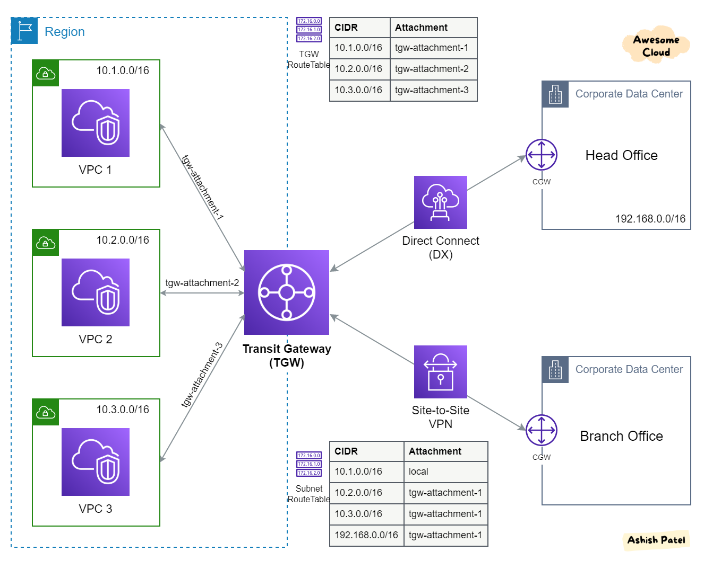

- **O AWS Transit Gateway** conecta VPCs e suas redes locais por meio de um **hub central**. Isso simplifica a rede e elimina os complexos relacionamentos de emparelhamento. Ele atua como um roteador de nuvem e cada nova conexão só é feita uma vez.

#### Diagrama: Transit Gateway - Hub and Spoke

**Comparação: VPC Peering vs Transit Gateway**

| Aspecto | VPC Peering | Transit Gateway |
|---------|-------------|-----------------|
| **Transitividade** | ❌ Não | ✅ Sim |
| **Escala** | Limitado (125 peerings) | Milhares de VPCs |
| **Custo** | Só transferência de dados | Por attachment + dados |
| **Complexidade** | Full mesh necessário | Hub and spoke simples |
| **On-premises** | Via cada VPC | Conexão centralizada |
- Permite instâncias na VPC acesse a NAT Gateway, NLBs, PrivateLink, e EFS e outras VPC conectadas ao **AWS Transit Gateway**.
- Permite usar o **Direct Conect ao premises ou VPN.**
- Transit Gateway é um recurso **regional e pode conectar milhares de VPCs na mesma região da AWS.**
- Pode ser compartilhado com outras contas da AWS usando **RAM**.
- Permite restringir quais VPC tem acesso a quais VPC usado Route Tables.
- Suporta **IP Multicast** (Não suportado por nenhum outro serviço da AWS.)
- **Casos de Uso**
  - Para implementar a topologia **Hub e Spoke (star).**
  - Para conectar vários Amazon VPCs entre regiões (usando **peering do Transit Gateway**).
  - Forneça aplicativos em todo o mundo - **o Transit Gateway** ajuda a criar aplicativos que abrangem milhares de Amazon VPCs. Tudo é mais fácil de implantar, gerenciar e solucionar problemas.
- **Limitações**
  - Você pode se conectar a no máximo três **Transit Gateways** em uma única Conexão **Direct Connect** para conectividade híbrida.
  - **O Transit Gateway** não oferece suporte ao roteamento entre VPCs com CIDRs sobrepostos.
- **Transit Gateway Attachments**:
  - **VPC Attachment**: Conecta uma VPC ao TGW (uma subnet por AZ)
  - **VPN Attachment**: Conecta Site-to-Site VPN ao TGW
  - **Direct Connect Gateway Attachment**: Conecta DX ao TGW
  - **Peering Attachment**: Conecta outro TGW (mesmo ou diferente região)
  - **Connect Attachment**: Para SD-WAN e appliances de terceiros (usa GRE)
- **Bandwidth**: 50 Gbps por VPC attachment, throughput agregado pode ser maior.
- **Inter e Intra Region Peering**
  - Dentro de uma região é possivel ter dois **TGW** ( Transit Gateway) com finalidades diferentes e conecta-los usando i**ntra-Region Peering Mesh.**
  - Mas caso queira conectar a outra região com um estrutura semelhante seria necessário criar um novo TGW e realizar o inter-Region Peeering Mesh.
    

:::tip Dica para a prova

📌 Transit Gateway é transitive?
✅ Sim!

📌 É possível compartilhar TGW com outras contas?
✅ Sim, via AWS RAM

📌 Quantas VPCs posso conectar a um TGW?
✅ Milhares

:::

---

### VPC Sharing (AWS RAM)

- Permite **compartilhar subnets** de uma VPC com outras contas AWS na mesma organização.
- A conta **owner** gerencia a VPC, subnets, route tables, gateways e NACLs.
- Contas **participantes** podem criar recursos nas subnets compartilhadas (EC2, RDS, Lambda, etc).
- Cada conta gerencia seus próprios recursos e **Security Groups**.
- **Benefícios**: Reduz número de VPCs, centraliza gerenciamento, reduz custos com VPC Peering.
- **Limitação**: Não é possível compartilhar a VPC default.

:::tip Dica para a prova

📌 Qual serviço permite compartilhar subnets entre contas?
✅ **AWS RAM (Resource Access Manager)**

📌 Quem gerencia os Security Groups em VPC compartilhada?
✅ **Cada conta participante gerencia seus próprios SGs**

:::

---

### Gateway Load Balancer (GWLB)

- Usado para **deploy de appliances virtuais de terceiros** (firewalls, IDS/IPS, deep packet inspection).
- Opera na **camada 3** (Network Layer) - usa protocolo **GENEVE na porta 6081**.
- Combina **Transparent Network Gateway + Load Balancer**.
- Permite **inspeção de tráfego** antes de chegar ao destino.
- Integra com **Transit Gateway** e **VPC Endpoints (GWLBe)**.
- **Caso de uso comum**: Todo tráfego passa pelo GWLB → appliances de segurança → destino.

#### Diagrama: Gateway Load Balancer - Inspeção de Tráfego

```mermaid
graph TB
    subgraph APP_VPC["VPC Aplicação"]
        IGW["🌐 Internet Gateway"]
        GWLBe["🔌 GWLB Endpoint<br/>(GWLBe)"]
        subgraph APP_SUBNET["Subnet Aplicação"]
            APP["🖥️ App Server"]
        end
    end

    subgraph SEC_VPC["VPC Segurança"]
        GWLB["⚖️ Gateway Load Balancer<br/>━━━━━━━━━━━━━━<br/>Protocolo: GENEVE<br/>Porta: 6081"]
        subgraph APPLIANCES["Appliances de Segurança"]
            FW1["🛡️ Firewall 1"]
            FW2["🛡️ Firewall 2"]
            IDS["🔍 IDS/IPS"]
        end
    end

    INTERNET["☁️ Internet"] -->|"1️⃣ Request"| IGW
    IGW -->|"2️⃣ Route Table"| GWLBe
    GWLBe <-->|"3️⃣ GENEVE Tunnel"| GWLB
    GWLB --> FW1
    GWLB --> FW2
    GWLB --> IDS
    FW1 -->|"4️⃣ Inspecionado"| GWLB
    GWLB -->|"5️⃣"| GWLBe
    GWLBe -->|"6️⃣"| APP

    style GWLB fill:#ff9900,color:#fff
    style GWLBe fill:#FF6B6B,color:#fff
    style FW1 fill:#4CAF50,color:#fff
    style FW2 fill:#4CAF50,color:#fff
    style IDS fill:#2196F3,color:#fff
```

:::tip Dica para a prova

📌 Qual LB usar para appliances de segurança de terceiros?
✅ **Gateway Load Balancer**

📌 Em qual camada o GWLB opera?
✅ **Camada 3 (Network Layer)**

📌 Qual protocolo o GWLB usa?
✅ **GENEVE na porta 6081**

:::

---

## Conectividade Híbrida

### Virtual Private Gateway

- Permite ligar uma rede on-primise a AWS via VPN, para isso é necessario configurar um **Virtual** **Customer Gateway** do lado do on-primese e do lado da AWS cria se uma **Virtual Private Gateway**.

#### Diagrama: Site-to-Site VPN

```mermaid
graph LR
    subgraph ON_PREM["🏢 On-Premises"]
        ROUTER["🔧 Router/Firewall"]
        CGW["📡 Customer Gateway<br/>IP Público"]
        SERVERS["🖥️ Servidores<br/>192.168.0.0/16"]
    end

    subgraph AWS["☁️ AWS"]
        VGW["🚪 Virtual Private Gateway<br/>(VGW)"]
        subgraph VPC["VPC 10.0.0.0/16"]
            EC2["🖥️ EC2 Instances"]
            RDS["🗄️ RDS"]
        end
    end

    SERVERS --> ROUTER
    ROUTER --> CGW
    CGW <-->|"🔐 IPSec Tunnel 1<br/>━━━━━━━━━━"| VGW
    CGW <-->|"🔐 IPSec Tunnel 2<br/>━━━━━━━━━━"| VGW
    VGW --> EC2
    VGW --> RDS

    style CGW fill:#FF6B6B,color:#fff
    style VGW fill:#ff9900,color:#fff
    style VPC fill:#E8F5E9,color:#000
```

> **2 túneis IPSec** são criados automaticamente para alta disponibilidade

---

### AWS VPN

- Permite conectar o **on-premises a AWS** via internet publica, com segurança.
- AWS Recomenda a criação de uma **VPN diferente para cada VPC.** porém isso pode ser complicado, por isso é recomendado o uso de **DX (Direct Conect).**
- para se criar precisa:
  - Do lado on-premises:
    - Disponibilizar um estrutura com com IP publico.
    - Criar um **Customer Gateway (CGW)**
  - Do lado da AWS
    - Configurar um **Virtual Private Gateway** e atachar a VPC
    - Conectar a**o Customer Gateway ao Virtual Private Gateway (VGW)**
- Para alta disponibilidade se recomenda a existência no mínimos duas VPN configuradas.
- Pode se usar o **Global Acelerator** para melhorar a velocidade.
  
- Configuração da tabela de rotas
  - **Static Routing** - Insere manualmente as rotas em cada uma das tabelas de rotas.
  - **Dynamic Routing** - Usa se o protocolo **BGP** para realizar a configuração da tabela de rotas automaticamente compartilhando os IP Entre as tabelas de rotas.
    - Necessário especificar um **ASN** para cada **Gateway criado**
- **Link Aggregation Group**
  - O **LAG no AWS Direct Connect** permite que você agregue várias conexões de rede físicas em uma única conexão lógica de alta capacidade. Isso pode ajudar a aumentar a largura de banda, melhorar a redundância e simplificar a configuração da rede. Com o **LAG**, você pode criar um único link de conexão lógica que pode fornecer uma largura de banda de até 10 Gbps.
  - Além disso, o **LAG** pode ser usado para criar conexões redundantes para garantir a alta disponibilidade da sua rede. Se uma das conexões físicas falhar, o tráfego pode ser automaticamente roteado para outra conexão sem interrupções de serviço.
  - 
- Acessando a Internet **via cloud do on-premises**
  - **Nat Gateway** - não funciona pois ele não pode ser acessado de origem vinda de DX, VPN ou Peering.
    
    
    **Client VPN** - Permite configurar uma VPN para que os **usuários possam conectar via por exemplo (OpenVPN)**

#### CloudHub

- Permite conectar mais de **10 Customer Gateway a cada Virtual Private Gateway.**
  

---

### Site-to-Site VPN com Accelerated VPN

- Usa **AWS Global Accelerator** para rotear tráfego VPN pela rede global da AWS.
- Reduz latência e melhora performance.
- Tráfego entra na edge location mais próxima e viaja pela backbone da AWS.
- **Custo adicional** pelo uso do Global Accelerator.
- Configurado ao criar a VPN connection.

---

### ECMP (Equal-Cost Multi-Path)

- Estratégia de roteamento que permite distribuir tráfego por **múltiplos caminhos de igual custo**.
- Suportado com **Transit Gateway** e múltiplas conexões VPN.
- Permite **aumentar throughput** agregando bandwidth de múltiplas VPNs.
- Cada conexão Site-to-Site VPN tem 2 túneis (para HA).
- Com ECMP habilitado no TGW, pode usar ambos os túneis ativamente.

:::tip Dica para a prova

📌 Como aumentar throughput de VPN com Transit Gateway?
✅ **ECMP com múltiplas conexões VPN**

📌 Quantos túneis uma Site-to-Site VPN tem?
✅ **2 túneis** (para alta disponibilidade)

:::

---

### AWS Direct Connect

- C**onexão dedicada, fibra** que vai do seu **datacenter** até a AWS.
- Demora cerca de **1 Mês** para ser implementado toda a infraestrutura.
- Por padrão os dados em transito não são criptografados, pois já se esta numa rede privada, mas caso queira pode se usar **um solução de IPSec com VPN.**
- O **Direct Connect (DX)** é um recurso que permite a conexão dedicada (vai de fibra até o datacenter) e direta com a AWS, fora da infraestrutura da Internet.
- Exemplo de uso, o Itaú deseja ter a melhor conexão possível entre seus datacenter e a AWS, ele contrata um **DX que vai ligar uma fibra do datacenter do Itaú até a AWS (Um parceiro).**
- Caso se queira conectar mais de uma região deve se usar um **Direct Conect Gateway**
  
- Alta disponibilidade
  
- Direct Connect Gateway - Site Link
  
- Tipos de DX
  
- **Dedicated Connection**: Conexão física exclusiva (1 Gbps, 10 Gbps, 100 Gbps). Solicita via console AWS, instalada por parceiro.
- **Hosted Connection**: Capacidade provisionada por parceiro AWS (50 Mbps até 10 Gbps). Mais rápido para provisionar, capacidade pode ser adicionada/removida on-demand.
- **Lead Time**: Dedicated leva semanas/meses; Hosted pode ser mais rápido.

:::tip Dica para a prova

📌 Qual a principal vantagem do Direct Connect?
✅ Conexão dedicada, **baixa latência e alta largura de banda**

📌 O que é necessário para usar VPN com a AWS?
✅ **Virtual Private Gateway (AWS)** + **Customer Gateway (on-premises)**

📌 Como garantir alta disponibilidade?
✅ **Duas VPNs** + roteamento dinâmico com BGP

📌 Como conectar várias regiões com Direct Connect?
✅ **DX Gateway**

:::

#### Virtual Interface VIF

- **Public VIF** - Permite conectar serviços publicos da AWS (S3, EC2).
- **Private VIF** - Permite conectar aos recursos na sua VPC (EC2, ALB).
- **Transit Virtual Interface** - Conecta aos recursos usando um TGW (Transit Gateway).
- Endpoints privados não precisam de interfaces (Private VIF) para conexão, pois podem ser acessados diretamente.

```mermaid
graph LR
    subgraph ON_PREM["🏢 On-Premises"]
        ROUTER["🔧 Router"]
    end

    subgraph DX["⚡ Direct Connect"]
        DX_LOC["📍 DX Location"]
    end

    subgraph AWS["☁️ AWS"]
        subgraph VIFs["Virtual Interfaces"]
            PUB_VIF["🌐 Public VIF<br/>━━━━━━━━━━<br/>S3, DynamoDB<br/>Serviços Públicos"]
            PRIV_VIF["🔒 Private VIF<br/>━━━━━━━━━━<br/>VPC Resources<br/>(EC2, RDS, ALB)"]
            TRANSIT_VIF["🔀 Transit VIF<br/>━━━━━━━━━━<br/>Transit Gateway<br/>Múltiplas VPCs"]
        end

        S3["🗄️ S3"]
        VPC["🏠 VPC"]
        TGW["🔀 TGW"]
    end

    ROUTER --> DX_LOC
    DX_LOC --> PUB_VIF
    DX_LOC --> PRIV_VIF
    DX_LOC --> TRANSIT_VIF

    PUB_VIF --> S3
    PRIV_VIF --> VPC
    TRANSIT_VIF --> TGW

    style PUB_VIF fill:#4CAF50,color:#fff
    style PRIV_VIF fill:#2196F3,color:#fff
    style TRANSIT_VIF fill:#ff9900,color:#fff
```

---

### Direct Connect - Modelos de Resiliência

- **Maximum Resiliency**: Conexões separadas terminando em dispositivos separados em mais de um local.
- **High Resiliency**: Múltiplas conexões terminando em mais de um local.
- **Development and Test**: Conexão única (sem redundância).
- Para **SLA de 99.99%**, AWS recomenda **Maximum Resiliency**.
- **Backup com VPN**: Usar Site-to-Site VPN como failover para DX.

:::tip Dica para a prova

📌 Qual modelo de DX para máxima disponibilidade?
✅ **Maximum Resiliency** (múltiplas conexões em múltiplos locais)

📌 Como fazer backup do Direct Connect?
✅ **Site-to-Site VPN como failover**

:::

---

### Route 53 Resolver

- **Resolver Endpoints** permitem resolução DNS híbrida entre on-premises e AWS.
- **Inbound Endpoint**: Permite on-premises resolver nomes de recursos AWS (DNS queries entram na VPC).
- **Outbound Endpoint**: Permite VPC resolver nomes on-premises (DNS queries saem da VPC).
- **Resolver Rules**: Define para quais domínios encaminhar queries.
- Usa ENIs em subnets da VPC.

#### Diagrama: DNS Híbrido com Route 53 Resolver

```mermaid
graph TB
    subgraph ON_PREM["🏢 On-Premises"]
        DNS_ONPREM["🌐 DNS Server<br/>corp.local"]
        SERVERS["🖥️ Servidores"]
    end

    subgraph AWS["☁️ AWS"]
        subgraph VPC["VPC"]
            R53["🔷 Route 53 Resolver<br/>.2 do CIDR"]

            subgraph INBOUND["Inbound Endpoint"]
                ENI_IN["🔌 ENI<br/>10.0.1.10"]
            end

            subgraph OUTBOUND["Outbound Endpoint"]
                ENI_OUT["🔌 ENI<br/>10.0.2.10"]
            end

            EC2["🖥️ EC2"]
            RULES["📋 Resolver Rules<br/>corp.local → On-Prem DNS"]
        end

        R53_PUB["🌍 Route 53<br/>Hosted Zones"]
    end

    SERVERS -->|"1️⃣ Resolve: app.aws.internal"| DNS_ONPREM
    DNS_ONPREM -->|"2️⃣ Forward"| ENI_IN
    ENI_IN -->|"3️⃣"| R53
    R53 -->|"4️⃣ Response"| ENI_IN

    EC2 -->|"1️⃣ Resolve: db.corp.local"| R53
    R53 -->|"2️⃣ Check Rules"| RULES
    RULES -->|"3️⃣"| ENI_OUT
    ENI_OUT -->|"4️⃣ Forward"| DNS_ONPREM

    style ENI_IN fill:#4CAF50,color:#fff
    style ENI_OUT fill:#FF9800,color:#fff
    style R53 fill:#2196F3,color:#fff
```

| Endpoint | Direção | Uso |
|----------|---------|-----|
| **Inbound** | On-prem → AWS | Resolver nomes AWS do on-premises |
| **Outbound** | AWS → On-prem | Resolver nomes on-premises da AWS |

:::tip Dica para a prova

📌 Como resolver DNS do on-premises para a AWS?
✅ **Route 53 Resolver Inbound Endpoint**

📌 Como resolver DNS da AWS para on-premises?
✅ **Route 53 Resolver Outbound Endpoint**

📌 Quantas ENIs um Resolver Endpoint usa por AZ?
✅ **1 ENI por AZ (mínimo 2 AZs recomendado)**

:::

---

## Referência & Comparativos

### AWS Cloud WAN

- Serviço para criar, gerenciar e monitorar **redes globais unificadas**.
- Conecta VPCs, datacenters on-premises e filiais.
- Usa **Core Network** com políticas centralizadas.
- Suporta **segmentação** de rede para isolamento de tráfego.
- Alternativa gerenciada ao Transit Gateway para redes globais complexas.

---

### Custo de rede

---

### Comparativo de Conectividade Híbrida

| Serviço | Latência | Throughput | Custo | Tempo Setup |
|---------|----------|------------|-------|-------------|
| Site-to-Site VPN | Variável | Até 1.25 Gbps | Baixo | Minutos |
| Direct Connect | Baixa e consistente | 1-100 Gbps | Alto | Semanas/Mês |
| VPN over DX | Baixa | Até 1.25 Gbps | Médio | Semanas/Mês |
| Transit Gateway | Variável | 50 Gbps por attachment | Médio | Minutos |

#### Diagrama: Árvore de Decisão - Conectividade Híbrida

```mermaid
flowchart TD
    START["🤔 Precisa conectar<br/>On-Premises à AWS?"]

    START -->|Sim| Q1["⏱️ Precisa de setup<br/>rápido (minutos)?"]

    Q1 -->|Sim| VPN["🔐 Site-to-Site VPN<br/>━━━━━━━━━━━━━<br/>✅ Setup rápido<br/>✅ Criptografado<br/>❌ Latência variável"]

    Q1 -->|Não| Q2["📊 Precisa de alta<br/>banda (>1.25 Gbps)?"]

    Q2 -->|Sim| DX["⚡ Direct Connect<br/>━━━━━━━━━━━━━<br/>✅ 1-100 Gbps<br/>✅ Latência baixa<br/>❌ Semanas para setup"]

    Q2 -->|Não| Q3["🔒 Precisa de<br/>criptografia nativa?"]

    Q3 -->|Sim| VPN_DX["🔐 VPN over DX<br/>━━━━━━━━━━━━━<br/>✅ Criptografado<br/>✅ Latência baixa<br/>✅ Usa DX existente"]

    Q3 -->|Não| DX

    DX --> Q4["🔀 Conectar múltiplas<br/>VPCs?"]
    VPN --> Q4

    Q4 -->|Sim| TGW["🔀 Transit Gateway<br/>━━━━━━━━━━━━━<br/>✅ Hub central<br/>✅ Milhares de VPCs<br/>✅ Transitivo"]

    Q4 -->|Não| DONE["✅ Configuração<br/>Completa!"]

    TGW --> DONE

    style VPN fill:#4CAF50,color:#fff
    style DX fill:#ff9900,color:#fff
    style VPN_DX fill:#9C27B0,color:#fff
    style TGW fill:#2196F3,color:#fff
```

:::tip Resumo para a prova

📌 **Baixa latência + alta banda** → Direct Connect

📌 **Setup rápido + criptografia** → Site-to-Site VPN

📌 **Conectar muitas VPCs** → Transit Gateway

📌 **Backup para DX** → VPN como failover

📌 **Appliances de segurança** → Gateway Load Balancer

📌 **Compartilhar subnets entre contas** → VPC Sharing via RAM

📌 **Troubleshooting de conectividade** → Reachability Analyzer

📌 **DNS híbrido** → Route 53 Resolver Endpoints

:::

---

## Links e recursos adicionais

- [Documentação oficial AWS VPC](https://docs.aws.amazon.com/vpc/latest/userguide/what-is-amazon-vpc.html)
- [VPC Peering](https://docs.aws.amazon.com/vpc/latest/peering/what-is-vpc-peering.html)
- [AWS Transit Gateway](https://docs.aws.amazon.com/vpc/latest/tgw/what-is-transit-gateway.html)
- [VPC Endpoints](https://docs.aws.amazon.com/vpc/latest/userguide/vpc-endpoints.html)
- [AWS Network Firewall](https://docs.aws.amazon.com/network-firewall/latest/developerguide/what-is-aws-network-firewall.html)
- [Guia de estudo para certificação AWS](https://aws.amazon.com/certification/certified-solutions-architect-professional/)
