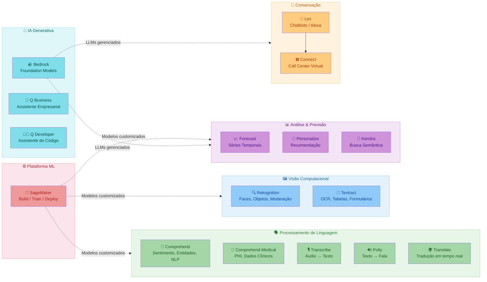

## 🤖 Machine Learning

> A AWS oferece uma gama de serviços de Machine Learning gerenciados e pré-treinados. Muitos deles são voltados a NLP, visão computacional, previsão, recomendação e análise. 🌐

---

:::tip 🤖 Dica de Prova
Machine Learning na AWS é cobrado em **cenários práticos**! Foque nos serviços gerenciados, suas **integrações**, e **casos de uso reais**.  
:::

---

### 🖼️ Rekognition (reconhecimento)

- Detecta **pessoas, objetos, textos e cenas** em imagens e vídeos.
- Reconhecimento facial para **verificação de identidade** e contagem de pessoas.
- Banco de faces **customizado ou celebridades**.
- Casos de uso:
  - **Moderação de conteúdo**
  - Detecção de texto
  - Análise de rostos (emoções, idade, gênero)
  - Reconhecimento de celebridades
  - Análise de movimentação em esportes
- Integra com **Augmented AI (A2I)** para validação humana dos resultados

:::tip Dica de Prova

📌 Qual serviço AWS permite identificar objetos e rostos em imagens e vídeos?  
✅ **Rekognition**

📌 Como validar automaticamente (ou com humanos) o resultado do ML?  
✅ **Augmented AI (A2I)**

📌 Qual serviço pode detectar expressões faciais como raiva ou felicidade?  
✅ **Rekognition**

:::

---

### 🗣️ Transcribe

- Converte **áudio em texto** com ASR (Automatic Speech Recognition).
- Detecta automaticamente idioma e suporta múltiplas línguas.
- Possui recurso de **Redaction** para ocultar **PIIs (dados sensíveis)**.
- Útil para criar legendas, transcrever chamadas, etc.

:::tip Dica de Prova

📌 Qual serviço converte chamadas de áudio em texto?  
✅ **Transcribe**

📌 Como proteger PII em transcrição automática?  
✅ Com a função **PII Redaction**

:::

---

### 🗨️ Polly

- Converte **texto em fala** (TTS - Text to Speech).
- Cria apps que "falam" com vozes realistas.
- Suporta **Lexicons** e **SSML**:
  - Lexicon: Define pronúncia customizada
  - SSML: Dá entonação, pausas, ênfases e sussurros

:::tip Dica de Prova

📌 Como personalizar a pronúncia de palavras faladas?  
✅ Usando **Lexicons**

📌 Como aplicar entonação, pausas e ênfases em texto para voz?  
✅ **SSML (Speech Synthesis Markup Language)**

:::

---

### 🌍 Translate

- Tradução automática de textos em tempo real.
- Escalável para **altos volumes**, com foco em **localização de conteúdo**.

:::tip Dica de Prova

📌 Como traduzir textos automaticamente em diferentes idiomas?  
✅ **Translate**

:::

---

### 💬 Lex + ☎️ Connect

- **Lex**:
  - Criação de **chatbots** com ASR e NLU (Natural Language Understanding).
  - Mesma tecnologia da **Alexa**.
- **Connect**:
  - Solução de **central de atendimento virtual (Call Center)**.
  - Integra com **CRM e Lex**, permite URA e automação.

:::tip Dica de Prova

📌 Qual serviço cria um contact center com bots integrados?  
✅ **Amazon Connect**

📌 Qual serviço permite criar chatbots com linguagem natural?  
✅ **Lex**

:::

---

### 📖 Comprehend

- Serviço de **NLP (Natural Language Processing)** gerenciado.
- Entende **sentimento**, extrai **entidades (pessoas, locais, eventos)** e detecta idioma.
- Permite **agrupamento de temas** e análise de tópicos.

:::tip Dica de Prova

📌 Como identificar se um texto tem tom positivo ou negativo?  
✅ **Comprehend**

📌 Como identificar entidades (nomes, locais, marcas) em um texto?  
✅ **Comprehend**

:::

---

### 🏥 Comprehend Medical

- Foco em NLP para dados médicos.
- Extrai **PHI (Protected Health Information)** de documentos clínicos.
- Pode ler receitas e anotações médicas e **transformar em dados estruturados**.

:::tip Dica de Prova

📌 Qual serviço analisa documentos médicos e extrai PHI?  
✅ **Comprehend Medical**

:::

---

### 🧪 SageMaker

- Serviço completo para **criar, treinar, implantar e monitorar modelos de ML.**
- Inclui IDE (Studio), Notebooks, AutoML, Pipelines, MLOps.
- Suporte a modelos próprios ou pré-treinados.

:::tip Dica de Prova

📌 Qual serviço permite construir, treinar e implantar modelos ML customizados?  
✅ **SageMaker**

:::

---

### 📈 Forecast

- Gera **previsões baseadas em séries temporais**.
- Ex: previsão de **vendas, demanda, finanças**.
- Usa mesmo mecanismo do Amazon.com.
- Reduz tempo de previsão de **meses para horas**.

:::tip Dica de Prova

📌 Qual serviço AWS realiza previsão de demanda com ML?  
✅ **Forecast**

:::

---

### 🔍 Kendra

- Motor de **busca semântica** em documentos com ML.
- Suporte a PDF, Word, PowerPoint, HTML, FAQs, etc.
- Usa linguagem natural para busca.

:::tip Dica de Prova

📌 Qual serviço AWS permite busca inteligente em documentos?  
✅ **Kendra**

:::

---

### 🧠 Personalize

- Criação de sistemas de **recomendação em tempo real.**
- Usa histórico de usuário para recomendar produtos, conteúdos, etc.
- Exemplo: Email marketing direcionado, re/ranking de produtos.

:::tip Dica de Prova

📌 Qual serviço AWS cria recomendações personalizadas?  
✅ **Personalize**

:::

---

### 📝 Textract

- Extrai texto de **documentos escaneados, tabelas, PDFs** ou manuscritos.
- Gera **dados estruturados** a partir de documentos.

:::tip Dica de Prova

📌 Qual serviço extrai texto, tabelas e formulários de PDFs?  
✅ **Textract**

:::

---

### 🪨 Amazon Bedrock

- Serviço gerenciado para acesso a **Foundation Models (LLMs)** de diversos provedores (Anthropic, Meta, Mistral, Cohere, Amazon Nova, etc.).
- Permite usar modelos via API **sem gerenciar infraestrutura**.
- Suporta **fine-tuning**, **RAG (Retrieval Augmented Generation)** e **Agents** para automação de tarefas.
- **Guardrails**: define políticas de segurança e filtragem de conteúdo nos modelos.
- **Knowledge Bases**: conecta modelos a fontes de dados (S3, bancos de dados) para respostas contextuais.

:::tip Dica de Prova

📌 Qual serviço permite acessar LLMs de múltiplos provedores de forma gerenciada?
✅ **Bedrock**

📌 Como adicionar dados corporativos como contexto para um LLM?
✅ **Bedrock Knowledge Bases (RAG)**

:::

---

### 💼 Amazon Q Business

- Assistente de IA generativa voltado para **uso empresarial**.
- Conecta-se a fontes de dados corporativas (S3, SharePoint, Confluence, Slack, etc.).
- Responde perguntas, resume documentos e gera conteúdo com base nos **dados internos da empresa**.
- Possui controle de acesso via **IAM Identity Center**.

---

### 👨‍💻 Amazon Q Developer

- Assistente de IA para **desenvolvedores** integrado a IDEs e console AWS.
- Gera código, sugere correções, explica código e auxilia em **troubleshooting** de recursos AWS.
- Pode analisar e transformar código legado (ex: Java 8 → Java 17).

---

### 🌟 Amazon Nova

- Família de **modelos fundacionais da própria AWS**, disponíveis via Bedrock.
- Variantes: **Nova Micro** (texto, baixo custo), **Nova Lite** (multimodal rápido), **Nova Pro** (equilíbrio custo/performance), **Nova Premier** (tarefas complexas).
- Modelos de mídia: **Nova Canvas** (geração de imagens) e **Nova Reel** (geração de vídeos).

---

## Links e recursos adicionais 🔗

- [Documentação oficial AWS Machine Learning](https://aws.amazon.com/pt/machine-learning/)
- [AWS SageMaker](https://docs.aws.amazon.com/sagemaker/latest/dg/whatis.html)
- [AWS Rekognition](https://docs.aws.amazon.com/rekognition/latest/dg/what-is.html)
- [AWS Comprehend](https://docs.aws.amazon.com/comprehend/latest/dg/what-is.html)
- [AWS Textract](https://docs.aws.amazon.com/textract/latest/dg/what-is.html)
- [Amazon Bedrock](https://aws.amazon.com/bedrock/)
- [Amazon Q](https://aws.amazon.com/q/)
- [Guia de estudo para certificação AWS](https://aws.amazon.com/certification/certified-solutions-architect-professional/)
