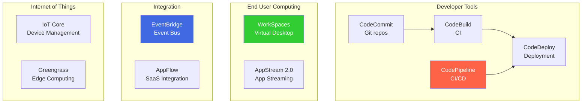

# Outros Serviços 🔧

Esta seção cobre uma variedade de serviços úteis e recorrentes na prova de certificação **AWS Certified Solutions Architect – Professional (SAP-C02)**. São ferramentas diversas que complementam arquiteturas e operações na nuvem. 🧠☁️

---

## 🔄 Code Suite (CI/CD)

### CodeCommit

- Serviço gerenciado de repositório **Git**.
- Suporte a múltiplos branches.
- Integra com IAM e CodePipeline.

:::tip Dica de Prova
📌 Qual serviço da AWS permite gerenciar repositórios Git privados?  
✅ **CodeCommit**
:::

### CodeBuild

- Constrói e testa código em ambiente isolado.
- Pague por uso (sob demanda).
- Suporte a múltiplas fases de build.

### CodeDeploy

- Deploy automático em **EC2, Lambda ou ECS**.
- Suporta **Blue/Green** e **Canary deploys**.
- Pode integrar com pipeline ou funcionar isolado.

### CodePipeline

- Orquestração de pipelines CI/CD.
- Integra com CodeCommit, S3, GitHub, etc.
- Atualizações contínuas de software.

---

## 🔍 CloudSearch

- Busca de texto completo gerenciada pela AWS.
- Ideal para sistemas com grande volume de conteúdo textual.
- Suporte a filtros, ranking e autocomplete.

---

## 🤖 CodeGuru

- Usa Machine Learning para revisar código e analisar performance.
- Duas funcionalidades:
  - **Reviewer**: análise estática de código.
  - **Profiler**: análise de desempenho em execução.

:::tip Dica de Prova
📌 Qual serviço AWS analisa o desempenho do código em produção?  
✅ **CodeGuru Profiler**
:::

---

## 🎙️ Alexa for Business, Lex e Connect

### Alexa for Business

- Integração com Alexa para automação de salas e produtividade.

### Lex

- Reconhecimento de voz com compreensão de linguagem natural.
- Permite criar **chatbots e interfaces de voz**.
- Base usada na **Alexa**.

### Connect

- Central de atendimento na nuvem.
- Suporte a URA, gravação, transferência, etc.

:::tip Dica de Prova
📌 Qual serviço cria um chatbot com reconhecimento de fala integrado a centrais de atendimento?  
✅ **Amazon Lex + Amazon Connect**
:::

---

## 📹 Kinesis Video Streams

- Permite envio de stream de vídeo por dispositivo.
- Suporte a dispositivos como **câmeras de segurança, celulares, etc.**
- Integra com **EC2, Rekognition e Lambda**.
- Vídeos são armazenados indiretamente no **S3**.

---

## 🖥️ WorkSpaces

- Ambiente de trabalho gerenciado (VDI).
- Suporte a Windows/Linux.
- Pague por hora ou mensal.
- Suporte a **IP Access Control Groups** e **Microsoft AD**.

---

## 📺 AppStream 2.0

- Transmissão de **aplicações desktop via navegador**.
- Ideal para apps pesados e ambientes centralizados.

---

## 📱 Device Farm

- Testa apps móveis e web em dispositivos reais.
- Geração de relatórios e suporte a testes paralelos.
- Excelente para validar apps em múltiplas plataformas sem infraestrutura.

---

## 🕵️ Amazon Macie

- Detecta **dados sensíveis (PII)** automaticamente com ML.
- Analisa buckets S3.
- Totalmente serverless.
- Integra com EventBridge para automações via **SNS**, **SQS**, **Lambda**.

---

## ✉️ SES (Simple Email Service)

- Envio de **emails transacionais e marketing em larga escala**.
- Suporte a SMTP, API, DKIM e SPF.
- Com Event Destinations e IP Pool Management.

---

## 📦 EC2 Image Builder

- Cria, atualiza e versiona **AMIs e container images**.
- Integra com **Systems Manager**, **S3**, e outros.
- Automatiza processos de segurança e updates.

---

## 📶 IoT Core

- Conecta e gerencia dispositivos **IoT**.
- Suporte a **MQTT**, **HTTPS**.
- Integra com Lambda, S3, DynamoDB, etc.

---

## ⚙️ Outros Serviços Importantes

| Serviço                | Descrição |
|------------------------|-----------|
| **Data Exchange**      | Compartilhamento de dados entre produtores e consumidores. |
| **Data Pipeline**      | Move e transforma dados entre serviços. |
| **Lake Formation**     | Criação segura de data lakes no S3. |
| **AppFlow**            | Integra SaaS com AWS (Salesforce, Slack, etc). |
| **Managed Blockchain** | Blockchain como serviço (Hyperledger/Ethereum). |
| **App Runner**         | Deploy automático de código ou containers. |
| **Lightsail**          | VPS simples para aplicações leves. |
| **Wavelength**         | Reduz latência com 5G para apps móveis. |
| **EKS Distro**         | Versão open-source usada pelo Amazon EKS. |
| **EKS Anywhere**       | Executa clusters EKS on-premises. |
| **Keyspaces**          | Banco de dados gerenciado compatível com Cassandra. |
| **Cloud9**             | IDE colaborativa baseada em navegador. |
| **CodeArtifact**       | Repositório de pacotes e dependências. |
| **CodeStar**           | Lança projetos com integração CI/CD. |
| **Amplify**            | Fullstack para apps web/mobile. |
| **Pinpoint**           | Comunicação por push, SMS, email, etc. |

---

## 🌐 IoT Services Adicionais

- **IoT Analytics**: análise de dados IoT.
- **IoT Device Defender**: segurança e auditoria.
- **IoT Device Management**: organização e updates.
- **IoT Events**: detecção de eventos complexos.
- **IoT Greengrass**: executa funções localmente.
- **IoT SiteWise**: coleta de dados industriais.
- **IoT Things Graph**: modelagem visual de fluxos IoT.
- **IoT 1-Click**: botão físico que dispara ações na AWS.

---

## 🎞️ Serviços de Mídia

- **Elastic Transcoder**: conversão de vídeos.
- **Kinesis Video Streams**: stream de vídeo com análise.

---

## 🔗 Links Úteis

- [Documentação oficial AWS](https://aws.amazon.com/documentation/)
- [Guia de estudo SAP-C02](https://aws.amazon.com/certification/certified-solutions-architect-professional/)
