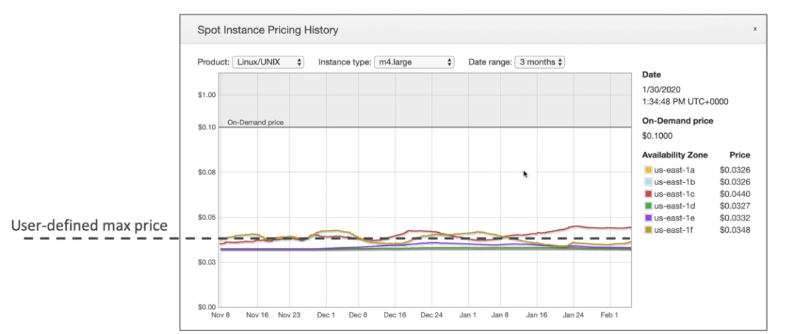

Corrija os erros de português, adicione linhas com explicações caso acho necessário para tornar os itens mais fáceis de entender e:
- respeite comece os cabeçarios do markdown a partir do nível 2 (##) 
- Adicione notas de temas que questões que podem cair na prova de certificação se achar necessário
  - estou usando o docusarus então use as admonitions para isso
  :::note
Some **content** with _Markdown_ `syntax`. Check [this `api`](#).
:::

:::tip
Some **content** with _Markdown_ `syntax`. Check [this `api`](#).
:::

:::info
Some **content** with _Markdown_ `syntax`. Check [this `api`](#).
:::

:::warning
Some **content** with _Markdown_ `syntax`. Check [this `api`](#).
:::

:::danger
Some **content** with _Markdown_ `syntax`. Check [this `api`](#).
::: 

- retorne no formato markdown, use > ao invés de ### or ####
Faça isso para a documentação abaixo:

### EC2

- Elastic Compute cloud.
- Maquinas nas nuvem que são possível usar sob demanda.
- O Armazenamento e feito com:
  - **Network-attached:**
    - EBS (Elastic block storage)
  - **hardware** (EC2 Instance Store)
- Tem que ter uma rede conectada.
- Tem que um firewall (**Security group**).
- Quando parado os dados de memórias são perdidos e os dados no volume **EBS** e mantido até a próxima inicialização
- Caso queira manter os dados de memória salvo quando para use a opção de **Hibernate** (hibernar), que mantém em memória os dados.
- Quando destruído a instância os dados de memória e do **EBS** principal são destruídos, mas é possível adicionar um segundo EBS ou marcar para preservar o default.
- **EC2 Nitro** - nova tecnologia de virtualização adotada pela AWS.
  - Melhora o uso da rede.
  - Melhora o **IOPS** (Input/output operations per second) dos armazenamento **EBS**.
- **EC2 Graviton**
  
  - Entregam o melhor performance em relação ao custo. Sendo 46 % mais em contas em comparação com a 5 geração.
  - Suporta muitos OS (Linux, AML 2)
  - Não disponível para Windows.
- **EC2 vCPU**
  - Uma CPU, seria um core de um processador, pode conter várias threads.
  - Uma vCPU seria cada uma dessas threads.
  - É possível especificar qual a configuração de vCPU você precisa, por exemplo para uma aplicação node que é single thead pode se definir 1 vCPU.
- **Placement Groups** - Grupos de Posicionamento
  - Permite decide a estratégia posicionamento das instâncias EC2. ou seja onde vai ficar as instâncias de vai ser:
    - **Cluster** - Todas ais instâncias ficam juntas, tem baixa latência, mas ficam numa única AZ. (alta performance, mas tem um alto risco).
      - Boa escolha quando se tem instâncias com rede otimizada (enhanced Networking).
      - Usados para jobs de processamento rápido de BigData e aplicação que precisam de baixa latência de rede
    - **Spread** - (espalhadas) As instâncias ficar espalhadas em servidores em diferentes AZ, com no máximo de 7 instâncias por grupo por AZ. Usados em aplicações criticas.
      - Baixo risco que indisponibilidade.
    - **Partition** - Similar ao **Spread**, mas as instâncias ficam espalhadas em diferentes partições (conjunto de Racks) numa AZ. Pode escalar para centenas de instâncias por grupo, usadas com o Hadoop, Kafka, Cassandra.
      - Pode ter até 7 partição por AZ, e centenas de instâncias.
      - As partições não compartilham o mesmo hack.
      - Se a partição falhar todas as maquinas são perdidas.
      - As instâncias podem compartilhar dados da partição vias EC2 Metadata.
        
- É possível mover uma instância de um placement group. Para isso é necessário:
  - **Parar a instância e usando o CLI mudar ela de placement group e depois inicia-la novamente.**
- **Metricas**
  
- Instance recovery
  - O **CloudWatch** monitora a instância, caso a instância e problema é possível recupera-la usando uma alarme, criando uma nova com o mesmo IP na mesma rede, com os mesmos metadados e o mesmo **placement group**.
  - Além disso é possível alerta vias **SNS** a equipe.

---

#### Tipos de instâncias

- Veja [tipos de instâncias](https://aws.amazon.com/pt/ec2/instance-types/)
- Veja [informações extras sobre instâncias](https://instances.vantage.sh/)

 

- Nomenclatura dos tipos de instâncias:

  - exemplo: m5.2xlarge

    - m -> classe da instância.
    - 5 -> geração das maquinas.
    - 2xlarge -> Tamanho das instâncias

    

---

#### Precificação

- Todas são pagas por **horas** ativas.
- **on-demand**
  - Não necessário contrato, só rodar quando necessário.
  - Recomendado para cargas de trabalho curtas, (dura 3 meses, ou 1 mês).
- **reserved Instances**
  - Se faz um contrato de **1 a 3 anos,** se reduz o custo em até **75%.**
  - Recomendado para **longas cargas de trabalho**, exemplo banco de dados.
  - Pode ser compartilhado entre as contas de uma organização.
  - **Tipos de reservas**
    - **reserved instances** - onde se reserva um instância de um determinado tipo.
    - **convertible reserved instance** - onde se reserva um instância e é possível alterar o tipo depois, e pode ter até **54% de desconto**.
    - **scheduled reserved instance** - exemplo - toda terça entre 20 a 22 horas.
  - **Tipos de pagamento**
    - **NURI** - no upfront payments - Nenhum pagamento adiantado - redução em até **32%.**
    - **PURI** - partial up-front - Adiantado parcial - redução em até **42% .**
    - **AURI** - all up-front - Tudo adiantado - redução em até **43%.**
- **spot instances**
  - Usado para aplicação **serveless**, que podem ser **paradas a qualquer momento**, são maquinas que **estão paradas na AWS**, poder chegar até 90% mais baratas. a desvantagens e que ela pode parar a qualquer momento, quando quiser.
  - Não são recomendadas para aplicações que precisam de disponibilidades.
  - AWS pode interromper com uma notificação de 2 minutos.
    - **spot fleets**
      - Conjuntos de **spot instance** de diferentes tipos de maquinas e opcionalmente pode haver instâncias on-demand pra chavear (pool de tipo da maquina e em diferentes regiões), a fim de ter maior economia para executar as carga de trabalho. São configuradas para _manter_ a capacidade alvo, iniciando instâncias de substituição após as Instâncias Spot na frota serem encerradas
      - Usados para aproveitar **spot instances com baixo custo**, pois o spot **fleets** pode automaticamente selecionar o conjunto mais barato para executar sua carga de trabalho.
      - Nele se define o preço máximo a pagar pelas instâncias spot e o AWS seleciona um conjunto de instância que esteja abaixo desse preço para executar a carga de trabalho.
        
      - Caso as instâncias estejam caras ele encerra e passa o processamento para instâncias sob demandas.
      - soft limits
        - Tem uma limitação de 10 mil instâncias por frota (Fleet) seja ec2 ou Spot.
        - Tem uma limitação de 1000,000 instâncias por região.
      - Estratégia de alocação de instâncias
        - Menor preço - bom para carga de trabalhos curtas
        - Diversificada - Distribuída, bom para carga de trabalho que precisa está disponível e que tenha longo tempo de execução.
        - Capacidade otimizada - bom para cargas pesadas
- **dedicate instance**
  - Alugar se uma instância que só será sua, outro usuários não terão acesso a hardware.
- **dedicate host**
  - Aluga-se um servidor físico, para demandas de compliance principalmente.
  - Aluga-se por até 3 anos.
  - Mas caro tipo de instância.
- **salving plan**
  - Modelo de economia baseado no compromisso de uma quantidade de uso medido em horas num período de 1 ou 3 anos.
  - Economia de até 66%, é flexível e não precisa se preocupar em gerenciar o custo por instância, apenas com a quantidade de horas usados nas cargas de trabalho
  - **EC2 Instance Savings plan** - Economia de até 72 %, seleciona os tipos de instâncias e as regiões onde ela vai operar. Pode se alterar entre os tipos de instâncias selecionadas e os SO.
  - **Compute Savings plan** - Economia de até 66 %, tem se maior flexibilidade na conversão do tipo de instância e na movimentação entre regiões. Além de poder adicionar Lambdas e Spots.
  - **SageMaker Savings plan** - Economia de até 64 %, para carga de trabalhos do SageMaker.
- **capacity reservation**
  - Permite reserva instâncias por um período "**curto de tempo**", sem precisar se comprometer com um plano de 1 ou 3 anos.
  - Usando por exemplo para reservar maquinas para a **black friday.**
  - Pode ser combinado com o **salving plan.**

---

#### HPC - Alta performance computacional

- Serviços que ajudam ter alta performance na AWS:
  - **Transferência de dados**
    - **AWS Direct Conect** - Permite mover GBs de dados para a cloud.
    - **SnowBall e SnowMobile** - Pemite mover PB de dados para a cloud.
    - **AWS DataSync** - Permite mover grandes quantidade de dados do on-primeses para cloud .(usando S3, EFx, Fxs for Windows)
  - **Computação**
    - **Instâncias EC2**
      - Com CPU otimizada ou GPU otimizada.
      - spot instances / Spot Fleets para economia + auto scaling.
    - **EC2 Placentament Groups** - Permite usar um conjunto de maquinas (cluster) num mesmo **rack** ou região o que diminui a latência..
      - **EC2 Enhanced Networking SR-IOV** (Rede aprimorada para EC2)
        - Interface de rede para HPC.
        - Alta banda, Alto PPS (pacotes por segundos), baixa latência.
        - Opção 1: **Elastic Network Adapter** (ENA) aumenta a capacidade para 100Gbps.
        - Opção 2: Intel 82599 VF para 10 GBs - Antiga não usado mais
      - **Elastic Fabric Adapter** (EFA)
        - Interface de rede usada para HPC no Linux com foco.
        - Melhora a ENA para Alta HPC, apenas para linux.
  - **Armazenamento**
    - **Ligado na instância**
      - **EBS** - Escala até 256,000 IOPS with io2 Block express.
      - **Instance store** - escala para milhões de IOPS, mas é perdido quando a instância desliga.
    - Na rede
      - **S3** - Armazenamento de objetos.
      - **EFS** - Escala IOPS baseado no tamanho total, ou IOPS provisionado .
      - **FSx for Lustre** - FileSystem otimizado para HPC usando linux.
  - **Automação e Orquestração**
    - **AWS Batch** - para trabalhar com jobs e agendamentos.
    - **AWS ParallelCluster**
      - Ferramenta Open Source para deploy e gerenciamento de cluster HPC.

---

#### Auto Scaling group

- Permite aumentar a quantidade de **EC2** de acordo com a demanda, ou alarmes gerados pelo **CloudWatch** com base nas métricas ou eventos.
- Não a cobrança, você só e cobrando pelas recursos (ec2, ebs ..) que são usados.
  - **Escabilidade** - habilidade de escalar vertical e/ou horizontal.
  - **Elasticidade** - Capacidade de escalar dinamicamente, através de alarmes ou métricas, ou reduzir as instâncias com a diminuição do volume de acesso, ou uso.
  - **Agilidade** - Velocidade de se ter infraestrutura a toque de caixa.
    
- **Composto pelo atributos**
  - Uma **configuração** \ **templates** de lançamento (define o tipo de maquina/ armazenamento / Security Group / SSH key pair / User Data que será usada nas instância que serám criadas) .
  - Seta as capacidade mínimas e máximas (quantidade de instâncias).
  - Rede onde irá criar as instâncias.
  - Informações sobre o **Load balance** onde esta linkado.
  - Política de escalabilidade, que define quando irá escalar.
- **Scaling polices**
  - Política de escalabilidade, que define quando irá escalar.
    - **Dynamic scaling police**
      - É possível usar métricas geradas pelo **CloudWatch** para definir as políticas (como media de consumo de CPU, ou quantidade de requisição).
      - Metricas boas para auto scaling:
        - CPUUtilização , RequestCountPerTarget
        - Average Networtk In | Out - para aplicação que usam rede para transferência ....
        - Custom metricas
    - **Sheduled scaling police**
      - É possível agendar para uma determinado período (horário comercial).
    - **Preditive scaling police**
      - É possível usa **marchine learning** (analise do uso anteriores) para criar uma previsão de escalabilidade.
- **Scaling cooldowns** - tempo que deve ser esperado após ser lançada uma instância para validar se as métricas delas estão valida, ou se é preciso escalar.

---

**Processos executados pelo auto scaling**

---

#### Para a prova

- Existe uma política de encerramento no **auto scaling group:**
  - 1 . Encontra a AZ com maior numero de instâncias.
  - 2 . Termina a que tiver o configuração de inicialização mais antiga.
- Ciclo de vida de uma instancia com o ASG
  
- Diferença entre Configuração de lançamento (Launch configuration) e templates de lançamento (Launch tempalte)
  - **Launch configuration** é legado, devem ser **recriado** toda vez que se alterar algum atributo
  - **Launch tempalte** é nova e:
    - Tem versionamento, que resolve o problema anterior.
    - Pode se cria subconjuntos de configurações que podem ser herdados por outros templates
    - Permite provisionar instâncias on-demand / spot instances ou um mix de ambos.

---
