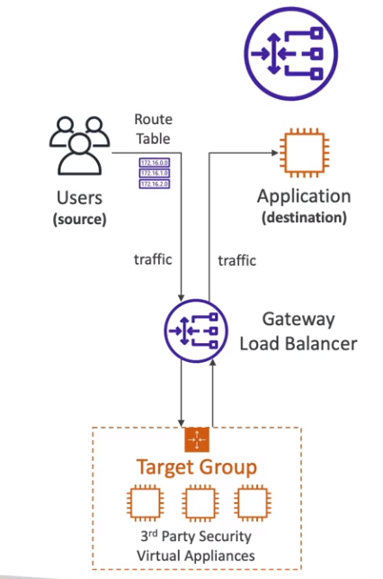
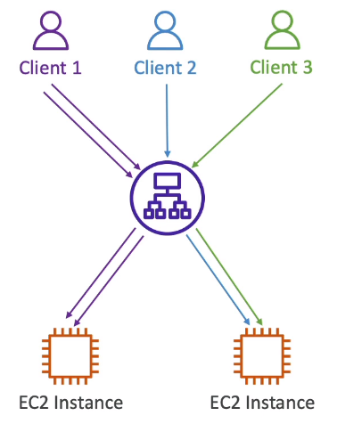
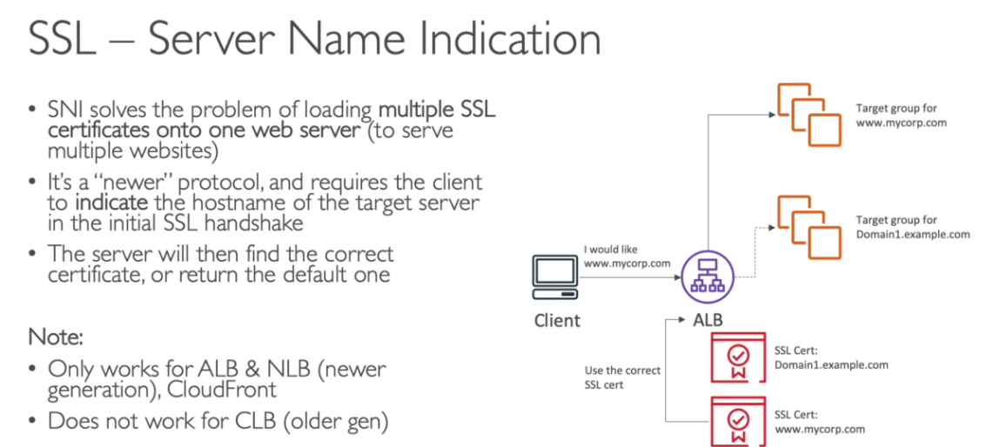

Corrija os erros de português, adicione linhas com explicações caso acho necessário para tornar os itens mais fáceis de entender e:
- respeite comece os cabeçarios do markdown a partir do nível 2 (##) 
- nÃO REMOVAS AS IMAGENS
- Adicione notas E LINKS de temas que questões que podem cair na prova de certificação se achar necessário
  - estou usando o docusarus então use as admonitions para isso
  :::note 
Some **content** with _Markdown_ `syntax`. Check [this `api`](#).
:::

:::tip
Some **content** with _Markdown_ `syntax`. Check [this `api`](#).
:::

:::info
Some **content** with _Markdown_ `syntax`. Check [this `api`](#).
:::

:::warning
Some **content** with _Markdown_ `syntax`. Check [this `api`](#).
:::

:::danger
Some **content** with _Markdown_ `syntax`. Check [this `api`](#).
::: 

Faça isso para a documentação abaixo:

### Elastic Load Balancing

- Distribui o tráfego entre as instâncias de EC2.
- Usa o healh check para verificar o status da instâncias.
- Cria um endpoint, para ser a única entrada de requisições.
- Não gerencia sessões por padrão, existe uma **feature** chamada **Stick session,** que realiza isso, porém não é recomendado o uso, pois que controla o dados da sessão é a aplicação.
- Serviço gerenciado pela AWS.
- Pode ser configurado com **privado** ou **publico**.
- Envia métricas para o CloudWatch.
- Há 4 tipos de **ELB**:
  - **classic load balancer** CLB -(v1 - old generation - 2009)
    - http, https e tcp.
    - Checa a saúde via endpoint da aplicação (http ou TCP).
    - Necessário adicionar instâncias manualmente.
  - **Application load balancer** ALB (v2 - new generation - 2016)
    - http, https e webSocket e http/2.
    - Usa target group para agrupar as instâncias.
    - Tem suporte a **routinhg** baseado em (**listeners**) sendo:
      - **Path** ex:(uni.com/post & uni.com/users).
      - **hostmane url** (curriculo.uni.com e fotos.uni.com).
      - **query string** (uni.com?id=123&order=123).
    - Usados bastante numa arquitetura de microserviços
      
  - **Gateway load balance** GWLB - (v2 - 2020)
    - Opera no level 3 (rede) - protocolo IP
    - Usado para balecear carga de soluções de terceiro
    - Usado para Firewall, fazer sistema de detecção e intrusão. Ou seja, usado quando se deseja escanear o tráfego.
    - Utiliza o protocolo GENEVE no porta 6081.
      
  - **Network load balancer** NLB -(v2 - new generation - 2017)
    - tcp, tls (secure tcp) e udp.
    - **Tem uma latência menor que o ALB ~ 100ms vs (400 ms do ALB).**
    - Tem um IP estatico por AZ, é possível usar um Elastic IP.
      
    - Zonal DNS Name
      - Como cada AZ tem um IP estático, quando acionado DNS ele retorna todos os IPs de todas as AZ relacionado ao NLB.
      - Caso precise retornar apenas um é só adicionar a Região mais AZ no DNS.
        - Caso de uso, vc tem duas aplicação instaladas em 3 AZ, e elas conversam entre si.
        - Caso a APP A chame a B em diferente regiões você vai pagar pelo tráfego de transferência de região. nesse caso pode se criar uma lógica para que a aplicação A recupere o o IP da aplicação B da região onde ela esta assim não tendo que pagar pelo tráfego Cross Region.
          

#### Target groups

- Agrupa as "maquinas" para onde o tráfego será redirecionado.
- Essas "Maquinas" podem ser instâncias **EC2, servidores on-premisses linkados via IP e Lambdas.**
- Agrupa
  - As instâncias EC2.
  - As Tasks do ECS.
  - Lambdas Funtions - a requisição é traduzida para um evento.
- É responsável por checar a saúde das instâncias.

#### Stick session

- Permite que as requisições enviada as instâncias que já atenderam aquele cliente a fim de não perder os dados de sessão.
- Tipos cookies que podem ser usados
  - **aplication-based cookies**
    - **Custom cookie**
      - Gerado pelo target.
      - Pode incluir diversos atributos.
      - Pode ter um nome individual por target group.
      - Não use os nomes AWSALB, AWSALBAPP, AWSALBBTG, pois são reservados.
    - **application cookie**
      - Gerados pelo load balancer.
      - Cookie name AWSALBAPP.
  - **duration-based cookies**
    - Cookie gerados pelo load balance.
    - Tem uma duração especificada.
    - Tem os nomes AWSALB para ALB, AWSALBBTG para CLB.

##### Cross-Zone load balance

- Essa funcionalidade distribui o acesso igualmente pela quantidade de instâncias, independente de que zona ela esta, caso não habilitada será distribuído o tráfego igualmente pela zonas de disponibilidade, e cada instância pode receber quantidade de tráfego diferente.
  
- Configurações de disponibilidade
  
  **Request Routing Algoritimo**
- Least Outstanding Request - Solicitação menos pendente
  - Redireciona para estância que tiver o menor numero de requisições pendentes. Ou seja para instância menos ocupada.
  - Funciona com ALB (HTTP) e CLB (HTTP).
- Round Robin - Sequência circular
  - Funciona com ALB e CLB.
  - Redireciona em sequencia 1, 2, 3, e reinicia pelo 1 , 2, 3 independente da quantidade de requisições pendente.
- Flow Hash
  - Seleciona o Destino baseado no protocolo, o IP e a porta de origem e destino, e a numero sequencial do TCP.
  - Cada coneção UDP/TCP e roteado para um único destino durante toda a conexão.
  - Funciona com o NLB

##### SSL Certificates

- Permite criptografar tráfego entre cliente o **load balance** (in-flight encryption).
- Hoje temos o SSL e o TLS (este é mais seguro que o SSL).
- **CLB** - apenas uma aplicação e apenas um certificado.
- **ALB** - suporta múltiplos **listeners** (entenda como app diferente) e múltiplos certificados e usa **SNI** (server name indication) para isso.
- **NLB** - suporta múltiplos **listeners** (entenda como app diferente) e múltiplos certificados usa **SNI** para isso.
  
  

##### Auto Scaling group ALG

- Permite aumentar a quantidade de **EC2** de acordo com a demanda, ou alarmes gerados pelo **CloudWatch** com base nas métricas ou eventos.
- Não a cobrança, você só e cobrando pelas recursos (ec2, ebs ..) que são usados.
  - **Escabilidade** - habilidade de escalar vertical e/ou horizontal.
  - **Elaticidades** - Capacidade de escalar dinamicamente, através de alarmes ou métricas, ou reduzir as instâncias com a diminuição do volume de acesso, ou uso.
  - **Agilidade** - Velocidade de se ter infraestrutura a toque de caixa.
    
- **Composto pelo atributos**
  - Uma **configuração** \ **templates** de lançamento (define o tipo de maquina/ armazenamento / Security Group / SSH key pair / User Data que será usada nas instância que serám criadas) .
  - Seta as capacidade mínimas e máximas (quantidade de instâncias).
  - Rede onde irá criar as instâncias.
  - Informações sobre o **Load balance** onde esta linkado.
  - Política de escalabilidade, que define quando irá escalar para cima ou para baixo.
- **Scaling polices**
  - Política de escalabilidade, que define quando irá escalar para cima ou para baixo.
    - **Dynamic scaling police**
      - É possível usar métricas geradas pelo **CloudWatch** para definir as políticas (como media de consume de CPU, ou quantidade de requisição).
    - **Sheduled scaling police**
      - É possível agendar para uma determinado período.
    - **Preditive scaling police**
      - É possível usa **marchine learning** (analise do uso anteriores) para criar uma previsão de escalabilidade.
- **Scaling cooldowns** - tempo que deve ser esperado após ser lançada uma instância para validar se as métricas delas estão valida, ou se é preciso escalar.

### Para a prova

- Existe uma política de encerramento no **auto scaling group:**
  - 1. Encontra a AZ com maior numero de instâncias.
  - 2 . Termina a que tiver o configuração de inicialização mais antiga.
- Ciclo de vida de uma instancia com o ASG
  
- Diferença entre Configuração de lançamento (Launch configuration) e templates de lançamento (Launch tempalte)
  - **Launch configuration** é legado, devem ser **recriado** toda vez que se alterar algum atributo
  - **Launch tempalte** é nova e:
    - Tem versionamento, que resolve o problema anterior.
    - Pode se cria subconjuntos de configurações que podem ser herdados por outros templates
    - Permite provisionar instâncias on-demand / spot instances ou um mix de ambos.
