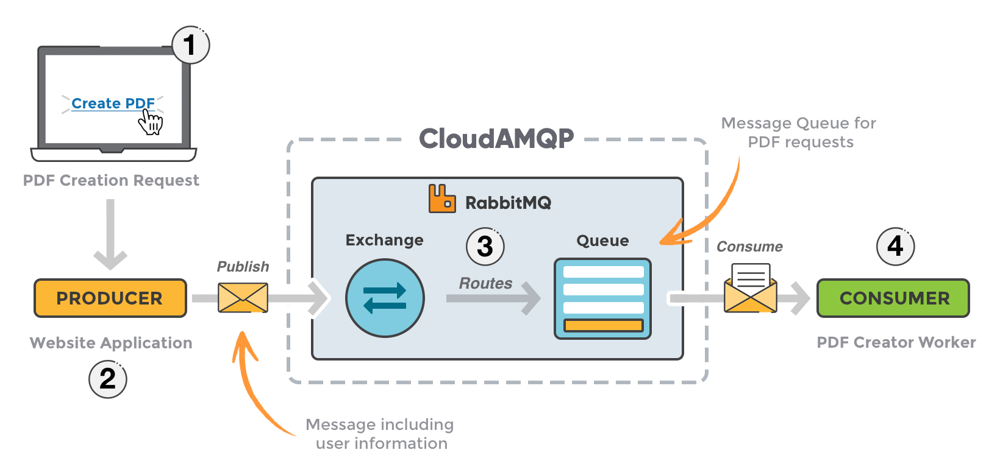
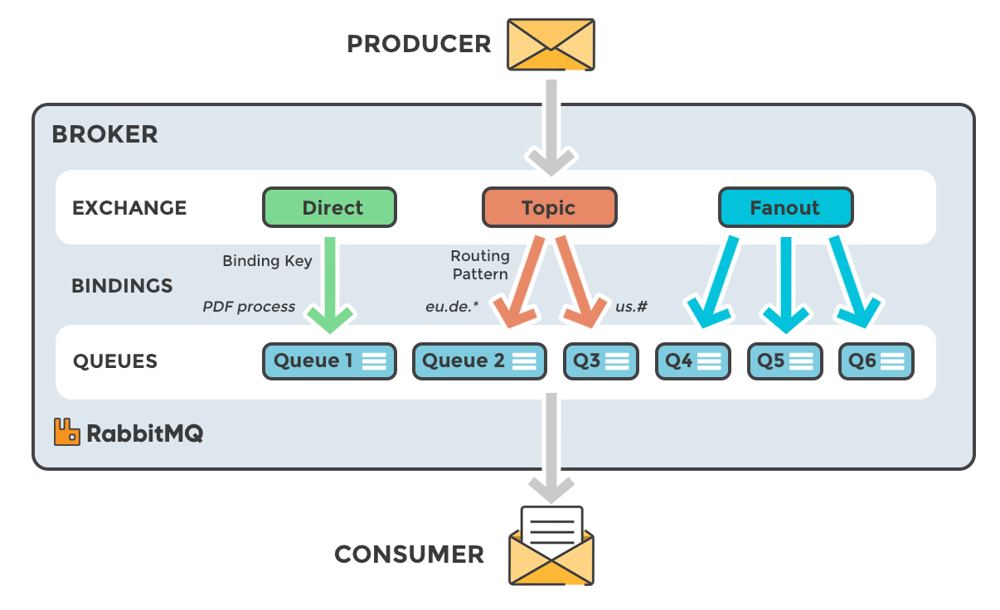
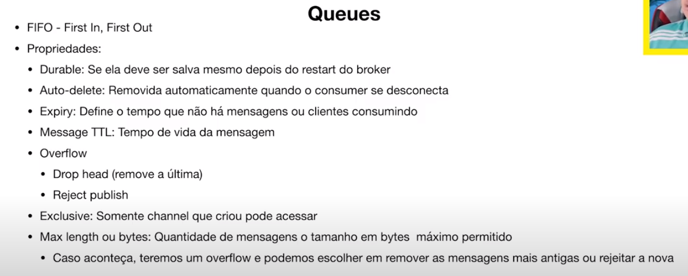
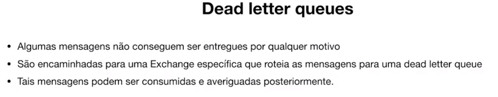

---

title: 00 - Estrutura
updated: 2020-08-16 18:39:59Z
created: 2020-08-02 01:04:39Z
---

<!-- TODO: revisar -->

[[toc]]

---

### Estrutura RabbitMQ

---

link: https://www.cloudamqp.com/blog/2015-09-03-part4-rabbitmq-for-beginners-exchanges-routing-keys-bindings.html
---
---

## Filas (Queues)

---

## Filas de reprocessamento (Dead letter queues)

---

## Filas que salve em disco (Lazy Queues)

---
## Referencia

Link:
- https://www.youtube.com/watch?v=FcF5iufd2P0&t=401s
- https://www.cloudamqp.com/blog/2015-09-03-part4-rabbitmq-for-beginners-exchanges-routing-keys-bindings.html

