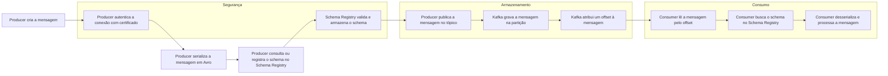

# Tutorial introdutório sobre Apache Kafka

O Apache Kafka é uma plataforma distribuída de streaming de eventos usada para capturar, armazenar e entregar mensagens em tempo real entre sistemas. Ele é muito utilizado em integrações entre microsserviços, pipelines de dados, analytics em tempo real e arquiteturas orientadas a eventos.

## 1. O que é um cluster Kafka?

Um cluster Kafka é um conjunto de brokers, ou seja, vários servidores trabalhando juntos para armazenar e entregar mensagens. O cluster distribui os dados entre os brokers e replica as partições para aumentar disponibilidade e tolerância a falhas.

### Conceitos importantes de um cluster
- Broker: servidor que armazena e serve dados.
- Partição: divisão lógica do tópico para distribuir carga.
- Replicação: cópia das partições em outros brokers para evitar perda de dados.
- Broker líder: broker responsável por receber e servir as gravações de uma partição.

Em resumo, um cluster Kafka torna o sistema mais escalável, resiliente e tolerante a falhas.

Fonte: [Full Cycle - Apache Kafka](https://fullcycle.com.br/apache-kafka-trabalhando-com-mensageria-e-real-time/)

---

## 2. O que é um tópico (topic)?

Um tópico é uma categoria lógica de fluxo de eventos. Pense nele como um canal ou um stream de mensagens. Quando um producer envia uma mensagem, ela é publicada em um tópico e fica disponível para os consumers que quiserem lê-la.

### Características do tópico
- Armazena eventos de um mesmo tipo, como pedidos, pagamentos, logs ou eventos de navegação.
- Pode ter uma ou várias partições.
- Permite múltiplos produtores e múltiplos consumidores.
- As mensagens ficam armazenadas por um tempo configurado, podendo ser lidas várias vezes.

Em outras palavras, o tópico organiza os eventos de forma ordenada e durável.

Fonte: [Danilo Cardoso](https://danilocardoso.dev/integrando-sistemas-com-kafka-principais-conceitos)

---

## 3. O que é offset?

Offset é a posição de uma mensagem dentro de uma partição. Ele funciona como um índice sequencial, semelhante a um número de linha em um log.

### Como o offset funciona
- A primeira mensagem de uma partição pode ter offset 0.
- A próxima mensagem recebe offset 1, depois 2, e assim por diante.
- O consumer usa esse offset para saber de onde começar a leitura.
- Se o consumer reiniciar, ele pode continuar do último offset confirmado.

O offset é essencial para reprocessamento, replay e recuperação de falhas.

Fonte: [DataScience Rocks](https://datasciencerocks.hashnode.dev/beginners-guide-to-kafka)

---

## 4. Como funciona o recebimento da mensagem?

O fluxo básico do Kafka é este:

1. Um producer envia uma mensagem para um tópico.
2. O broker recebe a mensagem e a grava em uma partição.
3. A mensagem recebe um offset dentro daquela partição.
4. Um consumer lê a mensagem a partir do offset desejado.
5. O consumer pode marcar a mensagem como processada, confirmando o offset.

### Fluxo resumido
Producer -> Kafka Broker -> Tópico/Partição -> Consumer

Esse modelo é diferente de uma fila tradicional, porque as mensagens não são removidas automaticamente após a leitura. Elas ficam armazenadas até expirar conforme a política de retenção.

---

## 5. O que é producer e consumer?

### Producer
O producer é quem publica eventos no Kafka. Ele envia dados para um tópico, normalmente indicando uma chave e um valor.

Exemplo de ideia:
- Um sistema de e-commerce envia um evento de "pedido criado".
- Esse evento é publicado em um tópico chamado pedidos.

### Consumer
O consumer é quem consome os eventos do Kafka. Ele pode ler mensagens de um tópico e processar elas em tempo real, por exemplo para:
- atualizar um dashboard,
- disparar notificações,
- salvar dados em um banco,
- gerar métricas.

### Consumer group
Vários consumers podem trabalhar juntos em um mesmo grupo. Cada partição de um tópico é atribuída a apenas um consumer do grupo, o que permite paralelismo e escalabilidade.

Fonte: [Full Cycle - Apache Kafka](https://fullcycle.com.br/apache-kafka-trabalhando-com-mensageria-e-real-time/)

---

## 6. O que é Schema Registry?

O Schema Registry é um serviço que armazena e gerencia os esquemas das mensagens enviadas para o Kafka. Ele ajuda a garantir que producer e consumer concordem com o formato dos dados.

### Por que ele é importante?
- Evita que producer e consumer quebrem quando o formato muda.
- Mantém histórico de versões do esquema.
- Permite evolução compatível dos dados.

Em vez de cada aplicação “adivinhar” o formato da mensagem, o Schema Registry centraliza essa definição.

Mais sobre o assunto: [Schema Registry da Confluent](https://docs.confluent.io/platform/current/schema-registry/index.html)

---

## 7. O que é Avro?

O Avro é um formato de serialização de dados muito usado com Kafka. Ele define a estrutura dos dados em um esquema, o que torna a mensagem mais organizada e mais fácil de evoluir.

### Como o Avro se encaixa com Kafka
- O producer serializa a mensagem em Avro.
- O esquema é registrado no Schema Registry.
- A mensagem é enviada ao Kafka com uma referência ao esquema.
- O consumer recupera o esquema e deserializa a mensagem corretamente.

### Relação entre producer, consumer, Schema Registry e Avro
- Producer: cria a mensagem em Avro e publica no tópico.
- Kafka: armazena a mensagem.
- Consumer: lê a mensagem e usa o Schema Registry para entender o formato.

Essa combinação é muito usada em ambientes corporativos porque melhora compatibilidade e segurança na troca de dados.

Mais sobre o Avro: [Apache Avro](https://avro.apache.org/docs/current/)

---

## 8. Certificados no Kafka: por que usar?

Em ambientes de produção, o Kafka costuma ser exposto em redes internas ou externas, e por isso é importante proteger a comunicação entre clientes, brokers e outros componentes. Para isso, são usados certificados digitais e mecanismos de segurança como TLS e autenticação mTLS.

### Por que usar certificados?
- Criptografar a comunicação entre producer, consumer e brokers.
- Garantir que apenas clientes autorizados consigam se conectar ao cluster.
- Evitar interceptação ou alteração de mensagens durante o transporte.
- Aumentar a confiança e a segurança da infraestrutura.

### Como funciona na prática
- O servidor Kafka apresenta um certificado para provar sua identidade.
- O cliente também pode apresentar um certificado, configurando autenticação mTLS.
- A comunicação entre as partes passa a ocorrer de forma segura e autenticada.

### Quando é importante usar
- Quando o Kafka é acessado por redes públicas ou atravessa ambientes diferentes.
- Quando há dados sensíveis, como pagamentos, cadastros ou informações de clientes.
- Quando a organização precisa atender requisitos de segurança, conformidade e auditoria.

Em resumo, o uso de certificados no Kafka é essencial para proteger a integridade e a confidencialidade das mensagens, além de fortalecer a autenticação entre os componentes do ecossistema.

---

## 9. Fluxograma do fluxo Kafka

---

## 10. Resumo prático

Em uma arquitetura Kafka simples:
- O producer envia mensagens para um tópico.
- O broker grava essas mensagens em partições.
- Cada mensagem recebe um offset.
- O consumer lê as mensagens a partir do offset.
- O consumer pode confirmar o processamento e continuar de onde parou.
- O Schema Registry e o Avro ajudam a padronizar e evoluir o formato das mensagens.
- Os certificados ajudam a proteger a comunicação e autenticar os componentes do cluster.

---

## Links e referências úteis

- [Integrando sistemas com Kafka: principais conceitos](https://danilocardoso.dev/integrando-sistemas-com-kafka-principais-conceitos)
- [Apache Kafka: Trabalhando com Mensageria e Real Time](https://fullcycle.com.br/apache-kafka-trabalhando-com-mensageria-e-real-time/)
- [Beginners Guide to Kafka](https://datasciencerocks.hashnode.dev/beginners-guide-to-kafka)
- [Documentação oficial do Kafka](https://kafka.apache.org/documentation/)
- [Schema Registry da Confluent](https://docs.confluent.io/platform/current/schema-registry/index.html)
- [Apache Avro](https://avro.apache.org/docs/current/)
