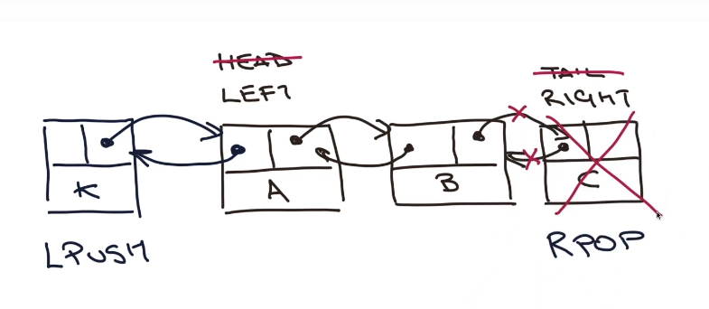

---

title: 04 - Listas
updated: 2021-10-13 10:26:09Z
created: 2021-10-13 10:06:04Z
---

<!-- TODO: revisar -->


## 04 - Listas




### Comandos

```shell
### ADD
LPUSH - Adiciona a esquerda
RPUSH - Adiciona a diretira

lpush nomes "uniliva"
rpush nomes "beto"
lpush nomes "divino"

### Remover
LPOP - remove a esquerda
RPOP - remove a diretira

LPOP nomes
RPOP nomes

### Tamanho da lista
LLEN <nome-lista>

LLEN nomes

### Recuperar valores 
#### Devemos tomar cuidado com esse comando ele é muito custoso
LRANGE <nome-lista> <idx-inicio> <idx-fim> 

LRANGE nomes 0 -1 (-1 que dizer todos os itens)


### Recuperar valor de um indece
LINDEX <nome-lista> <idx> 

LINDEX nomes 2  -> retorna "beto"

### Inserir num indice
LSET <nome-lista> <idx> 

LSET nomes 2 "Roberto"  -> subistitui "beto" por "Roberto"

```

Link: https://redis.io/commands#list