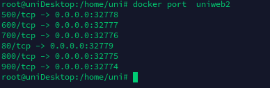

----

## Parametros do docker run

### Definir nome do container

`--name <nome>`

```shellscript
docker run -d -p 80:80 --name uniserver  localhost/webserver 
```

---

### Definir variáveis de ambiente 

-e, --env, --env-file

```shelscript
docker run -e MYVAR1=123 --env MYVAR2=foo --env-file ./env.list ubuntu bash
```

----

### Definir a porta

- Definindo portas

 -p < porta-host-hospedeiro>:< porta-host-container>
 -p < porta-host-hospedeiro>:< porta-host-container>/< protocolo>
 -p < ip_maquina_hospedeira>:< porta-host-hospedeiro>:< porta-host-container>/< protocolo>
 

```shellscript
#ex
docker run -d -p 6000:80 --name uniserver  localhost/webserver 
docker run -d -p 7500:80/udp --name uniserver  localhost/webserver 
docker run -d -p 192.168.0.1:7500:80/udp --name uniserver  localhost/webserver 

docker run -it --name rabbitmq -p 8080:15672 -p 5672:5672 rabbitmq:3-management
```

- Gerando portas aleatorias deacodo com as portas da imagem

Ue o -P no comando RUN para dizer ao docker que gere portas aleatoramente para as portas do container

```shellscript
#ex
docker run -d -P --name uniserver  localhost/webserver 

#use para ver as porta geradas
docker port uniserver
```

vc vera algo mais ou menos assim




---

### Rodar e liberar o terminal

-d 

Use a opção -d para rodar detachado

---

### Passar o volume para o docker

`-v <path-in-container>`  //serve para criar um volume para o container
`-v <path_in_host>:<path-in-container>` //serve para linkar uma volume da maquina host no container
`--volumes-from=<container_name>` //serve para compartilhar um volume

Use a opção -v para um volume ao container

```shellscript
docker run -d  --name <nome> -v <path-in-container> <image> 
docker run -d  --name <nome> -v <path_in_host>:<path-in-container> <image> 
docker run -d  --name <nome> --volumes-from=<container nome> <image> 


#ex 
docker run -d --name uniserver -v /opt/web/unisite  ubuntu:18:04
docker run -d --name uniserver -v /opt/web/site/uni:/opt/web/unisite  ubuntu:18:04
docker run -d --name uniserver2 --volumes-from=uniserver  ubuntu:18:04

#use para ter mais informações da montagem, procure por mount
docker inspect <container_id>
```

---

### Conectar dois container

Pode se usar a opção **--link** `<nome do container>` para criar uma ligação de rede entre os contêiner

`--link <caontainer_nome ou ID>:<alias_para_container>`

```shellscript
docker run -d -p <porta-host-hospedeiro>:<porta-host-container> --name <nome> <image> --link <other_container_name>:<alias_para_container>
#ex
docker run -d -p 80:80 --name uniserver localhost/webserver --link container_2:servicor_web
```

- Usar um alias é importante pois o docker criar variáveis de ambiente que indicam as configurações do conteiner listado e adiciona ele na tabelas hosts

-É possivel linkar um container a varios outros  

