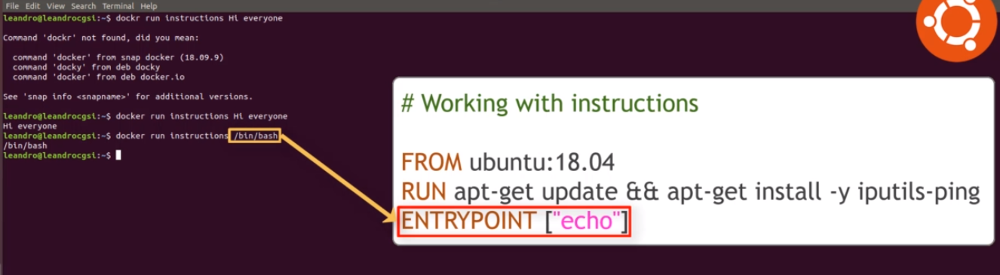
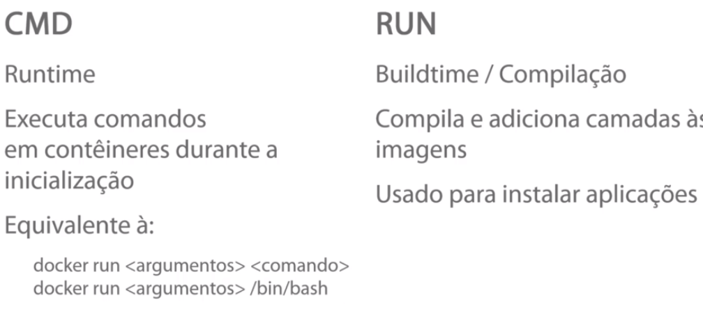
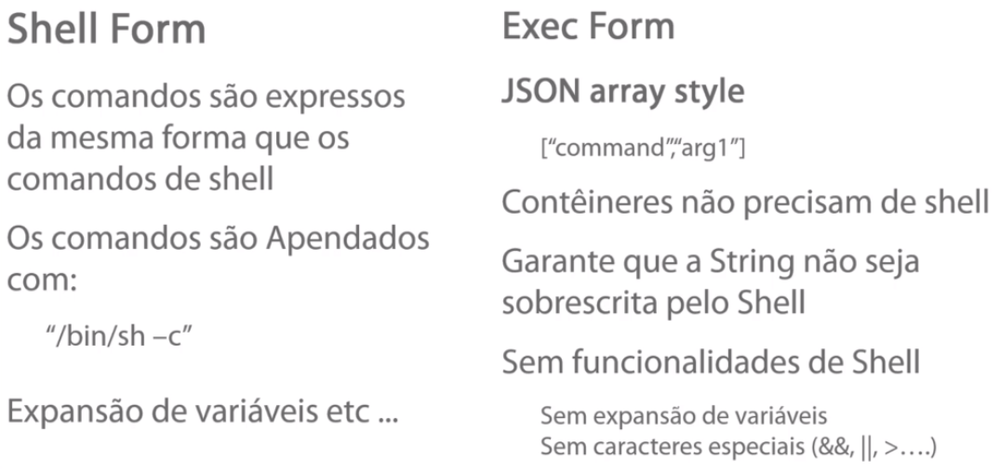
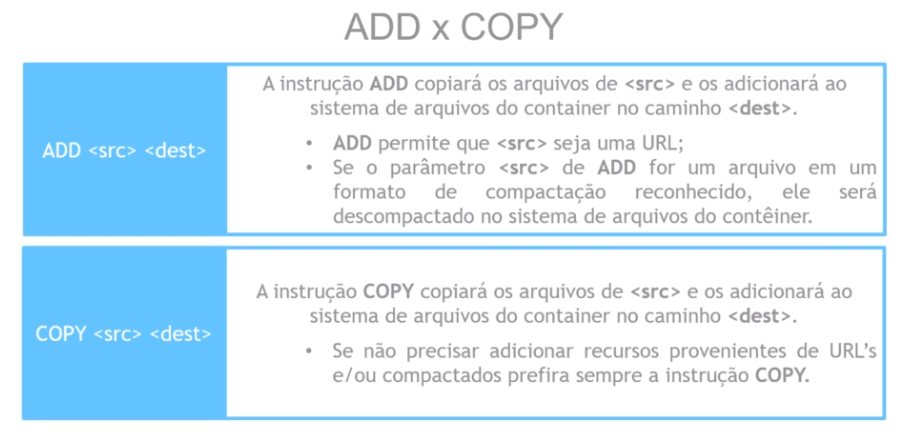

### Comandos

#### Criar imagem

Comando para criar a imagem, e recomendado que o docker file seja colocado numa pasta separada junto com os arquivos que vão compor a imagem.

```shellscript
docker build -t="tag-name" <path-diretorio>

#ex:
docker build -t="uniserver" .
```
---

#### FROM
Indica a imagem base para criação
```shellscript
FROM <so-linux>:<versão>

#ex
FROM ubuntu:18.04
```

---

#### MAINTAINER

Informa que é o responsavel pela imagem (opcional)

```shellscript
MAINTAINER <email>

#ex:
MAINTAINER uniliva@gmail.com
```

---

#### RUN

Serve parar executar comando de instalação na imagem. 
(cada run cria uma nova camada (sobe o container, executa o comando, para o container, commita as mudancas e sobre o container de novo e refaz o procssso para cada RUN ))

```shellscript
RUN <comando de isntalação>

#ex
RUN apt-get update
RUN apt-get install -y vim
#limpa o cache do apt
RUN apt-get clean 
```


---

#### ENTRYOINT

```shellscript
ENTRYPOINT ["echo"]
```
Usado para definir o que vai ser executado, semelhante ao CMD, porém o CMD abre a porta para que qualquer ultima instrução que seja passada ao final do comando RUN sobrescreva o comando do CMD. já o entrypoint indica qual item vai ser executado e qualquer informação que venha ao final do comando RUN vai ser considerado um argumento



E comum utilizar o ENTRYPOINT para definir o processo pricip ae o CMD pra informar os paramentos, e caso passamos algum parametro no RUN ele sobscreve o CDM

```shellscript
#ex
ENTRYPOINT ["apache2ctl"]
CMD ["-D", "FOREGROUND"]
```

---

#### CMD

Serve pra executar um comando dentro da imagem

```shellscript
CMD ["<programa>", "<paramentros>", "<outros parametros>"]

#ex
CMD ["echo", "HELLO WORLD"]
CMD ["apache", "-D" "FOREGROUND"]
```

- Só deve haver um unico CMD no Dockerfiles, pois só será executado o ultimo.

O CMD de tempo de execução, é usado semalhante a execução ao execução no terminal




Forma de montagem do comando

- Opte por usar o Exec form, que foi demonstrado no inicio




---

#### EXPOSE

Serve para especificar a porta em que o container vai executar, caso não seja especificado na execução do container.

```shellscript
EXPOSE <porta>

#ex
EXPOSE 80
EXPOSE 80 85 8090
```
---

#### ENV

Serve para definir variavies de ambiente para o container.

```shellscript
ENV <variavel1>=<valor> <variavel2>=<valor2>

#ex
ENV var1=Uniliva var2=Alves
```

---

#### Volumes

Serve para mapear um diretorio da maquina host dentro de um container, para deixar apartado os dados da aplicação.

```shellscript
#Lista os comando do volume
docker volumes

#lista os volumes exitentes
docker volumes ls

## Cria um volume
VOLUME <path-in_container>

#ex
VOLUME /opt/web/unisite
```
- Não é possivel linkar um pasta do host hospediero com o container via dockerfile, somente via RUN
- 
---

#### WORKDIR

Serve para idicar qual e o diretorio onde o bash vai carregar, o diretorio de trabalho

```shellscript
## Indica qual é diretorio de trabalho
WORKDIR <path-in_container>

#ex
WORKDIR /opt/web/unisite
```
- O diretorio deve existir, antes do WORKDIR

--- 

#### ADD ou COPY

```shell
ADD <Origem> <destino>
ADD app/target/docker-from-zero-to-mastery-0.0.1-SNAPSHOT.jar app.jar
```





---


--- 
---


## Boas praticas

Ao criar Dockerfiles é sempre bom se preocupar com a quantidade de camadas pois cada linha de comando dockerfile gera uma camada

Assim opter por exemplo por algo do tipo: 

```shellscript
#Simple Udemy Web Server
FROM ubuntu:18.04
RUN apt-get update && apt-get install -y \
                              apache2 \
                              apache2-utils \
                              vim \
                   && apt-get clean \
                   && rm -rf /var/lib/apt/lists/* /tmp/* /var/tmp/*		
EXPOSE 80
CMD ["apache2ctl", "-D", "FOREGROUND"]
```

Ao invés de :

```shellscript
#Simple Udemy Web Server
FROM ubuntu:18.04
RUN apt-get update
RUN apt-get install -y apache2
RUN apt-get install -y apache2-utils
RUN apt-get install -y vim
RUN apt-get clean
EXPOSE 80
CMD ["apache2ctl", "-D", "FOREGROUND"]
```

