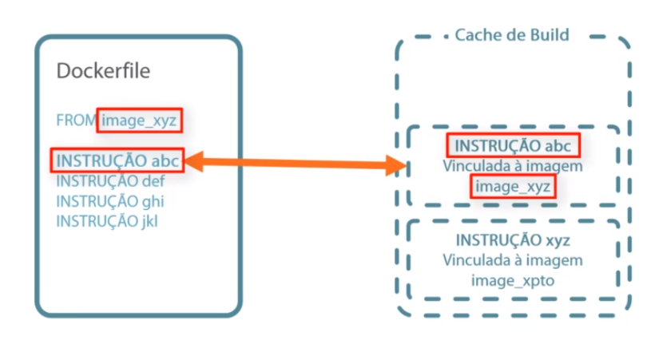

---

title: '05 - Dockerfile '
updated: 2020-02-18 09:32:27Z
created: 2020-01-27 09:47:45Z
---


------

### Entendendo o Dockerfile

```shellscript
# hello word ubuntu base image

# Imagem base para criação
FROM ubuntu:18.04

#informa que é o responsavel pela imagem (opcional)
MAINTAINER uniliva@gmail.com

# Serve parar executar comando de instalação na imagem. 
# (cada run cria uma nova camada (sobe o container, executa o comando, 
# para o container, commita as mudancas e sobre o container de novo e
# refaz o procssso para cada RUN ))
RUN apt-get update

# serve pra executar um comando dentro da imagem
CMD ["echo", "HELLO WORLD"]
```

----

#### Ver historico


```shellscript
docker history <continer-id>
```

:::danger
>> Tome cuidado com o diretorio onde vc cria o Dockerfile pois ele colocará tudo que esta no nivel do Dockerfile dentro da nova imagem que vc vai criar
:::

<br/>
---

#### Criando imagem a partir de Dockerfile


```shellscript
docker build -t <nome-imagem>:<versao> <path-Dockfile>

# ex:
docker build -t uni-helo-world:0.1 /home/udemy
```

<br/>
---

#### Criando contianer a partir da imagem

```shellscript
# executa direto (CRTL+P+Q pra sair sem encerrar a imagem)
# ou passe o -d para iniciar (detachado) e liberar o console
docker run <nome-imagem>:<versao> 

# ex:
 docker run uniteste:0.1
```

---
---

## Aprofundando no Dockerfile

### Cache de build

Quando criamos uma imagem que baixa varios pacotes a primeira vez a partir de um Dockerfile, ela demora bastante, porém ao criar uma nova imagem a partir do mesmo Dockerfile, ela e criada extremamente rapido, pois o docker reaproveita a dados do cache, pois a imagem e construida em camadas, assim ele verifica se cada pacote ja não foi instalado antes e ser foi ele reaproveita aquela camanda em vez de baixar de novo.




---

### Testando nossa imagem antes de criar um dockerfile

É mais pratico antes de sair ceiando um docker file, criar se uma imagem a partir de uma base qualquer e fazer o que se quer nela, para facilitar a montagem do dockerfile.

Assim se precisar criar um imagem que fique pingando um determinado ip, envés de ir direto para o dockerfile, crie uma imagem normal e faça isso. depois que viu como e veito crie o dockerfile com as informações que usou.


