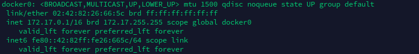
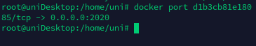

---

### Docker0

Interface criada pelo dameon do docker.

para ver-la use

```shell
ip a
```




Para ver mais informações utilize o **bridge-utils**.

```shellscript
#debian family
sudo apt-get install bridge-utils

#Fedora/Centos
sudo yum install bridge-utils
```

use para ver mais informações sobre o docker0:

```shellscript
#brigde controll 
brctl show docker0

# para mais informações use
docker network inspect bridge
```

----

### Docker port

Use o comando abaixo para ver as portas de um determinado container

```shellscript
docker port <container_nome_OU_id>
```


sendo `<container> --> <host hospedeiro>`

----

#### Configurando rede do docker0

Pode se configurar o range de rede do docker alterando alguns arquivos do docker.

- Primeiro **pare do docker** e remova a interface de rede atual do docker:


```shellscript
## Parando o coker
service docker stop

## listando interface de redes
ip a

## removendo interface Docker0
ip link del docker0
```

- Configurando um novo range de ip

```shellscript
## Editando arquivo de configuração do docker
nano /etc/docker/daemon.json

## Por padrão esse arquivo não existe, o que se faz e adicionar como configuração
## Adicione o json abaixo  
{
    "bip":"150.150.0.1/24"
}
```
**bip** - bridge ip

Pra saber mais acesse: https://docs.docker.com/v17.09/engine/userguide/networking/default_network/custom-docker0/


