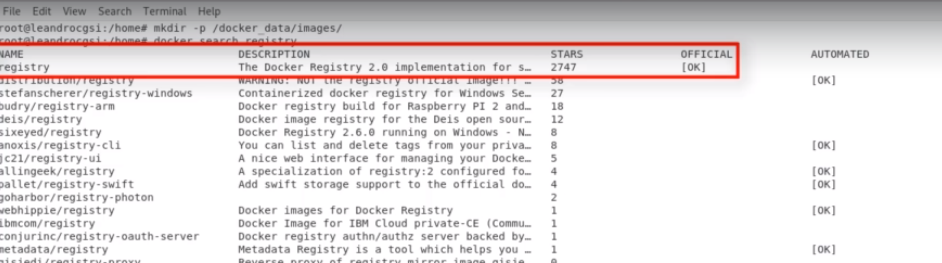

---

title: 08 - Criando um docker register privado
updated: 2020-02-16 20:52:57Z
created: 2020-02-15 23:59:47Z
---

<!-- TODO: revisar -->


[[toc]]

---

### Pre requisitos

- Docker instalado na maquina
- Openssl instalado na maquina


---

## Passo a passo

### Passo 1: Criando diretório para o certificado

```shell
mkdir -p /docker_data/certs/
```

---
### Passo 2: Criando novo certificado

```shell
openssl req \
  -newkey rsa:4096 -nodes -sha256 -keyout /docker_data/certs/domain.key \
  -x509 -days 365 -out /docker_data/certs/domain.crt
```

So e obrigatorio informar o FQDN, que seria o nome do host + mais o dominio.

ex:
debian.unidev.com.br
`<maquina>.<dominio>`

---

### Passo 3: Criando pasta para imagens

```shell
mkdir -p /docker_data/images/
```

---

### Instalando o docker register

#### Buscando a imagem no docker hub

```shell
docker search register
```




#### Instalando o container do do docker register

```shell
docker run -d -p 5000:5000 \
  -v /docker_data/images:/var/lib/registry \
  -v /docker_data/certs:/certs \
  -e REGISTRY_HTTP_TLS_CERTIFICATE=/certs/domain.crt \
  -e REGISTRY_HTTP_TLS_KEY=/certs/domain.key \
  --restart on-failure \
  --name uniregistry \
  registry
```
----
### Enviando imagem para novo register

### Baixando imgem do nginx

```shell
docker pull nginx

# Para ver as imagens
docker images 
```

#### Criando uma tag, para salvar imagem no novo registry

```shell
docker tag nginx localhost:5000/nginx 
```

#### enviar imagem para registry

```shell
docker push localhost:5000/nginx

## Use para verificar se a imagem foi salva

ls -lia /docker_data/images/docker/registry/v2/repositories
```

----
----

## Configurando os Clients para "Enxergar" o Nosso Registry Privado

Para que o cliente enxerge o novo registry é necessario o certificado **domain.crt** criando anteriomente

- Por isso copie o certificado para as maquinas ao qual deseja que veja o registry


### crie uma pasta onde ficarar o certificado e o coloque lá

```shell
mkdir -p /etc/docker/certs.d/debian.unidev.com.br:5000/

# movendo certificado que estava numa pasta

 cp /home/uni/Documentos/Compartilhado/domain.crt  /etc/docker/certs.d/debian.unidev.com.br:5000/
```

### Adicionando host do registry na tabela host

Para isso é necessario ter o ip do servidor, (isso se o servidor for local, caso tenha um dns na empresa não é necessario esse passo)

```shell
echo 192.168.0.33 debian.unidev.com.br >> /etc/hosts
```

### Baixando  do registry privado

```shell
docker pull  <resistry>/<image>:<version>

#ex
docker pull debian.unidev.com.br:5000/nginx:latest
```

### Enviando images para o registry

#### Criando uma tag 

```shell
docker tag <id-imagem> <endereco-registry>/<nome-tag>:<versao>

# ex:

docker tag b20db607cf17 debian.unidev.com.br:5000/hello-world-privado:1.1
```

#### Enviando para registry

```shell
docker push <imagem com tag criada>

#ex
docker push debian.unidev.com.br:5000/hello-world-privado:1.1
```

#### Baixando imagem enviada 

```shell
docker pull  <resistry>/<image>:<version>

#ex
docker pull debian.unidev.com.br:5000/hello-world-privado:1.1
```


