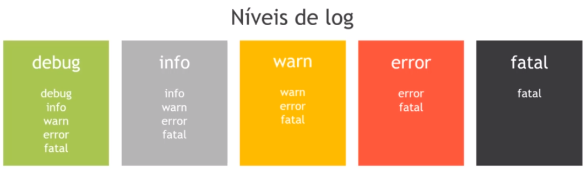

---

title: 11 - Docker logs
updated: 2020-02-18 09:38:27Z
created: 2020-02-18 09:08:40Z
---

<!-- TODO: revisar -->


[[toc]]

----

## Logs do docker daemon

### Niveis de logs 

O docker fornece os niveis de logs abaixo.



Para vê-los use:

```shellscipt
# inicia o daemon do docker e deixa o teminal livre
dockerd -l debug &
dockerd -l info &
dockerd -l warm &
dockerd -l error &
dockerd -l fatal &

## Para para o docker quando iniciado assim use
kill <PID_do_docker>
```

----


## Log do container

```shellscript
docker logs <options> <container>

#ex:
docker logs -fn 300 uniserver
```