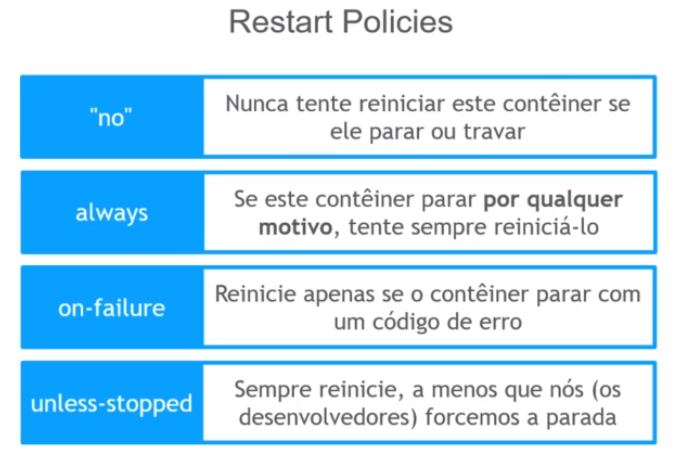
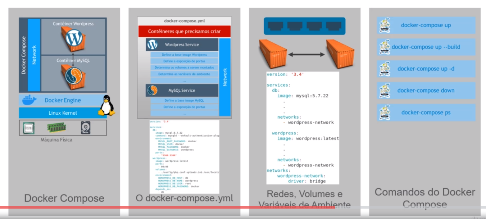

---

title: '12 - Docker compose '
updated: 2020-02-18 23:59:47Z
created: 2020-02-18 10:10:18Z
---

<!-- TODO: revisar -->


[[toc]]

---

### Instalando o docker compose

Link : https://docs.docker.com/compose/install/

#### Ubuntu

```shellscript
sudo curl -L "https://github.com/docker/compose/releases/download/1.25.0/docker-compose-$(uname -s)-$(uname -m)" -o /usr/local/bin/docker-compose
sudo chmod +x /usr/local/bin/docker-compose
```

#### Centos

```shellscript
sudo curl -L "https://github.com/docker/compose/releases/download/1.25.0/docker-compose-$(uname -s)-$(uname -m)" -o /usr/local/bin/docker-compose
sudo mv /usr/local/bin/docker-compose /usr/bin/docker-compose
sudo chmod +x /usr/bin/docker-compose
```

caso tenha problemas - https://stackoverflow.com/questions/36685980/docker-is-installed-but-docker-compose-is-not-why

---
---

### Arquivo do docker-compose docker-compose.yml

```shellshell
#Crie uma pasta
mkdir mycompose

#crie o arquivo do docker compose
nano docker-compose.yml
```

Editando o arquivo

```yml
#versão do docker-compose
version: '3.4'

# Serve para definir os container que serão utilizado
services:
  # nome dado ao container para ficar legivel
  db:
    #comando de start do conatiner
    image: mysql:5.7.22  # imagem utilizada
    command: mysqld --default_authentication_plugin=mysql_native_password
    #Restart polices
    restart: always # sempre reinicie
    #restart: "no" # nunca tente reiniciar
    #restart: on-failure # reinicie se der erro
    #restart: unless-stopped # sempre reinicie, a menos que forcemos a parada
    environment:  # define as variaveis de ambiente
      TZ: America/Sao_Paulo  # ex de variavel utilizado pelo mysql
      MYSQL_ROOT_PASSWORD: docker
      MYSQL_USER: docker
      MYSQL_PASSWORD: docker
      MYSQL_DATABASE: wordpress
    ports: #define as portas de execução do container
      - "3308:3306"  # ex de porta sendo <host>:<container>
    networks: # define a rede que o container usara
      - wordpress-network  # nome da rede criada na sessão networks
  wordpress:
    image: wordpress:latest
    ports:
      - 80:80
    volumes:  # definindo os volumes para container
      - ./config/php.conf.uploads.ini:/usr/local/etc/php/conf.d/uploads.ini
      - ./wp-app:/var/www/html
    #Restart polices
    restart: always # sempre reinicie
    environment:
      TZ: America/Sao_Paulo
      WORDPRESS_DB_HOST: db
      WORDPRESS_DB_NAME: wordpress
      WORDPRESS_DB_USER: root
      WORDPRESS_DB_PASSWORD: docker
    depends_on:   #serve para definir os container que se denpende 
      - db
    networks:
      - wordpress-network
networks: # serve para definira as redes que os container criados podem utilizar
    wordpress-network:  # nome da rede a ser criado (pode ser qualquer nome)
      driver: bridge   # definição da rede
```

----

### Comandos do docker compose

#### Para criar e executar os container

Server para gerar o build e rodar os container  definidos no arquivo docker-compose.yml

- Funciona em duas parte

1. Faz o build dos arquivo, gerando as imagem, somente na primeira vez
2. Executa os containers

Semelhante ao **docker run < imagem>**, mas não é necessario passar a image, pois ele usarar o arquivo docker compose.

```shellScript
#Criar as images e executa os container, caso seja a primeira vez que esta sendo executado, da segunda vez ele sobe os container com as images já geradas

docker-compose up

# para subir detachado (libera o terminal)
docker-compose up -d

# Caso queira obrigar a fazer o build das imagens novamente use

docker-compose up --build

```

#### Para container com docker compose

Uso o comando para para todos os container que estiverem definidos no docker-compose.

```shellscript
# Necessario executar na pasta onde esta o arquivo docker-compose.yml
docker-compose down
```


----

#### Definindo reinicialização automatica de container

Um container retorna o codigo 0 ao encerrar com sucesso após executar o ao se para o container, qualquer outro retorno (1,2,3) significa que ouve um erro no container.

há quantro ações que o docker disponibilizam para tratar esses erros e para reinicialização automatica dos containers, são chamada de restart polices sendo:




---

#### Ver estado do container com docker-compose

Para que funcione deve-se esta dentro da pasta onde fica o docker-compose.yml

```shell
# mostra o status do container que esta executando atraves do docker-compose.yml
docker-compose ps
```


#### Recapitulando




