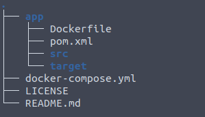

---

title: 13 - Dockerizando app java
updated: 2020-02-29 15:54:28Z
created: 2020-02-19 00:00:05Z
---

<!-- TODO: revisar -->


[[toc]]

---

### Curso 

github: https://github.com/leandrocgsi/DockerFromZeroToMastery-SpingBootAndJava

---

### Criando o Dockifile

Dentro do projeto crie o arquivo do dockerfile, para gerar a imagem do docker, com o nome Dockerfile.

```yml
FROM openjdk:11-jdk-slim
VOLUME /tmp
ADD app/target/docker-from-zero-to-mastery-0.0.1-SNAPSHOT.jar app.jar
EXPOSE 8080
RUN bash -c 'touch /app.jar'
ENTRYPOINT ["java", "-Djava.security.egd=file:/dev/./urandom", "-jar", "/app.jar"]
```

Assim apos dar o comando **mvn clean install**, será gerado um jar que serar usando para montar a imagem atraves do docker file.

----

### Criando o docker compose

Na pasta anterios a pasta do projeto crie o arquivo do docker compose:

Criando um container com Mysql para o projeto que usa mysql

```yml
version: '3.4'
services:
  db:
    image: mysql:5.7.22
    command: mysqld --default-authentication-plugin=mysql_native_password
    restart: always
    environment:
      TZ: America/Sao_Paulo
      MYSQL_ROOT_PASSWORD: docker
      MYSQL_USER: docker
      MYSQL_PASSWORD: docker
      MYSQL_DATABASE: docker_from_zero_to_mastery_java
    ports:
      - "3308:3306"
    networks:
      - udemy-network
  docker-from-zero-to-mastery-java:
    image: docker-from-zero-to-mastery-java
    restart: always
    # Serve para gerar a imagem a partir de um docker file
    build:
      context: .  # serve para definir onde e o contexto onde se deve buscar o docker file
      dockerfile: app/Dockerfile  # dockerfile para buildar a imagem
    working_dir: /app  
    environment:
      TZ: America/Sao_Paulo
    ports:
      - "8080:8080" 
    command: mvn spring-boot:run
    depends_on:
      - db
    networks:
      - udemy-network
networks:
    udemy-network:
        driver: bridge
```

----

### Ajustando conexões do projeto

Como estamos dockerizando a aplicação, é necessario trocar a string de conexão do projeto.
substituindo

```yml
#Ex
spring.datasource.url=jdbc:mysql://localhost:3306/docker_from_zero_to_mastery_java?useTimezone=true&serverTimezone=UTC

#para db conforme o nome que definimos para o banco de dados
spring.datasource.url=jdbc:mysql://db:3306/docker_from_zero_to_mastery_java?useTimezone=true&serverTimezone=UTC
```
---
### Estrutura do projeto



---
### Criando os container


Nesse projeto temos:
- Um containe com o banco de dados
- Um container com a aplicação

1. Gere o build do projeto

Acesse a pasta e execute

```shell
mvn clean package
```

2. Volte uma pasta e execute o docker compose para gerar as imagens

```shell
docker-compose up -d
```

Isso vai gerar dois container um cm o banco mysql e outro com a aplicação java

---

### Intregrando com travis ci

### Criando variaveis no travis

No travis, dentro do projeto crie a variavies

- DOCKER_PASSWORD  - Com a senha do seu docker hub
- DOCKER_USERNAME  - Com o usuario do docker hub


#### Adicionando travis ao projeto no github

Crei um arquivo com o nome .travus.yml e cole

```yml
language: java
jdk:
  - oraclejdk11
before_install:
  - sudo apt-get update
  - cd app/
  - echo "Let's start Maven Package!!!"
  - mvn clean package
  - cd ..
  - echo "We are in root dir"
script:
  - docker-compose build
before_deploy:
  - echo $DOCKER_PASSWORD | docker login --username $DOCKER_USERNAME --password-stdin
deploy:
  provider: script
  script:
    docker tag docker-from-zero-to-mastery-java:latest $DOCKER_USERNAME/docker-from-zero-to-mastery-java:$TRAVIS_JOB_ID;
    docker tag docker-from-zero-to-mastery-java:latest $DOCKER_USERNAME/docker-from-zero-to-mastery-java:latest;
    docker push $DOCKER_USERNAME/docker-from-zero-to-mastery-java:$TRAVIS_JOB_ID;
    docker push $DOCKER_USERNAME/docker-from-zero-to-mastery-java:latest;
  on:
    brach: master
notifications:
  email: false
```

Assim quando der um push no projeto ele automaticamente vai vai acionar o travis ci que realizarar o build do projeto e vai atualizar o docker hub


---

### Executando o projeto em outra maquina

Assim para executar o projeto em outra maquina sera necessario apenas compiar o arquivo do docker-compose, criado anteriomente e ajustar para não fazer o build

```yml
version: '3.4'
services:
  db:
    image: mysql:5.7.22
    command: mysqld --default-authentication-plugin=mysql_native_password
    restart: always
    environment:
      TZ: America/Sao_Paulo
      MYSQL_ROOT_PASSWORD: docker
      MYSQL_USER: docker
      MYSQL_PASSWORD: docker
      MYSQL_DATABASE: docker_from_zero_to_mastery_java
    ports:
      - "3308:3306"
    networks:
      - udemy-network
  docker-from-zero-to-mastery-java:
    # Ajustando para baixar imagem do docker hub
    image: leandrocgsi/docker-from-zero-to-mastery-java
    restart: always
    working_dir: /app
    environment:
      TZ: America/Sao_Paulo
    ports:
      - "8080:8080" 
    command: mvn spring-boot:run
    depends_on:
      - db
    networks:
      - udemy-network
networks:
    udemy-network:
        driver: bridge
```

Apos isso é so dar o comando abaixo

```shelll
docker-compose up -d
```

e pronto já esta implantado