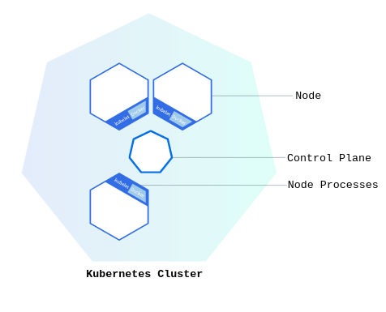
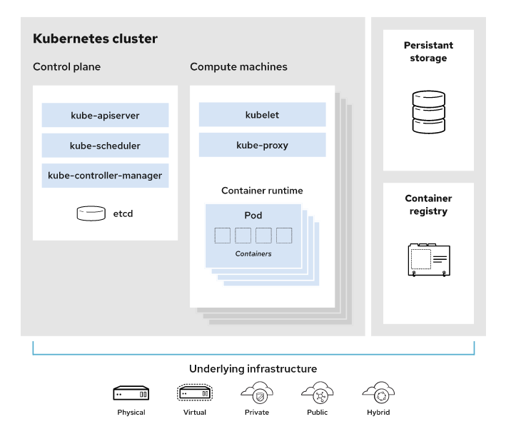
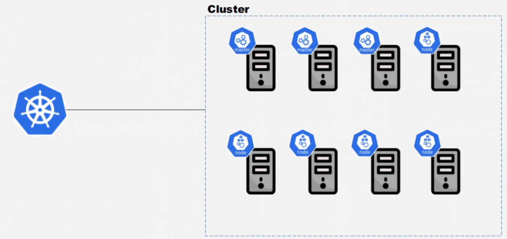
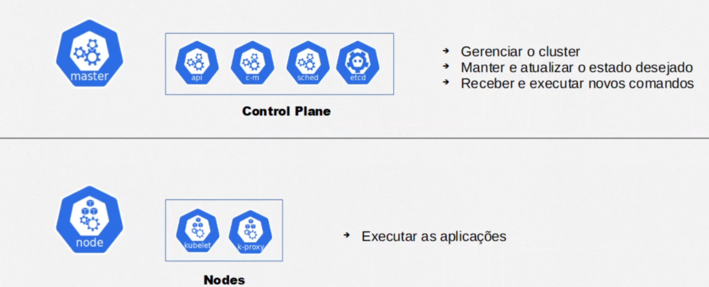
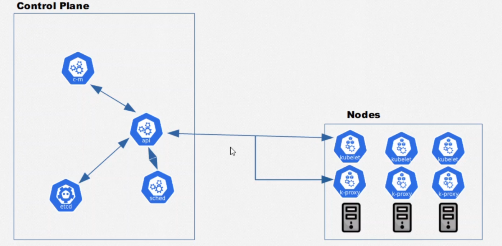
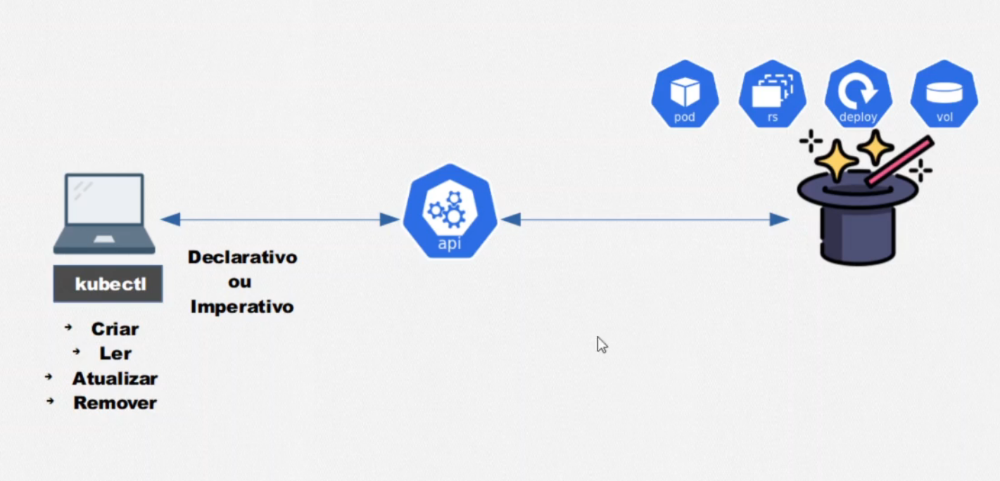
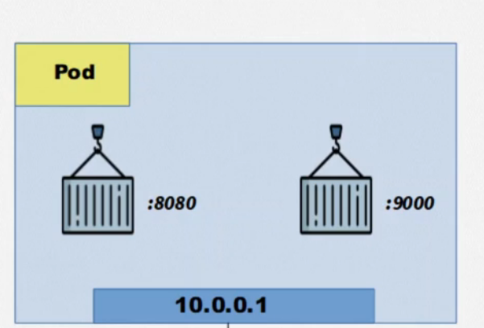
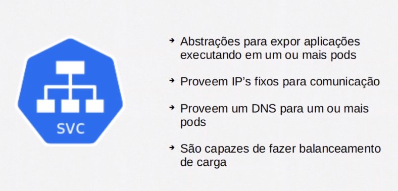
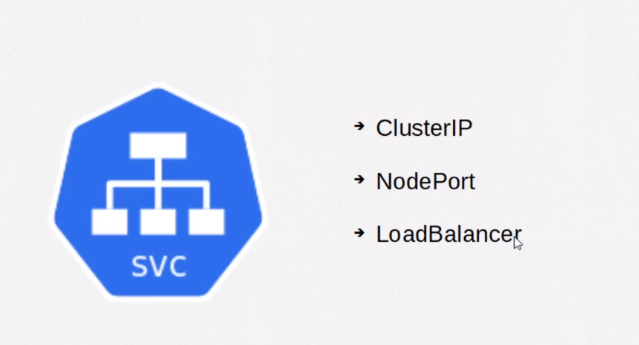
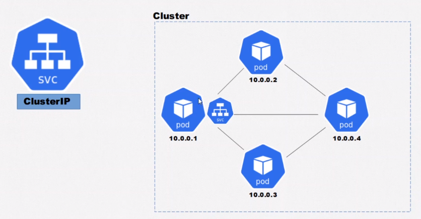

---

title: 01-basico
updated: 2021-11-18 23:53:08Z
created: 2021-10-18 22:50:20Z
---

<!-- TODO: revisar -->


# kubernets

## Cluster 



- master 
	- plano de controle - gerencia os serviços dentro do host.
	- scheduler - Resp. por subir e os serviços.
	- API Server - resp pela comunicação ente nós e master.
	- Node Controller - Resp. por manter o estado dentro do cluster store.
	- Cluster store (etcd) - Armazenamentos do dados do cluster.



- Exemplo de um Cluster




- Master e nodes



- Estrutura



### API
- Gerencia os recursos do cluster (criar pod, deletera Replica Set, criar volume ..)
- Para usar manipular os recusos do kuberntes, sempre vamos usar a api
- Para usar a api usamos o kubctl.




### Pods

- Capsula que pode conter 1 ou mais containers
- Sempre que se cria um pod temos ume endereço ip para aquele pod, e como um pode pode ter varios container
- nesse caso não podemos ter mais dois container com a mesma porta dentro de um pod



- Caso um pode falhe (ou seja todos os container estejam falahados), o kubernetes vai matalo e substituilo por outro, e não temos controle que qual ip sera atribuido a esse novo pod.


#### Criando pods usando forma declarativa

- Crie um arquivo usando a extenção .yaml
	- Semelhante o abaixo

````yaml
apiVersion: v1  # define a versão da api do kubernetes
kind: pod       # define o tipo de recurso criado 
metadata:       # Meta dados que podesm ser adicionado ao pod
  name: uni-pod  # nome do pod
spec:               # epecificação do pod
  containers:       # containers que compoe o pod
    - name: uni-nginx-container   # nome do container
      image: nginx:latest         # imagem usada para criar o container
    - name: uni-http-container
      image: httpd:alpine
````

- Comandos

````shell
# criado container
kubectl apply -f <nome-doa-arquivo>.yaml

# delete com arquivo deployment
kubctl delete -f <file>
````

---
---
### SVC




Podem ser dos tipos 




#### Cluster de ips

> Serve para fazer a cominucação entre diferentes pods dentro de um mesmo cluster. Usa labels para redirecionar o tafrico para os pods.




##### Criando servico de ips via arquivo

---
---

## Instalação no Linux

```shell

## Minikube
## link: https://minikube.sigs.k8s.io/docs/start/

### Install
curl -LO https://storage.googleapis.com/minikube/releases/latest/minikube-linux-amd64
sudo install minikube-linux-amd64 /usr/local/bin/minikube

### Start
minikube start

### Use
minikube kubectl -- get nodes

### Crieate alias dentro do bashrc
alias kubectl="minikube kubectl --"

### Dasboard
minikube dashboard

```

---
---
## Comandos

```shell
# Recuperas os nodes criados
kubectl get nodes

# Listar pods 
kubectl get pods

# listar pods com detalhes
kubctl get pods -o wide

# Acompanhar status pod 
kubectl get pods --watch


# Criar novo pod
kubectl run <nome-pode> --image=<imagem>:<versão>
# - ex:
kubectl run nginx-pod --image=nginx:latest

# Descrever informações do pod
kubectl describe <nome-pode>
# - ex
kubectl describe pod nginx-pod

# Editar pod
kubectl edit pod <nome-pod>
kubectl edit pod nginx-pod

# deletar pod
kubectl delete pod <noime-pod>
kubectl delete pod  nginx-pod

# Entra no container com o modo interativo
kubctl exec -it <pod> -- bash

# Para sair do container use
crtl + D


-----------
# Services

# Criando um novo servide
kubectl apply -f <file-do-svc>

# listando services criados
kubectl get services 
# ou
kubectl get svc

# ver os detalhes dos services
kubectl describe service <nome-do-svc>
# ou
kubectl describe svc <nome-do-serviço>

```

---
##  ClusterIP

> Serviço que permite a cominicação interna entre pods

