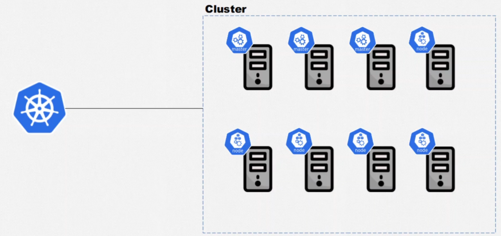
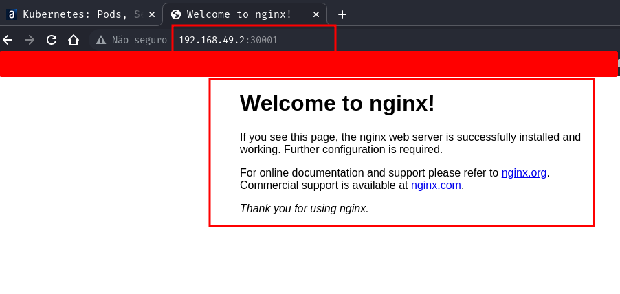
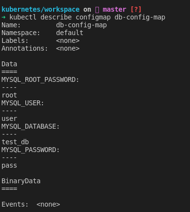
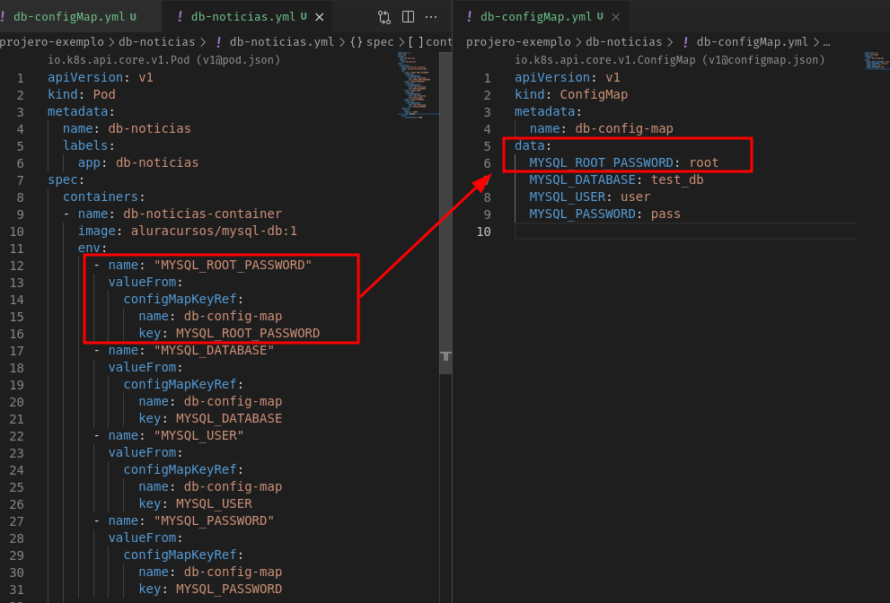
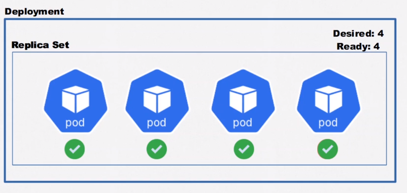
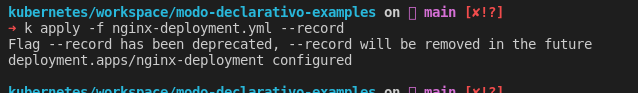
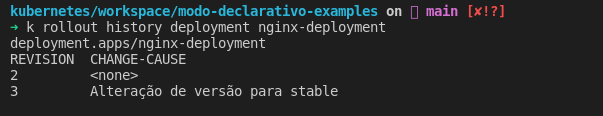

---

## Entendendo


### Cluster

> Um cluster é composto por:

- plano de controle - gerencia os serviços dentro do host.
- scheduler - Resp. por subir e os serviços.
- API Server - resp pela comunicação ente nós e master.
- Node Controller - Resp. por manter o estado dentro do cluster store.
- Cluster store (etcd) - Armazenamentos do dados do cluster.


- Exemplo de um Cluster



- Master e nodes


- Estrutura


### API

- Gerencia os recursos do cluster (criar pod, deletera Replica Set, criar volume ..)
- Para usar manipular os recusos do kuberntes, sempre vamos usar a api
- Para usar a api usamos o kubctl.


### Pods

- Capsula que pode conter 1 ou mais containers.
- Sempre que se cria um pod temos um endereço ip para aquele pod, e como um pod pode ter varios container.
- Nesse caso não podemos ter mais dois container com a mesma porta dentro de um pod.


- Caso um pode falhe (ou seja todos os container estejam falhados), o kubernetes vai matá-lo e substituí-lo por outro, e não temos controle que qual ip sera atribuido a esse novo pod.

---

## Rolando kubernets local

> Para rodar o kubernets localmente, usamos o minikube, para baixa-lo acesse:
> 
> link: https://minikube.sigs.k8s.io/docs/start/

### Instalação no Linux

```shell
## Arquivo de configuração


## Minikube
## link: https://minikube.sigs.k8s.io/docs/start/

### Install minikube
curl -LO https://storage.googleapis.com/minikube/releases/latest/minikube-linux-amd64
sudo install minikube-linux-amd64 /usr/local/bin/minikube

### Start
minikube start

### Use
minikube kubectl -- get nodes

### Create alias dentro do .bashrc
alias kubectl="minikube kubectl --"

#-----------------------------------------------------------------------------------------------
## há a opç


#-----------------------------------------------------------------------------------------------
# Listando contextos possiveis
cat ~/.kube/config 
kubcetl config get-cluster

# setar um contexto
kubectl cluster-info --context <contexto>
kubcetl config use-context <contexto>

# Setando o Kind como cluster padrão no kubctl
kubectl cluster-info --context kind-kind
kubcetl config use-context kind-kind

# Setando o minikube como cluster padrão no kubctl
kubectl cluster-info --context  minikube

# Setar namespace padrão
kubectl config set-context --current --namespace=<namespace>
kubectl config set-context --current --namespace=ucontas-app


#-----------------------------------------------------------------------------------------------
### KUBERNETES (KUBECTL)
alias k="kubectl"
alias ka="kubectl apply -f"
alias kl="kubectl logs"
alias kdd="kubectl describe deployment"
alias kdp="kubectl describe pod"
alias kds="kubectl describe service"
alias kei="kubectl exec -it"
alias kgd="kubectl get deployments"
alias kgp="kubectl get pods"
alias kgs="kubectl get services"
alias krrd="kubectl rollout restart deployment"
alias kdad="kubectl delete --all deployments"
alias kdap="kubectl delete --all pods"
alias kdas="kubectl delete --all services"

### DOCKER
alias d="docker"
alias dc="docker compose"
alias di="docker images"
alias dl="docker logs"
alias db="docker build -t"
alias dps="docker ps"
alias dcu="docker compose up"
alias dcc="docker compose config"
alias drc="docker rm $(docker ps -a -q)"
alias dsa="docker kill $(docker ps -q)"
alias dsp="docker system prune -a --volumes"
alias dcps="docker compose ps"
alias dcenv="docker compose --env-file"
alias usedd="docker context use docker-desktop"
alias usede="docker context use default"

### Dasboard
minikube dashboard
```

---

### Comandos uteis

> Segue alguns comandos uteis usados 

```shell
# Recuperas os nodes criados
kubectl get nodes

# abre serviços
minikube service <nome do serviço>

# Listar pods 
kubectl get pods

# listar pods com detalhes
kubctl get pods -o wide

# Acompanhar status pod 
kubectl get pods --watch


# Criar novo pod
kubectl run <nome-pode> --image=<imagem>:<versão>
# - ex:
kubectl run nginx-pod --image=nginx:latest

# Descrever informações do pod
kubectl describe <nome-pode>
# - ex
kubectl describe pod nginx-pod

# Editar pod
kubectl edit pod <nome-pod>
kubectl edit pod nginx-pod

# deletar pod
kubectl delete pod <noime-pod>
kubectl delete pod  nginx-pod
# deletar todos os pods
kubectl delete pods --all


# Entra no container com o modo interativo
kubectl exec -it <pod> -- bash

# Entra no container caso tenha mais de um no pod
kubectl exec -it <pod> --container <container-name> -- bash

# Para sair do container em uso
crtl + D

# Acessando api do kubenetes
kubectl proxy --porta=8085

# acesse no browser na porta definida
localhost:8085/apis


## Logs
kubectl logs -f --selector <label-key-value>  -n <namespace>
#kubectl logs --selector app=ucontas-api  -n ucontas-app
```

---

## Criando recurso de forma declarativa

---

### Criando pods

>  Para criar pods de forma declarativa, primerio crie um arquivo usando a extenção .yaml

- Semelhante o abaixo

```yaml
apiVersion: v1  # define a versão da api do kubernetes
kind: pod       # define o tipo de recurso criado 
metadata:       # Meta dados que podesm ser adicionado ao pod
  name: uni-pod  # nome do pod
  labels:
    app: segundo-pod
spec:               # epecificação do pod
  containers:       # containers que compoe o pod
    - name: uni-nginx-container   # nome do container
      image: nginx:latest         # imagem usada para criar o container
    - name: uni-http-container
      image: httpd:alpine
    - name: db-noticias-container
      image: aluracursos/mysql-db:1
      env:
        - name: "MYSQL_ROOT_PASSWORD"
          value: "root"
        - name: "MYSQL_DATABASE"
          value: "test_db"
        - name: "MYSQL_USER"
          value: "user"
       ports: 
         - containerPort: 3306
```

- Comandos

```shell
# criado container
kubectl apply -f <nome-doa-arquivo>.yaml

# delete com arquivo deployment
kubctl delete -f <file>
```

---

### Criando seviços (svc)

> São abstrações para expor aplicações executando em um ou mais pods, que podem prover ips's fixos para comunicação, alem de DNS e balanciamento de carga.

Podem ser dos tipos:

- ClusterIP
- NodePort
- LoadBalancer

### Comandos

```shell
# Criando um novo servide
kubectl apply -f <file-do-svc>

# listando services criados
kubectl get services 
# ou
kubectl get svc

# ver os detalhes dos services
kubectl describe service <nome-do-svc>
# ou
kubectl describe svc <nome-do-serviço>

# Deletar serviços
kubectl delete svc <service--name>
# deletar todos os pods
kubectl delete svc --all
```

### Cluster de ips

> Serve para fazer a cominucação entre diferentes pods dentro de um mesmo cluster. Usa labels para redirecionar o tafrico para os pods.


**ex:**

```yml
apiVersion: v1
kind: Service
metadata:
  name: svc-pod-2
spec:
  type: ClusterIP
  selector:
    app: segundo-pod # seletor de pod
  ports:
  - name: svc-pod-io
    port: 80  # portra entrada - service
    targetPort: 80 # porta do container / caso seja igual a port, não precisa informar
    protocol: TCP
```

> Neste exemplo, cria um cluster ip que gerar um ip fixo para o pod com a seletor (label) **app: segundo-po**

- Para ver detalhes do service use:

```
# ver os detalhes dos services
kubectl get service <nome-do-svc>
kubectl describe service <nome-do-svc>
```

ex:


---

### NodePort

> Usado para permitir a comunicação com o mundo externo

```yaml
apiVersion: v1
kind: Service
metadata:
  name: svc-pod-1
spec:
  type: NodePort
  selector:
    app: primeiro-pod
  ports:
  - port: 80 # porta do meu service
    targetPort: 80 # porta do container / caso seja igual a port, não precisa informar
    nodePort: 30001 # porta de acesso externo tem que esta no range 30000 a 32767
```

- Para ver o ip para acesso dentro do node dê o comando:

```shell
# Mostra as configurações de forma extendida
kubeclt get svc -o wide
```

ex:


- Para acessar o pod usando o nodePort dentro do cluster use: 
  
  >  curl 10.106.182.107:80

- Para acessa externamente - linux
  
  - Se tiver no linux, para recuperar o ip mapeado para o cluster
    
    ```shell
    kubectl get node -o wide
    ```
    
    ex:
    
    
    
    - Depois é so acessar http://192.168.49.2:30001/
    
    

- Para acessa externamente - windows
  
  > Use localhost:30001

---

### Loadbalance

> Nada mais é do que um NodePort que permite a distribuição do trafico entres os pods de um container.
> 
> Ele é entregado com o serviço de Kuberbetes das nuvens, nele voce criar um arquivo e diz quais são os seletores e a partir dai o serviços de kubernets do provedor da nuvem gera um a instraestrutura de um loadbalance para que possamos acessa-los via web.
> 
> - Por serem um Load Balancer, também são um NodePort e ClusterIP ao mesmo tempo.
> - Utilizam automaticamente os balanceadores de carga de cloud providers.


- Exemplo de arquivo

```yaml
apiVersion: v1
kind: Service
metadata:
  name: svc-lb-app-1
spec:
  type: LoadBalancer
  selector:
    app: primeiro-pod
  ports:
  - port: 20
    targetPort: 80
```

- Dentro do provedor para executar a use:

```shell
kubectl apply -f <nome-arquivo>
```

- Para ver o status use:

```
 kubectl get svc -o wide
 # ou
  kubectl describe svc <svc-name>
```


> Repare que o EXTERNAL-IP esta vazio, pois executamos localmente, se fosse num provedor, seria preenchiado com um ip para acesso web, repare também que foi gerado uma porta para acesso externo dentro da rede onde o cluster esta, semelhante ao NodePort.

----

### ConfigMap

> Permite extrair as configuração especificas para tornar um pod genérico e reutilizável, com ele é possível reutilizar configurações e varios pods

```yaml
apiVersion: v1
kind: ConfigMap
metadata:
  name: db-config-map
data:
  MYSQL_ROOT_PASSWORD: root
  MYSQL_DATABASE: test_db
  MYSQL_USER: user
  MYSQL_PASSWORD: pass    
```

- Para implantar use

```shell
kubectl apply -f <nome-arquivo>
```

- Para listar o configmap use:

```shel
kubectl get configmap
```

ex:


- Para descrever o configmap use:
  
  ```shell
  kubectl describe configmap <nome-config-map>
  ```

ex:



---

#### Importando o configMap  na definição de um pod

Há duas dorma de se fazer a importação

##### Por variaveis

> Mais verboso, e util quando se tem varios configMaps compartilhado

```yaml
apiVersion: v1
kind: Pod
metadata:
  name: db-noticias
  labels:
    app: db-noticias
spec:
  containers:
  - name: db-noticias-container
    image: aluracursos/mysql-db:1
    env:
      - name: "MYSQL_ROOT_PASSWORD"
        valueFrom:
          configMapKeyRef:
            name: db-config-map
            key: MYSQL_ROOT_PASSWORD
      - name: "MYSQL_DATABASE"        
        valueFrom:
          configMapKeyRef:
            name: db-config-map
            key: MYSQL_DATABASE
      - name: "MYSQL_USER"        
        valueFrom:
          configMapKeyRef:
            name: db-config-map
            key: MYSQL_USER
      - name: "MYSQL_PASSWORD"        
        valueFrom:
          configMapKeyRef:
            name: db-config-map
            key: MYSQL_PASSWORD
    resources:
      limits:
        memory: "128Mi"
        cpu: "500m"
    ports: 
      - containerPort: 3306    
```

ex:



##### Pelo arquivo completo

> Menos verboso, usado quando o config map tem a maioria ou todas a variaveis (configurações) que o pod ira usar

```yaml
apiVersion: v1
kind: Pod
metadata:
  name: db-noticias
  labels:
    app: db-noticias
spec:
  containers:
  - name: db-noticias-container
    image: aluracursos/mysql-db:1
    envFrom:
      - configMapRef:
          name: db-config-map            
    resources:
      limits:
        memory: "128Mi"
        cpu: "500m"
    ports: 
      - containerPort: 3306
```

ex: 


---

## Recursos do kubernetes

> Arquivos de exemplo dentro da pasta workspace/projeto-avançado

- Tipos de recuros que vamos ver:

> - recursos de disponibilidade 
>   - ReplicasSets
>   - Deployments
> - recursos de armazenamento
>   - Volumes
>   - Persistents Volumes
>   - Persistent Volume Claim
>   - Storage Classes

----

### Recursos de disponibilidade

---


#### ReplicaSet


> Estrutura que pode encapsular um ou mais pods, usada quando se quer manter alta disponibilidade, pois se um pod cair o replicaSet sobe outro automaticamente.

```yaml
apiVersion: apps/v1
kind: ReplicaSet
metadata:
  name: portal-noticias-replicaset
spec:
  template: # template a ser usado pelo replicaset
    metadata:
      name: portal-noticias
      labels: 
        app: portal-noticias # label usada para identificar os pods
    spec:
      containers:
        - name: portal-noticias-container
          image: aluracursos/portal-noticias:1
          ports:
            - containerPort: 80
          envFrom:
            - configMapRef:
                name: portal-configmap
  replicas: 3 # numeros de replicas que deve existir
  selector: # serve pra dizer o kubernetes que ele deve gerenciar os pods com essa label
    matchLabels:
      app: portal-noticias 
```

- Como definidos tres replicas, ao se verificar os pods veremos:


> caso delete algum pod do replicaSet ele automaticamente recriará um novo.

- Para ver os replicasSets criado os o comando:

```shell
kubectl get replicasset
kubectl get rs
# ou se quiser mais detalhes
kubectl describe replicaset <nome>
kubectl describe rs <nome>
```

---

#### Deployments



```yaml
apiVersion: apps/v1
kind: Deployment
metadata:
  name: nginx-deployment
spec:
  replicas: 3
  selector:
    matchLabels:
      app: nginx-pod  # deve ser igual ao labels do metadata do template
  template:
    metadata:
      labels:
        app: nginx-pod 
    spec:
      containers:
      - name: nginx-container
        image: nginx:stable
        resources:
          limits:
            memory: "128Mi"
            cpu: "500m"
        ports:
        - containerPort: 80
```

- Ao executar, será criado um replicaset com tres pods, semelhante ao visto anteriores:

```shell
kubectl apply -f <nome-arquivo>    
```

ex:


- Para listar e ver detalhes do deplyment use:

```shell
kubectl get deployments
# ou, caso queira mais detalhes use
kubectl describe deployments <nome>
```

> A diferencia que o deployment, permite adicionar outros recurso em um só arquivo, alem de ter uns comandos para controle de versionamento.

##### Comandos

```shell
# Aplicar deployment
kubectl apply -f <nome-arquivo>    

# Deletar deployment (deleta todos o recursos atrelados)
kubectl delete deployment <nome do deployment>
kubectl delete -f <nome-arquivo->
# ou 

# Ver deployments
kubectl get deployments

# ou, caso queira mais detalhes use
kubectl describe deployments <nome>

# ver historico
kubectl rollout history deployment <nome-do-deployment>

# voltar pra uma versão
kubectl rollout undo deployment <nome-do-deploy> --to-revision=2
```

> Dica linux - crie alias
> 
> ```shell
> alias kubectl="minikube kubectl --"
> alias k="minikube kubectl --"
> funtion k-dploy-msg(){
>     echo "Adicionando ao deployment $1 a anotação : $2"
>     kubectl annotate deployment $1 kubernetes.io/change-cause=$2
> }
> 
> alias k-hd="kubectl rollout history deployment "
> ```

##### Historico de versões

> - Historico de alterações - mostra o historico de alerações
> 
> ```shell
> kubectl rollout history deployment <nome-do-deployment>
> ```
> 
> 
> 
> **obs:** Deve ser passadoa  flag --record no final do comando de **apply**
> 
> ```shell
> kubectl apply -f <arquivo-deployment> --record
> ```
> 
> 
> 
> - Altera mensagem de alteração
> 
> Quando fazemos o passo anterior, e vemos o historico, so vemos a linha do deplyment onde ouver a alteração, caso queiramos adicionar uma mensagem, mais amigavel, podemos após o **apply** dar o comando abaixo:
> 
> ```shell
> kubectl annotate deployment <nome-do-deploy> kubernetes.io/change-cause="Messagem que queremos"
> ```
> 



##### Voltando uma versão (rollback)

> Realizando o passo anterior podemos voltar versões, (fazer um rollback) com o comando:
> 
> ```shell
> kubectl rollout undo deployment <nome-do-deploy> --to-revision=2
> ```

---

### Recursos de armazenamentos

link: https://kubernetes.io/docs/concepts/storage/volumes/

#### Volumes

> Semelhante aos volumes do docker, caso o container morrar os dados ficam armazenados no volume, a diferença aqui e que o ciclo de vida do volume no kubernetes dica atrelado a vida do pod, caso o pod tenha 2 container se um morrer, e for recriado, os dados ainda estaram lá, poré se o pod for distruido, os volumes serão perdidos.

ex:

```yaml
apiVersion: apps/v1
kind: Pod
metadata:
    name: pod-volume
spec:
    containers:
      - name: nginx-container
        image: nginx:latest
        volumeMounts:
            - mountPath: /volume-dentro-do-container
              name: segundo-volume
      - name: jenkins
        image: jenkins/jenkins:alpine
        volumeMounts:
          - mountPath: /volume-dentro-do-container
            name: segundo-volume
    volumes:
    - name: segundo-volume
      hostPath:
        path: /tmp/bkp
        type: DirectoryOrCreate
```

> o **type** do volume pode ser:
> 
> - Directory - Quando o diretorio já estiver criado.
> - DirectoryOrCreate - Quando o diretorio não existir, o kubernets cria.

> Para executar isso localmente no linux, você estará usando o minikube, que é um container docker que roda o kubernetes, por isso é necessario criar a pasta do mapeamento do volume  (caso esteja usando o **type** do volume como **directory**) dentro do minikube , NÃO em sua maquina, para isso use os comandos abaixo:
> 
> ```shell
> # logar no minikube
> minikube ssh
> 
> # criar a pasta
> cd /tmp
> mkdir bkp
> 
> # Sair do minikuve
> crtl+d    
> ```

---

#### Persistents Volumes


> A ideia de PV (persistence volume) é usar o mesmo conceito anterior, porem na nuvem, onde se criaria um volume e se linkaria esse volume com o pod, para isso é necessario criar um pv, que vai armazenar a conexão do volume criado na nuvem para ser usado no kubernetes
> 
> - Um PV é uma instância de armazenamento virtual que é incluída como um volume no cluster. O PV aponta para um dispositivo de armazenamento físico em sua conta na nuvem e resume a API que é usada para se comunicar com o dispositivo de armazenamento. Para montar um PV em um app, deve-se ter um PVC correspondente. Os PVs montados aparecem como uma pasta dentro do sistema de arquivos do contêiner.

##### Comandos

```shell
# listando storage class existentes
kubectl get storageclass
#ou
kubectl get sc

# listar persistence volumes claim
kubectl get pvc

#listar persistence volume
kubectl get pv
```

- Criando um PV no google cloud

```yaml
apiVersion: v1
kind: PersistVolume
metadata:
    name: pv-1
spec:
    capacity:
        storage: 10Gi
    accessModes:
        - ReadWriteOnce
    gcePersistentDisk:
        pdName: pv-disk
    storageClassName: standard
```

- Tipos de volumes persistentes.

> Tipos de PersistentVolume são implementados como plugins. Atualmente o Kubernetes suporta os plugins abaixo:
> 
> - [`awsElasticBlockStore`](https://kubernetes.io/docs/concepts/storage/volumes/#awselasticblockstore) - AWS Elastic Block Store (EBS)
> - [`azureDisk`](https://kubernetes.io/docs/concepts/storage/volumes/#azuredisk) - Azure Disk
> - [`azureFile`](https://kubernetes.io/docs/concepts/storage/volumes/#azurefile) - Azure File
> - [`cephfs`](https://kubernetes.io/docs/concepts/storage/volumes/#cephfs) - CephFS volume
> - [`cinder`](https://kubernetes.io/docs/concepts/storage/volumes/#cinder) - Cinder (OpenStack block storage) (**depreciado**)
> - [`csi`](https://kubernetes.io/docs/concepts/storage/volumes/#csi) - Container Storage Interface (CSI)
> - [`fc`](https://kubernetes.io/docs/concepts/storage/volumes/#fc) - Fibre Channel (FC) storage
> - [`flexVolume`](https://kubernetes.io/docs/concepts/storage/volumes/#flexVolume) - FlexVolume
> - [`flocker`](https://kubernetes.io/docs/concepts/storage/volumes/#flocker) - Flocker storage
> - [`gcePersistentDisk`](https://kubernetes.io/docs/concepts/storage/volumes/#gcepersistentdisk) - GCE Persistent Disk
> - [`glusterfs`](https://kubernetes.io/docs/concepts/storage/volumes/#glusterfs) - Glusterfs volume
> - [`hostPath`](https://kubernetes.io/docs/concepts/storage/volumes/#hostpath) - HostPath volume (somente para teste de nó único; ISSO NÃO FUNCIONARÁ num cluster multi-nós; ao invés disso, considere a utilização de volume `local`.)
> - [`iscsi`](https://kubernetes.io/docs/concepts/storage/volumes/#iscsi) - iSCSI (SCSI over IP) storage
> - [`local`](https://kubernetes.io/docs/concepts/storage/volumes/#local) - storage local montados nos nós.
> - [`nfs`](https://kubernetes.io/docs/concepts/storage/volumes/#nfs) - Network File System (NFS) storage
> - `photonPersistentDisk` - Controlador Photon para disco persistente. (Esse tipo de volume não funciona mais desde a removação do provedor de cloud correspondente.)
> - [`portworxVolume`](https://kubernetes.io/docs/concepts/storage/volumes/#portworxvolume) - Volume Portworx
> - [`quobyte`](https://kubernetes.io/docs/concepts/storage/volumes/#quobyte) - Volume Quobyte
> - [`rbd`](https://kubernetes.io/docs/concepts/storage/volumes/#rbd) - Volume Rados Block Device (RBD)
> - [`scaleIO`](https://kubernetes.io/docs/concepts/storage/volumes/#scaleio) - Volume ScaleIO (**depreciado**)
> - [`storageos`](https://kubernetes.io/docs/concepts/storage/volumes/#storageos) - Volume StorageOS
> - [`vsphereVolume`](https://kubernetes.io/docs/concepts/storage/volumes/#vspherevolume) - Volume vSphere VMDK

- Modos de acessos

> Os modos de acesso são:
> 
> - ReadWriteOnce -- o volume pode ser montado como leitura-escrita por um nó único
> - ReadOnlyMany -- o volume pode ser montado como somente-leitura por vários nós
> - ReadWriteMany -- o volume pode ser montado como leitura-escrita por vários nós
> 
> Na linha de comando, os modos de acesso ficam abreviados:
> 
> - RWO - ReadWriteOnce
> - ROX - ReadOnlyMany
> - RWX - ReadWriteMany

- Para usar o PV é necessario configurar uma claim para dara acessos ao containers

##### Persistent Volume Claim


> Uma PVC é a solicitação para provisionar armazenamento persistente com um tipo e configuração específicos. Para especificar o tipo de armazenamento persistente que você deseja

- Criando um PVC no google cloud

```yaml
apiVersion: v1
kind: PersistentVolumeClaim
metadata:
    name: pvc-1
spec:
    accessModes:
        - ReadWriteOnde
    resources:
        requests:
            storage: 10Gi
    storageClassName: standard
```

> para linkar um **pvc** a **pv**, como **pvc** e uma "requisição de armazenamento" usa-se as especificações, ou seja, as especificações do volume contidos no **pvc** devem ser igual ao contido no **pv**.

- Criando um pod que aponta para um pvc

```yaml
apiVersion: v1
kind: Pod
metadata:
    name: pod-pv
spec:
    containers:
        - name: nginx-container
            image: nginx-latest
            volumeMounts:
                - mountPath: /volume-dentro-do-container
                name: primeiro-pv
    volumes:
        - name: primeiro-pv
            hostPath:
                persistentVolumeClaim:
                    claimName: pvc-1
```

---

#### Storage Classes


> A diferença da item anteriror e que com um storage classes a criação do disco na nuvem e do persistente volume é feita automaticamente.

- Criando um storage class (sc) no google cloud

```yaml
apiVersion: storage.k8s.io/v1
kind: StorageClass
metadata:
    name: nome-sc
provisioner: kubernetes.io/gce-pd
parameters:
    type: pd-standard
    fstype: ext4
    replication-type: none
```

- Atrelando um storage class no PVC

```yaml
apiVersion: v1
kind: PersistentVolumeClaim
metadata:
    name: pvc-2
spec:
    accessModes:
        - ReadWriteOnde
    resources:
        requests:
            storage: 10Gi
    storageClassName: nome-sc
```

- Criando um pod

```yaml
apiVersion: v1
kind: Pod
metadata:
    name: pod-pv
spec:
    containers:
        - name: nginx-container
            image: nginx-latest
            volumeMounts:
                - mountPath: /volume-dentro-do-container
                name: primeiro-pv
    volumes:
        - name: primeiro-pv
            hostPath:
                persistentVolumeClaim:
                    claimName: pvc-2
```

##### Comandos

```shell
# listando storage class existentes
kubectl get storageclass
#ou
kubectl get sc

# listar persistence volumes claim
kubectl get pvc

#listar persistence volume
kubectl get pv
```

---

#### Statefull Set


> Bem similar a um Deployment, mas, ele é voltado para aplicações a Pods que devem manter o seu estado que eles são Stateful. Isso significa que quando um Pod reinicia ou falha por algum motivo dentro de um Stateful Set e volta a execução, o arquivo é mantido.

- Criando pods usando o statefull set ao invéz de deployments

```yaml
apiVersion: apps/v1
kind: StatefulSet
metadata:
  name: systema-noticias-statefull-set
spec:
  serviceName: svc-sistema-noticias
  replicas: 2
  selector:
    matchLabels:
      app: sistema-noticias
  template:
    metadata:
      labels:
        app: sistema-noticias
      name: sistema-noticias
    spec:
      containers:
      - name: sistema-noticias-container
        image: aluracursos/sistema-noticias:1
        resources:
          limits:
            memory: "128Mi"
            cpu: "500m"
        ports:
        - containerPort: 80
        envFrom:
          - configMapRef:
              name: sistema-configmap
        volumeMounts:
          - name: vl-imagem
            mountPath: "/var/www/uploads"
          - name: vl-sessao
            mountPath: /tmp
      volumes:
        - name: vl-imagem
          persistentVolumeClaim:
            claimName: imagem-pvc
        - name: vl-sessao
          persistentVolumeClaim:
            claimName: sessao-pvc
```

> vai criar a estrutura e vai manter os dados salvos no volumes atachados, use os comandos:
> 
> ```shell
> # Para aplicar
> kubectl apply -f <nome-file>
> ```

- Lembrando que para isso antes é necessario criar os pvc (volumes que serão usados)

```yaml
# imagem-pvc.yml
apiVersion: v1
kind: PersistentVolumeClaim
metadata:
  name: imagem-pvc
spec:
  resources:
    requests:
      storage: 1Gi
  volumeMode: Filesystem
  accessModes:
    - ReadWriteOnce

# sessao-pvc.yml
apiVersion: v1
kind: PersistentVolumeClaim
metadata:
  name: sessao-pvc
spec:
  resources:
    requests:
      storage: 1Gi
  volumeMode: Filesystem
  accessModes:
    - ReadWriteOnce
```

> Salve em arquivos com os determinados nomes e de o comando abaixo

```shell
# para aplicar
kubectl apply -f <nome>

# para ver os pvcs criados
kubectl get pvc

# para ver os pvs criados
kubectl get pv

# para ver o storage classe existente
kubectl get sc
```

---

### Recurso para healthcheck

> o kubernetes consegue gerenciar por si proprio o pod, porem os container dentro ("a aplicação") ele precisa de ajuda pra gerenciar se esta vivo, par isso ele utiliza o **liveness e o readiness**.
> 
> - O Kubernetes nem sempre tem como saber se a aplicação está saudável
> - Podemos criar critérios para definir se a aplicação está saudável através de probes
> - Como criar LivenessProbes com o campo `livenessProbe`
> - LivenessProbes podem fazer a verificação em diferentes intervalos de tempo via HTTP
> - Como criar ReadinessProbes com o campo `readinessProbe`
> - ReadinessProbes podem fazer a verificação em diferentes intervalos de tempo via HTTP
> - LivenessProbes são para saber se a aplicação está saudável e/ou se deve ser reiniciada, enquanto ReadinessProbes são para saber se a aplicação já está pronta para receber requisições depois de iniciar
> - Além do HTTP, também podemos fazer verificações via TCP

link: https://kubernetes.io/docs/tasks/configure-pod-container/configure-liveness-readiness-startup-probes/

#### Liveness Prob

> Entenda como forma de checagem se o contanier tem uma boa saude, declaramos junto a declaração co container.

```yaml
livenessProbe:
 httpGet:  # metodo que vamos usar
  path: /  # path aonde vamos bater com a requisição
  port: 80 # porta do container
 periodSeconds: 10 # de quanto em quanto tempo vamos validar em segundos
 failureThreshold: 3 # quandos erros vamos aceitar antes de reiniciar o container    
 initialDelaySeconds: 20 # Delay inicial para que o container possa subir
```

ex:


----

#### Readiness Probes

> Entenda como a prova de que um container pode receber requisições, que que ele esta "Ready" (pronto) para começar a receber requisições.

```yaml
readinessProbe:
  httpGet:  # metodo que vamos usar para validar se o caontainer esta pronto
    path: /  # path aonde vamos bater com a requisição
    port: 80 # porta do container
  periodSeconds: 10 # de quanto em quanto tempo vamos validar em segundos
  failureThreshold: 5 # quanto erros são tentativas são toleraveis aonte de começar a madar requisição para o container
  initialDelaySeconds: 3 # Delay inicial após o container subir, para iniciar as validações se o container esta pronto
```

EX:


----

### Recurso de escalabilidade

> Permite escalara os pods deacordo com a demanda
> 
> - HPA - Horizontal pod autpscale

#### HPA - Horizontal Pod AutoScale

- Basea-se no uso de cpu para realizar o scalonamento. por isso precisamos informar em nossos **deployments** os definições de cpus usadas por aquele pod.

```yaml
        resources:
          limits:
            memory: 128Mi
            cpu: 500m
          requests:
            cpu: 10m # mili core cpu
            memory: 128Mi
```

ex:


- Criando um arquivo de configuração de HPA

```yaml
apiVersion: autoscaling/v2beta2
kind: HorizontalPodAutoscaler
metadata:
  name: primeiro-hpa
spec:
  scaleTargetRef:
    apiVersion: apps/v1
    kind: Deployment
    name: portal-noticias-deployment
  minReplicas: 1
  maxReplicas: 5
  metrics:
    - type: Resource
      resource:
        name: cpu
        target:
          type: Utilization
          averageUtilization: 20
```

#### Comandos

```yaml
# listar configurações de HPA
kubectl get hpa
```

> **Obs:** Apenas isso não sera necessario pra que funcione, é  necessario configurar um servidor de metricas vai garadar as metricas de consumo. para isso usamos o arquivo abaixo:
> 
> - links: https://github.com/kubernetes-sigs/metrics-server
> 
> ```yaml
> ---
> apiVersion: rbac.authorization.k8s.io/v1
> kind: ClusterRole
> metadata:
>   name: system:aggregated-metrics-reader
>   labels:
>     rbac.authorization.k8s.io/aggregate-to-view: "true"
>     rbac.authorization.k8s.io/aggregate-to-edit: "true"
>     rbac.authorization.k8s.io/aggregate-to-admin: "true"
> rules:
> - apiGroups: ["metrics.k8s.io"]
>   resources: ["pods", "nodes"]
>   verbs: ["get", "list", "watch"]
> ---
> apiVersion: rbac.authorization.k8s.io/v1
> kind: ClusterRoleBinding
> metadata:
>   name: metrics-server:system:auth-delegator
> roleRef:
>   apiGroup: rbac.authorization.k8s.io
>   kind: ClusterRole
>   name: system:auth-delegator
> subjects:
> - kind: ServiceAccount
>   name: metrics-server
>   namespace: kube-system
> ---
> apiVersion: rbac.authorization.k8s.io/v1
> kind: RoleBinding
> metadata:
>   name: metrics-server-auth-reader
>   namespace: kube-system
> roleRef:
>   apiGroup: rbac.authorization.k8s.io
>   kind: Role
>   name: extension-apiserver-authentication-reader
> subjects:
> - kind: ServiceAccount
>   name: metrics-server
>   namespace: kube-system
> ---
> apiVersion: apiregistration.k8s.io/v1beta1
> kind: APIService
> metadata:
>   name: v1beta1.metrics.k8s.io
> spec:
>   service:
>     name: metrics-server
>     namespace: kube-system
>   group: metrics.k8s.io
>   version: v1beta1
>   insecureSkipTLSVerify: true
>   groupPriorityMinimum: 100
>   versionPriority: 100
> ---
> apiVersion: v1
> kind: ServiceAccount
> metadata:
>   name: metrics-server
>   namespace: kube-system
> ---
> apiVersion: apps/v1
> kind: Deployment
> metadata:
>   name: metrics-server
>   namespace: kube-system
>   labels:
>     k8s-app: metrics-server
> spec:
>   selector:
>     matchLabels:
>       k8s-app: metrics-server
>   template:
>     metadata:
>       name: metrics-server
>       labels:
>         k8s-app: metrics-server
>     spec:
>       serviceAccountName: metrics-server
>       volumes:
>       # mount in tmp so we can safely use from-scratch images and/or read-only containers
>       - name: tmp-dir
>         emptyDir: {}
>       containers:
>       - name: metrics-server
>         image: k8s.gcr.io/metrics-server/metrics-server:v0.3.7
>         imagePullPolicy: IfNotPresent
>         args:
>           - --cert-dir=/tmp
>           - --secure-port=4443
>         ports:
>         - name: main-port
>           containerPort: 4443
>           protocol: TCP
>         securityContext:
>           readOnlyRootFilesystem: true
>           runAsNonRoot: true
>           runAsUser: 1000
>         volumeMounts:
>         - name: tmp-dir
>           mountPath: /tmp
>       nodeSelector:
>         kubernetes.io/os: linux
> ---
> apiVersion: v1
> kind: Service
> metadata:
>   name: metrics-server
>   namespace: kube-system
>   labels:
>     kubernetes.io/name: "Metrics-server"
>     kubernetes.io/cluster-service: "true"
> spec:
>   selector:
>     k8s-app: metrics-server
>   ports:
>   - port: 443
>     protocol: TCP
>     targetPort: main-port
> ---
> apiVersion: rbac.authorization.k8s.io/v1
> kind: ClusterRole
> metadata:
>   name: system:metrics-server
> rules:
> - apiGroups:
>   - ""
>   resources:
>   - pods
>   - nodes
>   - nodes/stats
>   - namespaces
>   - configmaps
>   verbs:
>   - get
>   - list
>   - watch
> ---
> apiVersion: rbac.authorization.k8s.io/v1
> kind: ClusterRoleBinding
> metadata:
>   name: system:metrics-server
> roleRef:
>   apiGroup: rbac.authorization.k8s.io
>   kind: ClusterRole
>   name: system:metrics-server
> subjects:
> - kind: ServiceAccount
>   name: metrics-server
>   namespace: kube-system
> ```

Links:

- https://cursos.alura.com.br/course/kubernetes-deployments-volumes-escalabilidade/task/80509
- https://github.com/kubernetes/autoscaler/tree/master/vertical-pod-autoscaler

---

---

# Entendendo o HELM

> Helm e um gerenciador de pacotes de cluster kunerntes, imagine que num deploys de apenas um item eu tenha os aquivos abaixo


> Nesse caso teremos que dar 5 `kubectl apply -f` para fazer deploy da nossa aplicação, ou seja realizar o controle manual do processo. Para resolver isso é que o HELM foi criado.

## Componetes

### Chart - exemplos

> Pense em chart com um pacote de versão que contem todos os arquivos **.yaml** que compoem aquela versão.
> 
> ex:
> 
> 


