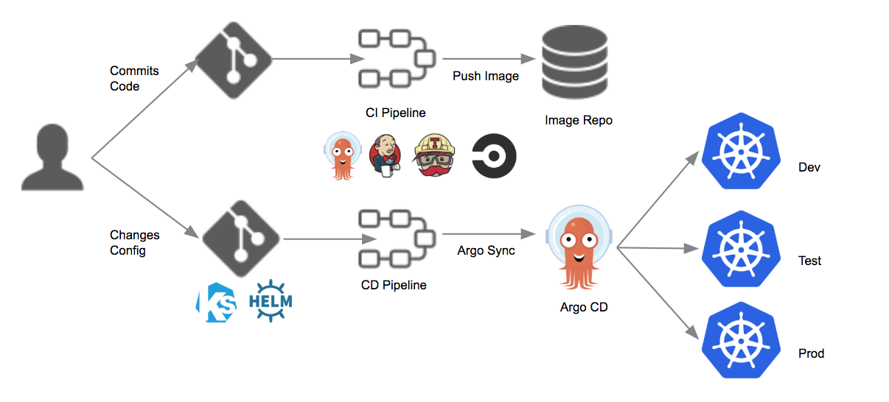
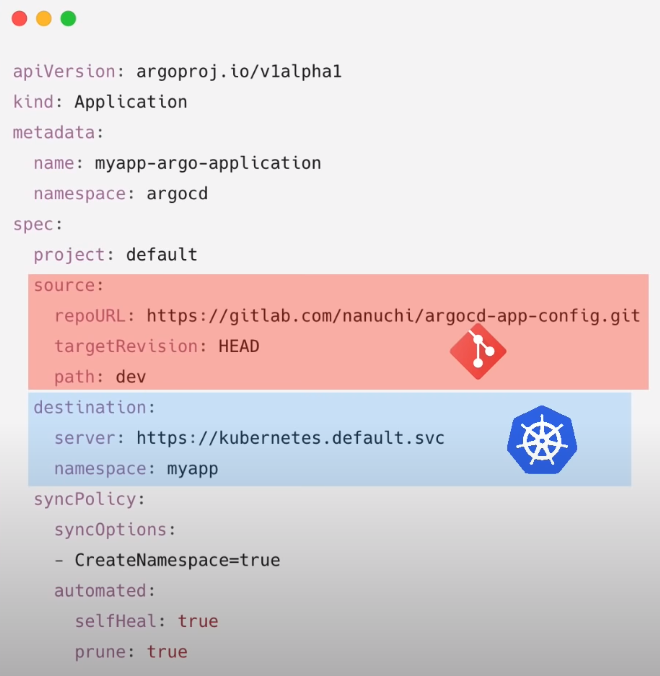

---


> Aplicação de continuos deploy, usada para realizar o deploy de aplicações no kubernetes.
> 
> Estamos acostumado com o formato padrão de pipeline do jenkins onde temos um fluxo único para o CI e CD. No caso do argoCD temos uma pipeline especifica para cada itens, sendo uma especifica para o processo de Continuos Delivery que é usada pelo argo.



---

### Instalação

> Diferentemente de outras ferramentas de Continuos delivery  o ArgoCD tem uma particularidade que é o fato dele ser implantado no cluster do kubernetes. Na verdade ele é uma extensão do kubernetes, pois usa a maioria da ferramentas dele.
> 
> - Isso tem diversas vantagens tais como:
>   - Visibilidade do processo, coisa que o Jenkins não tem por ser um processo externo.
>   - Tem um interface gráfica que mostra o processo em tempo real.

1. Para instalar o ARGOCD devemos criar um yaml file

> Neste informamos qual:
> 
> - vai ser no repo onde vão estar os deployments.
> - vai ser o cluster kubernets, onde serão aplicados os deployments.



---

### Tutoriais

- [ArgoCD Tutorial for Beginners](https://www.youtube.com/watch?v=MeU5_k9ssrs)

- [Documentação](https://argo-cd.readthedocs.io/en/stable/getting_started/)

---

#### Usando e configurando

```shell
# cria o namespace do argo
kubectl create namespace <namespace> 
kubectl create namespace argocd

# Para instalar o argo no namespace
kubectl apply -n <namespace> -f https://raw.githubusercontent.com/argoproj/argo-cd/stable/manifests/install.yaml
kubectl apply -n argocd -f https://raw.githubusercontent.com/argoproj/argo-cd/stable/manifests/install.yaml

# Para remover argo
kubectl delete -n <namespace>  -f https://raw.githubusercontent.com/argoproj/argo-cd/stable/manifests/install.yaml
kubectl delete -n argocd -f https://raw.githubusercontent.com/argoproj/argo-cd/stable/manifests/install.yaml

## Acessando externamente
# 1 - Para acessar mude o serviço do argo-serve com o comando abaixo
kubectl patch svc argocd-server -n <namespace>  -p '{"spec": {"type": "LoadBalancer"}}'
kubectl patch svc argocd-server -n argocd -p '{"spec": {"type": "LoadBalancer"}}'

# 1.1 - depois de o comando para abrir o serviço
minikube service argocd-server -n <namespace> 
minikube service argocd-server -n argocd

# 1.3 Ou use o comando abaixo para liberar a porta
kubectl port-forward svc/argocd-server -n <namespace>  8080:443
kubectl port-forward svc/argocd-server -n argocd 8080:443


## Login Via UI
# Usuario padrão é admin 
# Para pegar a senha use
kubectl -n <namespace> get secret argocd-initial-admin-secret -o jsonpath="{.data.password}" | base64 -d; echo
kubectl -n argocd get secret argocd-initial-admin-secret -o jsonpath="{.data.password}" | base64 -d; echo


## Login via CLI
# instale o cli - https://argo-cd.readthedocs.io/en/stable/cli_installation/
# Usuario padrão é admin 
# Para pegar a senha use
kubectl -n <namespace> get secret argocd-initial-admin-secret -o jsonpath="{.data.password}" | base64 -d; echo
kubectl -n argocd get secret argocd-initial-admin-secret -o jsonpath="{.data.password}" | base64 -d; echo

# Use o comando abaixo - ARGOCD_SERVER é o ip e porta exporto externamente
argocd login <ARGOCD_SERVER>
argocd login 192.168.49.2:30634


# Para altera a senha  #Nova senha - unisenha
argocd account update-password


# -------------------Register A Cluster To Deploy Apps To

# Listando os contextos validos
kubectl config get-contexts -o name

# Configurando um contexto para deploy
argocd cluster add <contexto>
argocd cluster add minikube
```


- Usuario

```shell
User: admin
Senha: unisenha
```
