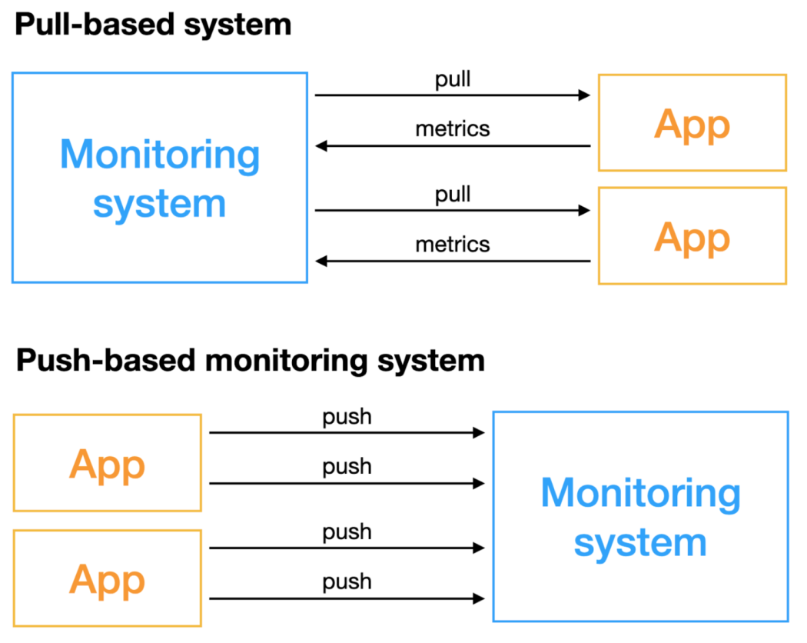
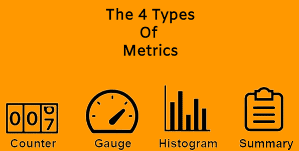

### Conceito iniciais

> - Trabalha com metricas e alertas para monitorar sistemas.
> - Toolkit de **monitoramento** e **alerta** de sistema **open sourc**e.
> - Criado pela **SoundCloud**, Agora faz parte da **Cloud Native Computer Foundation**.
> - Captura e armazenamena dados em formatos dimensionais.
> - Tem coletas poderosas com o PromQL.
> - Usado em conjunto com o **Grafana**.
> - Tem diversas soluções para integrações.


---

### Dinâmica de funcionamento




há duas forma de funcionamento:

- Sistema baseado em Pull.

  - Um agente do **serviço de monitoramento** recupera os dados da **aplicação**.
  - Muito usado com a **Stack do ELK**.

- Sistema baseado em Push.

  - A **aplicação** envia os dados para um agente do **serviço de monitoramento**.
  - Modelo usado pelo **Prometheus**.
  - Recupera metricas via **http**. a aplicação deve disponibilizar uma endpoint **/metrics** no formato do Prometheus.
  - Configura-se **targets** para recuperar de tempos em tempos.
  - Consegue recuperar metricas de aplicação , banco de dados, sistemas operacionais. Para isso existe um conjunto de SDK e **exports** para isso.

- **Exports**

  

  - Fornece um **endpoint** de coleta de **metricas** para **aplicações**, **sistemas operacionais** e **banco de dados**.
  - Serve como **intermediário** para a coleta de metricas.


---

### Arquitetura do Prometheus


Na arquitetura do **Prometheus temos**:

- **Prometheus server**
  - **Retrival** - Componente que **orquesta** o processo de recebimento de metricas e o armazenamento na base de adados
  - **TSDB** - Base de dados do tipo de serie de tempos (**timeseries** database).
  - **Http Server** - Servidor de web, onde fica exporto **endpoints** para recuperar as metricas salvas e as metricas do proprio **Prometheus**.
- **Service discovery**
  - Em arquiteturas de **microserviços** pode haver varias instâncias para o **prometheus** monitorar, por isso o **Retrival** tem a capacidade de se conectar a services discoverys para descobrir quais instancias ele deve recuperar as **metricas**.
- **PushGateway**
  - Serve para agrupar as **metricas de varias** soluções em um só lugar para se recuperado pelo **prometheus**.
  - Usado em serviços que executam em **janelas de execução variadas** e que encerram após isso, nesse caso ao executar esses serviços envias as **metricas** para esse **push gateway** que armazena **temporariamente** para o **prometheus**.
- **Prometheus targets**
  - São os **endpoints** de metricas dos serviços que o **prometheus** vai realizar pull (scraping) de tempos em tempos através **Retrival** .
- **Alert manager**
  - Permite configurar **thresholds** e **ações** (alertas) para as metricas.
  - Recebe atualização das metricas de **tempos em tempos** do prometheus.
  - Pode executar **ações (alertas)** como enviar **e-mails** ou acionar outros **serviços de notificação.**
- **PromQL**
  - Permite executar **querys** com as metricas através da **Prometheus Web UI** ou do **Grafana**.
  - Usando o **Http Server** explicado anteriormente.
- **Grafana**
  - Sistema que permite montar **dashboards** com as métricas coletadas pelo **prometheus**.
  - Realiza queries usando o **PromQL** no **Http Server** do prometheus para recuperar as métricas.


---

### Trabalhando com dados

- Armazenamento
  - **TSDB** (Time Series Database).
  - Os dados mudam conforme o tempo.
  - Trabalha com **label** para adicionar propriedades a métricas.
  - **Otimizado** para esse caso, o que melhora a **performance**.
  - Para dados mais **antigos** há um **compressão** para liberar armazenamento, por isso talvez não sejam tão precisos.


---

### Tipos de métricas



- **Counter** - é um **contador**, tem o valor **incremental**, sempre aumenta.
  - Quantidade de visitas, erros, clique em um botão.
- **Gauge** - é uma métrica que varia com o tempo. pode aumentar, diminuir ou estabilizar.
  - Uso de cpu, de memoria. Quantidade de usuários ativos.
- **Histogram** - é uma métrica que permite a distribuição de frequência.
  - Baseado em amostra, possível agregar valores baseados nas propriedades.
  - Quem gerar o histograma é o cliente.
- **Summary** - é uma métrica que permite a distribuição de frequência.
  - Similar ao **histogram**, porém nessa quem calcula a distribuição é o **prometheus**.
  - Retorna os dados mais brutos para o **prometheus** e ali se cria a distribuição de frequência.


---

### PromQL

- Prometheus query language. (SQL do **prometheus**).
- Usado para consultar dados no **prometheus**.


---
###  Treinando

- Acesse a pasta *treinando*

- De os comando abaixo para subir o prometheus.

- ```shell
  # Para subir os container
  docker-compose up -d
  
  # Para ver os logs do prometheus
  docker-compose logs -f prometheus
  
  # Para ver os logs do node export
  docker-compose logs -f node-exporter
   
  ```


continuar -> https://prometheus.io/docs/concepts/metric_types/


---

### Dashboards com Grafana